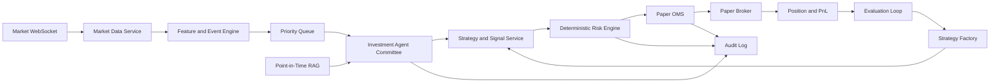

# Personal Hedge Fund Agent - Core Implementation Plan

> 문서 상태: Lean Core Plan v1.4
> 최상위 기준: [HEDGE_FUND_MASTER_PLAN.md](../HEDGE_FUND_MASTER_PLAN.md)  
> 제품 안내: [README.md](../README.md)  
> Domain 계약: [MINIMUM_SERVICE_UNIT_SPEC.md](MINIMUM_SERVICE_UNIT_SPEC.md)  
> 기능 구현 Backlog: [HEDGE_FUND_IMPLEMENTATION_BACKLOG.md](../02-engineering/HEDGE_FUND_IMPLEMENTATION_BACKLOG.md)  
> 기술 스택 결정: [TECH_STACK_DECISIONS.md](../02-engineering/TECH_STACK_DECISIONS.md)  
> 운영 Frontend: [AI_OFFICE_FRONTEND_PLAN.md](../02-engineering/AI_OFFICE_FRONTEND_PLAN.md)
> 목표: 한 명의 사용자를 위한 전 종목 실시간 Multi-Strategy Paper Trading Investment Agent의 핵심 폐쇄 루프를 16주 안에 완성한다.  
> 원칙: 장기 비전은 버리지 않되, 수익 아이디어 발굴부터 Paper 주문과 사후평가까지 하나의 폐쇄 루프를 먼저 완성한다.

## 1. 제품 정의

사용자가 투자 Mandate를 설정하면 시스템이 다음 업무를 대신 수행하는 개인형 Hedge Fund Investment Agent를 만든다.

전략 방향은 Long-only로 고정하지 않는다. 현재 수집 데이터와 Paper 실행 능력으로 검증 가능한 Long/Short, Market Neutral, Event Driven, Momentum, Mean Reversion과 Relative Value 후보를 공통 Strategy Contract로 연구한다.

1. 단일 주식시장의 전 종목 실시간 시세를 감시한다.
2. 거래할 가치가 있는 이벤트와 종목을 선별한다.
3. 정형 데이터와 제한된 RAG 근거로 투자 가설을 만든다.
4. 가설을 간단한 전략 규칙으로 변환하고 백테스트한다.
5. 승인된 전략을 Shadow와 Paper 환경에 배포한다.
6. 결정론적 Risk Engine을 통과한 주문만 실행한다.
7. 판단, 주문, 체결, PnL을 기록하고 전략 성능을 재평가한다.

사용자에게는 하나의 투자 에이전트로 보이지만 내부에서는 `Research`, `Portfolio`, `Risk`, `Execution` 책임을 분리한다. 실제 회사의 모든 부서를 구현하는 것이 아니라 투자 폐쇄 루프에 필요한 최소 역할만 구현한다.

## 2. Core 성공 조건

Core는 다음 질문에 실제 동작으로 답할 수 있어야 한다.

> 전 종목 실시간 데이터에서 유의미한 기회를 찾고, 근거 있는 전략으로 검증한 뒤, 위험 한도 안에서 Paper 주문을 실행하고, 그 결과를 다음 판단에 반영할 수 있는가?

성공 조건은 다음과 같다.

- 시장시간 동안 대상 시장 전 종목의 실시간 상태를 유지한다.
- 모든 종목에 대해 경량 특징과 우선순위 점수를 갱신한다.
- 상위 이벤트만 Agent 분석으로 전달한다.
- Agent 판단은 구조화된 Schema와 근거 ID를 가진다.
- 전략은 Point-in-Time Dataset으로 재현 가능한 백테스트를 통과한다.
- 승인된 전략만 Shadow/Paper 상태로 승격된다.
- Risk Engine을 우회해 주문할 수 없다.
- 주문부터 체결, Position, PnL과 전략 성과까지 추적된다.
- 데이터나 모델 장애 시 신규 진입이 자동 차단된다.
- 일일 운용 결과와 전략 상태를 하나의 화면에서 확인할 수 있다.

## 3. 확정 범위

### 3.1 포함

| 영역 | Core 범위 |
|---|---|
| 사용자 | 단일 사용자, 단일 투자 Mandate |
| 시장 | 한국 주식시장 |
| 자산 | 한국 상장주식·ETF의 Paper Long/Short, 준비된 Adapter의 지수선물·옵션 |
| Universe | 거래 가능 전 종목 |
| 실시간 데이터 | LS증권 Open API의 Tick 체결과 10단계 호가 WebSocket |
| 판단 주기 | Tick 수신, 1초 집계, 1분 전략 판단 |
| Agent | Research Analyst, Bull/Bear Reviewer, Portfolio Agent |
| RAG | 한 종류의 승인 문서 Source와 Point-in-Time 검색 |
| 조직 학습 | 본부별 Hermes Memory 경계와 승인형 Improvement Candidate 1개 End-to-End |
| 전략 | Strategy Universe에 등록된 모든 데이터 적격 전략, Core에서는 대표 전략군 Fixture로 계약 검증 |
| Strategy Factory | 가설, Backtest, Registry, Shadow, Paper, Rollback |
| Risk | Position, 주문금액, 일손실, Gross/Net·종목·섹터·Factor Exposure, Borrow/Leverage, Staleness |
| 실행 | Long/Short와 Basket을 표현할 수 있는 Paper Broker Adapter와 OMS |
| 운영 | 실시간 Dashboard, Audit Log, Kill Switch, Daily Report |
| 배포 | 로컬 또는 단일 Cloud 환경, Docker 기반 |

### 3.2 이번 단계에서 제외

- 실제 자금 주문과 Broker Production Certification
- 외부 투자자, 법인 Fund, 공식 NAV와 Investor Reporting
- 실제 대차계약을 사용하는 공매도와 실제 Margin 주문
- Capability가 준비되지 않은 파생상품·Multi-leg Paper/Live 주문
- Compliance, Treasury, Fund Accounting 등 전체 부서 Agent 자동화
- 다수 사용자, 다수 Fund, 다수 PM Pod
- Multi-Region, Active-Active와 고급 DR
- 완전 자동 전략 코드 생성
- 초단타/HFT와 Microsecond Latency
- 복수 Market Data Vendor와 복수 Broker Failover
- 모바일 앱과 외부 고객용 Portal
- 검증·승인 없이 Agent가 자신의 Prompt, Skill, Tool 또는 권한을 바꾸는 기능

제외 항목은 삭제한 요구사항이 아니라 Core 성공 후 검토할 확장 Backlog다.

### 3.3 전략 범위와 구현 범위의 구분

Core는 전략 이름을 제한하지 않지만 모든 전략을 16주 안에 완성한다는 뜻은 아니다.

- `Research Catalog`: 수집 데이터로 가설을 검증할 수 있으면 전략군을 등록한다.
- `Core Contract Fixture`: Long/Short Equity, Market Neutral/Pairs, Event Driven, Quant Trend·Mean Reversion의 대표 Fixture로 공통 계약을 검증한다.
- `Paper Eligible`: Data, Execution, Risk와 Accounting Capability가 모두 준비된 전략만 Paper 주문을 만든다.
- `Live Eligible`: 실제 Borrow, Margin, Broker, 법률과 운영 Gate까지 통과한 전략만 별도 승인한다.

새 전략은 새 Agent 조직을 만드는 대신 `StrategyPlugin`과 `StrategyCapabilityProfile`을 추가하는 방식으로 채택한다.

### 3.4 Core에서 증명할 최소 자기 개선

Core는 거대한 자율 조직 전체를 한 번에 구현하지 않는다. 대신 Hermes를 쓰는 이유가 실제로 검증되도록 다음 한 개의 폐쇄 루프를 필수 범위로 둔다.

```text
Research 또는 QA 업무 완료
  -> Hermes가 근거가 있는 ImprovementCandidate 생성
  -> QA Golden/Adversarial Eval
  -> 인사팀 Build-vs-Extend 검토
  -> Shadow 실행
  -> 승인된 Skill 또는 Profile Version 배포
  -> 품질·비용·지연 관찰
  -> 유지 또는 Rollback
```

첫 대상은 주문 판단보다 위험이 낮고 성공 기준이 명확한 `Research 문서 검증 Skill` 또는 `QA 인용 검사 Skill` 중 하나로 고정한다. 현재 Position, PnL, Risk Limit과 주문 상태는 Hermes Memory가 아니라 공식 Service에서 매번 조회한다. 전략 자동 생성과 조직 전체 자동 재편은 이 Loop가 재현 가능하게 동작한 뒤 확장한다.

## 4. 최소 사용자 경험

### 4.1 Mandate 설정

사용자가 다음 항목을 설정한다.

- 초기 Paper Capital
- 허용 시장과 거래시간
- 종목당 최대 비중
- 섹터 최대 비중
- 일일 최대 손실
- 최대 총 Exposure
- 최대 동시 Position
- Agent 일일 호출 예산
- 자동 Paper 주문 또는 주문 전 사용자 승인

### 4.2 Daily Flow

```text
장전
  -> Universe와 Reference Data 확인
  -> 활성 전략과 Risk Limit 로드
  -> WebSocket와 Paper Broker 연결 점검

장중
  -> 전 종목 실시간 수신
  -> Feature와 Priority Score 갱신
  -> 중요 이벤트만 Agent 분석
  -> Strategy Signal 생성
  -> Risk Gate
  -> Paper OMS 주문
  -> Fill, Position, PnL 갱신

장후
  -> 주문·체결·Position 대사
  -> 전략별 성과와 오류 평가
  -> Daily Report 생성
  -> Drift 또는 손실 기준 위반 전략 중단
```

### 4.3 필수 화면

현재 `ai-office/`의 Pixel Office를 Core 운영 Frontend Baseline으로 사용한다. 첫 화면은 CEO Office, 6개 투자 본부와 Agent Workforce 인사팀의 Queue·Agent·승인·Incident 상태를 보여주는 `Live Office`다. 현재 12개 고정 부서와 Scripted Simulation은 `DEMO` Mode로만 유지하고 실제 서비스 상태로 오인되지 않게 한다.

Core는 다음 View를 구현한다.

- `Live Office`: 8개 조직, Agent 상태, 업무 Queue, Handoff와 Incident
- `Market`: LS Feed 상태, 전 종목 처리량, Gap·Stale과 상위 이벤트
- `Research/Decisions`: Agent 분석, RAG 근거, Bull/Bear 논거, Risk 승인·거절
- `Strategies`: Draft, Backtest, Shadow, Paper, Paused와 Promotion 상태
- `Portfolio`: Position, Cash, Exposure, PnL과 Reconciliation
- `Orders`: Order Intent, 주문, 체결, 취소, 거절과 오류
- `Control`: Trading State, Entry Block, Reduce-only와 Kill Switch
- `Audit/Workforce`: Trace, Finding, Agent Version, 비용과 개선 후보

운영자가 상태를 빠르게 판단하고 통제할 수 있는 화면을 우선한다. Pixel Animation은 공식 상태의 시각 표현이며, Backend Event 없이 업무 상태를 추정하거나 Position·Risk·PnL을 계산하지 않는다. 모든 화면은 `DEMO/PAPER/LIVE`, 마지막 갱신 시각, 연결 상태와 Trading State를 항상 표시한다.

## 5. Core Architecture



### 5.1 최소 서비스 경계

| 서비스 | 책임 | Source of Truth |
|---|---|---|
| Market Data Service | WebSocket, Normalize, Gap/Staleness | Raw Event Archive |
| Feature/Event Engine | 전 종목 특징, 점수, 이벤트 탐지 | Feature Snapshot |
| Investment Agent | 근거 검색, 투자 가설, 반론과 결론 | Decision Record |
| Strategy Factory | Dataset, Backtest, Registry와 Promotion | Strategy Registry |
| Risk/Portfolio | 한도 검사, Target Position, Kill Switch | Risk State |
| Paper OMS | 주문 상태, 멱등성, 체결 반영 | Order Journal |
| Control API/Dashboard | 조회, 승인, 중단과 운영 통제 | 각 Domain API |

처음부터 Microservice로 모두 분리할 필요는 없다. 코드 Module과 Database 책임을 분리하되, 초기 배포는 다음 세 Process로 시작한다.

1. `streaming-worker`: Market Data, Feature, Event
2. `decision-worker`: Agent, RAG, Strategy Evaluation
3. `trading-api`: Risk, Portfolio, OMS, Dashboard API

## 6. 전 종목 실시간 처리

### 6.1 처리 원칙

- 전 종목에 LLM을 호출하지 않는다.
- 모든 종목은 결정론적 Feature와 Score만 지속 계산한다.
- 보유 종목, 미체결 주문, 급격한 시장 이벤트가 최우선이다.
- 상위 N개 이벤트만 Agent Queue로 전달한다.
- Queue가 밀리면 비보유 종목의 낮은 우선순위 분석부터 폐기한다.
- Feed가 오래되면 해당 종목 신규 진입을 차단한다.

### 6.2 Core Feature

- 가격 수익률: 1분, 5분, 20분
- 거래량 Z-score
- Spread 또는 Quote Imbalance
- 당일 고가·저가 거리
- 변동성
- 시장과 섹터 대비 상대강도
- Gap과 Staleness
- 보유 여부와 현재 Exposure

### 6.3 이벤트 유형

- 가격·거래량 급변
- 상대강도 상위 진입
- 변동성 확대
- 보유 종목 손실·위험 임계치 접근
- 승인 문서나 뉴스 Source의 신규 이벤트
- 데이터 품질 또는 Feed 이상

## 7. 최소 Investment Agent

### 7.1 역할

| 역할 | 핵심 질문 | 출력 |
|---|---|---|
| Research Analyst | 왜 지금 이 종목·Pair·Basket을 봐야 하는가? | 가설, 근거, 관계와 반증 조건 |
| Bull/Bear Reviewer | 전략 논리의 강점과 실패 가능성은? | 찬성·반대 논점과 불확실성 |
| Portfolio Agent | 현재 Portfolio에서 어떤 Long/Short·Hedge 목표가 필요한가? | Target Portfolio 제안 |

독립 Risk는 LLM Agent가 아니라 결정론적 Service로 구현한다.

### 7.2 구조화 출력

```json
{
  "scope_instrument_ids": ["..."],
  "event_id": "...",
  "strategy_family": "...",
  "thesis": "...",
  "directionality": "long_short_or_pass",
  "confidence": 0.0,
  "horizon": "intraday_or_swing",
  "evidence_ids": [],
  "invalidation": [],
  "target_portfolio": [
    {"instrument_id": "...", "target_weight": 0.0}
  ],
  "expires_at": "..."
}
```

- Schema 실패는 자동 재시도 후 `PASS` 처리한다.
- Evidence가 없거나 만료된 Decision은 주문 후보가 될 수 없다.
- Agent는 직접 Broker Tool이나 OMS Write 권한을 갖지 않는다.

## 8. 최소 Strategy Factory

Core Strategy Factory는 자유로운 코드 생성 플랫폼이 아니라 공통 계약을 지키는 승인된 `StrategyPlugin` 안에서 다양한 전략군을 탐색하는 시스템으로 제한한다.

### 8.1 전략 Template

```text
Strategy Metadata
  + Required Data Products
  + Required Instruments and Directionality
  + Universe Filter
  + Signal and Entry Conditions
  + Position/Basket Sizing Rule
  + Exit and Rebalance Rule
  + Execution Model
  + Risk and Accounting Model
  + Capacity Limits
```

단일 종목 Long 전략, Long/Short Basket, Pair, Event와 향후 Multi-leg 파생상품 전략이 같은 생명주기와 Audit 계약을 사용한다. 각 Plugin의 계산 방식은 달라도 Signal, Target Portfolio, Risk Request와 Evaluation 출력은 공통 Schema를 따른다.

### 8.2 생명주기

```text
DRAFT -> BACKTESTED -> APPROVED -> SHADOW -> PAPER -> PAUSED/REJECTED
```

Core에서는 `PAPER` 이후 자동 Live 승격이 없다.

### 8.3 Promotion Gate

- Dataset Manifest와 Point-in-Time 검증
- 거래비용과 Slippage 반영
- In-sample/Out-of-sample 분리
- 최소 거래 수
- 최대 Drawdown 한도
- Benchmark 대비 성과
- 전략 집중도와 Turnover
- Shadow 최소 관찰기간
- 사용자 승인

### 8.4 자동화 범위

Agent가 할 수 있는 일:

- 가설 제안
- Template Parameter 후보 생성
- Backtest Job 요청
- 결과 요약과 실패 원인 분류
- Shadow 승격 제안
- Drift와 중단 제안

Agent가 할 수 없는 일:

- 임의 Python을 Production에서 실행
- 검증 Gate 변경
- 자기 전략을 직접 승인
- Live 자금에 자동 승격
- Risk Limit 확대

## 9. Risk와 Paper OMS

### 9.1 주문 전 Risk

- Market/Session 상태
- Data Freshness
- 종목 거래 가능 여부
- 주문금액과 수량
- 종목당 최대 비중
- 섹터 Exposure
- 총 Gross/Net Exposure
- 최대 동시 Position
- 일일 손실과 Drawdown
- 중복 주문과 미체결 주문

검사 결과는 `APPROVE`, `RESIZE`, `REJECT` 중 하나다.

### 9.2 거래 상태

```text
NORMAL -> ENTRY_BLOCKED -> REDUCE_ONLY -> HALTED
```

- Feed Gap, Position 불일치, 일손실 초과 시 자동 하향 전환한다.
- 상태 상향은 원인 해소와 사용자 승인을 요구한다.
- Kill Switch는 모든 신규 주문을 막고 미체결 주문을 취소한다.

### 9.3 OrderIntent와 OMS 상태

```text
OrderIntent:
DRAFT -> RISK_PENDING -> APPROVED | RESIZED | REJECTED | EXPIRED
APPROVED | RESIZED -> READY_TO_SUBMIT

Broker Order:
CREATED -> SUBMITTED -> ACKNOWLEDGED -> PARTIALLY_FILLED -> FILLED
... -> CANCEL_PENDING -> CANCELLED
SUBMITTED -> REJECTED
Broker 상태 불명확 -> UNKNOWN
```

Risk 승인은 Order 상태가 아니라 `risk_decision_id` 제출 전제조건이다. 사용자 승인이 필요한 Mandate는 `USER_PENDING -> USER_APPROVED`를 OrderIntent 승인 흐름에만 추가한다. `UNKNOWN`이면 신규 주문을 차단하고 Broker Reconciliation을 실행한다.

모든 Command는 Idempotency Key를 가지며 재시작 후 주문 상태를 복구할 수 있어야 한다.

## 10. 최소 데이터와 저장소

| 데이터 | 초기 저장 | 목적 |
|---|---|---|
| Tick/호가 시계열 | 별도 TimescaleDB | 리서치·퀀트의 Replay와 시계열 조회 |
| Raw/장기 Archive | Parquet + Supabase private Storage | 재처리, 백테스트와 장기 보존 |
| 운영·거버넌스 원장 | Supabase PostgreSQL | Strategy, Decision, Order, Fill, Position, 승인 상태 |
| 문서/RAG Metadata | Supabase PostgreSQL + pgvector | Point-in-Time 근거 검색 |
| Hot State/Event Bus | Redis + Redis Streams | 최신 Quote, Feature, Dedup과 비동기 전달 |
| Audit | Append-only Event + DB Index + private Storage | Decision-to-Order 추적 |

Cloud Provider와 Managed Service는 Core 시작 전에 확정할 필요가 없다. Domain Interface를 유지하고 로컬 Docker 환경에서 먼저 End-to-End Loop를 완성한다.

## 11. 권장 초기 기술 스택

| 영역 | 선택 |
|---|---|
| 언어 | Python 3.12 |
| API | FastAPI |
| 비동기 | asyncio |
| Schema | Pydantic |
| 운영 DB | Supabase PostgreSQL + pgvector |
| 시계열 DB | 별도 TimescaleDB, 리서치·퀀트만 직접 접근 |
| Queue/Hot State | Redis + Redis Streams, P0 필수 |
| Agent Orchestration | Hermes Agent Adapter |
| Workflow | LangGraph StateGraph + 결정론적 Domain State Machine |
| Backtest | vectorbt Adapter 우선, Dataset Manifest 고정 |
| UI | `ai-office` 기반 Next.js + React + TypeScript |
| 관측성 | 구조화 Log + OpenTelemetry + Prometheus |
| 배포 | Docker Compose, CI |

P0 Event Bus는 Redis Streams로 고정한다. Process 내부 Queue는 Unit Test와 단일 Process 개발 Profile에서만 허용한다. Kafka 계열은 단일 Node 구조가 실제 처리량이나 Replay 요구를 충족하지 못할 때 도입한다.

## 12. 16주 구현 로드맵

### Phase 0. 범위 확정 - 1주

- LS증권 계정·WebSocket 운영 조건과 Paper Broker 결정
- 한국 상장주식·ETF Multi-Strategy Paper Mandate와 Short/Borrow Simulation 규칙 확정
- 대표 전략군 Fixture와 공통 `StrategyPlugin` 계약 선정
- Event/Decision/Order Schema 확정
- 완료 기준: ADR과 End-to-End Acceptance Scenario 승인

### Phase 1. Market Data와 Universe - 2~4주

- WebSocket Adapter와 재연결
- Instrument Master와 거래 가능 Universe
- Normalize, Sequence Gap, Staleness
- Raw Archive와 Replay
- 완료 기준: 전 종목 장중 수신과 1일 Replay

### Phase 2. Feature와 Event Engine - 5~6주

- Core Feature 계산
- Priority Score와 Event Queue
- Load Shedding
- Market Dashboard
- 완료 기준: Peak 예상치 2배 입력에서 데이터 유실 없이 우선순위 처리

### Phase 3. Agent와 RAG - 7~8주

- 승인 Source 한 종류 수집
- Point-in-Time Retrieval
- Research/Bull-Bear/Portfolio Workflow
- 구조화 Decision과 Audit
- 본부별 Hermes Memory Namespace와 금지 데이터 정책
- ImprovementCandidate → QA Eval → Shadow → 승인 Skill Version의 최소 자기 개선 Loop
- 완료 기준: Event-to-Decision 재현과 Evidence 추적

### Phase 4. Risk, OMS와 Portfolio - 9~10주

- Risk Gate와 거래 상태
- Paper Broker Adapter
- OMS 상태 머신
- Position, Cash와 PnL
- Kill Switch
- 완료 기준: 중복 주문 0건, 재시작 복구, Risk 우회 불가

### Phase 5. Strategy Factory - 11~13주

- StrategyPlugin, Capability Profile과 Dataset Manifest
- Backtest와 비용 모델
- Registry와 Promotion Gate
- Shadow/Paper 배포와 Rollback
- 완료 기준: 서로 다른 대표 전략군이 같은 계약으로 가설에서 Paper 배포까지 완전한 Lineage를 가짐

### Phase 6. 통합 운영 - 14~16주

- Daily Open/Close Workflow
- Strategy/Portfolio/Order Dashboard
- 장애·Replay·부하 Test
- Daily Report와 성과 평가
- 10거래일 연속 Paper Dry Run
- 완료 기준: 아래 Core Launch Gate 전체 통과

## 13. Core Launch Gate

- [ ] 대상 시장 전 종목 Feed가 시장시간 동안 안정적으로 유지된다.
- [ ] Gap, Staleness와 재연결 상태를 탐지한다.
- [ ] 전 종목 Feature와 Priority Score를 목표 지연 안에 계산한다.
- [ ] Agent Queue 과부하가 Streaming과 Risk/OMS에 영향을 주지 않는다.
- [ ] 모든 Decision에 Event, Feature Snapshot과 Evidence ID가 연결된다.
- [ ] 미래 데이터 유입 없는 Backtest와 Replay를 통과한다.
- [ ] Strategy Artifact와 Dataset Version을 재현할 수 있다.
- [ ] 각 Strategy Version의 Data·Instrument·Execution·Risk·Accounting Capability를 검사한다.
- [ ] Long/Short, Market Neutral, Event Driven과 Quant 대표 Fixture가 같은 Registry·Backtest·Risk 계약을 통과한다.
- [ ] 승인되지 않은 Strategy가 Paper 주문을 생성할 수 없다.
- [ ] 모든 주문이 결정론적 Risk Gate를 통과한다.
- [ ] OMS가 재시작 후 주문과 Position을 복구한다.
- [ ] Feed/Position/Risk 이상 시 Entry가 자동 차단된다.
- [ ] Kill Switch와 미체결 주문 취소가 검증된다.
- [ ] Hermes Memory를 비워도 공식 Position·Cash·PnL·Risk 상태가 손실되지 않는다.
- [ ] 개선 후보 한 건이 독립 Eval, Shadow, 승인, 배포와 Rollback까지 같은 ID로 추적된다.
- [ ] 10거래일 연속 치명적 장애 없이 Paper Dry Run을 완료한다.
- [ ] 일일 Report에서 전략별 PnL, Drawdown, Turnover와 오류를 확인할 수 있다.

## 14. Core KPI

### 시스템

- Feed Uptime과 Reconnect 횟수
- Event Processing p95/p99 지연
- Sequence Gap과 Stale Symbol 수
- Agent Queue 지연과 분석 완료율
- Order 상태 불일치와 중복 수

### 투자 프로세스

- 탐지 Event 대비 분석·Signal 전환율
- Strategy Backtest 재현율
- Shadow/Paper 성과 차이
- Slippage와 Turnover
- 최대 Drawdown과 Risk Reject율
- 전략별 PnL과 Benchmark 대비 성과

### 비용

- 일일 Market Data 비용
- Agent Decision당 LLM 비용
- Strategy Experiment당 Compute 비용
- Paper 주문 1건당 총 시스템 비용

수익률만으로 Core 성공을 판단하지 않는다. 먼저 데이터, 판단, 주문과 성과가 연결된 신뢰 가능한 운용 루프를 완성해야 한다.

## 15. Core 이후 확장 순서

Core Launch Gate 통과 후 다음 순서로 Capability를 넓힌다.

1. Strategy Family별 Champion/Challenger와 Multi-Strategy 자본 배분
2. Independent Reconciliation과 강화된 Ledger
3. 실제 Borrow Feed와 제한된 Equity Long/Short Certification
4. 두 번째 Market Data Source 또는 Broker
5. 선물 Trend·Basis·Hedge Overlay
6. 옵션 Volatility·Defined-Risk Spread와 Tail Hedge
7. Macro/Managed Futures와 추가 시장 데이터
8. 제한된 자기자본 Live Trading
9. 부서별 Agent Automation
10. Multi-Account/Fund와 외부자금 운영
11. Multi-Region DR와 Production 조직 확장

각 확장은 직전 단계의 성능과 통제 안정성을 훼손하지 않는 경우에만 승인한다.

## 16. 지금 결정할 항목

구현 시작 전 결정 상태는 다음과 같다.

**확정**

1. 첫 시장과 자산: 한국 상장주식·ETF Multi-Strategy Paper, 실제 Short·Derivatives는 Capability Gate 적용
2. 가격 공급자와 초기 Feed: LS증권 Open API의 Tick 체결과 10단계 호가 WebSocket
3. 저장소 경계: Supabase 운영 원장, 별도 TimescaleDB 리서치·퀀트 전용, Redis Streams P0
4. Frontend Baseline: `ai-office`의 Next.js·React·TypeScript와 Pixel Office를 8개 조직의 실시간 Operator Control Plane으로 발전

**미확정**

1. Paper/Live Broker와 주문 Adapter
2. 첫 활성 Strategy Portfolio의 구성과 전략군별 Champion 수
3. 자동 Paper 주문 여부와 사용자 승인 방식
4. 전체 Cloud Provider와 Frontend Production Hosting
5. 16주 동안 허용할 월별 Data, LLM과 Infrastructure 예산

Cloud Provider, 파생상품, 외부자금 법인 구조와 전체 부서 설계는 Core 개발의 선행조건이 아니다.

## 17. 최종 Core 목표

> 단일 사용자의 투자 Mandate 아래 한 시장의 전 종목을 실시간 감시하고, 중요한 기회를 멀티 에이전트가 분석하며, 검증된 전략만 결정론적 Risk Gate와 Paper OMS를 통해 실행한다. 전략 발굴, Point-in-Time 백테스트, Shadow/Paper 배포, 주문, 체결, PnL과 사후평가를 하나의 감사 가능한 폐쇄 루프로 연결함으로써 나만의 Hedge Fund Investment Agent가 실제로 작동한다는 것을 먼저 증명한다.
