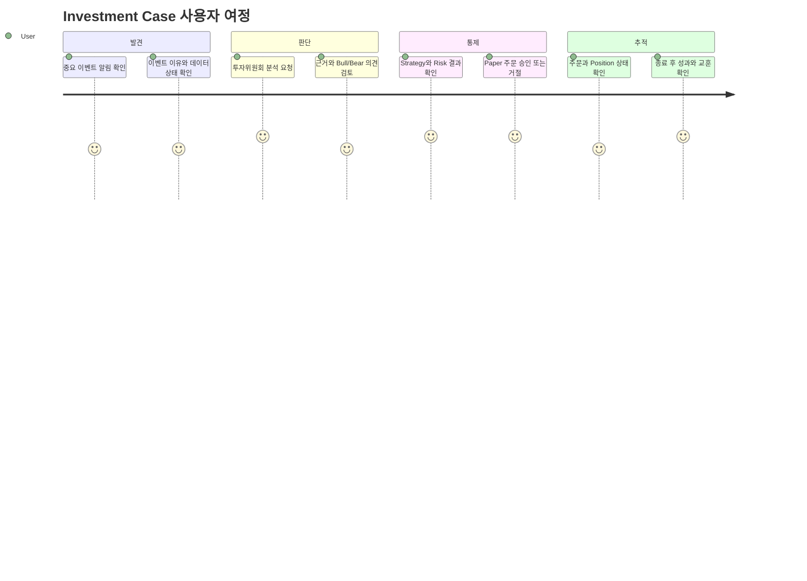
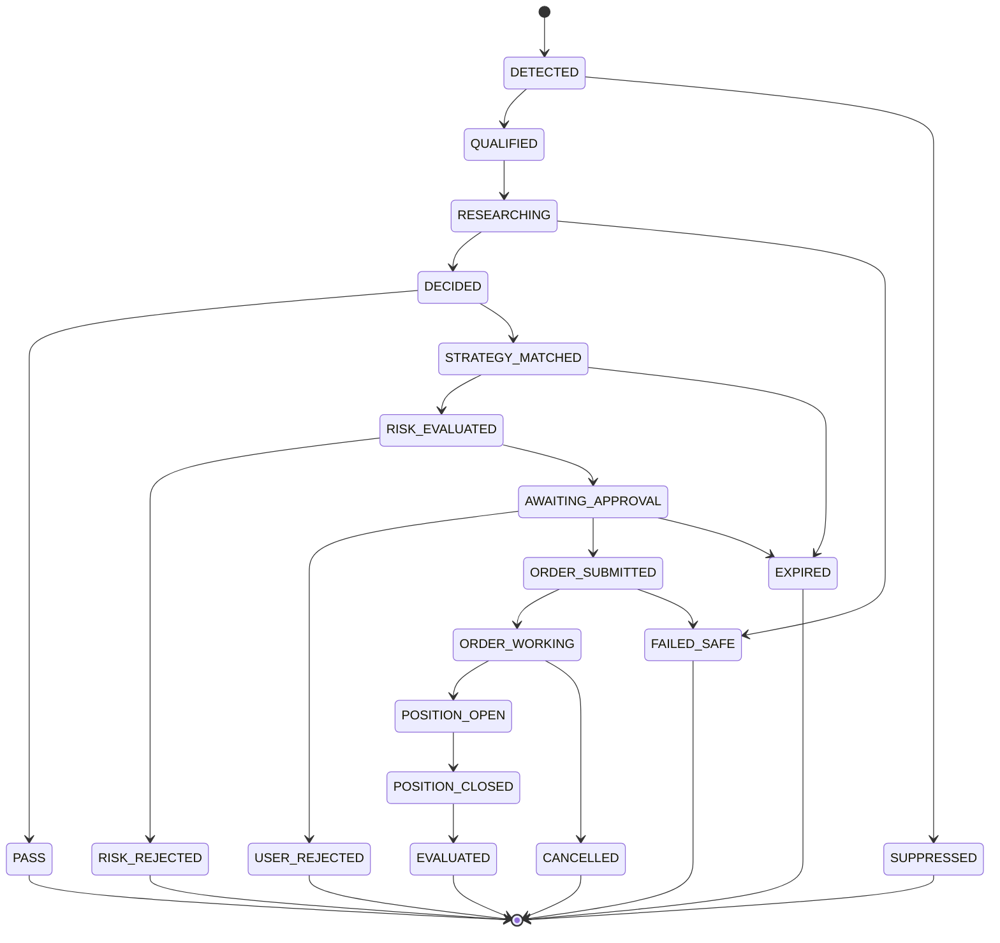

# Investment Case - Minimum Service Unit Specification

> 2026-08-04 승인 보강: `POST /investment-cases/{case_id}/qa-check`는 QA Evidence Gate v1의 확정 계약이다. production은 `QA_CHECK_CONTRACT_APPROVED=true`로 명시 활성화하고, 결정론적 EvidenceQaEngine이 binding verdict를 만든다. 정책 Corpus가 placeholder이거나 운영 Trace Profile FK가 없으면 자동 PASS가 아니라 ESCALATE/HOLD로 종료한다.

> 문서 상태: Confirmed Core Domain and Service Specification v1.3
> 최상위 기준: [HEDGE_FUND_MASTER_PLAN.md](../HEDGE_FUND_MASTER_PLAN.md)  
> 결정: 우리 서비스의 최소 가치 단위는 `Investment Case`다.  
> 상위 구현 범위: [HEDGE_FUND_CORE_PLAN.md](HEDGE_FUND_CORE_PLAN.md), [HEDGE_FUND_IMPLEMENTATION_BACKLOG.md](../02-engineering/HEDGE_FUND_IMPLEMENTATION_BACKLOG.md)  
> Frontend 표현 기준: [AI_OFFICE_FRONTEND_PLAN.md](../02-engineering/AI_OFFICE_FRONTEND_PLAN.md)
> 목적: Event부터 평가까지 반드시 함께 구현해야 하는 기능, 데이터와 책임을 하나의 단위로 고정한다.

## 1. 최종 정의

> **Investment Case는 하나의 시장 이벤트를 사용자의 위임 아래 조사하고, 근거와 반론을 포함한 투자 판단으로 만들고, 승인된 Strategy와 독립 Risk Gate를 거쳐 실행 여부를 결정하고, 주문·체결·성과 또는 미실행 사유까지 기록하는 하나의 완결된 투자 업무 단위다.**

`하나의 시장 이벤트`가 반드시 종목 하나와 매수 주문 하나를 뜻하지는 않는다. Pair, Long/Short Basket, Portfolio Hedge나 Multi-leg 전략은 관련 Instrument와 주문을 하나의 Case Scope로 묶는다. 따라서 Investment Case 계약은 전략 방향과 Leg 수에 중립적이어야 한다.

쉽게 말하면 다음 질문 하나에 처음부터 끝까지 답하는 기록이다.

> `왜 이 종목을 지금 검토했고, 어떤 사실과 전략을 사용했으며, 왜 거래했거나 거래하지 않았고, 결과는 어땠는가?`

## 서비스 관점에서 Investment Case란 무엇인가

기술적으로 Investment Case는 여러 ID와 상태를 묶는 Domain Object다. 사용자 관점에서는 **시장 기회 하나를 대신 조사하고, 판단하고, 통제하고, 끝까지 관리해 주는 하나의 투자 업무 서비스**다.

사용자가 받는 것은 Agent의 답변 한 문장이 아니다.

```text
기회 발견 알림
  + 왜 중요한지 설명
  + 관련 사실과 반대 근거
  + Portfolio에 미치는 영향
  + 실행 가능한 Strategy 제안
  + Risk 승인 또는 거절 이유
  + Paper 실행 결과
  + 사후 성과와 교훈
```

이 묶음 전체가 Investment Case라는 하나의 서비스 결과다.

### 서비스가 해결하는 사용자 문제

| 사용자의 문제 | Investment Case가 제공하는 해결 |
|---|---|
| 시장 전체를 계속 볼 수 없다. | 중요한 Event를 자동 탐지해 Case로 생성한다. |
| 가격이 움직인 이유를 빠르게 조사하기 어렵다. | RAG가 당시 뉴스·공시를 Evidence Pack으로 제공한다. |
| 한쪽 주장에 쉽게 확신하게 된다. | Bull/Bear 역할이 찬성·반대 논리를 함께 보여준다. |
| 투자 의견을 실제 규칙으로 옮기기 어렵다. | 승인 Strategy가 목표 비중과 OrderIntent로 변환한다. |
| 감정적으로 투자 규모를 키울 수 있다. | 독립 Risk Service가 Mandate를 기준으로 제한한다. |
| 나중에 왜 거래했는지 기억하기 어렵다. | Event부터 PnL까지 Timeline을 보존한다. |
| 어떤 전략이 실제로 유효한지 알기 어렵다. | Case 결과를 Strategy별 성과와 실패 유형으로 집계한다. |

### 사용자에게 약속하는 서비스 결과

모든 Case는 사용자에게 다음 중 하나를 명확히 알려줘야 한다.

1. **지금은 분석할 가치가 없다.**
2. **분석했지만 거래할 근거가 부족하다.**
3. **투자 의견은 있지만 Strategy 조건과 맞지 않는다.**
4. **거래 후보지만 Risk 한도를 넘는다.**
5. **Paper 주문 승인이 필요하다.**
6. **Paper 주문이 실행됐고 현재 결과는 이렇다.**
7. **Case가 종료됐고 판단과 Strategy의 성과는 이렇다.**
8. **데이터나 시스템 문제로 안전하게 중단됐다.**

`판단 중입니다` 상태에 무기한 머무르거나, 실패 후 아무 설명 없이 사라지는 Case는 허용하지 않는다.

## 사용자 서비스 여정



### 1. Case 발견

사용자는 Market Radar나 Hermes 알림에서 중요한 Case를 확인한다.

```text
[새 Investment Case]
AAA 가격·거래량 급변
Priority: 0.91
1분 수익률: +2.4%
거래량 Z-score: 3.8
데이터 상태: 정상
```

사용자는 이 단계에서 직접 종목을 검색하지 않아도 된다. 서비스가 먼저 중요한 일을 찾아서 설명한다.

### 2. Case 분석

사용자는 `분석 시작`을 선택하거나 Mandate에 따라 자동 분석을 허용한다.

서비스는 다음을 하나의 위원회 보고서로 제공한다.

- Market Feature 요약
- 관련 뉴스·공시와 원문 링크
- Bull Case
- Bear Case
- 핵심 불확실성
- 명제 무효화 조건
- Portfolio Agent의 Target Weight

### 3. Strategy와 Risk 확인

사용자는 Agent의 Confidence만 보는 것이 아니라 다음 정보를 함께 본다.

```text
적용 Strategy: event_momentum_long v1
요청 비중: 5%
종목 한도: 10%
현재 Gross Exposure: 20%
주문 후 Gross Exposure: 25%
Risk 결과: APPROVE
```

Risk가 거절하면 실행 버튼 대신 거절 이유와 가능한 안전한 대안을 보여준다.

```text
Risk 결과: REJECT
사유: MAX_SYMBOL_WEIGHT
요청 비중: 15%
허용 한도: 10%
가능한 다음 행동: 주문 포기 / 10% 이하로 재제안
```

### 4. 사용자 승인

초기 Core의 자동 전략 Paper 주문에는 사용자 승인을 요구한다. 로컬 고정 fixture
사용자의 명시적 `USER_DIRECTIVE`는 그 지시 자체가 별도 authority이며
[ADR-0007](../02-engineering/adr/0007-authenticated-user-paper-directive-authority.md)의
기계적 admission을 따른다.

승인 화면에는 최소 다음 항목을 표시한다.

- 종목과 매수·청산 방향
- 수량, 기준가격과 예상 주문금액
- Strategy Version
- Risk 결과
- 예상 최대 Position 비중
- Signal과 Approval 만료시각
- 핵심 Thesis와 실패 조건

사용자는 `승인`, `거절`, `축소 요청`, `Case 보류` 중 하나를 선택한다.

### 5. 실행 추적

승인 후 서비스는 단순히 `주문 완료`라고 말하지 않는다.

```text
ORDER_SUBMITTED
  -> ACKNOWLEDGED
  -> FILLED 100/100
  -> POSITION_OPEN
```

사용자는 주문 수량, 체결가격, Slippage, Commission, Position 비중과 최신 PnL을 확인한다.

### 6. Case 종료와 평가

Position이 종료되면 사용자는 다음 보고를 받는다.

- 순수익률과 비용 차감 후 수익률
- 최대 유리·불리 가격 움직임
- Thesis가 유지됐는지
- 실패 조건이 발생했는지
- Backtest 예상과 Paper 결과 차이
- Strategy 유지·수정·중단 제안

거래하지 않은 Case도 이후 가격 경로를 표본 평가해 `놓친 기회`, `정확한 PASS`, `Risk가 방지한 손실`을 구분한다.

## 사용자에게 보이는 서비스 화면

### 0. Live Office

**목적**: CEO Office, 6개 본부와 Agent Workforce 인사팀 중 어느 조직이 Case를 처리하고 어디에서 승인·차단·Handoff가 발생했는지 보여준다.

Pixel Office의 Agent 이동은 `case_id`, Department Queue, Workflow State와 Heartbeat의 시각 Projection이다. 움직임 자체가 Case 상태를 바꾸지 않으며, 사용자가 방이나 Agent를 선택하면 아래 Market Radar, Case Inbox와 Case Detail로 이동한다.

### 1. Market Radar

**목적**: 지금 사용자가 봐야 할 Case를 우선순위로 보여준다.

**핵심 정보**

- 신규·진행·주의 Case 수
- 종목, Event 유형과 Priority
- Feature 변화와 데이터 상태
- 보유 Position 관련 여부
- 분석 시작 여부

### 2. Case Inbox

**목적**: 사용자 Action이 필요한 Case를 모아 보여준다.

```text
분석 필요
승인 대기
Risk 거절 검토
주문 진행 중
Position 관리 필요
평가 완료
```

### 3. Case Detail

**목적**: 하나의 Case를 처음부터 끝까지 설명한다.

```text
Summary
Evidence
Committee
Strategy
Risk
Execution
Outcome
Timeline
```

### 4. Portfolio

**목적**: 개별 Case가 전체 자본에 미치는 영향을 보여준다.

- Cash, Position과 PnL
- 종목·섹터 Exposure
- Case별 Position 연결
- Strategy별 자본과 성과
- 현재 Risk 한도 사용량

### 5. Control Center

**목적**: 사용자가 Agent보다 높은 통제 권한을 행사한다.

- 자동 분석 On/Off
- Paper 주문 승인 정책
- Strategy Pause
- `ENTRY_BLOCKED`
- `REDUCE_ONLY`
- Kill Switch

## Hermes를 통한 서비스 경험

화면 없이도 Hermes와 다음처럼 동일한 서비스를 이용할 수 있어야 한다.

### Case 발견

```text
사용자: 지금 확인해야 할 투자 Case가 있어?

Hermes: 우선순위가 높은 Case가 1건 있습니다.
AAA에서 가격·거래량 급변이 탐지됐습니다.
데이터 상태는 정상이며 현재 Portfolio에는 AAA Position이 없습니다.
투자위원회 분석을 시작할까요?
```

### Case 판단

```text
사용자: 분석해줘.

Hermes: Investment Case IC-20260728-0001 분석을 완료했습니다.
상승 근거는 실적 전망 상향과 비정상 거래량입니다.
반대 근거는 단기 과열과 Spread 확대입니다.
위원회 결론은 LONG, Confidence 0.72, 목표 비중 5%입니다.
사용한 근거 1건과 실패 조건 1건을 확인했습니다.
```

### 승인 요청

```text
Hermes: Risk 검사를 통과했습니다.
종목 비중은 주문 후 5%이며 한도는 10%입니다.
Paper 주문 100주, 예상가격 50,050원입니다.
이 주문을 승인할까요?
```

### 결과 보고

```text
Hermes: Paper 주문이 전량 체결됐습니다.
현재 Position은 100주, 평균단가는 50,050원입니다.
Investment Case Timeline과 근거는 언제든 조회할 수 있습니다.
```

Hermes의 대화는 Case를 새로 해석하는 별도 기록이 아니다. 화면과 Hermes가 동일한 `case_id`, 상태와 Domain API를 사용한다.

## 서비스 모드

같은 Investment Case라도 사용자 Mandate에 따라 자동화 수준을 다르게 운영한다.

| 모드 | 자동 수행 | 사용자 승인 |
|---|---|---|
| `OBSERVE` | Event 탐지와 Case 생성 | 분석 시작 |
| `RESEARCH` | Event 탐지, RAG와 Agent 분석 | Strategy 적용 |
| `ADVISORY` | 분석, Strategy와 Risk 검사 | 모든 자동 전략 Paper 주문 |
| `PAPER_AUTO` | Risk 승인된 Paper 주문 | 예외와 한도 변경 |
| `LIVE_LIMITED` | 승인 정책 안의 제한된 실거래 | 고위험·예외 주문 |

초기 Core의 기본 모드는 `ADVISORY`다. `PAPER_AUTO`는 Dry Run과 통제 검증 후 활성화한다. `LIVE_LIMITED`는 Production 전환 Gate를 통과한 뒤에만 활성화한다.

## Frontstage와 Backstage Service Blueprint

| 단계 | 사용자에게 보이는 Frontstage | 내부 Backstage | 시스템 기록 |
|---|---|---|---|
| 발견 | 신규 Case 알림 | Market Radar와 Priority Engine | Event, Feature Snapshot |
| 조사 | 분석 진행 상태 | News RAG, Entity Linking | Evidence Query와 Pack |
| 토론 | Bull/Bear와 결론 | LangGraph Node 실행 | Committee Checkpoint |
| 전략 | 적용 Strategy와 목표 비중 | Strategy Match와 Sizing | Strategy Version, Intent |
| 통제 | 승인·거절과 이유 | Deterministic Risk | RiskDecision |
| 승인 | 주문 승인 요청 | Approval Policy와 TTL | UserApproval |
| 실행 | 주문·체결 상태 | OMS와 Paper Broker | Order, Fill |
| 결과 | Position과 PnL | Portfolio 계산 | Portfolio Snapshot |
| 평가 | Case 결과와 교훈 | Evaluation Workflow | CaseEvaluation |

사용자가 보는 상태와 내부 서비스 상태가 다르게 해석되지 않게 동일 Domain Event에서 화면·Hermes·알림을 생성한다.

## 서비스 알림 정책

| 알림 | 발생 조건 | 기본 채널 | 사용자 Action |
|---|---|---|---|
| 중요 Case 발견 | Priority 임계치 초과 | Inbox/Hermes | 분석 시작 |
| 분석 완료 | AgentDecision 생성 | Inbox/Hermes | Report 확인 |
| 승인 필요 | Risk APPROVE 후 | Inbox/Hermes | 승인/거절 |
| Risk 거절 | Risk REJECT | Inbox/Hermes | 사유 확인/축소 제안 |
| 주문 상태 변경 | Ack/Fill/Reject | Inbox | 상태 확인 |
| Position 위험 | 손실·Exposure 임계치 | 긴급 알림 | 축소/중단 |
| Case 평가 완료 | Position 종료·평가 | Daily Report | 결과 확인 |
| 안전 종료 | Data/LLM/OMS 장애 | 긴급 알림 | 원인 확인 |

동일 Case의 반복 Event는 하나의 알림 Thread로 묶는다. 사용자가 확인한 상태를 새로운 독립 알림으로 반복 전송하지 않는다.

## 서비스가 보장해야 하는 것

사용자는 모든 Case에서 다음을 기대할 수 있어야 한다.

### 설명 가능성

- 왜 Case가 생성됐는지 알 수 있다.
- 어떤 데이터와 문서를 사용했는지 알 수 있다.
- Agent의 찬성·반대와 실패 조건을 확인할 수 있다.
- Risk 승인·거절 이유를 이해할 수 있다.

### 통제 가능성

- 사용자가 Paper 주문을 승인하거나 거절할 수 있다.
- Strategy 하나 또는 전체 신규 진입을 중단할 수 있다.
- Kill Switch가 Agent보다 우선한다.

### 일관성

- 화면과 Hermes가 같은 Case 상태를 보여준다.
- 동일 Risk 입력은 동일 결과를 낸다.
- 같은 Command를 재시도해도 주문이 중복되지 않는다.

### 안전한 실패

- Evidence가 없으면 거래하지 않는다.
- Market Data가 오래되면 거래하지 않는다.
- LLM이 실패하면 거래하지 않는다.
- 상태를 확정할 수 없으면 신규 진입을 막는다.

### 결과 책임

- 거래 여부와 관계없이 Terminal Reason을 남긴다.
- 체결된 Case는 Position 종료 후 평가한다.
- 전략별로 성공·실패 Case를 집계할 수 있다.

## 서비스 KPI

Investment Case는 기술 Metric뿐 아니라 사용자 가치 Metric으로 평가한다.

### 발견 품질

- 생성 Case 중 실제 분석 가치가 있었던 비율
- 중복 Case 비율
- 보유 Position Risk Event 누락률
- Event에서 Case 생성까지 걸린 시간

### 판단 품질

- Evidence가 연결된 Decision 비율
- 근거 부족 PASS 비율
- Agent Schema 실패율
- Bull/Bear의 독립 반론 포함률

### 통제 품질

- Risk Decision 없는 주문 수: 반드시 0
- 중복 주문 수: 반드시 0
- Risk 거절 Reason 설명 가능률
- 사용자 승인 없는 주문 수: 반드시 0

### 사용자 경험

- Case 발견부터 이해까지 걸린 시간
- 승인 대기 Case 평균 시간
- 사용자가 추가 설명을 요청한 비율
- 알림 중복과 불필요 알림 비율

### 운용 결과

- Case에서 주문으로 전환된 비율
- Strategy별 순수익과 Drawdown
- PASS 이후 놓친 기회 비율
- Risk가 방지한 손실 Scenario
- Case당 LLM·데이터·Compute 비용

초기 Core에서는 수익률보다 `Trace 완결률 100%`, `중복 주문 0`, `승인 없는 주문 0`, `Terminal Reason 100%`를 우선 KPI로 사용한다.

## Core 서비스 경험 완료 기준

기술 흐름이 동작하는 것만으로는 충분하지 않다. 발표에서 사용자가 다음 경험을 연속으로 확인해야 한다.

1. Market Radar가 Case를 먼저 발견한다.
2. 사용자가 Case의 발생 이유를 이해한다.
3. Hermes 또는 화면에서 분석을 시작한다.
4. Evidence, Bull/Bear와 최종 판단을 함께 본다.
5. 적용 Strategy와 목표 비중을 확인한다.
6. Risk 승인 또는 거절 이유를 확인한다.
7. 승인된 경우에만 Paper 주문을 실행한다.
8. Fill, Position과 PnL을 확인한다.
9. Timeline에서 모든 단계를 다시 조회한다.
10. Case가 명확한 Terminal 상태로 끝난다.

이 열 단계가 하나의 사용자 여정으로 보이면 Investment Case는 기술 객체가 아니라 실제 서비스 단위로 기능한다.

## 2. 왜 Investment Case가 최소 단위인가

다음 기능은 각각 따로 존재해도 사용자에게 완전한 가치를 주지 못한다.

| 단독 기능 | 부족한 이유 |
|---|---|
| 뉴스 수집 | 뉴스가 어떤 판단과 행동으로 연결됐는지 모른다. |
| LLM 분석 | 의견은 있지만 검증·Risk·실행 결과가 없다. |
| Backtest | 현재 시장 Event와 실제 운용 흐름이 없다. |
| Risk 검사 | 검사할 투자 가설과 Strategy Context가 없다. |
| Paper 주문 | 왜 주문했는지 근거를 설명할 수 없다. |
| PnL | 어느 판단과 Strategy가 결과를 만들었는지 모른다. |

Investment Case는 이 단절된 기능을 하나의 사용자 가치로 묶는다.

```text
시장 기회 발견
  + 당시 이용 가능한 근거
  + Agent 투자위원회 판단
  + 승인된 Strategy
  + 독립 Risk 결정
  + 주문 또는 미실행 사유
  + 결과와 평가
  = Investment Case
```

## 3. Case의 시작과 종료

### 시작 조건

Investment Case는 다음 중 하나로 시작한다.

1. Market Radar가 중요한 시장 Event를 탐지한다.
2. 뉴스 수집기가 종목 관련 중요 문서를 탐지한다.
3. 승인된 X Watchlist의 Post가 중요 촉매 후보로 분류된다. 미검증 상태에서는 조사용 Research Case만 열고, 독립 근거로 교차 확인된 뒤에만 거래 판단 단계로 이동한다.
4. 보유 Position의 Risk Event가 발생한다.
5. 사용자가 Hermes에게 특정 종목 분석을 요청한다.
6. Strategy Scanner가 Pair·Basket·Basis 또는 Volatility 관계의 이탈을 탐지한다.

첫 Core Release의 자동 시작 조건은 `PRICE_VOLUME_SPIKE`, `RELATIVE_VALUE_DIVERGENCE`, `DISCLOSURE_EVENT`와 정기 `STRATEGY_REBALANCE` Fixture로 검증한다. `SOCIAL_INSIGHT_EVENT`는 P1이며 Social Post 단독으로 조사용 Research Case는 열 수 있지만 Order Intent를 생성하거나 Strategy를 승격하지 않는다. 운영 활성화 여부는 해당 Strategy Capability에 따라 다르다.

### 종료 조건

Case는 반드시 다음 Terminal 상태 중 하나로 끝난다.

| 종료 상태 | 의미 |
|---|---|
| `SUPPRESSED` | 중복 또는 낮은 중요도로 분석하지 않음 |
| `PASS` | Agent/Strategy가 거래 가치가 없다고 판단 |
| `RISK_REJECTED` | 투자 의견은 있으나 Risk 한도를 통과하지 못함 |
| `USER_REJECTED` | 사용자가 Paper 주문을 승인하지 않음 |
| `EXPIRED` | 분석이나 주문 후보의 유효시간이 지남 |
| `CANCELLED` | 제출 주문이 취소됨 |
| `FAILED_SAFE` | 데이터·LLM·서비스 장애로 안전 종료 |
| `EVALUATED` | 거래 종료 후 성과와 판단 품질 평가 완료 |

주문이 생성되지 않아도 `PASS`나 `RISK_REJECTED`로 이유가 기록되면 완결된 Case다. 거래 수를 늘리는 것이 Case 성공의 기준이 아니다.

## 4. Case 생명주기



### 상태별 책임

| 상태 | 담당 서비스 | 반드시 존재해야 하는 결과 |
|---|---|---|
| `DETECTED` | Market Radar | Market/News/Risk Event ID |
| `QUALIFIED` | Priority Engine | 점수와 선별 사유 |
| `RESEARCHING` | Hermes + LangGraph + RAG | Committee Run과 Evidence Query |
| `DECIDED` | Investment Committee | 구조화 AgentDecision |
| `STRATEGY_MATCHED` | Strategy Service | Strategy Version과 OrderIntent |
| `RISK_EVALUATED` | Risk Service | RiskDecision과 Reason Code |
| `AWAITING_APPROVAL` | Hermes/User | 승인 요청과 만료시각 |
| `ORDER_SUBMITTED` | OMS | Order ID와 Idempotency Key |
| `ORDER_WORKING` | Paper Broker/OMS | Ack, Partial Fill 또는 상태 조회 |
| `POSITION_OPEN` | Portfolio | Position과 Entry Snapshot |
| `POSITION_CLOSED` | Portfolio | Exit Fill과 최종 PnL |
| `EVALUATED` | Evaluation Service | Strategy/Decision 평가 |

## 5. Investment Case 데이터 계약

```json
{
  "case_id": "IC-20260728-0001",
  "case_version": 1,
  "trace_id": "T-9001",
  "status": "RISK_EVALUATED",
  "trigger": {
    "type": "MARKET_EVENT",
    "event_id": "E-1001",
    "instrument_ids": ["AAA", "BBB"],
    "detected_at": "2026-07-28T01:10:00Z"
  },
  "context": {
    "mandate_id": "M-1",
    "mandate_version": 3,
    "universe_version": "U-20260728",
    "feature_snapshot_id": "FS-2001",
    "portfolio_snapshot_id": "PS-1901",
    "decision_time": "2026-07-28T01:10:05Z"
  },
  "research": {
    "committee_run_id": "CR-3001",
    "evidence_pack_id": "EP-301",
    "decision_id": "D-3001"
  },
  "strategy": {
    "strategy_id": "equity_pair_mean_reversion",
    "strategy_version": 1,
    "strategy_family": "EQUITY_MARKET_NEUTRAL",
    "directionality": "LONG_SHORT",
    "capability_profile_id": "SCP-41",
    "order_intent_ids": ["OI-4001", "OI-4002"]
  },
  "control": {
    "risk_decision_id": "R-4501",
    "user_approval_id": null
  },
  "execution": {
    "order_ids": [],
    "fill_ids": []
  },
  "outcome": {
    "position_ids": [],
    "realized_pnl": null,
    "evaluation_id": null
  },
  "terminal_reason": null,
  "created_at": "2026-07-28T01:10:00Z",
  "updated_at": "2026-07-28T01:10:10Z"
}
```

Case에는 대용량 Tick, 뉴스 원문과 LLM Prompt 전체를 넣지 않는다. 해당 데이터의 불변 ID와 Version만 연결한다.

단일 Instrument 전략은 `instrument_ids`와 `order_intent_ids`에 원소 하나를 넣는다. 여러 Leg가 있는 전략은 Case가 Leg별 주문 상태와 합산 Exposure를 모두 추적하며, 일부 Leg만 체결된 상태를 성공으로 간주하지 않는다.

## 6. Case를 구성하는 8개 필수 증거

완료된 Case는 최소 다음 항목을 가져야 한다.

1. **Trigger Evidence**: 왜 Case가 시작됐는가
2. **Market Context**: 당시 가격·Feature와 데이터 품질
3. **Information Evidence**: 당시 이용 가능했던 뉴스·공시
4. **Decision Evidence**: Bull/Bear와 최종 Agent 판단
5. **Strategy Evidence**: 어떤 승인 Strategy Version을 적용했는가
6. **Control Evidence**: 어떤 Mandate와 Risk 검사를 통과했는가
7. **Execution Evidence**: 주문·체결 또는 미실행 사유
8. **Outcome Evidence**: Position, PnL과 사후평가

Terminal 상태별 필수 항목은 다르다.

| Terminal 상태 | 필수 증거 |
|---|---|
| `SUPPRESSED` | Trigger, Market Context, 선별 제외 사유 |
| `PASS` | Trigger, Market, Information, Decision |
| `RISK_REJECTED` | PASS 항목 + Strategy + Control |
| `USER_REJECTED` | Risk 항목 + 사용자 거절 기록 |
| `EXPIRED` | 마지막 유효 상태 + 만료 기준 |
| `FAILED_SAFE` | 마지막 정상 상태 + 오류·재시도 기록 |
| `EVALUATED` | 8개 증거 전체 |

## 7. 서비스별 Case 책임

### Hermes CIO Supervisor

- Case 상태를 사용자에게 자연어로 설명한다.
- 다음 가능한 Action을 제시한다.
- 사용자 승인이 필요한 상태에서 승인 요청을 전달한다.
- Domain Tool을 호출하지만 상태를 임의 수정하지 않는다.
- `show_investment_case(case_id)`로 전체 결과를 보고한다.

### Market Radar

- Trigger Event를 생성한다.
- 동일 Event의 중복 Case 생성을 방지한다.
- Feature Snapshot과 Quality Flag를 고정한다.
- Stale/Gapped 데이터는 투자 Case가 아니라 Data Incident로 분류할 수 있다.

### News RAG

- `decision_time` 이전 Evidence만 반환한다.
- 중복·수정 기사 Version을 구분한다.
- Document와 Chunk ID를 반환한다.
- 근거가 없음을 정상 결과로 표현한다.

### LangGraph Investment Committee

- Research, Bull, Bear와 Portfolio Node를 실행한다.
- State에는 외부 데이터 ID만 저장한다.
- Schema 또는 Evidence Gate 실패 시 `PASS`로 안전 종료한다.
- AgentDecision을 Case에 연결한다.

### Strategy Service

- 승인된 Strategy Version만 적용한다.
- Agent 의견을 Signal과 OrderIntent로 변환한다.
- Signal 만료와 Position Sizing 규칙을 적용한다.
- Agent가 Strategy 상태를 직접 승격하지 못하게 한다.

### Risk Service

- 현재 Mandate Version과 Portfolio Snapshot으로 검사한다.
- `APPROVE`, `RESIZE`, `REJECT`를 결정론적으로 반환한다.
- Case를 직접 거래로 전환하지 않는다.
- Reason Code를 반드시 제공한다.

### Paper OMS

- 승인된 OrderIntent만 접수한다.
- 사용자 승인이 필요한 경우 Approval ID를 확인한다.
- Order State와 Idempotency를 관리한다.
- Fill Event를 Portfolio로 전달한다.

### Portfolio/Evaluation

- Fill로만 Position과 Cash를 변경한다.
- Strategy와 Case별 PnL을 귀속한다.
- Position 종료 후 Case Evaluation을 생성한다.
- 결과를 Strategy 성능과 다음 연구 데이터로 환류한다.

## 8. Case Command와 Event

### Command

```text
CreateInvestmentCase
QualifyInvestmentCase
StartCommitteeResearch
AttachAgentDecision
MatchStrategy
EvaluateRisk
RequestUserApproval
ApprovePaperExecution
RejectPaperExecution
SubmitPaperOrder
CancelPaperOrder
ClosePosition
EvaluateInvestmentCase
FailCaseSafely
```

### Domain Event

```text
investment_case.created
investment_case.qualified
investment_case.suppressed
investment_case.research_started
investment_case.decision_created
investment_case.passed
investment_case.strategy_matched
investment_case.risk_approved
investment_case.risk_resized
investment_case.risk_rejected
investment_case.approval_requested
investment_case.user_approved
investment_case.user_rejected
investment_case.order_submitted
investment_case.fill_received
investment_case.position_opened
investment_case.position_closed
investment_case.evaluated
investment_case.expired
investment_case.failed_safe
```

각 Event는 다음 Envelope를 사용한다.

```json
{
  "event_id": "EV-0001",
  "event_type": "investment_case.risk_approved",
  "schema_version": 1,
  "case_id": "IC-20260728-0001",
  "trace_id": "T-9001",
  "correlation_id": "IC-20260728-0001",
  "occurred_at": "2026-07-28T01:10:10Z",
  "producer": "risk-service",
  "idempotency_key": "IC-20260728-0001:R-4501",
  "payload": {}
}
```

## 9. Case 불변 규칙

다음 규칙은 Core부터 Production까지 바꾸지 않는다.

1. Case는 정확히 하나의 Trigger에서 시작한다.
2. 모든 Case는 하나의 `trace_id`를 가진다.
3. 당시 Mandate, Universe, Feature와 Portfolio Version을 고정한다.
4. 미래 시점의 뉴스와 데이터는 Evidence로 사용할 수 없다.
5. AgentDecision 없이 Strategy Match를 수행할 수 없다.
6. 승인되지 않은 Strategy는 OrderIntent를 만들 수 없다.
7. RiskDecision 없이 Order를 제출할 수 없다.
8. Risk 거절 Case는 주문을 가질 수 없다.
9. 사용자 승인이 필요한 Case는 Approval 없이 주문할 수 없다.
10. Position은 Fill 또는 승인된 Adjustment로만 변경된다.
11. 같은 Command/Event를 재처리해도 결과가 중복 반영되지 않는다.
12. 장애 시 Case는 거래 확대가 아니라 `FAILED_SAFE`로 종료한다.
13. Terminal 상태는 직접 수정하지 않고 새 Audit Event로 정정한다.
14. Hermes와 LLM은 Case Domain Table을 직접 수정하지 않는다.
15. Case 삭제는 금지하고 보존·비식별 정책만 적용한다.

## 10. 초기 Core Case 정책

다음 값은 첫 Core Release를 안전하게 검증하기 위한 기본 설정이며, 성과 검증 후 Versioned Policy로만 변경한다.

```yaml
case_policy:
  allowed_trigger_types:
    - PRICE_VOLUME_SPIKE
  minimum_priority_score: 0.70
  maximum_open_cases: 5
  research_timeout_seconds: 60
  decision_ttl_seconds: 120
  approval_ttl_seconds: 120
  require_evidence: true
  minimum_confidence: 0.65

risk_policy:
  long_only: true
  max_symbol_weight: 0.10
  max_gross_exposure: 0.50
  max_daily_loss: 0.02
  max_data_staleness_seconds: 5
  require_user_approval: true
```

## 11. Case API

```text
POST /investment-cases
GET  /investment-cases
GET  /investment-cases/{case_id}
GET  /investment-cases/{case_id}/timeline

POST /investment-cases/{case_id}/qualify
POST /investment-cases/{case_id}/research
POST /investment-cases/{case_id}/strategy-match
POST /investment-cases/{case_id}/risk-check
POST /investment-cases/{case_id}/approve
POST /investment-cases/{case_id}/reject
POST /investment-cases/{case_id}/paper-orders
POST /investment-cases/{case_id}/cancel
POST /investment-cases/{case_id}/evaluate
```

### Hermes용 통합 Tool

```text
open_investment_case(event_id)
analyze_investment_case(case_id)
get_investment_case(case_id)
approve_investment_case(case_id)
reject_investment_case(case_id, reason)
show_investment_case_timeline(case_id)
```

Hermes Tool은 내부의 세부 API 순서를 대신 조정할 수 있지만 각 Domain Gate를 생략할 수 없다.

## 12. Supabase Schema

### governance.cases

모든 전사 업무 Case가 공유하는 Root다.

```text
case_id                 uuid primary key
display_id              text unique not null
case_type               text not null
priority                integer not null
status                  text not null
owner_department        text not null
due_at                  timestamptz null
trace_id                uuid unique not null
created_at              timestamptz not null
updated_at              timestamptz not null
```

### governance.investment_cases

`governance.cases`의 투자 전용 Subtype이며 중복 Case Root를 만들지 않는다.

```text
case_id                 uuid primary key references governance.cases(case_id)
case_version            integer not null
trigger_type            text not null
trigger_event_id        uuid not null
instrument_id           text not null
mandate_id              uuid not null
mandate_version         integer not null
universe_version        text not null
feature_snapshot_id     uuid not null
portfolio_snapshot_id   uuid not null
decision_time           timestamptz not null
committee_run_id        uuid null
evidence_pack_id        uuid null
decision_id             uuid null
strategy_version_id     uuid null
order_intent_id         uuid null
risk_decision_id        uuid null
user_approval_id        uuid null
position_id             uuid null
evaluation_id           uuid null
terminal_reason         text null
```

### governance.case_events

```text
event_id                uuid primary key
case_id                 uuid not null references governance.cases(case_id)
sequence                bigint not null
event_type              text not null
from_status             text null
to_status               text not null
schema_version          integer not null
producer                text not null
actor                   text not null
reason                  text null
idempotency_key         text unique not null
payload                 jsonb not null
occurred_at             timestamptz not null
unique(case_id, sequence)
```

### governance.case_artifacts

```text
case_id                 uuid not null references governance.cases(case_id)
artifact_type           text not null
artifact_id             uuid not null
artifact_version        text not null
producer                text not null
created_at              timestamptz not null
primary key(case_id, artifact_type, artifact_id, artifact_version)
```

`governance.cases`는 현재 상태 조회용 Projection이고 `governance.case_events`가 변경 이력의 기준이다. `governance.investment_cases`는 투자 전용 Pointer만 보유한다. Research, Decision, Risk, OMS와 Portfolio 원본은 각 Domain Table에 저장하고 `governance.case_artifacts`로 연결한다.

## 13. 사용자 화면의 최소 단위

사용자는 Investment Case 한 건을 다음 구조로 본다.

AI Office, 상세 Dashboard와 Hermes는 모두 같은 `case_id`, `case_version`과 Domain Event를 사용한다. 화면은 `DEMO/PAPER/LIVE`, 마지막 갱신 시각과 Stale 상태를 표시하며 재연결 후 공식 Snapshot과 정합성을 회복한다.

```text
Investment Case IC-20260728-0001

[Trigger]
AAA 가격·거래량 급변, Priority 0.91

[Evidence]
뉴스 1건, Feature Snapshot 1건

[Committee]
Bull 요약 / Bear 요약 / 실패 조건
Final: LONG, Confidence 0.72, Target 5%

[Strategy]
event_momentum_long v1, PAPER_APPROVED

[Risk]
APPROVE, Symbol 5% / Limit 10%

[Execution]
100주 @ 50,050, Slippage 10 bps

[Outcome]
Position OPEN, Unrealized PnL +0.4%

[Timeline]
Event -> Research -> Decision -> Risk -> Order -> Fill -> Position
```

### 사용자가 가능한 Action

- Case 분석 시작
- Evidence 원문 열기
- Agent 판단과 반론 확인
- Paper 주문 승인 또는 거절
- Strategy Pause
- 주문 취소
- Position 축소 요청
- 전체 Trace 조회
- 평가 결과 확인

## 14. Case SLO와 품질 기준

초기 Core 목표값은 다음과 같다.

| 단계 | 초기 Core 목표 | 실패 동작 |
|---|---|---|
| Event → Case 생성 | 1초 이내 | Event 재처리 |
| Case 중복률 | 0건 | 기존 Case 반환 |
| RAG 검색 | 5초 이내 | Evidence 부족 PASS |
| Committee | 60초 이내 | Timeout 후 FAILED_SAFE |
| Risk 검사 | 100ms 이내 | 주문 차단 |
| 사용자 승인 반영 | 1초 이내 | 승인 상태 재조회 |
| Paper 주문 | 1초 이내 | OMS 상태 확인 |
| Audit 연결률 | 100% | Case 미완료 처리 |

Staging 부하 시험과 Paper 운영 실측 후 SLO를 Versioned SLO 문서로 재설정한다.

## 15. Case별 비용 측정

각 Case에 다음 비용을 귀속한다.

- Market Data 처리량
- RAG Query와 Embedding 비용
- Agent Node별 Token과 Model 비용
- Backtest/Strategy 계산 비용
- 저장·Trace 비용
- 평균 Case 처리시간

Case가 거래로 이어지지 않아도 분석 비용은 존재한다. `Case당 비용`, `거래 전환율`과 `Evidence 없는 PASS 비율`을 함께 본다.

## 16. 평가 계약

거래된 Case는 Position 종료 후 평가한다.

```json
{
  "evaluation_id": "IE-7001",
  "case_id": "IC-20260728-0001",
  "strategy_version_id": "S-1-v1",
  "holding_period_minutes": 20,
  "gross_return": 0.006,
  "net_return": 0.0045,
  "max_adverse_excursion": -0.003,
  "max_favorable_excursion": 0.009,
  "slippage_bps": 10,
  "thesis_valid": true,
  "invalidation_triggered": false,
  "decision_quality": "SUPPORTED",
  "evaluated_at": "2026-07-28T01:31:00Z"
}
```

### 거래하지 않은 Case 평가

- `PASS`: 이후 가격 경로와 비교해 놓친 기회 여부 기록
- `RISK_REJECTED`: Risk가 방지한 손실 또는 놓친 이익을 별도 분석
- `SUPPRESSED`: Priority Rule의 False Negative 표본 검사
- `FAILED_SAFE`: 장애로 인한 기회비용과 통제 적정성 기록

Risk 거절 후 가격이 올랐다고 해서 거절이 잘못된 것은 아니다. 평가는 당시 Mandate 준수와 결과 성과를 분리한다.

## 17. Core Acceptance Cases

Core Release는 최소 네 개 Case를 자동 재현해야 한다.

### Case A: 정상 승인과 체결

```text
PRICE_VOLUME_SPIKE
-> Evidence 있음
-> LONG 5%
-> Risk APPROVE
-> User APPROVE
-> FILLED
-> POSITION_OPEN
```

### Case B: Risk 거절

```text
PRICE_VOLUME_SPIKE
-> Evidence 있음
-> LONG 15%
-> Risk REJECT: MAX_SYMBOL_WEIGHT
-> RISK_REJECTED
```

### Case C: 근거 부족 PASS

```text
PRICE_VOLUME_SPIKE
-> Evidence 없음
-> Evidence Gate 실패
-> PASS: INSUFFICIENT_EVIDENCE
```

### Case D: 데이터 장애 안전 종료

```text
PRICE_VOLUME_SPIKE
-> Feature Stale 10초
-> Risk REJECT: STALE_MARKET_DATA
-> RISK_REJECTED
```

### 공통 완료 조건

- [ ] 각 Case에 고유 `case_id`와 `trace_id`가 있다.
- [ ] 모든 상태 전이가 Event로 기록된다.
- [ ] Terminal Reason을 사람이 이해할 수 있다.
- [ ] 같은 입력을 재실행해도 주문과 Fill이 중복되지 않는다.
- [ ] Hermes가 각 Case를 자연어로 요약할 수 있다.

## 18. Core Definition of Done

- [ ] `InvestmentCase` Pydantic Model이 존재한다.
- [ ] 허용 상태 전이만 통과하는 State Machine이 존재한다.
- [ ] 네 개 Acceptance Case가 자동 Test로 통과한다.
- [ ] 단일 Long, Long/Short Pair, Event Driven과 Capability 미충족 전략 Case가 자동 Test로 통과한다.
- [ ] Event, Decision, Strategy, Risk, Order와 Outcome ID가 연결된다.
- [ ] Point-in-Time Evidence 조건을 검사한다.
- [ ] Risk 승인 없는 주문 생성 Test가 실패한다.
- [ ] 중복 Event/Command의 멱등성 Test가 통과한다.
- [ ] Terminal 상태별 필수 증거 검사가 통과한다.
- [ ] Timeline을 API 또는 Terminal에서 조회한다.
- [ ] Hermes Tool이 Case 조회와 승인 요청을 수행한다.

## 19. 구현 우선순위

```text
1. InvestmentCase Schema
2. State Transition Validator
3. Case Event Store
4. 네 개 Fixture
5. Market Event 연결
6. LangGraph Decision 연결
7. Strategy/Risk 연결
8. Paper OMS/Portfolio 연결
9. Hermes Tool 연결
10. Timeline 출력
```

개별 Agent Prompt나 UI보다 Case Schema와 State Transition을 먼저 구현한다. 그래야 모든 팀원이 같은 최소 단위를 기준으로 병렬 개발할 수 있다.

## 20. Core 확장 시 유지할 것과 바꿀 것

### 유지

- Investment Case 개념과 ID
- 상태 전이와 Terminal 상태
- Point-in-Time Evidence
- Strategy/Risk/OMS Gate
- Idempotency와 Audit
- 평가 계약

### 확장

- Trigger 유형: 뉴스, 공시, Risk, 사용자 요청
- 복수 시장을 연결하는 Cross-asset Case
- 원자적 또는 복구 가능한 복합 Multi-leg 실행
- Strategy Basket과 Portfolio Rebalance Case
- 자동 Approval Policy
- Case 간 관계와 Parent/Child Case
- 실제 Broker와 Reconciliation

전 종목 실시간 규모가 커져도 최소 가치 단위는 Investment Case로 유지한다.

## 21. 최종 확정 문장

> 우리 서비스는 단순히 뉴스를 수집하거나 Agent 의견을 생성하거나 Paper 주문을 내는 개별 기능의 집합이 아니다. 하나의 시장 이벤트를 당시의 데이터와 문서로 조사하고, 분리된 Agent 역할로 판단하고, 승인된 Strategy와 독립 Risk Gate로 실행 여부를 결정하며, 주문·체결·성과 또는 미실행 사유까지 완결하는 Investment Case를 지속적으로 생성·관리·평가하는 서비스다.
