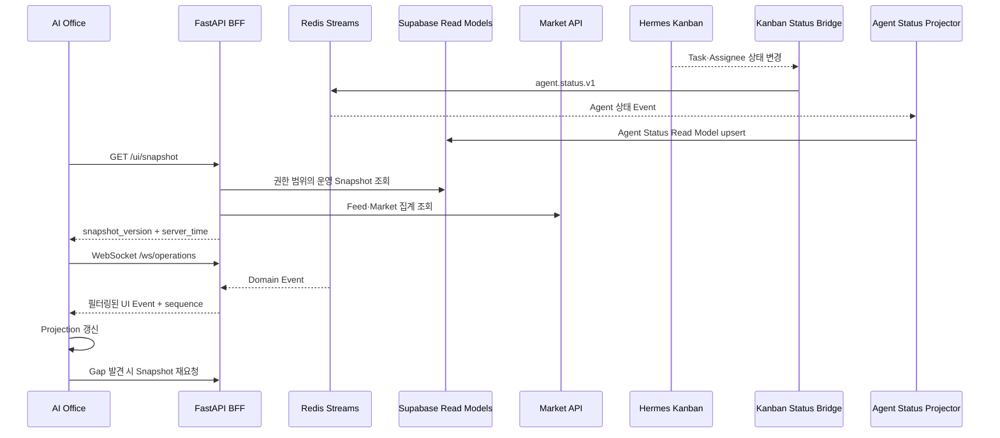

# AI Office Frontend and Operator Control Plan

> 문서 상태: Confirmed Frontend Plan v1.2
> 최상위 기준: [HEDGE_FUND_MASTER_PLAN.md](../HEDGE_FUND_MASTER_PLAN.md)
> 현재 구현: [`ai-office/`](../../ai-office/)
> 관련 기준: [Core Plan](../01-product/HEDGE_FUND_CORE_PLAN.md) · [Feature Backlog](HEDGE_FUND_IMPLEMENTATION_BACKLOG.md) · [Technology Stack](TECH_STACK_DECISIONS.md) · [Repository Structure](REPOSITORY_DEPARTMENT_STRUCTURE.md) · [ADR-0001](adr/0001-hermes-kanban-agent-status-bridge.md)
> 목적: 현재 `ai-office` 프로토타입을 헤지펀드 Digital Twin의 실시간 관제·승인 Frontend로 발전시키는 제품, 데이터, 권한과 구현 기준을 확정한다.

## 1. 한 문장 정의

`AI Office`는 에이전트가 일하는 모습을 꾸며 보여주는 화면이 아니라, **CEO Office와 6개 투자 본부, Agent Workforce 인사팀의 실제 업무 상태를 한눈에 보고 근거를 확인하며 허용된 명령을 실행하는 개인형 헤지펀드 운영 Control Plane**이다.

사용자에게는 하나의 회사가 일하는 경험을 제공하고, 개발자에게는 분리된 Domain Service의 상태를 탐색하는 공통 진입점을 제공한다. 화면은 공식 장부나 위험 상태를 계산하지 않는다. Backend의 확정 상태를 이해하기 쉽게 투영한다.

## 2. 현재 구현과 목표의 차이

현재 `ai-office`는 Next.js, React, TypeScript 기반 시각·상호작용 Prototype이다. 원본의 12개 부서를 CEO Office, 6개 투자 본부와 Agent Workforce 등 8개 조직·2개 층으로 바꿨고, Trading/Portfolio DEMO Snapshot Panel, Risk·QA 계약 Panel과 `apps/api/main.py`의 Read-only BFF도 추가했다. BFF는 `agent.status.v1` Projector·REST Snapshot·WebSocket Event를 제공하고, 포트폴리오 추천 실행 중에만 Worker Projection을 활성화한다. 외부 Hermes Kanban/Redis Stream을 직접 연결한 운영 Bridge는 아직 아니며 mode는 계속 DEMO로 명시한다.

| 구분 | 현재 `ai-office` | 목표 상태 |
|---|---|---|
| 조직 | CEO Office + 6개 투자 본부 + Agent Workforce 8개 조직 | Backend 조직 Registry에서 생성되는 8개 조직 |
| 공간 | 8개 방·2개 층과 공용 공간 Prototype | 조직 설정과 운영 상태로 생성되는 공간 |
| 직원 상태 | 브라우저 Simulation이 이동과 대사를 생성 | Agent Runtime, Queue, Workflow와 Heartbeat Event의 Projection |
| 업무 흐름 | 출근부터 콘텐츠 제작까지 정해진 Demo Scenario | Research Case, Strategy Promotion, Risk Review, Order, Close, Self-Improvement Workflow |
| 실시간성 | `requestAnimationFrame` 기반 로컬 상태 | REST Snapshot + FastAPI WebSocket Event |
| 승인 | 화면 안의 Demo 승인 | 인증, 권한, 사유, 멱등 키와 Audit를 갖춘 Backend Command |
| Risk·QA | Profile·Retry·Fallback 계약 Panel | Risk·QA API·Run Journal·Incident Read Model의 실시간 Projection |
| 보고 | Notion·Discord Demo 연동 | 공식 Report Artifact와 승인된 알림 Adapter |
| 저장 | 브라우저 메모리 + 정적/DEMO Read Model | Supabase·TimescaleDB·OMS·Ledger·Risk Engine이 Source of Truth |
| 배포 | `vinext`와 Cloudflare Worker 기반 Prototype | Frontend Hosting과 금융 Backend를 분리한 Provider-neutral 구조 |

조직 화면과 Risk·QA 계약 표시는 시작됐지만 실시간 연결은 아직 아니다. 다음 작업은 Scripted 업무 엔진과 DEMO Snapshot을 **Hermes Kanban 업무 상태, Supabase Read Model과 Backend Event Adapter**로 교체하는 것이다. `npm audit`이 보고한 High 13, Moderate 4, Low 1건은 배포 전 직접·전이 의존성, 도달 가능성과 Upgrade 회귀를 검토한다.

## 3. 사용자 경험

### 3.1 첫 화면: Live Office

첫 화면에는 8개 조직 단위와 공용 공간이 보인다.

| 공간 | 화면에서 확인할 것 | 주요 상세 화면 |
|---|---|---|
| CEO Office | Mandate, 승인 대기, 중대 Incident, Daily Brief | CEO Command Center |
| 리서치본부 | Feed·뉴스·공시 상태, Research Case, Evidence 품질 | Market and Research |
| 트레이딩본부 | Trade Case, Order Intent, OMS와 Broker 상태 | Trading and OMS |
| 리스크본부 | Trading State, Breach, Risk Queue | Risk Center |
| 퀀트/백테스트본부 | Strategy Candidate, Experiment, Promotion 상태 | Strategy Factory |
| 회계/포트폴리오본부 | Position, Cash, PnL, NAV와 Reconciliation | Portfolio and Close |
| AI QA/감사본부 | Finding, Trace, Eval, Release Block | AI QA and Audit |
| Agent Workforce 인사팀 | Agent 상태, Skill Gap, 개선 후보와 배포 | Agent Workforce |

직원 캐릭터의 움직임은 상태를 설명하는 시각 표현일 뿐이다. 캐릭터가 책상에 앉았다는 이유로 작업을 `RUNNING`으로 판단하지 않는다. 반드시 Event에 포함된 공식 상태를 표시한다.

### 3.2 업무용 상세 화면

Pixel Office 아래에는 반복 업무에 적합한 밀도 높은 화면을 둔다.

1. **CEO Command Center:** Mandate, 자본 배분, 승인 Inbox, Incident와 Daily Brief.
2. **Market and Universe:** LS WebSocket 연결, 구독 수, Gap, Staleness, 전 종목 처리량과 Attention Universe.
3. **Research Case:** 뉴스·공시·시장 Event, RAG Evidence, Bull/Bear 논거와 Citation.
4. **Strategy Factory:** Candidate, Dataset, Backtest, 독립 검증, Shadow/Paper Promotion과 Rollback.
5. **Risk Center:** Exposure, Limit, Breach, Stress, `NORMAL/ENTRY_BLOCKED/REDUCE_ONLY/HALTED` 상태.
6. **Trading and OMS:** Order Intent, Risk Decision, Order, Fill, Reject, Cancel과 TCA.
7. **Portfolio and Close:** Position, Cash, PnL, NAV, Ledger와 Reconciliation Break.
8. **AI QA and Audit:** Claim-Citation, Finding, Model·Prompt·Skill Version, Trace와 Replay.
9. **Agent Workforce:** Roster, Queue, Heartbeat, Eval, Skill Gap, Improvement Candidate, Shadow와 Rollback.

### 3.3 클릭 단위

Agent를 클릭하면 다음 정보를 보여준다.

- `agent_id`, 역할, 소속, Profile·Prompt·Skill·Tool·Model Version.
- 실제 Runtime 상태, 현재 `case_id`, 작업 Queue, 시작 시각과 마지막 Heartbeat.
- 입력 Artifact와 Evidence, 출력 Artifact, Trace와 QA 상태.
- 허용 Tool과 Data Scope, 승인 범위와 만료.
- Latency, Token·비용, 오류·Retry와 최근 Eval.

본부를 클릭하면 Open Work Item, SLA, 처리량, 실패율, Incident, 다른 본부에 기다리는 Handoff와 담당 Owner를 보여준다.

## 4. 운용 모드

| 모드 | 데이터 | 명령 | 화면 표시 |
|---|---|---|---|
| `DEMO` | Scripted Fixture | Demo 상태만 변경 | 모든 화면에 `DEMO` 고정 Label |
| `PAPER` | 실제 LS Feed와 Paper Backend | 승인된 Paper Command | `PAPER` Label과 가상 자본 표시 |
| `LIVE` | 인증된 Production Feed·Broker | Production Gate 통과 명령만 허용 | `LIVE` 고정 Label, 계정·Fund·Trading State 상시 표시 |

`DEMO`, `PAPER`, `LIVE` 데이터는 같은 화면에서 섞지 않는다. 모드 전환은 URL Parameter나 Browser Local State가 아니라 Backend Session과 권한으로 결정한다. `LIVE` 모드는 문서의 Production Launch Gate를 통과하기 전 구현되어 있어도 비활성화한다.

## 5. 실시간 데이터 구조

### 5.1 원칙

- 금융 Source of Truth는 Supabase, TimescaleDB, OMS, Ledger와 Risk Engine이다.
- Frontend State는 언제든 Snapshot과 Event로 재구축 가능한 Projection이다.
- Pixel Office에 전 종목 Tick을 원문으로 전송하지 않는다. Feed Health, 처리량, 상위 Event와 1초 이상 집계 값을 전달한다.
- 종목 상세 Chart도 목적에 맞는 Snapshot과 Downsampled Stream을 사용한다.
- Supabase Realtime을 시장 데이터 전송 계층으로 사용하지 않는다.

### 5.2 연결 순서



WebSocket Client는 Heartbeat, 지수형 Backoff 재연결, `sequence` Gap 감지, 마지막 수신 시각과 `STALE` 상태를 구현한다. 재연결 후에는 누락 Event를 추측하지 않고 REST Snapshot으로 정합성을 회복한다.

Hermes Kanban은 Agent 업무 배정·진행·차단 상태의 Source다. `Kanban Status Bridge`는 같은 Runtime
경계에서 Kanban 변경을 읽고 `agent.status.v1`을 발행하는 읽기 전용 Adapter다. Projector는 Event를
멱등 소비해 Supabase Agent Status Read Model을 갱신한다. Browser와 BFF는 Kanban SQLite를 직접 읽거나
Task를 수정하지 않는다. 상세 결정은 [ADR-0001](adr/0001-hermes-kanban-agent-status-bridge.md)을 따른다.

현재 `apps/api/main.py`는 `/health`, `/ui/snapshot`, `/ws/operations`, domain Read Model과 안전한 승인 요청 Command 계약을 제공하는 DEMO BFF다.
`/agent/ask`는 Hermes Tool 실행 가능성 때문에 기본 비활성화한다. 현재 프론트는 고정 데모 ID와
fixture 권한만 사용하며 외부 사용자 로그인·세션·프로필 인증은 이 모의투자 범위에 없다.

### 5.3 UI Event Envelope

```json
{
  "event_id": "evt_...",
  "event_type": "risk.trading_state.v1",
  "schema_version": 1,
  "sequence": 18421,
  "occurred_at": "2026-07-30T05:20:31.123Z",
  "observed_at": "2026-07-30T05:20:31.180Z",
  "server_time": "2026-07-30T05:20:31.200Z",
  "fund_id": "fund_...",
  "case_id": "case_...",
  "trace_id": "trace_...",
  "producer": "risk-service",
  "payload": {}
}
```

대용량 Document, Tick, Backtest Result와 Trace 전문은 Event에 넣지 않고 `artifact_id` 또는 조회 URL을 전달한다. Browser에서는 Zod로 Envelope와 Payload Version을 검증하며, 모르는 Major Version은 적용하지 않고 호환성 오류를 표시한다.

### 5.4 Agent 상태 계약

```text
OFFLINE | IDLE | QUEUED | RUNNING | WAITING_APPROVAL |
BLOCKED | DEGRADED | ERROR
```

| 상태 | 의미 | 시각 표현 예시 |
|---|---|---|
| `OFFLINE` | Runtime 또는 Heartbeat 없음 | 자리 비움, 회색 Label |
| `IDLE` | 실행 중이며 대기 | 자리 대기 |
| `QUEUED` | Case가 배정됐으나 시작 전 | Inbox 이동 |
| `RUNNING` | Tool 또는 Workflow 실행 중 | 업무 위치 이동 |
| `WAITING_APPROVAL` | 사람·위원회·Risk·QA 결정 대기 | 회의실 또는 승인 표식 |
| `BLOCKED` | 의존성·Policy·Finding으로 차단 | 차단 사유 Label |
| `DEGRADED` | 일부 기능 저하, Fallback 사용 | 경고 Label |
| `ERROR` | 실패하여 Retry 또는 조치 필요 | 오류 Label |

#### 5.4.1 Hermes Kanban 상태 매핑

| Kanban·Runtime 상태 | Agent 상태 | 판정 규칙 |
|---|---|---|
| 배정 Task 없음 | `IDLE` | Runtime Heartbeat가 정상일 때만 |
| `todo`, `scheduled`, 부모 Task 대기 | `QUEUED` | 실행 전 대기 |
| `running`, claim됨 | `RUNNING` | Worker가 처리 중 |
| `blocked: needs_input/capability` | `WAITING_APPROVAL` | 사람·권한·위원회 입력 필요 |
| `blocked: dependency` | `BLOCKED` | 선행 Task 완료 대기 |
| Failure Limit 소진 | `ERROR` | 자동 재시도 종료 |
| Runtime·Gateway Heartbeat 없음 | `OFFLINE` | Kanban 상태보다 우선 |
| Tool·Model Gateway 일부 장애 | `DEGRADED` | Health Event에서 판정 |

여러 Task가 있으면 `ERROR > WAITING_APPROVAL > BLOCKED > RUNNING > QUEUED > IDLE` 순으로 대표 상태를
고르고 상태별 Task 수를 함께 제공한다. `agent.status.v1`에는 `task_id`, `parent_task_id`,
`department_id`, `profile_id`, `source_status`, `agent_status`, `blocked_kind`, `board_updated_at`과
Sanitize된 `task_title`을 넣는다. Kanban Task는 금융 통제 자체가 아니므로 Risk 승인, 주문, Ledger와
QA 판정은 각 Domain Service의 공식 Event가 계속 결정한다.

## 6. 명령과 권한 경계

Frontend는 Backend의 허용된 Command만 호출한다. Browser에서 Database Table, Risk 상태, OMS Order나 Ledger를 직접 수정하지 않는다.

```json
{
  "command": "SET_TRADING_STATE",
  "target": {"fund_id": "fund_..."},
  "requested_state": "REDUCE_ONLY",
  "reason": "Market feed stale beyond policy threshold",
  "idempotency_key": "uuid",
  "expected_version": 42
}
```

모든 위험 명령은 다음을 만족한다.

- 로컬 fixture의 고정 데모 ID와 역할 범위를 확인한다. 외부 사용자 로그인은 구현하지 않는다.
- 실행 전 현재 상태, 영향 범위와 필요한 승인자를 보여준다.
- 사유와 멱등 키를 필수로 받고 낡은 `expected_version`을 거절한다.
- Backend가 Policy, Risk와 상태 전이를 다시 검증한다.
- 요청, 승인, 결과와 실패를 Append-only Audit Event로 남긴다.
- Kill Switch와 거래 차단은 LLM이 아니라 결정론적 Service가 실행한다.

ChatGPT Header 인증은 특정 Hosting 환경의 보조 신호일 뿐 금융 서비스 Identity의 유일한 근거가 될 수 없다. WebSocket은 짧은 수명의 Token을 사용하고 재연결 때 권한을 다시 검사한다. Supabase `service_role`, Broker·LS·Bedrock Secret은 Browser Bundle에 포함하지 않는다.

## 7. Frontend 기술 결정

### 7.1 확정 Baseline

- Next.js + React + TypeScript.
- 기존 Pixel Office 렌더링과 `ai-office`의 시각 언어 재사용.
- TanStack Query: REST Snapshot과 Server State.
- Zod: REST·WebSocket Runtime Contract 검증.
- TanStack Table: 주문, 체결, Position, Finding과 Queue.
- TradingView Lightweight Charts: 가격과 지표 Chart.
- Radix UI 또는 shadcn/ui, lucide-react: 접근 가능한 운영 Control.
- Vitest + React Testing Library: Component와 State Unit Test.
- Playwright: Desktop·Mobile E2E와 승인·재연결 Scenario.

현재 `vinext`, Vite, Cloudflare Worker와 Wrangler 구성은 **프로토타입 배포 Baseline**이다. 전체 Cloud Provider는 여전히 미정이며, 이 구성 때문에 Backend·Database·Market Worker를 Cloudflare로 확정하지 않는다. Drizzle과 D1도 현재 금융 Source of Truth가 아니며 `ai-office/db/schema.ts`를 금융 Schema로 확장하지 않는다.

### 7.2 목표 Frontend 경계

```text
apps/operator-web/ 또는 이전 완료 전 ai-office/
├── app/                    # Route와 Layout
├── features/
│   ├── office/             # 조직 배치와 시각 Projection
│   ├── market/
│   ├── research/
│   ├── strategies/
│   ├── risk/
│   ├── trading/
│   ├── portfolio/
│   ├── audit/
│   └── workforce/
├── entities/               # Agent, Case, Order, Position 등 UI Model
├── shared/
│   ├── api/                # REST Client와 Zod Schema
│   ├── realtime/           # WebSocket, Sequence와 Reconnect
│   ├── auth/
│   └── ui/
└── tests/
```

현재 경로 이전 전에는 `ai-office/`가 실행 기준이다. `apps/operator-web/`로 이동하는 작업은 Import, 배포 설정과 CI를 함께 바꾸는 별도 PR로 수행한다.

## 8. 화면 품질 기준

- Pixel Office는 Desktop 우선 관제 화면으로 사용하고 Mobile에서는 목록·Dashboard View를 기본 제공한다.
- 색만으로 상태를 표현하지 않고 Text와 Icon을 함께 제공한다.
- `prefers-reduced-motion`에서 캐릭터 이동을 줄이거나 끌 수 있다.
- Keyboard로 View 이동, Detail 열기와 승인 Dialog 취소가 가능하다.
- `DEMO/PAPER/LIVE`, 연결 상태, 마지막 갱신 시각과 Trading State는 항상 보인다.
- 긴 종목명, 전략명, 오류 메시지가 Button·Table·Panel을 넘지 않는다.
- `STALE` 또는 연결 해제 상태에서 새 명령을 정상 상태처럼 제출하지 않는다.
- Pixel Office와 상세 Dashboard 모두 같은 Snapshot Version을 표시할 수 있다.

## 9. 구현 단계

### Phase UI-0. 현재 Prototype 동결과 계약 정의

- 현재 Demo를 `DEMO` Mode로 명시하고 금융 상태처럼 보이는 표현을 제거한다.
- 8개 조직 전환과 Trading/Portfolio DEMO Snapshot Fixture는 구현됐다.
- Agent 상태, UI Event Envelope와 Snapshot Schema를 확정한다.
- `/ui/snapshot` DEMO BFF는 구현됐고 `/ws/operations` Mock Contract는 남아 있다.
- 완료 기준: Demo와 실제 연결 대상이 코드·화면·문서에서 구분된다.

### Phase UI-1. 조직 구조와 Read-only 실시간 연결

- 8개 조직·2개 층 Prototype을 Backend 조직 Registry 기반 배치로 전환한다.
- REST Snapshot, WebSocket Reconnect와 Gap Recovery를 fixture 환경에서 구현한다. 사용자 로그인은
  이 단계의 범위에 포함하지 않는다.
- Market Feed, Agent Queue, Risk State, Portfolio Snapshot을 읽기 전용으로 연결한다.
- Kanban Status Bridge, Agent Status Projector와 `agent.status.v1`을 연결한다.
- 완료 기준: Backend 재시작과 Event 누락 후에도 화면이 공식 Snapshot과 다시 일치한다.

### Phase UI-2. Department Workbench

- Research, Strategy, Risk, Trading, Portfolio, Audit와 Workforce 상세 View를 구현한다.
- Agent·본부 클릭 상세, Trace 이동과 Evidence 조회를 연결한다.
- 전 종목 원문 Tick 대신 집계 Feed Health와 Attention Event를 시각화한다.
- 완료 기준: 한 `case_id`를 Market Event부터 Decision, Risk, Order, Fill과 PnL까지 탐색한다.

### Phase UI-3. 승인과 Operator Control

- Strategy Promotion, Paper Order 승인, Trading State와 Kill Switch Command를 연결한다.
- Preview, Reason, Idempotency, Expected Version, 권한과 Audit 결과를 구현한다.
- 완료 기준: 권한 없음, 중복 제출, 낡은 Version, 연결 해제와 Backend 거절 Scenario가 모두 안전하게 실패한다.

### Phase UI-4. 운영 준비

- OpenTelemetry/Sentry, 접근성, Browser E2E, 부하·장시간 연결 Test를 적용한다.
- Incident Snapshot, Evidence Export와 Read-only 장애 Mode를 구현한다.
- `PAPER`와 비활성 `LIVE`를 분리하고 Production Launch Gate를 연결한다.
- 완료 기준: 10거래일 Paper Dry Run 동안 UI 장애가 Trading Process를 중단시키거나 상태를 오표시하지 않는다.

## 10. P0 완료 조건

- [x] 화면의 조직이 CEO Office, 6개 본부와 Agent Workforce 인사팀으로 일치한다.
- [ ] `DEMO`와 `PAPER` 데이터가 섞이지 않고 모든 View에 Mode가 표시된다.
- [ ] REST Snapshot 후 WebSocket Event를 적용하고 Sequence Gap을 복구한다.
- [ ] Feed 단절, Event Stale, Backend 장애와 재연결을 사용자가 구분할 수 있다.
- [ ] Agent와 부서 상태가 공식 Event·Read Model에서만 생성된다.
- [ ] Market, Research, Strategy, Risk, Trading, Portfolio, Audit와 Workforce View가 연결된다.
- [ ] 위험 Command가 FastAPI, 인증, 사유, 멱등 키, Backend 재검증과 Audit를 거친다.
- [ ] Browser에 Service Role, Broker, LS, Bedrock와 Ollama Secret이 없다.
- [ ] Pixel Office가 중단되어도 Market Worker, Risk Engine, OMS와 Ledger는 계속 동작한다.
- [ ] Desktop과 Mobile 핵심 Flow, 접근성, 재연결과 승인 실패 E2E Test가 CI에서 통과한다.

## 11. 소유권

| 영역 | Business Owner | Frontend 책임 | 승인 또는 Review |
|---|---|---|---|
| Live Office·CEO·Workforce | 영주님 | 조직 Projection, 승인 Inbox, Agent Lifecycle | 동규님 QA, 영향 본부 |
| Market·Research·Strategy | 재일님 | Feed 집계, Evidence와 Strategy Pipeline 계약 제공 | 동규님 DQ·QA |
| Trading·Portfolio·Close | 도현님 | OMS, Fill, Position, Ledger와 NAV Read Model 제공 | 동규님 Risk·QA |
| Risk·Audit·Incident | 동규님 | Risk State, Breach, Finding, Trace 계약 제공 | 권한 분리 Reviewer |
| 공통 Frontend Platform | 영주님 | 도현님: Auth, API Client, Kanban Bridge, Realtime Store, UI와 E2E | 동규님 Risk·QA, 전 본부 Contract Review |

화면 구현자가 Domain 상태의 의미를 독자적으로 정하지 않는다. 각 본부는 자신이 소유한 Read Model과 Event Contract를 제공하고, 공통 Frontend 담당자는 이를 일관된 사용자 경험으로 조합한다.

## 12. 최종 원칙

> `ai-office`는 헤지펀드를 흉내 내는 애니메이션에서 끝나지 않는다. 실제 Agent Workflow, 시장 데이터, 전략 검증, Risk, 주문, 장부와 감사를 사용자가 이해할 수 있는 회사의 모습으로 연결한다. 단, 화면은 회사의 공식 기억이나 통제 엔진이 아니라 검증된 상태를 보여주고 허용된 명령을 전달하는 안전한 창구다.
