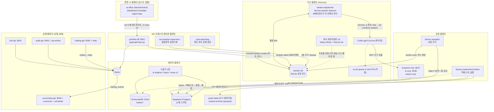
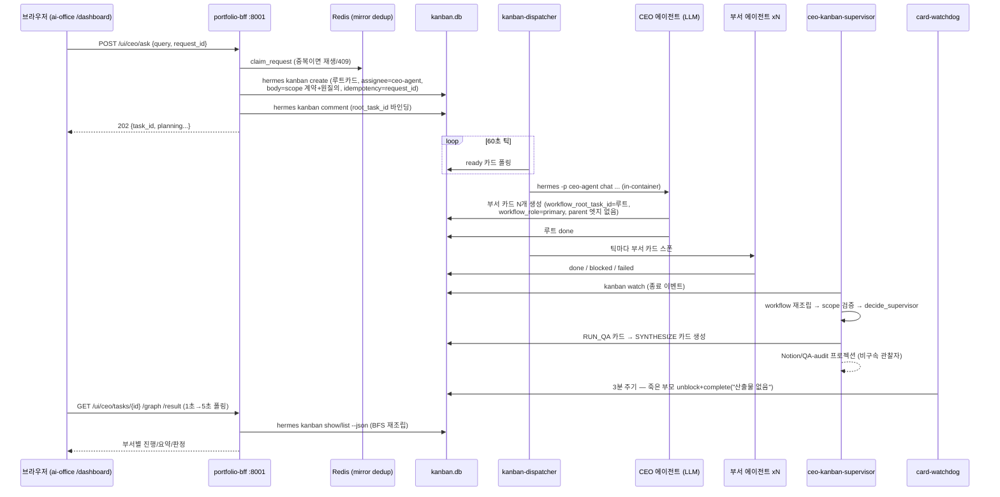
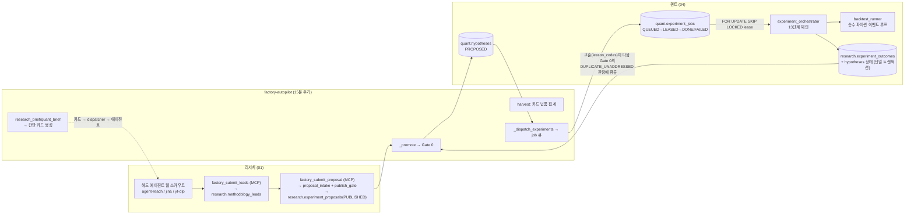

# AS-IS 파이프라인 설계도 — 코드 역추적 기준

> **작성일**: 2026-08-13 · **기준 스냅샷**: `merge/team-sync-20260812` 브랜치 (HEAD `892973c`) + 작업 트리의 미커밋 변경분
> **방법론**: 기존 문서/README를 근거로 쓰지 않고, 실제 코드·compose·마이그레이션의 실행 흐름을 역추적했다. 모든 주장은 `파일:줄` 근거를 단다. 문서와 코드가 어긋나는 곳은 코드를 사실로 채택하고 "드리프트"로 표기했다.
> **범위**: `multi_agent/` 저장소 전체 (부서 8개, apps, orchestration, 데이터 플레인, 인프라, ai-office 프런트엔드)

---

## 목차

1. [한 장 요약 — 실제로 도는 것과 돌지 않는 것](#1-한-장-요약)
2. [전체 큰 그림](#2-전체-큰-그림)
3. [런타임 토폴로지 — 컨테이너 42개의 실측 지도](#3-런타임-토폴로지)
4. [두뇌 플레인 — Hermes 에이전트 런타임](#4-두뇌-플레인--hermes-에이전트-런타임)
5. [흐름 1 — 사용자 질의 (CEO Ask)](#5-흐름-1--사용자-질의-ceo-ask)
6. [흐름 2 — 전략 공장 무인 루프 (유일하게 완결된 E2E)](#6-흐름-2--전략-공장-무인-루프)
7. [흐름 3 — 시장 데이터 파이프라인](#7-흐름-3--시장-데이터-파이프라인)
8. [흐름 4 — 주문·리스크·회계 (설계 완성, 흐름 단절)](#8-흐름-4--주문리스크회계)
9. [흐름 5 — QA·감사·거버넌스](#9-흐름-5--qa감사거버넌스)
10. [프런트엔드 — ai-office](#10-프런트엔드--ai-office)
11. [데이터 저장소와 스키마 맵](#11-데이터-저장소와-스키마-맵)
12. [죽은 코드 · 미배선 · 드리프트 전체 목록](#12-죽은-코드--미배선--드리프트)
13. [구조적 결론](#13-구조적-결론)

---

## 1. 한 장 요약

이 시스템은 **"멀티에이전트 헤지펀드"라는 하나의 시스템이 아니라, 성숙도가 크게 다른 5개 층의 겹침**이다.

| 층 | 상태 | 한 줄 판정 |
|---|---|---|
| **전략 공장 루프** (리서치 발굴→실험 제안→Gate 0→백테스트→판정→교훈 환류) | ✅ **완결 가동** | 사람 0명으로 15분 주기 자동 순환. 저장소에서 유일하게 끝까지 닫힌 E2E 루프 |
| **사용자 질의 루프** (CEO ask→루트 카드→부서 팬아웃→QA→합성→응답) | ✅ 가동 (제약 있음) | 동작하나 mandate 스냅샷이 실전 경로에서 유실되는 등 결함 존재 (§5.7) |
| **시장 데이터 파이프라인** (실시간 호가/체결 + 배치 수집 + 보존/아카이브) | ✅ 가동 | 2,595종목 실시간 + 일 21개 배치 잡. 유니버스 이원화(350/전체)는 해소됨 |
| **주문·리스크·회계 실행 계층** | 🔴 **단절** | 도메인 모델·원장·아웃박스는 정교하게 완성됐으나, **주문 제출 경로를 잇는 코드가 존재하지 않는다** (§8.5 D1–D5) |
| **관측·보안·IAM** | 🟡 부분 | HS256 서비스 토큰은 라우트 ~6개만 보호, Prometheus/OTel은 계측만 있고 수집기 없음, `platform_iam`은 완성됐지만 실행 주체 없음 |

핵심 구조 사실 세 가지:

1. **이 저장소에는 자체 에이전트 루프가 없다.** 에이전트 세션·칸반 보드·워커 스폰은 전부 외부 오픈소스 **NousResearch `hermes-agent` CLI**가 소유한다. 저장소가 기여하는 것은 그 주변의 (a) 루트 카드를 만드는 FastAPI BFF, (b) 카드 본문에 심는 workflow-scope 계약, (c) 종료 이벤트에 반응하는 결정론적 supervisor, (d) 죽은 부모 카드를 강제 종료하는 watchdog이다 (`orchestration/adapters/ceo_supervisor.py:1-7`).
2. **부서 간 계약의 실체는 HTTP가 아니라 DB 행이다.** 리서치→퀀트 핸드오프는 `research.experiment_proposals` → `quant.hypotheses` → `research.experiment_outcomes`라는 세 테이블의 상태 전이이고 (§6.3), 체결→회계는 `execution.outbox` → Redis 스트림 → 원장 분개다 (§8.4). 칸반 카드는 계약이 아니라 **디스패치 수단**이다.
3. **LLM은 3계층으로 분리돼 있다.** 부서장(Hermes head) = OpenAI Codex `gpt-5.6-luna`, 대안 경로 = 호스트 프록시 경유 Claude, 직원 워커(LangGraph) = Ollama `qwen3:1.7b`(개발) 또는 vLLM `qwen2.5-14b-instruct-awq`(AWS GPU). 백테스트 판정·리스크 게이트·QA 판정은 **LLM이 아니라 결정론적 코드**다.

---

## 2. 전체 큰 그림



**플레인 간 결합의 실체** (프로토콜 기준):

| 결합 | 프로토콜 | 근거 |
|---|---|---|
| UI → BFF | HTTP `/ui/*`, 인증은 무서명 `X-User-Id` 헤더뿐 | `ai-office/app/lib/currentAccount.ts:155-157`, `apps/api/current_user.py` |
| BFF/공장/supervisor → 칸반 | **`hermes` CLI subprocess** (`kanban create/show/list/comment/complete`) — SQLite를 직접 안 연다 | `apps/api/hermes_boundary.py:141-154`, `Dockerfile.factory:13-17` (외부에서 열면 `-shm` 매핑이 보드 쓰기를 죽임) |
| dispatcher → 에이전트 | 컨테이너 내부 subprocess `hermes -p <부서> chat -q work kanban task <id>` | `docker-compose.override.yml:156-160` |
| 리서치 에이전트 → DB | MCP 도구(`factory_submit_*`)만 통과, 직접 INSERT 없음 | `departments/01-research/api/mcp_server.py:800-921` |
| 리서치 ↔ 퀀트 | **DB 테이블 3개** (HTTP 핸드오프 없음) | §6.3 |
| 체결 → 회계 | `execution.outbox` → Redis XADD `trading_events` → consumer | §8.4 |
| 리스크 → QA | Redis 스트림 `risk-qa-events` | `departments/03-risk/risk_events/redis_event_bus.py:17,42` |

---

## 3. 런타임 토폴로지

### 3.1 Compose 프로젝트 구조

- 프로젝트명 `hedgefund` (`docker-compose.yml:33`). **`networks:` 선언이 아예 없어** 전 서비스가 단일 암묵 브리지(`hedgefund_default`)에 있고, 서비스명 DNS가 유일한 상호 주소다.
- `include:`로 부서 4개 fragment를 끌어온다: 00-ceo-office, 02-trading, 05-accounting-portfolio, 07-agent-workforce (`docker-compose.yml:40-44`). **03-risk와 06-ai-qa-audit 서비스는 fragment 없이 루트 파일에 직접 하드코딩** — "부서가 자기 fragment를 소유한다"는 관례와 어긋나는 비일관성.
- 명명 볼륨: `tsdb_data`, `portfolio_runtime_data`, `factory_state` (`docker-compose.yml:1335-1338`).
- 오버레이 4종: `override`(로컬 Windows 자동 적용), `model`(GPU vLLM, 명시적 `-f`), `claude`(Claude 프록시), `discord-idempotency`(옵션 방어층).

### 3.2 서비스 전체 표 (기본 기동 기준)

**루트 compose (29개 정의, 기본 기동 25개):**

| 서비스 | 이미지/빌드 | 커맨드 | 포트 | 역할 |
|---|---|---|---|---|
| `portfolio-bff` | `apps/api/Dockerfile` (Hermes CLI `v2026.8.3` 내장) | uvicorn `apps.api.main:app` | **`8001→8000`** | 정식 HTTP 입구 (BFF) |
| `portfolio-worker` | 동일 이미지 | `portfolio_worker.py` | — | 포트폴리오 런타임 큐 소비 |
| `timescaledb` | `timescale/timescaledb-ha:pg17` | — | **`0.0.0.0:5434→5432`** | 시장 데이터 DB (LAN 공개 의도, `docker-compose.yml:143-148`) |
| `news-watcher` | `departments/01-research` 빌드 | 기본 CMD | — | 2단계 뉴스 감시 (Tier1 350 / Tier2 전체) |
| `ls-realtime` | 동일 | `ls_realtime_service.py` | — | 실시간 호가·체결, 2,595종목 → 5,190구독 → ~26소켓 |
| `batch-collectors` | 동일 | `collector_scheduler.py --serve` | — | 배치 수집 스케줄러 (§7.2) |
| `ls-news` | 동일 | `ls_news_collector.py --run` | — | LS NWS 푸시 (제목/메타만) |
| `market-api` | 동일 | uvicorn `market_api:app` | **`0.0.0.0:8036`** | 시장 데이터 읽기 전용 API |
| `research-api` | 동일 | uvicorn `main:app` | `127.0.0.1:8035` | 증거 읽기 API (read-only 트랜잭션) |
| `research-mcp` | 동일 | `mcp_server.py --serve` | (비공개) | 리서치 MCP full surface, 도구 24개 |
| `ls-mcp` | 동일 | `ls_mcp_server.py --serve` | (비공개) | LS증권 TR 카탈로그+큐레이션, **키 격리 컨테이너** |
| `research-liaison-mcp` | 동일 | `RESEARCH_MCP_SURFACE=liaison` | (비공개) | 읽기전용 창구 surface (쓰기 도구 3개 제거) |
| `research-hermes` `quant-hermes` `risk-hermes` `qa-hermes` `trading-hermes` `accounting-hermes` `ceo-hermes` `workforce-hermes` | `nousresearch/hermes-agent:latest` | `sleep infinity` | ceo만 `8642` 내부 | 부서 프로필 저장소 + s6 Discord 게이트웨이 (디스패치 비활성) |
| `redis` | `redis:7-alpine` | — | — | 이벤트 버스 (AOF 없음) |
| `risk-api` | `departments/03-risk/Dockerfile` | 기본 CMD | `127.0.0.1:8041` | 리스크 엔진 API |
| `audit-api` | `departments/06-ai-qa-audit/Dockerfile` | 기본 CMD | `127.0.0.1:8042` | QA/감사 API |
| `qa-worker` | 동일 | `qa_events/worker.py` | — | 리스크 결정 이벤트 소비 |
| `kanban-dispatcher` | hermes 이미지 (로컬은 `Dockerfile.agent-runtime`) | `kanban daemon --force --interval 60` | **없음(설계)** | ★ 에이전트 스포너. 최고 권한 컨테이너 |
| `ceo-kanban-supervisor` | hermes 이미지 | `run_ceo_supervisor.py --interval 1` | — | 종료 이벤트 상태기계 |
| `factory-autopilot` | `Dockerfile.factory` → `hedgefund-factory:latest` | `factory_autopilot.py --loop --interval-min 15` | — | 공장 사이클 드라이버 |
| `factory-experiment-worker` | `hedgefund-factory:latest` (빌드 스탠자 없음†) | `experiment_worker.py --serve` | — | 백테스트 실행 워커 (단일 프로세스) |
| `card-watchdog` | `hedgefund-factory:latest` | `card_watchdog.py --loop --interval-min 3` | — | 죽은 부모 카드 release |
| `hermes-dashboard` | hermes 이미지 | `dashboard :9119` | `127.0.0.1:9119` | **profiles 게이트 — 기본 미기동** |
| `paper-search-mcp` `youtube-transcript-mcp` | uv 이미지 | uvx | — | **profiles 게이트 — 기본 미기동** |
| `ui-bff` | factory 이미지 | uvicorn (레거시) | — | **profiles 게이트 — 레거시, 그대로 켜면 고장** (§12) |

† `factory-experiment-worker`/`card-watchdog`은 `build:` 없이 `hedgefund-factory:latest`를 참조 — `factory-autopilot`이 같은 호스트에서 먼저 빌드해야만 뜬다 (`docker-compose.yml:1205, 1235`).

**부서 fragment (13개):**

| Fragment | 서비스 | 포트 | 비고 |
|---|---|---|---|
| 00-ceo-office | `governance-api` | `127.0.0.1:8043` | 거버넌스/만데이트 API |
| | `notification-worker` | — | governance 이벤트 소비 |
| | `ceo-hermes` | 내부 `8642` | `API_SERVER_ENABLED=true` — OpenAI 호환 내부 API (`compose.yaml:86-91`) |
| 02-trading | `trading-api` | `127.0.0.1:8045` | **인증 전무**, 루프백 바인딩이 유일한 방어 |
| | `trading-outbox-relay` | — | outbox → Redis 릴레이 |
| | `trading-hermes` | — | |
| 05-accounting | `accounting-api` | `127.0.0.1:8046` | |
| | `accounting-ledger-consumer` | — | 체결 → 분개 → NAV |
| | `accounting-close-scheduler` | — | 일 15:40 / 주 금 16:00 KST 마감 |
| | `accounting-hermes` | — | |
| 07-agent-workforce | `workforce-api` | `127.0.0.1:8044` | HR API |
| | `improvement-worker` | — | |
| | `workforce-hermes` | — | 프로필명 `hr-department` |

포트 규칙: 부서 API는 전부 컨테이너 8000 → 호스트 `127.0.0.1:8041~8046`. 외부(0.0.0.0) 공개는 `market-api:8036`(LAN 의도)과 BFF, TimescaleDB뿐.

### 3.3 환경별 3-웨이 분기 (같은 코드, 다른 능력)

| | 로컬 (Windows + override) | AWS EC2 (루트 compose 그대로) | AWS Elastic Beanstalk (`deploy/eb/`) |
|---|---|---|---|
| Hermes 프로필 경로 | `${USERPROFILE}/.hermes-<부서>` (`override:29-106`) | `/home/ubuntu/.hermes/profiles/<부서>` | **Hermes 자체가 없음** |
| dispatcher 이미지 | `Dockerfile.agent-runtime` 빌드 (quant-py, agent-reach, gh, mcporter 포함) | `nousresearch/hermes-agent:latest` **맨몸** | — |
| dispatcher 메모리 | 8g + `--max 3` 스폰 캡 | **1g** (`docker-compose.yml:1081` — 과거 OOM 유발값) | — |
| 직원 워커 LLM | Ollama `qwen3:1.7b` (8초 타임아웃) | vLLM 오버레이 적용 시 `qwen2.5-14b-fp8` | — |
| 서비스 구성 | 전체 스택 | 전체 스택 | 7개만: portfolio-bff/worker, trading-api/relay, accounting-api/consumer, 전용 redis |
| 부서 에이전트 질의 | 가능 | 가능 | `/{부서}/agent/ask` **503 고정** (`deploy/eb/docker-compose.yml:20-22`) |
| NAV 계산 | 가능 | 가능 | **불가** (market-api 부재로 마크 없음, `deploy/eb/README.md:100-108`) |

⚠️ **환경 의존 판정 위험**: 로컬 dispatcher에만 `quant-py`/`agent-reach`/`gh`가 있으므로, 같은 카드가 AWS에서는 도구 부재로 다르게 실행된다. `docker-compose.yml:1064-1068`이 스스로 경고하는 실패 모드가 인프라 구성으로 재생산돼 있다.

### 3.4 dispatcher = 최고 권한 지점

`kanban-dispatcher`는 8개 프로필의 `auth.json`/메모리/세션 전체 + 저장소 전체(`.:/app/repo:ro`) + quant 작업면을 동시에 마운트한다 (`docker-compose.yml:1063-1071`). 침해 시 전 부서 크리덴셜이 유출되므로 `ports:`를 절대 열지 않는 것이 유일한 방어다 (`docker-compose.yml:1040-1043`). 부서별 크리덴셜 격리는 **컨테이너가 아니라 프로필 `config.yaml`의 `env:` 절**로만 되어 있고, 이는 관례이지 강제가 아니다 (`Dockerfile.agent-runtime:117-119`).

---

## 4. 두뇌 플레인 — Hermes 에이전트 런타임

### 4.1 Hermes의 정체

Hermes는 이 저장소의 코드가 아니다. 업스트림 **NousResearch `hermes-agent` CLI**를 두 방식으로 소비한다:

- 컨테이너 이미지 `nousresearch/hermes-agent:latest` — 게이트웨이 8개, dispatcher, supervisor, dashboard 전부 이 이미지 (`docker-compose.yml:688,724,896,923,977,1045,1088` 등)
- 소스 핀 `v2026.8.3` — BFF 이미지에만 git clone으로 설치 (`apps/api/Dockerfile:19-28`). 칸반 create 경계에 CLI가 필요해서다.

세션 상태, 도구 디스패치, 메모리, 칸반 DB, 워커 스폰은 전부 업스트림 CLI 소유다.

### 4.2 에이전트 세션이 뜨는 4가지 경로

| # | 경로 | 명령 형태 | 사용처 |
|---|---|---|---|
| a | **dispatcher 스폰 (주 생산 경로)** | dispatcher가 자기 컨테이너 안에서 `hermes -p <부서> ... chat -q work kanban task <id>` | 카드 assignee → `$HERMES_HOME/profiles/<assignee>` 라우팅 (`docker-compose.yml:1027-1032`, `override:156-160`) |
| b | BFF 부서 질의 | `hermes -p <프로필> chat -Q -q <질의>` (local 모드) 또는 `docker exec -u hermes -i <컨테이너> hermes ...` (docker 모드) | `apps/api/hermes_boundary.py:85-107`, 호출당 프로세스 신규 (~20초, `:374-375`) |
| c | 오케스트레이션 어댑터 | `hermes --profile ceo-agent -z <프롬프트>` (헤드리스 1턴 JSON) | `orchestration/adapters/ceo.py:82`, `ceo_task_planner.py:103` |
| d | 인프로세스 Python (취약) | `from run_agent import AIAgent` — **이 모듈은 저장소에 없음** (업스트림 체크아웃 전용) | `departments/00-ceo-office/scripts.py:134-141`, `07-agent-workforce/scripts.py:108-114` — lazy import라 실제 호출 시점에만 터짐 |

부서 게이트웨이 8개가 `sleep infinity`인 이유: 업스트림 s6가 Discord 게이트웨이를 소유하게 하되, 임베디드 디스패치는 전부 끈다(`HERMES_KANBAN_DISPATCH_IN_GATEWAY=false` ×9). 게이트웨이의 `/opt/data` 자체가 프로필이라 `profiles/` 하위 디렉터리가 없어 스폰이 `skipped_nonspawnable`로 떨어지기 때문 (`docker-compose.yml:678-686`).

### 4.3 LLM 3계층

| 플레인 | 프로바이더 | 모델 | 근거 |
|---|---|---|---|
| 부서장 (Hermes head) | `openai-codex` | `gpt-5.6-luna` (`https://chatgpt.com/backend-api/codex`) | 8개 프로필 전부, 예: `departments/00-ceo-office/hermes/config.yaml:8-11` |
| 부서장 대안 | `anthropic-claude-code` | sonnet/opus/haiku 별칭 | `docker-compose.claude.yml:28-41` + 호스트 프록시 `scripts/claude_code_proxy.py` (`hermes → host.docker.internal:8787 → claude -p`). `ANTHROPIC_API_KEY`는 **의도적으로 미주입** — 종량 과금 방지 (`claude.yml:19-24`) |
| 직원 워커 (LangGraph) | `ollama` (dev) / `vllm-openai` (AWS) | `qwen3:1.7b` / `qwen2.5-14b-instruct-awq` | `departments/worker_model_gateway.py:163-201` — `WORKER_MODEL_BASE_URL` 유무로 분기 |

프로바이더는 compose에 하드코딩하지 않고 `/opt/data/config.yaml`의 `provider:`와 `auth.json`이 결정한다 (`docker-compose.yml:708-711`).

**모델 플레인 (GPU 오버레이)** — `docker-compose.model.yml`:
- vLLM `vllm/vllm-openai:latest`, `127.0.0.1:8000` 루프백 전용, `--model /models/Qwen2.5-14B-Instruct-AWQ --served-model-name qwen2.5-14b-instruct-awq --max-model-len 8192 --gpu-memory-utilization 0.85 --kv-cache-dtype fp8 --enable-lora --max-loras 4` (`:49-76`), `HF_HUB_OFFLINE=1` (28GB 무단 다운로드 방지), healthcheck start_period 600s.
- 모델 준비 스크립트: `scripts/model_plane/fetch_base_model.sh` (S3→EBS, RedHatAI FP8 사전 양자화 체크포인트), `quantize_fp8.py` (llm-compressor, 파이프라인 검증용 1.5B), `model_manifest.py` (파일별 sha256 + 복합 digest).
- ⚠️ `WORKER_MODEL_*`/`VLLM_*`/`HGF_MODEL_DIR`는 `.env`/.env.example 어디에도 없다 — 오버레이를 잊으면 **조용히 Ollama 1.7b + 8초 타임아웃으로 강등**된다. LoRA 어댑터는 레지스트리(`departments/01-research/config/worker_model_registry.json`)에 `enabled`가 하나도 없어 Multi-LoRA 장치 전체가 현재 무의미.

### 4.4 프로필 체계

**저장소 원본**: `departments/<NN>-<이름>/hermes/{config.yaml, SOUL.md}` — 정확히 8쌍.
**런타임 타깃**: `~/.hermes/profiles/<프로필명>/`. 매핑은 `scripts/sync_hermes_profiles.sh:36-45`:

```
ceo-agent ← 00-ceo-office          research-department ← 01-research
trading-department ← 02-trading    risk-management ← 03-risk
quant-backtest-department ← 04     accounting-portfolio-department ← 05
qa-department ← 06-ai-qa-audit     hr-department ← 07-agent-workforce
```

`orchestration/canonical_profiles.py`가 **유일한 assignee 어휘 사전**이다: 부서 코드 11개 → 프로필 8개 + liaison 2개(`research-liaison`, `quant-liaison`) = 유효 assignee 10개 (`:20-51`). 레거시 별칭(`risk-department`, `ai-qa-audit-department`)은 하드 거부 (`:70-78`).

**config.yaml에서 Hermes가 실제로 읽는 키는 `model`, `agent`, `skills`, `env`뿐이다.** `tool_allowlist`/`forbidden_tools`/`hiring_priority`/`agentic_rag`는 저장소 전용 계약으로, **런타임 강제가 없다** (`scripts/check_hermes_profiles.py:7-12, 87-89, 262-264`). 시스템에서 실제로 작동하는 유일한 능력 차단은 liaison MCP의 도구 제거다 (§4.5).

크리덴셜 격리는 프로필 `env:` 절이 담당한다 — 예: quant 원장 DSN `QUANT_DATABASE_URL`은 quant 프로필에만 있다. 8개 프로필이 dispatcher 한 컨테이너에 마운트되므로 compose `environment:`에 넣으면 전 부서에 노출되기 때문 (`departments/04-quant-backtest/hermes/config.yaml:6-10`).

### 4.5 도서관/연구소 분리 (liaison)

의도: dispatcher의 유일한 라우팅 손잡이가 assignee→프로필이므로, **읽기전용 창구를 별도 프로필로 두는 것 = 큐·워커풀 분리**다 (`canonical_profiles.py:36-41`). CEO SOUL이 라우팅 규칙을 명시한다: 사용자 읽기 질의 → `research-liaison`/`quant-liaison`, 공장 사이클/격상 작업 → 본체 프로필 (`departments/00-ceo-office/hermes/SOUL.md:37-53`).

**실제로 구현된 절반 — MCP surface**: 같은 이미지·같은 코드에서 `RESEARCH_MCP_SURFACE=liaison`이면 `run_research_packet`, `factory_submit_leads`, `factory_submit_proposal` 3개 도구를 서버 기동 시 제거하고, 제거 실패 시 **기동을 거부**한다 (`departments/01-research/api/mcp_server.py:423-461`). reports 볼륨도 읽기전용 마운트 (`docker-compose.yml:637-639`). 루프 차단: `origin=factory` 카드에는 `MISROUTED` 응답 규칙 (RFC 3834식, `hermes-liaison/SOUL.md:23-28` ↔ `ceo_workflow_scope.py:281-284`의 `origin=user-query` 도장).

**미구현된 절반 — 프로필**: `hermes-liaison/`에는 SOUL.md만 있고 config.yaml이 없다. sync/install 스크립트 대상 목록(8개)에도, dispatcher 프로필 마운트(8개)에도 없다. 따라서 **로컬에서 `research-liaison`으로 배정된 카드는 non-spawnable로 영구 스킵**된다. 추가로 `hermes_boundary.py:498`의 self-check(`PROFILE_CONTAINERS == CANONICAL_PROFILES`)가 liaison 추가로 **현재 실패 상태**이고, `orchestration/skill_contract.py:13-24`는 8개 이름을 중복 하드코딩해 liaison을 "unknown profile"로 거부한다. → 진행 중(untracked) 작업.

### 4.6 칸반 보드와 dispatcher 운영 실측

- 보드 = 단일 SQLite `kanban.db` (`~/.hermes/shared-kanban`, 컨테이너에 `/opt/kanban` 마운트). 저장소가 사용하는 스키마: `tasks(id, title, assignee, status, result, created_at, completed_at, last_failure_error, block_kind, session_id)`, `task_events(kind, payload)`, `task_links(parent_id, child_id)` (`apps/api/kanban_board.py:158-185`).
- 에이전트는 부서 컨테이너가 아니라 **dispatcher 안에서** 뜬다. 개당 ~250MiB, 1g 상한에서 4번째가 OOM으로 죽은 실측이 8g 상향의 근거 (`override:156-170`). `--max 3`은 틱당 신규 스폰 캡이지 동시성 캡이 아니다 (`override:145-153`).
- 디스패치 간격은 env로 못 바꾸고 `--interval` CLI 인자만 가능 (`override:124-126`).

### 4.7 Discord 통합

Discord 봇 = 각 게이트웨이 컨테이너의 s6가 띄우는 업스트림 게이트웨이. 토큰/채널은 프로필 상태(`gateway_state.json`)에 있고 저장소에는 없다. 저장소가 가진 것은 **중복 전달 방어 패치**뿐: `Dockerfile.hermes-discord`가 빌드 시 업스트림 `DiscordAdapter`에 `deploy/hermes-discord/gateway_patch.py`를 주입(어댑터 미발견 시 빌드 거부, `install_patch.py:12-19`), 인바운드/아웃바운드 클레임을 프로필별 SQLite(`discord_message_recovery.db`, 30일 보존)로 관리, 원장 불가 시 **fail-closed** (`gateway_patch.py:147-164`). 단 이 이미지는 `docker-compose.discord-idempotency.yml`을 명시 적용할 때만 쓰이는 **기본 OFF 방어층**이다.

---

## 5. 흐름 1 — 사용자 질의 (CEO Ask)

### 5.1 시퀀스 전체



### 5.2 입구의 이중 등록 — mirror가 이긴다

`apps/api/main.py:186-187`에서 `ceo_mirror_router`(prefix `/ui/ceo`)가 `ceo_router`보다 먼저 등록된다. 둘 다 `POST /ui/ceo/ask`를 선언하므로 FastAPI 등록 순서상 **`mirror_ask`(`ceo_mirror_api.py:149-173`)가 실전 핸들러**이고 `ceo.ceo_query`(`ceo.py:408`)는 함수 호출로만 도달한다(의도된 구성, `main.py:183-185`).

mirror 계층의 역할 = 멱등/중복 차단: `execute_once`(`ceo_mirror.py:485-540`)가 Redis(`hf:ui-ceo-mirror:v1` 스트림, dedupe TTL 7일)로 `request_id`를 클레임한다. 이미 응답이 있으면 재생, 진행 중이면 최대 3초 대기 후 `request_in_progress`. ⚠️ 이때 `HTTPException(status_code=202)`를 **raise**하므로 클라이언트는 `{"detail":"request_in_progress"}`만 받고 `task_id`가 없다 (`ceo_mirror_api.py:171-172`).

### 5.3 루트 카드와 상관키

`ceo_query`(`ceo.py:415-457`)의 생성 체인:

1. `canonical_profile_for_department("ceo")` → assignee `ceo-agent`
2. `hermes_boundary.create_kanban_task(...)` → `hermes kanban create --idempotency-key <request_id> --created-by ai-office-bff --json` (`hermes_boundary.py:141-154`)
3. `comment_root_scope` — 루트 id가 생성 후에야 존재하므로 코멘트로 `root_task_id`를 사후 바인딩. 실패 시 503 (`ceo.py:450-456`)
4. `_wait_for_planning` — 최대 4초간 자식 생성을 폴링, 못 기다리면 `accepted`로 202 반환

| 상관키 | 생성 주체 | 용도 |
|---|---|---|
| `request_id` | 클라이언트 (없으면 uuid4) | Hermes 멱등키 + mirror dedup 키 |
| `task_id` (`t_<hex>`) | Hermes CLI | **정식 상관키**. `^t_[A-Za-z0-9]{4,64}$` 검증 (`ceo.py:104-109`) |
| `workflow_root_task_id=<루트>` | CEO 에이전트가 자식 body에 기입 | parent 엣지 없이 그래프 소속 판정 |
| `hgfinance.ceo-workflow-scope.v1` | BFF | 진짜 CEO 루트 표식 |

### 5.4 scope 계약 (`orchestration/ceo_workflow_scope.py`)

존재 이유: Hermes가 워커 컨텍스트에 "같은 assignee의 최근 작업"을 주입하는데, 그 task id들은 현재 그래프 소속이 아니다. 그래서 **기계 판독 가능한 소속 검사**를 카드 본문에 심는다 (`:1-7`).

- `build_root_body`(`:191-233`): scope 마커, `workflow_scope=fresh`, `reuse_policy=disabled`, `origin=user-query`, `root_task_role=scope_and_planning`, `planning_terminal_state=done_after_child_creation`, (있으면) mandate 동결 블록, 원질의.
- `infer_workflow_mode`(`:160-177`): 순수 키워드 분류 — "주문하지 말"류 → `analysis`, "주문/매수/rebalance/실행해"류 → `binding`, 기본 `analysis`. **권한을 부여하지 않는다** — supervisor의 QA 레인 선택에만 쓰인다.
- mandate 스냅샷(`:96-157`): 부서 Hermes 컨테이너에 `DATABASE_URL`이 없으므로 참조가 아니라 **값을 동결**해서 body에 넣는다. mandate가 없으면 빈 문자열 — 한도를 지어내지 않는다.
- `validate_workflow_scope`(`:369-426`): 루트 선언 일치, 참조 task 전부 그래프 내부, 루트를 실행 부모로 쓰지 않음 — 위반 시 supervisor가 에러 코멘트 후 루트를 block (fail-closed).

### 5.5 계획(부서 팬아웃)은 LLM 턴이다

루트 카드를 부서 카드 N개로 쪼개는 코드는 저장소에 없다. dispatcher가 스폰한 **CEO 에이전트의 LLM 턴**이 `SOUL.md`의 계약(`departments/00-ceo-office/hermes/SOUL.md:35,55` — 부서 allowlist, `workflow_role` 기입 규칙)대로 카드를 만든다. 읽기 측(`ceo.py:171-263`)은 자식 카드의 assignee/`workflow_role`/메타데이터/요약 정규식 순으로 이를 **사후 재구성**한다.

(예외: 포트폴리오 파이프라인 전용 opt-in LLM 플래너 `ceo_task_planner.py` — `PORTFOLIO_CEO_TASK_PLANNER_MODE=llm`일 때만, allowlist는 상한·`{qa, ceo}`는 하한으로 강제, 실패 시 결정론 플랜 폴백.)

### 5.6 supervisor 상태기계 (`orchestration/adapters/ceo_supervisor.py`)

구동: `hermes kanban watch --kinds completed,blocked,gave_up,crashed,timed_out,spawn_failed` stdout 파싱 (`scripts/run_ceo_supervisor.py:44-77`). 파싱 불능 출력은 **데몬 사망**으로 처리 (fail-loud, `:184-186`).

wake-up당 `decide_supervisor`(`:316-503`)가 **정확히 하나의 액션**을 낸다:

| 조건 | 액션 |
|---|---|
| wakeup ≥ 8 (루트 코멘트로 내구 집계) | `BLOCK/ABORT` |
| 분석 자식 없음 | `REQUEST_USER_INPUT` |
| 자식 blocked (needs_input류) | `REQUEST_USER_INPUT` |
| 자식 blocked (transient) / failed, 재시도 ≤ 2 | `RETRY_TASK` |
| 재시도 초과 | 제한적 replan `CREATE_TASK` → `BLOCK/ABORT` |
| **analysis 모드**: primary 전부 종료 | `RUN_QA` (병렬 평가 레인) → 같은 wake-up에서 `SYNTHESIZE` |
| **binding 모드**: QA가 fail-closed 게이트 | QA 완료 후에만 `SYNTHESIZE` |

실행 가드(`_execute`, `:1067-1158`): 모든 parent가 현재 그래프 내부여야 하고, RUN_QA 부모 = primary 자식 집합과 정확히 일치, SYNTHESIZE 부모 = 모드별 done-집합과 정확히 일치, 멱등키 `<root>:supervisor:<ACTION>:<target>`. 비-canonical assignee 발견 시 루트 전체 block (`:138, 1034-1041`).

종료 관찰자(비구속): `CeoNotionProjection`(합성 → Notion 페이지, 멱등키 `ceo-synthesis:<root>:<task>`) + `QaAuditProjection`(§9.3).

### 5.7 결함 — 실전 경로에서 mandate가 유실된다

`CeoAsk.fund_id`(`ceo.py:98`)는 mirror 경로에서 **조용히 탈락**한다 — `mirror_ask`가 `AgentAsk(query, request_id)`만 재구성하므로 (`ceo_mirror_api.py:58`) `fetch_current_mandate_by_fund`는 항상 `None`을 받고, **실전 경로에서는 루트 body에 mandate 스냅샷이 실리지 않는다**. `Depends(optional_current_user)`도 직접 함수 호출이라 실행되지 않는다.

### 5.8 card-watchdog — 그래프 정체 해소기

`task_links` 구조상 부모가 끝나야 자식이 ready가 된다. 부모가 죽으면(OOM 등) 자식은 **영원히 todo** — 실측: 리서치 카드 4개 OOM → QA/CEO/quant/risk/trading 3시간 정체 (`apps/api/card_watchdog.py:7-15`).

release 조건 (전부 충족): 부모 outcome ∈ {BLOCKED, FAILED, NO_ASSIGNEE} (STALE/RUNNING 제외) + 비종료 자식이 실제 대기 중 + 마감 초과(사용자 질의 900초 / `공장 주기` 제목 3600초). 조치: `unblock` 후 `complete --result "<이 부서는 산출물을 내지 못했다>"` — 빈 결과는 NO_ANSWER로 오분류되므로 **부재 자체를 기록된 답으로** 만든다 (`:21-29, 98-112`). 체인은 한 pass에 한 층씩 풀어 중간 부서에게 답할 기회를 준다 (`:336-348`).

Windows 안전장치: WAL SQLite를 컨테이너 밖에서 열면 보드 쓰기가 전멸하므로 `KANBAN_ACCESS_MODE=docker`를 import 전에 강제 (`:53-62, 200-207`).

### 5.9 카드 상태 어휘 3벌 (공존)

| 어휘 | 값 | 소유자 |
|---|---|---|
| Hermes 보드 `status` | triage/todo/ready/scheduled/running/review/done/completed/archived/blocked | 업스트림 CLI |
| `CardOutcome` (저장소 판정) | QUEUED/RUNNING/ANSWERED/NO_ANSWER/BLOCKED/FAILED/STALE/NO_ASSIGNEE | `kanban_board.py:57-70` — status+이벤트+result+아티팩트 유무로 분류 (`:325-369`) |
| Workflow 상태 (그래프 전체) | queued/running/blocked/failed/completed/archived | `ceo_kanban_read.py:75-80, 584-611` |

주의: HTTP 읽기 경로는 `ceo_kanban_read`(CLI 기반)를 쓰고, `kanban_board.py`(SQLite 직독 + CardOutcome)는 **watchdog만** import한다 — 판정 어휘 2벌이 서로 다른 소비자에게 공존한다.

---

## 6. 흐름 2 — 전략 공장 무인 루프

**저장소에서 유일하게 처음부터 끝까지 닫힌 E2E 루프.** 2026-08-13 02:59 첫 완주 실측(발굴→환류 사람 0명, 56분).



### 6.1 autopilot 사이클 (`departments/01-research/factory/factory_autopilot.py:1845`)

15분마다 순서대로: `harvest()`(지난 사이클 납품 집계) → `_promote()`(Gate 0) → `_dispatch_experiments()`(잡 큐잉) → `_refresh_datasets()` → `research_brief()`(기획 카드) → `quant_brief()`(퀀트 카드) → `_issue_bottleneck_cards()`. 카드 생성은 `docker exec` 경유 `hermes kanban create` (`:1143`, CLI 컨테이너 기본 `hedgefund-qa-hermes`).

**납품 = 카드 텍스트가 아니라 MCP 도구 호출.** harvest는 `experiment_proposals.case_id = 'card-<taskId>'` 행을 세고, 카드 실행 시간창 폴백, 최후에만 텍스트 파싱 (`:1311-1328`). "카드 텍스트는 납품으로 세지 않는다" (`:1945-1948`).

### 6.2 리서치의 생산물 — 리드와 제안서 (가설이 아님)

**리서치는 `quant.hypotheses`에 닿는 도구 자체가 없다.** 있으면 에이전트가 Gate 0를 우회해 자기 가설을 등록할 수 있어 생성자·검증자 분리가 코드 수준에서 무너지기 때문 (`api/mcp_server.py:757-766`).

계약은 3층 방어다:

1. **Pydantic** (`contracts/factory_contracts.py`, `research-quant-factory-v1`): `counterparty`/`economic_rationale`/`competing_explanation`/`skeptic_sign` 비공백, `competing_explanation_codes` ⊆ {BETA_EXPOSURE, LIQUIDITY_PREMIUM, DATA_MINING, COST_UNACCOUNTED}, `falsification_tests` ≥ 1, `trial_budget` ≥ 1, `PriorCheck` — 과거 outcome이 있는데 `lessons_addressed`가 비면 예외.
2. **Publish Gate (리서치 측)** (`factory/publish_gate.evaluate:144-175`): `RATIONALE_IS_PERFORMANCE_ONLY`, `UNKNOWN_COMPETING_CODE`, `LEAD_UNUSABLE`, `DUPLICATE_UNADDRESSED`, `OVER_BUDGET`.
3. **Gate 0 (퀀트 측)** — 아래.

리드 인테이크는 URL을 실제로 연다(사어 링크 거부), `lead_id = sha256(url+title)`로 중복 접기, `model_version`/`prompt_version` 없는 리드 거부 (`factory/lead_intake.py:142`, `mcp_server.py:812-817`).

### 6.3 Gate 0 — 제안서 → 가설 승격 (`departments/04-quant-backtest/pipeline/factory_bridge.py`)

`promote_published`(`:663-718`): `status='PUBLISHED'` 제안을 읽고, **2-pass gate0** — 1차는 `trial_family_id` 계산용, 2차는 그 family의 실집행 트라이얼 수(`quant.experiments` 카운트)와 과거 outcome을 넣어 재평가 (`:696-699`). 통과 시 `quant.hypotheses`에 `status='PROPOSED'` + 전체 계보(lineage) 컬럼 + `mapping_loss` jsonb(가설→실행 번역 손실 기록) INSERT. 제안당 1가설 unique index로 멱등 (`20260810000300`).

거부 코드: `UNMAPPED_VOCAB`(edge_type/universe_key 어휘 밖), `IDENTITY_IN_PARAMS`, `UNMAPPED_SOURCE`(테이블 ∉ SOURCE_TABLES), `UNMAPPED_STRUCTURE`(`long_only`만 구현), `PARAM_OUT_OF_RANGE`, `UNDERPOWERED_DESIGN`(WF 윈도 < 4), `OVER_BUDGET`, `DUPLICATE_UNADDRESSED`/`LESSONS_IN_WRONG_FIELD`.

식별자 순서가 로드베어링: `expected_edge_for`는 `type`/`universe_key`를 **마지막에** 넣어 `suggested_params`가 게이트 승인값을 덮어쓰지 못하게 한다 (`:382-385`).

### 6.4 잡 큐와 워커

- **큐**: `quant.experiment_jobs` (`QUEUED|LEASED|DONE|FAILED|CANCELLED`, `attempts/max_attempts=2`, active partial unique index로 가설당 활성 잡 1개). 동일 `failure_reason` FAILED가 3회(`FACTORY_REPEAT_BLOCK`) 쌓이면 차단 — `replay="<무엇을 고쳤는지>"`가 유일한 해제 경로 (`pipeline/job_queue.py:127-195`).
- **후보 선정**: `_SQL_NEEDS_EXPERIMENT` — `status='PROPOSED'`이고 활성 잡 없는 가설 limit 10 (`factory_autopilot.py:1530-1541`). 구조적 차단 프리필터 `_structurally_blocked`는 **fail-open** (예외 시 `{}` 반환 — 잠복 위험).
- **워커**: 컨테이너 1개·프로세스 1개·replicas 불가(고정 `container_name`). `lease` = `FOR UPDATE SKIP LOCKED` (`job_queue.py:221-249`). ⚠️ `QUANT_EXPERIMENT_BATCH`는 병렬 손잡이처럼 문서화됐지만 `tick`은 **순차 실행** (`experiment_worker.py:201`) — 배치를 키우면 lease 폭만 넓어진다.
- **정체 회수 3중**: ① 잡 lease 30분 타임아웃 → 재큐잉/FAILED, ② RUNNING 가설 + 열린 잡 0 + 30분 경과 → `PROPOSED` 복귀 (메모리의 "7.75일 갇힘" 사건의 해소 장치), ③ 좀비 실험(RUNNING 10분+, run 0, outcome 0) → CANCELLED. 단 ②는 워커 프로세스 안에서 돌므로 **워커가 죽으면 회수도 없다**.

### 6.5 오케스트레이터 13단계 (`pipeline/experiment_orchestrator.py:410-785`)

1. 가설 로드 (`INTAKE|PROPOSED`)
2. **데이터 해석** `data_resolution.resolve` — 소스테이블→manifest 매핑 + TimescaleDB 커버리지 실측 (`RESOLVED/UNMAPPED_SOURCE/SOURCE_EMPTY/INSUFFICIENT_HISTORY/NOT_VERIFIED`)
3. 실행성 검사 — 실패 시 `NOT_RUNNABLE`, 상태 안 씀
4. **사전등록** `PREREGISTERED` + `material_fingerprint`(실질 내용 해시) → `RUNNING`
5. trial family 스탬핑 준비 (`trial_family.family_ids_for` 이중 계보) + family 트라이얼 수 → DSR 디플레이션 입력
6. **백테스트 체인** `_default_chain` (§6.6) — 예외 시 `RUNNING→PROPOSED` 롤백 후 re-raise
7. family/번호 스탬핑 (DB CHECK가 쌍 강제)
8. **PBO** (CSCV) — family 성과로 계산, 실패 시 0이 아니라 NULL
9. **사전등록 검증** — fingerprint 불일치 = 결과 보고 설정 바꾼 것 → REJECTED + `LEAKAGE_SUSPECT`
10. 판정: `INSUFFICIENT→INCONCLUSIVE`, `FRAGILE→REJECTED`, `ROBUST→SUPPORTED`(단 over_budget이면 INCONCLUSIVE)
11. **릴리스 게이트는 REJECT여도 항상 실행** — 기준까지의 거리 노트 생산
12. **환류 + 상태를 단일 트랜잭션으로**: `research.experiment_outcomes` INSERT + `quant.hypotheses` UPDATE 원자 커밋 (`factory_bridge.finalize:871-897`) — 실험은 끝났는데 교훈이 증발하는 경로를 제거
13. SUPPORTED면 승격 **요청**만 생산 (자동 승격 없음)

상태 어휘 주의: DB CHECK는 계약 상태(INTAKE/PREREGISTERED/DATASET_CERTIFIED/RUNNING/ROBUSTNESS_REVIEW/…)와 레거시(PROPOSED/APPROVED/TESTING/ARCHIVED)를 **모두 허용**한다(이행기 규칙, `supabase/migrations/20260804001150:24-41` — 본 문서 작성 중 직접 재확인). 실제 실행면은 `PROPOSED→PREREGISTERED→RUNNING→{SUPPORTED|REJECTED|INCONCLUSIVE}`만 쓰고, `DATASET_CERTIFIED`/`ROBUSTNESS_REVIEW`는 **작성자 0**.

### 6.6 백테스트 엔진 (`pipeline/backtest_runner.py`)

- **수제 순수 파이썬 단일 패스 이벤트 루프** — vectorbt/backtrader/pandas 미사용. 룩어헤드가 구조적으로 차단: 신호는 `dates[i-1]`에서 계산(`PITView`만 제공), 체결은 당일 시가.
- **비용 모델 `krx-cost-v2`**: 수수료 1.5bps, 매도세 15bps, 슬리피지 7.2bps(자사 `market_quotes` 2백만 표본 하프스프레드 중앙값 실측), p90 13.7bps. 유동성 티어는 20일 명목대금 기준, 심볼별 실측 > 티어 > 시장 중앙값 우선순위. ADV는 PIT 경계 준수. 스트레스 배수는 하한 1.0 (비용을 줄일 수 없음).
- **포트폴리오**: long-only 동일가중 full-invested top-N. `top_n` 기본 20, 한계는 (5, **300**) — 2026-08-13 IR 벽 해소 조치(top-20 TC 0.114 vs top-200 0.316 실측)로 확대 (`config_binding.py:81-86`). 리스크 노브(vol target, MDD stop, exposure cap≤1.0)는 전부 기본 off.
- **재현성**: `input_hash = sha256(dataset_hash, config, code_version(러너 파일 자체 해시), seed, COST_MODEL)`; 데이터셋 로드는 파티션별 해시 + 전체 해시/행수 재검증.
- **지표**: 러너 — total_return/cagr/sharpe/MDD/turnover/수수료/편중도 + deflated_sharpe/bootstrap CI(trials는 config가 아닌 인자로 전달 — input_hash 보존) + 동일 PIT·동일 비용의 equal-weight 벤치마크 대비 excess/IR(20일 미만이면 키 자체 생략). **IC는 러너가 아니라 체인**에서 Spearman 비중첩 샘플링·단측 t≥3.0으로 계산·저장.
- **워크포워드**: 비중첩 반기 윈도, embargo=lookback, fragility 규칙(양성 윈도 ≥ 0.6, 최악 MDD ≥ -0.25, sharpe std ≤ 1.5).
- **릴리스 게이트 기준** (`release_gate.py:40-62`): excess ≥ 10%p, IR ≥ 0.5, MDD ≥ -35%, turnover ≤ 200, ROBUST, DSR ≥ 0.95, CI가 0 배제, PBO ≤ 0.5. **미측정 = 실패**(단 lesson 매핑에서는 제외).

### 6.7 환류의 정보 설계

- 판정→결정 매핑: `REJECTED→REJECT`, `SUPPORTED→SUBMIT_TO_QA`, `INCONCLUSIVE→GATE_HOLD`.
- **lesson_codes는 결정론적으로 산출** (`factory_bridge.lessons_from:568-618`): OVERFIT_PBO, OVERFIT_DSR, BASELINE_NOT_BEATEN, COST_SENSITIVE, BEAR_FRAGILE, UNDERPOWERED_DATA, SINGLE_REGIME_ONLY.
- 거부 결정에는 FRACAS `root_cause`/`corrective_action` 자동 부여 (`20260813040000` 컬럼).
- `outcome_id = sha256(experiment_id|decision)[:16]` — 멱등.
- 이 outcome들이 다음 Gate 0의 `fetch_family_outcomes`로 읽혀 **같은 family의 다음 제안이 교훈을 다루지 않으면 `DUPLICATE_UNADDRESSED`로 거부**된다 — 루프가 닫히는 지점.

### 6.8 edge_type 불변식 — "관문을 넓히면 뒤의 표도 다 넓혀야"

수동으로 함께 넓혀야 하는 표 3개 (`experiment_orchestrator.py:107-119`):

1. `strategy_templates.TEMPLATES` — 원천 (현재 9종: MOM/REV/LOWVOL/RAMOM/LIQREV/BRK/TREND/ILLIQ/LOWMAX). `NOT_IMPLEMENTED`와 disjoint 자가검사.
2. `experiment_orchestrator.base_config_for` — 레거시 2종은 바이트 동일 유지(과거 input_hash 보존), 나머지는 템플릿에서 파생.
3. `trial_family.THEMES` — edge→테마 렌즈. 전 어휘 커버 자가검사 + **family_id 해시에서 제외**(재분류가 family를 쪼개지 못하게).

`STRATEGY_CATALOG`/`backtest_runner.STRATEGIES`는 이제 파생 뷰라 수동 수정 불요 — 과거 `KeyError: 'low_volatility'` 사고의 수리 결과.

### 6.9 데이터셋 버전 실측 (`quant-data/`)

| 버전 | 형식 | 범위 | 유니버스 | 판정 |
|---|---|---|---|---|
| krx-basket-daily-v1 | 월별 csv.gz ×27 | 2024-01~2026-03 | 337~350 | ⚠️ **manifest 해시 불일치로 로드 불가** — v2 빌드가 파일을 덮어써 v1 manifest와 desync. v1을 핀한 코드는 전부 unrunnable |
| v2 | ×27 | 동일 | 350 | v1과 파일 바이트 동일 (manifest만 다름) |
| **v3** | ×128 | **2016-01~2026-08** | **1,907→3,924** | 현행. `data_resolution`이 사전순 최고 버전 자동 선택 |
| krx-microstructure-daily-v1 | parquet(zstd) ×64 | 2026-05-18~ | ~2,500/일 | 일 단위 재분할; 구 월별 4파일이 지워지지 않고 잔존 |

유니버스에 필터 코드는 없다 — **"요청 범위에 bar가 존재하는 종목 전부"**가 정의이고 `SURVIVORSHIP_BIAS_DECLARED`로 선언된다 (`pit_dataset.py:239-268`). ⚠️ 사전등록 fingerprint는 `universe_version='krx-basket-daily/v2'`를 하드코딩해 실제 v3로 돌아도 지문이 데이터셋을 구속하지 않는다 (`experiment_orchestrator.py:519-520`).

---

## 7. 흐름 3 — 시장 데이터 파이프라인

### 7.1 수집 컨테이너 4종

| 컨테이너 | 대상 | 목적지 | 유니버스 |
|---|---|---|---|
| `ls-realtime` | 실시간 호가·체결 | TimescaleDB `market.market_ticks`/`market_quotes` | `config/full_universe.txt` **2,595종목** → 5,190 구독 → ~26 웹소켓. 컨테이너는 24h 상주하되 소켓은 세션창(개장-35분~마감+10분)에만 |
| `news-watcher` | 뉴스 폴링 | Supabase `research.documents` | Tier1 `news_watchlist.txt` 350 / Tier2 전체 |
| `ls-news` | LS NWS 푸시 | Supabase (제목/메타만 — 본문은 ToS 보류) | — |
| `batch-collectors` | 아래 스케줄 전체 | 양쪽 DB + `market-archive/` | — |

### 7.2 배치 스케줄 (KST, `collector_scheduler.py:85-291`)

- **주기**: disclosure 10분(07–19시), breadth 10분(08:30–16:10), derivatives 10분(08:40–17:00), bluesky-watch 60분
- **일별**: 06:50 market-archive → 07:05 universe-restrictions → 07:10 retention+data-steward → 07:15 research-data-steward → 07:40 capability-audit → **15:50 chart-daily(350종목, 최근 7일)** → 16:05 vkospi → 16:06 style-index → 16:20 calendar → 16:30 label-snapshot → 18:00 packet-outcome → 18:10 financial → 18:30 corporate-action → 18:50 cashflow → 19:00 company-profile → **21:00 chart-daily-universe(전 종목, 3시간 타임아웃)**
- **꺼진 잡 (주석 처리, 소비자는 생존)**: `macro`(→ MCP `external_macro`로 대체), `document-archive`(RAG 코퍼스 동결 원인), `geopolitical`(분석기는 MCP로 여전히 서빙되며 점점 낡은 값을 반환)

**350 vs 전체의 진상**: 일봉은 두 잡이 다 받는다. 15:50 잡은 watchlist 350(빠른 마감 후 갱신), 21:00 잡은 Supabase `reference.instruments` 조인으로 **상장폐지 포함 전 종목**(생존 편향 회피, `chart_backfill_collector.py:253-274`). 과거 350개만 쌓이던 사건은 21:00 잡이 없어서였고, rate limit 1req/s × ~3,900종목 ≈ 2시간이 분리 배치의 이유 (`collector_scheduler.py:114-134`).

### 7.3 저장소 3원장 분업

| 저장소 | 내용 | 권위 |
|---|---|---|
| **TimescaleDB `market.*`** | 핫 원시 ticks/quotes/bars/breadth/derivatives + DQ + watermark + **아카이브 원장** | 핫 데이터·아카이브 원장의 진실. 보존: quotes ~4일, ticks ~6주 (청크 실측) |
| **`market-archive/`** | 일별 parquet — 자사 테이블분 + Trading_bot `public.quotes/ticks` 외부분(`external:` 접두 원장) 3.2GB | 장기 미시구조 원본의 진실. manifest는 파일이 아니라 DB 테이블 `market.archive_exports` (행수+sha256 왕복 검증 후 `verified`) |
| **`quant-data/`** | PIT 데이터셋 행 데이터 | manifest/파티션 메타는 Supabase `quant.dataset_manifests`/`dataset_partitions` — 디렉터리는 순수 데이터 |

**보존 삭제는 3중 자물쇠**: `deletion_enabled` ∧ `hot_retention` 경과 ∧ 해당 일자 `archive_exports.verified` (`retention_enforcer.py:16-27`). `manifest_signed`는 서명 체계가 없어 영구 `false` — `archive_required` 테이블의 삭제 게이트는 설계상 완전히 열리지 않는다.

### 7.4 Trading_bot 이관분(356GB)의 실체

**대량 이관 코드는 이 저장소에 없다.** 원시 quotes/ticks ~3.9억 행을 옮기는 대신, `microstructure_builder.py`가 `--external-dsn`(Trading_bot DB)으로 **원격에서 집계해 ~15만 행만 가져온다** (33~44시간 → 회피, `:116-122, 575-580`). `LS-IMPORT` provider 값은 제약 탈출구로만 존재하며 쓰는 코드가 없다 (`20260810000500`). 외부 경로의 `observed_at`은 자리표시자(`bucket`)로 정직하게 스탬핑되고 PIT 판단은 `market.pit_provenance`(MEASURED/DERIVED)에 위임 — 단 **pit_provenance를 읽는 퀀트 코드는 아직 없다** (`data_resolution.py` 모듈 주석과 실제 SQL 불일치).

### 7.5 미시구조 피처 빌더

`market.microstructure_features` (하이퍼테이블, CHECK: `observed_at >= event_time`, `input_watermark <= observed_at`): spread_bps, depth_imbalance, order_flow_imbalance, trade_intensity(실측 관측 스팬 기준), realized_volatility. 세션창 09:00–15:30 KST. **NULL은 보존, 0 채움 금지**(자가검사 `_check_sql_does_not_zero_fill`). 하루=한 origin 가드(`--replace`시 일 단위 전체 삭제 후 재기록). 품질은 표본수 기준 PASS/WARN/FAIL.

---

## 8. 흐름 4 — 주문·리스크·회계

**요지: 도메인 모델은 저장소에서 가장 정교하지만, 흐름을 잇는 코드가 없다.** 아래 다이어그램에서 ❌가 단절 지점이다.

```mermaid
flowchart LR
    HYP[("quant.hypotheses<br/>SUPPORTED")] -.->|"❌ 소비자 없음<br/>(승격 파이프라인 부재)"| SIG["StrategySignal"]
    SIG -.->|"❌ 생산자 없음<br/>(테스트 코드만 생성)"| INT["OrderIntent<br/>intent_builder (F11)"]
    INT --> RG["RiskEngine.check_order<br/>10 게이트"]
    RG -.->|"❌ risk_gate.to_risk_decision<br/>호출자 없음"| OMS["OMS 상태기계"]
    RG -.->|"❌ D2: risk_requests 미생성<br/>→ FK 위반 → 영속화 불가"| RDB[("risk.risk_decisions")]
    OMS -.->|"❌ D1: ExecutionAuthority<br/>설정 코드 부재 → submit 불가"| BRK["PaperBroker<br/>(모의 체결)"]
    BRK --> FILLS[("execution.fills")]
    FILLS -->|"✅ 동일 트랜잭션 outbox"| OB[("execution.outbox")]
    OB -->|"✅ relay → Redis XADD"| ST["trading_events 스트림"]
    ST -->|"✅ consumer"| LED["복식부기 원장<br/>T+2 결제 → NAV"]
```



### 8.1 OMS (`departments/02-trading/oms/oms.py`) — 상태기계 2벌 + 불변식 8개

- **IntentState**: `DRAFT → RISK_PENDING → {APPROVED|RESIZED|REJECTED} → READY_TO_SUBMIT` (+USER_PENDING/USER_APPROVED/EXPIRED)
- **BrokerOrderState**: `CREATED → SUBMITTED → ACKNOWLEDGED → PARTIALLY_FILLED → FILLED` (+CANCEL_*/REJECTED/EXPIRED/**UNKNOWN**)
- 코드로 강제되는 불변식: risk_decision 없는 BrokerOrder 금지, 멱등키+증거해시 충돌 검출, Intent당 주문 1개, 브로커 이벤트 dedup, `filled ≤ requested`, 이벤트 소싱 재구성 가능, 무응답 = UNKNOWN(추측 금지), **UNKNOWN 존재 시 같은 펀드 신규 주문 차단** (`oms.py:22-31` 각 지점).
- 제출 게이트(`submit:587-631`): 정본 리스크 증거 재검증 + **ExecutionAuthority**(전략 승격 or 사용자 건별 승인) + STRATEGY면 제출 시점 스위치보드 ON + 승인수량 상한 + 유효기간.

### 8.2 리스크 엔진 (`departments/03-risk/engine/risk_engine.py:297-747`) — 결정론 10 게이트

순서: ① 스냅샷 5초 초과(stale) ② 시장 거래가능 ③ 만데이트(메타 결핍 = fail-closed) ④ 제한종목 ⑤ 명목 min/max ⑥ 매수여력/보유고(공매도 불가) ⑦ 섹터 캡 ⑧ 종목 집중도(분모=그로스)·일 주문수·회전율 ⑨ **킬스위치 + 손실/드로다운** ⑩ 카운터파티. 하드 위반 즉시 반환, 소프트는 `allowed_qty` 축소 → 최종 `APPROVE`(전량) 또는 `RESIZE`.

**킬스위치**: `ENABLED/REDUCE_ONLY/ENTRY_BLOCKED/HALTED` — HALTED는 청산도 차단. 저장은 Redis(TTL 없음), **읽기 실패 = HALTED**(fail-closed), 키 부재 = ENABLED(제한 이력 없음) — 구분이 명시적으로 옳게 돼 있다. 쓰기는 HS256 스코프 토큰 필요. 단 **자동 트립 코드가 없다** — 엔진 밖에서 `set_state`를 부르는 것은 HTTP PUT뿐. 사후(post-trade) 리스크 모니터 프로세스도 없다 (`projection_worker.py`는 compose 서비스 미등록).

### 8.3 회계 (`departments/05-accounting-portfolio/`) — 운영상 가장 완성

- **진실 = 복식부기 분개.** 차대 균형, 확정 분개 불변(역분개만), 체결당 이중 전기 금지(unique), Position/Cash는 재구성 가능한 프로젝션.
- **T+2**: 체결은 미수/미지급 계정으로, 현금은 결제일에 `settle_due`로 이동.
- **NAV fail-closed**: 보유 종목에 신선한(기본 5분) 마크 없으면 `ValuationError` — 부분 NAV 없음. 비확정 마크는 WARN.
- **거버넌스 3권 분립**: 계산(`record_run`)/검증(`independent_check`)/승인(`approve_official`)이 분리되고, 승인은 기존 `governance.approvals` 행을 **인용만** 한다(생성 경로 없음).
- 컨테이너 3개(api, ledger-consumer, close-scheduler 일 15:40/주 금 16:00) 실가동 — **입력만 0**.

### 8.4 체결→원장 컨베이어 (완성, 무부하)

`apply_fill` → 같은 트랜잭션에서 `execution.outbox` enqueue → `trading-outbox-relay`가 Redis `trading_events`로 XADD(`SENT`) → `accounting-ledger-consumer`가 `SENT`만 소비 → 분개 → T+2 결제 → 프로젝션 → `outbox_consumed` ack(분개 커밋 후). 실패 설계: publisher 없으면 drain 거부, 재시도 12회, DLQ에 last_error 보존, 마크 부재는 NAV만 유예하고 분개는 진행.

### 8.5 단절 지점 (실측 확정)

| # | 결함 | 근거 |
|---|---|---|
| **D1** | **제출 불가**: `rec.authority`를 설정하는 코드가 저장소에 없다(자가검사·테스트 제외). API probe 실측: `POST /orders/{id}/submit` → 400 "실행 권한 출처가 없는 주문은 전송할 수 없습니다" | `oms.py:604-618` |
| **D2** | `risk.risk_requests` 행을 만드는 생산 코드가 없다 → `risk_decisions` INSERT가 NOT NULL FK 위반 → 리스크 결정 영속화 자체가 불가 → 트레이딩 측 증거 검증도 영원히 실패 | `risk_repository.py:83-110` vs `20260729000400:359-395` |
| **D3** | 판정 대소문자 불일치: 기록자는 소문자 `approve`, DB CHECK와 판독자는 대문자 `APPROVE` | `contracts.py:116-119`, `risk_repository.py:98`, `store_postgres.py:760-764` |
| **D4** | 내구 Intent 삽입이 요구하는 소유 행 사슬(`strategy.versions(PAPER)`, `strategy.signals`, 활성 funds/books…)을 만드는 코드가 self-check 픽스처뿐 | `store_postgres.py:156-242, 953` |
| **D5** | 전략 스위치보드가 프로세스 메모리 싱글턴 — 재시작 시 전 전략 조용히 OFF | `strategy_switch.py:53-59, 116` |

추가: `risk_gate.to_risk_decision`(risk-api 응답→OMS 결정 변환의 유일한 어댑터)은 생산 호출자 0. trading-api는 인증 전무(루프백 바인딩만). trading-api 자가검사는 현재 `KeyError`로 실패 (`api/app.py:719`).

**"발주는 PROPOSED만 본다"의 진상**: 그 발주(發注)는 브로커 주문이 아니라 **실험 잡 디스패치**다 (`factory_autopilot._SQL_NEEDS_EXPERIMENT`). 브로커 주문 경로에는 가설 테이블을 읽는 코드가 아예 없다.

### 8.6 브로커 통합의 실체

유일한 증권사 연동은 LS증권 OpenAPI이고 **읽기 전용**이다: `get_quote`/`get_portfolio_snapshot` (`departments/03-risk/integrations/ls_openapi.py:193,212`) + 리서치의 t1717 수급 조회. 주문/정정/취소 TR은 `execution/broker_rules.py`가 **문서를 파싱해 rate limit 실행가능성만 검사**할 뿐(CSPAT00601/701/801), 호출 코드가 없다. `LS_ENV=PAPER`. `compose.yaml:12-13` 스스로 "broker-adapter는 아직 없다 - 코드가 없다"고 기록.

---

## 9. 흐름 5 — QA·감사·거버넌스

### 9.1 결정론 엔진들 (06-ai-qa-audit)

Evidence QA(주장·인용·PIT 검사, LLM 없음), model_risk(불변 버전 없인 PASS 거부), internal_audit(`FORBIDDEN_CROSS_DOMAIN_ACTIONS` = oms.submit/ledger.write/risk.limit.write/trading_state.*), ops_health(SEV 초안), tool_permission(allowlist), trace_recorder, incident_timeline(FACT/INFERENCE 분리), eval_runner(Shadow/Mock).

⚠️ 주 도메인 게이트 `POST /investment-cases/{id}/qa-check`는 `RISK_QA_RUNTIME=production` ∧ `QA_CHECK_CONTRACT_APPROVED=true`가 둘 다 필요해 **현재 항상 503** (`.env` 기준).

### 9.2 리스크→QA 이벤트 경로

risk-api가 `risk.decision.v1`을 Redis `risk-qa-events`에 발행(결정 이벤트 id = `(risk_request_id, calculation_version, input_hash)` 결정론 파생) → qa-worker(컨슈머 그룹 `qa-risk-decision-consumers`)가 `audit.domain_events`에 기록. 배선은 완성 — 단 D2로 인해 리스크 저장 성공 자체가 현재 불가하므로 **발화하지 않는다**.

### 9.3 칸반→감사 프로젝션 (실가동)

`orchestration/adapters/qa_audit_projection.py` — CEO 워크플로의 **QA 카드 종료 이벤트를 정본 감사 테이블로 투영**한다. `ceo-kanban-supervisor`에 실배선 (`scripts/run_ceo_supervisor.py:151-155`).

- 결정론 uuid5 계보 (`eval_run_id = uuid5("kanban-qa:{root}:{qa_task}")`), 고정 eval_set.
- 판정 정규화: `CONDITIONAL PASS|WARN|ESCALATE → WARN`, `FAIL|REJECT|BLOCK → FAIL`, **미인식 → WARN (절대 PASS 아님)**.
- 영속: `audit.eval_runs`(QUEUED→RUNNING→COMPLETED) + `eval_results`(metric `citation_precision`, PASS=1) + findings. 중복 재생 안전.
- 카드에 `hgfinance.qa-audit-projection.v1 ... status=persisted` 코멘트로 양방향 확인.
- **비구속**: 영속 실패는 워크플로 상태를 절대 바꾸지 않는다 (`:181, 302-312`).

### 9.4 risk_qa_testkit — 의도된 계약의 명문화

`PRODUCTION` 모드는 하드코딩으로 OFF(`pipeline.py:212-220`). 인코딩된 불변식: 리스크·QA 그래프 완주+비구속+미실행 워커 0, 핸드오프는 `risk-supervisor → qa-audit-supervisor`, 교차 도메인 재생은 동일 `trace_id`+`input_hash` 강제, QA ≠ PASS면 수동 검토 필수, production preflight는 테이블 18 + RLS 8 + 플래그 9 + 서비스 인증 env 6을 열거 검사.

### 9.5 보안·관측의 실측

- `apps/security/service_auth.py`: HS256 검증기(발급자는 저장소에 없음, 테스트 유틸만 발행). 시크릿 ≥ 32자 아니면 503(배포 오류와 요청 오류 분리), exp 필수, 상수시간 비교. **적용 라우트는 전체 ~60개 중 ~6개** — 리스크 trading-state 쓰기/해제, QA eval 실행/읽기, 시정조치 종결. trading/accounting API는 무인증.
- `apps/observability/risk_qa.py`: Prometheus 3 지표 + OTel(옵션) — risk/audit API와 양 부서 파이프라인에 계측. **그러나 compose에 Prometheus/Grafana/OTel collector가 없다.** `/metrics`는 아무도 긁지 않고, 02/05 부서는 계측 자체가 없다.
- `platform_iam/`: HR 승인→Postgres 롤/Redis 네임스페이스 프로비저닝 — 완성된 fail-closed 구현이나 **어떤 컨테이너도 실행하지 않는다** (배선 0).

---

## 10. 프런트엔드 — ai-office

- **정체**: Next.js 16 App Router를 `vinext`(Vite 기반 런타임)로 구동, Cloudflare Workers 타깃, React 19 + Tailwind 4. 이 저장소의 유일한 JS 앱(루트 `package.json`이 위임). **레거시가 아니라 현행 운영 프런트** — 8/12~13에 사실상 재건축된 커밋 이력.
- **연결**: 자체 DB 없음(drizzle 스키마 의도적으로 빈 파일, D1/R2 언바운드). 모든 실데이터는 BFF `NEXT_PUBLIC_BFF_URL`(기본 `127.0.0.1:8001`)의 `/ui/*` 6계열 엔드포인트로만. 인증은 하드코딩 테스트 사용자 3명의 무서명 `X-User-Id`(파일 스스로 "인증이 아니다"라고 문서화). Supabase/Hermes 직접 호출 0.
- **화면 4개**:
  - `/` — 픽셀 오피스 시뮬레이션 게임 (완전 로컬, 백엔드 호출 0)
  - `/dashboard` — CEO ask(계약 v1·v2 수용) + 부서별 진행 카드(1초→5초 폴링, NO_ANSWER/STALE/NO_ASSIGNEE 명시 구분). 칸반 임베드는 **자리표시자만**. KPI 타일은 미기동 로컬 심 스냅샷(전부 0), "결과물 창고"는 하드코딩 2행
  - `/mandate` — 리스크 한도 4종 슬라이더/자산군 토글/주문모드 → 실제 mandate change-request API 배선(LOOSEN/TIGHTEN 분류용 previous_policy 동봉). "AI 인터뷰"는 캔드 스크립트(LLM 아님)
  - `/agent-logs` — `/ui/snapshot` 기반 부서 8 카드 + 상세 인스펙터(마운트 1회 fetch, 폴링 없음)
- **비배포 상태**: compose 서비스 없음(호스트 `npm run dev`), EB 번들에서 명시 제외, wrangler.toml 부재, CI 없음. 고아 코드: Worker의 Notion/Discord 발행 라우트(`/api/report` 등)와 `ceoMirrorClient.ts`는 호출자 0. 설정 버그: `.dev.vars.example`은 `NEXT_PUBLIC_HERMES_DASHBOARD_URL`을 정의하나 코드는 `NEXT_PUBLIC_HERMES_KANBAN_URL`을 읽는다.

---

## 11. 데이터 저장소와 스키마 맵

### 11.1 인스턴스 인벤토리

| 인스턴스 | 배포 | 접속 | 실측 특이점 |
|---|---|---|---|
| **Supabase Postgres** (비즈니스 원장) | 클라우드 (ap-northeast-2) | `DATABASE_URL` — pooler **:6543 = 트랜잭션 모드** | 세션풀 클라이언트 15 제한 vs 기본 기동 DB 클라이언트 23 컨테이너. 전 리포지토리가 `ThreadedConnectionPool(0, 4)` — governance-api 하나가 풀 7개×4=28 잠재 연결. `minconn=0`이 완화책. asyncpg는 `statement_cache_size=0` |
| **TimescaleDB** (시장) | 자가호스팅 컨테이너 pg17, DB `market` | `TIMESCALE_DATABASE_URL`, 호스트 `0.0.0.0:5434` | 마이그레이션 자동 적용 없음(수동). OneDrive 경로라 PGDATA는 명명 볼륨 필수 |
| **Redis** | 컨테이너 `redis:7`(AOF 없음) | `REDIS_URL` | ⚠️ `.env`에 이중 정의 — 로컬(115행)과 **Redis Cloud**(452행), dotenv last-wins로 클라우드가 이김 |
| **SQLite ①** kanban.db | 공유 바인드 마운트 | CLI 경유만 | WAL — 외부 open 시 보드 쓰기 전멸 |
| **SQLite ②** portfolio runtime | 명명 볼륨 | `PORTFOLIO_RUNTIME_STORE_PATH` | bff/worker 공유 큐 |
| **Notion / Discord webhook** | 외부 | supervisor 프로젝션 / 회계 리포터 | 비구속 관찰자 |

⚠️ `.env`는 **48개 키가 이중 정의**된 두 블록 연결 상태이고(`DATABASE_URL`, `TIMESCALE_DATABASE_URL`, LS/DART 키 전부 포함), 평문 크리덴셜 사본이 `.env.bak-20260812`로 하나 더 있다.

### 11.2 Supabase 스키마 (58 마이그레이션, 12 스키마)

계약 테스트가 단언하는 테이블 수: accounting 19, audit 22, execution 14, governance 20, quant 13, reference 9, research 26, risk 19, strategy 9, workforce 25. `public` 테이블 0.

| 도메인 | 핵심 테이블 |
|---|---|
| reference | data_sources, issuers, instruments(+symbols), corporate_actions, market_calendar |
| governance | mandates(+versions/decisions), cases, committee_*, approvals, escalations, capital_*, notifications |
| workforce | departments…cost_snapshots, improvement_candidates(+scorecards), access_requests/assignments, probation/performance |
| research | documents(+versions), evidence_chunks(**vector 1024, HNSW**), research_packets, packet_claims/outcomes, collection/collector_runs, **methodology_leads, experiment_proposals, experiment_outcomes** |
| quant | universe_versions/members, dataset_manifests/partitions, **hypotheses, experiments, experiment_metrics, experiment_jobs**, backtest_runs/trades, model_artifacts |
| strategy | strategies, candidates, versions, deployments, signals(+targets), evaluations, promotion_decisions |
| execution | trade_cases, intent_groups, order_intents, execution_plans, orders(+events), fills, broker_sessions, tca_results, **outbox(+consumed)** |
| risk | policies, limits(+changes), restricted_items, risk_requests(+items), risk_decisions, snapshots, exposure/stress, breaches, trading_states, kill_switch_events, input/derivative_snapshots |
| accounting | funds, books, ledger_accounts, journals(+lines), positions, cash_balances, valuations, pnl_snapshots, nav_runs(+components), reconciliations(+items/breaks), investor_profiles |
| audit | traces, agent_runs, tool_calls, claim_checks, **eval_sets/runs/results/comparisons**, qa_decisions, findings, incidents, corrective_actions, domain_events |
| api (뷰 10 + RPC 2) | open_orders, positions, risk_status, `match_evidence_chunks`(PIT+라이선스 필터, security definer) 등 |

### 11.3 TimescaleDB `market` 스키마 (마이그레이션 1개)

`market_ticks`(PK event_time+source_event_id, 1일 청크, **provider** 컬럼), `market_quotes`(10호가 배열), `market_bars`(PK 5열 — bucket_time+instrument+market+interval+**source**, 7일 청크), `microstructure_features`, `market_breadth`, `derivative_snapshots`, `data_quality_windows`, `feed_gaps`(**작성자 0**), `ingestion_watermarks`, `archive_exports`, `retention_registry`. 압축 7d/30d, 연속 집계 `bars_1m`, ticks/quotes 불변 트리거(UPDATE/DELETE 거부), retention policy는 **의도적으로 없음**(아카이브 원장 게이트로 대체).

⚠️ **스키마 경계 이상**: `market.*` DDL이 두 디렉터리에 갈라졌다 — 기본은 `timescaledb/migrations/`(2026-07-30 이후 동결), 그런데 8/10의 변경 2건(`pit_provenance`, `received_at nullable`)이 **`supabase/migrations/`에 들어가 있다**. Supabase 쪽엔 `create schema market`이 없어 클라우드 적용 시 실패하고, TimescaleDB 쪽엔 자동 적용기가 없다. 계약 테스트는 이를 잡지 못한다. 추가로 계약 테스트 자체가 stale — 58개 중 56개만 열거, `20260813040000`은 `begin;/commit;` 규칙도 위반.

---

## 12. 죽은 코드 · 미배선 · 드리프트

### 12.1 완전 사어 (호출자 0)

| 위치 | 내용 |
|---|---|
| `db/*.sql` 4파일 | D0-D2 프로토타입 스키마 — 후속 마이그레이션이 "이 DB에 적용 안 됨"을 명문화 |
| `platform_iam/` | 완성된 IAM 프로비저너 — 실행 컨테이너 없음 |
| `apps/api/fact_router.py` | 12KB, import 0 |
| `apps/api/ceo_hermes_client.py` | 테스트만 import — ceo-hermes:8642 API 서버는 돌지만 부르는 생산 코드 없음 |
| 04-quant `pipeline/experiment_card.py` | **QA 핸드오프 산출물(ExperimentCardV1)의 유일한 생산자 — 아무도 호출 안 함.** `result-interpretation-worker`는 영원히 안 오는 트리거를 기다린다 |
| 04-quant `pipeline/feature_catalog.py`(500줄), `research_bridge.py`, `agents/strategy_*.py`(1,100줄+) | 8/10 재편으로 고아화 |
| 04-quant `api/` | 소스 삭제, `__pycache__`만 잔존 — 주석들은 여전히 "quant-api /jobs/stuck"을 살아있는 것처럼 언급 |
| 02-trading `contracts/risk_gate.py`, `packet_gate.py`, `skills/`, `multileg/`(DB 영속 NotImplemented) | 생산 호출자 0 |
| 03-risk `risk_events/projection_worker.py`, `harness/`, `experiments/llm_wiki/` | compose 서비스/호출자 없음 |
| 01-research Line B (`scripts.py` 2,687줄 + analysts 10종) | **의도적 은퇴**(8/10 재편, 코드 보존 명시) — MCP `run_research_packet`으로 여전히 실행 가능, 최종 산출물 8/4 |
| orchestration `adapters/paper_*`, `workflows/runner.py`, YAML manifest 6종 | 테스트 전용 |
| ai-office Worker `/api/report`·`/api/integrations`, `ceoMirrorClient.ts` | 호출자 삭제됨/부재 |

### 12.2 켜져 있지만 무효/기아 상태

- 릴리스 게이트를 통과해도 **승격 파이프라인이 없어** `strategy.versions`로 이어지지 않는다 (§8 D4의 상류).
- vLLM Multi-LoRA 장치 — enabled 어댑터 0.
- RAG 코퍼스 — 인덱서(`rag_librarian.py`)는 CLI 전용 + 원문 수집기 꺼짐 → `/evidence/search`는 동결 코퍼스 검색.
- `geopolitical_state` MCP 도구 — 수집기 꺼진 테이블을 읽어 점점 낡은 값 반환.
- `macro` 테이블 — 수집 중단, 소비자(`data_resolution`, `narrative_guard` 등) 다수 생존 → 조용한 노화.
- `hermes-dashboard`, `paper-search-mcp`, `youtube-transcript-mcp`, `ui-bff` — profiles 게이트로 기본 미기동. 특히 `ui-bff`는 켜도 이미지에 `hermes` 바이너리가 없고 읽기 함수들이 `HERMES_EXEC_MODE`를 무시해 **켜자마자 고장**.
- `kanban_tracker` — 플래그 기본 false + 어떤 compose도 안 켬 → 포트폴리오 런 부서 카드 생성 코드는 사실상 미작동.
- QA `qa-check`, P1 analytics 게이트, 리스크 DB 컨텍스트, P1 영속, QA trace/incident 영속 — 전부 플래그 OFF.

### 12.3 드리프트 (문서/주석/이름 ↔ 코드 불일치)

| 드리프트 | 실체 |
|---|---|
| HR 프로필명 | `install_hermes_profile.sh`만 `workforce-management`, 나머지 전부 `hr-department` — 설치 스크립트로 깐 프로필에는 카드가 라우팅 안 됨 |
| liaison 반쪽 배선 | §4.5 — MCP surface만 실재, 프로필/sync/마운트/skill_contract 미반영. `hermes_boundary` self-check 현재 실패 |
| cost_model_version 태그 | 러너·PBO는 `krx-cost-v2`, 워크포워드·IC insert는 하드코딩 `krx-cost-v1` — 한 실험의 지표가 두 비용 태그를 가짐 |
| 사전등록 fingerprint | `universe_version=v2` 하드코딩 — v3로 돌아도 지문이 실데이터셋 미구속 |
| `EVERY_TRADING_DAY` | `config_binding`은 낼 수 있으나 러너가 ValueError — **호라이즌 ≤ 3 제안은 태어나며 사망** |
| FAILED run 잔존 시 좀비 판정 불능 | 체인 실패 후 `backtest_runs` 행이 남으면 재시도가 영구 "중복 실험" 봉인 |
| trading compose 주석 | "DATABASE_URL 안 준다" ↔ 실제로 준다 (43-44행) |
| `KANBAN_ATTACH_ROOT` 주석 | 존재하지 않는 `_artifact_text()` 인용 |
| worker 모델 계보 | 리서치 config.yaml `employee_runtime`은 ollama/qwen3:1.7b 선언 ↔ 실경로는 vLLM 14B — 코드가 사후 정정 |
| ls_tr_catalog.json | 한글 name/category 필드 mojibake — 한국어 질의 recall 저하 |
| MCP 예산 카운터 | 프로세스 메모리 — 재시작 리셋 + full/liaison 이중 계상 (DART 실효 상한 2배) |
| Bearer 검증 2벌 | research-mcp는 상수시간, ls-mcp는 평문 `!=` |
| `run_research_workers` | 오버레이 의존 — 모델 오버레이 없이/`liaison` surface에서는 ImportError로 항상 FAILED (그런데 liaison self-check는 이 도구의 존재를 요구) |
| 계약 테스트 stale | §11.3 |

---

## 13. 구조적 결론

1. **실제 가치가 흐르는 유일한 폐순환은 전략 공장이다.** 발굴(웹 스카우트) → 리드 → 제안(계약 3층) → Gate 0 → 사전등록 백테스트 → 결정론 판정 → 교훈 환류 → 다음 제안의 중복 거부. 이 루프의 모든 관절이 DB 상태 전이로 명시돼 있고 멱등·원자성이 지켜진다. 반면 **"헤지펀드"의 이름값인 주문 실행 계층은 부품만 완성된 미조립 상태**다 — SUPPORTED 가설 → 전략 승격 → 시그널 → 주문 의도 → (D1–D5) 어느 한 관절도 이어져 있지 않다.

2. **강제(enforcement)의 실제 위치를 착각하기 쉽다.** 프로필의 tool_allowlist는 장식이고, 실제 능력 경계는 ① liaison MCP의 기동 시 도구 제거, ② 리서치 MCP에 quant.hypotheses 도구 부재, ③ 결정론 게이트들(Gate 0, RiskEngine, release gate, publish gate), ④ DB 제약(CHECK/FK/unique)이다. 즉 **이 시스템의 신뢰 경계는 프롬프트가 아니라 도구 표면과 스키마**에 있다.

3. **환경 3종(로컬/EC2/EB)은 같은 코드의 다른 시스템이다.** dispatcher의 도구 표면, 직원 모델 크기, Hermes 유무, NAV 가능 여부가 갈린다. "로컬에서 되는 카드"가 AWS에서 같은 결과를 낸다는 보장이 구조적으로 없다.

4. **단일 장애 지점**: kanban-dispatcher(전 부서 자격증명 + 에이전트 전원 탑승), 단일 experiment-worker(정체 회수기가 그 안에 있음), Supabase 세션풀 15, 그리고 `.env`의 last-wins 이중 정의.

---

*이 문서는 2026-08-13 시점 코드 스냅샷의 역추적 결과다. 여기 없는 주장은 코드에서 확인하지 못한 것이며, 이후 커밋은 이 문서를 무효화할 수 있다. 각 절의 `파일:줄` 인용이 검증 진입점이다.*
