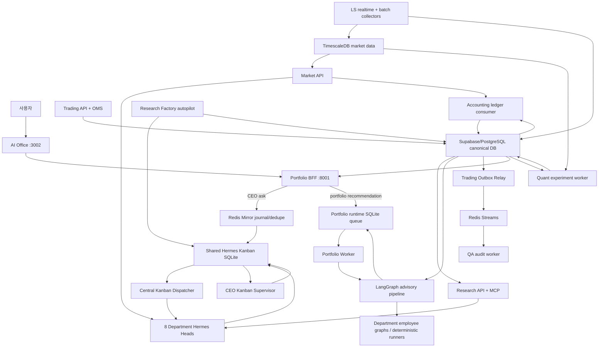
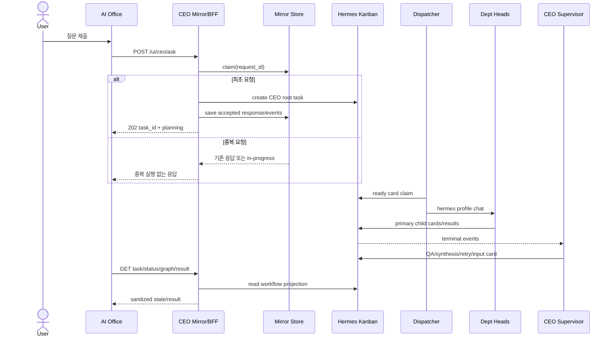
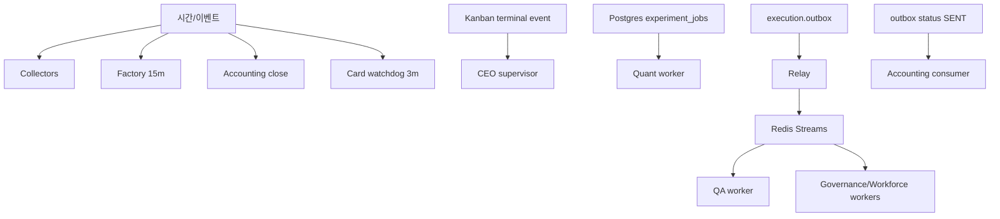
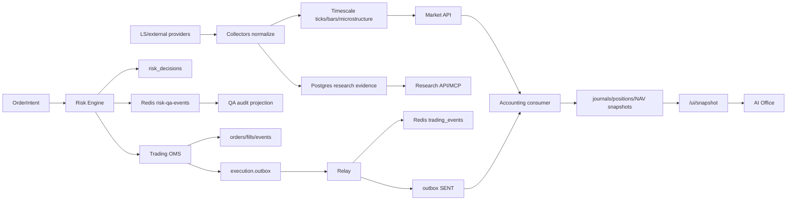
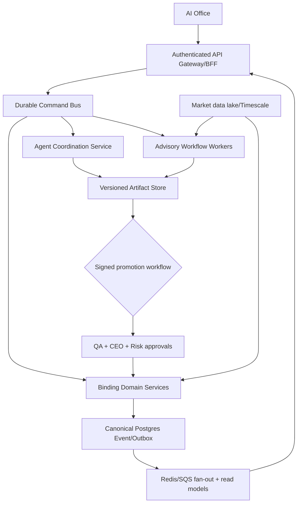

# AS-IS Runtime Blueprint — 실제 코드 기준 시스템 역설계

> 기준일: 2026-08-17 · 기준 커밋: `5c85168b062eaef667c3e11cafa1a114b77583cb` · 분석 대상: 해당 커밋의 실행 코드, Compose, DB migration, 테스트 · README/계획 문서는 코드 해석의 보조 근거로만 사용
>
> 문서 성격: 시점 고정 AS-IS 감사 스냅샷. 현재 정본은 코드·Compose·migration이며 이후 변경은 이 문서에 자동 반영되지 않는다.

## 한 문장 아키텍처 정의

이 시스템은 **AI Office/BFF를 입구로 삼아 Hermes Kanban 기반 비동기 CEO 협업, SQLite+LangGraph 기반 비동기 포트폴리오 자문, PostgreSQL·TimescaleDB·Redis를 이용한 시장데이터/리스크/주문/회계 실행면, 그리고 Research→Quant 실험 Factory를 서로 다른 런타임으로 병치한 “다중 제어면·단일 재무 사실원장 지향” 헤지펀드 운영 시스템**이다.

---

## 1. Executive Summary

현재 구현은 하나의 거대한 “멀티에이전트” 프로그램이 아니다. 실제로는 다음 네 개의 실행 체계가 나란히 존재한다.

1. **일반 CEO 질의 제어면**: `POST /ui/ceo/ask` → 중복 방지 Mirror → Hermes Kanban root card → CEO Hermes planner → 부서 child card → 중앙 dispatcher → CEO supervisor → synthesis. HTTP는 작업 접수까지만 기다리고 실제 부서 수행은 비동기다. 근거: `apps/api/ceo_mirror_api.py:155-210`, `apps/api/ceo.py:417-487`, `orchestration/adapters/ceo_supervisor.py:497-704`, `docker-compose.yml:1119-1206`.
2. **포트폴리오 추천 제어면**: `POST /ui/portfolio-recommendations` → durable SQLite queue → 별도 worker → LangGraph의 Research→Quant→Trading→Risk→QA→Accounting→CEO fan-out/fan-in → 비구속적 추천. 결과 승인도 주문 승인이 아니다. 근거: `apps/api/main.py:548-661`, `apps/api/portfolio_runtime.py:257-390,753-895`, `orchestration/workflows/portfolio_recommendation.py:1591-1703`.
3. **실제 PAPER 실행·재무 기록면**: Trading API/OMS가 RiskDecision을 받아 주문 상태를 전이하고, 체결 시 PostgreSQL transactional outbox에 `trading.fill.v1`을 기록한다. Relay가 Redis Stream에 발행하고 `SENT`로 표시하며, Accounting consumer가 동일 canonical outbox를 멱등 소비해 분개·포지션·NAV projection을 만든다. 근거: `departments/02-trading/api/app.py:380-560`, `departments/02-trading/oms/outbox.py:203-317`, `departments/02-trading/oms/relay.py:59-106`, `departments/05-accounting-portfolio/ledger/fill_consumer.py:278-316`.
4. **Research→Quant Factory**: 15분 autopilot이 연구 proposal을 수확·검증하고 Quant hypothesis로 승격한 뒤 PostgreSQL job queue에 실험을 발주한다. 별도 experiment worker가 lease를 잡아 데이터 해석, 사전등록, 백테스트, 강건성/과적합 평가, 결과 저장을 수행한다. Hermes 카드는 아이디어 생성·해석을 담당하지만 실험 실행 자체는 deterministic Python worker가 소유한다. 근거: `departments/01-research/factory/factory_autopilot.py:2226-2438`, `departments/04-quant-backtest/pipeline/job_queue.py:145-265`, `departments/04-quant-backtest/pipeline/experiment_worker.py:200-225,537-608`, `departments/04-quant-backtest/pipeline/experiment_orchestrator.py:569-741`.

가장 중요한 결론은 다음과 같다.

- **에이전트 텍스트는 권위 있는 재무 데이터가 아니다.** 직접 부서 질의는 `authoritative=false`, `source_of_record=/ui/snapshot`을 반환한다(`apps/api/hermes_boundary.py:408-419`).
- **추천과 주문은 연결되어 있지 않다.** 포트폴리오 그래프는 `production_enabled=false`, `external_writes=false`, `binding=false`로 종료한다(`orchestration/workflows/portfolio_recommendation.py:1631-1637`).
- **바인딩 판정은 deterministic domain engine에 남아 있다.** Risk Engine이 진입 판정을 하고 Trading OMS가 최종 제출 전 상태 불변식을 다시 검사한다(`departments/03-risk/api/app.py:495-548`, `departments/02-trading/api/app.py:419-463`).
- **공식 숫자는 Accounting projection과 DB read model이 소유한다.** UI는 이를 읽어 보여주는 projection이며 DB가 없으면 scripted demo fallback을 사용한다(`apps/api/main.py:664-683,807-855`).
- **YAML workflow runner는 통합 production orchestrator가 아니다.** production/live handler가 등록되지 않으면 명시적으로 BLOCKED된다(`orchestration/workflows/runner.py:27-91,230-245`).

---

## 2. Current AS-IS Architecture

### 2.1 논리 계층

| 계층 | 실제 구성 | 책임 | 권위 수준 |
|---|---|---|---|
| UI | `ai-office/` Next/React 앱 | CEO 질의, 작업/그래프/결과 polling, snapshot·WebSocket projection, mandate 화면 | 표시/입력만; 재무 권위 없음 |
| BFF | `apps/api/main.py` | UI용 단일 ingress, 인증/owner 검증, mandate binding 검증, 여러 API projection 집계 | 명령 접수·projection |
| Agent control plane | Hermes profiles, shared Kanban SQLite, dispatcher, CEO supervisor | 자연어 계획, 카드 기반 부서 위임, 결과 합성 | 분석/advisory |
| Advisory workflow | LangGraph portfolio graph + employee worker graphs | 적합성·리서치·전략·리스크·QA·회계·CEO 자문 | non-binding |
| Domain execution plane | Trading, Risk, QA, Accounting, Governance, Workforce FastAPI | 상태 머신, 정책 gate, 감사, 주문/원장 | 명시된 deterministic 기능만 binding |
| Data plane | collectors, Research API/MCP, Market API | LS 실시간/배치, 뉴스/공시/재무/거시, PIT evidence | 관측 데이터 |
| Experiment plane | Research Factory + Quant experiment queue/worker | 제안→가설→사전등록→백테스트→판정 | 실험 기록; 주문 권한 없음 |
| Persistence | Supabase/PostgreSQL, TimescaleDB, Redis, Kanban SQLite, portfolio SQLite | canonical tables, 시계열, event stream/cache, 작업 보드, 자문 queue | 저장소별 분산 소유 |

### 2.2 물리 프로세스

기본 Compose는 BFF/portfolio-worker, TimescaleDB, LS realtime, batch collectors, Market/Research/MCP API, Hermes profile containers, Redis, Risk/QA API와 QA worker, Kanban dispatcher/supervisor, Factory autopilot/experiment worker/card watchdog를 정의한다. CEO/Trading/Accounting/Workforce 서비스는 Compose fragment로 include된다(`docker-compose.yml:40-44`). 일부 서비스는 profile로만 활성화된다: legacy collectors, dashboard, research skills, legacy UI BFF.

Hermes head containers의 `sleep infinity`는 HTTP agent server가 아니다. 실제 카드 실행은 shared Kanban을 읽는 중앙 dispatcher가 필요한 profile로 `hermes` 실행을 spawn하는 구조다. 직접 `/agent/ask` 경로는 별도로 요청마다 CLI subprocess를 띄운다(`apps/api/hermes_boundary.py:348-417`).

### 2.3 전체 시스템 구성도



---

## 3. Component Map

| Component | Process/entrypoint | Input | Output/state | 호출 방식 |
|---|---|---|---|---|
| AI Office | `ai-office/app/*` | 사용자 UI 이벤트 | BFF 응답 projection | HTTP/WebSocket/SSE |
| Portfolio BFF | `uvicorn apps.api.main:app` | UI REST | snapshot, task status, recommendation run | request-response |
| CEO Mirror | `apps/api/ceo_mirror*.py` | Web/Discord canonical ingress | Redis/in-memory event journal, deduped CEO call | request-response + SSE |
| CEO workflow | `apps/api/ceo.py` | CEO query | Kanban root task | async task submit |
| Kanban dispatcher | `kanban daemon` | ready cards | Hermes agent processes/card transitions | loop, 기본 60초 |
| CEO supervisor | `scripts/run_ceo_supervisor.py` | terminal card watch events | QA/synthesis/retry/input cards | event loop, 1초 interval |
| Direct agent ask | `apps/api/hermes_boundary.py` | department/query | one text answer/session | request마다 subprocess |
| Portfolio runtime | `apps/api/portfolio_runtime.py` | validated profile | durable run projection | API enqueue + worker polling |
| Portfolio graph | `orchestration/workflows/portfolio_recommendation.py` | profile + live/test catalog | non-binding recommendation | LangGraph |
| Employee workers | `departments/employee_worker_runtime.py` 및 부서별 wrapper | bounded context | JSON report/confidence/evidence | async fan-out, local OpenAI-compatible model |
| Market collectors | `collectors/ls_realtime_service.py`, `collector_scheduler.py` | LS API/external sources | Timescale + canonical evidence | realtime websocket + scheduled subprocess |
| Research API/MCP | `departments/01-research/api/*` | DB queries/tool calls | evidence packets/factory submissions | HTTP/MCP |
| Factory autopilot | `factory_autopilot.py --loop --interval-min 15` | research/quant DB + completed cards | proposals, hypotheses, jobs, cards | periodic loop |
| Quant worker | `experiment_worker.py --serve` | `quant.experiment_jobs` | experiments/metrics/outcomes | leased DB queue |
| Risk API | `departments/03-risk/api/app.py` | order intent + canonical context | persisted RiskDecision + Redis event | synchronous deterministic gate |
| Trading API/OMS | `departments/02-trading/api/app.py` | intent, risk decision, broker event | execution tables/outbox | synchronous state machine |
| Outbox relay | `oms/relay.py --serve` | PostgreSQL outbox | Redis `trading_events`, SENT/DLQ | polling loop |
| Accounting consumer | `ledger/consumer.py --serve` | canonical SENT fills + market marks | journals, positions, snapshots | polling loop |
| QA worker/API | `qa_events/worker.py`, QA FastAPI | Risk event stream/artifacts | audit/eval/run records | stream consumer + sync API |
| Workforce/Governance | fragment APIs + event workers | lifecycle/change requests | approvals, profiles, access state | REST + Redis worker |

---

## 4. Directory / Module Responsibility

### 최상위

- `ai-office/`: UI와 Cloudflare-side reporting 코드. 금융 도메인의 source of truth가 아니다.
- `apps/api/`: UI BFF, CEO mirror/read model, direct agent boundary, portfolio durable runtime, snapshot aggregation.
- `apps/security/`: service token 검증 등 서비스 경계 보안.
- `departments/00-ceo-office/`: mandate/governance/change workflow, notification worker, CEO employee worker/profile.
- `departments/01-research/`: collectors, evidence repository/API/MCP, Research Factory, research workers.
- `departments/02-trading/`: OrderIntent/BrokerOrder 상태 머신, PAPER broker, outbox/relay, TCA.
- `departments/03-risk/`: deterministic Risk Engine, trading-state Redis, policy RAG, P1/P2 gates, risk event projection 코드.
- `departments/04-quant-backtest/`: hypothesis contracts, dataset resolution, preregistration, backtest, overfit/fragility, experiment queue/worker.
- `departments/05-accounting-portfolio/`: double-entry ledger, fill consumer, valuation/NAV, reconciliation, close, investor profiles.
- `departments/06-ai-qa-audit/`: evidence QA, model risk/internal audit, eval runner, event consumer, corrective action/run audit.
- `departments/07-agent-workforce/`: hiring/roster/access/improvement/workforce planning과 관련 API.
- `orchestration/`: 공통 계약, profile/skill routing, CEO supervisor, YAML workflow runner, portfolio LangGraph.
- `platform_iam/`: PostgreSQL role/Redis namespace provisioning 구현. Workforce의 `provisioning_ref`와 논리 연결되지만 기본 Compose 상주 서비스는 확인되지 않는다.
- `supabase/migrations/`: governance, research, quant, execution, risk, accounting, audit, workforce canonical schema.
- `timescaledb/migrations/`: 시장 tick/bar/PIT provenance/microstructure schema.
- `skills/`: Hermes가 카드 실행 시 사용할 shared skill surface.
- `deploy/`: 배포 관련 구성. 그러나 현재 Compose의 local shared-volume/SQLite 가정을 자동으로 분산 환경으로 바꾸지는 않는다.

### Agent / Worker / Runner 구분

- **Department Head / Hermes agent**: 자연어 작업을 계획·위임·요약한다. Kanban card의 assignee profile로 실행된다.
- **Employee Worker**: 단일 bounded 역할의 LangGraph tool→LLM→validation 보고서 생성기다. 모든 결과는 non-binding이다(`departments/employee_worker_runtime.py:338-377`).
- **Deterministic Runner/Engine**: Risk verdict, QA evidence decision, OMS transition, Ledger posting처럼 재현 가능한 규칙을 소유한다. 모델 보고서가 이 판정을 뒤집지 못한다.
- **Daemon Worker**: queue/stream/polling을 소비한다. portfolio worker, outbox relay, accounting consumer, QA worker, Factory/experiment worker가 여기에 해당한다.

---

## 5. User Request End-to-End

### 5.1 일반 CEO 질문

1. AI Office `ceoClient`가 `POST /ui/ceo/ask`를 호출한다.
2. BFF의 유일한 route owner인 `ceo_mirror_api.mirror_ask`가 source/request/actor/fund를 canonical ingress로 정규화한다.
3. Mirror store가 `request_id`를 claim한다. Redis URL이 있으면 Redis store, 없으면 process-local memory를 쓴다. 중복 요청은 첫 실행의 응답을 최대 3초 기다리고 CEO를 두 번 실행하지 않는다(`apps/api/ceo_mirror.py:489-522`).
4. 최초 요청이면 `USER_MESSAGE` mirror event를 발행하고 `ceo_query`를 한 번 호출한다.
5. `ceo_query`는 `fund_id`가 있으면 current mandate를 best-effort 조회하고, query로부터 `analysis|binding` mode를 추론한 root body를 만든다.
6. Hermes CLI로 CEO root card를 idempotency key와 함께 생성하고 root-scope comment를 남긴다(`apps/api/ceo.py:455-487`).
7. HTTP는 약 4초 동안 planning projection만 기다린 뒤 202 accepted를 반환한다. 이후 UI는 task/status/graph/result를 polling하거나 mirror SSE event를 구독한다.
8. 중앙 dispatcher가 ready root card를 CEO profile로 실행한다. CEO profile은 필요한 primary department child card를 만든다.
9. 각 child card가 독립 실행되고 terminal 상태가 shared Kanban에 기록된다.
10. supervisor는 terminal watch event를 받아 현재 workflow 전체를 재구성한다. primary가 끝나면 analysis mode에서는 synthesis를 빠르게 만들고 QA를 비동기 branch로 만들 수 있다. binding mode에서는 QA 완료 전 최종 synthesis를 만들지 않는다.
11. synthesis card 결과가 CEO task result projection에 노출된다. Notion projection은 별도 non-binding side effect다.



### 5.2 포트폴리오 추천 요청

1. BFF는 universe와 owner를 검증한다. advisory-only가 아니면 mandate version/policy hash pair와 Governance binding을 검증한다(`apps/api/main.py:553-590`).
2. `RUNTIME.start`가 request fingerprint/idempotency를 검사하고 SQLite에 run snapshot과 queue row를 저장한다.
3. HTTP는 즉시 202와 run reference를 반환한다.
4. 별도 `portfolio-worker`가 queue를 polling하고 lease/heartbeat를 소유한다. `BEGIN IMMEDIATE`와 active slot 때문에 한 store에서 사실상 한 run만 실행된다(`apps/api/portfolio_store.py:161-226,277-321`).
5. DB URL이 있으면 Supabase read-only adapter를 사용한다. 없으면 TEST catalog를 사용한다. DB가 구성됐는데 live read가 실패하면 TEST로 조용히 fallback하지 않고 빈 universe/HOLD로 끝낸다(`apps/api/portfolio_runtime.py:761-790`).
6. LangGraph가 선택된 worker를 부서별 fan-out하고 deterministic fan-in/gate를 수행한다.
7. 결과와 event projection을 SQLite에 저장한다. UI는 status endpoint/WebSocket snapshot으로 진행 상황을 읽는다.
8. 사용자 APPROVE는 추천 승인 기록일 뿐 주문/포지션/원장을 바꾸지 않는다.

---

## 6. Research Pipeline

### 6.1 수집면

- `ls_realtime_service.py`: LS WebSocket을 normalize하여 symbol shard별 MarketSink로 TimescaleDB에 tick/quote를 저장한다. reference symbol mapping은 canonical PostgreSQL에서 읽는다(`collectors/ls_realtime_service.py:222-306`).
- `collector_scheduler.py`: `JOBS` 테이블에 정의된 배치 수집기를 subprocess로 실행하고 timeout, same-day retry, run history를 관리한다(`collector_scheduler.py:331-424,493-559`).
- legacy news collector는 Compose profile로 분리되어 기본 기동 대상이 아니다.

### 6.2 조회면

- Research API는 news, disclosure, financial, restriction, calendar, method performance, macro, search, story endpoint를 제공한다(`departments/01-research/api/main.py:231-629`).
- Market API는 snapshot, bars, breadth, freshness/windows/summary DQ, daily regime, microstructure를 제공한다(`market_api.py:178-374`).
- Research MCP는 packet 실행/조회, employee worker 실행, recent packets, collector health, geopolitical state, calibration, Factory brief/submission/outcome, signal library 도구를 제공한다(`api/mcp_server.py:492-983`).
- Research packet/worker tool은 긴 작업을 job으로 반환할 수 있어 Hermes 호출 시간과 분리된다.

### 6.3 Research Factory 내부 흐름

한 `cycle()`의 실제 순서는 다음과 같다.

1. **harvest**: 이전 planner 카드의 완료 결과에서 정식 `factory_submit_proposal` 저장분을 우선 읽고, 없으면 attachment/workspace/result fallback을 파싱한다.
2. **promote**: proposal intake와 Gate 0 검증을 통과한 PUBLISHED proposal을 `quant.hypotheses`로 승격한다.
3. **dispatch experiments**: allocator가 PROPOSED hypothesis를 선택하고 data/config structural check 후 `quant.experiment_jobs`에 enqueue한다.
4. **refresh datasets**: 하루 한 번 microstructure 및 spec dataset builder를 실행한다. 코드상 dispatch 뒤에 refresh가 있어 신규 dataset이 필요한 hypothesis는 한 주기 늦게 실행될 수 있다(`factory_autopilot.py:2266-2279`).
5. **scout card**: material lead starvation이면 Research scout card를 만든다.
6. **planner card**: DB 기반 research brief가 성공한 경우에만 Research planner card를 만든다. brief가 실패하면 근거 없는 카드를 만들지 않는다(`factory_autopilot.py:2323-2388`).
7. **quant interpretation card**: 대기 결과가 있으면 Quant Hermes에 해석/후속 가설 card를 만든다(`factory_autopilot.py:2394-2432`).
8. **bottleneck cards**: census가 발견한 반복 병목을 개선 card로 만든다.

---

## 7. Quant Pipeline

### 7.1 Queue와 concurrency

`quant.experiment_jobs`는 PostgreSQL durable queue다. enqueue는 동일 hypothesis의 QUEUED/LEASED 중복을 막고, 같은 실패 사유가 임계 횟수 이상 반복되면 명시적 replay 사유 없이는 재발주를 차단한다(`job_queue.py:119-206`). Lease는 `FOR UPDATE SKIP LOCKED`를 사용하므로 여러 worker가 병렬로 서로 다른 job을 잡을 수 있다(`job_queue.py:209-247`). 기본 batch는 1이고 lease timeout은 30분이다.

### 7.2 한 실험의 call chain

`experiment_worker.run_one` → hypothesis terminal/running gate → `experiment_orchestrator.orchestrate` → data resolution → feasibility → config rejection → preregistration → status `PREREGISTERED`→`RUNNING` → strategy/backtest chain → trial family/PBO/metrics → outcome/terminal status → job `DONE|FAILED|CANCELLED|RELEASED`.

Orchestrator의 핵심 안전장치는 다음과 같다.

- canonical metadata DB와 Timescale market DB를 분리해 사용한다(`experiment_orchestrator.py:560-568`).
- 요구 dataset 이름을 manifest/source version으로 resolve하고 unmapped/missing이면 `NOT_RUNNABLE`이다(`:600-620`).
- config binding이 읽지 못하는 edge parameter는 거부한다(`:624-630`, 실제 bind는 `:965-982`).
- 결과를 보기 전에 preregistration fingerprint를 만들고 유효한 상태 전이만 허용한다(`:631-679`).
- trial family별 시도 횟수와 PBO를 계산해 multiple testing pressure를 반영한다(`:681-759`).
- 실행 chain 예외 시 hypothesis를 RUNNING에 방치하지 않고 PROPOSED로 되돌린다(`:715-728`).

### 7.3 Research→Quant 연결도

```mermaid
flowchart LR
    E["Research evidence/leads"] --> PC["Hermes Research planner card"]
    PC --> SUB["factory_submit_proposal MCP"]
    SUB --> RP["research.experiment_proposals"]
    RP --> G0{"Proposal intake + Gate 0"}
    G0 -->|reject| RLOG["rejection/outcome history"]
    G0 -->|publish/promote| H["quant.hypotheses PROPOSED"]
    H --> ALLOC["deterministic allocator"]
    ALLOC --> Q["quant.experiment_jobs QUEUED"]
    Q --> LEASE["experiment worker lease"]
    LEASE --> DR["dataset resolution"]
    DR --> PR["preregistration + fingerprint"]
    PR --> BT["backtest / walk-forward / cost"]
    BT --> ROB["fragility + DSR/PBO + falsification"]
    ROB --> EXP["quant.experiments + metrics"]
    EXP --> OUT["research.experiment_outcomes"]
    OUT --> QC["Quant interpretation card"]
    QC --> NOTE["research note / next hypothesis feedback"]
```



---

## 8. Research → Quant Integration

이 연결은 실제 구현되어 있으나 “Research agent가 Quant 코드를 직접 실행”하는 구조는 아니다.

- Research Hermes는 proposal/lead를 MCP tool로 제출한다.
- Factory Python 코드가 schema/lineage/config 적합성을 검증하고 DB에 보존한다.
- `factory_bridge.promote_published`가 proposal과 hypothesis 사이 lineage를 만든다.
- allocator와 job queue가 실행 대상을 결정한다.
- Quant Python worker가 백테스트를 실행한다.
- Hermes Quant agent는 완료 결과의 해석과 후속 연구 note/가설 생성에 사용된다.

따라서 control flow는 **LLM 제안 → deterministic 검증/승격 → durable queue → deterministic experiment → LLM 해석**, data flow는 **canonical evidence/market data → proposal/hypothesis lineage → experiment artifacts/metrics/outcomes**이다.

명확한 단절도 있다. 이 실험 결과가 Trading의 OrderIntent로 자동 변환되는 production promotion service는 확인되지 않는다. 전략 연구 YAML에는 Quant→QA→CEO→Quant feedback이 설계되어 있으나, production runner handler는 등록되어 있지 않다.

---

## 9. Background / Loop Processes

| Loop | 주기/trigger | 하는 일 | 실패 의미 |
|---|---|---|---|
| Kanban dispatcher | 기본 60초 | ready card claim, Hermes profile 실행 | card blocked/retry; shared dispatcher 병목 |
| CEO supervisor | watch + 1초 interval | terminal event에 QA/synthesis/retry/input 결정 | workflow terminal projection 지연 |
| Portfolio worker | 짧은 poll | SQLite queue claim/heartbeat/run | run은 durable queue에 남음 |
| LS realtime | 세션 기반 long-running | websocket tick/quote capture | 실시간 gap; heartbeat 통계 |
| Batch collector scheduler | job schedule/window | 외부/LS 수집기 subprocess | same-day retry/run log |
| Trading outbox relay | 기본 1초 idle | pending/failed outbox→Redis, SENT/DLQ | at-least-once 재시도 |
| Accounting ledger consumer | 기본 1초 | SENT fill→journal→position→NAV | mark 부재면 position은 반영, NAV 보류 |
| QA event worker | 기본 1초 | Risk event stream→QA audit record | consumer group pending/reclaim 대상 |
| Governance notification worker | stream loop | governance event notification | projection/notification 지연 |
| Workforce improvement worker | stream loop | workforce event 처리 | lifecycle projection 지연 |
| Accounting close scheduler | daily/weekly rules | close/reconciliation/report | 해당 close 보류 |
| Factory autopilot | 15분 | harvest/promote/dispatch/refresh/cards | 부분별 실패 count, 다음 cycle 계속 |
| Quant experiment worker | continuous | leased experiment 실행 | release/requeue/fail with reason |
| Card watchdog | 3분 | stale/abnormal cards 감시 | 운영 경고/복구 card |



---

## 10. Data Flow

### 10.1 Canonical stores

- **Supabase/PostgreSQL**: reference IDs, governance mandate, workforce, research evidence/proposals/outcomes, quant hypotheses/experiments/jobs/metrics, execution/risk/accounting/audit. Migration이 논리 schema를 정의한다.
- **TimescaleDB**: tick, quote, bars, PIT provenance, microstructure. 대용량 시계열 소유.
- **Redis**: Risk↔QA events, trading event fan-out, UI mirror dedupe/journal, risk trading-state. 영구 재무 원장은 아니다.
- **Hermes Kanban SQLite**: agent task graph와 상태. 재무 주문/원장이 아니다.
- **Portfolio runtime SQLite**: 한 BFF deployment의 advisory run/queue/projection. canonical portfolio ledger가 아니다.

### 10.2 핵심 이벤트 봉투

Trading fill의 authoritative chain은 `execution.fills`를 임의 polling하는 것이 아니라 `execution.outbox`의 `trading.fill.v1` envelope다. relay는 Redis로 fan-out하고 outbox를 SENT로 바꾼다. Accounting은 SENT row를 `execution.outbox_consumed`와 join하여 멱등 소비한다(`fill_consumer.py:110-215`). Journal을 먼저 저장하고 그 다음 ack하므로 crash 후 같은 event가 재선택되어도 journal idempotency로 안전하게 회복한다(`:298-306`).

Risk 결정은 DB에 먼저 저장되고 Redis `risk-qa-events`에 발행된다(`departments/03-risk/api/app.py:382-404`). QA worker가 consumer group으로 이를 audit read model에 적재한다. Risk projection worker 코드도 Redis→PostgreSQL sink를 제공하지만 기본 Compose 서비스는 없다.



---

## 11. Major Call Chains

### CEO 질의

`AI Office ceoClient.ask` → `ceo_mirror_api.mirror_ask` → `ceo_mirror.execute_once` → `ceo.ceo_query` → `hermes_boundary.create_kanban_task` → shared Kanban → dispatcher → CEO/department Hermes → `CeoSupervisorService.handle_terminal_event` → `_execute` → QA/synthesis card → `ceo_kanban_read.load_workflow` → BFF result.

### 직접 부서 질의

`POST /research|risk|quant|qa/agent/ask` 또는 trading/accounting agent router → `department_agents._ask` → `hermes_boundary.ask` → `subprocess.run(hermes -p <profile> chat -Q -q ...)` → sanitized text + session ID. Queue가 없고 HTTP timeout이 곧 작업 timeout이다.

### 포트폴리오 추천

`start_portfolio_recommendation` → Governance binding verify → `PortfolioRuntime.start` → `PortfolioStore.enqueue` → `portfolio_worker` → `PortfolioRuntime.run_once/_run` → `run_portfolio_recommendation_pipeline_async` → LangGraph stages → SQLite projection → GET status/approval.

### PAPER 주문/원장

`create_order_intent` → `request_risk_review` → Risk API `risk_check`/RiskDecision → Trading `apply_risk_decision` → `create_broker_order` → `submit_order` → broker event → OMS fill + outbox insert → relay `drain/publish` → Accounting `pending_fill_events` → `consume_fill` → `settle_due` → `project`.

### Factory

`factory_autopilot.cycle` → `harvest` → proposal intake → `_promote`/`factory_bridge.promote_published` → `_dispatch_experiments`/allocator → `job_queue.enqueue` → experiment worker `lease/run_one` → orchestrator → experiment/outcome → next cycle `quant_brief` → Quant card/research note.

---

## 12. Mermaid Diagram Index

이 문서에는 요구된 네 가지 이상을 모두 포함한다.

1. 전체 시스템 구성도 — §2.3
2. 사용자 CEO 질의 sequence — §5.1
3. Research→Quant pipeline — §7.3
4. canonical data flow — §10.2
5. background loops — §9

---

## 13. Implementation Status Matrix

판정 기준: **IMPLEMENTED**는 코드와 기본 런타임 배선이 모두 있음, **PARTIAL**은 핵심 코드가 있으나 배선/운영 조건/일부 분기가 빠짐, **SKELETON**은 interface/domain 골격 중심, **NOT IMPLEMENTED**는 설계 흔적만 있고 실행 경로 없음, **UNKNOWN**은 외부 상태 없이는 확인 불가다.

| 영역 | 상태 | 코드 근거와 판정 |
|---|---|---|
| AI Office UI→BFF | IMPLEMENTED | clients가 CEO/snapshot/mandate API와 WebSocket/SSE 사용; BFF route 존재 |
| CEO request dedupe/mirror | IMPLEMENTED | Redis/in-memory store, claim/save/events (`ceo_mirror.py:233-561`) |
| CEO Kanban orchestration | IMPLEMENTED | root task, dispatcher, supervisor, read model, Compose 배선 |
| CEO analysis-mode QA gate | PARTIAL | QA branch는 생성되지만 fast synthesis가 QA보다 먼저 가능(`ceo_supervisor.py:591-622`) |
| CEO binding-mode QA gate | IMPLEMENTED | QA terminal 이후 final synthesis(`:623-704`) |
| Direct department ask | IMPLEMENTED | subprocess 기반, feature flag 필요; 확장성 낮음 |
| Portfolio recommendation API/queue | IMPLEMENTED | BFF+SQLite+worker Compose 배선 |
| Portfolio recommendation business flow | IMPLEMENTED | LangGraph 전 단계 구현, non-binding 종료 |
| Portfolio REJECT approval | PARTIAL/BUG | `decide()`의 모든 기록 코드가 `if decision == "APPROVE"` 안에 있어 REJECT는 `None` 반환(`portfolio_runtime.py:859-895`) |
| Portfolio runtime horizontal scale | NOT IMPLEMENTED | shared SQLite와 single active slot; distributed claim store 아님 |
| Market realtime collection | IMPLEMENTED | LS websocket→Timescale, service 배선 |
| Batch research collection | IMPLEMENTED | scheduler/retry/run history, service 배선 |
| Research API/MCP | IMPLEMENTED | evidence/market/factory tool surface 존재 |
| Research Factory proposal→hypothesis | IMPLEMENTED | harvest/promotion/lineage/migrations |
| Quant durable experiment queue | IMPLEMENTED | PostgreSQL lease/skip-locked/recovery |
| Quant preregistration/backtest/robustness | IMPLEMENTED | orchestrator와 pipeline modules 존재 |
| Quant result→live strategy promotion | NOT IMPLEMENTED | 자동 production promotion/order-intent 연결 없음 |
| YAML investment-case test/paper flow | IMPLEMENTED | test/paper adapters 존재 |
| YAML investment-case production flow | NOT IMPLEMENTED | production handlers가 비어 BLOCKED |
| Risk deterministic order gate | IMPLEMENTED | canonical DB context, Redis trading state, mandate/P1 gate |
| Risk→QA event publication | IMPLEMENTED | DB save + Redis publish, QA worker Compose 배선 |
| Risk Redis projection worker | PARTIAL | 구현은 있으나 기본 Compose 서비스 없음 |
| Trading PAPER OMS | IMPLEMENTED | intent/risk/order/broker event 상태 머신 |
| Real broker adapter/order transport | UNKNOWN/PARTIAL | 현재 노출된 case 경로는 paper broker; 운영 broker credential/state는 코드만으로 확인 불가 |
| Trading transactional outbox/relay | IMPLEMENTED | PostgreSQL outbox, retry/backoff/DLQ, Redis relay |
| Accounting fill→ledger→NAV | IMPLEMENTED | canonical SENT consumer, double entry, marks, settlement, projection |
| Accounting missing-mark policy | IMPLEMENTED | position 반영 후 NAV fail-closed 보류 |
| QA evidence/eval/audit | IMPLEMENTED | API, durable repository, Redis worker |
| production `/investment-cases/.../qa-check` | PARTIAL | `QA_CHECK_CONTRACT_APPROVED=true` 전에는 503(`qa api:595-687`) |
| Workforce lifecycle APIs | IMPLEMENTED | hiring/access/roster/improvement/plan endpoint 다수 |
| Workforce repository interfaces 일부 | SKELETON | 여러 base method가 `NotImplementedError`; 실제 app repository 선택에 의존 |
| Platform IAM planners/managers | IMPLEMENTED code / PARTIAL wiring | role/namespace manager 존재, 기본 상주 service 배선 미확인 |
| UI official snapshot | IMPLEMENTED with fallback | DB read model 우선; 없으면 test `PaperLoopTest` demo fallback |
| Runtime health verification | PARTIAL | 일부 readiness는 실제 dependency round-trip보다 구성 존재 여부 중심 |
| AWS-ready scale-out | NOT IMPLEMENTED | host volume, Docker socket, shared SQLite, fixed container names, single dispatcher/worker assumptions |

### 실행 검증 결과

검증일/범위: 2026-08-17, 로컬 Windows 환경의 아래 선별 테스트. 전체 테스트 스위트와 실제 Docker stack 가동 여부를 검증한 결과는 아니다.

선별 테스트 명령:

```text
python -m pytest -q -p no:cacheprovider \
  tests/api/test_main_routes.py \
  tests/api/test_portfolio_recommendation_bff.py \
  tests/orchestration/test_ceo_supervisor.py \
  departments/03-risk/tests/test_projection_worker.py
```

결과는 **74 passed, 6 failed, 5 subtests passed**였다. 6개 실패는 모두 로컬 test process에서 durable store path가 구성되지 않아 portfolio POST가 예상 202 대신 409 `portfolio_runtime_store_unavailable`을 반환한 동일 원인이다. Compose는 `/var/lib/portfolio/runtime.sqlite3`와 shared volume을 명시하므로 production Compose 배선 결함으로 단정하지 않되, test/runtime configuration contract가 맞지 않는 상태로 분류한다. Docker daemon의 실제 실행 상태는 이 환경의 구형 Docker CLI에서 `docker compose`가 지원되지 않아 UNKNOWN이다.

---

## 14. Designed vs Implemented

| 설계 의도 | 실제 구현 |
|---|---|
| 하나의 8부서 end-to-end workflow | CEO Kanban, portfolio LangGraph, YAML runner, domain API가 서로 다른 orchestration 체계로 병존 |
| YAML workflow가 production 실행 | test/paper adapter만 실질 동작; production handler 없음 |
| 분석→QA→CEO 순차 승인 | binding mode는 대체로 일치; analysis mode는 응답속도를 위해 QA와 synthesis가 분기 |
| 에이전트가 다수 독립 worker를 운용 | 실제 고정 LLM employee worker는 profile config 기준 약 10개이며 Trading은 동적 strategy worker만 생성; 오래된 workflow 문서의 26 worker 표와 불일치 |
| UI가 운영 현황을 표시 | 구현됨. 다만 DB 미구성 시 scripted demo를 표시할 수 있어 화면이 live인지 반드시 source flag를 봐야 함 |
| Risk/QA event projection | Risk→QA는 배선됨. 범용 Risk projection worker는 코드만 있고 기본 서비스 없음 |
| Research 결과가 전략/주문으로 이어짐 | Research→Quant 실험까지는 구현. Quant→live trading 승격은 수동/미구현 |
| 멀티 인스턴스/클라우드 운영 | 일부 DB queue는 scale-out 가능하지만 CEO/portfolio/dispatcher는 로컬 SQLite·host volume 의존 |

---

## 15. Architectural Problems

1. **오케스트레이션이 네 갈래로 분열**되어 있다. 동일 “case/workflow” 개념이 Kanban, LangGraph state, YAML WorkflowRun, domain API state machine에 별도 존재하며 공통 correlation/terminal semantics가 약하다.
2. **포트폴리오 REJECT 버그**가 있다. validation과 저장이 APPROVE branch 안에 들어가 REJECT가 기록되지 않는다.
3. **`PortfolioRuntime._event`에 대규모 unreachable dead code**가 남아 있다. `return self._record_event(...)` 이후 `:646-751`은 실행되지 않아 두 구현이 표류한다.
4. **BFF production module에 test loop fallback이 내장**되어 있다. DB 장애/미구성 때 demo와 live의 경계가 UI에서 충분히 강하게 드러나지 않으면 운영 오인이 가능하다.
5. **SQLite 두 종류가 핵심 control plane에 남아 있다.** shared Kanban SQLite와 portfolio runtime SQLite는 단일 호스트/volume 장애와 lock contention에 취약하다.
6. **중앙 dispatcher 단일 병목**이다. 모든 profile card가 하나의 dispatcher/보드와 resource limit에 묶인다.
7. **직접 agent ask는 요청당 프로세스 spawn**이다. cold start가 크고 queue/backpressure/cancellation이 HTTP timeout과 결합된다.
8. **readiness 의미가 서비스마다 다르다.** BFF는 구성 유무 중심, 일부 domain API는 DB repository 생성 중심이며 실제 downstream end-to-end readiness가 아니다.
9. **Redis stream과 PostgreSQL outbox의 소비 모델이 혼재**한다. Accounting은 canonical DB SENT row를 소비하고 Redis는 fan-out인데, 운영자가 Redis가 원장 source라고 오해하기 쉽다.
10. **Factory cycle의 dataset refresh 순서가 dispatch 뒤**다. 필요한 데이터가 그 cycle에서 생성되어도 발주는 먼저 실패/보류될 수 있다.
11. **Compose가 host-specific**이다. `/home/ubuntu/.hermes`, Docker socket, fixed container names, local bind mount가 이식성과 isolation을 낮춘다.
12. **코드/문서 인코딩 손상**이 광범위하다. 실행 로직은 동작해도 운영 메시지, docstring, error text의 가독성과 prompt 품질을 해친다.
13. **profile worker inventory와 상위 workflow 설명이 불일치**한다. 실제 routing 판단은 profile config/registry를 기준으로 해야 한다.

---

## 16. Missing Components / Broken Connections

### 확실히 없는 연결

- 포트폴리오 추천 APPROVE → Trading OrderIntent 자동 생성.
- Quant experiment PASS → production strategy registration → Risk review → order generation 자동 승격.
- YAML `investment-case`의 production/live handler set.
- 분산 Kanban backend/dispatcher leader election.
- portfolio runtime용 PostgreSQL/Redis distributed queue.

### 코드가 있으나 기본 배선이 없는 연결

- `risk_events/projection_worker.py` 상주 service.
- `platform_iam/service.py` 상주 provisioning consumer.
- research skills용 paper/youtube MCP는 optional Compose profile.
- hermes dashboard와 legacy UI BFF는 optional profile.

### 조건부/운영 상태 UNKNOWN

- 실제 LS/OpenAI/Notion/Discord/Supabase credentials와 외부 API 가용성.
- 실제 broker adapter가 PAPER 외 주문을 전송할 수 있는지와 운영 승인 상태.
- QA production corpus가 placeholder 없이 적재되어 있는지.
- 현재 Docker stack이 실행 중인지. 로컬 CLI로 확인 불가.
- Supabase migration이 목표 DB에 모두 적용됐는지.

### 깨진 연결/결함

- Portfolio REJECT branch.
- 로컬 선택 테스트와 durable-store-required runtime 초기화 간 설정 불일치.
- Risk projection worker의 Compose 누락.
- production BFF의 demo fallback이 data provenance를 흐릴 수 있음.

---

## 17. Recommended TO-BE

### P0 — 정확성/권한 경계

1. Portfolio `decide()`의 APPROVE/REJECT 공통 validation·저장 경로를 바로잡고 회귀 테스트를 추가한다.
2. UI snapshot envelope에 `source=LIVE|DEMO|DEGRADED`, `as_of`, `canonical_store`, dependency freshness를 필수화하고 production에서는 demo fallback을 feature flag 뒤로 격리한다.
3. “추천 승인”과 “주문 승인”을 타입과 endpoint namespace에서 더 강하게 분리한다. recommendation approval은 어떤 execution command도 발행하지 않는다는 불변식을 contract test로 고정한다.
4. Quant→Trading promotion은 자동 주문이 아니라 서명된 `StrategyPromotionCandidate` artifact를 만들고 QA→CEO→Risk 승인 후에만 OrderIntent factory가 소비하도록 설계한다.

### P1 — 제어면 통합

5. 모든 장기 작업에 공통 `case_id`, `trace_id`, `workflow_id`, `artifact_ref`, `idempotency_key` envelope를 사용한다.
6. Kanban/LangGraph/YAML runner의 역할을 정리한다: Kanban=human/agent coordination, LangGraph=bounded advisory computation, domain workflow engine=binding state transition. YAML은 이 셋의 관측 가능한 contract catalog로 한정하거나 실제 production adapter를 완성한다.
7. 직접 agent ask를 durable job API로 전환해 subprocess pool/gateway, cancellation, concurrency quota, backpressure를 제공한다.
8. analysis mode의 fast synthesis와 QA completion을 UI에 서로 다른 상태로 표시한다. “응답 완료”와 “감사 완료”를 같은 DONE으로 합치지 않는다.

### P1 — 저장/확장

9. portfolio SQLite queue를 PostgreSQL `SKIP LOCKED` queue나 관리형 queue(SQS 등)로 옮기고 run projection은 PostgreSQL/Redis read model로 분리한다.
10. Hermes Kanban을 분산 DB-backed task store로 옮기거나 dispatcher sharding/leader election을 추가한다.
11. Docker socket과 fixed container-name exec를 제거하고 orchestrator가 profile worker service/API를 호출하도록 바꾼다.
12. Redis는 ephemeral fan-out/cache로 명확히 제한하고 replay source는 PostgreSQL event/outbox로 통일한다.

### P2 — 운영성

13. 모든 readiness가 실제 DB/Redis/downstream lightweight round-trip과 migration version을 검사하도록 표준화한다.
14. Factory에서 dataset refresh를 dispatch 전에 실행하거나 dataset availability event가 hypothesis queueing을 trigger하도록 바꾼다.
15. Risk projection worker와 Platform IAM consumer를 실제 service로 배선하고 ownership/runbook을 추가한다.
16. mojibake를 UTF-8로 일괄 복구하고 user-facing error/prompt golden test를 둔다.
17. 최소 end-to-end contract test를 세 경로로 분리한다: CEO advisory, portfolio advisory, PAPER order→fill→ledger. 각 테스트는 다른 경로가 우연히 대신 성공하지 못하게 store/source를 검증해야 한다.

### 권장 목표 구조



---

## 처음 읽어야 할 Top 10 파일

1. `apps/api/main.py` — UI ingress, portfolio API, snapshot, readiness 전체 경계.
2. `apps/api/ceo.py` — 일반 CEO 질의가 Kanban root task로 바뀌는 지점.
3. `apps/api/ceo_mirror.py` — request dedupe와 Web/Discord 공용 event journal.
4. `orchestration/adapters/ceo_supervisor.py` — primary/QA/synthesis/retry의 실제 제어 규칙.
5. `orchestration/workflows/portfolio_recommendation.py` — 자문 파이프라인의 실제 LangGraph.
6. `apps/api/portfolio_runtime.py` — durable run/worker/event projection과 현재 결함.
7. `departments/01-research/factory/factory_autopilot.py` — Research→Quant 공장 전체 주기.
8. `departments/04-quant-backtest/pipeline/experiment_orchestrator.py` — 데이터·사전등록·백테스트·강건성의 실행 정본.
9. `departments/02-trading/oms/oms.py` — 주문/브로커 이벤트 상태 머신과 불변식.
10. `departments/05-accounting-portfolio/ledger/fill_consumer.py` — 체결이 공식 분개·포지션·NAV가 되는 경계.

보조로 `docker-compose.yml`, 네 개의 `departments/*/compose.yaml`, `supabase/migrations/*`, `timescaledb/migrations/*`를 함께 읽어야 “코드가 존재함”과 “기본 런타임에 배선됨”을 구분할 수 있다.
