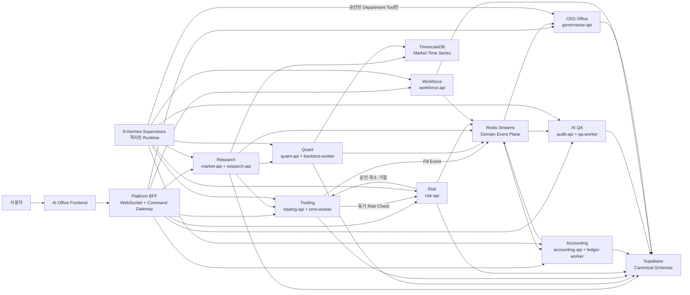
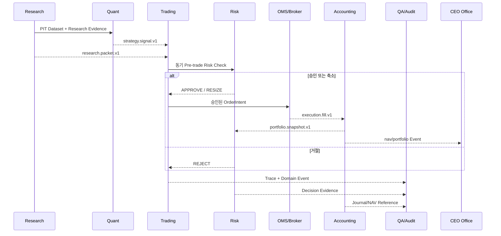

# Department Backend Integration and Docker Plan

> 상태: 전 본부 Backend 연결과 Container 운영의 구현 기준 v1.2
>
> 기준일: 2026-08-03
>
> 적용 범위: CEO Office, 6개 본부, Agent Workforce 인사팀, AI Office와 공통 Platform
>
> 본부별 Local Model 기준: [Ollama Department Modelfile Guide](OLLAMA_DEPARTMENT_MODELFILE_GUIDE.md)
>
> 실제 실행 증거와 Owner별 Daily Scrum: [실행 현황과 통합 계획 v2.1](../PROJECT_IMPLEMENTATION_STATUS.md)

## 1. 이 문서가 결정하는 것

이 프로젝트에는 이미 본부별 폴더, Domain Model, 일부 FastAPI, 데이터 수집기와 Docker Compose가 있다. 그러나 다음 내용은 여러 문서에 나뉘어 있었다.

- 어느 본부가 어떤 Backend Service를 소유하는가
- 본부 간 호출은 HTTP, Event 또는 Hermes Kanban 중 무엇을 사용하는가
- 각 본부를 어떤 Docker Image와 Process로 실행하는가
- Supabase, TimescaleDB와 Redis 접근 권한을 어디까지 주는가
- 한 서비스가 멈췄을 때 거래와 조직 운영을 어떻게 제한하는가
- 현재 리서치 중심 Compose를 어떤 순서로 전 본부 구조로 확장하는가

이 문서는 위 항목의 단일 구현 기준이다. 제품 범위는 [마스터 플랜](../HEDGE_FUND_MASTER_PLAN.md), 폴더 소유권은 [저장소 구조](REPOSITORY_DEPARTMENT_STRUCTURE.md), 세부 Domain 계약은 각 팀 가이드와 API 설계서를 따른다.

[기술 스택 결정 9절](TECH_STACK_DECISIONS.md#9-docker-구성)의 `api`, `streaming-worker`, `agent-worker`, `hermes`는 논리적 Runtime 종류를 뜻한다. 전 본부를 각각 하나의 거대 Container로 합친다는 의미가 아니며, 실제 Service 이름과 배포 단위는 이 문서가 구체화한다.

## 2. 현재 상태

### 2.1 이미 구현된 것

| 영역 | 현재 구현 | Container·실데이터 상태 |
|---|---|---|
| 리서치 수집 | LS 실시간, 뉴스·공시·거시·Reference·파생 Batch Collector | 수집 4개 Service 실행, 파생 Snapshot 3,910건 확인 |
| 리서치 조회·Agent | `research-api`, `market-api`, `research-mcp`, Research·Quant Hermes | API·MCP·Hermes 4개 Service 실제 실행 확인 |
| 시장 저장 | TimescaleDB Migration, 7개 Hypertable과 Repository | `timescaledb` Healthy, Tick·Quote·Bar 약 1,196만 행 확인 |
| 트레이딩 | OrderIntent, Paper Broker, OMS, Multi-leg/Derivatives Domain Code | 전용 API·Container 미구현 |
| 리스크 | P1 Risk, FastAPI, PostgreSQL Repository, Redis Event와 Harness | Test 통과, Container·Canonical Decision 기록 미구현 |
| 회계/포트폴리오 | Ledger, Portfolio, Reconciliation, Reporting, Portfolio API | BFF Router만 존재, 전용 Worker·Container와 DB 행 없음 |
| AI QA/감사 | P1 QA, Repository, Redis Consumer, Harness, Replay와 Metrics | QA/Incident 일부 Row 존재, Container와 전사 Trace 미구현 |
| CEO Office | Mandate, Daily Report Assembly, Notification Domain Code | API·Container 미구현 |
| Agent Workforce | Improvement, Lifecycle, Scorecard Domain Code | API·Container 미구현 |
| 퀀트/백테스트 | Hypothesis, PIT Dataset, Backtest, Walk-Forward, Experiment Orchestrator | Hermes 실행, DB Experiment 6개, Worker·API 미구현 |
| AI Office BFF | DEMO BFF, 8개 조직 UI와 Risk·QA 계약 Panel | Clean Build·Render 2/2, 공식 Runtime Snapshot 미구현 |
| 로컬 보조 모델 | 8개 `Modelfile`, CEO·HR Smoke Script, Research/Quant 모델 실측 선택 | 공통 Ollama·Model Gateway·자동 Eval 미구현 |

### 2.2 현재 Compose의 의미

루트 `docker-compose.yml`은 리서치 수집, 조회 API, MCP, Research·Quant Hermes와 TimescaleDB를 실제로
실행하는 초기 Compose다. 2026-08-03 감사에서 기본 10개 Service 실행을 확인했지만 전사 Backend
Topology를 표현한 최종 파일은 아니다. 같은 PC의 별도 `trading-*` Compose와 Redis는 이 프로젝트
Runtime이 아니며 제품이나 Acceptance Test가 의존해서는 안 된다.

현재 정상 동작하는 수집기를 한 번에 재작성하지 않는다. 다음 구조로 옮길 때도 Service 이름, Volume과 Migration 순서를 유지하면서 한 서비스씩 이동한다.

## 3. 핵심 결정

### 3.1 본부와 Container의 관계

본부 하나를 Container 하나에 모두 넣지 않는다.

각 본부는 기본적으로 다음 세 Runtime 역할을 가진다.

| 역할 | 책임 | 기본 규칙 |
|---|---|---|
| Department API | 동기 Command·Query, 권한 검사, Domain Contract | FastAPI, 결정론적 동작, LLM 호출 금지 |
| Department Worker | Event 소비, Projection, Batch, 외부 연동 | 재시도·멱등성·Dead Letter 필수 |
| Hermes Supervisor | 업무 계획, 위임, Memory와 개선 후보 생성 | 별도 Image·Credential·Memory Namespace |

같은 본부의 API와 Worker는 같은 Department Code Image를 재사용할 수 있다. Compose의 `command`만 다르게 실행한다. Hermes는 Python Version, Tool 권한과 Memory가 다르므로 Department Backend Image에 설치하지 않는다.

### 3.2 배포 단위

- **Image 소유권:** 본부별로 한 개의 기본 Code Image를 소유한다.
- **Process 분리:** API, 장시간 Worker, 실시간 Collector와 Hermes는 별도 Container로 실행한다.
- **권한 분리:** 같은 Image를 써도 Service Identity와 Secret은 Process별로 다르게 준다.
- **독립 확장:** Backtest Worker나 실시간 Collector만 별도로 Scale할 수 있어야 한다.
- **공통 계약:** 다른 본부의 Python Module을 Import하지 않고 Versioned API·Event Contract를 사용한다.

### 3.3 통신 방식

| 상황 | 방식 | 예시 |
|---|---|---|
| 주문 전 즉시 판정 | 동기 HTTP | Trading API -> Risk API |
| 현재 상태 조회 | 동기 HTTP 또는 Read Model | Risk State, Position, Mandate |
| 상태 변경 전파 | Durable Event | Fill, Journal Posted, Risk Breach |
| 긴 분석 작업 | Job Command + Event | Backtest 요청과 완료 |
| Agent 간 업무 위임 | Hermes Kanban Handoff | QA 검토, 전략위원회 Review |
| Frontend 실시간 표시 | BFF WebSocket/SSE | Agent Status, Order, Risk, NAV |

Hermes Kanban은 업무 배정과 진행 상태를 전달한다. 주문 승인, Risk Decision, Fill, Journal, NAV와 QA 판정의 원장이 아니다.

### 3.4 P0 Event Backbone

P0는 이미 채택된 Redis를 이용해 **Redis Streams + Transactional Outbox**로 시작한다.

```text
Domain Transaction
  -> Domain Table 변경
  -> 같은 DB Transaction에서 outbox_events 기록
  -> event-relay가 Redis Stream으로 발행
  -> 본부별 Consumer Group이 처리
  -> processed_event_ids 기록
  -> XACK
```

Redis Pub/Sub은 연결이 끊긴 Consumer가 Event를 놓치므로 공식 Domain Event에 사용하지 않는다.

P0 Delivery 보장은 `at-least-once`다. 모든 Consumer는 `event_id` 또는 Domain Idempotency Key로 중복 처리를 막는다. Redis가 최종 원장이 아니며, 거래·회계·Risk·감사 상태는 각 Canonical DB에 남는다.

다음 조건 중 둘 이상을 만족하면 P1에서 NATS JetStream을 평가한다.

- 독립 Consumer Group이 12개 이상으로 증가
- 7일 이상의 Event Replay가 상시 필요
- Redis Cache와 Event Workload의 자원 충돌이 반복
- 단일 VPS를 넘어 여러 Host·가용영역으로 Service가 분산
- Stream Backlog가 장중 SLO를 반복적으로 위반

Kafka는 현재 팀 규모와 운영 복잡도에 비해 과하므로 P0·P1 기본안에서 제외한다.

### 3.5 기존 Event 이름 충돌 해소

현재 팀 문서에는 같은 사실을 두 방식으로 표현한 곳이 있다.

| 기존 표현 | 확정 Canonical Event | 처리 |
|---|---|---|
| `investment_case.risk_approved`, `risk_resized`, `risk_rejected` | `risk.decision.v1` | Payload의 `decision=APPROVE/RESIZE/REJECT`로 통합 |
| `investment_case.qa_passed`, `qa_warned`, `qa_blocked` | `qa.decision.v1` | Payload의 `decision=PASS/WARN/FAIL`, `blocked`로 통합 |
| `qa.finding.opened` | `qa.finding.v1` | `action=OPENED/ESCALATED/CLOSED`로 표현 |
| `qa.incident.opened` | `incident.opened.v1` | Incident Domain Event로 통합 |

`investment_case.*`는 UI나 기존 Test를 위한 임시 Projection Alias로만 유지할 수 있다. 새 Producer는 Canonical Event만 발행하고, Alias가 필요하면 별도 Compatibility Projector가 생성한다. P0 Contract 확정 시 [Risk·QA API 설계](RISK_QA_DOMAIN_API_SPEC.md)와 [Governance·Workforce API 설계](GOVERNANCE_WORKFORCE_DOMAIN_API_SPEC.md)의 Event 표도 이 기준으로 통일한다.

### 3.6 Outbox 적용 범위

Transactional Outbox는 주문, 체결, 회계, Risk, 승인, 전략과 Workforce처럼 유실되면 안 되는 업무 Event에 적용한다. 모든 Tick과 호가를 Supabase Outbox에 복제하지 않는다.

| Event 유형 | 발행 방식 | 복구 기준 |
|---|---|---|
| Tick·호가 Raw | TimescaleDB 우선 적재 후 Stream Publish | TSDB Sequence Replay |
| 1초 이상 Market Snapshot·Feature | Redis Stream, 필요한 Snapshot만 DB 기록 | TSDB 재계산 |
| 주문·체결·Risk·회계 | Domain Transaction + `<schema>.outbox_events` | Canonical Domain DB |
| Governance·Workforce·QA | Domain Transaction + `<schema>.outbox_events` | Canonical Domain DB |

각 Domain은 자기 Schema의 `outbox_events`만 쓴다. `event-relay`는 Outbox Read와 Published Marker Update만 가능한 전용 Role을 사용한다. Consumer의 처리 이력은 소비 본부 Schema의 `processed_event_ids`에 기록한다.

## 4. 전체 Backend Topology



## 5. 공통 Platform Container

| Service | 역할 | Profile | 외부 공개 |
|---|---|---|---|
| `platform-bff` | Frontend Query, Command Gateway, WebSocket/SSE | `ui`, `full` | Reverse Proxy를 통해서만 |
| `frontend` | AI Office Next.js | `ui`, `full` | 사용자 접근점 |
| `model-gateway` | Bedrock Claude·Ollama Routing, Timeout, 비용·Trace | `agents`, `full` | 공개 금지 |
| `redis` | Hot State, Rate Limit, Redis Streams | 기본 Core | 공개 금지 |
| `event-relay` | DB Outbox -> Redis Streams | 기본 Core | 공개 금지 |
| `agent-status-bridge` | Hermes Kanban + Heartbeat -> `agent.status.v1` | `agents`, `full` | 공개 금지 |
| `timescaledb` | Market Time Series | `research`, `full` | 기본 공개 금지 |
| `otel-collector` | Trace·Metric·Log 수집 | `observability`, `full` | 관리망만 |
| `prometheus` | Metric 저장 | `observability`, `full` | 관리망만 |
| `grafana` | 운영 Dashboard | `observability`, `full` | 관리자 Auth 필요 |
| `ollama` | 로컬 추론 | `local-llm` | 공개 금지 |
| `ollama-model-init` | 8개 `Modelfile`의 모델 별칭 생성·Version 확인 | `local-llm`, `tools` | One-shot |
| `migration-runner` | Supabase·Timescale Migration 검증·적용 | `tools` | One-shot |

Supabase Cloud를 사용하는 환경에서는 별도 PostgreSQL Container를 항상 띄우지 않는다. Schema Integration Test가 필요할 때만 Supabase CLI 또는 Testcontainers Profile을 사용한다.

Ollama Container를 본부마다 하나씩 만들지 않는다. 공통 `ollama` Runtime 하나에 8개 Modelfile을 서로 다른 Model Alias로 등록하고 `model-gateway`가 본부·업무·비용 정책에 따라 호출한다. `Modelfile`의 `SYSTEM`은 로컬 보조 역할 요약이며, 권위 있는 Agent Profile과 권한은 각 `hermes/config.yaml`, `hermes/SOUL.md`와 Workforce Registry가 결정한다. 실제 Alias, Build, Eval과 Version 기준은 [Ollama Department Modelfile Guide](OLLAMA_DEPARTMENT_MODELFILE_GUIDE.md)를 따른다.

## 6. 본부별 Container와 연결 계약

### 6.1 CEO Office

**소유자:** 영주님

| Container | 책임 |
|---|---|
| `governance-api` | Mandate, Investment Case, Decision, Approval, Committee |
| `reporting-worker` | 본부별 Snapshot Reference를 모아 Daily Report 생성 |
| `notification-worker` | 승인·Incident·Report 알림 Routing과 중복 억제 |
| `ceo-hermes` | 전사 우선순위, 위원회 소집, 사용자 보고 초안 |

입력:

- `research.packet.v1`
- `strategy.candidate.v1`
- `risk.breach.v1`
- `portfolio.snapshot.v1`
- `nav.official.v1`
- `qa.finding.v1`
- `incident.opened.v1`

출력:

- `governance.mandate.changed.v1`
- `governance.case.created.v1`
- `governance.decision.v1`
- `governance.capital_allocation.v1`
- `governance.escalation.v1`
- `report.ready.v1`

DB 권한:

- `governance.*` Read/Write
- 다른 본부 Schema 직접 Write 금지
- Report는 원본 Payload를 복제하지 않고 Snapshot ID와 Hash만 저장

장애 기본값:

- 승인과 Mandate 변경을 중단한다.
- Risk는 서명된 마지막 Mandate Version을 제한된 TTL 동안 사용할 수 있다.
- TTL이 만료되면 신규 진입은 차단하고 청산·위험 축소만 허용한다.

### 6.2 리서치본부

**소유자:** 재일님

| Container | 책임 |
|---|---|
| `market-stream-worker` | LS WebSocket 수신, Normalize, Sequence·Stale 검사 |
| `research-batch-worker` | DART, 거시, 뉴스, Reference와 Corporate Action 수집 |
| `market-api` | Snapshot, Bar, Microstructure, Breadth, DQ Read API |
| `research-api` | Research Packet, Document, Evidence, Point-in-Time Query |
| `research-hermes` | 조사 계획, Evidence 요약, Research Packet 초안 |

현재 `ls-realtime`, `news-watcher`, `batch-collectors`, `research-api`를 유지하며 목표 이름으로 단계적으로 이동한다.

입력:

- LS Open API REST·WebSocket
- OpenDART, KRX, 거시·뉴스·승인된 Search Discovery Source
- `governance.mandate.changed.v1`
- `reference.corporate_action.v1`

출력:

- `market.snapshot.v1`
- `market.feature.v1`
- `market.data_quality.v1`
- `research.document.v1`
- `research.packet.v1`

DB 권한:

- TimescaleDB `market` Write는 Collector Identity만 허용
- `market-api`는 TimescaleDB Read-only
- Supabase `research`, `reference` Write는 Collector/Research Service만 허용
- Agent는 DB Credential을 받지 않고 API Tool만 사용

장애 기본값:

- Market Feed가 Stale이면 신규 Signal과 신규 주문 진입을 차단한다.
- 뉴스·문서 수집 장애는 가격 Hot Path를 중단하지 않지만 Research Packet에 `DEGRADED`를 표시한다.
- Point-in-Time 조건을 만족하지 못한 Evidence는 Agent Context에서 제외한다.

### 6.3 트레이딩본부

**소유자:** 도현님

| Container | 책임 |
|---|---|
| `trading-api` | Investment Case, Signal, Target, OrderIntent 제안 |
| `oms-worker` | Risk 승인 후 Order 상태 머신, Cancel/Replace, Recovery |
| `broker-adapter` | Paper Broker와 향후 LS 주문 Adapter 격리 |
| `trading-hermes` | Signal Review와 Execution Plan 초안 |

동기 Hot Path:

```text
trading-api
  -> risk-api /investment-cases/{case_id}/risk-check
  -> APPROVE 또는 RESIZE
  -> oms-worker
  -> broker-adapter
```

입력:

- `market.snapshot.v1`
- `research.packet.v1`
- `strategy.signal.v1`
- `risk.decision.v1`
- `governance.mandate.changed.v1`

출력:

- `trading.order_intent.v1`
- `execution.order_event.v1`
- `execution.fill.v1`
- `execution.exception.v1`

DB 권한:

- `execution.*` Read/Write
- `risk`, `accounting` 직접 Write 금지
- Broker Credential은 `broker-adapter`만 보유
- `trading-api`와 Hermes는 Broker Credential 미보유

장애 기본값:

- Risk Timeout, Market Stale 또는 Broker Session 불량이면 신규 주문을 Fail Closed한다.
- 이미 제출한 주문은 OMS Recovery와 Cancel 정책으로 관리한다.
- Event Plane 장애 시 Canonical Order Event와 Outbox 기록이 같은 Transaction에 성공한 경우에만 상태 전이를 확정한다.

### 6.4 리스크본부

**소유자:** 동규님

| Container | 책임 |
|---|---|
| `risk-api` | Pre-trade Check, Trading State, Limit, Compliance |
| `risk-projection-worker` | Position·Market·Mandate Event를 Risk Snapshot으로 투영 |
| `risk-hermes` | 정책 검토, Breach 설명, Stress Scenario 초안 |

입력:

- 동기 `OrderIntent + RiskContext`
- `market.snapshot.v1`
- `market.data_quality.v1`
- `execution.fill.v1`
- `portfolio.snapshot.v1`
- `governance.mandate.changed.v1`

출력:

- `risk.decision.v1`
- `risk.breach.v1`
- `risk.trading_state.v1`

DB 권한:

- `risk.*` Read/Write
- `execution`, `accounting` Read Model만 조회
- Risk Decision은 `input_hash`, `policy_version`, `calculation_version`, `valid_until` 보존

장애 기본값:

- Pre-trade Risk API가 응답하지 않으면 신규 주문 금지
- Risk Projection이 Stale Threshold를 넘으면 `REDUCE_ONLY`
- Kill Switch 해제는 Hermes나 CEO 권고만으로 수행할 수 없고 승인된 Command와 Audit가 필요

### 6.5 퀀트/백테스트본부

**소유자:** 재일님

| Container | 책임 |
|---|---|
| `quant-api` | Dataset Manifest, Experiment, Strategy Candidate와 Registry Query |
| `backtest-worker` | Point-in-Time Dataset 기반 Backtest·Walk-forward·Stress |
| `model-eval-worker` | Champion/Challenger 비교와 Shadow 결과 집계 |
| `quant-hermes` | 가설 생성, 실험 설계, 결과 해석과 개선 후보 생성 |

입력:

- `market.snapshot.v1`
- `research.document.v1`
- `research.packet.v1`
- `portfolio.snapshot.v1`
- 승인된 Dataset Snapshot

출력:

- `quant.experiment.completed.v1`
- `strategy.candidate.v1`
- `strategy.version.approved.v1`
- `strategy.signal.v1`

DB 권한:

- TimescaleDB Read-only
- Supabase `quant`, `strategy` Read/Write
- Dataset Artifact는 Private Object Storage에 저장하고 DB에는 Manifest와 Hash 저장

장애 기본값:

- 새 실험과 전략 승격을 중단한다.
- 이미 승인·배포된 Strategy Runtime은 영향을 받지 않는다.
- Dataset Manifest, Code Hash 또는 비용 모델이 없으면 Candidate를 생성하지 않는다.

Backtest Worker는 CPU·Memory를 많이 사용하므로 `quant` Profile에서만 실행하고 API·Risk·OMS와 Resource Limit을 공유하지 않는다.

### 6.6 회계/포트폴리오본부

**소유자:** 도현님

| Container | 책임 |
|---|---|
| `accounting-api` | Position, Cash, PnL, Journal, NAV와 Break Query/Command |
| `ledger-worker` | Fill·Fee·Corporate Action을 이중분개 원장에 반영 |
| `portfolio-projector` | Ledger 기반 Position/Cash/PnL Read Model 생성 |
| `close-worker` | Reconciliation, Preliminary NAV, Official NAV Close |
| `accounting-hermes` | Break 조사, Close Checklist와 보고 초안 |

입력:

- `execution.fill.v1`
- `execution.order_event.v1`
- `reference.corporate_action.v1`
- `governance.capital_allocation.v1`
- Market Valuation Snapshot

출력:

- `accounting.journal_posted.v1`
- `portfolio.snapshot.v1`
- `portfolio.break.v1`
- `nav.preliminary.v1`
- `nav.official.v1`

DB 권한:

- `accounting.*` Read/Write
- Fill 원본을 수정하지 않고 Source Event ID로 Journal과 연결
- Trading은 Position과 NAV를 직접 수정할 수 없음

장애 기본값:

- Journal Consumer Backlog가 허용치를 넘으면 운영 경보를 발생시킨다.
- Position/NAV Staleness가 Risk Threshold를 넘으면 신규 진입을 제한한다.
- Official NAV는 Reconciliation Break가 열린 상태에서 자동 확정하지 않는다.

### 6.7 AI QA/감사본부

**소유자:** 동규님

| Container | 책임 |
|---|---|
| `audit-api` | Evidence QA, Trace, Tool Permission, Finding, Incident |
| `qa-worker` | 전 본부 Artifact·Release·Event 비동기 검증 |
| `trace-ingest-worker` | OpenTelemetry와 Agent Tool Trace를 Audit Record로 연결 |
| `qa-hermes` | Finding 분류, 원인 분석, Corrective Action 제안 |

입력:

- 전 본부 Domain Event
- Agent Run·Tool Call Trace
- Strategy·Profile·Skill Candidate
- Data Quality와 Operational Health

출력:

- `qa.decision.v1`
- `qa.finding.v1`
- `audit.access_finding.v1`
- `incident.opened.v1`
- `incident.action.v1`

DB 권한:

- `audit.*` Read/Write
- 감사 대상 본부의 원본 Table 직접 수정 금지
- 다른 본부 Artifact는 Hash와 Reference로 연결

장애 기본값:

- 새 Strategy, Agent Profile, Skill과 고위험 Tool 배포를 중단한다.
- 이미 승인된 결정론적 Paper Trading Hot Path는 Risk 정책 범위에서 계속할 수 있다.
- Trace 누락률이 Threshold를 넘으면 Agent Tool 실행을 제한하고 Incident를 연다.

### 6.8 Agent Workforce 인사팀

**소유자:** 영주님

| Container | 책임 |
|---|---|
| `workforce-api` | Roster, Profile, Hiring, Lifecycle, Scorecard, Skill Gap |
| `lifecycle-worker` | 승인 Event를 받아 Runtime/IAM Provisioning 요청 |
| `improvement-worker` | 개선 Candidate 상태, Shadow Eval과 Rollback Target 관리 |
| `workforce-hermes` | 채용·배치·Profile 개정과 교육 계획 초안 |

입력:

- `workforce.eval.v1`
- `qa.finding.v1`
- `incident.opened.v1`
- Agent 비용·지연·Queue·SLA Snapshot
- 본부장 Improvement Candidate

출력:

- `workforce.hiring_request.v1`
- `workforce.profile_candidate.v1`
- `workforce.lifecycle_changed.v1`
- `workforce.access_request.v1`

DB 권한:

- `workforce.*` Read/Write
- `audit` Eval과 Finding은 Reference만 보관
- 실제 IAM Credential 생성·회수는 Platform Adapter가 수행

장애 기본값:

- 신규 채용, Profile·Skill 변경과 권한 변경을 중단한다.
- 기존 승인 Runtime은 현재 Version으로 계속 실행한다.
- 인사팀이 만든 Candidate를 인사팀이 직접 QA 통과시킬 수 없다.

## 7. 본부 간 핵심 흐름

### 7.1 투자 판단부터 회계까지



### 7.2 전략 승격

```text
Quant Candidate
  -> QA 독립 Eval
  -> Risk 영향 검토
  -> Strategy Committee
  -> CEO/사용자 승인 Gate
  -> Shadow
  -> Paper
  -> 제한적 Live
```

전략 승격은 Event만 받아 자동 완료하지 않는다. 각 Gate의 Decision Record와 Artifact Hash가 모두 있어야 다음 단계로 이동한다.

### 7.3 Agent 자기 개선

```text
Department Hermes Memory
  -> Improvement Candidate
  -> Workforce Lifecycle
  -> QA Eval
  -> CEO Approval
  -> Shadow Runtime
  -> Production Promotion 또는 Rollback
```

Hermes Memory 자체를 다른 본부 Container와 공유 Volume으로 연결하지 않는다. 승인된 Profile, Skill과 Workflow Version만 Registry를 통해 배포한다.

## 8. API와 Event 공통 계약

### 8.1 HTTP

모든 Department API는 다음을 제공한다.

```text
GET /health/live
GET /health/ready
GET /metrics
GET /openapi.json
```

Command 요청은 다음 Header를 사용한다.

```text
Authorization: Bearer <service-or-user-token>
Idempotency-Key: <uuid-or-domain-key>
X-Trace-Id: <trace-id>
X-Correlation-Id: <correlation-id>
If-Match: <expected-version>
```

원칙:

- `live`는 Process 생존만 검사하며 외부 DB 장애 때문에 실패시키지 않는다.
- `ready`는 필요한 DB, Event Plane과 외부 Session 준비 상태를 검사한다.
- Timeout과 Retry는 호출자별로 명시한다.
- Command는 예상 Version과 Idempotency Key를 검사한다.
- 내부 API도 Service Identity와 Scope를 검사한다.

### 8.2 Event Envelope

```json
{
  "event_id": "uuid",
  "event_type": "execution.fill.v1",
  "schema_version": 1,
  "aggregate_type": "order",
  "aggregate_id": "internal-order-id",
  "aggregate_version": 7,
  "case_id": "investment-case-id",
  "trace_id": "trace-id",
  "correlation_id": "correlation-id",
  "causation_id": "previous-event-id",
  "occurred_at": "2026-07-31T00:00:00Z",
  "observed_at": "2026-07-31T00:00:00.100Z",
  "producer": "oms-worker",
  "idempotency_key": "broker-exec-id",
  "payload": {},
  "payload_ref": null
}
```

규칙:

- Event 이름은 `<domain>.<fact>.v<major>` 형식이다.
- Event는 이미 발생한 사실을 과거형으로 표현한다.
- 대용량 Document, Trace와 Dataset은 Body가 아니라 `payload_ref + content_hash`로 전달한다.
- PII, Secret, Broker Credential과 Raw LLM Prompt 전체를 Event에 넣지 않는다.
- Consumer는 처리 완료 후에만 ACK한다.
- 재시도 한도를 넘은 Event는 Dead Letter Stream과 Incident로 이동한다.

### 8.3 Stream 분리

| Stream | 주요 Event | 보존 |
|---|---|---|
| `hf:market` | Snapshot, Feature, DQ | 짧은 Retention, 원본은 TSDB |
| `hf:case` | Research, Signal, Risk, Order | 투자 Case Lifecycle 기간 |
| `hf:execution` | Order, Fill, Exception | 장기 Audit 필요 |
| `hf:accounting` | Journal, Position, NAV | 장기 Audit 필요 |
| `hf:governance` | Mandate, Decision, Approval | 장기 Audit 필요 |
| `hf:workforce` | Profile, Lifecycle, Access | 장기 Audit 필요 |
| `hf:audit` | Finding, Incident, Corrective Action | 장기 Audit 필요 |
| `hf:agent-status` | Kanban·Heartbeat Projection | 운영 Retention |

Redis Stream 보존은 Canonical DB와 Audit Vault 보존 정책을 대체하지 않는다.

## 9. Database와 Credential 경계

| Runtime | Supabase | TimescaleDB | Redis | 외부 Secret |
|---|---|---|---|---|
| Research Collector | `research/reference` Write | `market` Write | Market Publish | LS/DART/뉴스 Key |
| `market-api` | Reference Read | Read-only | Cache Read | 없음 |
| `research-api` | Research Read | 필요 시 Read-only | Cache Read | 없음 |
| Trading | `execution` Write | 직접 접근 금지 | Case/Execution | Broker Key는 Adapter만 |
| Risk | `risk` Write, Snapshot Read | 직접 접근 금지 | Risk/Case | 없음 |
| Quant | `quant/strategy` Write | Read-only | Job/Strategy | Model Gateway |
| Accounting | `accounting` Write | 직접 접근 금지 | Execution/Accounting | Custodian은 향후 Adapter만 |
| QA | `audit` Write | 직접 접근 금지 | 전 Stream Read | 없음 |
| Governance | `governance` Write | 직접 접근 금지 | Governance Read/Write | 알림 Adapter |
| Workforce | `workforce` Write | 직접 접근 금지 | Workforce Read/Write | IAM Adapter |
| Hermes | DB 직접 접근 금지 | DB 직접 접근 금지 | 직접 접근 금지 | LLM + 승인 Tool Token |
| Frontend | DB 직접 접근 금지 | DB 직접 접근 금지 | 직접 접근 금지 | 사용자 Session만 |

Service마다 별도 Supabase Role 또는 Service Credential을 사용한다. 하나의 `DATABASE_URL`을 모든 Container에 공유하지 않는 것이 목표다.

## 10. Docker Compose 구조

Docker Compose 2.20.3 이상의 `include`를 사용해 본부가 자기 Compose Fragment를 소유하도록 한다.

```text
multi_agent/
├── compose.yaml
├── compose.override.yaml.example
├── infrastructure/
│   └── compose/
│       ├── core.yaml
│       ├── observability.yaml
│       └── local-llm.yaml
├── apps/
│   └── compose.yaml
└── departments/
    ├── 00-ceo-office/
    │   ├── Dockerfile
    │   └── compose.yaml
    ├── 01-research/
    │   ├── Dockerfile
    │   └── compose.yaml
    └── ...
```

루트 `compose.yaml`은 다음 역할만 한다.

```yaml
name: hedgefund

include:
  - infrastructure/compose/core.yaml
  - infrastructure/compose/observability.yaml
  - apps/compose.yaml
  - departments/00-ceo-office/compose.yaml
  - departments/01-research/compose.yaml
  - departments/02-trading/compose.yaml
  - departments/03-risk/compose.yaml
  - departments/04-quant-backtest/compose.yaml
  - departments/05-accounting-portfolio/compose.yaml
  - departments/06-ai-qa-audit/compose.yaml
  - departments/07-agent-workforce/compose.yaml
```

### 10.1 Profile

| Profile | 포함 범위 |
|---|---|
| 기본 | Redis, Event Relay처럼 항상 필요한 Core |
| `research` | TimescaleDB, Market/Research Collector와 API |
| `execution` | Trading, Risk, Accounting |
| `governance` | CEO Office, Workforce |
| `quant` | Quant API와 Backtest Worker |
| `qa` | QA/Audit API와 Worker |
| `agents` | 8개 Hermes Supervisor |
| `ui` | BFF와 Frontend |
| `observability` | OTel, Prometheus, Grafana |
| `local-llm` | Ollama |
| `tools` | Migration, Seed, Admin One-shot Job |
| `full` | 전체 통합 환경 |

예시:

```powershell
docker compose --profile research up -d
docker compose --profile execution --profile qa up -d
docker compose --profile "*" up -d
docker compose run --rm migration-runner
```

### 10.2 Network

| Network | 연결 대상 |
|---|---|
| `edge` | Frontend, BFF, Reverse Proxy |
| `service` | Department API, Worker, Event Relay |
| `data` | TimescaleDB, Redis와 허용된 Service |
| `observability` | OTel Collector와 Telemetry Exporter |

DB와 Redis Port는 기본적으로 Host에 공개하지 않는다. 로컬 Debug가 필요할 때만 `compose.override.yaml`에서 `127.0.0.1`에 Binding한다.

Network 연결만으로 권한이 보장되는 것은 아니다. Service Token, DB Role, RLS와 Secret Scope를 함께 적용한다.

### 10.3 Service Discovery와 Port

Container 간 호출은 Docker DNS Service 이름을 사용하고 모든 Python API의 내부 Port를 `8000`으로 통일한다.

```text
http://governance-api:8000
http://market-api:8000
http://research-api:8000
http://trading-api:8000
http://risk-api:8000
http://quant-api:8000
http://accounting-api:8000
http://audit-api:8000
http://workforce-api:8000
```

현재 `research-api`의 Host Port `8035`는 개발 호환용으로만 유지한다. 새 Service는 기본적으로 Host Port를 만들지 않고 BFF 또는 내부 Network에서만 접근한다.

초기 호출 정책:

| 호출 | Timeout 목표 | Retry |
|---|---:|---|
| Trading -> Risk Pre-trade | 150ms, Load Test로 조정 | 자동 Retry 0회, Timeout은 REJECT |
| Risk -> Mandate/Portfolio Read | 100ms | 안전한 Read만 Jitter 1회 |
| BFF -> Read API | 2초 | 안전한 Read만 1회 |
| BFF -> Command API | 3초 | 자동 Retry 금지, 같은 Idempotency Key로 사용자 재시도 |
| Worker -> 외부 Vendor | Source별 2~10초 | Exponential Backoff + Circuit Breaker |

Network 오류가 발생해도 새로운 Idempotency Key로 Command를 다시 만들지 않는다.

### 10.4 Startup

```text
Infrastructure Healthy
  -> Migration Completed Successfully
  -> Department API Ready
  -> Worker Consumer Group Ready
  -> Hermes Tool Check Passed
  -> BFF Ready
  -> Frontend Ready
```

`depends_on`은 `service_healthy`와 `service_completed_successfully` 조건을 사용한다. 시작 순서가 Runtime 복구를 대신하지 않으므로 각 Service는 연결 재시도, Circuit Breaker와 Readiness 전이를 자체 구현한다.

## 11. Docker Image 기준

### 11.1 Department Backend Image

- Python 3.12
- Dependency Lock 고정
- Multi-stage Build
- Non-root User
- `PYTHONDONTWRITEBYTECODE=1`, `PYTHONUNBUFFERED=1`
- Source 전체가 아니라 해당 본부와 공통 Contract만 Copy
- Healthcheck Command 포함
- 이미지 안에 `.env`, API Key, 인증서와 Hermes Memory를 넣지 않음
- 가능한 Service는 `read_only: true`, `tmpfs: /tmp`
- `cap_drop: [ALL]`, `no-new-privileges`
- `stop_grace_period`와 종료 시 ACK·Checkpoint Flush 정의

공통 Contract Package가 생기기 전까지는 Repository Root를 Build Context로 사용하고 `.dockerignore`로 다른 본부와 Local Artifact를 제외한다. 장기적으로 `contracts/`를 Installable Package로 만들어 Image 의존성을 명시한다.

### 11.2 Hermes Image

- Backend와 분리된 공식 지원 Python Runtime
- Supervisor별 독립 Service와 Memory Volume
- Department Tool Token만 주입
- 목표 구조에서는 Model 호출을 `model-gateway`로 보내고 Provider Key를 Supervisor에 직접 배포하지 않음
- Shell, Browser, Broker와 DB Tool은 기본 차단
- Profile·Skill·Workflow의 Git SHA와 Content Hash 기록
- Runtime 변경은 Workforce -> QA -> CEO 승인 후 배포

### 11.3 Image Registry와 Tag

```text
ghcr.io/hgfinance/multi-agent/research:<git-sha>
ghcr.io/hgfinance/multi-agent/trading:<git-sha>
ghcr.io/hgfinance/multi-agent/risk:<git-sha>
...
ghcr.io/hgfinance/multi-agent/hermes:<hermes-version>-<git-sha>
```

`latest`만으로 배포하지 않는다. 환경별 Manifest에는 Image Digest를 고정한다.

## 12. Secret과 보안

P0 로컬에서도 `.env` 전체를 모든 Service에 주입하지 않는다.

- Docker Compose Secret을 Service별로 명시한다.
- Secret은 `/run/secrets/<name>` 파일로 읽는다.
- LS Key는 Research Collector와 Broker Adapter의 용도별 Key를 분리한다.
- 목표 구조에서 LLM Provider Key는 Model Gateway만 가지고 Hermes에는 Gateway Token만 준다.
- Supabase Service Role Key를 Frontend와 Hermes에 주지 않는다.
- Broker Credential을 Trading API, BFF와 Agent에 주지 않는다.
- Log, Trace, Exception과 Health 응답에서 Secret을 Redact한다.
- Production에서는 Cloud Secret Manager 또는 동등한 외부 Secret Store로 교체한다.

## 13. 장애와 Backpressure 정책

| 장애 | 기본 동작 | 해제 조건 |
|---|---|---|
| Market Feed Stale | 신규 진입 차단 | 연속 정상 Snapshot + DQ 통과 |
| Risk API Timeout | 주문 Fail Closed | Risk Readiness 정상 |
| OMS/Broker 불일치 | 신규 주문 중단, Reconcile | Open Order 대사 완료 |
| Event Backlog 초과 | 해당 Projection `DEGRADED`, 운영 경보 | Lag Threshold 복구 |
| Accounting Stale | 신규 진입 제한 또는 `REDUCE_ONLY` | Position/NAV 최신화 |
| QA Trace 누락 | 신규 Agent·전략 배포 차단 | Trace Coverage 회복 |
| Governance Stale | 기존 Mandate TTL 내 제한 운영 | 새 Mandate Snapshot 검증 |
| Workforce 장애 | Profile·Access 변경 동결 | Registry와 IAM 대사 |
| Hermes 장애 | 결정론적 서비스 유지, Agent 판단 중단 | Tool·Memory Health 통과 |
| Redis 장애 | Outbox 적재 유지, 비동기 전파 중단 | Relay Replay와 Consumer Catch-up |

Event Backlog가 무한히 쌓이지 않도록 Consumer별 Lag, Pending 수, Oldest Pending Age, Retry와 Dead Letter 수를 측정한다.

## 14. Observability

모든 Request, Event와 Agent Run은 같은 Trace로 연결한다.

필수 Attribute:

```text
service.name
service.version
deployment.environment
department
case_id
fund_id
book_id
strategy_version
event_id
trace_id
correlation_id
agent_profile_version
tool_name
```

필수 Metric:

| 영역 | Metric |
|---|---|
| API | RPS, p50/p95/p99, Error, Timeout |
| Event | Publish 실패, Consumer Lag, Pending Age, DLQ |
| Market | Last Tick Age, Sequence Gap, Subscription Count |
| Trading | Intent, Reject, Ack Latency, Fill, Cancel |
| Risk | Decision Latency, Resize/Reject, Stale Context |
| Accounting | Journal Lag, Break, NAV Staleness |
| Agent | Run Latency, Tool Error, Token Cost, Blocked Task |
| QA | Trace Coverage, Finding, Incident, Release Block |

Metric Label에 `instrument_id`, `order_id`, `case_id` 같은 고 Cardinality 값을 직접 넣지 않는다. 상세 식별자는 Trace와 Structured Log에 둔다.

## 15. CI/CD

### 15.1 변경 감지

| 변경 경로 | 실행 |
|---|---|
| `departments/01-research/**` | Research Image Build + Research Test |
| `departments/02-trading/**` | Trading Image Build + OMS Contract Test |
| `departments/03-risk/**` | Risk Image Build + Hot Path Test |
| `departments/04-quant-backtest/**` | Quant Image Build + Dataset/Backtest Test |
| `departments/05-accounting-portfolio/**` | Accounting Image Build + Ledger Test |
| `departments/06-ai-qa-audit/**` | QA Image Build + Evidence/Trace Test |
| `departments/00-ceo-office/**` | Governance Image Build + Approval Test |
| `departments/07-agent-workforce/**` | Workforce Image Build + Lifecycle Test |
| `contracts/**` | 모든 생산자·소비자 Contract Test |
| `infrastructure/**`, `compose.yaml` | 전체 Compose Config·Smoke Test |

### 15.2 Pipeline Gate

```text
Lint/Type
  -> Unit
  -> Contract
  -> Docker Build
  -> Dependency/Image Scan
  -> Compose Config Validation
  -> Ephemeral Integration
  -> Paper E2E
  -> Image Push
  -> Digest Pin
  -> 승인된 환경 배포
```

다음은 배포를 차단한다.

- Event Schema의 비호환 변경
- Root 또는 과도한 Linux Capability
- Image에 Secret 포함
- Healthcheck 없음
- Migration 실패 또는 RLS Test 실패
- Risk Fail-open
- Order·Fill·Journal Idempotency 실패
- Agent Tool Allowlist 또는 Audit Trace 누락

## 16. 단계별 구현 계획

### 16.0 실행 상태 요약

| Phase | 현재 상태 | 다음 종료 조건 |
|---|---|---|
| B0 Contract 고정 | 부분 | Schema Test·Hermes Profile 위반을 먼저 0건으로 복구 |
| B1 Compose Modularization | 부분 | 현재 10개 Service 회귀 Test와 프로젝트 Redis 추가 |
| B2 Risk·QA Container | API·Repository·Event·Test 구현, Container 미착수 | 두 API의 Compose Health와 DB/Event 영속화 |
| B3 Trading·Accounting 연결 | Domain Prototype 완료 | Risk 승인→OMS→Fill→Journal의 Canonical DB E2E |
| B4 Governance·Workforce 연결 | Domain·Migration 부분 완료 | Mandate/Case/Profile API와 승인 Runtime |
| B5 Quant·Strategy Factory | Hermes·Script·실 DB Experiment 6개 | Job Worker, Registry 승격과 Rollback Gate |
| B6 Hermes Supervisor | Research·Quant 실행, 8개 Profile 존재 | 모델 위반 2건·Allowlist 경고 5건 해소, Kanban Bridge |
| B7 Production Hardening | 미착수 | CI, 관측, Backup, 장애 Drill과 10거래일 Paper Run |

Phase 번호는 병렬 개발 순서가 아니라 통합 Gate다. B2~B5의 Domain Code가 먼저 만들어졌더라도
B0 Contract와 B1 Runtime 기준을 통과하지 않으면 다음 본부가 운영 의존성을 가져서는 안 된다.

### Phase B0. 기준과 Contract 고정

**담당:** 도현님 Platform DRI, 전 본부 Owner Review

- 이 문서 승인
- 공통 Event Envelope을 `contracts/events`에 정의
- API Error, Idempotency와 Health Contract 고정
- Service 이름, Stream 이름과 Profile 이름 고정
- `docker compose config` 지원 Version 확인

완료 기준:

- 각 본부가 생산·소비 Event와 DB Schema를 승인
- Hot Path Timeout과 Fail Closed 기준 승인

### Phase B1. Compose Modularization

**담당:** 재일님 Research, 도현님 Platform

- 현재 `docker-compose.yml`을 그대로 동작시키는 Regression Test 작성
- `infrastructure/compose/core.yaml` 생성
- Research Compose Fragment로 기존 5개 Service 이동
- Root `compose.yaml`에서 `include`
- DB Host Port를 Debug Override로 이동

완료 기준:

- 기존 Research Collector의 적재량과 DQ가 이동 전과 동일
- `docker compose --profile research up -d` 성공
- 재시작 후 중복 적재와 Data Gap 없음

### Phase B2. Risk와 QA Containerization

**담당:** 동규님

- `risk-api`, `audit-api` Image Entry Point 추가
- Supabase Repository 연결
- Health, Metrics, Trace 추가
- Risk Timeout Fail Closed E2E
- QA Worker가 Domain Event를 소비해 Trace/Finding 생성

완료 기준:

- Trading Test Client -> Risk API -> Decision 성공
- Risk 중단 시 주문이 제출되지 않음
- QA Consumer 재시작 후 Pending Event 복구

### Phase B3. Trading과 Accounting 연결

**담당:** 도현님

- `trading-api`, `oms-worker`, `broker-adapter` 분리
- Fill Outbox 발행
- `ledger-worker`, `portfolio-projector`, `accounting-api` 연결
- BFF DEMO Snapshot을 Domain Read Model로 교체

완료 기준:

- Intent -> Risk -> OMS -> Paper Fill -> Journal -> Position E2E
- 동일 Fill 재전달 시 Journal 중복 없음
- 주문과 회계 상태가 같은 `case_id`, `trace_id`로 조회됨

### Phase B4. Governance와 Workforce 연결

**담당:** 영주님

- `governance-api`, `reporting-worker`, `workforce-api` Container
- Mandate Snapshot과 Risk Read 계약 연결
- Strategy/Profile Approval Gate 연결
- Kanban Status Bridge와 Workforce Roster Projection 연결

완료 기준:

- Mandate Version이 Risk Decision에 기록됨
- Profile Candidate가 QA·CEO 승인 전 배포되지 않음
- Daily Report가 공식 Snapshot ID만 사용

### Phase B5. Quant와 Strategy Factory

**담당:** 재일님

- `quant-api`, `backtest-worker`, Dataset Manifest
- Resource Profile과 Queue 분리
- Strategy Candidate -> QA -> Approval -> Paper 배포
- Champion/Challenger와 Rollback Target 기록

완료 기준:

- Backtest가 API Hot Path Resource를 고갈시키지 않음
- Dataset·Code·Config·Cost Model Hash 재현 가능
- 승인되지 않은 Candidate는 Trading에서 조회되지 않음

### Phase B6. Hermes Supervisor 연결

**담당:** 영주님 Workforce, 각 본부 Owner, 동규님 QA

- 8개 Supervisor Container와 Memory Volume 분리
- Department Tool Allowlist 적용
- Tool Call Trace를 Audit로 전송
- Agent Status Bridge와 AI Office 연결
- Profile·Skill Rollback 훈련

완료 기준:

- Agent가 DB, Redis와 Broker를 직접 호출할 수 없음
- Agent 중단 시 결정론적 Risk·OMS·Ledger가 유지
- Profile Version과 Tool Call이 Audit에서 연결됨

### Phase B7. Production Hardening

- TLS와 내부 Service Auth
- Secret Manager 교체
- Image Digest, SBOM, 서명과 취약점 Gate
- Backup/Restore와 Event Replay 훈련
- Resource Limit, Chaos와 Load Test
- VPS 단일 Host 장애 Runbook
- 향후 Cloud Task/Service로 이동 가능한 환경 Manifest

## 17. 담당자별 첫 작업

### 재일님

- Research Compose Fragment와 현재 Collector Regression Test
- `market-api` Read-only 경계
- Quant Worker Resource Profile
- Market/Event 데이터 보존과 Replay Fixture

### 도현님

- Root Compose, Platform BFF와 공통 HTTP Client
- Trading -> Risk 동기 호출
- OMS Outbox, Accounting Consumer와 Idempotency
- Frontend WebSocket Read Model 연결

### 동규님

- Risk·QA Dockerfile과 Health/Metric
- Event Envelope 독립 Review
- Fail Closed, Tool Permission과 Trace Coverage Gate
- Container/IAM 권한 분리 Test

### 영주님

- Governance·Workforce API Container
- Mandate·Approval·Lifecycle Event
- 8개 Hermes Runtime과 Profile Registry
- AI Office 조직 상태의 Business 의미와 승인 흐름

## 18. 본부별 완료 체크리스트

각 본부는 다음 항목을 모두 충족해야 연결 완료다.

- [ ] Department Dockerfile과 Compose Fragment가 있다.
- [ ] API와 Worker가 같은 Image를 써도 Credential은 분리되어 있다.
- [ ] `/health/live`, `/health/ready`, `/metrics`가 있다.
- [ ] 생산·소비 Event가 Versioned Contract로 등록되어 있다.
- [ ] Outbox와 Consumer Idempotency Test가 있다.
- [ ] 다른 본부 Module과 DB Table을 직접 호출하지 않는다.
- [ ] DB Role과 RLS Smoke Test가 있다.
- [ ] Secret이 Service별로 최소 주입된다.
- [ ] Graceful Shutdown과 재시작 복구 Test가 있다.
- [ ] CPU·Memory·PID Limit이 있다.
- [ ] Trace가 Case, Event와 Agent Run을 연결한다.
- [ ] 장애 시 Fail Closed/Degraded 동작이 문서와 Test에 일치한다.
- [ ] Hermes Tool Allowlist와 Audit가 있다.
- [ ] AI Office Read Model과 Command 권한이 정의되어 있다.
- [ ] Runbook, Owner와 Escalation이 있다.

## 19. 이번 계획에서 하지 않는 것

- 이번 문서만으로 Kubernetes를 확정하지 않는다.
- Cloud Vendor를 확정하지 않는다.
- 각 Domain을 별도 Repository로 분리하지 않는다.
- 모든 작은 Class를 Microservice로 만들지 않는다.
- Redis를 Canonical Ledger나 Audit 원장으로 사용하지 않는다.
- Hermes를 Event Broker, Scheduler, Risk Engine 또는 OMS로 사용하지 않는다.
- 현재 정상 동작하는 Research Collector를 Big Bang 방식으로 교체하지 않는다.

## 20. 관련 문서

- [마스터 플랜](../HEDGE_FUND_MASTER_PLAN.md)
- [저장소 본부 구조](REPOSITORY_DEPARTMENT_STRUCTURE.md)
- [기술 스택 결정](TECH_STACK_DECISIONS.md)
- [Ollama Department Modelfile Guide](OLLAMA_DEPARTMENT_MODELFILE_GUIDE.md)
- [Risk·QA Domain API](RISK_QA_DOMAIN_API_SPEC.md)
- [Governance·Workforce Domain API](GOVERNANCE_WORKFORCE_DOMAIN_API_SPEC.md)
- [AI Office Frontend](AI_OFFICE_FRONTEND_PLAN.md)
- [데이터 거버넌스](../03-data/DATA_GOVERNANCE_GUIDE.md)
- [리서치·퀀트 팀 가이드](../05-teams/TEAM_JAEIL_RESEARCH_QUANT_GUIDE.md)
- [트레이딩·회계 팀 가이드](../05-teams/TEAM_DOHYUN_TRADING_ACCOUNTING_GUIDE.md)
- [리스크·QA 팀 가이드](../05-teams/TEAM_DONGGYU_RISK_QA_GUIDE.md)
- [CEO·Workforce 팀 가이드](../05-teams/TEAM_YOUNGJU_CEO_HR_GUIDE.md)

## 21. 기술 참고

- [Docker Compose Include](https://docs.docker.com/compose/how-tos/multiple-compose-files/include/)
- [Docker Compose Profiles](https://docs.docker.com/compose/how-tos/profiles/)
- [Docker Compose Startup Order](https://docs.docker.com/compose/how-tos/startup-order/)
- [Docker Compose Secrets](https://docs.docker.com/compose/how-tos/use-secrets/)
- [Redis Streams](https://redis.io/docs/latest/develop/data-types/streams/)
- [NATS JetStream](https://docs.nats.io/nats-concepts/jetstream)

## 22. 최종 결정

이 프로젝트의 Backend는 **본부별 소유권을 가진 Modular Service + Durable Event + 독립 Hermes Runtime**으로 연결한다.

P0는 Docker Compose, Supabase, TimescaleDB와 Redis Streams를 사용한다. 각 본부는 자기 Code Image를 소유하고 API·Worker를 역할별 Container로 실행한다. Hermes는 별도 Container에서 승인된 Department Tool만 호출한다. 거래 Hot Path는 동기 Risk Gate를 사용하고, Fill·회계·감사·조직 상태는 Transactional Outbox와 Durable Event로 전달한다.

이 구조는 현재 한 대의 개발 PC나 VPS에서 시작할 수 있고, Service 경계와 Image를 유지한 채 향후 Cloud Container Service로 이동할 수 있다.
