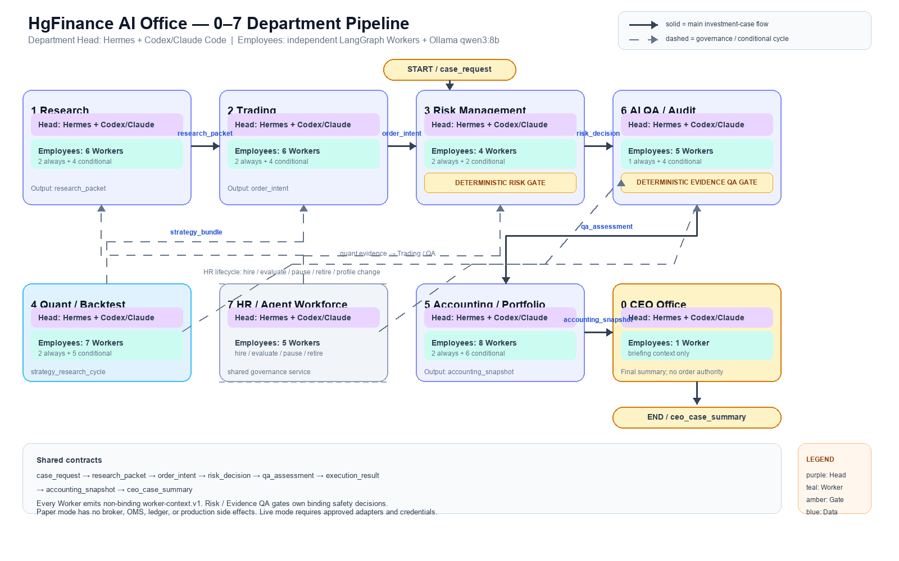

# 부서 실행 계층 v2: Hermes 부서장과 LangGraph 직원

> The Bull/Bear rows retained in the legacy graph table are historical role examples, not active workers. Current worker IDs and counts come from the department registries and [CURRENT_PROJECT_ARCHITECTURE.md](../CURRENT_PROJECT_ARCHITECTURE.md).

> **Current implementation pointer:** 현재 worker 이름·개수·실행 분류는
> [CURRENT_PROJECT_ARCHITECTURE.md](../CURRENT_PROJECT_ARCHITECTURE.md)와 각 부서
> `hermes/config.yaml`/`employee_workers.py`를 정본으로 사용한다. 이 문서는
> worker graph의 상세 설계를 보존한다.

상태: 확정 설계 · 8개 부서 Worker Registry 적용

이 문서는 전체 투자 파이프라인의 공통 실행 계층과 Worker 수·역할·모델 경계를 정의한다. 전체 직원 수의 Source of Truth는 각 부서 `config.yaml`의 `staff_registry`, `workers`, `runtime_personalities`와 해당 부서 `employee_workers.py`다.

- 부서장: Hermes Agent가 연결한 상위 LLM(Codex 또는 Claude Code)
- 직원: 역할별 독립 LangGraph Worker Graph + 임시 테스트용 로컬 Ollama `qwen3:1.7b` (전체 부서 현재 고정)
- 결정론적 엔진: Risk Gate, Evidence QA Gate, PIT·인용·권한·상태 전이의 유일한 바인딩 소유자



원본 편집 가능한 다이어그램은 [`whole_pipeline_0_7.svg`](assets/whole_pipeline_0_7.svg)이며, PNG는 [`render_whole_pipeline.py`](assets/render_whole_pipeline.py)로 재생성한다.

Worker별 경량·표준·중량 모델 선택 규칙은 [WORKER_MODEL_MATRIX.md](WORKER_MODEL_MATRIX.md)에 고정한다. 현재 임시 테스트 후보는 모든 Worker에서 `qwen3:1.7b`이며, 정식 모델 교체는 benchmark·HR 제안·QA 검증·CEO 승인 전에는 자동 변경하지 않는다.

## 전체 파이프라인

```text
case_request
  → Research Hermes / LangGraph employees
  → Trading Hermes / LangGraph employees
  → Risk Hermes / LangGraph employees → deterministic Risk Engine
  → QA Hermes / LangGraph employees → deterministic Evidence QA Engine
  → Accounting / Portfolio
  → CEO Hermes → ceo_case_summary
```

각 부서의 직원 결과는 `worker-context.v1` 형태의 비바인딩 context로 부서장에게 전달된다. 부서장은 결과를 종합하고 서술하지만, 주문·원장·한도·감사 종결을 직접 실행하지 않는다. 직원 모델을 바꿀 때는 `ollama list`로 설치 모델을 확인하고 benchmark와 HR·QA 승인을 거쳐 `OLLAMA_CHAT_MODEL` 및 Profile을 함께 변경한다. 자동 모델 교체는 허용하지 않는다.

## 호출 경계

| 계층 | 런타임 | 책임 | 금지 |
|---|---|---|---|
| Department Head | Hermes + Codex/Claude Code | 하위 context 종합, 누락·충돌·에스컬레이션 서술 | 주문 제출, Risk 판정 변경, 원장 수정 |
| Employee Worker | LangGraph + Ollama `qwen3:1.7b` | 허용된 도구 호출, 근거 요약, 역할별 context 생성 | 바인딩 승인, 임의 API/도구 호출 |
| Deterministic Gate | Python engine/service | Risk/QA 판정, PIT·스키마·권한·상태 검증 | LLM 자유 서술에 의한 판정 변경 |
| HR Registry | Workforce/HR | Worker 활성화·비활성화·교체·성과 검토 | 자기 후보 최종 승인, 권한 우회 |

직원 그래프의 기본 경로는 `tool → worker_llm → schema validation`이다. 최대 재시도는 2회(최대 3 attempts)이며, 실패·스키마 불일치·Ollama 장애는 `DEGRADED`와 HOLD/ESCALATE로 기록한다.

## Risk 직원 구성

부서장 `risk-supervisor`는 Hermes가 담당한다. 2026-08-06에 `core-risk-worker`(옛 `market-liquidity-worker`+`pre-trade-risk-worker` 병합)와 `derivatives-counterparty-worker`를 **tool로 강등**해 결정론 `risk-runner`로 합쳤다 — 둘 다 결정론 Risk Engine이 이미 답을 만들고 LLM은 서술만 하고 있었다. 남은 LLM Worker는 조건부 `compliance-policy-worker` 하나뿐이다.

| Worker | 상태 | 도구 | 입력·출력 경계 |
|---|---|---|---|
| `compliance-policy-worker` | conditional | `risk.compliance.check` | 정책 근거가 있을 때만 PIT context 생성 |
| `risk-runner` (결정론, LLM 없음) | 항상 실행 | `risk.trading_state.read`, `risk.p1.snapshot`, `risk.case.check`, `risk.trading_state.record.read` | 시장·유동성·노출·Counterparty RiskEngine 결과를 그대로 옮김. `WORKER_SPECS` 밖 — LLM Registry에 없다 |

`RiskEngine.check_order`가 `approve/resize/reject`의 유일한 바인딩 소유자다. Worker 또는 Hermes가 그 값을 덮어쓸 수 없다.

## QA 직원 구성

부서장 `qa-audit-supervisor`는 Hermes가 담당한다. 2026-08-06에 `evidence-qa-worker`·`model-and-internal-audit-worker`·`ops-and-permission-worker`를 **tool로 강등**해 결정론 `qa-runner`로 합쳤다 — 셋 다 결정론 Engine이 이미 PASS/WARN/FAIL을 정하고 있었고 LLM은 서술만 했다. 남은 LLM Worker는 조건부 `hallucination-critic-worker`, `incident-postmortem-worker` 둘뿐이다.

| Worker | 상태 | 도구 | 입력·출력 경계 |
|---|---|---|---|
| `hallucination-critic-worker` | conditional | `qa.evidence.rag` | UNSUPPORTED/CONTRADICTED claim만 검토 |
| `incident-postmortem-worker` | conditional | `qa.incident.record` | 실제 Incident가 있을 때 FACT/INFERENCE context 생성 |
| `qa-runner` (결정론, LLM 없음) | 항상 실행 | `qa.evidence.check`, `qa.model_risk.evaluate`, `qa.internal_audit.evaluate`, `qa.ops.evaluate`, `qa.tool_permission.check` | EvidenceQaEngine/ModelRiskEngine/InternalAuditEngine/OpsHealthMonitor/ToolPermissionCheck 결과를 그대로 옮김. `WORKER_SPECS` 밖 — LLM Registry에 없다 |

`EvidenceQaEngine.check_artifact`가 PASS/WARN/FAIL의 유일한 바인딩 소유자다. QA Worker 또는 Hermes는 Claim 결과, Finding 상태, Corrective Action 상태를 변경할 수 없다.

## 직원 생명주기와 HR 운영

## Worker count와 execution count

`workers`와 각 부서의 `WORKER_SPECS`가 실행 직원 수의 단일 기준이다. 기존 `agent.personalities` 역할명은 Hermes·DB·감사 호환용 Alias이며 런타임 Worker 수에 포함하지 않는다.

| 부서 | Registry 전체 | 기본 실행 | 조건부 실행 | 케이스 최대 |
|---|---:|---:|---:|---:|
| CEO | 1 | 1 | 0 | 1 |
| HR | 5 | 2 | 3 | 5 |
| Research | 6 | 2 | 4 | 6 |
| Trading | 3 (LLM 2 + 결정론 1) | 3 | 0 | 3 |
| Risk | 2 (LLM 1 + 결정론 1) | 1 | 1 | 2 |
| Quant / Backtest | 7 | 2 | 5 | 7 |
| Accounting / Portfolio | 2 (LLM 1 + 결정론 1) | 2 | 0 | 2 |
| QA | 3 (LLM 2 + 결정론 1) | 1 | 2 | 3 |

기본 실행 수는 모든 입력에서 호출되는 Worker 수이고, 조건부 실행 수는 해당 신호가 있을 때만 호출되는 Worker 수다. 이 구분 없이 Registry 전체 수를 “매 실행 호출 수”로 해석하지 않는다. Trading·Risk·QA는 2026-08-06, Accounting/Portfolio는 2026-08-07 tool 강등으로 결정론 Worker(`desk-runner`/`risk-runner`/`qa-runner`/`back-office-runner`)가 매 케이스 항상 실행되므로 기본 실행에 포함했다 — LLM은 호출하지 않는다.

### 도현님 담당 부서의 현재 실행 역할

| 부서 | Worker | 실행 계층 | 담당 업무 | 금지 권한 |
|---|---|---|---|---|
| Trading | `bull-thesis-worker` | LangGraph + Ollama | Research Packet 근거 기반 상승 논지·촉매·기대수익 가설 | 주문·수량 확정, Bear 결과 참조 |
| Trading | `bear-thesis-worker` | LangGraph + Ollama | Research Packet 근거 기반 반증·하락 위험·논리 취약점 | 주문·수량 확정, Bull 결과 참조 |
| Trading | `desk-runner` | 결정론 Python | Intent Builder, 계약 전이, 실행 가능성, TCA 비용, 파생 Certification | LLM 호출, Risk 승인 대체, Broker Submit |
| Accounting/Portfolio | `exception-investigation-worker` | LangGraph + Ollama | Reconciliation Break, 미설명 PnL, 마감 준비 예외 조사 | 수치 계산·수정, Break 종결, Official NAV 확정 |
| Accounting/Portfolio | `back-office-runner` | 결정론 Python | Position·Cash·PnL·Reporting·Valuation·Corporate Action·Fee/Tax 결과 조회·투영 | LLM 호출, 공식 수치 임의 작성·수정 |

Trading의 기존 제안·제약·집행·Venue Cost·Derivatives 역할과 Accounting의 기존 도메인별 역할은 현재 별도 LLM Worker가 아니라 결정론 Runner 또는 예외 조사 Worker가 흡수한다. 구 Worker ID는 `config.yaml`과 `employee_workers.py`의 감사용 Alias로만 유지한다.

Profile에 정의된 직원은 자동으로 실행되는 직원이 아니다. `workers.<id>.status`와 trigger를 기준으로 Registry가 호출 대상을 정한다.

- `active`: 기본 입력이 있으면 매 실행 호출
- `conditional`: 명시된 사건·근거·운영 신호가 있을 때만 호출
- `paused`: HR 검토 중 호출하지 않음
- `retired`: 신규 실행에서 제외하고 Replay 이력은 보존
- 새 역할이 필요하면 기존 계약과 Tool Allowlist를 먼저 정의한 뒤 Worker를 추가한다.
- 역할 중복, 낮은 근거 기여도, 높은 지연·비용, 반복적인 schema failure는 HR의 해고·교체 검토 신호다.

HR 변경은 `agent_profile`/`agent_profile_version`과 Worker 상태를 갱신하지만, Risk·QA의 권한 경계를 합치지 않는다. 부서장 Profile과 직원 Worker 모델은 별도 버전으로 기록한다.

## 운영·리플레이 계약

모든 Worker 실행은 부서 실행 매니페스트에 다음을 남긴다.

`worker_id`, `role`, `tools`, `executor`, `provider`, `model`, `output_contract`, `attempts`, `status`, `input_hash`, `error`, `evidence_refs`.

Paper/Replay에서는 Broker 주문, Ledger Posting, 운영 DB 쓰기를 수행하지 않는다. 전체 파이프라인은 한 단계라도 실패하면 자동 승인으로 진행하지 않고 HOLD/REJECT/ESCALATE/ROLLBACK 중 해당 안전 방향으로 종료한다.

구현 기준:

- Risk: `departments/03-risk/risk_employee_workers.py`
- QA: `departments/06-ai-qa-audit/qa_employee_workers.py`
- Profile: 각 부서 `hermes/config.yaml`의 `employee_runtime`와 `workers`
- 부서장 Profile: 각 부서 `hermes/config.yaml`의 `model` 및 `SOUL.md`
