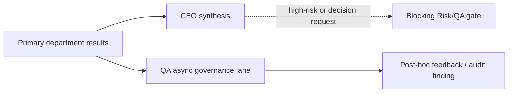
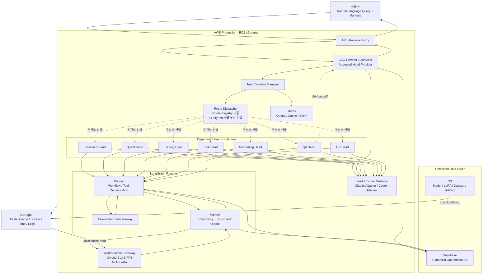
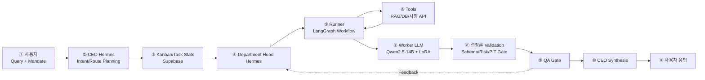

# HgFinance 최종 Runtime 아키텍처

상태: **상세 구현 기준선(DESIGN BASELINE)**
범위: Natural Language Query + Mandate를 받아 부서 Task를 동적으로 라우팅하고, Hermes·LangGraph Worker·결정론 Engine·QA를 거쳐 비구속적 결과를 반환하는 TEST/INTEGRATION/PRODUCTION_ADVISORY 경로

> **Current snapshot link:** 현재 worker registry·실제 구현 상태·serving 설정은
> [CURRENT_PROJECT_ARCHITECTURE.md](../CURRENT_PROJECT_ARCHITECTURE.md)를 우선한다.
> 이 문서는 상세 실행 계약과 historical/design baseline이다.

이 문서는 구현자가 별도 구두 설명 없이 기본 Pipeline을 구현할 수 있도록 작성한 실행 계약이다. Master Plan과 Domain API·DB Contract를 대체하지 않으며, 충돌 시 다음 우선순위를 따른다.

1. `docs/HEDGE_FUND_MASTER_PLAN.md`
2. 이 문서
3. `docs/02-engineering/contracts/*.json`
4. 부서별 `hermes/config.yaml`, `SOUL.md`, `employee_workers.py`
5. 구현 코드와 Prototype

## 1. 핵심 결정

- 개발자 4명(동규·재일·도현·영주)은 각각 두 부서의 Local Docker 개발 환경을 소유한다. 개발자 수는 Production Container 수나 사용자 Tenant 수가 아니다.
- 전체 Runtime은 `API → CEO Hermes → Task/Kanban → Department Head Hermes → Runner → Tool/Evidence → Worker LLM → Worker Model Gateway → Worker Result → deterministic validation → Department Synthesis → Risk/QA Gate → CEO Synthesis` 순서다. Runner는 Worker를 부르기 전에 Tool/Evidence부터 모은다 — Worker가 근거 없이 추론하지 않도록 하기 위해서다. 이 순서는 문서 전체(§4.1, §6.3)에서 동일하게 유지한다.
- CEO와 부서 Head Hermes는 Head Provider Gateway(Claude/Codex)를 통해 Planning, Delegation, Synthesis, Escalation을 담당한다. 주문 제출, Risk 승인, Ledger 수정, NAV 확정, Audit Finding 종결 권한은 없다. Head Provider Gateway와 Worker Model Gateway는 서로 다른 백엔드다(§7 참고).
- Worker는 LLM을 사용해 근거를 해석하고 구조화된 비구속 결과를 만든다. LLM의 존재는 추론 기능을 뜻하지만 권한이나 binding decision을 뜻하지 않는다.
- Runner는 상태 전이·Tool 호출·Retry·Timeout·Schema 검증을 담당한다. `risk-runner`, `qa-runner`, `desk-runner`, `back-office-runner`처럼 LLM이 없는 결정론 Runner도 존재한다.
- Risk·QA·PIT·권한·상태 전이·OMS·Ledger의 강제 판정은 결정론 코드가 소유한다.
- Supabase는 Canonical Operational DB다. Redis는 Queue/Cache/Event 전달 계층이며 원장이 아니다. EBS는 EC2 로컬 디스크이며 Canonical DB가 아니다. S3는 Model·LoRA·Dataset·Artifact·Backup 저장소다.
- TEST의 Worker는 Ollama `qwen3:1.7b`를 사용할 수 있다. Production Worker는 Worker Model Gateway의 `Qwen2.5-14B-Instruct FP8`와 버전이 고정된 Department LoRA를 사용한다. 두 모델은 같은 Contract를 사용하지만 별도 Golden/Adversarial Eval을 통과해야 한다.
- Claude/Codex Head는 Provider Adapter 뒤에 둔다. Claude 구독을 일반 API Credential처럼 자동화 Container에서 사용한다고 가정하지 않는다. Production Provider는 사용 계약·인증·비용·자동화 허용 범위가 확인된 Adapter만 사용한다.
- Self-Evolution은 자동 Candidate 생성까지 자동화할 수 있지만, Profile·Skill·Tool Allowlist의 Production 변경은 HR → QA → CEO 승인 → Shadow → Rollback/Promotion 절차를 통과해야 한다.

### QA execution topology clarification

QA has two different paths and must not be described as either always blocking or
always asynchronous:

1. In the general response workflow, the supervisor can synthesize terminal
   primary department results while QA runs independently in an asynchronous
   governance lane. `orchestration/adapters/ceo_supervisor.py` records
   `governance_plane=async_qa` and explicitly states that QA is not a synthesis
   prerequisite.
2. Inside the QA department, eligible conditional LangGraph workers are
   concurrently fanned out and gathered by
   `qa_employee_workers.py::run_employee_workers_async`; the deterministic
   `qa-runner` result is then combined with the worker reports.
3. The blocking `portfolio_recommendation` graph is different: its explicit
   barriers preserve `research → quant → trading → risk → qa → accounting → ceo`.
   For that graph, QA remains a gate after Risk precheck and is not converted to
   async merely because the general response lane is async.



## 2. 환경 분리

### 2.1 환경 목록

| 환경 | 목적 | Model | DB | 외부 효과 |
|---|---|---|---|---|
| `DEV` | 개발자별 부서 구현·단위 Contract | Mock 또는 Ollama `qwen3:1.7b` | 개발자별 Local Supabase/Postgres | 금지 |
| `INTEGRATION` | CEO부터 8개 Profile까지 전체 Handoff 연결 | Deterministic Stub 또는 TEST Ollama | 별도 Integration Supabase | 금지 |
| `PRODUCTION_ADVISORY` | AWS에서 실제 데이터 기반 추천·분석 | Qwen2.5-14B FP8 + LoRA, 승인된 Head Provider | 별도 Production Supabase | 주문·Ledger·Broker 쓰기 금지 |
| `PRODUCTION_LIVE` | 실제 Broker·운영 Posting | 별도 승인 필요 | 운영 DB | 현재 기본 OFF |

`PRODUCTION_ADVISORY`는 운영 인프라를 사용하는 Read-only/Paper 단계다. `PRODUCTION_LIVE`로 자동 승격하지 않는다.

모든 환경은 같은 `supabase/migrations/`를 적용한다. Root `db/001~004_*.sql` Prototype SQL과 `supabase/migrations/`를 같은 DB에 함께 적용하지 않는다.

### 2.2 개발자별 Local Docker

개발자는 담당 부서 두 개를 구현하고, 다른 부서는 Mock/Contract Stub으로 대체한다.

```text
동규 Local Stack: Risk + QA
재일 Local Stack: Research + Quant
도현 Local Stack: Trading + Accounting
영주 Local Stack: CEO + HR
```

이 배정은 `docs/05-teams/TEAM_*_GUIDE.md`·`CLAUDE.md` 담당자 표와 동일하다. 동규(Risk↔QA)·도현(Trading↔Accounting)처럼 서로 견제해야 하는 두 본부를 같은 담당자가 개발하더라도, 로컬 Stack이 분리돼 있을 뿐 Production 권한(Trading과 Risk, Accounting과 QA)을 합치는 조합으로 짝짓지 않는다.

각 Stack은 별도 Compose Project Name, Network, Volume, Redis, DB, Hermes Memory, Session을 사용한다.

```bash
docker compose -p hf-donggyu --profile risk --profile qa up -d
docker compose -p hf-jaeil --profile research --profile quant up -d
docker compose -p hf-dohyun --profile execution --profile accounting up -d
docker compose -p hf-youngju --profile governance up -d
```

개발자 Stack을 합치는 방식은 Container를 복사하는 것이 아니라, 각 부서 Image·Contract·Compose Fragment를 Root Integration Compose에 합치는 방식이다.

### 2.3 Integration 환경

Integration은 한 개의 별도 환경에서 전체 Pipeline을 실행한다.

```text
CEO Hermes
  → Research Head
  → Quant Head
  → Trading Head(주문 없는 Context)
  → Risk Head
  → Accounting Head(읽기 전용)
  → QA Head
  → HR Head(Workforce 요청일 때만)
  → CEO Synthesis
```

Integration Supabase는 개발자 Local DB와 Production Supabase와 분리한다. Integration에서 생성한 Case, Task, Artifact, Event는 Production으로 복사하지 않는다.

## 3. Production 인프라

### 3.1 AWS Pilot 사양

```text
EC2: g6.xlarge
vCPU: 4
Memory: 16 GiB
GPU: NVIDIA L4 Tensor Core, 24 GB VRAM
OS: Ubuntu 24.04 LTS
EBS: gp3 250 GB
Instance Store: 없음
```

이 구성은 단일 EC2 Pilot이다. EC2 장애 시 전체 서비스가 중단되므로 High Availability Production이 아니다. DB·Model·Artifact Backup과 복구 절차를 먼저 만든다.

### 3.2 Production Logical Services

```text
Internet
  ↓ 443
Reverse Proxy / API
  ↓
CEO Hermes Supervisor
  ↓
Task/Kanban Manager + Redis Queue
  ↓
Department Head Hermes
  ├─ Research Head
  ├─ Quant Head
  ├─ Trading Head
  ├─ Risk Head
  ├─ Accounting Head
  ├─ QA Head
  └─ HR Head
  ↓ (Head LLM 호출)          ↓ (Runner가 Worker 실행)
Head Provider Gateway      LangGraph Runner / Worker Runtime
  ├─ Claude Adapter           ↓
  └─ Codex Adapter          Worker Model Gateway
                              ├─ Qwen2.5-14B-Instruct FP8
                              └─ Department LoRA Adapter
```

CEO/Department Head Hermes와 LangGraph Worker는 서로 다른 모델 서버 뒤에 있다. Head는 Claude/Codex를 **Head Provider Gateway**로 호출하고, Worker는 자체 호스팅 Qwen을 **Worker Model Gateway**로 호출한다. 둘을 하나의 `model-gateway`로 부르지 않는다 — 이름을 합치면 부서장 모델과 직원 모델을 같은 백엔드로 오해하게 된다.

권장 Service/Container 경계는 다음과 같다.

| Service | 주요 책임 | 외부 공개 |
|---|---|---|
| `reverse-proxy` | TLS, Request 진입, Rate Limit | 443만 |
| `api` | Auth Context, Query 수신, 응답 | Reverse Proxy 뒤 |
| `ceo-hermes` | Mandate 해석, Route Plan, 종합 | 내부 |
| `hermes-*` | 부서별 Delegation, Memory, Tool Allowlist | 내부 |
| `head-provider-gateway` | CEO/Department Head의 Claude/Codex Provider Adapter 호출 | 내부 |
| `runner` | LangGraph 상태·Tool·Retry·검증 | 내부 |
| `worker-runtime` | Worker Graph 실행 | 내부 |
| `worker-model-gateway` | Worker의 Qwen2.5-14B FP8 호출과 Department LoRA Adapter 선택 | 내부 |
| `redis` | Queue, Event, Cache | 내부 |
| `migration-runner` | Migration/Seed One-shot | 상주 금지 |

8개 Hermes Profile은 논리적 Runtime 8개다. 비용 절감을 위해 같은 EC2에 배치할 수 있지만, Profile·Memory·Credential·Tool Allowlist는 각각 격리한다. Trading과 Risk의 권한을 같은 Process/Token으로 합치지 않는다.

### 3.3 Production Flowchart



점선(`-.->`)은 Route Registry가 Query Intent별로 선택한 조건부 경로다 — 한 Query가 들어올 때마다 7개 부서 Head가 전부 실행되지 않는다(예: "SK하이닉스 위험해?"는 Research/Risk/QA만 선택, §4.4 참고). Worker Model Gateway는 S3에서 직접 가중치를 읽지 않는다 — S3는 장기 저장소이고, EC2가 기동할 때 필요한 Model/LoRA를 EBS 로컬 캐시(`/opt/hgfinance/models/`, `/opt/hgfinance/adapters/`)로 먼저 내려받은 뒤, Worker Model Gateway는 그 로컬 캐시만 읽어 추론 지연을 줄인다.

CEO/Department Head는 Worker Model Gateway가 아니라 별도의 Head Provider Gateway(Claude/Codex Adapter)를 호출한다. 두 Gateway는 같은 EC2에 배치될 수 있어도 Process·Credential·Rate Limit을 공유하지 않는다 — Head가 쓰는 구독형 Provider Credential이 Worker Batch 추론 트래픽에 노출되면 안 되기 때문이다.

SSH는 관리자 운영 접속용이다. Agent 간 통신은 SSH로 하지 않고 Docker 내부 Network와 Service DNS를 사용한다. Redis·DB·Head Provider Gateway·Worker Model Gateway Port는 Internet에 공개하지 않는다.

### 3.4 데이터 저장 경계

| 데이터 | 저장 위치 | 이유 |
|---|---|---|
| User, Mandate, Case, Task, Kanban, Agent Run, Decision, Audit | Supabase | Canonical Operational DB |
| Market Time Series | TimescaleDB 계약 | 시계열 원장 분리 |
| Queue, Lease, Retry Signal, Cache | Redis | 전달 계층. 원장 아님 |
| Qwen Model, LoRA, Dataset, Evaluation, Artifact, Backup | S3 | 장기·대용량 저장 |
| Docker Layer, Model Cache, LoRA Cache, Temp, 단기 Log | EBS | EC2 로컬 작업 디스크 |

EBS에 Canonical DB를 두지 않는다. EC2 교체·장애에도 Supabase 상태와 S3 Artifact가 보존되어야 한다.

권장 EBS 경로:

```text
/opt/hgfinance/models/       # S3에서 받은 실행 Cache
/opt/hgfinance/adapters/     # S3에서 받은 LoRA Cache
/opt/hgfinance/cache/        # 임시 Cache
/opt/hgfinance/logs/         # 단기 Log
/var/lib/docker/             # Docker Runtime
```

## 4. Query-to-Response Pipeline

### 4.1 공통 흐름

```text
User Query + Mandate
  → API Auth/Normalize
  → CEO Hermes Intent/Route Planning
  → Case 생성
  → Task 생성
  → Kanban Read Model 반영
  → Department Head 호출
  → Runner 실행
  → Tool/Evidence 수집
  → Worker LLM 추론(Model Gateway 호출) 또는 Deterministic Runner 실행
  → Worker Result 검증
  → Department Synthesis
  → Risk/QA Gate
  → CEO Synthesis
  → API Response
```

CEO는 종목 분석·백테스트·VaR 계산을 직접 하지 않는다. CEO는 필요한 부서와 선후관계를 결정하고, 부서 결과를 최종 설명으로 통합한다.



Worker(⑦)는 Tool 결과(⑥)를 근거로 구조화된 비구속 결과만 만들고, 승인·거부·주문·원장 판정은 전부 결정론 Validation(⑧)이 소유한다. QA(⑨)의 Feedback은 CEO Synthesis를 거치지 않고 곧바로 담당 Head(④)로 돌아가 재작업을 요청할 수 있다 — CEO가 QA 지적을 대신 걸러내지 않는다.

### 4.2 Route 예시

| Query Intent | 기본 부서 | 조건부 부서 | 주문 |
|---|---|---|---|
| `STOCK_RECOMMENDATION` | Research, Risk, QA, CEO | Quant, Accounting/Portfolio | 없음 |
| `PORTFOLIO_RECOMMENDATION` | Accounting/Portfolio, Research, Quant, Risk, QA, CEO | Trading은 실행 요청 때만 | 없음 |
| `RISK_REVIEW` | Research, Risk, QA, CEO | Accounting/Portfolio | 없음 |
| `REBALANCING_PROPOSAL` | Accounting/Portfolio, Research, Quant, Risk, QA, CEO | Trading은 OrderIntent 생성 후 | 없음 |
| `ORDER_REQUEST` | Trading, Risk, QA, Accounting, CEO | Research/Quant | 별도 Gate 필요 |
| `WORKFORCE_REQUEST` | HR, QA, CEO | 해당 부서 | 없음 |

LLM Head가 제안한 Route는 결정론 Allowlist와 Mandate Policy로 검증한다. LLM Planner가 실패하거나 허용되지 않은 부서를 제안하면 안전한 Fallback Route 또는 `ESCALATE`를 반환하며 자동 승인하지 않는다.

### 4.3 예시: “삼성전자, SK하이닉스 중 지금 어떤 걸 사는 게 나아?”

이 제품의 Universe는 KRX 국내 시장으로 고정한다([USER_INPUT_SPEC.md:91](../01-product/USER_INPUT_SPEC.md)의 `allowed_markets: ["KRX"]`). 종목 예시는 해외 대형주가 아니라 삼성전자(005930)·SK하이닉스(000660)처럼 국내 종목을 쓴다.

```text
Mandate: risk=medium, single_stock <= 10%, sector(반도체) <= 30%
Query: "삼성전자, SK하이닉스 중 지금 어떤 걸 사는 게 나아?"
```

| STEP | 담당 | 내용 | Decision |
|---|---|---|---|
| 1 | CEO | Intent=`STOCK_RECOMMENDATION` 분류, `case_id` 발급, Research/Quant/Risk/QA Task 생성 | — |
| 2 | Research | 005930·000660 실적·뉴스·밸류에이션 Evidence 수집 | `RECOMMEND`(둘 다 근거 확보) |
| 3 | Quant | 두 종목의 수익률·변동성·Drawdown을 Factor/Strategy 관점에서 비교 | `RECOMMEND` |
| 4 | Risk | 현재 포트폴리오 반도체 섹터 비중 28%. SK하이닉스를 제안 규모대로 편입하면 36%로 Mandate 섹터 한도(30%) 초과. 단일 종목 10% 한도는 준수 | `RESIZE`(SK하이닉스 편입 규모 축소 권고) |
| 5 | QA | Evidence 인용, Quant 수치 재현성, Risk 계산 근거 재검증 | `PASS` |
| 6 | CEO | 삼성전자는 원안, SK하이닉스는 Risk의 `RESIZE`를 보존한 축소 비중으로 종합. Trading/OMS 미호출 | — |

STEP 4(Risk) Task의 `agent-task-result.v1` 예시:

```json
{
  "schema_version": "agent-task-result.v1",
  "case_id": "case-2026-0142",
  "task_id": "task-2026-0142-risk",
  "department": "risk-management",
  "worker": "risk-compliance-worker",
  "decision": "RESIZE",
  "confidence": 0.88,
  "escalate": false,
  "evidence_refs": [
    {"type": "portfolio-snapshot", "id": "artifact-pf-0142", "content_hash": "sha256:cccc..."},
    {"type": "risk-calc", "id": "artifact-risk-0142", "content_hash": "sha256:dddd..."}
  ],
  "model_version": "qwen2.5-14b-instruct-fp8",
  "adapter_version": "risk-lora:v1",
  "trace_id": "trace-2026-0142"
}
```

이 Task 뒤에는 §5.1.1 매핑에 따라 `worker-context.v1` 레코드가 1개(Risk Worker 호출) 붙는다 — `context_id`는 이 Task 실행마다 새로 발급되고, `producer_worker`=`risk-department-head`, `consumer_worker`=`risk-compliance-worker`, `status`=`COMPLETED`다.

Risk가 `RESIZE` 또는 `HOLD`를 반환하면 CEO는 이를 보존한다. CEO가 Risk 결과를 무시하고 `BUY`로 바꾸지 않는다.

### 4.4 예시: “SK하이닉스 위험해?” (조회형, Trading 미호출)

```text
CEO
  → Research
  → Risk
  → QA
  → CEO
```

Quant·Trading·OMS·Broker는 호출하지 않는다. 이 Query는 `RISK_REVIEW` Intent로, 매수·매도 의사가 없는 순수 조회이기 때문이다.

### 4.5 예시: “삼성전자 100주 매수해” (실주문 트리거, Trading 호출)

```text
CEO
  → Trading: OrderIntent 초안 생성(수량·종목만, 아직 Order 아님)
  → Risk: OrderIntent를 결정론 Risk Engine에 통과 → APPROVE/RESIZE/REJECT
  → Trading: Risk APPROVE/RESIZE 결과대로만 desk-runner가 Order 생성 → oms.submit
  → Accounting: Fill 반영(읽기 전용 조회가 아니라 실제 Ledger Posting 대상)
  → QA: 사후 Evidence·한도 준수 재검증
  → CEO: 체결 결과 종합
```

`trader-pm-agent`는 Risk Gate를 통과하기 전 Order를 만들지 않고, Risk가 `REJECT`하면 Trading은 `NOT_EXECUTED`로 끝난다. CEO는 이 어느 단계에서도 승인·거부를 대신하지 않는다 — 이 예시만 §4.2 Route 표의 `ORDER_REQUEST` 행에 해당하고, 4.3·4.4는 주문을 만들지 않는다.

## 5. 공통 Task/Worker Envelope

다음 12개 필드는 CEO Hermes·Department Head Hermes·Kanban(Case/Task 레이어)에서 공통으로 전달하는 최소 필드다. Head가 개별 Worker를 호출하는 Head/Worker 경계는 별도 계약인 `worker-context.v1`을 그대로 쓰며, 두 계약의 관계는 §5.1.1을 따른다.

```text
case_id
task_id
department
worker
input_refs
evidence_refs
decision
confidence
escalate
model_version
adapter_version
trace_id
```

구현에서는 재현성과 상태 전이를 위해 다음 시스템 필드도 추가한다.

```text
schema_version
status
attempt
created_at
updated_at
input_hash
output_hash
replay_manifest_ref
```

### 5.1 Envelope 예시

```json
{
  "schema_version": "agent-task-context.v1",
  "case_id": "case-2026-0081",
  "task_id": "task-2026-0081-research",
  "department": "research-department",
  "worker": "research-data-worker",
  "input_refs": [
    {
      "type": "mandate",
      "id": "artifact-mandate-v3",
      "content_hash": "sha256:aaaaaaaaaaaaaaaaaaaaaaaaaaaaaaaaaaaaaaaaaaaaaaaaaaaaaaaaaaaaaaaa"
    }
  ],
  "evidence_refs": [],
  "decision": "PENDING",
  "confidence": 0.0,
  "escalate": false,
  "model_version": "ollama:qwen3:1.7b",
  "adapter_version": "none",
  "trace_id": "trace-2026-0081",
  "status": "QUEUED",
  "attempt": 1,
  "created_at": "2026-08-08T00:00:00Z"
}
```

Result 예시:

```json
{
  "schema_version": "agent-task-result.v1",
  "case_id": "case-2026-0081",
  "task_id": "task-2026-0081-research",
  "department": "research-department",
  "worker": "research-data-worker",
  "input_refs": [
    {
      "type": "mandate",
      "id": "artifact-mandate-v3",
      "content_hash": "sha256:aaaaaaaaaaaaaaaaaaaaaaaaaaaaaaaaaaaaaaaaaaaaaaaaaaaaaaaaaaaaaaaa"
    }
  ],
  "evidence_refs": [
    {
      "type": "research-evidence",
      "id": "artifact-evidence-001",
      "content_hash": "sha256:bbbbbbbbbbbbbbbbbbbbbbbbbbbbbbbbbbbbbbbbbbbbbbbbbbbbbbbbbbbbbbbb"
    }
  ],
  "decision": "RECOMMEND",
  "confidence": 0.82,
  "escalate": false,
  "model_version": "qwen2.5-14b-instruct-fp8",
  "adapter_version": "research-lora:v1",
  "trace_id": "trace-2026-0081",
  "status": "COMPLETED",
  "attempt": 1,
  "created_at": "2026-08-08T00:01:00Z"
}
```

`input_refs`와 `evidence_refs`는 원문 Prompt나 Secret을 담지 않는다. Artifact ID, Content Hash, `as_of`, ACL, Provenance를 참조한다.

### 5.1.1 `agent-task-context.v1`과 `worker-context.v1`의 관계

`worker-context.v1`([contracts/worker-context.v1.json](contracts/worker-context.v1.json))은 이미 구현된 계약이며 이 문서가 대체하지 않는다. 두 계약은 서로 다른 경계를 담당하는 별도 레이어다.

| 레이어 | 계약 | 경계 | Source of Truth |
|---|---|---|---|
| Case/Task | `agent-task-context.v1`/`agent-task-result.v1` | CEO Hermes ↔ Department Head Hermes ↔ Kanban | Supabase `Task`/`Task Event` |
| Head/Worker | `worker-context.v1` | Department Head Hermes ↔ LangGraph Runner/Worker(1개 Task당 N개 Worker 호출 가능) | Supabase `Agent Run` |

Runner가 Worker를 호출할 때 Task에서 `worker-context.v1` 레코드를 다음과 같이 파생한다. 필드명이 다른 것은 오타가 아니라 두 계약의 목적이 다르기 때문이다 — Task는 "이 업무가 어떤 Domain Decision에 도달했는가"를 기록하고, Worker Context는 "이 LLM 호출이 어떤 상태로 끝났는가"만 기록한다.

| `agent-task-context.v1`/`result.v1` | `worker-context.v1` | 매핑 규칙 |
|---|---|---|
| `trace_id` | `trace_id` | 동일 값 그대로 전달 |
| `case_id` + `task_id` | (신규 `context_id` 발급) | Task 1개가 Worker 호출 여러 번(N개 `context_id`)을 가질 수 있음 |
| `department` | `department` | 동일 enum, 그대로 전달 |
| `worker`(Task 담당 Worker) | `consumer_worker` | |
| — (Task에는 없음) | `producer_worker` | 호출한 Head/Runner의 Registry ID |
| `decision`(Domain Decision 어휘) | `status`+`advisory`(`COMPLETED/DEGRADED/ESCALATE/REJECTED/HOLD`) | Runner가 `worker-context.v1` 결과를 결정론 Gate에 통과시킨 뒤 Task의 `decision` 어휘로 승격. 승격 규칙은 §5.3을 따르며 자동 격상 금지 |
| `confidence`, `escalate`(bool) | — (`worker-context.v1`엔 없음) | Task 레벨에서 여러 Worker Context 결과를 취합해 계산 |
| `model_version`, `adapter_version` | — (`worker-context.v1`엔 없음, `profile_version`만 존재) | Model Gateway 응답에서 채워 Task에 기록 |
| `evidence_refs` | `output_refs` 중 Evidence 유형 | `evidence_refs`는 `output_refs`의 명시적 별칭이지 별도 저장소가 아님 |

즉 `worker-context.v1`은 수정하지 않고, Runner/Head 구현체가 이 표의 매핑으로 두 계약 사이를 변환한다. Phase 0 Pydantic Contract 작업은 `agent-task-context.v1`을 신규로 정의하는 작업이며, `worker-context.v1`은 기존 그대로 재사용한다.

`task_id` 하나가 `context_id` 여러 개를 가질 수 있다는 것은, Department Head가 Task 하나를 처리하려고 Worker 여러 명을 순차·병렬로 호출하고 그 결과를 Fan-in해서 Task 결과 하나로 합친다는 뜻이다.

```text
task-2026-0142-research (agent-task-context.v1)
  ├─ context_id #1 → news-worker        (뉴스·이벤트 Evidence)
  ├─ context_id #2 → financial-worker   (실적·재무제표 Evidence)
  └─ context_id #3 → filing-worker      (공시·정정 Evidence)
       ↓ Research Head가 3개 worker-context.v1 결과를 Fan-in
  task-2026-0142-research 결과 (agent-task-result.v1, decision=RECOMMEND)
```

Research Head는 `worker-context.v1` 3건 중 하나라도 `status=ESCALATE`나 `REJECTED`면 Task 전체를 `RECOMMEND`로 승격하지 않는다 — Fan-in 승격 규칙도 §5.3의 Fallback 금지 원칙을 따른다.

### 5.2 필드 규칙

| 필드 | 규칙 |
|---|---|
| `case_id` | 한 사용자 요청의 전체 업무 묶음. 모든 하위 Task가 공유 |
| `task_id` | Case 안에서 유일한 업무 ID |
| `department` | Hermes Profile의 Canonical Department ID |
| `worker` | Worker 또는 deterministic Runner의 Registry ID |
| `input_refs` | 입력 Artifact와 Mandate/Portfolio/Packet 참조 |
| `evidence_refs` | 결과를 뒷받침하는 Evidence 참조 |
| `decision` | Domain Decision. 실패를 성공으로 변환하지 않음 |
| `confidence` | `0.0`~`1.0`. 근거 부족 시 낮추고 `escalate=true` 가능 |
| `escalate` | 사람·상위 Head·QA 검토가 필요한지 여부 |
| `model_version` | LLM 또는 `deterministic:<version>` |
| `adapter_version` | LoRA ID/Version 또는 `none` |
| `trace_id` | 한 Query 실행 전체를 관통하는 Trace ID |

### 5.3 Status와 Decision

Task Status:

```text
CREATED → QUEUED → RUNNING
                     ├→ COMPLETED
                     ├→ DEGRADED
                     ├→ HOLD
                     ├→ ESCALATED
                     ├→ REJECTED
                     └→ CANCELLED
```

기본 Decision 어휘:

```text
PENDING, RECOMMEND, NO_MATCH, APPROVE, RESIZE, REJECT,
HOLD, PASS, WARN, FAIL, ESCALATE, NO_ACTION, NOT_EXECUTED
```

`FAIL`, `WARN`, `DEGRADED`, `ESCALATE`를 `COMPLETED/PASS`로 바꾸는 Fallback은 허용하지 않는다.

### 5.4 부서 Profile 간 조건부 Handoff

부서 간 연결은 Worker Context를 재사용해 직접 전달하지 않고, `department-handoff.v1`을 먼저 만든다. 이 Packet은 Department Head/Profile 사이의 업무 연결을 나타내며, 실제 금융 상태를 변경하거나 Risk 승인·주문 제출·Ledger Posting 권한을 전달하지 않는다.

```text
Research Head
  └─ department-handoff.v1
     from_profile_version = research-profile-v2
     to_profile_version   = risk-profile-v1
     department_input_contract = risk.department-input.v1
     input_refs = Research Packet / Evidence Artifact
          ↓
Risk Head → Risk Runner/Worker
          └─ worker-context.v1.department_handoff_id
```

`department-handoff.v1`은 상황에 따라 생성한다. 모든 요청이 모든 부서를 통과하지 않으며, CEO Router가 Route와 의존성에 따라 필요한 Handoff만 만든다.

| Target Profile | 입력 계약 | 대표 upstream | 핵심 입력 Artifact |
|---|---|---|---|
| `research-department` | `research.department-input.v1` | CEO, Quant | Mandate, Market Query, Data Scope |
| `quant-backtest-department` | `quant.department-input.v1` | Research, CEO | Research Packet, Feature Snapshot, Strategy Hypothesis |
| `trading-department` | `trading.department-input.v1` | CEO, Risk | Approved OrderIntent 또는 Paper Execution Request |
| `risk-management` | `risk.department-input.v1` | Research, Quant, Trading, CEO | Mandate, Portfolio Snapshot, Evidence, OrderIntent |
| `accounting-portfolio-department` | `accounting.department-input.v1` | Trading, CEO | Fill, Ledger Event, Portfolio Snapshot Request |
| `qa-department` | `qa.department-input.v1` | Research, Quant, Risk, Trading, Accounting | Evidence, Decision, Calculation/Replay Artifact |
| `hr-department` | `hr.department-input.v1` | CEO, QA | Profile Candidate, Evaluation, Approval Evidence |
| `ceo-agent` | `ceo.department-input.v1` | 각 Department Head, QA | Department Result, Evidence, Gate Result |

Handoff의 `input_refs`에는 원문 Prompt나 Secret을 넣지 않는다. Artifact ID·Content Hash·`as_of`·Provenance·ACL을 참조한다. downstream Task는 `source_task_id`를 `target_task_id`의 부모 의존성으로 기록하고, 모든 Handoff·Task·Worker Context는 같은 `case_id`와 `trace_id`를 공유한다.

부서 내부 Head → Worker 호출에는 Handoff가 필수가 아니다. 이 경우 `agent-task-context.v1`에서 `worker-context.v1`을 파생하고, 다른 부서에서 넘어온 경우에만 `department_handoff_id`를 기록한다.

## 6. Hermes·Runner·Worker 책임

### 6.1 CEO Hermes

허용:

- Query Intent 분류
- Mandate/프로필 확인
- Route Plan 생성
- Case/Task 생성 요청
- 부서 결과 종합
- 충돌·누락 설명
- 사용자 Escalation

금지:

- `oms.submit`
- Risk 승인 판정 대체
- Ledger 직접 수정
- NAV 확정
- Audit Finding 종결
- Agent 권한 직접 부여
- 자기 Profile/Skill 즉시 Production 반영

### 6.2 Department Head Hermes

허용:

- 부서 Task 분해
- Trigger에 따른 Worker 선택
- 부서 Memory Namespace 조회
- Worker 결과 Fan-in
- 부서 결과 Synthesis
- 상위 CEO·다른 부서 Head로 Handoff

금지:

- 다른 부서 Tool Allowlist 사용
- Worker 결과를 결정론 Gate 없이 Binding Decision으로 승격
- 직접 Broker·Ledger·IAM 권한 사용

### 6.3 Runner

Runner는 LangGraph 상태 전이와 Tool 실행을 담당한다.

```text
START
  → Input Schema 검증
  → 필요한 Tool 계획
  → Tool Allowlist 검사
  → Tool 실행
  → Evidence 정규화
  → Worker Invoke
  → Output Schema 검증
  → Retry/Timeout/Replay 기록
  → END 또는 ESCALATE
```

Runner가 Tool을 무제한으로 실행하지 않도록 `department`, `worker`, `tool`, `scope`, `case_id`를 함께 검증한다. Tool 호출 실패·Timeout·Schema 실패는 안전한 상태로 끝난다.

### 6.4 Worker

Worker는 다음 입력을 받아 LLM 추론과 구조화 출력을 수행한다.

```text
Task
+ Mandate
+ Role
+ Allow-listed Evidence/Tool 결과
+ 현재 상태
        ↓
Qwen 또는 TEST LLM
        ↓
Structured Result + Evidence Refs + Confidence
```

Worker LLM은 관련성 판단, 근거 해석, 가설·요약·설명 작성, 다음 허용 행동 제안만 수행한다. Risk Limit, PIT, Citation/Provenance, Schema, 권한·SoD, 상태 전이, Order·Ledger·NAV 강제 판정은 결정론 코드가 수행한다.

## 7. Model Layer: Head Provider Gateway와 Worker Model Gateway

Model Layer는 서로 다른 두 Gateway로 나뉜다. 이름과 책임을 합치지 않는다 — Head가 쓰는 모델과 Worker가 쓰는 모델은 Provider·Credential·비용·Rate Limit이 전부 다르다.

```text
Model Layer
├── Head Provider Gateway   (CEO Hermes / Department Head Hermes 전용)
│     ├─ Claude Adapter
│     ├─ Codex Adapter
│     └─ 승인된 Provider만 (§1 참고 — 구독 Credential 자동화 사용 금지)
│
└── Worker Model Gateway    (LangGraph Worker 전용)
      └─ Qwen2.5-14B-Instruct FP8
            ├─ research-lora
            ├─ quant-lora
            ├─ risk-lora
            ├─ qa-lora
            └─ ... (부서별 버전 고정 LoRA)
```

### 7.1 Head Provider Gateway

CEO Hermes와 Department Head Hermes는 Claude/Codex를 Provider Adapter 뒤에서 호출한다(§1). Head Provider Gateway는 어떤 Provider·모델 버전이 승인됐는지, 자동화 Container에서 사용 가능한 인증 방식인지를 검증하고 중계한다. Worker Model Gateway와 Process·Credential을 공유하지 않는다.

### 7.2 Worker Model Gateway와 Multi-LoRA

Worker마다 모델을 하나씩 실행하지 않는다.

```text
research-worker ─┐
risk-worker ─────┼→ worker-model-gateway
qa-worker ───────┘       ↓
                 Qwen2.5-14B-Instruct FP8
                 + adapter_id/version
```

모델 요청에는 다음 정보를 포함한다.

```json
{
  "worker_id": "risk-compliance-worker",
  "department_id": "risk-management",
  "base_model_digest": "sha256:...",
  "adapter_id": "risk-lora",
  "adapter_version": "v1",
  "trace_id": "trace-..."
}
```

사용자가 `adapter_id`를 직접 선택하지 않는다. Registry와 Tool Policy가 부서·Worker에 허용된 Adapter인지 검증한다.

LoRA에는 부서 도메인 표현 방식, 출력 형식, 반복 Reasoning Pattern, Worker Role별 응답 스타일만 넣는다. 최신 시장 데이터, Portfolio·Cash·Position, Mandate 원장, Production Credential, 변경되는 정책 원문, 개인정보는 넣지 않는다. 최신 사실·정책·Portfolio는 DB/RAG에서 `input_refs`와 `evidence_refs`로 공급한다.

`qwen3:1.7b` TEST에서 `qwen2.5-14b-instruct-fp8` Production으로 바꾸는 것은 Model Migration이다. Base Model Digest, Adapter Version, Prompt/Skill Version, Golden/Adversarial 결과, Tool Call 성공률, Schema 실패율, Timeout/VRAM/Latency, Regression 결과를 기록한다.

## 8. Supabase·Redis·S3·EBS 계약

### 8.1 Supabase

Supabase가 Canonical Operational DB다. 최소 저장 대상은 Mandate, Case, Task, Task Event, Agent Run/Tool Call, Evidence Metadata, QA/Risk Result, Profile/Skill Version, Audit Event다.

각 Service가 같은 Service Role Key를 공유하지 않는다. Frontend와 Hermes에는 Supabase Service Role을 주지 않는다. 상태 변경은 소유 Domain API 또는 승인된 Repository를 통한다.

### 8.2 Redis

Redis는 Task Queue, Worker Lease, Event Delivery, Short-lived Cache, Backpressure/Retry Signal에 사용한다. Redis 데이터는 장애 시 재구축 가능해야 한다. Task 상태의 원장은 Supabase이며, Redis 재전달은 `task_id`, `attempt`, `idempotency_key`로 중복 처리한다.

### 8.3 S3

```text
s3://<bucket>/models/<base-model-digest>/
s3://<bucket>/adapters/<department>/<adapter-version>/
s3://<bucket>/datasets/<dataset-manifest>/
s3://<bucket>/evaluations/<model-or-adapter-version>/
s3://<bucket>/artifacts/<case-id>/<task-id>/
s3://<bucket>/backups/
```

S3 Object Versioning과 접근 로그를 활성화한다. Model/Adapter가 바뀌면 `model_version`/`adapter_version`과 Object Version을 함께 기록한다.

### 8.4 EBS

EBS는 EC2 교체를 전제로 한 Cache/Runtime Disk다. EBS만 믿고 운영 상태를 저장하지 않는다.

```text
/opt/hgfinance/models/
/opt/hgfinance/adapters/
/opt/hgfinance/cache/
/opt/hgfinance/logs/
```

## 9. Kanban과 Task 상태

Kanban은 Supabase의 Task/Task Event를 읽어 만든 Read Model이다. Frontend가 Kanban DB를 직접 수정하지 않는다.

```text
CEO Task Plan
  → task 생성
  → QUEUED
  → RUNNING
  → Worker Event
  → COMPLETED/DEGRADED/HOLD/ESCALATED
```

Task 최소 필드:

```text
task_id
case_id
parent_task_id
department
assigned_head
assigned_worker
status
priority
input_refs
output_refs
trace_id
created_at
started_at
finished_at
```

Kanban 표시 상태는 업무 상태를 보여주지만 Risk Decision, Fill, Journal, NAV의 원장이 아니다.

## 10. Self-Evolution과 Skill-Creator

허용 흐름:

```text
Agent Run / QA / Incident / SLA / Cost Signal
  → HR Improvement Candidate
  → Profile/Skill Revision Draft
  → QA Golden/Adversarial/Permission Review
  → CEO Approval
  → Shadow
  → Promotion 또는 Rollback
```

`Skill-Creator`는 Skill Package Draft를 만들 수 있지만 Production Profile 덮어쓰기, Tool Allowlist 확장, Secret 접근 권한 추가, Broker/Ledger/Risk 권한 추가, 자기 Candidate 승인, QA 검증 생략을 직접 수행하지 않는다.

실패 동작:

- Skill Draft 실패: `NO_CHANGE`
- QA Revision Reject: 이전 Champion 유지
- CEO Approval 없음: `NO_APPROVAL`
- Shadow Regression: `ROLLBACK`
- Registry/Version 불일치: `DEGRADED` 또는 실행 차단

## 11. 보안·권한 경계

- 외부는 API/Reverse Proxy만 접근한다.
- SSH는 관리자 운영 접속만 허용한다.
- Redis, DB, Head Provider Gateway, Worker Model Gateway는 내부 Network에 둔다.
- Head에는 Provider Key를 직접 주지 않고 Head Provider Gateway Token만 준다.
- Worker에는 부서별 Read/Calculation Tool만 준다.
- Trading·Risk·Accounting·QA Credential을 공유하지 않는다.
- Broker Credential은 초기 TEST/PRODUCTION_ADVISORY에 존재하지 않는다.
- 모든 요청은 `fund_id`, `mandate_version`, `case_id`, `trace_id`를 가진다.
- Prompt·Secret·원문 개인정보를 Trace와 Handoff에 그대로 저장하지 않는다.
- Log·Error·Health Response에서 Secret을 Redact한다.

## 12. 구현 순서

### Phase 0: Contract

1. `agent-task-context.v1`/`agent-task-result.v1` Pydantic Contract 작성
2. 12개 기본 필드와 시스템 필드 검증
3. `input_refs`/`evidence_refs` Artifact Contract 고정
4. Schema Contract Test 작성

### Phase 1: Deterministic Routing

1. Intent와 Mandate 입력 생성
2. Allow-listed Route Registry 작성
3. CEO LLM Planner는 Route 제안만 수행
4. 결정론 Validator가 부서·Dependency·금지 권한 검증
5. Planner 실패 시 안전한 Fallback/`ESCALATE`

### Phase 2: Case/Task/Kanban

1. Case 생성
2. Task와 Parent/Child Dependency 생성
3. Supabase Task Event 저장
4. Redis에 Idempotent Event 발행
5. Read-only Kanban Projection 구현

### Phase 3: Head/Runner/Worker

1. Department Head Registry 로드
2. Runner StateGraph 구현
3. Tool Allowlist와 Tool Gateway 연결
4. Worker LLM 호출
5. Result Schema 검증
6. Timeout/Retry/Replay 기록

### Phase 4: Data/Model

1. Local Supabase/Integration Supabase/Production Supabase 분리
2. Supabase RLS와 Service Role 분리
3. Redis Queue와 Recovery 검증
4. Local Ollama `qwen3:1.7b` 연결
5. Worker Model Gateway Adapter Contract 연결
6. Production Qwen2.5-14B FP8 단일 요청 Benchmark
7. LoRA Registry·Version·Rollback 연결

### Phase 5: Self-Evolution

1. Run/QA/Incident Scorecard 수집
2. Improvement Candidate 생성
3. Skill/Profile Draft 저장
4. QA/CEO Approval Gate
5. Shadow/Canary/Rollback

### Phase 6: Production Advisory

1. AWS EC2·EBS·Docker·GPU Runtime
2. Reverse Proxy/TLS/Secret 주입
3. API·CEO·Heads·Runner·Worker 배포
4. Supabase/S3/Redis 연결
5. Read-only Query Acceptance
6. 운영 Log/Metric/Backup/Recovery Drill

`PRODUCTION_LIVE`의 Broker·Order·Ledger Posting은 별도 승인과 Acceptance가 끝나기 전까지 구현·활성화하지 않는다.

## 13. Acceptance Scenarios

### 13.1 주식 추천

입력:

```text
Query: "삼성전자와 SK하이닉스 중 어떤 종목이 적합한가?"
Mandate: single_stock <= 10%, sector(반도체) <= 30%, risk=medium
```

통과 조건:

- CEO가 `STOCK_RECOMMENDATION`으로 분류
- Research·Risk·QA Task 생성
- Quant는 Route Policy에 따라 조건부 또는 실행
- 모든 Task가 같은 `case_id`, `trace_id` 사용
- Evidence가 없는 결론은 `HOLD` 또는 `ESCALATE`
- Risk가 `RESIZE/HOLD`하면 CEO가 이를 보존
- Trading/OMS 호출 없음

### 13.2 포트폴리오 추천

- Accounting/Portfolio가 현재 Snapshot을 읽기 전용으로 조회
- Research가 후보와 Evidence 생성
- Quant가 필요한 경우 배분·변동성·Drawdown 검증
- Risk가 Mandate·Concentration 검증
- QA가 Evidence·수치·재현성 검증
- CEO가 추천과 제외 이유를 종합
- Ledger/NAV/Order 변경 0건

### 13.3 Worker 실패

- Model Timeout: Worker `DEGRADED`
- Tool Scope 거부: `REJECTED` 또는 `ESCALATE`
- Schema 실패: 성공 처리 금지
- Evidence 부족: QA `WARN/FAIL`, CEO `HOLD/ESCALATE`
- Redis 중복 Event: `idempotency_key`로 한 번만 상태 반영
- Trace/Replay Manifest 누락: Production 성공으로 승격 금지

### 13.4 환경 격리

- DEV Credential로 Production DB 접근 불가
- Integration Case가 Production Case에 나타나지 않음
- EBS 삭제 후 Supabase 상태와 S3 Artifact로 복구 가능
- Production Advisory에서 Broker/Ledger 쓰기 0건
- Model/Adapter Version이 모든 Worker Result에 기록됨

## 14. Repository Mapping

| 아키텍처 영역 | 기준 위치 |
|---|---|
| Department Head Profile | `departments/<n>/hermes/config.yaml`, `SOUL.md` |
| Worker Registry | 각 부서 `employee_workers.py` |
| Worker 기본 Contract | `docs/02-engineering/contracts/worker-context.v1.json` |
| Cross-department Handoff | `orchestration/contracts/mas.py` |
| Workflow Registry | `multi-agent-workflow.yaml`, `orchestration/workflows/` |
| Route Registry | `docs/02-engineering/contracts/route-registry.v1.json`, `orchestration/workflows/routing.py` |
| DB Canonical Migration | `supabase/migrations/` |
| Market Time Series | `timescaledb/migrations/` |
| Risk 결정론 Engine | `departments/03-risk/engine/` |
| Trading/OMS | `departments/02-trading/{contracts,oms,broker}/` |
| Accounting/Ledger | `departments/05-accounting-portfolio/{ledger,reconciliation}/` |
| QA Evidence/Engine | `departments/06-ai-qa-audit/` |
| Self-Evolution Workflow | `orchestration/workflows/agent-evolution.yaml` |
| Docker 기준 | `docs/02-engineering/DEPARTMENT_BACKEND_INTEGRATION_DOCKER_PLAN.md` |

## 15. 범위 밖

- 실제 Broker Credential 연결
- 자동 주문 제출
- CEO의 Risk 승인 대체
- EBS를 Canonical DB로 사용
- Worker별 독립 GPU Model 실행
- 사용자 Query가 LoRA Adapter를 직접 선택
- Skill/Profile의 무승인 Live 수정
- 실패한 Worker를 자동 승인으로 처리
- TEST 결과를 Production Evidence로 재사용

이 문서의 완료 기준은 코드가 존재하는 것이 아니라, Acceptance Scenarios와 환경 격리·Contract·Replay·Fail-closed 검증을 통과하는 것이다.
