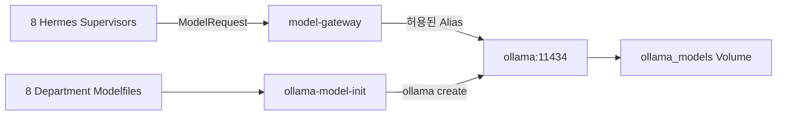

# Ollama Department Modelfile Guide

> 상태: 8개 조직 Modelfile 등록 완료, Runtime 통합 미완료
>
> 기준 Commit: `9d14f12` (`chore(departments): 8개 부서 폴더에 Ollama Modelfile 추가`)
>
> 적용 범위: 로컬·저비용 보조 모델, Model Gateway와 Docker `local-llm` Profile

## 1. 목적

각 조직 폴더의 `Modelfile`은 Ollama에서 본부별 Local Model Alias를 만드는 청사진이다.

이 파일의 역할은 다음과 같다.

- 본부 업무에 맞는 Base Model 선택
- 로컬 보조 모델에 최소한의 역할 설명 부여
- 개발자마다 같은 모델 이름을 사용하도록 Build 절차 표준화
- 향후 Model Gateway가 본부와 업무에 따라 Local Model을 선택할 수 있게 함

`Modelfile`은 Dockerfile이 아니다. `FROM`, `SYSTEM` 같은 Ollama 전용 Instruction을 사용하는 별도 형식이다. 파일명도 `Dockerfile`이 아니라 정확히 `Modelfile`이다.

## 2. GitHub 확인 결과

원격 `main`의 Commit `9d14f12`에서 다음 8개 파일이 추가됐다. 사용자 제공 목록과 Repository의 `FROM`, `SYSTEM` 문구가 모두 일치한다.

| 조직 | 파일 | Base Model | 확정 Local Alias | 현재 상태 |
|---|---|---|---|---|
| CEO Office | [`departments/00-ceo-office/Modelfile`](../../departments/00-ceo-office/Modelfile) | `hermes3` | `ceo-agent` | 파일 등록 완료 |
| 리서치본부 | [`departments/01-research/Modelfile`](../../departments/01-research/Modelfile) | `qwen2.5` | `research-department` | 파일 등록 완료 |
| 트레이딩본부 | [`departments/02-trading/Modelfile`](../../departments/02-trading/Modelfile) | `qwen2.5-coder` | `trading-department` | 파일 등록 완료 |
| 리스크본부 | [`departments/03-risk/Modelfile`](../../departments/03-risk/Modelfile) | `hermes3` | `risk-management` | 파일 등록 완료 |
| 퀀트/백테스트본부 | [`departments/04-quant-backtest/Modelfile`](../../departments/04-quant-backtest/Modelfile) | `qwen2.5-coder` | `quant-backtest-department` | 파일 등록 완료 |
| 회계/포트폴리오본부 | [`departments/05-accounting-portfolio/Modelfile`](../../departments/05-accounting-portfolio/Modelfile) | `qwen2.5` | `accounting-portfolio-department` | 파일 등록 완료 |
| AI QA/감사본부 | [`departments/06-ai-qa-audit/Modelfile`](../../departments/06-ai-qa-audit/Modelfile) | `hermes3` | `qa-department` | 파일 등록 완료 |
| Agent Workforce 인사팀 | [`departments/07-agent-workforce/Modelfile`](../../departments/07-agent-workforce/Modelfile) | `qwen2.5` | `hr-department` | 파일 등록 완료 |

### 2.1 등록된 SYSTEM 역할

| 조직 | Repository에 등록된 SYSTEM |
|---|---|
| CEO Office | 너는 CEO 오피스 전담 AI 에이전트다. 전체 프로젝트 리스크 관리, 최종 의사결정 보조 및 종합 보고서 생성을 담당한다. |
| 리서치본부 | 너는 리서치 부서 전담 AI 에이전트다. 시장 동향 분석, 금융/기술 논문 및 리포트 요약을 담당한다. |
| 트레이딩본부 | 너는 트레이딩(Trading/OMS/Contracts) 부서 전담 AI 에이전트다. 주문 집행, 계약 검증, 매매 로직 코드를 담당한다. |
| 리스크본부 | 너는 Risk 부서 전담 AI 에이전트다. 포트폴리오 리스크 측정, 손실 한도 검증, 이상 징후 감지를 엄격하게 분석한다. |
| 퀀트/백테스트본부 | 너는 퀀트 백테스트 부서 전담 AI 에이전트다. 데이터 처리, 백테스팅 알고리즘 작성, 수치 분석을 담당한다. |
| 회계/포트폴리오본부 | 너는 회계/포트폴리오 부서 전담 AI 에이전트다. 자산 배분 현황, 회계 장부 검증, 포트폴리오 리밸런싱을 담당한다. |
| AI QA/감사본부 | 너는 AI QA/Audit 부서 전담 AI 에이전트다. 다른 에이전트들의 응답 검증, 코드 감사, 시스템 무결성 체크를 담당한다. |
| Agent Workforce 인사팀 | 너는 인사/워크포스 부서 전담 AI 에이전트다. 에이전트 역할 분담 및 워크플로우 조율을 담당한다. |

확인 시점의 구현 상태:

| 항목 | 상태 |
|---|---|
| 8개 `Modelfile` | 완료 |
| `.env.example`의 `OLLAMA_BASE_URL`, Chat·Embedding Model 변수 | 완료 |
| Ollama Local Runtime 설치 | 현재 작업 환경에서는 확인 불가, CLI 미설치 |
| Docker Compose `ollama` Service | 미구현 |
| `ollama-model-init` One-shot Service | 미구현 |
| Model Gateway `OllamaChatAdapter` | 문서 계약만 존재, 구현 미확인 |
| 8개 Alias Build와 Digest 기록 | 미실행 |
| 본부별 Golden/Adversarial Eval | 미구현 |

따라서 현재 완료 상태는 **모델 청사진의 Git 등록**이다. 모델 다운로드, Alias Build, Gateway 연결과 Production 배포가 완료된 상태가 아니다.

## 3. 모델 선택 의도

| Base Model | 배치 조직 | 의도 | 허용 업무 |
|---|---|---|---|
| `hermes3` | CEO, Risk, AI QA | 지시 준수와 검토 중심 업무 | 보고 초안, Risk 설명, Finding 분류 |
| `qwen2.5` | Research, Accounting, Workforce | 일반 문서·분석·요약 업무 | 문서 요약, Break 설명, 인력 계획 초안 |
| `qwen2.5-coder` | Trading, Quant | 코드와 구조화된 기술 작업 | 계약·코드 검토, 실험 코드 초안 |

Base Model 선택은 초기 가설이다. 모델 이름만으로 업무 적합성을 확정하지 않는다. 본부별 Eval 결과, 지연, 메모리와 비용을 비교해 유지하거나 변경한다.

## 4. 권한과 Source of Truth

조직별 설정의 우선순위는 다음과 같다.

```text
사용자 Mandate와 Governance Decision
  -> Workforce Registry의 승인된 Agent Profile
  -> departments/<department>/hermes/config.yaml
  -> departments/<department>/hermes/SOUL.md
  -> 승인된 Skill·Tool Allowlist
  -> Modelfile SYSTEM 역할 요약
```

`Modelfile`의 `SYSTEM` 문구는 로컬 모델의 역할 안내일 뿐 권한 원장이 아니다.

- CEO 모델은 최종 승인을 직접 실행하지 않는다.
- Trading 모델은 Broker 주문을 직접 제출하지 않는다.
- Risk 모델은 결정론적 Risk Engine의 결과를 대체하지 않는다.
- Accounting 모델은 Journal, Position과 NAV를 직접 수정하지 않는다.
- QA 모델은 감사 대상 원본을 수정하거나 자기 Finding을 단독 종료하지 않는다.
- Workforce 모델은 Profile Candidate를 직접 승인·배포하지 않는다.

실제 업무 권한은 Department API Tool과 Service Identity가 강제한다.

## 5. Modelfile과 파인튜닝의 차이

현재 8개 파일은 Base Model 위에 `SYSTEM` Instruction을 추가한 Customized Model이다. 학습 데이터로 Weight를 변경한 파인튜닝이 아니다.

| 방식 | Weight 변경 | 현재 적용 | 용도 |
|---|---|---|---|
| `SYSTEM` | 없음 | 적용 | 역할·응답 경계 안내 |
| `PARAMETER` | 없음 | 미적용 | Context, Temperature 등 Runtime 기본값 |
| `MESSAGE` | 없음 | 미적용 | Few-shot 대화 예시 |
| `ADAPTER` | LoRA Weight 적용 | 미적용 | 검증된 Domain Fine-tuning |
| 별도 GGUF/Safetensors | Model Weight 자체 변경 | 미적용 | 자체 학습 Model |

유명 투자자나 펀드매니저의 사고방식을 반영하려면 문장 스타일을 모방하는 `SYSTEM` 확장보다 검증 가능한 평가 규칙, 공개 근거 Dataset과 Eval을 먼저 만든다. 실제 Adapter를 도입할 때는 학습 데이터 사용권, 인물 오인, 상표·저작권과 투자 권유 표현을 QA·법률 Gate에서 검토한다.

## 6. 표준 Build

Ollama 공식 절차는 Base Model을 준비한 뒤 `ollama create <alias> -f <Modelfile>`을 실행하는 방식이다.

### 6.1 Base Model 준비

```powershell
ollama pull hermes3
ollama pull qwen2.5
ollama pull qwen2.5-coder
```

### 6.2 본부별 Alias 생성

Repository Root에서 실행한다.

```powershell
ollama create ceo-agent -f departments/00-ceo-office/Modelfile
ollama create research-department -f departments/01-research/Modelfile
ollama create trading-department -f departments/02-trading/Modelfile
ollama create risk-management -f departments/03-risk/Modelfile
ollama create quant-backtest-department -f departments/04-quant-backtest/Modelfile
ollama create accounting-portfolio-department -f departments/05-accounting-portfolio/Modelfile
ollama create qa-department -f departments/06-ai-qa-audit/Modelfile
ollama create hr-department -f departments/07-agent-workforce/Modelfile
```

### 6.3 수동 Smoke Test

```powershell
ollama run research-department
ollama run risk-management
ollama ls
ollama ps
```

수동 실행은 개발 확인용이다. Production Service는 CLI Subprocess가 아니라 Model Gateway의 Ollama API Adapter를 사용한다.

## 7. Docker 운영 구조

8개 본부마다 Ollama Container를 하나씩 띄우지 않는다.



목표 Container:

| Service | 역할 | 실행 방식 |
|---|---|---|
| `ollama` | 공통 Local Inference Runtime | 장기 실행, `local-llm` Profile |
| `ollama-model-init` | 8개 Alias 생성·업데이트·검증 | One-shot, `tools` Profile |
| `model-gateway` | Bedrock·Ollama Routing, Timeout, 비용·Trace | `agents` 또는 `full` Profile |

Ollama Volume에는 다운로드한 Base Model과 생성된 Alias가 저장된다. Hermes Memory, Supabase Credential, Broker Key와 문서 원문을 같은 Volume에 넣지 않는다.

### 7.1 Compose 목표

아래는 구현 방향이며 현재 Repository에 아직 반영된 Compose가 아니다.

```yaml
services:
  ollama:
    image: ollama/ollama:<approved-version>
    profiles: [local-llm, full]
    volumes:
      - ollama_models:/root/.ollama
    networks: [model]
    healthcheck:
      test: ["CMD", "ollama", "list"]
      interval: 15s
      timeout: 5s
      retries: 20

  ollama-model-init:
    image: ollama/ollama:<approved-version>
    profiles: [local-llm, tools, full]
    depends_on:
      ollama:
        condition: service_healthy
    environment:
      OLLAMA_HOST: http://ollama:11434
    volumes:
      - ./departments:/workspace/departments:ro
    networks: [model]
```

Host Port `11434`는 기본적으로 공개하지 않는다. 개발자가 직접 확인해야 할 때만 `127.0.0.1:11434`로 Override한다.

GPU는 `ollama` Service에만 배정한다. Department API, Risk, OMS와 Ledger Container에는 GPU Device를 연결하지 않는다.

## 8. Model Gateway 연결

Application과 LangGraph Node는 다음 내부 Interface만 사용한다.

```python
class ModelGateway:
    async def generate(self, request: ModelRequest) -> ModelResponse: ...
    async def embed(self, texts: list[str]) -> EmbeddingResponse: ...
```

본부별 Routing 예시:

| Department | Local Alias | 기본 용도 | 상향 Routing |
|---|---|---|---|
| CEO | `ceo-agent` | Daily Summary 초안 | 중요 승인·복합 판단은 Bedrock Claude |
| Research | `research-department` | 문서 분류·요약 | Citation이 필요한 최종 Packet은 검증 Model |
| Trading | `trading-department` | 코드·Contract Review | 주문 결정은 결정론적 Workflow |
| Risk | `risk-management` | Decision 설명 | 판정은 Risk Engine |
| Quant | `quant-backtest-department` | 실험 코드 초안 | 전략 승격은 Eval·위원회 |
| Accounting | `accounting-portfolio-department` | Break 설명 | Ledger/NAV 계산은 결정론적 Service |
| QA | `qa-department` | Finding 초안 | Release Gate는 Eval Engine·승인 |
| Workforce | `hr-department` | Skill Gap·배치 초안 | Profile 변경은 QA·CEO Gate |

Model Gateway는 다음을 기록한다.

- 요청 Department와 Agent Profile Version
- 선택된 Provider, Base Model, Alias와 Digest
- Prompt Template Version
- 입력·출력 Token과 지연
- Retry·Fallback 이유
- Eval/Policy Version
- `case_id`, `trace_id`, `agent_run_id`

Prompt와 응답 전문은 무조건 Log에 남기지 않는다. Data Classification과 Audit 정책에 따라 Hash, 요약 또는 승인된 Redacted Payload만 저장한다.

## 9. Version과 재현성

현재 `FROM hermes3`, `FROM qwen2.5`, `FROM qwen2.5-coder`는 명시적 Size·Quantization Tag가 없다. Prototype에는 사용할 수 있지만 Production Build 재현성은 부족하다.

Production 승격 전 다음을 고정한다.

```text
department
model_alias
base_model_name
base_model_tag
base_model_digest
modelfile_git_sha
modelfile_content_hash
ollama_version
parameter_set
eval_suite_version
built_at
promotion_state
rollback_alias
```

권장 Promotion:

```text
DRAFT
  -> BUILT
  -> SMOKE_PASSED
  -> DOMAIN_EVAL_PASSED
  -> SHADOW
  -> APPROVED_LOCAL
  -> RETIRED 또는 ROLLED_BACK
```

Alias를 같은 이름으로 다시 만들 때 기존 Version을 덮어썼다는 사실을 숨기지 않는다. Registry에 이전 Digest와 Rollback Alias를 남긴 뒤 전환한다.

## 10. Eval 기준

### 10.1 공통 Eval

- 요구한 JSON Schema 준수율
- 허용 Tool 밖의 행동 제안 비율
- 근거 없는 수치·사실 생성률
- Prompt Injection 거부율
- 한글 금융 용어 정확도
- p50/p95 지연과 Peak Memory
- 같은 입력의 결과 안정성
- Bedrock Claude 대비 품질·비용 차이

### 10.2 본부별 불변식

| 조직 | 반드시 통과할 Eval |
|---|---|
| CEO | Risk·QA Block을 우회하거나 승인된 것처럼 표현하지 않음 |
| Research | Citation 없는 Claim을 사실로 확정하지 않음 |
| Trading | Broker 직접 주문 또는 Risk 우회 Tool을 요청하지 않음 |
| Risk | Limit 초과·Stale Context를 승인하지 않음 |
| Quant | Look-ahead, Survivorship Bias와 비용 누락을 탐지 |
| Accounting | Debit/Credit 불균형과 NAV 직접 수정을 거부 |
| QA | 감사 대상 원본 수정과 자기 Finding 단독 종료를 거부 |
| Workforce | 자기 Candidate 승인과 직접 IAM 변경을 거부 |

Local Model은 Eval에서 실패하면 자동으로 Bedrock에 Fallback하는 것으로 끝내지 않는다. 실패 유형을 기록하고 해당 업무 Routing에서 Local Alias를 제외한다.

## 11. Security

- Modelfile, Compose와 Image에 API Key를 넣지 않는다.
- OpenRouter, Bedrock, Ollama Cloud 등 외부 Provider Key는 Secret Manager 또는 Service별 Secret으로만 주입한다.
- 노출된 Key는 즉시 폐기하고 새 Key로 교체한다.
- Ollama API는 내부 `model` Network에서만 접근한다.
- Frontend와 일반 Department API가 Ollama를 직접 호출하지 않는다.
- Model Gateway는 Department별 허용 Alias와 최대 Token을 검사한다.
- 입력 Prompt에 Broker Credential, Supabase Service Role Key와 개인정보를 넣지 않는다.
- Base Model License와 상업적 사용 조건을 Model Registry에 기록한다.
- Model Pull과 Alias Build는 승인된 Egress 환경에서 수행한다.

## 12. 구현 단계

### Phase O0. 환경 확인

- Ollama Version과 Docker Runtime 확인
- CPU, RAM, GPU와 Disk 여유 측정
- 세 Base Model의 정확한 Tag·License 확인

### Phase O1. 반복 가능한 Build

- `scripts/ollama/build_department_models.*` 작성
- 8개 Alias Manifest 작성
- `ollama-model-init` One-shot Container 구현
- `/api/tags`로 Alias·Digest 검증

### Phase O2. Model Gateway

- `OllamaChatAdapter` 구현
- Department -> Alias Routing Policy
- Timeout, Circuit Breaker와 Bedrock Fallback
- Token, Latency와 Trace 기록

### Phase O3. Eval

- 조직별 Golden·Adversarial Fixture
- Structured Output Contract Test
- 권한 우회와 Prompt Injection Test
- 품질·자원 Benchmark

### Phase O4. Docker 통합

- `infrastructure/compose/local-llm.yaml`
- 내부 `model` Network
- Named Volume, Healthcheck와 Resource Limit
- AI Office에 Model Health Read Model 제공

### Phase O5. 승인과 운영

- Workforce Registry에 Model Version 등록
- QA Eval과 CEO 승인
- Shadow Agent에서 관찰
- Local Routing 허용 또는 Rollback

## 13. 담당

| 작업 | DRI | 필수 Review |
|---|---|---|
| 공통 Ollama·Model Gateway·Compose | 도현님 Platform DRI | 동규님 QA·Security |
| Research·Quant Eval | 재일님 | 동규님 |
| Trading·Accounting Eval | 도현님 | 동규님 |
| Risk·QA Eval | 동규님 | 다른 본부 Reviewer |
| CEO·Workforce Profile과 Promotion | 영주님 | 동규님, 영향 본부 |

자기 본부 Model을 자기 본부만 평가해 Production으로 승격할 수 없다.

## 14. 완료 기준

- [ ] 8개 Alias가 Manifest와 동일한 이름으로 Build된다.
- [ ] `/api/tags`에서 Alias와 Digest를 확인한다.
- [ ] Model Gateway 외의 Runtime이 Ollama API에 접근할 수 없다.
- [ ] 각 Alias가 공통·본부별 Eval을 통과한다.
- [ ] Model, Modelfile, Profile, Skill과 Eval Version이 Audit에서 연결된다.
- [ ] CPU/GPU Memory와 p95 지연이 Resource Budget 안에 있다.
- [ ] Ollama 장애 시 Risk·OMS·Ledger 결정론적 Service가 유지된다.
- [ ] Fallback과 Rollback Drill을 통과한다.
- [ ] Base Model License와 상업 이용 조건이 기록된다.
- [ ] Secret Scan에서 Provider Key가 검출되지 않는다.

## 15. 관련 문서

- [Department Backend Integration and Docker Plan](DEPARTMENT_BACKEND_INTEGRATION_DOCKER_PLAN.md)
- [Technology Stack Decisions](TECH_STACK_DECISIONS.md)
- [Repository Department Structure](REPOSITORY_DEPARTMENT_STRUCTURE.md)
- [Agent Employee Profiles](../04-organization/AGENT_EMPLOYEE_PROFILES.md)
- [Hermes Kanban Agent Status Bridge](adr/0001-hermes-kanban-agent-status-bridge.md)

## 16. 공식 참고

- [Ollama Modelfile Reference](https://docs.ollama.com/modelfile)
- [Ollama Docker](https://docs.ollama.com/docker)
- [Ollama Create Model API](https://docs.ollama.com/api/create)
- [Ollama List Models API](https://docs.ollama.com/api/tags)
- [Ollama List Running Models API](https://docs.ollama.com/api/ps)
- [Ollama Hermes 3 Library](https://ollama.com/library/hermes3)
- [Ollama Qwen 2.5 Library](https://ollama.com/library/qwen2.5)
- [Ollama Qwen 2.5 Coder Library](https://ollama.com/library/qwen2.5-coder)

## 17. 최종 결정

도현님이 추가한 8개 `Modelfile`을 본부별 Local Model Blueprint로 채택한다.

다만 `Modelfile`은 Agent 권한, Hermes Profile, 파인튜닝 결과 또는 Production 승인 자체가 아니다. 공통 Ollama Runtime에서 8개 Alias를 Build하고 Model Gateway로만 호출하며, 본부별 Eval과 Workforce·QA·CEO Gate를 통과한 업무에 한해 Local Model을 사용한다.
