# Research-Quant Evidence-to-Strategy Framework

> 상태: 채택 예정 설계 기준
> 범위: 리서치본부, 퀀트/백테스트본부, 두 본부의 Hermes Supervisor와 LangGraph Workflow
> 상위 기준: [HEDGE_FUND_MASTER_PLAN.md](../HEDGE_FUND_MASTER_PLAN.md)
> 구현 담당: [TEAM_JAEIL_RESEARCH_QUANT_GUIDE.md](../05-teams/TEAM_JAEIL_RESEARCH_QUANT_GUIDE.md)
> 리서치 산출물 상세: [RESEARCH_OUTPUT_ADVANCEMENT_STRATEGY.md](RESEARCH_OUTPUT_ADVANCEMENT_STRATEGY.md)

## 1. 한 문장 정의

이 프레임워크는 **수집한 자료를 출처가 연결된 투자 주장으로 만들고, 그 주장을 반증 가능한
전략 가설과 재현 가능한 실험으로 바꾼 뒤, 실패 결과까지 다시 연구 절차에 학습시키는
Research-to-Strategy 폐쇄 루프**다.

쉽게 말하면 다음 세 질문에 순서대로 답한다.

1. 지금까지 확인된 사실은 무엇인가?
2. 그 사실에서 검증할 만한 투자 가설은 무엇인가?
3. 과거에 같은 규칙을 적용했을 때 비용 후에도 반복해서 살아남았는가?

리서치본부는 1번과 2번의 근거를 만들고, 퀀트/백테스트본부는 2번을 고정한 뒤 3번을
검증한다. Hermes는 본부장으로서 일을 배정하고 실패를 복구하며 승인 후보를 올리지만,
수치 계산이나 자기 결과의 최종 승인자는 아니다.

## 2. 결론부터 보는 채택안

하나의 논문이나 오픈소스를 통째로 도입하지 않는다. 서로 다른 문제를 잘 푸는 패턴을
다음처럼 조합한다.

| 문제 | 채택 패턴 | 프로젝트 적용 |
|---|---|---|
| 원자료가 많지만 판단 맥락이 없음 | Nexus의 Contextualization | 사건·가격·공시·뉴스를 `as_known_at` 기준 인과 타임라인으로 정렬 |
| 단기 사건과 중장기 시장 환경이 뒤섞임 | Nexus의 Dual-resolution | `macro_outlook`과 `micro_outlook`을 독립 생성한 뒤 합성 |
| 금융 문서의 표·절·메타데이터가 검색 중 유실됨 | MimirRAG | 구조 보존 파싱, 표 단위 Chunk, Metadata Filter와 숫자 검증 |
| 검색어가 로컬 DB 구조와 맞지 않음 | FinSAgent | Corpus-aware Query Plan과 역할별 Retrieval Path를 작은 Spike로 검증 |
| 여러 관점을 빠뜨림 | STORM | 분석 전 Perspective와 질문 목록을 만들되 최종 판단은 맡기지 않음 |
| 시계열 모델 선택을 LLM 감으로 처리함 | TimeSeriesScientist | Curator, Planner, Forecaster, Reporter 역할 분리 |
| 시장 국면·기간마다 좋은 모델이 다름 | Synapse | 단일 모델 우선 원칙을 유지하되 검증 후 Regime/Horizon별 Ensemble 후보 허용 |
| 과거 유사 국면과 실패가 다음 연구에 연결되지 않음 | AlphaCast, FinCon | Case Memory, 역할별 회고, 관련 본부에만 제한된 개선 후보 전파 |
| 실험 Agent가 결과를 보고 가설을 고침 | DSR, PBO/CPCV 계열 검증 | 사전 등록, Trial Ledger, 독립 검증, 다중 실험 편향 보정 |

**도입 우선순위**는 `Point-in-Time과 계약 강화 -> Research 구조화 -> Quant 독립 검증 ->
Calibration -> Ensemble` 순서다. 최신 Preprint의 성능 수치는 재현 전에는 제품 성능의
근거로 사용하지 않는다.

## 3. 현재 구조의 정확한 모습

계획 문서와 실행 코드는 구분해 읽어야 한다.

### 3.1 현재 리서치본부

현재 `departments/01-research/scripts.py`는 다음 LangGraph를 실행한다.

```text
Universe 검사
  -> Evidence 조립
  -> News/Sentiment
  -> Technical
  -> Fundamental
  -> Regime
  -> Geopolitical
  -> Microstructure
  -> Research Packet 초안
```

- 여섯 분석가는 단일 GPU와 공유 모델 제약 때문에 **순차 실행**된다.
- 마지막 단계는 `hermes/config.yaml`의 `research-supervisor` 페르소나를 읽어 일반 LLM
  호출로 Packet을 합성한다.
- 따라서 현재 상태를 `Hermes 본부장이 실제 Queue, Memory, Retry와 승인 상태를 관리하며
  취합한다`고 표현하면 정확하지 않다.
- 정확한 표현은 **LangGraph가 직원 분석과 LLM 합성을 실행하고, Hermes 본부장 Runtime에
  연결하기 위한 Profile과 Tool 호출면이 준비된 상태**다.
- `as_known_at`은 실행 시각으로 기록되지만 일부 분석 도구가 아직 그 시각을 Query Cutoff로
  강제하지 않으므로 완전한 Point-in-Time 보장은 아니다.

### 3.2 현재 퀀트/백테스트본부

현재 Quant는 하나의 통합 Graph가 아니라 다음 독립 스크립트로 구성된다.

```text
strategy_hypothesis_agent.py
pit_dataset.py
backtest_runner.py
walk_forward.py
experiment_orchestrator.py
```

- 가설 Agent는 현재 `market-api /regime/daily`로 계산한 제한된 시장 단면을 주 근거로 쓴다.
- Research Packet의 Claim과 Evidence가 Hypothesis에 직접 연결되는 표준 계약은 아직 없다.
- Dataset Hash, t-1 Signal, 비용, 실패 기록 같은 좋은 결정론적 기반은 존재한다.
- Quant Hermes Profile과 직원 Persona는 있지만, 이들을 작업 상태와 승인 경계가 있는
  LangGraph/Worker Runtime으로 연결하는 작업은 남아 있다.

### 3.3 현재 유지해야 할 장점

- LLM이 가격, 지표와 성과 수치를 임의 계산하지 않고 결정론적 코드 결과를 해석한다.
- 분석가의 상충 의견을 삭제하지 않고 Packet에 보존한다.
- 데이터셋, 코드, 비용 모델과 결과 Hash를 연결한다.
- 실패한 실험과 `REJECTED` 후보도 기록한다.
- Agent가 Production DB Credential, Broker 권한과 전략 승격 권한을 갖지 않는다.

## 4. 현재 구조에서 해결해야 할 문제

| ID | 문제 | 실제 영향 | 해결 원칙 |
|---|---|---|---|
| `RQF-P01` | Hermes와 LLM 합성기의 역할이 문서상 혼재 | 운영 복구·메모리·승인 책임이 불명확 | Hermes는 Control Plane, LangGraph는 Case Workflow로 고정 |
| `RQF-P02` | 분석가가 논리적으로도 직렬 연결 | 한 역할 실패가 뒤의 모든 역할을 막고 부분 결과 재사용이 어려움 | 독립 Branch와 Fan-in으로 표현하고 실행 동시성만 1로 제한 |
| `RQF-P03` | 모든 역할이 비슷한 Evidence Bundle을 받음 | 역할별 검색 누락, 관련 없는 문서와 Semantic 유사도 오탐 | Corpus-aware Query Plan과 역할별 Tool Allowlist 도입 |
| `RQF-P04` | 긴 서술을 압축해 Supervisor Prompt에 주입 | 분석가가 늘수록 정보 유실, Token 절단과 Schema 실패 | Claim/Evidence Graph와 ID 기반 Map-Reduce 합성 |
| `RQF-P05` | `as_known_at`이 기록값이지 전 API 강제조건은 아님 | 미래 정보 누수와 Replay 불일치 | 지원하지 않는 Tool은 Fail-closed, 시각 3종 계약 강제 |
| `RQF-P06` | 거시·미시·기간별 전망이 한 Verdict에 섞임 | 단기 악재와 장기 가치의 충돌을 평균내기 쉬움 | Horizon별 독립 전망과 합성 규칙 분리 |
| `RQF-P07` | Evidence 누락과 모순을 합성 전에 닫는 단계가 없음 | 근거가 빈 약한 논리가 자연스러운 문장으로 포장 | Coverage·Contradiction Validator와 제한된 재검색 Loop |
| `RQF-P08` | Research와 Quant 사이가 Observation 수준 Handoff | 전략 가설이 어떤 주장과 증거에서 나왔는지 추적 어려움 | Evidence ID가 포함된 `HypothesisSpecV2` 도입 |
| `RQF-P09` | Quant 역할 Profile과 실행 코드가 분리 | 가설 생성자와 검증자가 실제로 같은 실행 흐름에 섞일 수 있음 | 역할별 Service Identity와 독립 Validation Subgraph |
| `RQF-P10` | 단순 Walk-Forward와 Sharpe 중심 검증 | 반복 탐색에 따른 과적합 확률을 충분히 통제하지 못함 | Trial Ledger, Purge/Embargo, CPCV, DSR와 PBO 추가 |
| `RQF-P11` | 실패 결과가 다음 검색·가설 설계로 구조화되지 않음 | 같은 데이터 누락과 실패 가설 반복 | Outcome Scorer와 Calibration Candidate Loop |
| `RQF-P12` | 자유로운 Agentic AutoML 유혹 | 장기 실험에서 계획 이탈, 결과 선택과 환각 위험 | LLM은 Spec 생성, Runner와 Gate는 결정론적 Service |

## 5. 목표 아키텍처

### 5.1 전체 흐름

```mermaid
flowchart LR
    T["Event · 정기 Mandate"] --> RH["Research Hermes Supervisor"]
    RH --> RC["ResearchCaseV2 생성 · 예산 · SLA"]
    RC --> RG["Research LangGraph"]

    RG --> CUT["PIT Cutoff Lock"]
    CUT --> QP["Corpus-aware Retrieval Planner"]
    QP --> EF["Evidence Foundation · Context Timeline"]
    EF --> FAN["Specialist Fan-out"]
    FAN --> CG["Claim/Evidence Graph"]
    CG --> VAL["Coverage · Contradiction · Numeric Validator"]
    VAL --> MAC["Macro Outlook"]
    VAL --> MIC["Micro Outlook"]
    MAC --> SYN["Synthesis"]
    MIC --> SYN
    SYN --> RED["Skeptic Challenge"]
    RED --> RP["ResearchPacketV2"]

    RP --> QH["Quant Hermes Supervisor"]
    QH --> QG["Quant LangGraph"]
    QG --> CUR["Data Curator · PIT Dataset"]
    CUR --> HYP["Hypothesis Planner · Preregistration"]
    HYP --> RUN["Deterministic Experiment Runner"]
    RUN --> ROB["Independent Robustness Validator"]
    ROB --> ARB["Model/Strategy Arbitrator"]
    ARB --> CARD["ExperimentCard · Candidate"]
    CARD --> GATE["QA · Risk · CEO Promotion Gate"]

    RP --> OUT["Outcome Scorer"]
    CARD --> OUT
    OUT --> CAL["Calibration Candidate"]
    CAL --> QA["Held-out Eval · QA 승인"]
    QA --> SK["Versioned Hermes Skill/Memory"]
    SK -.-> RH
    SK -.-> QH
```



### 5.2 세 계층의 책임

| 계층 | 해야 하는 일 | 하지 않는 일 |
|---|---|---|
| Hermes Supervisor | Mandate 해석, Case 생성, Queue·Budget·SLA, 재시도, 차단·승인 요청, 검증된 Skill 호출, 결과 요약 | 원시 가격 계산, Backtest Metric 산출, Risk Limit 변경, 자기 후보 승인 |
| LangGraph Workflow | 상태 전이, Branch/Fan-in, Checkpoint, Schema 검증, 제한된 재검색, 부분 실패 처리 | 장기 사실 기억의 원본, 공식 장부, 임의 Production 배포 |
| Deterministic Service | PIT 조회, 수치 계산, 중복 제거, Dataset Build, Backtest, 통계 검정, Hash와 Registry | 투자 Thesis 서술, 근거 없는 가설 생성 |

LangGraph의 `Send` 기반 Map-Reduce로 분석 역할을 독립 Branch로 표현한다. 현재 단일 GPU에서는
Worker Queue의 `max_concurrency=1`로 실행하고, 향후 Model Server가 늘어나면 설정만 높인다.
Graph 의미를 하드웨어 제약에 맞춰 직렬로 고정하지 않는다. Checkpoint는 성공한 Branch를
재실행하지 않고 장애 지점부터 복구하는 데 사용한다.

## 6. Research Framework

### 6.1 단계별 Workflow

| 단계 | 담당 | 하는 일 | 실패 시 |
|---|---|---|---|
| 1. Intake | Research Hermes | 사건, 종목, Horizon, 중요도, 예산과 SLA를 `ResearchCaseV2`로 고정 | 필수 Mandate 누락 시 `BLOCKED` |
| 2. Cutoff Lock | PIT Service | `as_known_at`과 `event_time/available_time/observed_at` 규칙 고정 | Cutoff 미지원 Source는 제외 또는 Case 중단 |
| 3. Query Plan | Retrieval Planner | 역할별 질문, Source, Metadata Filter, 숫자·표 필요 여부 생성 | 계획 Schema 오류 시 1회 재생성 |
| 4. Contextualization | Evidence Service | 사건 타임라인, Entity, 가격 반응, 공시·뉴스 선후관계 구성 | 식별자 충돌은 Data Steward로 Escalation |
| 5. Specialist Fan-out | LangGraph Workers | Fundamental, Technical, Microstructure, News, Macro/Regime, Geopolitical 독립 분석 | 필수 역할 실패만 Case 차단, 나머지는 부분 결과 표시 |
| 6. Evidence Validation | 결정론적 Validator | Citation 존재, 숫자 일치, 시간 누수, 주장 Coverage와 모순 검사 | 최대 2회 Evidence Gap 재검색 |
| 7. Dual Outlook | Outlook Workers | Macro/중기와 Micro/단기 전망을 서로 보지 않고 작성 | 근거 부족이면 `INCONCLUSIVE` |
| 8. Synthesis | Synthesis Worker | 두 전망과 Claim Graph를 최종 Thesis·촉매·무효화 조건으로 결합 | 긴 원문 대신 Claim ID만 사용 |
| 9. Challenge | Skeptic Worker | 대안 설명, 반대 근거, 과신과 누락 질문 제시 | 치명적 반증이면 `INSUFFICIENT` |
| 10. Publish | Research Hermes | 계약 검증된 Packet을 서명하고 Event 발행, 후속 부서 Handoff | 미검증 Packet 발행 금지 |

`ResearchCaseV2`는 본부장이 직원에게 내리는 업무지시이자 Case 전체의 실행 경계다.

```yaml
case_id: research_case_...
instrument_ids: [inst_...]
trigger:
  type: disclosure
  source_event_ids: [event_...]
mandate_version: mandate_...
as_known_at: 2026-08-03T01:30:00Z
horizons: [1d, 5d, 20d]
required_perspectives:
  - fundamental
  - technical
  - news_sentiment
optional_perspectives:
  - geopolitical
budgets:
  wall_clock_seconds: 300
  max_llm_calls: 10
  max_retrieval_rounds: 2
priority: 80
status: RECEIVED
```

`as_known_at`, Mandate, Horizon과 Budget은 실행 중 Agent가 바꿀 수 없다. 변경이 필요하면 Hermes가
새 Case Version을 발행한다.

### 6.2 역할별 Retrieval

모든 직원에게 같은 검색 결과를 주지 않는다.

| 역할 | 우선 Source | 필수 Filter와 Tool |
|---|---|---|
| Fundamental | DART 원문·재무·Corporate Action | 공시 유형, 보고기간, 연결/별도, 정정 이력, 표 단위 검색 |
| News/Sentiment | NAVER/Alpaca, 승인된 X Watchlist | 게시·관측 시각, Entity, Story Cluster, 독립 출처 수 |
| Technical | LS Bar와 결정론적 Feature | `as_known_at`, 조정주가 버전, Feature Version |
| Microstructure | Tick, Quote, 거래대금·Spread·Impact | 거래 세션, 지연, 결측·Gap, 유동성 Bucket |
| Macro/Regime | 금리·FX·지수·Breadth·Calendar | 공표 시각, Revision Vintage, 국내 시장 Mapping |
| Geopolitical | 공식 발표·공신력 뉴스·GDELT 후보 | Event 시간, 지역·산업 Entity, Source Reliability |

Semantic Similarity만으로 증거를 채택하지 않는다. `Metadata Filter -> Lexical/Vector Hybrid ->
Rerank -> Citation/Time/Numeric Validation` 순서로 처리한다.

### 6.2.1 Web Search MCP와 직원 배정

웹검색은 내부 RAG를 대체하는 공통 Tool이 아니라 Evidence Gap을 보완하는 제한된 Retrieval
경로다. 초기에는 새 Agent를 만들지 않고 기존 `RES-08 RAG Librarian/Evidence Curator`를
`RAG Librarian, Evidence Curator and Web Researcher`로 확장한다.

```text
전문 분석가의 Unanswered Question
  -> WebSearchRequest
  -> RES-08 내부 RAG 재검색
  -> Evidence Gap 확인
  -> SearXNG Search MCP
  -> URL·시점·Source Tier·License 검사
  -> 상위 URL만 ArticleReader/Read-only Playwright MCP
  -> SEARCH_HIT
  -> Citation·Time·Numeric Validator
  -> VERIFIED_EVIDENCE
```

P0 권한 배정:

| 역할 | `research.web.search` | `research.web.open` | `research.web.verify` | 비고 |
|---|---:|---:|---:|---|
| RES-08 RAG Librarian/Web Researcher | 허용 | 허용 | 검증 후보 제출 | 실제 MCP 사용자 |
| RES-00 Research Supervisor | 금지 | 금지 | 금지 | Case 우선순위와 RES-08 위임만 수행 |
| RES-05 Fundamental | 금지 | 금지 | 금지 | IR·공시·실적 원출처 요청 가능 |
| RES-06 News/Sentiment | 금지 | 금지 | 금지 | 속보·루머·독립 출처 검색 요청 가능 |
| RES-07 Sector/Macro | 금지 | 금지 | 금지 | 정책·통계 공식 원문 요청 가능 |
| RES-09 Geopolitical | 금지 | 금지 | 금지 | 정부·국제기구·제재 원문 요청 가능 |
| RES-01/02/03/04 | 금지 | 금지 | 금지 | Universe·DQ·Market/Feature API만 사용 |

전문 분석가에게는 외부 검색 Tool 대신 `research.web.request`만 제공한다. 요청 계약은
`case_id`, 질문, 검색 목적, `as_known_at`, 허용 Source Tier·Domain, 최대 Query/Page 수와
Due Time을 가진다. RES-08은 결과를 긴 본문으로 반환하지 않고 `Search Hit Set`과 검증된
Evidence ID를 반환한다.

검색 인프라는 `Self-hosted SearXNG -> research-web-mcp`를 기본으로 하고, JavaScript·버튼·탭이
필요한 상위 URL만 격리된 Playwright MCP로 연다. Tavily/SerpApi Quota는 SearXNG 장애 또는
Material Case의 Coverage 보완에만 예약한다. Browser에는 로그인 Profile, Broker·DB Secret,
내부망, 파일 실행과 Persistent Download 권한을 주지 않는다.

`RES-10 Web Intelligence Researcher`는 초기 Roster에 넣지 않는다. 다음 조건이 최소 2개 평가
주기에서 반복될 때 Agent Workforce에 Hiring Requisition을 제출한다.

1. Web Search Queue가 본부 SLO를 반복 위반한다.
2. 검색 업무 때문에 RES-08의 Citation Resolution, Index Freshness 또는 Retraction 업무가 지연된다.
3. 국제 정책·산업·법률 원출처 탐색이 일반 Evidence Curator와 다른 언어·도메인 Skill을 요구한다.
4. 발견과 Evidence 승격을 분리해야 할 만큼 Source Conflict 또는 오승격 위험이 커진다.

신설 후에는 RES-10이 `Search Hit Set` 발견만 맡고, RES-08이 독립적으로
`VERIFIED_EVIDENCE` 승격을 맡는다. 검색 Agent가 자기 결과를 사실로 승인할 수 없다.

### 6.3 `AnalystFindingV1`

각 직원은 자유 보고서 대신 같은 계약을 반환한다.

```yaml
finding_id: finding_...
case_id: research_case_...
perspective: fundamental
as_known_at: 2026-08-03T01:30:00Z
horizon: 20d
claims:
  - claim_id: claim_...
    statement: 영업이익률이 전년 동기 대비 개선됐다.
    claim_type: fact        # fact | inference | forecast
    evidence_ids: [dart_..., financial_...]
    direction: supportive  # supportive | opposing | neutral
    confidence: 0.72
    numeric_refs: [metric_...]
contradictions: [claim_...]
unanswered_questions:
  - 개선이 일회성 원가 요인인지 확인 필요
status: COMPLETE            # COMPLETE | PARTIAL | INCONCLUSIVE | BLOCKED
model_version: agent-research@...
prompt_version: res-fundamental@...
tool_versions: [research-api@...]
```

### 6.4 `ResearchPacketV2`

```yaml
packet_id: rp_...
case_id: research_case_...
instrument_id: inst_...
trigger: disclosure
as_known_at: 2026-08-03T01:30:00Z
horizons: [1d, 5d, 20d]
evidence_manifest_id: em_...
claim_graph_id: cg_...
macro_outlook:
  direction: neutral
  confidence: 0.58
  claim_ids: [claim_...]
micro_outlook:
  direction: positive
  confidence: 0.66
  claim_ids: [claim_...]
thesis: 단기 촉매는 있으나 중기 시장 환경은 중립적이다.
catalysts: []
invalidation: []
dissent: []
evidence_gaps: []
calibration:
  cohort: disclosure_20d
  historical_brier: null
status: PUBLISHED
lineage:
  graph_version: research-rqf-v1
  model_versions: {}
  prompt_versions: {}
```

Packet의 Confidence는 자연어 강도가 아니라 과거 같은 유형의 예측 오차로 보정한다.
충분한 표본이 없으면 `uncalibrated: true`를 표시하고 숫자를 정밀한 확률처럼 사용하지 않는다.

### 6.5 Research 상태 머신

```text
RECEIVED
  -> CUTOFF_LOCKED
  -> EVIDENCE_READY
  -> ANALYSIS_RUNNING
  -> EVIDENCE_VALIDATING
  -> OUTLOOK_READY
  -> CHALLENGED
  -> PACKET_PUBLISHED

어느 단계에서든 -> INSUFFICIENT_EVIDENCE | BLOCKED | FAILED
```

## 7. Quant/Backtest Framework

### 7.1 단계별 Workflow

TimeSeriesScientist의 `Curator -> Planner -> Forecaster -> Reporter` 분리를 금융 전략 연구에
맞게 확장한다.

| 단계 | 담당 | 하는 일 | Agent 사용 범위 |
|---|---|---|---|
| 1. Intake | Quant Hermes | ResearchPacket, 연구 Mandate와 자원 예산 접수 | 우선순위와 Queue |
| 2. Curator | Data/Feature Agent + Dataset Service | 가용 데이터 진단, PIT Dataset Manifest, 결측·Revision·Universe Bias 검사 | 진단 설명만 Agent, Dataset 생성은 코드 |
| 3. Hypothesis Planner | Strategy Research Agent | 증거에 연결된 복수 가설과 대안 설명 생성 | 사전 등록 전까지만 수정 가능 |
| 4. Experiment Designer | Experiment Agent | Feature, Label, Baseline, Split, Cost, Trial Budget와 폐기조건 고정 | Pydantic 계약 출력 |
| 5. Runner | 격리된 Deterministic Worker | 코드 실행, Fit, Backtest, Metric, Artifact와 Hash 생성 | LLM 호출 금지 |
| 6. Robustness Validator | 독립 검증 Service/Red Team | Leakage, Purge/Embargo, CPCV, DSR, PBO, Bootstrap, Ablation, Regime/Capacity 검사 | 실패 설명에만 Agent 사용 |
| 7. Arbitrator | Model/Strategy Selector | 단순 Baseline, 규칙, 통계, ML, TSFM과 Ensemble 비교 | 검증된 Metric만 읽음 |
| 8. Reporter | Quant Reporter | 결과와 실패 원인을 `ExperimentCardV1`으로 정리 | 수치 재계산 금지 |
| 9. Submit | Quant Hermes | QA/Risk Gate에 Candidate 제출 | Production 직접 승격 금지 |

### 7.2 가설 사전 등록

`HypothesisSpecV2`는 Backtest 결과를 보기 전에 불변으로 저장한다.

```yaml
hypothesis_id: hyp_...
version: 2
origin:
  research_packet_ids: [rp_...]
  claim_ids: [claim_...]
strategy_family: event_driven
economic_rationale: 공시 충격 이후 유동성 회복 속도가 후속 수익률과 관련된다.
competing_explanation: 단순 시장 반등 또는 업종 공통 충격일 수 있다.
universe_version: krx-liquid-v...
decision_frequency: 5m
holding_horizon: 5d
features: []
label: {}
baseline: sector_neutral_momentum
entry_exit_rules: {}
cost_model_version: krx-cost-v...
trial_family_id: liquidity_recovery_v1
trial_budget: 12
preregistered_splits: []
falsification_tests: []
status: PREREGISTERED
```

가설의 Feature, Label, Split, 비용 또는 폐기 기준을 바꾸면 같은 ID를 수정하지 않고 새
Version을 만든다. `trial_family_id`로 비슷한 실험 횟수를 누적해 좋은 결과만 선택하는 문제를
측정한다.

### 7.3 검증 표준

| 검증 | 목적 | P0/P1 |
|---|---|---|
| Point-in-Time와 t-1 Signal | 미래 데이터 누수 방지 | P0 |
| Purged Walk-Forward + Embargo | Label 기간 중첩에 따른 누수 축소 | P0 |
| 거래 비용·Slippage·Capacity | 실행 불가능한 Alpha 제거 | P0 |
| Baseline과 Ablation | 복잡성이 실제로 기여하는지 확인 | P0 |
| Regime·기간·종목군 분해 | 특정 구간 의존성 확인 | P0 |
| Bootstrap Confidence Interval | 표본 불확실성 표현 | P0 |
| Trial Ledger + Deflated Sharpe Ratio | 반복 실험과 비정규 수익 분포 보정 | P1 |
| PBO와 CPCV | 선택한 최적 전략의 과적합 가능성 측정 | P1 |
| Feature/Label Perturbation | 작은 정의 변경에 대한 취약성 확인 | P1 |
| Shadow/Paper Calibration | Backtest와 현실의 괴리 확인 | P1 |

Walk-Forward 하나만으로 모든 과적합을 막았다고 간주하지 않는다. CPCV는 순서가 중요한
실시간 배포 평가를 대체하는 것이 아니라 **연구 단계에서 여러 경로의 안정성을 보는 보조
검증**으로 사용한다.

### 7.4 Model/Strategy Arbitration

Synapse와 TimeSeriesScientist의 핵심 아이디어는 모든 문제에 한 모델이 항상 최선이라고
가정하지 않는 것이다. 그러나 복잡한 Ensemble은 기본값이 아니다.

1. Naive, 규칙 기반과 단순 통계 Baseline을 먼저 실행한다.
2. ML/TSFM 후보는 같은 PIT Dataset과 비용 조건에서 비교한다.
3. 단일 Champion이 안정적이면 그대로 사용한다.
4. Regime/Horizon별 우위가 반복될 때만 동적 Weighting Challenger를 만든다.
5. Weight는 Rolling OOS 성과만 사용하고 Final Holdout을 보지 않는다.
6. Ensemble이 비용·지연·설명 가능성을 포함해 단순 Champion을 이기지 못하면 폐기한다.

`TimeCopilot`은 다양한 Forecast Model을 같은 Adapter로 실험하기 위한 P1 후보 Library다.
핵심 Registry나 검증 Gate를 외부 Library에 맡기지는 않는다.

### 7.5 `ExperimentCardV1`

```yaml
experiment_id: exp_...
hypothesis_id: hyp_...
dataset_manifest_id: ds_...
dataset_hash: sha256:...
code_hash: sha256:...
dependency_lock_hash: sha256:...
seed: 42
trial_family_id: liquidity_recovery_v1
trial_number: 7
cost_model_version: krx-cost-v...
validation:
  purged_walk_forward: PASS
  cpcv: NOT_RUN
  deflated_sharpe: null
  probability_of_backtest_overfitting: null
oos_metrics: {}
regime_breakdown: {}
capacity: {}
failures: []
decision: REJECT       # REJECT | REVISE | SUBMIT_TO_QA
lineage: {}
```

### 7.6 Quant 상태 머신

```text
INTAKE
  -> PREREGISTERED
  -> DATASET_CERTIFIED
  -> RUNNING
  -> ROBUSTNESS_REVIEW
  -> SUPPORTED | REJECTED | NEEDS_DATA

SUPPORTED -> QA_REVIEW -> RISK_REVIEW -> SHADOW_CANDIDATE
```

### 7.7 Investment Doctrine Model Factory

투자자 Persona는 이름과 문체를 흉내 내는 의사결정자가 아니라, 검증 가능한 투자 원칙을 적용하는
`Strategy Reviewer` 또는 `Research Lens`로 사용한다. 조건부 직원 `QNT-08 Investment Doctrine &
Model Engineer`가 Source에서 원칙을 추출해 `InvestmentDoctrineV1`과 학습 Dataset을 만들고,
Prompt/RAG Baseline이 고정 Eval을 반복 실패할 때만 Fine-tuning Candidate를 제출한다.

```text
Verified Source Corpus
  -> InvestmentDoctrineV1
  -> Prompt/RAG Baseline
  -> Fine-tuning Need Gate
  -> PIT Dataset + Frozen Test
  -> Isolated SFT/LoRA Worker
  -> DoctrineModelCandidateV1
  -> Independent QNT-04 + AI QA Evaluation
  -> Shadow Doctrine Reviewer
  -> DoctrineReviewV1
  -> QNT-01 Hypothesis Seed
```

- QNT-08은 Training Plan을 만들지만 GPU Worker를 임의 실행하거나 자기 Candidate를 승인하지 않는다.
- 실제 학습, Metric과 Artifact Hash는 격리된 결정론적 Worker가 생성한다.
- `DoctrineReviewV1`은 주문 방향·수량·목표 비중이 아니라 평가 기준별 Claim과 Evidence, 반론,
  미확인 질문과 가설 후보만 반환한다.
- 여러 Doctrine은 서로의 답을 보지 않고 독립 Review를 제출하며, 충돌을 다수결로 지우지 않는다.
- Persona 이름의 유명세가 아니라 Frozen Eval, Citation, Calibration과 Shadow 결과로 유지·중단한다.
- Source Retraction은 Dataset, Adapter, Review, Hypothesis와 Strategy Candidate까지 전파한다.

상세 계약, Fine-tuning 기술 경로, 평가와 도입 Trigger는
[Investment Doctrine Model Factory](INVESTMENT_DOCTRINE_MODEL_FACTORY.md)를 따른다.

## 8. 두 본부를 잇는 Calibration과 자기 개선

### 8.1 결과를 다시 학습시키는 방법

```text
Research Claim/Forecast
  -> 실제 가격·공시·Event 결과
  -> Outcome Scorer
  -> 역할·Horizon·Regime별 오차 분해
  -> 개선 후보 생성
  -> 고정 Replay/Held-out Eval
  -> QA 승인
  -> Versioned Skill/Workflow/Query Policy
```

개선 대상은 다음처럼 분리한다.

| 관측된 실패 | 개선 후보 | 금지되는 자동 변경 |
|---|---|---|
| 관련 공시를 못 찾음 | Query Template, Metadata Filter, Source 우선순위 | 근거 없이 Confidence 상향 |
| 표 숫자를 잘못 인용 | Table Parser와 Numeric Validator | LLM에게 다시 계산 지시 |
| 단기/중기 방향 혼합 | Horizon Routing과 Outlook Skill | 과거 정답에 맞춰 Thesis 수정 |
| 같은 가설 반복 실패 | Hypothesis Family Cooling, 추가 데이터 요청 | 실패 Experiment 삭제 |
| Backtest만 좋고 Paper에서 붕괴 | Cost/Latency Model Candidate | Champion 직접 덮어쓰기 |
| 특정 Regime에서만 우수 | Regime Constraint 또는 Allocator Challenger | 전체 기간 결과 은폐 |

### 8.2 `CalibrationGuidelineV1`

```yaml
candidate_id: cal_...
scope: research.news_sentiment.5d
failure_pattern: 단일 출처 인수설을 확정 사실로 취급
supporting_case_ids: []
minimum_cases: 30
proposed_change: 독립 출처 2개 미만이면 fact가 아니라 inference로 분류
baseline_eval_id: eval_...
challenger_eval_id: eval_...
heldout_delta: {}
expires_at: 2026-11-01T00:00:00Z
status: CANDIDATE
```

Hermes Memory에는 긴 원자료나 현재 시장 상태를 넣지 않는다. 검증된 짧은 운영 교훈과 공식
Artifact ID만 저장한다. 반복 가능한 절차는 Versioned Skill로 만들고, QA 승인 전에는
Shadow Profile에서만 사용한다.

## 9. 실시간 시스템과의 연결

이 프레임워크는 전 종목 Tick마다 LLM을 호출하는 Hot Path가 아니다.

```text
전 종목 WebSocket
  -> 결정론적 Feature/Event Engine
  -> 우선순위 Case 선택
  -> Research Framework
  -> 필요 시 Quant 연구 Queue
```

- 시장 공통 Macro/Regime Snapshot은 `as_known_at`별 한 번 계산해 여러 종목이 공유한다.
- 종목별 심층 Research는 Event Priority와 Budget Gate를 통과한 Case에만 실행한다.
- Quant 실험은 장중 주문 경로가 아닌 Cold Path Worker에서 수행한다.
- 이미 승인된 Strategy Bundle의 실시간 Signal은 Agent Research 완료를 기다리지 않는다.

## 10. 기술 스택 결정

| 영역 | 채택 | 이유 |
|---|---|---|
| Case Workflow | `LangGraph` | 상태, Branch/Fan-in, `Send` Map-Reduce, Checkpoint와 재개 |
| 본부 운영 | `Hermes Agent` 독립 Profile | Queue, Tool/Skill, Session, Memory와 본부별 운영 Context |
| 계약 | `Pydantic v2` + JSON Schema | Agent 출력과 Event/API 계약 강제 |
| API | `FastAPI` | 기존 Research/Market API와 일치 |
| Queue/Hot State | `Redis Streams` | 우선순위, Consumer Group, Retry와 Idempotency |
| 회사 기록 | `Supabase PostgreSQL + pgvector` | Case, Claim, Evidence Metadata, Experiment와 승인 기록 |
| 시계열 | `TimescaleDB` | Tick/Quote/Bar/Feature와 PIT 조회 |
| Research Artifact | Private Object Storage + `Parquet` | 불변 Evidence/Dataset, Hash와 재현성 |
| 데이터 처리 | `Polars`, `PyArrow`, `DuckDB` | 대용량 시계열과 불변 Dataset 조회 |
| 통계 검증 | `numpy`, `scipy`, `statsmodels`, `scikit-learn` | 검정, Baseline, Pipeline |
| Backtest | 기존 Runner 우선, `vectorbt` Adapter 후보 | 계약을 유지하면서 빠른 실험 보조 |
| Experiment Tracking | Supabase Registry 우선, `MLflow` P1 검토 | 중복 Source of Truth 방지 |
| Forecast Adapter | `TimeCopilot` P1 Spike | 여러 TSFM/통계 모델을 공통 인터페이스로 비교 |
| 관측성 | OpenTelemetry + Prometheus/Grafana | Case·Node·Model·Tool·비용 추적 |

LangGraph와 Hermes가 모두 Orchestrator처럼 보일 수 있지만 계층이 다르다. Hermes는 본부의
업무 생명주기, LangGraph는 한 Research/Experiment Case의 재현 가능한 상태 전이를 맡는다.

## 11. 구현 계획

### Phase RQF-0: 계약과 사실 정리

- `ResearchCaseV2`, `AnalystFindingV1`, `ResearchPacketV2` Schema와 Fixture 작성
- `HypothesisSpecV2`, `ExperimentCardV1`, `CalibrationGuidelineV1` Schema 작성
- 기존 Packet과 Hypothesis를 V2로 변환하는 Adapter 작성
- 모든 Research Tool에 `as_known_at` 지원 여부 선언

완료 기준:

- V1 Fixture가 V2로 변환되고 Schema Test를 통과한다.
- `as_known_at` 미지원 Tool이 과거 Replay에서 호출되면 Fail-closed한다.

### Phase RQF-1: Research Graph 재구성

- Retrieval Planner, Context Timeline, Claim Graph와 Validator Node 추가
- RES-08에 `web-evidence-research` Skill과 `research-web-mcp` 권한을 부여하고 다른 분석가에는 `research.web.request`만 제공
- 여섯 분석가를 `Send` Branch로 표현하고 `max_concurrency=1`로 시작
- Branch별 Timeout, 부분 완료와 Checkpoint 저장
- Macro/Micro Outlook, Skeptic과 Evidence Gap Loop 구현
- 실제 Research Hermes가 Case 생성, 실행 요청, 결과 수신과 Escalation 수행

완료 기준:

- 한 분석가가 실패해도 필수도 정책에 따라 나머지 결과로 `PARTIAL` Packet을 만든다.
- 재시작 시 성공 Branch는 다시 LLM을 호출하지 않는다.
- 모든 Fact Claim이 존재하는 Evidence ID를 가진다.
- 검색 결과 Snippet이 검증 없이 Fact Claim 또는 `VERIFIED_EVIDENCE`로 승격되지 않는다.

### Phase RQF-2: Quant Graph와 Worker

- Curator, Planner, Runner, Validator, Reporter Subgraph 구현
- Quant API, Redis Job Worker, Idempotency Key와 재시작 복구 추가
- ResearchPacket Claim ID에서 Hypothesis까지 Lineage 연결
- 가설 사전 등록 이후 변경을 새 Version으로만 허용

완료 기준:

- 같은 Job을 두 번 제출해도 Backtest가 중복 등록되지 않는다.
- Worker 종료 후 같은 Checkpoint에서 재개한다.
- Agent가 Runner Metric이나 Registry 상태를 직접 수정할 수 없다.

### Phase RQF-3: 통계적 독립 검증

- Purged Walk-Forward와 Embargo를 기존 Window Runner에 추가
- Trial Family Ledger, DSR, PBO와 CPCV 구현
- Baseline, Ablation, Regime, Sub-universe와 Capacity Report 표준화
- 생성자와 Validator의 Service Identity, Model Context와 Queue 분리

완료 기준:

- 의도적으로 누수시킨 Fixture를 Gate가 거절한다.
- 여러 Parameter를 탐색한 Fixture에서 Trial 수와 보정 결과가 Card에 남는다.
- 생성자가 자기 Candidate의 Validation Decision을 기록할 수 없다.

### Phase RQF-4: Calibration과 Hermes 자기 개선

- Claim/Forecast Outcome Scorer 구현
- 역할·Horizon·Regime별 Reliability/Brier, Coverage와 Error Taxonomy 생성
- 실패 패턴을 `CalibrationGuidelineV1` 후보로 변환
- Held-out Eval과 QA 승인 후 Versioned Skill로 승격

완료 기준:

- Skill 적용 전후 결과를 같은 Eval Set에서 비교한다.
- 승인되지 않은 Memory/Skill 변경이 Production Profile에 반영되지 않는다.
- Regression 시 이전 Skill Version으로 Rollback한다.

### Phase RQF-5: Model Arbitration Spike

- 통계 Baseline, 기존 ML과 선택한 TSFM을 동일 Adapter로 비교
- Horizon/Regime별 Rolling OOS 성능으로 Ensemble Challenger 생성
- Latency, 비용과 설명 가능성을 포함한 Promotion Gate 적용

완료 기준:

- 단순 Champion을 반복해서 이기지 못하면 Ensemble을 자동 폐기한다.
- Final Holdout은 최종 Gate 전까지 Weight 선택에 사용되지 않는다.

## 12. 구현 우선순위와 보류 항목

### 지금 바로 구현할 것

1. V2 계약과 Point-in-Time Fail-closed
2. Claim/Evidence Graph와 역할별 Retrieval
3. Research Branch/Fan-in과 실제 Hermes 연결
4. ResearchPacket-to-Hypothesis Lineage
5. Quant Worker, Preregistration과 독립 Validator

### P1에서 검증할 것

1. MimirRAG식 Table-aware Parsing
2. DSR/PBO/CPCV와 Trial Ledger
3. Outcome Calibration과 Skill 승격
4. TimeCopilot/TSFM Adapter

### 아직 Production에 넣지 않을 것

- Agent가 자유롭게 코드를 고치며 무제한 실험하는 AutoML Loop
- LLM이 직접 미래 가격 숫자를 만든 결과를 주문 신호로 사용
- 단일 Manager Agent가 Research, Risk와 최종 승격을 모두 결정
- 검증 전 최신 Preprint의 Reported 성능을 제품 KPI로 사용
- Paper 검증 없이 동적 Ensemble Weight를 실시간 주문에 적용

## 13. 핵심 평가 지표

### Research

- Citation Coverage와 Evidence Precision
- `as_known_at` 위반 수
- Claim Contradiction 미해결률
- Evidence Gap 재검색 성공률
- 역할별 Calibration Error와 Brier Score
- Packet Schema Validity, Partial/Blocked 사유와 Latency

### Quant

- Dataset/Code/Dependency 재현 성공률
- Leakage Fixture 탐지율
- Trial Family별 DSR, PBO와 OOS 안정성
- Baseline 대비 비용 후 개선
- Regime/기간/Universe별 성능 분산
- Backtest-Shadow-Paper 괴리와 Capacity 오차

### 운영

- Case 재시작 복구율과 중복 실행 0건
- Branch Timeout과 부분 완료율
- LLM Token·GPU 시간과 Case당 비용
- 개선 Skill의 Held-out Delta와 Rollback 빈도
- 미승인 Tool, DB와 Registry Write 시도 차단 수

## 14. 논문과 프레임워크 도입 근거

| 자료 | 핵심 아이디어 | 채택 수준 |
|---|---|---|
| [Nexus: An LLM Agent Framework for Multi-Source Time Series Forecasting](https://arxiv.org/abs/2605.14389) | Contextualization, Macro/Micro Outlook, Synthesis와 Calibration | P0 구조 채택 |
| [MimirRAG](https://arxiv.org/abs/2605.25030) | 금융 문서 구조·표·Metadata를 보존하는 Agentic RAG | P1 Parser/Retrieval 채택 |
| [FinSAgent](https://arxiv.org/abs/2607.18102) | 로컬 Corpus를 아는 Query Decomposition과 Evidence-validity Rerank | 최신 Preprint, P1 Spike |
| [STORM](https://arxiv.org/abs/2402.14207) | 다양한 관점 발견과 질문 계획 | Perspective Planner만 채택 |
| [TimeSeriesScientist](https://arxiv.org/abs/2510.01538) | Curator, Planner, Forecaster, Reporter 분리 | Quant 역할 구조 채택 |
| [AlphaCast](https://arxiv.org/abs/2511.08947) | Context Repository, 유사 Case와 Reflective Optimization | Case Memory에 제한 채택 |
| [Synapse](https://arxiv.org/abs/2511.05460) | 상황별 Specialist Model Weighting | RQF-5 조건부 채택 |
| [Agentic Time Series Forecasting](https://arxiv.org/abs/2602.01776) | Forecast를 Perception, Planning, Action, Reflection, Memory Workflow로 재정의 | 전체 설계 원칙 채택 |
| [FinCon](https://arxiv.org/abs/2407.06567) | Manager-Analyst 계층과 관련 역할에 제한한 위험 회고 | 조직 Feedback에 제한 채택 |
| [MLAgentBench](https://arxiv.org/abs/2310.03302) | 자율 ML Agent의 장기 계획과 실험 신뢰성 한계 | 결정론적 Gate의 근거 |
| [The Deflated Sharpe Ratio](https://papers.ssrn.com/sol3/papers.cfm?abstract_id=2460551) | 다중 실험 선택 편향과 비정규 수익률 보정 | P1 검증 채택 |
| [Backtest Overfitting 비교 연구](https://www.sciencedirect.com/science/article/pii/S0950705124011110) | Holdout, Walk-Forward, CSCV/CPCV 계열 비교 | P1 검증 설계 참고 |
| [LangGraph Graph API](https://docs.langchain.com/oss/python/langgraph/use-graph-api) | Branch, `Send` Map-Reduce와 상태 Graph | P0 구현 기반 |
| [LangGraph Persistence](https://docs.langchain.com/oss/python/langgraph/persistence) | Checkpoint, 실패 복구와 Human-in-the-loop | P0 구현 기반 |
| [Hermes Skills vs Memory](https://github.com/NousResearch/hermes-agent/blob/main/website/docs/guides/work-with-skills.md) | 절차 지식과 지속 사실의 분리 | 자기 개선 경계 채택 |

Nexus 한국어 번역과 프로젝트식 설명은
[NEXUS_FRAMEWORK_EXPLAINED.md](../../references/NEXUS_FRAMEWORK_EXPLAINED.md)를 함께 본다.

## 15. 최종 결정

이 프로젝트의 Research와 Quant를 단순히 `직원 Agent 여러 명 -> 본부장 LLM 요약` 구조로
확장하지 않는다. 최종 구조는 다음 원칙을 고정한다.

1. 증거는 문장보다 먼저 구조화한다.
2. 사실, 해석과 전망을 계약에서 분리한다.
3. 단기와 중장기 전망을 독립적으로 만든다.
4. 가설은 결과를 보기 전에 등록한다.
5. 숫자 계산과 통계 검증은 결정론적 Service가 수행한다.
6. 생성자와 검증자, 제안자와 승인자를 분리한다.
7. 실패도 삭제하지 않고 다음 연구의 입력으로 쓴다.
8. Hermes의 자기 개선은 후보 생성까지만 자동화하고 검증된 Version만 활성화한다.

이 구조가 완성되면 리서치본부는 자료 요약 조직이 아니라 **검증 가능한 투자 증거를 만드는
조직**, 퀀트/백테스트본부는 수익률이 높은 그래프를 고르는 조직이 아니라 **가설이 반복 가능하고
실행 가능한지 반증하는 조직**이 된다.
