# Research-Quant Strategy Factory Framework

> 상태: 채택 예정 설계 기준
> 범위: 리서치본부, 퀀트/백테스트본부, 두 본부의 Hermes Supervisor와 LangGraph Workflow
> 상위 기준: [HEDGE_FUND_MASTER_PLAN.md](../HEDGE_FUND_MASTER_PLAN.md)
> 구현 담당: [TEAM_JAEIL_RESEARCH_QUANT_GUIDE.md](../05-teams/TEAM_JAEIL_RESEARCH_QUANT_GUIDE.md)
> 리서치 산출물 상세: [RESEARCH_OUTPUT_ADVANCEMENT_STRATEGY.md](RESEARCH_OUTPUT_ADVANCEMENT_STRATEGY.md)
> 개정: 2026-08-10 전략 공장 재편 (재일). 이전 판은 리서치를 종목 분석 조직으로,
> 가설 발굴을 퀀트 소속으로 두었다. 그 구조는 **프레임워크 자체가 투자판단을 내리는**
> 형태이며, 아래 1절의 이유로 검증이 성립하지 않는다.

## 1. 한 문장 정의

이 프레임워크는 **웹에서 방법론을 수집해 반증 가능한 실험 기획으로 만들고, 그 기획을
사전 등록해 결정론적으로 실험한 뒤, 성공과 실패를 모두 다음 기획의 입력으로 되돌리는
전략 공장**이다.

핵심 명제 하나가 나머지를 결정한다. **프레임워크는 투자를 판단하지 않는다.
판단은 실험을 통과해 승격된 전략이 한다.**

이 명제를 택한 이유는 취향이 아니라 검증 가능성이다. 에이전트 조직이 사건마다 직접
매매를 판단하는 구조(선행 연구의 분석가 위원회·Bull/Bear 토론형)는 세 가지가 동시에
불가능해진다.

1. **사전지식 누수** — LLM의 학습 데이터에 백테스트 구간의 미래가 들어 있다. 성과가
   판단력에서 왔는지 기억에서 왔는지 구분할 수 없고, purged walk-forward나 embargo는
   모델 내부의 기억 누수를 막지 못한다.
2. **통제되지 않는 시도** — 프롬프트 한 줄을 고치면 새 전략인데 어떤 원장에도 계수되지
   않는다. 다중검정 보정의 분모가 사라진다.
3. **비재현성** — 같은 입력에 다른 판단이 나오면 실험 카드를 쓸 수 없고, 독립 재현
   검증도 성립하지 않는다.

그래서 세 질문을 순서대로 답한다.

1. 지금 세상 어딘가에 있는 방법 중 우리가 시험해볼 가치가 있는 것은 무엇인가?
2. 그 방법을 우리 데이터로 반증 가능하게 만들면 어떤 실험이 되는가?
3. 그 실험이 비용과 시도 횟수를 감안하고도 살아남는가?

리서치본부는 1번과 2번을 맡아 **실험 기획안**을 만들고, 퀀트/백테스트본부는 그것을
사전 등록한 뒤 3번을 검증한다. **가설을 낸 부서가 검증까지 하지 않는다** — 생성자와
검증자의 분리는 조직 경계로만 강제된다. Hermes는 본부장으로서 일을 배정하고 실패를
복구하지만, 수치 계산자도 자기 결과의 승인자도 아니다.

기존 종목 분석 파이프라인(분석가 위원회 + 종목별 Research Packet)은 **운영에서 내린다.**
코드는 감사 계보를 위해 남기지만 어떤 흐름에도 연결하지 않는다. LLM이 사건을 읽어
판단하는 방식이 쓸 만한지는 나중에 하나의 전략 후보로 실험해 확인하면 되는 일이고,
지금 이 프레임워크의 초점은 공장 하나다. 위원회는 전략의 *내용물*이 될 수는 있어도
회사의 *심사 제도*가 될 수 없다.

## 2. 결론부터 보는 채택안

하나의 논문이나 오픈소스를 통째로 도입하지 않는다. 서로 다른 문제를 잘 푸는 패턴을
다음처럼 조합한다.

| 문제 | 채택 패턴 | 프로젝트 적용 |
|---|---|---|
| 원자료가 많지만 판단 맥락이 없음 | Nexus의 Contextualization | 사건·가격·공시·뉴스를 `as_known_at` 기준 인과 타임라인으로 정렬 |
| 단기 사건과 중장기 시장 환경이 뒤섞임 | Nexus의 Dual-resolution | `macro_outlook`과 `micro_outlook`을 독립 생성한 뒤 합성 |
| 금융 문서의 표·절·메타데이터가 검색 중 유실됨 | MimirRAG | 구조 보존 파싱, 표 단위 Chunk, Metadata Filter와 숫자 검증 |
| 검색어가 로컬 DB 구조와 맞지 않음 | FinSAgent | Corpus-aware Query Plan과 역할별 Retrieval Path를 작은 Spike로 검증 |
| 여러 관점을 빠뜨림 | STORM | 분석 전 Perspective와 질문 목록을 만들되 최종 판단은 맡기지 않음 |
| 시계열 모델 선택을 LLM 감으로 처리함 | TimeSeriesScientist | Curator, Planner, Forecaster, Reporter 역할 분리 |
| 시장 국면·기간마다 좋은 모델이 다름 | Synapse | 단일 모델 우선 원칙을 유지하되 검증 후 Regime/Horizon별 Ensemble 후보 허용 |
| 과거 유사 국면과 실패가 다음 연구에 연결되지 않음 | AlphaCast, FinCon | Case Memory, 역할별 회고, 관련 본부에만 제한된 개선 후보 전파 |
| 실험 Agent가 결과를 보고 가설을 고침 | DSR, PBO/CPCV 계열 검증 | 사전 등록, Trial Ledger, 독립 검증, 다중 실험 편향 보정 |

**도입 우선순위**는 `Point-in-Time과 계약 강화 -> Research 구조화 -> Quant 독립 검증 ->
Calibration -> Ensemble` 순서다. 최신 Preprint의 성능 수치는 재현 전에는 제품 성능의
근거로 사용하지 않는다.

## 3. 현재 구조의 정확한 모습

계획 문서와 실행 코드는 구분해 읽어야 한다.

### 3.1 현재 리서치본부

현재 `departments/01-research/scripts.py`는 다음 LangGraph를 실행한다.

```text
Universe 검사
  -> Evidence 조립
  -> News/Sentiment
  -> Technical
  -> Fundamental
  -> Regime
  -> Geopolitical
  -> Microstructure
  -> Research Packet 초안
```

- 여섯 분석가는 단일 GPU와 공유 모델 제약 때문에 **순차 실행**된다.
- 마지막 단계는 `hermes/config.yaml`의 `research-supervisor` 페르소나를 읽어 일반 LLM
  호출로 Packet을 합성한다.
- 따라서 현재 상태를 `Hermes 본부장이 실제 Queue, Memory, Retry와 승인 상태를 관리하며
  취합한다`고 표현하면 정확하지 않다.
- 정확한 표현은 **LangGraph가 직원 분석과 LLM 합성을 실행하고, Hermes 본부장 Runtime에
  연결하기 위한 Profile과 Tool 호출면이 준비된 상태**다.
- `as_known_at`은 실행 시각으로 기록되지만 일부 분석 도구가 아직 그 시각을 Query Cutoff로
  강제하지 않으므로 완전한 Point-in-Time 보장은 아니다.

### 3.2 현재 퀀트/백테스트본부

현재 Quant는 하나의 통합 Graph가 아니라 다음 독립 스크립트로 구성된다.

```text
strategy_hypothesis_agent.py
pit_dataset.py
backtest_runner.py
walk_forward.py
experiment_orchestrator.py
```

- 가설 Agent는 현재 `market-api /regime/daily`로 계산한 제한된 시장 단면을 주 근거로 쓴다.
- Research Packet의 Claim과 Evidence가 Hypothesis에 직접 연결되는 표준 계약은 아직 없다.
- Dataset Hash, t-1 Signal, 비용, 실패 기록 같은 좋은 결정론적 기반은 존재한다.
- Quant Hermes Profile과 직원 Persona는 있지만, 이들을 작업 상태와 승인 경계가 있는
  LangGraph/Worker Runtime으로 연결하는 작업은 남아 있다.

### 3.3 현재 유지해야 할 장점

- LLM이 가격, 지표와 성과 수치를 임의 계산하지 않고 결정론적 코드 결과를 해석한다.
- 분석가의 상충 의견을 삭제하지 않고 Packet에 보존한다.
- 데이터셋, 코드, 비용 모델과 결과 Hash를 연결한다.
- 실패한 실험과 `REJECTED` 후보도 기록한다.
- Agent가 Production DB Credential, Broker 권한과 전략 승격 권한을 갖지 않는다.

## 4. 현재 구조에서 해결해야 할 문제

| ID | 문제 | 실제 영향 | 해결 원칙 |
|---|---|---|---|
| `RQF-P01` | Hermes와 LLM 합성기의 역할이 문서상 혼재 | 운영 복구·메모리·승인 책임이 불명확 | Hermes는 Control Plane, LangGraph는 Case Workflow로 고정 |
| `RQF-P02` | 분석가가 논리적으로도 직렬 연결 | 한 역할 실패가 뒤의 모든 역할을 막고 부분 결과 재사용이 어려움 | 독립 Branch와 Fan-in으로 표현하고 실행 동시성만 1로 제한 |
| `RQF-P03` | 모든 역할이 비슷한 Evidence Bundle을 받음 | 역할별 검색 누락, 관련 없는 문서와 Semantic 유사도 오탐 | Corpus-aware Query Plan과 역할별 Tool Allowlist 도입 |
| `RQF-P04` | 긴 서술을 압축해 Supervisor Prompt에 주입 | 분석가가 늘수록 정보 유실, Token 절단과 Schema 실패 | Claim/Evidence Graph와 ID 기반 Map-Reduce 합성 |
| `RQF-P05` | `as_known_at`이 기록값이지 전 API 강제조건은 아님 | 미래 정보 누수와 Replay 불일치 | 지원하지 않는 Tool은 Fail-closed, 시각 3종 계약 강제 |
| `RQF-P06` | 거시·미시·기간별 전망이 한 Verdict에 섞임 | 단기 악재와 장기 가치의 충돌을 평균내기 쉬움 | Horizon별 독립 전망과 합성 규칙 분리 |
| `RQF-P07` | Evidence 누락과 모순을 합성 전에 닫는 단계가 없음 | 근거가 빈 약한 논리가 자연스러운 문장으로 포장 | Coverage·Contradiction Validator와 제한된 재검색 Loop |
| `RQF-P08` | Research와 Quant 사이가 Observation 수준 Handoff | 전략 가설이 어떤 주장과 증거에서 나왔는지 추적 어려움 | Evidence ID가 포함된 `HypothesisSpecV2` 도입 |
| `RQF-P09` | Quant 역할 Profile과 실행 코드가 분리 | 가설 생성자와 검증자가 실제로 같은 실행 흐름에 섞일 수 있음 | 역할별 Service Identity와 독립 Validation Subgraph |
| `RQF-P10` | 단순 Walk-Forward와 Sharpe 중심 검증 | 반복 탐색에 따른 과적합 확률을 충분히 통제하지 못함 | Trial Ledger, Purge/Embargo, CPCV, DSR와 PBO 추가 |
| `RQF-P11` | 실패 결과가 다음 검색·가설 설계로 구조화되지 않음 | 같은 데이터 누락과 실패 가설 반복 | Outcome Scorer와 Calibration Candidate Loop |
| `RQF-P12` | 자유로운 Agentic AutoML 유혹 | 장기 실험에서 계획 이탈, 결과 선택과 환각 위험 | LLM은 Spec 생성, Runner와 Gate는 결정론적 Service |

## 5. 목표 아키텍처

### 5.1 전체 흐름

```mermaid
flowchart LR
    W["웹 방법론 소스<br/>논문·서한·커뮤니티·타 분야"] --> RH["Research Hermes<br/>편집장"]
    RH --> SC["Scout Fan-out<br/>렌즈 4"]
    SC --> LEAD["MethodologyLeadV1<br/>출처 필수"]
    LEAD --> PLAN["Experiment Planner<br/>통제 어휘 사상"]
    PLAN --> SKEP["Competing Explanation<br/>독립 회의론자"]
    SKEP --> PUB["발행 게이트"]
    PUB --> PROP["ExperimentProposalV1"]

    PROP --> G0{"Gate 0<br/>중복·예산 검사<br/>결정론"}
    G0 -- 반려 --> RH
    G0 --> QH["Quant Hermes"]
    QH --> PRE["HypothesisSpecV2<br/>사전 등록 · 불변 지문"]
    PRE --> CUR["Data Curator · PIT Dataset"]
    CUR --> RUN["Deterministic Experiment Runner"]
    RUN --> ROB["Trial Pressure · DSR · PBO · Regime"]
    ROB --> CARD["ExperimentCardV1"]
    CARD --> G1{"Release Gate<br/>결정론 CRITERIA"}

    G1 -- HOLD --> OUT["ExperimentOutcomeV1<br/>lesson_codes"]
    G1 -- SUBMIT_TO_QA --> G2{"승격 관문<br/>QA 재현 → Risk 수용력<br/>→ 인간 서명"}
    G2 -- HOLD --> OUT
    G2 -- strategy.promoted.v1 --> TRD["트레이딩본부<br/>병렬 운용"]
    TRD -- "킬 · 강등 · 실측" --> OUT

    OUT --> G0
    OUT --> RH
```



이 그림에서 **에이전트는 어디에도 판정자로 등장하지 않는다.** 수집·기획·반증은
에이전트가, 판정(Gate 0/Release Gate/과적합 통계)은 결정론 코드가, 자본이 걸리는
승격의 마지막 서명은 사람이 한다. 그리고 오른쪽 끝에서 왼쪽으로 돌아오는 간선
(`ExperimentOutcomeV1 → Gate 0`)이 이 프레임워크를 공장으로 만든다 — 이 간선이 없으면
같은 실험을 다시 사게 된다.

### 5.2 세 계층의 책임

| 계층 | 해야 하는 일 | 하지 않는 일 |
|---|---|---|
| Hermes Supervisor | Mandate 해석, Case 생성, Queue·Budget·SLA, 재시도, 차단·승인 요청, 검증된 Skill 호출, 결과 요약 | 원시 가격 계산, Backtest Metric 산출, Risk Limit 변경, 자기 후보 승인 |
| LangGraph Workflow | 상태 전이, Branch/Fan-in, Checkpoint, Schema 검증, 제한된 재검색, 부분 실패 처리 | 장기 사실 기억의 원본, 공식 장부, 임의 Production 배포 |
| Deterministic Service | PIT 조회, 수치 계산, 중복 제거, Dataset Build, Backtest, 통계 검정, Hash와 Registry | 투자 Thesis 서술, 근거 없는 가설 생성 |

LangGraph의 `Send` 기반 Map-Reduce로 분석 역할을 독립 Branch로 표현한다. 현재 단일 GPU에서는
Worker Queue의 `max_concurrency=1`로 실행하고, 향후 Model Server가 늘어나면 설정만 높인다.
Graph 의미를 하드웨어 제약에 맞춰 직렬로 고정하지 않는다. Checkpoint는 성공한 Branch를
재실행하지 않고 장애 지점부터 복구하는 데 사용한다.

## 6. Research Framework

### 6.1 단계별 Workflow

리서치본부의 산출물은 종목 견해가 아니라 **실험 기획안**이다. 아래 단계는 "무엇을 살 것인가"가
아니라 "무엇을 시험할 것인가"에 답한다.

| 단계 | 담당 | 하는 일 | 실패 시 |
|---|---|---|---|
| 1. Scout Cycle | Research Hermes(편집장) | 어느 광맥을 팔지 정하고 렌즈별 스카우트를 소집. 주기·예산·SLA를 `ResearchCaseV2`로 고정 | 필수 Mandate 누락 시 `BLOCKED` |
| 2. Cutoff Lock | PIT Service | `as_known_at`과 `event_time/available_time/observed_at` 규칙 고정 | Cutoff 미지원 Source는 제외 또는 Case 중단 |
| 3. Lens Fan-out | Scout Workers (RES-11~14) | 학술·실무·커뮤니티·타분야 렌즈가 **서로의 결과를 보지 않고** 병렬 수집 | 소스 접근 실패는 리드 미생산으로 기록 — 기억으로 지어내지 않는다 |
| 4. Lead Validation | 결정론적 Validator | 출처 존재(URL·시각·발췌), 인용 일치, 중복 리드 접기, 기존 `MethodologyLeadV1` 대조 | 출처 없는 리드는 폐기, 최대 2회 재검색 |
| 5. Prior-art Check | 결정론적 Gate | 같은 trial family의 `ExperimentOutcomeV1` 기각 이력과 `lesson_codes` 조회 | 대응 없는 재도전은 `DUPLICATE_UNADDRESSED` 반려 |
| 6. Feasibility | Market Context Worker (RES-17) | 유니버스 실재 여부, 히스토리 길이, 유동성, DQ 공백 — **실행 가능성 재료**(방향 예측 아님) | 커버리지 공백은 공백으로 보고, 우회하지 않는다 |
| 7. Planning | Experiment Planner (RES-16) | 통제 어휘(edge type·universe·label·baseline) 사상, 데이터 요구, 파라미터 범위, 반증 검사 | 어휘 미사상은 `UNMAPPED_VOCAB` — 자유 서술 금지 |
| 8. Challenge | Competing Explanation Worker (RES-15) | 베타·유동성 프리미엄·데이터 마이닝·비용 미반영 중 최소 1개를 최대한 강하게 논증 | 경쟁 설명 부재는 발행 불가 |
| 9. Publish Gate | 결정론 검사 + 편집장 | 반대편 주체·경쟁 설명 코드·반증 검사·회의론자 서명 4필수 확인 | 미비 항목과 함께 7단계로 반려(예산 미소모) |
| 10. Handoff | Research Hermes | 계약 검증된 `ExperimentProposalV1` 서명·Event 발행, 퀀트 Gate 0으로 전달 | 미검증 기획안 발행 금지 |

3단계의 스카우트가 **서로의 결과를 보지 않는 것**과 8단계의 회의론자가 **편집장의 채택
사유를 보지 않는 것**은 같은 원리다. 독립성은 프롬프트가 아니라 **입력 격리**로만 만들어진다 —
같은 맥락을 공유한 반증자는 반증이 아니라 보강을 한다.

`ResearchCaseV2`는 본부장이 직원에게 내리는 업무지시이자 Case 전체의 실행 경계다.

```yaml
case_id: research_case_...
instrument_ids: [inst_...]
trigger:
  type: disclosure
  source_event_ids: [event_...]
mandate_version: mandate_...
as_known_at: 2026-08-03T01:30:00Z
horizons: [1d, 5d, 20d]
required_perspectives:
  - fundamental
  - technical
  - news_sentiment
optional_perspectives:
  - geopolitical
budgets:
  wall_clock_seconds: 300
  max_llm_calls: 10
  max_retrieval_rounds: 2
priority: 80
status: RECEIVED
```

`as_known_at`, Mandate, Horizon과 Budget은 실행 중 Agent가 바꿀 수 없다. 변경이 필요하면 Hermes가
새 Case Version을 발행한다.

### 6.2 역할별 Retrieval

모든 직원에게 같은 검색 결과를 주지 않는다. 렌즈가 다르다는 것은 **어디를 뒤지는지가
다르다**는 뜻이다.

| 렌즈 | 우선 Source | 필수 Filter와 Tool |
|---|---|---|
| Academic (RES-11) | 학술지·arXiv·SSRN·학위논문 | 발행일, 저널·프리프린트 구분, 표본 시장·기간, 저자가 밝힌 실패 조건 |
| Practitioner (RES-12) | 투자자 서한·운용사 코멘터리·데스크 노트·실무 블로그 | 원문 우선(2차 보도 배제), 저자가 서술한 시기, 인용과 추론의 구분 |
| Community (RES-13) | 포럼·커뮤니티·영상 트랜스크립트·오픈소스 저장소 | 독립 언급 수, 코드·데이터 제시 여부, 규칙으로 서술 가능한지 |
| Cross-domain (RES-14) | 신호처리·정보이론·통계물리·생태학·제어이론 문헌 | 원 문제 정의, 방법이 성립하는 구조적 전제, 시장 양에 대응하는지 |
| Market Context (RES-17) | 내부 Universe·Bar·DQ·Regime API | `as_known_at`, 히스토리 길이, 유동성 Bucket, 결측·Gap |
| Holdings Q&A (RES-18) | 보유 종목의 공시·뉴스·시세 | 게시·관측 시각, 인용 가능성 — **공장 입력 아님**(6.2.2) |

Semantic Similarity만으로 증거를 채택하지 않는다. `Metadata Filter -> Lexical/Vector Hybrid ->
Rerank -> Citation/Time/Numeric Validation` 순서로 처리한다. 이 순서는 종목 증거에서와
똑같이 방법론 리드에도 적용된다 — 논문 초록의 유사도만 보고 리드를 만들면, 실제로는
다른 시장·다른 기간을 다룬 글이 우리 가설의 근거로 둔갑한다.

### 6.2.1 Web Search MCP와 두 개의 검색 트랙

**웹 검색은 이 본부의 본업이다.** 이전 판에서 웹은 "Evidence Gap을 보완하는 제한된
Retrieval 경로"였는데, 공장 모델에서 그 격하는 곧 본업 봉쇄다 — 종목코드·별칭으로만
질의를 허용하면 "모멘텀 크래시 헤지 방법론" 같은 검색이 정책상 불가능해진다.

종목 증거 공백을 보충하던 기존 트랙은 그 소비자(분석가 위원회)와 함께 운영에서 내려간다.
남는 것은 하나, **방법론 트랙**이다. 통제 취지 — 예산 상한, Source Tier 검사, 발견과 승격의
분리 — 는 그대로 가져오고 질의 대상만 종목코드에서 방법 서술로 바뀐다.

```text
Scout Cycle (렌즈 4, 서로의 결과를 보지 않음)
  -> 렌즈별 자유 질의 (Self-hosted SearXNG search MCP)
  -> URL·시점·Source Tier·License 검사
  -> 상위 문서만 ArticleReader/Read-only Playwright MCP
  -> SEARCH_HIT (URL·제목·발행일·접근시각·원문 발췌 필수)
  -> Citation·Time Validator
  -> MethodologyLeadV1
  -> RES-08 큐레이션 -> VERIFIED (승격은 발견자가 하지 않는다)
```

권한 배정:

| 역할 | `research.web.search` | `research.web.open` | `research.web.verify` | 비고 |
|---|---:|---:|---:|---|
| RES-11~14 Methodology Scouts | 허용 | 허용 | 검증 후보 제출 | 자유 질의는 이 자리에서만 |
| RES-08 RAG Librarian/Curator | 금지 | 허용 | **승격 판정** | 스카우트가 가져온 것을 검증·색인한다 |
| RES-00 Research Editor | 금지 | 금지 | 금지 | 소집·채택·발행만 수행 |
| RES-15 Competing Explanation | 금지 | 금지 | 금지 | **의도된 금지** — 검색을 주면 반증 대신 보강을 시작한다 |
| RES-16 Experiment Planner | 금지 | 금지 | 금지 | 이미 채택된 리드만 다룬다 |
| RES-17 Market Context | 금지 | 금지 | 금지 | 내부 Market/DQ API만 사용 |

**발견과 승격은 여전히 분리한다.** 스카우트는 `SEARCH_HIT`과 `MethodologyLeadV1`까지만
만들고, 그것이 검증된 근거로 승격되는 판정은 RES-08 큐레이션과 결정론 Validator가 한다 —
검색한 사람이 자기 결과를 사실로 승인할 수 없다는 원칙은 트랙이 늘어도 그대로다.

검색 인프라는 `Self-hosted SearXNG -> research-web-mcp`를 기본으로 하고, JavaScript·버튼·탭이
필요한 상위 URL만 격리된 Playwright MCP로 연다. 공개 SearXNG 인스턴스는 ToS 위반이라
사용하지 않고 우리가 운영하는 주소만 쓴다. Tavily/SerpApi Quota는 SearXNG 장애 또는
Material Case의 Coverage 보완에만 예약한다. Browser에는 로그인 Profile, Broker·DB Secret,
내부망, 파일 실행과 Persistent Download 권한을 주지 않는다.

`RES-10 Web Intelligence Researcher`는 별도로 두지 않는다. 방법론 트랙이 생기면서 그
직무가 RES-11~14로 흡수됐다. 스카우트 증원 트리거는 인력 SLO(리드 검토 대기 p95,
주간 기획안 발행 건수)로 판정하며, 신설·증원은 Agent Workforce 절차를 따른다.

### 6.2.2 서비스 자리: 보유 종목 질의 응답 (RES-18)

사용자는 자기 포트폴리오의 개별 종목을 묻는다. 그 질문에 답할 자리는 있어야 한다 —
없으면 사용자는 답을 얻지 못하거나, 더 나쁘게는 공장이 그 답을 하려고 방향 예측을
다시 만들기 시작한다.

그래서 **자리는 두되 경계를 박는다.**

| 구분 | Market Context (RES-17) | Holdings Q&A (RES-18) |
|---|---|---|
| 독자 | 실험 기획자 | 사람(자산 소유자) |
| 목적 | 이 실험이 실행 가능한가 | 내가 가진 이것이 지금 어떤 상태인가 |
| 산출물 소비처 | `ExperimentProposalV1` | **없음 — 사람이 읽고 끝난다** |
| 금지 | 방향 예측 | 매수·매도·비중 권고, 기획안 근거로의 인용, 주문 경로 진입 |

핵심은 마지막 줄이다. 이 답변은 **어디에도 입력되지 않는다.** 기획안의 근거가 되지도,
주문 경로에 닿지도 않는다. 두 자리를 하나로 합치면 "사람에게 설명한 견해"가 조용히
"실험의 근거"로 승격되고, 그 순간 프레임워크가 다시 투자판단을 하기 시작한다.

### 6.3 `MethodologyLeadV1`

스카우트는 자유 보고서 대신 같은 계약을 반환한다. 리드 하나 = "어딘가에서 본, 시험해볼
가치가 있을지도 모르는 방법" 하나다.

```yaml
lead_id: lead_...                    # 내용 해시 - 같은 소스 재수집 시 같은 ID 로 접힌다
case_id: research_case_...
scout_lens: academic                 # academic | practitioner | community | cross_domain
as_known_at: 2026-08-10T01:30:00Z
source_type: PAPER                   # PAPER | BLOG | VIDEO | COMMUNITY | INVESTOR_LETTER
refs:                                # **빈 리스트 금지** - 출처 없는 리드는 리드가 아니다
  - url: https://...
    title: ...
    author: ...
    published_at: 2025-11-02
    accessed_at: 2026-08-10T01:22:00Z
    excerpt: "원문 발췌 (<=500자, 요약이 아니라 인용)"
claimed_edge: 소스가 주장하는 엣지 한 문장 (스카우트의 해석이 아니라 소스의 주장)
stated_mechanism: 왜 지속되는가에 대한 소스의 설명
inferred: false                      # 추론이면 true - 인용과 추론을 섞지 않는다
market_context: 소스가 실제로 다룬 시장과 기간
stated_failure_mode: 저자가 밝힌 무너지는 조건
independent_mentions: 1              # community 렌즈에서 특히 중요
testability: RULE_EXPRESSIBLE        # RULE_EXPRESSIBLE | VAGUE | UNUSABLE
status: COMPLETE                     # COMPLETE | PARTIAL | UNUSABLE | BLOCKED
model_version: agent-research@...
prompt_version: res-scout-academic@...
tool_versions: [research-web-mcp@...]
```

`testability: UNUSABLE`은 실패가 아니라 정상 산출이다. 규칙으로 서술할 수 없는 주장을
억지로 다듬어 넘기면 그 비용은 실험 예산에서 나간다.

### 6.4 `ExperimentProposalV1`

리서치본부의 정본 산출물이다. 종목 견해가 아니라 **퀀트가 사전 등록할 수 있는 실험**이다.

```yaml
proposal_id: prop_...
case_id: research_case_...
lead_ids: [lead_...]                 # 근거가 된 방법론 리드 (내부 실패 재도전이면 outcome_id 포함)
as_known_at: 2026-08-10T01:30:00Z

economic_rationale: |
  누가 반대편에서 잃어주는가 / 어떤 제약·행동편향 때문에 엣지가 지속되는가.
  "과거에 잘 됐다"는 rationale 이 아니다 - 발행 게이트에서 반려된다.
counterparty: 반대편 주체 한 줄        # 비면 발행 불가(결정론 검사)
competing_explanation: 이 수익을 설명할 수 있는 가장 강한 대안 서술
competing_explanation_codes: [DATA_MINING]   # BETA_EXPOSURE | LIQUIDITY_PREMIUM | DATA_MINING | COST_UNACCOUNTED, >=1 필수
skeptic_sign: worker_run_...         # RES-15 서명 - 없으면 발행 불가

edge_type: mean_reversion            # 통제 어휘. 미사상이면 UNMAPPED_VOCAB 반려
universe_key: above_sma20            # 통제 어휘. **자유 서술 금지**
label: forward_return
baseline: equal_weight_buy_and_hold
falsification_tests:                 # >=1 필수
  - 하락장 초과수익이 0 미만이면 기각
data_requirements:
  tables: [market_bars]
  min_history_days: 750
suggested_params: {lookback_days: [10, 20, 40], top_n: [10, 20]}   # 튜닝 파라미터 - Family 를 가르지 않는다
trial_budget: 5

prior_check:                         # Gate 0 결과 첨부 의무
  trial_family_id: fam_...
  trials_used: 2
  past_outcomes: [out_...]
  lessons_addressed:
    BEAR_FRAGILE: 하락장 표본을 2창에서 5창으로 늘려 재검증한다

status: PUBLISHED
lineage:
  graph_version: research-factory-v1
  model_versions: {}
  prompt_versions: {}
```

`universe_key`를 통제 어휘로 묶는 이유는 형식주의가 아니다. LLM의 자유 서술은 같은 뜻을
매번 다르게 쓰고("KRX 전체 시장" vs "KRX 시장 전 종목"), 그러면 같은 아이디어가 서로 다른
trial family로 흩어져 **다중검정 가드가 조용히 무력화된다.** 사상할 어휘가 없으면 기획안을
발행하지 않고 어휘 등재를 요청한다.

### 6.5 Research 상태 머신

```text
RECEIVED
  -> CUTOFF_LOCKED
  -> SCOUTING
  -> LEADS_VALIDATED
  -> PRIOR_ART_CHECKED       # 같은 family 의 기각 이력·lesson 대조
  -> PLANNING
  -> CHALLENGED              # 독립 회의론자의 경쟁 설명
  -> PROPOSAL_PUBLISHED

어느 단계에서든 -> INSUFFICIENT_EVIDENCE | BLOCKED | FAILED
```

## 7. Quant/Backtest Framework

### 7.1 단계별 Workflow

TimeSeriesScientist의 `Curator -> Planner -> Forecaster -> Reporter` 분리를 금융 전략 연구에
맞게 확장한다.

| 단계 | 담당 | 하는 일 | Agent 사용 범위 |
|---|---|---|---|
| 0. Gate 0 | 결정론 코드 | 접수 검사 — 통제 어휘 사상, trial family 예산, 기각 이력 대응 확인 | **Agent 없음** |
| 1. Intake | Proposal Intake Worker (QNT-01) | `ExperimentProposalV1`을 읽고 사전등록 사양 초안 작성 | 자연어 해석만. 경제적 근거는 고쳐 쓰지 않는다 |
| 2. Curator | Experiment Design Worker + Dataset Service | 가용 데이터 진단, PIT Dataset Manifest, 결측·Revision·Universe Bias 검사 | 진단 설명만 Agent, Dataset 생성은 코드 |
| 3. Preregistration | 결정론 코드 | 실질 필드를 불변 지문으로 고정. 이후 수정은 새 시도 | **Agent 없음** — 결과를 보기 전에 잠근다 |
| 4. Experiment Designer | Experiment Design Worker (QNT-02) | 창·Embargo·파라미터 범위 제안과 **그 범위가 몇 번의 시도인지** 명시 | 제안만. 값 선택은 사전등록 안에서 |
| 5. Runner | 격리된 Deterministic Worker | 코드 실행, Fit, Backtest, Metric, Artifact와 Hash 생성 | LLM 호출 금지 |
| 6. Robustness Validator | 독립 검증 Service | Leakage, Purge/Embargo, CPCV, Trial Pressure, DSR, PBO, Bootstrap, Regime/Capacity 검사 | 실패 설명에만 Agent 사용 |
| 7. Arbitrator | Model/Strategy Selector | 단순 Baseline, 규칙, 통계, ML, TSFM과 Ensemble 비교 | 검증된 Metric만 읽음 |
| 8. Reporter | Result Interpretation Worker (QNT-03) | 결과와 실패 원인을 `ExperimentCardV1`으로 정리 | **수치 재계산·판정 금지** — 관문이 이미 판정했다 |
| 9. Submit | Quant Hermes | 승격 관문에 Candidate 제출 | Production 직접 승격 금지 |
| 10. Feedback | Outcome Lesson Worker (QNT-04) + 결정론 코드 | 종결 사유를 `lesson_codes`로 사상해 `ExperimentOutcomeV1` 적재 | 어휘 사상만. **적재가 종결의 전제 조건** |

**가설 생성 단계가 이 표에 없는 것은 누락이 아니다.** 가설 발굴은 리서치본부로 이관됐다
(2026-08-10). 퀀트가 스스로 가설을 만들면 제안자와 승인자가 같아져, 이 문서가 원칙 6으로
못 박은 생성자·검증자 분리가 조직 안에서 무너진다. 퀀트는 남이 낸 가설을 잠그고 때린다.

### 7.2 가설 사전 등록

`HypothesisSpecV2`는 Backtest 결과를 보기 전에 불변으로 저장한다.

```yaml
hypothesis_id: hyp_...
version: 2
origin:
  research_packet_ids: [rp_...]
  claim_ids: [claim_...]
strategy_family: event_driven
economic_rationale: 공시 충격 이후 유동성 회복 속도가 후속 수익률과 관련된다.
competing_explanation: 단순 시장 반등 또는 업종 공통 충격일 수 있다.
universe_version: krx-liquid-v...
decision_frequency: 5m
holding_horizon: 5d
features: []
label: {}
baseline: sector_neutral_momentum
entry_exit_rules: {}
cost_model_version: krx-cost-v...
trial_family_id: liquidity_recovery_v1
trial_budget: 12
preregistered_splits: []
falsification_tests: []
status: PREREGISTERED
```

가설의 Feature, Label, Split, 비용 또는 폐기 기준을 바꾸면 같은 ID를 수정하지 않고 새
Version을 만든다. `trial_family_id`로 비슷한 실험 횟수를 누적해 좋은 결과만 선택하는 문제를
측정한다.

### 7.3 검증 표준

| 검증 | 목적 | P0/P1 |
|---|---|---|
| Point-in-Time와 t-1 Signal | 미래 데이터 누수 방지 | P0 |
| Purged Walk-Forward + Embargo | Label 기간 중첩에 따른 누수 축소 | P0 |
| 거래 비용·Slippage·Capacity | 실행 불가능한 Alpha 제거 | P0 |
| Baseline과 Ablation | 복잡성이 실제로 기여하는지 확인 | P0 |
| Regime·기간·종목군 분해 | 특정 구간 의존성 확인 | P0 |
| Bootstrap Confidence Interval | 표본 불확실성 표현 | P0 |
| Trial Ledger + Deflated Sharpe Ratio | 반복 실험과 비정규 수익 분포 보정 | P1 |
| PBO와 CPCV | 선택한 최적 전략의 과적합 가능성 측정 | P1 |
| Feature/Label Perturbation | 작은 정의 변경에 대한 취약성 확인 | P1 |
| Shadow/Paper Calibration | Backtest와 현실의 괴리 확인 | P1 |

Walk-Forward 하나만으로 모든 과적합을 막았다고 간주하지 않는다. CPCV는 순서가 중요한
실시간 배포 평가를 대체하는 것이 아니라 **연구 단계에서 여러 경로의 안정성을 보는 보조
검증**으로 사용한다.

### 7.4 Model/Strategy Arbitration

Synapse와 TimeSeriesScientist의 핵심 아이디어는 모든 문제에 한 모델이 항상 최선이라고
가정하지 않는 것이다. 그러나 복잡한 Ensemble은 기본값이 아니다.

1. Naive, 규칙 기반과 단순 통계 Baseline을 먼저 실행한다.
2. ML/TSFM 후보는 같은 PIT Dataset과 비용 조건에서 비교한다.
3. 단일 Champion이 안정적이면 그대로 사용한다.
4. Regime/Horizon별 우위가 반복될 때만 동적 Weighting Challenger를 만든다.
5. Weight는 Rolling OOS 성과만 사용하고 Final Holdout을 보지 않는다.
6. Ensemble이 비용·지연·설명 가능성을 포함해 단순 Champion을 이기지 못하면 폐기한다.

`TimeCopilot`은 다양한 Forecast Model을 같은 Adapter로 실험하기 위한 P1 후보 Library다.
핵심 Registry나 검증 Gate를 외부 Library에 맡기지는 않는다.

### 7.5 `ExperimentCardV1`

```yaml
experiment_id: exp_...
hypothesis_id: hyp_...
dataset_manifest_id: ds_...
dataset_hash: sha256:...
code_hash: sha256:...
dependency_lock_hash: sha256:...
seed: 42
trial_family_id: liquidity_recovery_v1
trial_number: 7
cost_model_version: krx-cost-v...
validation:
  purged_walk_forward: PASS
  cpcv: NOT_RUN
  deflated_sharpe: null
  probability_of_backtest_overfitting: null
oos_metrics: {}
regime_breakdown: {}
capacity: {}
failures: []
decision: REJECT       # REJECT | REVISE | SUBMIT_TO_QA
lineage: {}
```

### 7.6 Quant 상태 머신

```text
INTAKE
  -> PREREGISTERED
  -> DATASET_CERTIFIED
  -> RUNNING
  -> ROBUSTNESS_REVIEW
  -> SUPPORTED | REJECTED | NEEDS_DATA

SUPPORTED -> QA_REVIEW -> RISK_REVIEW -> HUMAN_APPROVAL -> SHADOW
```

### 7.6.1 승격 관문

이전 판에서 이 자리는 다이어그램 노드 라벨(`QA · Risk · CEO Promotion Gate`) 하나뿐이었다.
관문에 판정 주체·입력·임계값·반려 전이가 없으면 그것은 관문이 아니라 문장이다.

| 관문 | 판정 주체 | 입력 | 통과 조건 | 반려 |
|---|---|---|---|---|
| Release Gate | **코드** (`release_gate.py`) | `ExperimentCardV1` | 코드에 고정된 `CRITERIA` — 초과수익·IR·MDD·회전율·fragility·DSR·부트스트랩 CI 하한·PBO. 미측정 항목은 미달로 처리 | `HOLD` → 기각/수정 확정 후 Outcome 적재 |
| QA 재현 | **코드**(재실행) + 에이전트(서술) | Card + lineage(dataset·code·dependency hash, seed) | 동일 lineage 재실행 결과가 허용 오차 이내, 재현 결손 없음, 카드 blocker 0 | `FAIL` → 자동 HOLD |
| Risk 수용력 | **코드**(지표) + **사람**(거부·완화) | Card + 운용 중 전략 수익률 + 운용 실측 | 기존 전략과의 상관, 합산 스트레스 낙폭, 수용력 측정 여부 | `REJECT`/`RESIZE` → 자동 HOLD |
| 최종 승인 | **사람** (에이전트는 초안만) | Card + QA 통과 + Risk 승인 **셋 다** | 셋 중 하나라도 없거나 실패면 시스템이 HOLD 를 강제한다 | 기본값 HOLD. SLA 초과도 HOLD 유지 |

**비대칭은 의도다: 막는 것은 기계가 즉시, 여는 것은 사람이 서명한 뒤.** QA·Risk·CEO가
모두 LLM 에이전트라면 형식만 바뀐 3단 직렬 위원회가 되므로, 자본이 걸리는 긍정 판정의
마지막 서명은 사람 계정만 유효하다. 반대로 부결·보류·킬은 결정론 코드가 단독으로 발동한다.

### 7.6.2 `ExperimentOutcomeV1` — 루프를 닫는 계약

`RQF-P11`(실패 결과가 다음 검색·가설 설계로 구조화되지 않음)의 해소 지점이다. 이전 판의
환류는 Hermes Skill/Memory 개선 루프였고, **실험 결과가 리서치의 가설 재고로 돌아가는
배관은 없었다.**

```yaml
outcome_id: out_...
experiment_id: exp_...
hypothesis_id: hyp_...
proposal_id: prop_...
trial_family_id: fam_...            # Gate 0 재조회의 키
trial_number: 3
decision: REJECT                    # REJECT | REVISE | SUBMIT_TO_QA | GATE_HOLD | BLOCKED
                                    # | PROMOTED | KILLED | DEMOTED | ARCHIVED
failed_criteria: [pbo, min_deflated_sharpe]
oos_summary:                        # 미측정은 null (0 이 아니다)
  excess_return_pct: 3.1
  deflated_sharpe: 0.13
  pbo: 0.8
  ci_low: -0.71
  ci_high: 1.93
regime_concerns: ["하락장 평균 수익률 -32.1% - 상승장에서 벌고 하락장에서 토해내는 형태"]
lesson_codes: [OVERFIT_PBO, BEAR_FRAGILE]   # **통제 어휘** - 자유 서술 금지
notes: 자유 서술은 이 한 필드에만 격리한다(Gate 0 대조에 사용하지 않는다)
```

세 가지가 이 계약의 전부다.

1. **모든 종결에 대해 적재한다.** 성공(`PROMOTED`)도 적재한다 — 리서치는 무엇이 통했는지도
   학습해야 한다. 운용 단계의 킬·강등·폐기도 포함한다. 실시장에서 반증된 전략이 가장
   비싼 실패인데, 그 교훈이 돌아오지 않으면 같은 계열 가설이 그대로 재접수된다.
2. **적재가 전이의 전제 조건이다.** Outcome 없이는 실험도 운용 상태도 확정되지 않는다.
3. **교훈은 통제 어휘다.** 자유 서술 교훈은 다음 기획안과 기계 대조가 안 된다 — 대조가
   안 되는 교훈은 Gate 0에서 아무것도 막지 못하고, 회사는 같은 실험을 두 번 산다.

### 7.7 Investment Doctrine Model Factory

투자자 Persona는 이름과 문체를 흉내 내는 의사결정자가 아니라, 검증 가능한 투자 원칙을 적용하는
`Strategy Reviewer` 또는 `Research Lens`로 사용한다. 조건부 직원 `QNT-08 Investment Doctrine &
Model Engineer`가 Source에서 원칙을 추출해 `InvestmentDoctrineV1`과 학습 Dataset을 만들고,
Prompt/RAG Baseline이 고정 Eval을 반복 실패할 때만 Fine-tuning Candidate를 제출한다.

```text
Verified Source Corpus
  -> InvestmentDoctrineV1
  -> Prompt/RAG Baseline
  -> Fine-tuning Need Gate
  -> PIT Dataset + Frozen Test
  -> Isolated SFT/LoRA Worker
  -> DoctrineModelCandidateV1
  -> Independent QNT-04 + AI QA Evaluation
  -> Shadow Doctrine Reviewer
  -> DoctrineReviewV1
  -> QNT-01 Hypothesis Seed
```

- QNT-08은 Training Plan을 만들지만 GPU Worker를 임의 실행하거나 자기 Candidate를 승인하지 않는다.
- 실제 학습, Metric과 Artifact Hash는 격리된 결정론적 Worker가 생성한다.
- `DoctrineReviewV1`은 주문 방향·수량·목표 비중이 아니라 평가 기준별 Claim과 Evidence, 반론,
  미확인 질문과 가설 후보만 반환한다.
- 여러 Doctrine은 서로의 답을 보지 않고 독립 Review를 제출하며, 충돌을 다수결로 지우지 않는다.
- Persona 이름의 유명세가 아니라 Frozen Eval, Citation, Calibration과 Shadow 결과로 유지·중단한다.
- Source Retraction은 Dataset, Adapter, Review, Hypothesis와 Strategy Candidate까지 전파한다.

상세 계약, Fine-tuning 기술 경로, 평가와 도입 Trigger는
[Investment Doctrine Model Factory](INVESTMENT_DOCTRINE_MODEL_FACTORY.md)를 따른다.

## 8. 두 본부를 잇는 Calibration과 자기 개선

### 8.1 결과를 다시 학습시키는 방법

두 개의 루프가 있고, 서로 다른 것을 고친다. 섞으면 둘 다 무력해진다.

```text
[루프 A - 실험 재고]  ← 공장의 본체
ExperimentCardV1 / 관문 판정 / 운용 킬
  -> ExperimentOutcomeV1 (lesson_codes)
  -> research.experiment_outcomes 적재
  -> Gate 0 기계 대조 (같은 family 재접수 차단)
  -> 리서치 편집장의 기획 우선순위

[루프 B - 절차 품질]  ← 보조
수집·인용·파싱 실패
  -> 개선 후보 생성
  -> 고정 Replay/Held-out Eval
  -> QA 승인
  -> Versioned Skill/Workflow/Query Policy
```

**루프 A가 1차 방어이고 기억이 아니라 배관이다.** 편집장의 기억이 지워져도 Gate 0의
기계 대조는 남으므로 공장은 중복 실험을 하지 않는다. 루프 B(헤르메스 기억·스킬)는 그 위의
2차 방어로, 경향 파악과 우선순위 조정을 맡는다.

개선 대상은 다음처럼 분리한다.

| 관측된 실패 | 개선 후보 | 금지되는 자동 변경 |
|---|---|---|
| 방법론 리드에 출처가 없음 | Scout Query Template, Source Tier 정책 | 기억으로 출처 재구성 |
| 표 숫자를 잘못 인용 | Table Parser와 Numeric Validator | LLM에게 다시 계산 지시 |
| 어휘 미사상이 반복됨 | 통제 어휘 확장 제안(퀀트 승인) | 자유 서술 유니버스 허용 |
| 같은 family 반복 실패 | Hypothesis Family Cooling, 추가 데이터 요청 | 실패 Experiment 삭제 |
| Backtest만 좋고 Paper에서 붕괴 | Cost/Latency Model Candidate | Champion 직접 덮어쓰기 |
| 특정 Regime에서만 우수 | Regime Constraint 또는 Allocator Challenger | 전체 기간 결과 은폐 |

### 8.2 `CalibrationGuidelineV1`

```yaml
candidate_id: cal_...
scope: research.news_sentiment.5d
failure_pattern: 단일 출처 인수설을 확정 사실로 취급
supporting_case_ids: []
minimum_cases: 30
proposed_change: 독립 출처 2개 미만이면 fact가 아니라 inference로 분류
baseline_eval_id: eval_...
challenger_eval_id: eval_...
heldout_delta: {}
expires_at: 2026-11-01T00:00:00Z
status: CANDIDATE
```

Hermes Memory에는 긴 원자료나 현재 시장 상태를 넣지 않는다. 검증된 짧은 운영 교훈과 공식
Artifact ID만 저장한다. 반복 가능한 절차는 Versioned Skill로 만들고, QA 승인 전에는
Shadow Profile에서만 사용한다.

## 9. 실시간 시스템과의 연결

이 프레임워크는 전 종목 Tick마다 LLM을 호출하는 Hot Path가 아니다.

```text
전 종목 WebSocket
  -> 결정론적 Feature/Event Engine
  -> 우선순위 Case 선택
  -> Research Framework
  -> 필요 시 Quant 연구 Queue
```

- 시장 공통 Macro/Regime Snapshot은 `as_known_at`별 한 번 계산해 여러 종목이 공유한다.
- 종목별 심층 Research는 Event Priority와 Budget Gate를 통과한 Case에만 실행한다.
- Quant 실험은 장중 주문 경로가 아닌 Cold Path Worker에서 수행한다.
- 이미 승인된 Strategy Bundle의 실시간 Signal은 Agent Research 완료를 기다리지 않는다.

## 10. 기술 스택 결정

| 영역 | 채택 | 이유 |
|---|---|---|
| Case Workflow | `LangGraph` | 상태, Branch/Fan-in, `Send` Map-Reduce, Checkpoint와 재개 |
| 본부 운영 | `Hermes Agent` 독립 Profile | Queue, Tool/Skill, Session, Memory와 본부별 운영 Context |
| 계약 | `Pydantic v2` + JSON Schema | Agent 출력과 Event/API 계약 강제 |
| API | `FastAPI` | 기존 Research/Market API와 일치 |
| Queue/Hot State | `Redis Streams` | 우선순위, Consumer Group, Retry와 Idempotency |
| 회사 기록 | `Supabase PostgreSQL + pgvector` | Case, Claim, Evidence Metadata, Experiment와 승인 기록 |
| 시계열 | `TimescaleDB` | Tick/Quote/Bar/Feature와 PIT 조회 |
| Research Artifact | Private Object Storage + `Parquet` | 불변 Evidence/Dataset, Hash와 재현성 |
| 데이터 처리 | `Polars`, `PyArrow`, `DuckDB` | 대용량 시계열과 불변 Dataset 조회 |
| 통계 검증 | `numpy`, `scipy`, `statsmodels`, `scikit-learn` | 검정, Baseline, Pipeline |
| Backtest | 기존 Runner 우선, `vectorbt` Adapter 후보 | 계약을 유지하면서 빠른 실험 보조 |
| Experiment Tracking | Supabase Registry 우선, `MLflow` P1 검토 | 중복 Source of Truth 방지 |
| Forecast Adapter | `TimeCopilot` P1 Spike | 여러 TSFM/통계 모델을 공통 인터페이스로 비교 |
| 관측성 | OpenTelemetry + Prometheus/Grafana | Case·Node·Model·Tool·비용 추적 |

LangGraph와 Hermes가 모두 Orchestrator처럼 보일 수 있지만 계층이 다르다. Hermes는 본부의
업무 생명주기, LangGraph는 한 Research/Experiment Case의 재현 가능한 상태 전이를 맡는다.

## 11. 구현 계획

### Phase RQF-0: 계약과 사실 정리

- `ResearchCaseV2`, `MethodologyLeadV1`, `ExperimentProposalV1`, `ExperimentOutcomeV1` Schema와 Fixture 작성
- `HypothesisSpecV2`, `ExperimentCardV1`, `CalibrationGuidelineV1` Schema 작성
- 기존 Packet과 Hypothesis를 V2로 변환하는 Adapter 작성
- 모든 Research Tool에 `as_known_at` 지원 여부 선언

완료 기준:

- V1 Fixture가 V2로 변환되고 Schema Test를 통과한다.
- `as_known_at` 미지원 Tool이 과거 Replay에서 호출되면 Fail-closed한다.

### Phase RQF-1: Research Graph 재구성

- Retrieval Planner, Context Timeline, Claim Graph와 Validator Node 추가
- RES-08에 `web-evidence-research` Skill과 `research-web-mcp` 권한을 부여하고 다른 분석가에는 `research.web.request`만 제공
- 여섯 분석가를 `Send` Branch로 표현하고 `max_concurrency=1`로 시작
- Branch별 Timeout, 부분 완료와 Checkpoint 저장
- Macro/Micro Outlook, Skeptic과 Evidence Gap Loop 구현
- 실제 Research Hermes가 Case 생성, 실행 요청, 결과 수신과 Escalation 수행

완료 기준:

- 한 분석가가 실패해도 필수도 정책에 따라 나머지 결과로 `PARTIAL` Packet을 만든다.
- 재시작 시 성공 Branch는 다시 LLM을 호출하지 않는다.
- 모든 Fact Claim이 존재하는 Evidence ID를 가진다.
- 검색 결과 Snippet이 검증 없이 Fact Claim 또는 `VERIFIED_EVIDENCE`로 승격되지 않는다.

### Phase RQF-2: Quant Graph와 Worker

- Curator, Planner, Runner, Validator, Reporter Subgraph 구현
- Quant API, Redis Job Worker, Idempotency Key와 재시작 복구 추가
- ResearchPacket Claim ID에서 Hypothesis까지 Lineage 연결
- 가설 사전 등록 이후 변경을 새 Version으로만 허용

완료 기준:

- 같은 Job을 두 번 제출해도 Backtest가 중복 등록되지 않는다.
- Worker 종료 후 같은 Checkpoint에서 재개한다.
- Agent가 Runner Metric이나 Registry 상태를 직접 수정할 수 없다.

### Phase RQF-3: 통계적 독립 검증

- Purged Walk-Forward와 Embargo를 기존 Window Runner에 추가
- Trial Family Ledger, DSR, PBO와 CPCV 구현
- Baseline, Ablation, Regime, Sub-universe와 Capacity Report 표준화
- 생성자와 Validator의 Service Identity, Model Context와 Queue 분리

완료 기준:

- 의도적으로 누수시킨 Fixture를 Gate가 거절한다.
- 여러 Parameter를 탐색한 Fixture에서 Trial 수와 보정 결과가 Card에 남는다.
- 생성자가 자기 Candidate의 Validation Decision을 기록할 수 없다.

### Phase RQF-4: Calibration과 Hermes 자기 개선

- Claim/Forecast Outcome Scorer 구현
- 역할·Horizon·Regime별 Reliability/Brier, Coverage와 Error Taxonomy 생성
- 실패 패턴을 `CalibrationGuidelineV1` 후보로 변환
- Held-out Eval과 QA 승인 후 Versioned Skill로 승격

완료 기준:

- Skill 적용 전후 결과를 같은 Eval Set에서 비교한다.
- 승인되지 않은 Memory/Skill 변경이 Production Profile에 반영되지 않는다.
- Regression 시 이전 Skill Version으로 Rollback한다.

### Phase RQF-5: Model Arbitration Spike

- 통계 Baseline, 기존 ML과 선택한 TSFM을 동일 Adapter로 비교
- Horizon/Regime별 Rolling OOS 성능으로 Ensemble Challenger 생성
- Latency, 비용과 설명 가능성을 포함한 Promotion Gate 적용

완료 기준:

- 단순 Champion을 반복해서 이기지 못하면 Ensemble을 자동 폐기한다.
- Final Holdout은 최종 Gate 전까지 Weight 선택에 사용되지 않는다.

## 12. 구현 우선순위와 보류 항목

### 지금 바로 구현할 것

1. V2 계약과 Point-in-Time Fail-closed
2. Claim/Evidence Graph와 역할별 Retrieval
3. Research Branch/Fan-in과 실제 Hermes 연결
4. ResearchPacket-to-Hypothesis Lineage
5. Quant Worker, Preregistration과 독립 Validator

### P1에서 검증할 것

1. MimirRAG식 Table-aware Parsing
2. DSR/PBO/CPCV와 Trial Ledger
3. Outcome Calibration과 Skill 승격
4. TimeCopilot/TSFM Adapter

### 아직 Production에 넣지 않을 것

- Agent가 자유롭게 코드를 고치며 무제한 실험하는 AutoML Loop
- LLM이 직접 미래 가격 숫자를 만든 결과를 주문 신호로 사용
- 단일 Manager Agent가 Research, Risk와 최종 승격을 모두 결정
- 검증 전 최신 Preprint의 Reported 성능을 제품 KPI로 사용
- Paper 검증 없이 동적 Ensemble Weight를 실시간 주문에 적용

## 13. 핵심 평가 지표

### Research

- Citation Coverage와 Evidence Precision
- `as_known_at` 위반 수
- Claim Contradiction 미해결률
- Evidence Gap 재검색 성공률
- 역할별 Calibration Error와 Brier Score
- Packet Schema Validity, Partial/Blocked 사유와 Latency

### Quant

- Dataset/Code/Dependency 재현 성공률
- Leakage Fixture 탐지율
- Trial Family별 DSR, PBO와 OOS 안정성
- Baseline 대비 비용 후 개선
- Regime/기간/Universe별 성능 분산
- Backtest-Shadow-Paper 괴리와 Capacity 오차

### 운영

- Case 재시작 복구율과 중복 실행 0건
- Branch Timeout과 부분 완료율
- LLM Token·GPU 시간과 Case당 비용
- 개선 Skill의 Held-out Delta와 Rollback 빈도
- 미승인 Tool, DB와 Registry Write 시도 차단 수

## 14. 논문과 프레임워크 도입 근거

| 자료 | 핵심 아이디어 | 채택 수준 |
|---|---|---|
| [Nexus: An LLM Agent Framework for Multi-Source Time Series Forecasting](https://arxiv.org/abs/2605.14389) | Contextualization, Macro/Micro Outlook, Synthesis와 Calibration | P0 구조 채택 |
| [MimirRAG](https://arxiv.org/abs/2605.25030) | 금융 문서 구조·표·Metadata를 보존하는 Agentic RAG | P1 Parser/Retrieval 채택 |
| [FinSAgent](https://arxiv.org/abs/2607.18102) | 로컬 Corpus를 아는 Query Decomposition과 Evidence-validity Rerank | 최신 Preprint, P1 Spike |
| [STORM](https://arxiv.org/abs/2402.14207) | 다양한 관점 발견과 질문 계획 | Perspective Planner만 채택 |
| [TimeSeriesScientist](https://arxiv.org/abs/2510.01538) | Curator, Planner, Forecaster, Reporter 분리 | Quant 역할 구조 채택 |
| [AlphaCast](https://arxiv.org/abs/2511.08947) | Context Repository, 유사 Case와 Reflective Optimization | Case Memory에 제한 채택 |
| [Synapse](https://arxiv.org/abs/2511.05460) | 상황별 Specialist Model Weighting | RQF-5 조건부 채택 |
| [Agentic Time Series Forecasting](https://arxiv.org/abs/2602.01776) | Forecast를 Perception, Planning, Action, Reflection, Memory Workflow로 재정의 | 전체 설계 원칙 채택 |
| [FinCon](https://arxiv.org/abs/2407.06567) | Manager-Analyst 계층과 관련 역할에 제한한 위험 회고 | 조직 Feedback에 제한 채택 |
| [MLAgentBench](https://arxiv.org/abs/2310.03302) | 자율 ML Agent의 장기 계획과 실험 신뢰성 한계 | 결정론적 Gate의 근거 |
| [The Deflated Sharpe Ratio](https://papers.ssrn.com/sol3/papers.cfm?abstract_id=2460551) | 다중 실험 선택 편향과 비정규 수익률 보정 | P1 검증 채택 |
| [Backtest Overfitting 비교 연구](https://www.sciencedirect.com/science/article/pii/S0950705124011110) | Holdout, Walk-Forward, CSCV/CPCV 계열 비교 | P1 검증 설계 참고 |
| [LangGraph Graph API](https://docs.langchain.com/oss/python/langgraph/use-graph-api) | Branch, `Send` Map-Reduce와 상태 Graph | P0 구현 기반 |
| [LangGraph Persistence](https://docs.langchain.com/oss/python/langgraph/persistence) | Checkpoint, 실패 복구와 Human-in-the-loop | P0 구현 기반 |
| [Hermes Skills vs Memory](https://github.com/NousResearch/hermes-agent/blob/main/website/docs/guides/work-with-skills.md) | 절차 지식과 지속 사실의 분리 | 자기 개선 경계 채택 |

Nexus 한국어 번역과 프로젝트식 설명은
[NEXUS_FRAMEWORK_EXPLAINED.md](../../references/NEXUS_FRAMEWORK_EXPLAINED.md)를 함께 본다.

## 15. 최종 결정

이 프로젝트의 Research와 Quant를 단순히 `직원 Agent 여러 명 -> 본부장 LLM 요약` 구조로
확장하지 않는다. 최종 구조는 다음 원칙을 고정한다.

1. 증거는 문장보다 먼저 구조화한다.
2. 사실, 해석과 가설을 계약에서 분리한다.
3. **프레임워크는 투자를 판단하지 않는다. 판단은 실험을 통과해 승격된 전략이 한다.**
4. 가설은 결과를 보기 전에 등록한다.
5. 숫자 계산과 통계 검증은 결정론적 Service가 수행한다.
6. 생성자와 검증자, 제안자와 승인자를 분리한다 — **가설을 낸 부서가 검증하지 않는다.**
7. 실패도 삭제하지 않고 다음 연구의 입력으로 쓴다 — 성공·실패·킬을 모두 통제 어휘로
   환류하고, 그 적재를 종결의 전제 조건으로 삼는다.
8. Hermes의 자기 개선은 후보 생성까지만 자동화하고 검증된 Version만 활성화한다.
9. 막는 것은 기계가 즉시, 여는 것은 사람이 서명한 뒤 — 승격의 마지막 서명은 사람이다.

이 구조가 완성되면 리서치본부는 종목 리포트를 쓰는 조직이 아니라 **시험할 가치가 있는
가설을 공급하는 조직**, 퀀트/백테스트본부는 수익률이 높은 그래프를 고르는 조직이 아니라
**가설이 반복 가능하고 실행 가능한지 반증하는 조직**이 된다. 둘을 합치면 회사는 하나의
투자 판단기가 아니라 **전략을 찍어내는 공장**이 된다.
