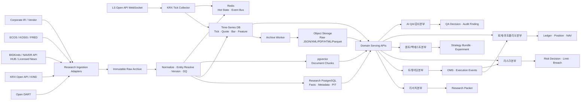

# 헤지펀드 전사 데이터 소스 및 부서별 라이브러리 설계서

> 문서 상태: Company Data Stack v1.2  
> 최상위 기준: [HEDGE_FUND_MASTER_PLAN.md](../HEDGE_FUND_MASTER_PLAN.md)  
> 조사 기준일: 2026-07-29  
> 적용 대상: CEO, Agent Workforce 인사팀, 6개 본부와 공통 Data Platform  
> 확정 사항: 전사 업무 DB는 Supabase, 국내 가격·체결·호가는 LS증권 Open API, 리서치·퀀트 시장 시계열은 별도 TimescaleDB 사용  
> 기준 구현: [traderjaeil-lgtm/krx-tick-collector](https://github.com/traderjaeil-lgtm/krx-tick-collector)  
> 상세 기준: [DATA_GOVERNANCE_GUIDE.md](DATA_GOVERNANCE_GUIDE.md), [TECH_STACK_DECISIONS.md](../02-engineering/TECH_STACK_DECISIONS.md)

---

## 1. 문서 목적

이 문서는 가격 데이터 수집기를 다시 설계하는 문서가 아니다. 가격 Plane은 `LS증권 Open API -> KRX Tick Collector -> 시계열 DB + Redis`로 고정한다. 여기에 리서치본부가 수집할 외부 데이터와 트레이딩·리스크·퀀트·회계·QA·인사 업무에서 생성되는 내부 데이터를 연결해, 전 부서가 어떤 데이터를 수집·참조·생성하는지 정의한다.

구체적으로 다음을 결정한다.

1. 리서치본부가 종목을 분석하려면 가격 외에 어떤 데이터가 필요한가?
2. 각 데이터는 어떤 공식 API 또는 계약형 Vendor에서 가져오는가?
3. 얼마나 자주 수집하고 어느 저장소에 보관하는가?
4. 어떤 Python 라이브러리로 수집·파싱·중복 제거·RAG 처리를 구현하는가?
5. 무료 Trial 데이터와 실제 서비스용 Production 데이터의 경계는 무엇인가?
6. Agent가 데이터를 직접 수집하지 않고 어떤 Tool을 통해 조회하게 할 것인가?
7. 각 부서는 어떤 Data Product를 읽고 어떤 공식 데이터를 새로 생성하는가?
8. 수치 계산과 상태 변경에 어떤 결정론적 라이브러리와 서비스를 사용할 것인가?

### 1.1 핵심 결론

- 가격·체결·호가의 Primary Source는 [LS증권 Open API](https://openapi.ls-sec.co.kr/)다.
- 현재 기준 시계열 DB의 우선안은 수집기와 동일한 **별도 TimescaleDB**다. Supabase PostgreSQL 17의 TimescaleDB Extension에 종속하지 않고 `MarketDataRepository` Interface를 유지한다.
- 모든 Tick을 RAG나 Supabase에 넣지 않는다. Agent는 Raw Tick이 아니라 Feature/Snapshot API를 조회한다.
- 공시·재무·기업 기본정보는 [OpenDART](../06-integrations/opendart/README.md)를 P0 Source로 사용한다.
- 거래소 통계·지수·증권상품·파생상품 Reference는 [KRX Data Marketplace Open API 전체 참조](../06-integrations/krx-openapi/README.md)를 기준으로 검토한다. 공개 약관의 비상업 목적과 제3자 제공 제한 때문에 별도 상업 이용 계약이 확인되기 전에는 연구·내부 검증 Source로만 취급한다.
- 한국 거시지표는 [한국은행 ECOS](https://ecos.bok.or.kr/api/)와 [KOSIS Open API](https://kosis.kr/openapi/index/index.jsp)를 사용한다.
- 뉴스는 기사 검색 결과만 저장하는 것으로 끝내지 않는다. Story 중복 제거, 원출처, 게시·최초 관측 시각과 본문 저장 권한을 함께 관리한다.
- 무료 뉴스 API와 Website Scraping은 서비스 단계에서 그대로 사용할 수 있다고 가정하지 않는다. 본문 저장, RAG, 재배포와 모델 입력 권한을 계약별로 확인한다.
- 컨센서스·추정치·정제 재무·산업 분류는 무료 Source의 공백이 크므로 P1 이후 별도 Vendor 계약 후보로 관리한다.
- 외부 시장·공시·뉴스·거시 데이터는 중앙 Data Plane이 한 번만 수집하고, 각 본부 Agent는 승인된 Domain API로 참조한다.
- 트레이딩은 주문·체결, 리스크는 Risk Decision·Breach, 퀀트는 Dataset·Experiment, 회계는 Ledger·NAV, QA는 Trace·Finding, 인사팀은 Agent Profile·Eval의 데이터 Owner다.
- CEO와 본부장 Hermes는 원시 DB에 직접 연결하지 않는다. 본부별 Read Model과 구조화된 Artifact만 읽는다.

### 1.2 팀별 구현 가이드

| 담당자 | 담당 조직 | 구현 가이드 |
|---|---|---|
| 재일님 | 리서치본부 + 퀀트/백테스트본부 | [TEAM_JAEIL_RESEARCH_QUANT_GUIDE.md](../05-teams/TEAM_JAEIL_RESEARCH_QUANT_GUIDE.md) |
| 도현님 | 트레이딩본부 + 회계/포트폴리오본부 | [TEAM_DOHYUN_TRADING_ACCOUNTING_GUIDE.md](../05-teams/TEAM_DOHYUN_TRADING_ACCOUNTING_GUIDE.md) |
| 동규님 | 리스크본부 + AI QA/감사본부 | [TEAM_DONGGYU_RISK_QA_GUIDE.md](../05-teams/TEAM_DONGGYU_RISK_QA_GUIDE.md) |
| 영주님 | CEO Agent + Agent Workforce 인사팀 | [TEAM_YOUNGJU_CEO_HR_GUIDE.md](../05-teams/TEAM_YOUNGJU_CEO_HR_GUIDE.md) |

### 1.3 Strategy Universe와 데이터 연결

전략은 이름이 아니라 필요한 Data Product의 조합으로 등록한다. 아래 데이터가 준비되면 해당 전략군을 Research Catalog에 넣을 수 있으며, 거래 기능과 Risk Gate까지 준비돼야 Paper 또는 Live로 승격한다.

| 전략군 | 현재 또는 계획 Data Product | 추가 확보가 필요한 데이터 |
|---|---|---|
| Equity Long/Short·Factor | Tick, Quote, Bar, DART 재무, Sector, 수급 | 실시간/계약형 Borrow Availability와 Borrow Fee |
| Market Neutral·Pairs | 동기화 Bar, Factor, Sector, Corporate Action | 안정적 Borrow, Crowding과 Basket Cost |
| Event Driven | DART/KIND/KRX 공시, News Story, Corporate Action | Deal Terms, 합병 조건, 일정과 상태 변경 Feed |
| Momentum·Mean Reversion | Tick, Quote, Bar, Volatility, Liquidity Feature | 전략 Horizon별 정확한 Cost/Impact Model |
| ETF·Index Relative Value | ETF 가격, 구성종목, Index, NAV/iNAV 후보 | Creation/Redemption Basket과 실시간 기준가 사용권 |
| Futures Trend·Basis·Spread | Futures Trade/Quote, Contract Master, Curve, Settlement | Margin, Roll, Open Interest와 FCM 상태 |
| Macro·Managed Futures | ECOS/KOSIS, Index·FX·Rate·Commodity Futures | 해외 시장 Calendar와 계약형 실시간 Feed |
| Options·Volatility | Option Chain, Underlying, Rate/Dividend, IV/Greeks | Surface 품질, Margin, Exercise/Assignment와 Multi-leg Quote |
| News/Sentiment | 중복 제거 Story, 원출처, 게시·수신 시각, Entity | 본문 저장·LLM 입력 사용권과 Source 신뢰도 |
| Multi-Strategy Allocation | Strategy Return, Exposure, Capacity, Correlation, Drawdown | 공통 Valuation 시각과 Stress Correlation |

Credit, Convertible, Private Market, Real Estate, Digital Asset와 OTC 전략은 필요한 Data Product와 거래·보관 경로가 정의되기 전까지 `UNSUPPORTED`로 남긴다. 공개 데이터 몇 개를 수집했다는 이유만으로 지원 전략으로 표시하지 않는다.

모든 `StrategyVersion`은 `required_data_product_ids`를 가지며, Data Catalog는 각 항목의 Owner, License, PIT 지원 여부, Freshness와 Environment Entitlement를 반환한다.

---

## 2. 기준 가격 수집기 분석

참고 저장소는 LS증권 Open API WebSocket으로 한국 주식 전 종목의 체결과 10단계 호가를 받아 TimescaleDB에 적재하고 Redis로 실시간 중계한다. README 기준 약 2,600개 종목, 체결 약 1,500만 행과 호가 약 2,200만 행/일 규모를 전제로 한다.

### 2.1 현재 구조에서 그대로 가져갈 부분

| 구성 | 현재 역할 | 우리 시스템 적용 |
|---|---|---|
| LS Open API WebSocket | 체결·호가 실시간 수신 | 국내 Market Data Primary Adapter |
| `ticks` | 가격, 수량, 체결 방향, 시장, OFI | Microstructure와 Bar 원천 |
| `quotes` | 10단계 가격·잔량, Spread, Imbalance | Liquidity와 Execution Feature 원천 |
| `market_regime` | 지수, 상승·하락 종목 수, 수급 | 전 종목 Market Breadth 입력 |
| Ring Buffer + Batch Insert | 초당 다량 Event 적재 | 그대로 유지하되 Metric 추가 |
| Redis Publish | 전략·Dashboard 실시간 소비 | Feature/Event Bus로 사용 |
| Collector Sharding | 계정·Session 한도 대응 | 종목 Hash 기반 Shard와 Lease 관리 |
| 자동 재접속·Token 갱신 | 장시간 연결 안정화 | Feed Health State Machine으로 확장 |
| TimescaleDB Hypertable | 고빈도 시계열 저장 | 시계열 Source of Truth |

### 2.2 반드시 보강할 부분

#### 장기 Archive

참고 수집기는 README 기준 7일 후 압축, 90일 후 삭제 정책을 예시로 사용한다. Paper Trading만 보면 충분할 수 있지만 장기 Backtest와 Replay에는 부족하다.

```text
TimescaleDB Raw Tick/Quote
  -> 일별 Completeness와 Sequence Gap 검증
  -> Parquet Export
  -> Object Storage Immutable Archive
  -> Row Count/Min-Max/Hash Manifest 검증
  -> Archive 성공 후에만 Timescale Retention 허용
```

권장 보존 구조:

- TimescaleDB: 최근 30~90일 Hot Raw와 장기 Continuous Aggregate
- Parquet/Object Storage: 전체 Raw History와 정정 Version
- DuckDB: 연구자가 Parquet를 조회하는 Local/Batch Query
- Timescale Continuous Aggregate: 1초, 10초, 1분, 5분 Bar와 Microstructure Summary

#### 표준 Event ID와 중복 방지

```text
source_event_id = hash(
  provider,
  channel,
  market,
  symbol,
  exchange_time,
  sequence_or_payload_identity
)
```

재접속·재구독으로 같은 Event가 다시 수신돼도 `source_event_id` 또는 공급자 Sequence로 멱등 적재해야 한다.

#### Data Quality Metric

- Shard별 마지막 수신 시각과 Event Rate
- 종목별 Sequence Gap과 장중 공백
- Exchange Time 대비 Received Time 지연
- 음수·0 가격, 비정상 Tick Size와 Price Limit 위반
- 호가 단계 정렬, Bid/Ask Cross와 잔량 오류
- KRX/NXT 시장 구분과 통합시세 중복
- DB Batch 실패, Ring Buffer 사용률과 Drop Count
- Redis Publish 실패와 Consumer Lag
- Timescale Row Count와 Parquet Archive Row Count 비교

#### Instrument Master 연결

수집기의 종목코드를 장기 Primary Key로 사용하지 않는다. 모든 Tick과 Quote에는 내부 `instrument_id`를 연결하고 공급자 코드는 유효기간이 있는 Mapping으로 관리한다.

```text
instrument_id
provider = LS
provider_symbol
market = KRX | NXT
valid_from
valid_to
mapping_version
```

#### Agent 접근 제한

Hermes와 LangGraph Agent가 `ticks`나 `quotes`를 직접 대량 조회하지 않는다. 다음 Tool만 제공한다.

- `market.get_snapshot(symbol, as_of)`
- `market.get_bars(symbol, interval, start, end)`
- `market.get_microstructure(symbol, window)`
- `market.get_market_breadth(as_of)`
- `market.get_data_quality(symbol_or_shard)`

---

## 3. 목표 전사 Data Architecture



### 3.1 저장소 역할 분리

| 저장소 | 넣을 데이터 | 넣지 않을 데이터 |
|---|---|---|
| 별도 TimescaleDB | Tick, Quote, Bar, Market Breadth와 고빈도 Market Feature | 뉴스 본문, Macro Revision, 주문, Risk, 원장, Agent Memory |
| PostgreSQL/Supabase | Instrument/Issuer, DART Mapping, Financial Fact, Document Metadata, Corporate Action, Source/License | 초고빈도 Tick 전체 |
| Object Storage | 원본 JSON/XML/HTML/PDF, XBRL, Parquet, Dataset Manifest | Hot Query State |
| pgvector | 권한이 확인된 Document Chunk Embedding | 유일한 원문 사본, 가격 Tick |
| Redis | 최신 Quote/Feature, Event Queue, Dedup/Cooldown, Job Lease | 영구 Source of Truth |

시계열 DB를 사용한다고 해서 모든 Research 데이터를 시계열 Table에 넣지 않는다. 공시와 재무는 Revision, Entity, Report와 계정과목 관계가 중요하므로 관계형 Metadata Store가 필요하다. 원문은 Object Storage, 검색 Vector는 pgvector에 둔다.

---

## 4. 수집해야 하는 데이터 전체 목록

### 4.1 P0: 리서치 서비스 시작에 반드시 필요한 데이터

| Domain | 세부 데이터 | 우선 Source | 수집 주기 | 저장 위치 | 담당 Agent |
|---|---|---|---|---|---|
| 실시간 시장 | 전 종목 체결, 10단계 호가, 시장 구분 | LS Open API | 실시간 | 시계열 DB + Redis + Parquet | RES-02/03/04 |
| 시장 상태 | 거래정지, VI, 장 상태, 가격 제한 | LS + KRX | 실시간/변경 시 | 시계열 + PostgreSQL | RES-01/02 |
| 지수·Breadth | KOSPI/KOSDAQ, 상승·하락, 거래대금 | LS + KRX | 실시간/일별 | 시계열 DB | RES-07 |
| Instrument Master | 종목코드, 시장, 상장상태, 종목명 | LS + KRX + DART | 장전/일별 | PostgreSQL | RES-01/02 |
| 공시 목록·원문 | 정기·수시·주요사항·지분 공시 | Open DART | 30~60초 Poll/증분 | PostgreSQL + Object Storage | RES-05/06/08 |
| 기업 개황 | 법인명, 대표, 업종, 주소, 홈페이지 | Open DART | 일별/변경 시 | PostgreSQL | RES-05/08 |
| 재무제표 | BS/IS/CF, 주요계정, XBRL 원문 | Open DART | 공시 Event | PostgreSQL + Object Storage | RES-05 |
| 기업 Event | 배당, 증자, 분할, 자사주, 합병, 주요주주 | DART + KRX | Event | PostgreSQL | RES-05/06 |
| 뉴스 Metadata | 제목, 언론사, URL, 게시시각, Snippet | BIGKinds/API 계약 Source | 30초~2분 | PostgreSQL | RES-06 |
| 뉴스 Story | 중복 Cluster, 원출처, Entity, Novelty | 내부 처리 | Event | PostgreSQL + pgvector | RES-06/08 |
| Social Insight | 승인 계정의 Post ID, 작성자, 게시·관측 시각, 종목·주제 연결 | X API 승인 Watchlist | 준실시간 | PostgreSQL + 권한별 RAG | RES-06/08 |
| 국내 거시 | 기준금리, 국고채, 환율, 물가, 통화, 산업 | ECOS + KOSIS | 발표 일정/일별 | 시계열 + PostgreSQL | RES-07 |
| 거래 Calendar | 거래일, 휴장, Session | KRX + `exchange-calendars` 보조 | 월간/공지 시 | PostgreSQL | RES-01/02 |

Open DART는 공시검색, 기업개황, 원문파일, 고유번호와 XBRL 기반 재무제표 API를 제공한다. 공시 `rcept_no`, 정정 여부와 최초 관측 시각을 반드시 보존한다. Open DART 안내에는 일반적인 요청 제한 관련 오류도 정의되어 있으므로 한도를 코드에 고정하지 말고 Source Registry Config로 관리한다.

### 4.2 P1: 분석 품질을 높이는 데이터

| Domain | 세부 데이터 | 후보 Source | 수집 주기 | 주의사항 |
|---|---|---|---|---|
| KRX 통계 | 일별 시세, 지수, ETF/ETN, 채권, 파생상품 | KRX Open API | 일별 | API 제공 항목과 이용약관 확인 |
| 투자자 수급 | 외국인·기관·개인 매매, 프로그램 매매 | LS/KRX 제공 범위 | 실시간/일별 | 시장·종목 집계 의미 분리 |
| 공매도 | 공매도 거래량·잔고·과열종목 | KRX | 일별/Event | 발표 지연과 기준일 기록 |
| ETF 구성 | 구성종목, 비중, CU, Tracking 대상 | KRX/운용사 | 일별 | 운용사별 Format Adapter 필요 |
| 기업 IR | 실적자료, Presentation, IR 일정 | KIND/기업 IR Website | 5~15분/Event | Source Allowlist와 원문 사용권 |
| 정책·규제 | 금융위·금감원·거래소·한국은행 발표 | 기관 RSS/API/Website | Event | 문서 Version과 시행일 분리 |
| Global Macro | 미국 금리·물가·고용·유동성 | FRED/ALFRED | 발표 일정 | Vintage/Revisions 보존 |
| 산업 통계 | 생산, 재고, 수출입, 지역·산업 지표 | KOSIS/공공데이터포털 | 일·월·분기 | 단위·계절조정·Revision 기록 |
| Governance/ESG | 지배구조, 밸류업, ESG 공시 | DART/KRX | Event/연간 | 평가 점수와 원자료 분리 |
| X 유명 인사 Watchlist | 정책 당국자, 기업 경영진·IR, 펀드매니저, 산업 전문가의 공개 Post | X API Filtered Stream | 준실시간 | 승인 계정만 수집하고 단독 거래 근거로 사용 금지 |

[FRED API](https://fred.stlouisfed.org/docs/api/fred/overview.html)는 Series와 Release 단위 조회를 제공하고, ALFRED/Vintage Date를 통해 과거 시점의 값과 Revision을 다룰 수 있으므로 Global Macro Backtest에 적합하다.

### 4.3 P2: 계약 검토 후 도입할 데이터

| Domain | 필요한 이유 | 후보 | 도입 조건 |
|---|---|---|---|
| Analyst Consensus | 실적 Surprise, 추정치 Revision, 목표가 분포 | FnGuide 또는 계약형 Vendor | 기계 수집·DB 저장·모델 입력 권한 계약 |
| 표준 산업 분류 | Peer, Sector Neutral 전략, Supply Chain | KRX + Vendor Classification | 과거 분류 Version 제공 |
| Earnings Transcript | 경영진 어조, Guidance 변화 | 기업 IR 또는 계약형 Transcript Vendor | 본문 저장·Embedding 권한 |
| 신용·채권 | Spread, 등급, 차환 Risk | 평가사·채권 Vendor | 재배포와 파생 Feature 권한 |
| 대차·Borrow | 공매도 Capacity와 비용 | Broker/Prime/Vendor | Account별 사용권과 지연 정의 |
| Search Trend | 소비자 관심과 Narrative 변화 | NAVER API HUB 등 | API 지속성, 표본 편향과 상업 이용 검토 |
| Supply Chain | 고객·공급자 관계, 수출입 Exposure | Vendor/공개 기업자료 | Entity 정확도와 시점 정보 |

FnGuide DataGuide는 재무·주가·컨센서스 등 전문 데이터를 제공하지만, [공식 이용 안내](https://help-dataguide.fnguide.com/ko/articles/%EC%9D%B4%EC%9A%A9-%EB%B0%8F-%EC%9A%94%EA%B8%88-%EC%95%88%EB%82%B4-48b18a4b)에는 일반 DataGuide 데이터를 기계적으로 대량 추출하거나 DB 구축에 활용하는 행위를 제한한다고 명시되어 있다. Excel 구독을 자동화하지 말고 별도 API/Data Feed와 내부 DB·모델 사용 권한을 계약해야 한다.

---

## 5. Source별 채택 지침

### 5.1 LS증권 Open API

**결정:** 가격·체결·호가의 확정 Source.

사용 범위:

- 국내 주식 실시간 체결과 호가
- KRX/NXT 시장 구분
- 지수와 제공 가능한 시장 수급
- 향후 국내 선물·옵션 및 해외선물 시세
- 주문·계좌 API는 Market Data Credential과 분리

공식 Open API 사이트는 주식시세, 주식계좌, 국내파생 시세·계좌와 해외선물 범주를 제공한다. 실제 TR Code, Session, 구독 한도와 재배포 조건은 로그인 후 최신 가이드 및 계약을 기준으로 `ls_capability_registry`에 Version 관리한다.

### 5.2 Open DART

**결정:** 공시·기업·재무의 P0 Source.

구현 시 85개 API의 URL, 요청 인자와 응답 필드는 [OpenDART Open API 전체 참조](../06-integrations/opendart/README.md)를 기준으로 사용한다.

우선 구현 Endpoint 범주:

1. 고유번호 파일: `corp_code <-> stock_code` Mapping
2. 공시검색: 증분 `rcept_no` 수집
3. 기업개황
4. 공시서류 원본파일
5. 단일·다중회사 주요계정
6. 단일회사 전체 재무제표
7. XBRL 원본파일과 Taxonomy
8. 주요사항·지분·증권신고서 정보

수집 규칙:

- `rcept_no`를 불변 Document Key로 사용한다.
- 정정공시는 기존 Row Update가 아니라 새 Version과 Relation으로 저장한다.
- 연결/별도, 보고서 코드, 사업연도와 통화·단위를 Key에 포함한다.
- 재무 수치는 `published_at`과 시스템 `observed_at` 이후에만 Backtest에서 사용한다.
- 원본 ZIP/XML/XBRL을 Object Storage에 먼저 저장한 뒤 파싱한다.

### 5.3 KRX Open API와 KIND

**결정:** KRX Open API는 거래소 Reference와 일별 통계 Source로 사용하고, KIND는 시장조치와 DART에 없는 거래소 고유 공시의 보완 Source로 검토한다. KRX Open API의 Production 사용은 별도 이용권 확인 전 보류한다.

[KRX Open API 전체 개발 참조](../06-integrations/krx-openapi/README.md)는 공식 화면에서 확인한 지수 5개, 주식 8개, 증권상품 3개, 채권 3개, 파생상품 6개, 일반상품 3개와 ESG 3개 등 총 31개 API의 요청·응답 계약을 정리한다. 이 데이터는 LS증권 WebSocket을 대체하는 실시간 Feed가 아니라 종목기본정보, 거래소 일별 통계, EOD 대사와 Quant Dataset을 보강한다. 미제공 데이터는 Website 내부 호출을 역공학하지 않는다.

공개 약관상 비상업적 이용, KRX 정보의 제3자 제공 금지, 화면 출처 표시와 키당 일 10,000회 제한이 적용된다. 따라서 상업 서비스, 사용자 결과 노출, 모델 학습·임베딩과 파생 데이터 제공 범위는 KRX와 별도 확인하고, 계약 승인 전에는 Production Source로 승격하지 않는다.

[KIND](https://kind.krx.co.kr/common/JLDDST35000.html)는 거래소 고유 수시·공정·자율 공시, 투자유의사항, IR 자료와 상장법인 정보를 제공한다. 안정적인 공식 API나 계약 Feed가 없는 항목은 Production 자동 Scraping 대상으로 확정하지 않고 Source Owner와 수집 허용 방식을 확인한다.

### 5.4 뉴스: BIGKinds, NAVER API HUB와 계약형 Vendor

**초기 검증안:** BIGKinds API 신청 + NAVER API HUB 검토 + 기업/기관 공식 Source.

BIGKinds는 국내 언론 기사 DB와 뉴스 분석 정보를 제공하고 Open API 신청 화면을 운영한다. 다만 [BIGKinds FAQ](https://www.bigkinds.or.kr/news/faqList.do?page=2)는 저작권 보호를 위해 뉴스 다운로드 본문이 첫 200자로 제한될 수 있음을 안내한다. API 승인 범위와 별개로 다음 권한을 구분해야 한다.

- 검색과 링크 저장
- Snippet 저장
- 본문 전문 저장
- Embedding과 LLM Context 사용
- 장기 Archive
- 내부 사용자 표시
- 외부 고객 재배포

NAVER Search API는 2026년 7월 기준 전환기다. [NAVER 공식 공지](https://developers.naver.com/notice/article/32530)에 따르면 Search API는 NAVER API HUB로 이관되며 기존 개발자센터 신규 신청과 기존 지원 종료 일정이 정해져 있다. 신규 구현은 과거 Endpoint에 강하게 결합하지 않고 `NewsSearchProvider` Adapter로 분리한다.

Production에서는 뉴스 Vendor가 다음을 제공하는지 계약 전에 확인한다.

- 안정적인 Document ID와 수정·삭제 Event
- Published/Updated Time
- 원출처와 Syndication Relation
- 전문 저장과 내부 검색 권한
- Embedding/LLM 처리 허용 여부
- 호출 한도, 지연 SLO와 Historical Backfill

### 5.5 X Social Insight Watchlist

**결정:** 서비스에서 말하는 "팔로우"는 X 계정에 자동 Follow 요청을 보내는 기능이 아니라, 리서치본부가 승인한 공개 계정을 내부 Watchlist에 등록해 관찰하는 기능이다. X 계정의 실제 Follow/Unfollow는 사용자 동의가 필요한 별도 Write Action이므로 Collector가 수행하지 않는다.

초기 계정 범주는 다음과 같다.

- 중앙은행·정부·감독기관의 공식 계정과 정책 당국자
- 상장사 공식 계정, CEO·CFO·IR 책임자
- 검증된 펀드매니저, Short Seller, Macro·Sector 투자자
- 금융 기자, 거래소·연구기관과 산업 전문가

유명세만으로 계정을 채택하지 않는다. `social_source_accounts` Registry에서 `platform_user_id`, 현재 Handle, 계정 범주, 연결 기업·산업, 언어, 신뢰 Tier, 승인자, 활성 기간, 수집 목적과 License Scope를 Version 관리한다. Handle 변경에 대비해 Platform User ID를 식별자로 사용하고, 실명·소속 연결은 공개 정보에 근거해 검토한다.

[X Filtered Stream](https://docs.x.com/x-api/posts/filtered-stream/introduction)은 `from:` 사용자 규칙을 포함한 Filter Rule로 일치 Post를 준실시간 전달한다. 구현은 공식 X API만 사용하며 다음 구성으로 제한한다.

```text
Approved Social Account Registry
  -> X Filter Rule Builder (`from:user`, 언어·Repost 제외 규칙)
  -> Persistent Filtered Stream + reconnect/backoff
  -> Raw Envelope + observed_at
  -> Entity/Cashtag/Topic Linker
  -> Social Story Dedup + Claim Classifier
  -> Evidence QA와 News/DART/Market 교차 검증
  -> Point-in-Time RAG 또는 Investment Case Trigger
```

Post는 `UNVERIFIED_SOCIAL` Evidence로 시작한다. 원문 주장, 작성자의 의견, 타인 인용과 추측을 분리하고, 단일 Post만으로 Order Intent나 Strategy Promotion을 만들지 않는다. 다음 중 하나 이상으로 확인된 경우에만 `CORROBORATED_SOCIAL`로 승격한다.

- DART·거래소·기업 IR 등 1차 자료 확인
- 독립된 승인 뉴스 Source의 동일 사실 보도
- 해당 주장과 시간상 일치하는 시장·수급 Event와 Analyst 검토

최소 저장 필드는 `platform_post_id`, `author_user_id`, `created_at`, `observed_at`, `matching_rule_ids`, `entity_ids`, `claim_type`, `verification_status`, `source_url`, `content_hash`, `edit_or_delete_status`다. 본문, Embedding과 장기 Archive는 승인된 X 이용 범위에서만 저장한다. [X Developer Policy](https://docs.x.com/developer-terms/policy)에 따라 수정·삭제·비공개 전환을 반영하는 Compliance Sync와 Tombstone 처리를 운영하고, 외부 재배포는 Post/User ID 중심으로 제한한다. 삭제된 본문은 Backtest 재현을 이유로 보존하지 않는다.

도입 Gate:

1. X Developer Access, 예상 호출량·비용과 상업적 내부 분석 사용 범위를 확인한다.
2. 계정 승인·정기 재검토·비활성화 Workflow를 만든다.
3. Filter Rule 수, 연결 상태, 지연, 누락과 Rate Limit을 관측한다.
4. 수정·삭제 Compliance Sync와 RAG 삭제 전파를 검증한다.
5. Social 단독 주문 금지와 Evidence QA 교차 검증을 E2E Test로 고정한다.

### 5.6 ECOS, KOSIS와 FRED/ALFRED

**결정:** 국내 Macro는 ECOS/KOSIS, 국제 Macro는 FRED/ALFRED부터 시작한다.

수집 대상 예시:

- 한국은행 기준금리, 국고채·회사채 금리, 원/달러 환율
- 통화량, 예금·대출, 신용, 국제수지
- CPI/PPI, 고용, 산업생산, 재고, 수출입
- 미국 정책금리, Treasury Yield, CPI/PCE, 고용, Credit Spread

KOSIS Open API는 통계목록, 통계자료, 대용량 통계, 설명자료와 주요지표 등을 JSON/SDMX 등으로 제공한다. 호출 제한과 Cell 제한은 변경될 수 있으므로 Runtime Config로 관리한다.

Macro 데이터는 단순 `(date, value)`로 저장하지 않는다.

```text
series_id
observation_period
value
unit
frequency
seasonal_adjustment
published_at
observed_at
vintage_date
revision_number
source_release_id
```

### 5.7 기업 IR와 공식 Website

기업 실적자료와 Presentation은 DART 첨부, KIND IR 자료실 또는 회사 공식 IR Domain을 Source Registry에 등록해 수집한다.

허용 조건:

- Domain Allowlist와 명시적 이용정책 검토
- 낮은 Rate와 `robots.txt` 존중
- 원본 URL, 응답 Header, 수집 시각과 Content Hash 기록
- JavaScript Rendering은 필요한 Source에만 Playwright 사용
- 페이지 구조 변경 시 Parser가 조용히 빈 문서를 만들지 않고 Quarantine

무작위 Web Crawling 결과는 Production-authorized Evidence로 사용하지 않는다.

---

## 6. 전사 부서별 데이터와 라이브러리

### 6.1 수집·참조·생성의 구분

부서가 데이터가 필요하다는 이유만으로 각자 같은 API를 호출하거나 자체 Table을 만들지 않는다. 모든 데이터 요구는 다음 세 가지로 분류한다.

| 구분 | 의미 | 실행 주체 | 예시 |
|---|---|---|---|
| `COLLECT` | 외부 시스템에서 새 원천을 받아 원본과 관측 시각을 보존 | 결정론적 Collector/Adapter | LS 시세, DART 공시, Broker 체결·잔고 |
| `REFERENCE` | 이미 적재된 Data Product를 시점·권한 조건에 맞게 조회 | Domain Serving API | 최신 호가, Research Packet, Position, Risk Limit |
| `CREATE` | 부서 업무 결과를 새로운 공식 Artifact로 기록 | 부서 Service 또는 승인 Workflow | Order Intent, Risk Decision, Dataset Manifest, NAV |

운영 원칙:

1. 외부 시장·공시·뉴스·거시 데이터는 중앙 Data Platform이 한 번만 `COLLECT`한다.
2. Agent는 Vendor API Key, Collector Credential과 Raw DB Write 권한을 갖지 않는다.
3. 부서별 계산 서비스만 자기 Domain Table에 쓰고, 다른 부서는 API 또는 Event로 `REFERENCE`한다.
4. 외부 데이터의 Source Owner와 내부 Artifact의 Business Owner를 분리한다.
5. 모든 공식 산출물은 `as_of`, `observed_at`, `source_ids`, `schema_version`, `producer_id`, `trace_id`를 가진다.
6. LLM은 설명·가설·예외 분류를 담당할 수 있지만 주문 상태, Risk 수치, Ledger와 NAV 계산은 결정론적 코드가 담당한다.

### 6.2 전사 Data Ownership 요약

| 조직 | 외부 데이터 수집 책임 | 주로 참조하는 Data Product | 새로 생성·소유하는 공식 데이터 |
|---|---|---|---|
| CEO Office | 없음 | Mandate, Research/Risk 요약, Portfolio/NAV, Strategy Registry, Incident | Mandate Version, Capital Priority, Committee Decision, Escalation |
| Agent Workforce 인사팀 | 없음 | Queue/SLA, Agent 품질·비용, QA Finding, Tool 권한 | Agent Profile, Skill Manifest, Eval Result, Hiring/Lifecycle Case |
| 리서치본부 | 시장·공시·뉴스·거시·기업 IR의 Source Owner | Raw/Normalized Market, Document, Fact, Macro | Feature, Event, Research Packet, Evidence Bundle |
| 트레이딩본부 | Broker/OMS Adapter의 주문 응답·체결 Event만 운영 연계 | Research Packet, Strategy Signal, Market Snapshot, Position, Limit | Trade Case, Order Intent, Execution Plan, TCA |
| 리스크본부 | 규정·Restricted List·Counterparty Policy의 통제 Source Owner | 주문, Position, 가격, 유동성, Exposure, Margin, DQ | Risk Snapshot, Risk Decision, Breach, Stress Result |
| 퀀트/백테스트본부 | 별도 외부 수집 없음 | PIT Snapshot, Archive, Feature, Fill/TCA, Portfolio Outcome | Dataset Manifest, Experiment Run, Model Artifact, Strategy Bundle |
| 회계/포트폴리오본부 | Broker Statement, Cash/Margin/Settlement 및 Corporate Action 확인 | Order/Fill, 가격, Fee/Tax Rule, Fund/Book Master | Ledger, Official Position/Cash, Reconciliation, PnL, NAV |
| AI QA/감사본부 | 시스템 Trace·보안·배포·권한 Log 수집 | 전 본부 Artifact와 Lineage, Model/Prompt/Dataset Version | QA Decision, Eval Result, Audit Finding, Incident/Postmortem |

`리서치본부가 수집 책임을 가진다`는 말은 리서치 Agent가 직접 Crawling한다는 뜻이 아니다. Data Platform의 Collector와 Parser를 리서치 Data Steward가 업무적으로 소유하고, 실제 실행은 독립 Worker가 담당한다.

#### 6.2.1 Data Product별 System of Record

| Data Product | 공식 저장소 | Write 주체 | 주요 조회 부서 |
|---|---|---|---|
| Raw Tick/Quote와 Bar | TimescaleDB, 검증 후 Parquet Archive | Market Collector/Archive Worker | 리서치, 퀀트; Agent는 집계 API만 사용 |
| 최신 Market Snapshot/Feature | Redis Hot State + TimescaleDB | Feature Worker | 리서치, 트레이딩, 리스크, 회계 |
| Instrument/Issuer/Calendar/Corporate Action | Supabase PostgreSQL | Reference Collector/Steward Service | 전 본부 |
| 공시·재무·뉴스·거시 Metadata/Fact | Supabase PostgreSQL | Research Normalizer | 리서치, 퀀트, 트레이딩, QA |
| 원문·XBRL·PDF·Dataset | Object Storage + Manifest | Collector/Archive Worker | 권한이 있는 리서치, 퀀트, QA |
| RAG Chunk/Embedding | pgvector, 원문은 Object Storage | Document Processor | 리서치, 트레이딩, QA |
| Strategy/Signal/Deployment State | Supabase PostgreSQL Strategy Registry | Strategy Service/Release Workflow | CEO, 트레이딩, 리스크, 퀀트, QA |
| Order/Ack/Fill/Reject | PostgreSQL OMS Event Store + Redis Projection | OMS/Execution Service | 트레이딩, 리스크, 회계, QA |
| Risk Limit/Decision/Breach | Supabase PostgreSQL Risk Schema; 최신 상태는 Redis, 주기·사건 Snapshot만 PostgreSQL | Risk Engine/Policy Service | CEO, 트레이딩, 회계, QA |
| Dataset/Experiment/Model Artifact | P0 PostgreSQL + Object Storage, P1 MLflow Metadata + Object Storage | Quant Runner/Registry | 퀀트, 리스크, QA, CEO 요약 |
| Journal/Position/Cash/PnL/NAV | Supabase PostgreSQL의 별도 Accounting Schema | Ledger/Valuation/NAV Service | 회계, CEO, 리스크, 트레이딩 Read Model, QA |
| Trace/Metric/Finding/Incident | Telemetry Backend + PostgreSQL Audit Store + Object Archive | Audit Collector/QA Workflow | QA, CEO, 인사, 해당 본부장 |
| Agent Profile/Skill/Eval/Lifecycle | Supabase PostgreSQL Workforce Schema | Workforce Registry/승인 Workflow | 인사, CEO, QA, 해당 본부장 |
| Mandate/Capital/Committee Decision | Supabase PostgreSQL Governance Schema | Mandate/Committee Service | CEO, 리스크, QA, 관련 본부 |

Supabase를 사용하더라도 모든 Table을 `public` Schema에 섞지 않는다. `research`, `strategy`, `execution`, `risk`, `accounting`, `audit`, `workforce`, `governance` Schema와 Service Role을 분리하고, 부서 간 조회는 API Read Model을 기본으로 한다.

### 6.3 CEO Office

**수집 여부:** 외부 데이터를 직접 수집하지 않는다. CEO는 회사의 최종 Read Model만 참조한다.

| 필요한 데이터 | 조회 경로 | 사용 목적 | 최신성 |
|---|---|---|---|
| 사용자 Mandate, 투자 제한, 승인 정책 | `governance-api` | 목표·금지사항·승인 한계 해석 | 변경 즉시 |
| Research Packet와 투자 논거 | `research-api` | 투자위원회 안건 이해 | 사건 기준 |
| Risk Budget, Breach, Stress 요약 | `risk-api` | 자본 배분과 Escalation | 장중 실시간 |
| Fund/Book Position, Cash, PnL, NAV | `portfolio-api` | 회사 상태와 성과 확인 | Position 실시간, NAV 일일 |
| Strategy 상태와 Champion/Challenger | `strategy-registry-api` | 전략 승격·중단 심의 | Release 기준 |
| QA Block, Incident, Data Health | `audit-api` | 운영 중단·복구 의사결정 | 사건 즉시 |

권장 Runtime/Library:

- `Hermes Agent`: 사용자 대화, 전사 업무 라우팅과 장기 Mandate Context.
- `LangGraph`: 투자위원회·예외 승인처럼 중단·재개가 필요한 Workflow.
- `pydantic`: Mandate, Committee Decision과 Escalation 계약 검증.
- `httpx`: 승인된 Domain API 조회. SQL Client는 CEO Agent에 설치하지 않는다.
- `jinja2`: Daily/Weekly CIO Report의 고정 Template 렌더링.

CEO가 생성하는 `MandateDecision`과 `CapitalAllocationDecision`은 설명문만 저장하지 않고 적용 대상, 유효 시각, 이전 Version, 승인자와 만료 조건을 구조화한다.

### 6.4 CEO 직속 Agent Workforce 인사팀

**수집 여부:** 외부 투자 데이터를 수집하지 않는다. Agent Runtime과 조직 운영 데이터를 참조한다.

| 필요한 데이터 | 원천 | 사용 목적 | 인사팀 공식 Output |
|---|---|---|---|
| Agent Registry, Model/Prompt/Skill Version | Agent Registry | 현재 인력과 역량 파악 | Agent Profile Version |
| Queue Depth, SLA, Retry, 실패율 | Workflow/Telemetry | 채용·Worker 증설 판단 | Workforce Plan |
| Token, Model, Tool과 Infra 비용 | Model Gateway/Cost Ledger | 역할별 비용·효율 분석 | Budget Recommendation |
| Golden/Adversarial Eval과 QA Finding | Eval Store/Audit API | 수습·교육·비활성화 | Performance Decision |
| Tool/Data Permission과 만료 | IAM/Entitlement API | 최소 권한과 이동·퇴직 처리 | Access Change Request |
| Incident와 Human Override | Incident Store | 역할 결함·교육 수요 분석 | Remediation Plan |

권장 Runtime/Library:

- `pydantic` + `jsonschema`: Job Profile, Skill Manifest, Eval Contract 검증.
- `SQLAlchemy` + `asyncpg`: Agent Registry와 Lifecycle Case Service.
- `polars`: 본부별 SLA·비용·품질 Scorecard 집계.
- `opentelemetry-sdk` + `prometheus-client`: Agent Run과 Queue Metric 수집.
- `jinja2`: 채용 요청서, 수습 결과와 성과 개선 계획 생성.

인사팀은 RAG 품질 점수를 직접 재계산하지 않고 AI QA/감사본부의 독립 Eval 결과를 참조한다. 인사팀이 자기 후보를 Production에 직접 활성화하는 API도 제공하지 않는다.

### 6.5 리서치본부

**수집 여부:** 전사 외부 투자 데이터의 업무 Owner다. 수집기는 Agent가 아니라 `market-collector`, `disclosure-collector`, `news-collector`, `macro-collector` 같은 Worker로 구현한다.

| Agent | 반드시 필요한 데이터 | 있으면 좋은 데이터 | 공식 Output |
|---|---|---|---|
| RES-01 Universe/Event Triage | Instrument Master, 거래상태, 유동성, 가격 Feature, 중요 공시·뉴스 | 관리종목, 공매도 과열, ETF 편입 | Event Priority |
| RES-02 Market Data Steward | Raw Tick/Quote, Sequence, Heartbeat, Mapping, Calendar | 공급자 비교 Feed | DQ Status |
| RES-03 Microstructure | 10단계 호가, 체결방향, OFI, Spread, Depth, Volume Curve | Auction, Broker TCA | Microstructure Note |
| RES-04 Technical | 1초~일 Bar, 거래량, 변동성, Benchmark/섹터 | 공매도·수급 | Technical Thesis |
| RES-05 Fundamental | DART XBRL, 공시, Corporate Action, 기업개황 | Consensus, 신용, Transcript | Fundamental Memo |
| RES-06 News/Sentiment | News Story, 공시, Entity, Source 신뢰도 | Search Trend, Social Aggregate | Catalyst/Story Cluster |
| RES-07 Sector/Macro | Index, Sector/Peer, 금리·환율·원자재, ECOS/KOSIS | Global Macro, Supply Chain | Regime Brief |
| RES-08 RAG Librarian | 원문, Metadata, License, Chunk, Embedding, Retraction | Knowledge Graph | Evidence Bundle |

핵심 Library 묶음:

- 수집: `httpx`, `websockets`, `tenacity`, `aiolimiter`, `feedparser`.
- 정규화: `pydantic`, `polars`, `pyarrow`, `lxml`, `beautifulsoup4`, `arelle-release`.
- 문서: `pymupdf`, `pypdf`, `trafilatura`, `PaddleOCR` 후보.
- 한국어·중복: `kiwipiepy`, `rapidfuzz`, `datasketch`.
- RAG: `sentence-transformers` 또는 Model Gateway, `pgvector`.
- 저장·조회: `SQLAlchemy`, `asyncpg`, `duckdb`, TimescaleDB SQL.

본부장 RES-00은 각 저장소를 직접 Query하지 않고 Specialist의 구조화된 Artifact를 받아 `Research Packet`을 통합한다.

### 6.6 트레이딩본부

**수집 여부:** 뉴스·공시·가격을 중복 수집하지 않는다. 주문을 실행하는 Broker가 확정되면 Broker Adapter가 주문 접수, 정정·취소, 거부, 체결과 세션 상태를 수집한다. 가격 Source가 LS로 확정된 것과 실거래 Broker 선정은 별도 결정이다.

| 필요한 데이터 | 참조 Source | 사용 목적 | 생성 데이터 |
|---|---|---|---|
| 승인된 Strategy Signal과 Version | Strategy Registry | 어떤 전략이 주문을 제안할 수 있는지 확인 | Trade Case |
| Research Packet와 Invalidation | Research API | Bull/Bear 검토와 촉매 유효성 확인 | Trading Thesis |
| 실시간 Snapshot, Spread, Depth, Volume Curve | Market API/Redis | 주문 방식·Limit·참여율 결정 | Execution Plan |
| Official Position, Cash, Pending Order | Portfolio/OMS API | 중복 주문과 과대 포지션 방지 | Order Intent |
| Risk Limit과 Trading State | Risk API | 허용 범위 안의 주문 후보만 생성 | Risk Check Request |
| Broker Ack, Fill, Reject와 Venue 상태 | OMS/Broker Adapter | 주문 상태 전이와 체결 품질 분석 | Order/Fill Event, TCA |
| Fee, Tax, Tick Size, Calendar | Reference API | 가격·수량·거래시간 유효성 검사 | Cost Estimate |

권장 Runtime/Library:

- `pydantic`, Python `decimal`: Order Intent, 수량, 가격과 통화의 정밀 계약.
- `httpx`, `websockets`, `redis`: Broker/OMS Adapter와 실시간 Event 소비.
- `polars`, `numpy`, `scipy`: Slippage, Implementation Shortfall와 TCA 분석.
- `exchange-calendars`: 거래일·장 구간 검증. LS/KRX 공식 Calendar Snapshot이 최종 기준이다.
- `cvxpy`는 P1의 제약 기반 Portfolio Construction 후보이며 Solver 결과를 Risk Gate가 다시 검증한다.
- `structlog`, `opentelemetry-sdk`: 주문 생명주기 Trace와 지연 관측.

OMS 상태 전이와 주문 전송은 LLM Tool이 아니라 결정론적 Execution Service가 독점한다. Agent는 `OrderIntent`까지만 제안한다.

### 6.7 리스크본부

**수집 여부:** 시장 데이터를 다시 수집하지 않는다. Compliance/Restricted List, Counterparty 한도와 Risk Policy는 리스크본부가 업무 Owner이며, 정식 Source와 유효 시각을 가진 Policy Registry에 적재한다.

| 필요한 데이터 | 참조 Source | 사용 목적 | 생성 데이터 |
|---|---|---|---|
| Order Intent와 현재 Pending Order | OMS API | Pre-trade 심사 | Risk Decision |
| Position, Cash, Exposure와 PnL | Portfolio API | 한도·Drawdown·Leverage 계산 | Risk Snapshot |
| 실시간 가격·호가·유동성·DQ | Market API | Mark, Liquidity와 Stale Price 검사 | Entry Block/Reduce Only |
| Historical Return, Volatility, Correlation | `market-api` Feature Endpoint | VaR, Stress와 Concentration | Stress Result |
| Instrument, Sector, Issuer, Corporate Action | Reference API | Look-through와 Concentration | Exposure Breakdown |
| Option/Futures Contract, Greeks 입력, Margin | Derivatives/Portfolio API | 파생상품·증거금 위험 | Greeks/Margin Risk |
| Mandate, Restricted List, Trading Policy | Policy Registry | Compliance와 예외 검사 | Policy Decision |
| Feed/Broker/Counterparty Health | DQ/Incident API | 운영 위험과 신규 주문 차단 | Risk Breach |

권장 Runtime/Library:

- `numpy`, `scipy`, `polars`: 수익률·분포·Scenario·Exposure 계산.
- `statsmodels`: Factor Exposure와 통계 진단의 P1 후보.
- `cvxpy`: Exposure·Turnover·Risk Budget 제약 검증과 De-risk 제안.
- `QuantLib` Python Binding: 옵션·선물 Pricing/Greeks를 도입하는 P2 후보. 상품별 검증 Fixture가 선행돼야 한다.
- `pydantic`, Python `decimal`: Limit, Policy와 Risk Decision 계약.
- `hypothesis`, `pytest`: 경계값·극단값·단위·부호 Property Test.

VaR, Greeks, Margin, Limit과 Kill Switch는 LLM이 계산하거나 변경하지 않는다. LLM Risk Agent는 결정론적 결과를 해석하고 예외를 분류하며, Limit 확대 권한은 갖지 않는다.

### 6.8 퀀트/백테스트본부

**수집 여부:** Production Source를 직접 수집하지 않는다. Data Platform이 만든 Point-in-Time Snapshot과 Immutable Archive를 사용한다.

| 필요한 데이터 | 참조 Source | 사용 목적 | 생성 데이터 |
|---|---|---|---|
| Tick/Quote/Bar와 Feature History | Timescale/Parquet Snapshot | Signal과 Execution 연구 | Feature Set |
| Instrument/Universe/Calendar Version | Reference Snapshot | Survivorship Bias 방지 | Universe Manifest |
| Financial Fact, Document Event, Macro Vintage | Research Snapshot | Fundamental·Event·Regime 전략 | PIT Dataset |
| Corporate Action와 Adjustment Factor | Reference API | 가격·수량의 경제적 연속성 | Adjusted Dataset |
| 실제 Fill, Slippage, Fee와 Rejection | TCA/OMS Archive | 현실적인 비용·Capacity 추정 | Cost Model |
| Position/PnL/Drawdown과 Risk Breach | Portfolio/Risk Archive | 운용 결과 환류 | Strategy Review |
| Model/Prompt/Code/Container Version | Registry/CI | 실험 재현 | Experiment Manifest |

권장 Runtime/Library:

- Dataset: `polars`, `numpy`, `pyarrow`, `duckdb`, `pandera`.
- 통계·ML: `scipy`, `statsmodels`, `scikit-learn`; 필요성이 입증된 뒤 `lightgbm` 또는 `xgboost` 중 하나를 ADR로 선택한다.
- Backtest: 현재 확정안인 `vectorbt`를 `BacktestEngine` Adapter 뒤에서 사용한다.
- 최적화: `cvxpy`, P1부터 `optuna`. Train/Test 기간과 Seed를 고정하고 Trial 전체를 기록한다.
- 추적·Registry: P1부터 `mlflow`로 Run, Dataset Reference, Metric, Model과 Artifact를 연결한다.
- 검증: `pytest`, `hypothesis`, `joblib`; 시간 누수·재현성·병렬 실행 검사를 자동화한다.

Notebook 결과만으로 Strategy를 배포하지 않는다. `Dataset Manifest -> Experiment Run -> Backtest Report -> Robustness Report -> Signed Strategy Bundle`이 모두 있어야 Release Gate에 제출할 수 있다.

### 6.9 회계/포트폴리오본부

**수집 여부:** Broker/은행/보관·결제 시스템에서 거래내역, 잔고, 현금, 수수료, 증거금과 Statement를 받는 Adapter의 Business Owner다. 초기 Paper 단계에서는 OMS와 Paper Broker Event를 대사한다.

| 필요한 데이터 | 참조·수집 Source | 사용 목적 | 생성 데이터 |
|---|---|---|---|
| Order, Fill, Cancel, Reject | OMS Event Store/Broker Statement | 거래 완전성·중복 대사 | Reconciliation Result |
| Broker Position, Cash, Margin, Collateral | Broker Account Adapter | 내부 장부와 외부 상태 비교 | Break Case |
| Market Close, FX, Valuation Source와 Freshness | Market/Reference API | Position 평가 | Valuation Record |
| Corporate Action, Dividend, Split, Expiry | DART/KRX/Reference API | 권리·수량·현금 반영 | Corporate Action Entry |
| Fee, Tax, Borrow, Funding Rule | Contract/Policy Registry | 비용·Accrual 계산 | Fee/Accrual Entry |
| Fund/Book/Strategy/Investor Capital | Fund Master/Ledger | 자본·성과 귀속 | Official Position/Cash |
| Risk Limit과 Margin Call | Risk/Broker API | 자금·담보 계획 | Treasury Forecast |

권장 Runtime/Library:

- Python `decimal`, `datetime`, `zoneinfo`: 금액·통화·유효 시각 계산의 기본 도구.
- `pydantic`, `SQLAlchemy`, `asyncpg`, `Alembic`: Ledger 계약·원장 Transaction·Schema 관리.
- `polars`, `pyarrow`, `duckdb`: Statement 대사, PnL Bridge와 장기 증빙 조회.
- `rapidfuzz`: Reference 문자열 불일치의 후보 탐색에만 사용하고 자동 장부 확정에는 사용하지 않는다.
- `jinja2`: NAV, PnL과 Management Report Template.
- `openpyxl`은 P1의 수동 검토용 Spreadsheet Export에만 사용하며 원장을 Excel에 두지 않는다.

Double-entry Ledger, Position, PnL과 NAV는 Event와 Journal Rule로 재계산 가능해야 한다. Agent가 SQL로 Journal을 직접 추가하거나 공식 Position을 수정하지 못하게 한다.

### 6.10 AI QA/감사본부

**수집 여부:** 투자 원천 데이터를 다시 수집하지 않는다. 대신 Agent, Model, Retrieval, Tool, Policy, Deployment, IAM과 시스템 운영 Trace를 독립 수집·보존한다.

| 필요한 데이터 | 원천 | 사용 목적 | 생성 데이터 |
|---|---|---|---|
| Claim, Citation, Retrieved Chunk와 Source Version | Research/Agent Trace | 근거·시점·인용 검증 | Evidence QA Decision |
| Prompt, Model, Parameter, Tool Call과 Output | Model Gateway/LangGraph | 환각·모순·Tool 오용 검사 | Hallucination Finding |
| Dataset, Code, Container, Experiment, Strategy Version | CI/MLflow/Registry | Release 재현성과 Model Risk | Model Risk Decision |
| IAM, Secret Access, Data/Tool Permission | Entitlement/Cloud Audit Log | 권한 분리와 우회 탐지 | Access Finding |
| Order/Risk/Ledger Override와 승인 | Domain Event Stores | 통제 작동 여부 검사 | Audit Finding |
| Feed, Queue, API, DB, Model 지연·오류·비용 | OpenTelemetry/Prometheus | SLO와 Incident 탐지 | Incident Case |
| DQ Rule, Quarantine, Backfill과 정정 이력 | Data Quality Store | 잘못된 데이터 영향 추적 | Data Quality Finding |

권장 Runtime/Library/Tool:

- `opentelemetry-sdk`, `prometheus-client`, `structlog`: Trace·Metric·Log의 공통 식별자 연결.
- `pytest`, `pytest-asyncio`, `hypothesis`, `testcontainers`: Tool, Workflow, Contract와 장애 회귀 테스트.
- `ragas`: RAG의 Context Precision/Recall, Faithfulness와 Tool 사용 Eval의 P1 후보. 금융 Golden Set과 사람 표본 검증을 병행한다.
- `pandera`: Dataset/Feature Frame 계약과 품질 검사.
- `mlflow`: Experiment·Model Artifact와 Release Lineage의 읽기 및 독립 검증.
- `sentry-sdk`: P1 Application Error 집계.
- `pip-audit`, `bandit`, `trivy`: Python Dependency, 정적 보안과 Container 취약점 검사.

LLM-as-a-Judge 하나를 최종 진실로 사용하지 않는다. Exact Match, Schema, Citation Entailment, 수치 재계산과 Rule-based Check를 먼저 수행하고, 주관적 평가만 독립 Judge와 사람 표본 검토로 보완한다.

### 6.11 공통 Data Platform과 접근 경계

모든 부서는 다음 Domain API를 통해 데이터를 참조한다.

| API | 제공 데이터 | 주요 소비자 | 금지 사항 |
|---|---|---|---|
| `market-api` | Snapshot, Bar, Feature, Breadth, DQ | 리서치, 트레이딩, 리스크, 퀀트, 회계 | Agent의 Raw Tick 대량 Scan |
| `research-api` | Document, Fact, Macro, Evidence, Research Packet | CEO, 트레이딩, 퀀트, QA | 권한 없는 뉴스 전문·Embedding 노출 |
| `strategy-registry-api` | Strategy Version, Signal, Gate, Deployment | CEO, 트레이딩, 리스크, 퀀트, QA | 미승인 Strategy 활성화 |
| `oms-api` | Order State, Ack, Fill, Reject, TCA | 트레이딩, 리스크, 회계, QA | Agent의 Broker 직접 호출 |
| `risk-api` | Limit, Exposure, Decision, Breach, Stress | CEO, 트레이딩, 회계, QA | Agent의 Limit 수정 |
| `portfolio-api` | Official Position, Cash, Ledger Read Model, PnL, NAV | CEO, 트레이딩, 리스크, 퀀트, QA | 다른 본부의 Ledger Write |
| `audit-api` | Trace, QA Decision, Finding, Incident | CEO, 인사, 본부장 | Finding 무단 종료 |
| `workforce-api` | Agent Profile, Eval, Status, Budget | CEO, 인사, QA, 해당 본부장 | 자기 권한·상태 직접 변경 |

초기 Event Contract:

```text
market.feature.v1
research.packet.v1
strategy.signal.v1
trading.order_intent.v1
risk.decision.v1
execution.fill.v1
portfolio.snapshot.v1
qa.finding.v1
workforce.eval.v1
```

DB Credential은 Collector, Domain Service와 Migration Job에만 발급한다. Hermes와 Specialist Agent에는 API Scope를 가진 짧은 수명의 Service Token만 제공하고, PostgreSQL/Supabase RLS와 API Authorization을 함께 적용한다.

### 6.12 단계별 Library 도입 Matrix

| 본부 | P0 Core | P1 고도화 | P2/조건부 |
|---|---|---|---|
| CEO | Hermes, LangGraph, Pydantic, HTTPX, Jinja2 | OpenTelemetry | 별도 분석 Package 없음 |
| 인사팀 | Pydantic, JSON Schema, SQLAlchemy, Polars | OpenTelemetry, Prometheus Client | 전용 Workforce UI |
| 리서치 | HTTPX, WebSockets, Polars, PyArrow, Arelle, Kiwi, pgvector | Trafilatura, Pandera, OCR, Dagster/Temporal ADR | 계약형 Data SDK |
| 트레이딩 | Pydantic, Decimal, Redis, HTTPX/WebSockets, Polars, NumPy | SciPy, CVXPY, OpenTelemetry | 상품·Broker별 SDK |
| 리스크 | Pydantic, Decimal, NumPy, Polars, Hypothesis | SciPy, Statsmodels, CVXPY | QuantLib과 파생상품 Fixture |
| 퀀트 | Polars, NumPy, PyArrow, DuckDB, vectorbt, pytest | SciPy, Statsmodels, scikit-learn, Pandera, Optuna, MLflow | LightGBM/XGBoost 중 ADR 선택 |
| 회계/포트폴리오 | Decimal, Pydantic, SQLAlchemy, Polars, PyArrow, Jinja2 | DuckDB, RapidFuzz, openpyxl | 외부 Fund Admin Adapter |
| AI QA/감사 | pytest, Hypothesis, structlog, 보안 Scanner | OpenTelemetry, Prometheus, Ragas, Pandera, MLflow, Sentry | SIEM/Cloud Audit 연동 |

Package Version은 문서가 아니라 `uv.lock`과 Container Digest로 고정한다. 각 본부 Image에는 해당 역할에 필요한 Package만 설치해 공격면과 의존성 충돌을 줄인다.

---

## 7. 전사 권장 Python 라이브러리

Version 숫자는 문서에 고정하지 않고 `uv.lock`으로 고정한다. 신규 Version은 Replay와 Parser Fixture를 통과한 뒤 배포한다. 아래 목록은 전사 후보 집합이며, 각 본부 Container에는 6.12의 역할별 Package만 설치한다.

### 7.1 P0 필수

| 영역 | 라이브러리 | 용도 | 선택 이유 |
|---|---|---|---|
| HTTP | `httpx` | DART/KRX/ECOS/KOSIS/뉴스 REST | Async, Timeout, Connection Pool |
| WebSocket | `websockets` | LS Adapter와 실시간 Feed | 기존 기술 스택과 일치 |
| Retry | `tenacity` | Backoff, 재시도, Circuit 조건 | Source별 Policy 분리 |
| Rate Limit | `aiolimiter` | API Key/Endpoint별 호출량 제한 | Quota 초과 방지 |
| Schema | `pydantic` v2 | API Response, Canonical Contract | 엄격한 입력·출력 검증 |
| SQL | `SQLAlchemy` 2 + `asyncpg`/`psycopg` | PostgreSQL/Timescale 접근 | Migration과 Repository 경계 |
| Migration | `Alembic` | Research/Timescale Schema Version | Dashboard 수동 변경 방지 |
| Frame | `polars` | 대량 JSON/CSV, PIT Join, Feature | Lazy/Streaming 처리 |
| Columnar | `pyarrow` + `parquet` | Raw Archive와 Dataset | 장기 저장과 DuckDB 호환 |
| Local Query | `duckdb` | Parquet 검증·연구 Query | 운영 DB 부하 분리 |
| XML/HTML | `lxml` + `beautifulsoup4` | DART XML/HTML 구조 파싱 | DOM 기반 추출 |
| PDF | `pymupdf` + `pypdf` | IR/PDF Text·Metadata 추출 | 빠른 추출 + 구조 보조 |
| XBRL | [Arelle](https://github.com/Arelle/Arelle) | DART XBRL Parsing/Validation | XBRL 전용 Open-source Platform |
| Korean NLP | [kiwipiepy](https://github.com/bab2min/kiwipiepy) | 문장·형태소, 사용자 사전 | 한국어 문장 분리·토큰화 |
| Entity Match | [RapidFuzz](https://github.com/rapidfuzz/RapidFuzz) | 법인명·종목명 Alias Matching | 빠른 문자열 유사도 |
| Near Dedup | [datasketch](https://github.com/ekzhu/datasketch) | MinHash/LSH 뉴스 중복 제거 | 대규모 근접 중복 후보 검색 |
| Embedding | [sentence-transformers](https://github.com/huggingface/sentence-transformers) 또는 Ollama Adapter | 문서 Embedding/Reranker Eval | 검색 Model 비교와 Offline Eval |
| Vector Store | [pgvector](https://github.com/pgvector/pgvector) | Metadata Filter + Vector Search | 기존 PostgreSQL/Supabase와 정합 |
| Numeric | `numpy` | Signal, Risk, TCA와 Backtest 수치 배열 | 검증된 수치 연산 기반 |
| Cache/Event | `redis` | Hot State, Stream, Lease와 Cooldown | 초기 Event Bus 결정과 일치 |
| Calendar | `exchange-calendars` | 연구·거래일과 Session 검증 | Calendar Snapshot 재현 가능 |
| Backtest | `vectorbt` | P0 전략 Replay와 지표 계산 | `BacktestEngine` Adapter 뒤에서 격리 |
| Template | `jinja2` | CIO, Risk, NAV와 Audit 보고서 | 계산과 표시 Template 분리 |
| Test | `pytest` + `pytest-asyncio` + `hypothesis` | Contract, 비동기와 Property Test | 금융 경계값 자동 검증 |
| Logging | `structlog` | Source/Request/Document 구조화 Log | Trace 연결 |

### 7.2 P1 권장

| 영역 | 라이브러리 | 도입 시점 | 주의사항 |
|---|---|---|---|
| Web Main Text | [trafilatura](https://trafilatura.readthedocs.io/en/stable/index.html) | 허용된 기업 IR/기관 Website | 수집 권한 확인, 원문 대체물 아님 |
| RSS/Atom | `feedparser` | 기관·기업 Feed가 있는 경우 | Feed ID와 수정 Event 확인 |
| Tabular DQ | `pandera` | DataFrame Contract가 늘어날 때 | Pydantic과 책임 중복 최소화 |
| OCR | `PaddleOCR` 또는 검증된 OCR Adapter | Scanned PDF 비중이 높을 때 | 표·숫자 OCR Error Eval 필요 |
| Language ID | `fasttext` 또는 경량 Language Detector | 다국어 뉴스 도입 | 짧은 문장 오분류 평가 |
| Scheduling | `APScheduler` 또는 OS/Container Cron | P0 정기 Polling | Durable Backfill은 별도 Job Table 필요 |
| Workflow | Dagster/Temporal 후보 | Source·Backfill 의존성이 복잡해질 때 | 초기에는 도입하지 않고 ADR 후 결정 |
| Metrics | OpenTelemetry + Prometheus Client | P1 운영 | Source/Stage별 지연·오류·비용 |
| Statistics | `scipy` + `statsmodels` | Risk, Factor, TCA와 Robustness | 입력 단위·결측·표본 조건 검증 필요 |
| ML Baseline | `scikit-learn` | Feature Pipeline과 Baseline Model | Time-series Split 강제 |
| Optimization | [CVXPY](https://www.cvxpy.org/tutorial/intro/index.html) | Portfolio와 Risk Constraint | Solver 상태와 제약 재검증 |
| Hyperparameter | [Optuna](https://optuna.readthedocs.io/en/stable/) | 제한된 Search와 Trial Pruning | 최적화 편향·Trial 예산 통제 |
| Experiment/Model | [MLflow](https://mlflow.org/docs/latest/ml/tracking/) | Run, Dataset, Metric과 Artifact Lineage | 승격 권한은 별도 Release Gate |
| RAG Eval | [Ragas](https://docs.ragas.io/en/latest/concepts/metrics/available_metrics/) | Retrieval, Faithfulness와 Tool Eval | LLM Judge 단독 판정 금지 |
| Error Tracking | `sentry-sdk` | Application Error와 Release 비교 | 금융 Payload·Secret Scrubbing |
| Spreadsheet Export | `openpyxl` | 회계·운영 검토용 Export | Source of Truth로 사용 금지 |

### 7.3 P2 또는 조건부 도입

| 영역 | 후보 | 도입 조건 | 주의사항 |
|---|---|---|---|
| Derivatives | [QuantLib Python Binding](https://www.quantlib.org/docs.shtml) | 옵션·선물 Instrument와 공식 Pricing Fixture 완성 | 상품 Convention과 Calendar 검증 |
| Gradient Boosting | `lightgbm` 또는 `xgboost` 중 하나 | Baseline 대비 Out-of-Sample 개선 입증 | 둘을 동시에 기본 의존성으로 넣지 않음 |
| Durable Workflow | Dagster 또는 Temporal 중 하나 | Backfill·승인·재시작 요구를 ADR로 비교 | LangGraph의 Agent Workflow와 책임 분리 |
| Data Validation Platform | Great Expectations 후보 | Pandera와 SQL DQ만으로 운영 가시성이 부족할 때 | 중복 Rule 운영 방지 |

### 7.4 API Wrapper 사용 원칙

- Open DART는 `httpx + Pydantic` 공식 Adapter를 Source of Truth로 구현한다.
- [OpenDartReader](https://github.com/FinanceData/OpenDartReader) 같은 Wrapper는 탐색과 Prototype에는 유용하지만 Production Contract를 Wrapper Object에 종속시키지 않는다.
- KRX 비공식 Wrapper나 HTML Scraper는 Research Notebook에서만 사용할 수 있고 Production Source로 승격하려면 공식 API, License, Schema Fixture와 장애 대응을 갖춰야 한다.
- `pykrx`와 Website 내부 Endpoint 역공학을 핵심 Pipeline에 넣지 않는다.
- LangGraph와 Hermes는 수집 Scheduler가 아니다. 수집은 결정론적 Worker가 하고 Agent는 승인된 Tool로 조회한다.

---

## 8. News와 Document 처리 Pipeline

### 8.1 단계별 처리

```text
Fetch Metadata
  -> Raw Response Archive
  -> HTTP/Source Validation
  -> Main Text/Structure Extraction
  -> Language and Encoding Check
  -> Entity Resolution
  -> Exact Duplicate
  -> Near Duplicate / Story Cluster
  -> Claim/Event Extraction
  -> Chunk and Embedding
  -> QA Sample
  -> RAG Serving
```

### 8.2 중복 제거 순서

1. Source Document ID가 같으면 Version 비교
2. Canonical URL과 Tracking Parameter 제거
3. 정규화 본문 SHA-256 Exact Hash
4. 제목·본문 Shingle의 MinHash/LSH
5. Entity, Event Type와 게시 시간 Window
6. Embedding Similarity로 후보 재검사
7. 최초 원출처와 재전송·요약 기사를 Story Graph로 연결

중복 기사를 삭제하지 않는다. `story_cluster_id`로 묶고 각 Source, Published Time와 Content Hash를 보존한다. 같은 Story가 여러 독립 출처에서 확인됐는지는 Evidence 신뢰도에 사용할 수 있다.

### 8.3 한국어 처리

`kiwipiepy` 사용자 사전에 다음을 Version 관리한다.

- 상장사 정식명·약칭·구명칭
- 종목코드와 Brand
- 임원·대주주
- 제품·서비스·계열사
- 산업·정책·회계 용어
- 선물·옵션 상품과 만기 표현

Entity Resolution은 문자열 유사도만으로 확정하지 않는다. 종목코드, DART `corp_code`, 문서 Source, 산업과 문맥을 함께 사용하며 낮은 Confidence는 Quarantine한다.

### 8.4 RAG Retrieval

권장 순서:

1. `instrument_id`, `issuer_id`, `document_type`, `published_at <= as_of`로 Metadata Filter
2. PostgreSQL Full Text/Keyword Search
3. pgvector Dense Search
4. 필요하면 Cross-encoder Rerank
5. Source 신뢰도, 최신성, 독립 출처와 Event 관련성으로 재점수
6. 최종 Agent Context에는 Document ID와 Citation 위치 포함

Embedding Model을 바꾸면 기존 Vector를 섞지 않고 새 `embedding_version/index_version`으로 재색인한다.

---

## 9. Canonical Data Contract

### 9.1 Research Document

```json
{
  "document_id": "doc_01J...",
  "source": "opendart",
  "source_document_id": "20260729000123",
  "document_type": "material_disclosure",
  "issuer_id": "issuer_01J...",
  "instrument_ids": ["inst_005930"],
  "title": "...",
  "source_url": "https://...",
  "published_at": "2026-07-29T09:02:00+09:00",
  "observed_at": "2026-07-29T09:02:24+09:00",
  "ingested_at": "2026-07-29T09:02:26+09:00",
  "content_hash": "sha256:...",
  "story_cluster_id": null,
  "language": "ko",
  "raw_object_uri": "s3://research-raw/...",
  "license_policy_id": "opendart-internal-v1",
  "body_storage_allowed": true,
  "embedding_allowed": true,
  "redistribution_allowed": false,
  "parser_version": "dart-parser-v1",
  "embedding_version": "embed-ko-v1"
}
```

### 9.2 Financial Fact

```json
{
  "issuer_id": "issuer_01J...",
  "account_id": "ifrs-full_Revenue",
  "statement": "income_statement",
  "consolidation": "consolidated",
  "fiscal_year": 2026,
  "fiscal_period": "Q2",
  "period_start": "2026-01-01",
  "period_end": "2026-06-30",
  "value": 1234567890,
  "currency": "KRW",
  "unit_scale": 1,
  "source_document_id": "20260729000123",
  "published_at": "2026-07-29T08:00:00+09:00",
  "observed_at": "2026-07-29T08:01:10+09:00",
  "revision": 1,
  "valid_from": "2026-07-29T08:01:10+09:00"
}
```

### 9.3 Macro Observation

```json
{
  "series_id": "BOK_BASE_RATE",
  "observation_period": "2026-07",
  "value": 2.5,
  "unit": "percent",
  "frequency": "monthly",
  "seasonal_adjustment": "not_applicable",
  "published_at": "2026-07-15T10:00:00+09:00",
  "observed_at": "2026-07-15T10:00:17+09:00",
  "vintage_date": "2026-07-15",
  "revision_number": 0,
  "source": "ecos"
}
```

### 9.4 Strategy Capability Profile

```json
{
  "profile_id": "scp_equity_pairs_v1",
  "strategy_family": "EQUITY_MARKET_NEUTRAL",
  "directionality": "LONG_SHORT",
  "required_data_products": ["equity_1m_bar", "factor_snapshot", "borrow_snapshot"],
  "required_instruments": ["KOREA_EQUITY"],
  "execution_capabilities": ["SHORT", "BASKET", "GROUP_CANCEL"],
  "risk_capabilities": ["GROSS_NET", "FACTOR", "BORROW", "PAIR_BREAK"],
  "accounting_capabilities": ["SHORT_POSITION", "BORROW_FEE"],
  "environment_status": {
    "research": "ELIGIBLE",
    "shadow": "ELIGIBLE",
    "paper": "ELIGIBLE",
    "live": "BLOCKED_BORROW_CONTRACT"
  },
  "version": 1
}
```

Environment 상태는 전략이 아니라 Capability 평가 Service가 계산한다. Agent나 Strategy Code가 자신을 `LIVE_ELIGIBLE`로 변경할 수 없다.

---

## 10. 권장 Docker Service 구성

```text
market-collector             LS WebSocket -> TimescaleDB + Redis
market-archive-worker        Timescale Raw -> Parquet/Object Storage
market-feature-worker        Tick/Quote -> Bar/Microstructure/Event
reference-collector          LS/KRX/DART Instrument and Mapping
disclosure-collector         Open DART incremental polling and raw archive
fundamentals-normalizer      XBRL/XML -> Financial Fact
news-collector               Provider adapters and raw metadata
document-processor           Parse, entity, dedup, chunk, embedding
macro-collector              ECOS/KOSIS/FRED release-aware ingestion
research-api                 Fact/Document/Feature/RAG tools for agents
data-quality-monitor         Freshness, gap, schema, lineage and quarantine

strategy-registry-api        Strategy/Model version, gate and deployment state
signal-runner                Approved strategy -> versioned signal event
oms-api                      Order state machine and idempotent command boundary
paper-broker                 P0 deterministic fill and broker event simulator
broker-adapter               P1 selected broker order/account/statement adapter
risk-engine                  Pre/Post-trade limits, exposure, stress and kill state
risk-api                     Risk snapshot, decision, breach and policy read model
portfolio-ledger             Double-entry journal, position, cash and PnL
reconciliation-worker        OMS/broker/ledger matching and break creation
nav-reporting-api            Valuation, NAV and official portfolio read model

audit-event-collector        Agent/model/tool/IAM/deployment trace ingestion
qa-eval-worker               Evidence, RAG, model and policy regression evaluation
audit-api                    QA decision, finding and incident read model
workforce-api                Agent profile, skill, eval, lifecycle and budget

redis                        hot state, event, dedup and lease
timescaledb                  market and observation time series
postgres-supabase            metadata, domain records, pgvector and auth
object-storage               immutable raw, parquet, dataset and model artifacts
```

Hermes/LangGraph에는 `research`, `strategy`, `oms`, `risk`, `portfolio`, `audit`, `workforce` Domain API 중 역할별 Allowlist만 노출한다. 수집기 DB Credential, Broker Credential과 Vendor API Key는 Agent Container에 넣지 않는다. `oms-api`도 Agent에게 주문 전송 권한을 직접 주는 것이 아니라 승인된 `OrderIntent`를 Risk Gate 이후 Execution Service가 소비하도록 구성한다.

---

## 11. Source Registry와 License Registry

모든 Source는 코드보다 먼저 Registry에 등록한다.

```text
source_id
provider_name
source_type
official_url
owner_department
credential_secret_ref
rate_limit_policy
expected_latency
update_schedule
data_domains
raw_storage_allowed
derived_feature_allowed
embedding_allowed
llm_context_allowed
internal_display_allowed
redistribution_allowed
retention_days
contract_start/end
terms_version
parser_version
active
```

약관이나 API가 바뀌면 Source Adapter를 즉시 비활성화할 수 있어야 한다. Naver API 전환처럼 제공 채널이 바뀌는 경우도 `source_id`의 새 Version으로 관리하며 기존 Historical Data의 License Scope를 소급 변경하지 않는다.

---

## 12. 품질 Rule과 SLO

### 12.1 Market

- 장중 보유 종목 Quote Staleness가 Threshold를 넘으면 신규 진입 차단
- Sequence Gap 발견 시 Snapshot Recovery와 영향 Window 기록
- Tick/Quote Event 수가 최근 동일 요일·시간대 Baseline에서 크게 이탈하면 Alert
- Corporate Action 이후 조정주가와 Raw Price를 분리
- KRX/NXT 동일 체결을 임의 중복 제거하지 않고 Market ID로 구분

### 12.2 Disclosure and Fundamentals

- DART `rcept_no` Unique
- 정정공시 Relation 누락 0
- 연결/별도와 단위 누락 시 Quarantine
- 원본 Hash와 Parsed Fact Lineage 100%
- Published/Observed Time 없는 Fact는 Production RAG에서 제외
- 자산 = 부채 + 자본 등 기본 회계 검증은 Tolerance와 함께 실행

### 12.3 News and Documents

- Published Time, Source, URL, Content Hash 필수
- 본문 저장·Embedding 권한 불명확 시 전문 저장 금지
- Empty/Boilerplate Ratio와 언어 검사
- Story Cluster Precision/Recall 표본 평가
- Entity Confidence가 낮으면 종목 Trigger 금지
- 삭제·정정·Retraction을 기존 RAG Index에 전파

### 12.4 Macro

- Unit, Frequency, Seasonal Adjustment 필수
- Release Time과 Observation Period 분리
- Revision을 Row Update로 덮어쓰지 않음
- 현재 최신값과 Backtest Vintage View를 분리

---

## 13. 구현 우선순위

### Phase R0: 가격 Plane 고정과 Archive - 1주

- 참고 Collector를 독립 `market-collector` Service로 배치
- LS Credential, Session, Shard와 Health Metric 정리
- `instrument_id` Mapping 추가
- TimescaleDB Schema/Retention을 Config화
- Parquet Archive와 Manifest 검증 구현
- Redis Topic과 Canonical Market Event 확정

완료 기준:

- 장중 재접속 후 중복·Gap을 식별한다.
- Timescale Retention 전에 Raw Parquet가 검증된다.
- Agent는 Tick Table에 직접 접근할 수 없다.

### Phase R1: Reference + DART - 1~2주

- DART `corp_code`와 Instrument Mapping
- 공시 증분 Poller와 원본 Archive
- 기업개황, 주요사항과 재무 XBRL
- Revision/PIT Schema와 기본 DQ
- 공시 Event를 Research Queue로 전달

완료 기준:

- 공시 1건이 원본, Metadata, Entity, Fact와 Evidence ID로 연결된다.
- 정정공시를 과거 Version에 덮어쓰지 않는다.

### Phase R2: News + Document RAG - 2주

- BIGKinds/NAVER API HUB 또는 승인된 Provider Adapter
- Exact/Near Duplicate와 Story Cluster
- Korean Tokenizer와 Entity Alias
- Object Storage, pgvector와 Hybrid Retrieval
- Citation QA와 Retraction 전파

완료 기준:

- 같은 사건의 중복 기사들이 하나의 Story로 묶인다.
- Agent 답변의 모든 중요 Claim이 Document ID와 위치를 가진다.

### Phase R3: Macro + Sector + Research Serving - 1~2주

- ECOS/KOSIS/FRED 수집과 Vintage Schema
- KRX Index/Sector/ETF/수급 제공 범위 연동
- `research-api` Tool 구현
- Freshness, Coverage, Cost와 Incident Dashboard

완료 기준:

- 특정 과거 시점의 시장, 재무, 공시, 뉴스와 Macro를 함께 재현한다.
- RES-00 Hermes가 DB Credential 없이 Research Packet을 생성한다.

### Phase R4: 계약 데이터 - P1 이후

- Consensus/Transcript/Borrow/Supply Chain Vendor RFP
- 저장·Embedding·LLM·재배포 권한 Matrix
- Historical Backfill과 Point-in-Time 품질 평가
- 무료 Source 대비 Incremental Value 검증

---

## 14. 지금 확정할 라이브러리

### 즉시 추가 권장

```text
httpx
websockets
tenacity
aiolimiter
pydantic
sqlalchemy
asyncpg
alembic
redis
polars
numpy
pyarrow
duckdb
exchange-calendars
vectorbt
lxml
beautifulsoup4
pymupdf
pypdf
arelle-release
kiwipiepy
rapidfuzz
datasketch
sentence-transformers
pgvector
jinja2
structlog
pytest
pytest-asyncio
hypothesis
```

### P1까지 보류

```text
trafilatura
feedparser
pandera
paddleocr
fasttext
apscheduler
scipy
statsmodels
scikit-learn
cvxpy
optuna
mlflow
ragas
opentelemetry-sdk
prometheus-client
sentry-sdk
openpyxl
dagster 또는 temporal 중 ADR로 1개 선택
```

### P2 또는 도입 조건 충족까지 보류

```text
QuantLib Python binding
lightgbm 또는 xgboost 중 ADR로 1개 선택
Great Expectations
```

Collector가 이미 사용 중인 실제 Package와 Version은 Repository Lockfile/Container를 먼저 확인하고 중복 Library를 추가하지 않는다.

---

## 15. 금지 사항

- LS 외 다른 가격 Source를 조용히 섞어 동일 Column 의미로 저장
- Website 내부 비공개 Endpoint를 공식 KRX/DART API처럼 취급
- 뉴스 제목이나 URL만 보고 본문 내용을 Agent가 추측
- 뉴스 전문 사용권 확인 없이 Object Storage와 Vector DB에 저장
- 현재 최신 재무·Macro 값을 과거 Backtest 전체 기간에 사용
- 정정공시와 Revised Macro를 기존 값 위에 덮어쓰기
- 종목코드 문자열을 영구 Primary Key로 사용
- Agent가 Vendor API Key 또는 수집 DB Credential을 보유
- CEO나 본부장 Hermes가 Raw DB에 직접 SQL을 실행
- 여러 본부가 동일 외부 API를 각자 호출해 서로 다른 원본을 생성
- 트레이딩 Agent가 Risk Gate를 거치지 않고 Broker API를 호출
- 리스크 Agent가 수치 계산 결과를 자연어 추론으로 대체하거나 Limit을 확대
- 퀀트 Notebook 결과를 Dataset/Experiment Manifest 없이 Production 전략으로 승격
- 회계 Agent가 Ledger Journal, Position 또는 NAV를 직접 수정
- AI QA가 LLM-as-a-Judge 점수 하나로 Release를 최종 승인
- LangGraph를 데이터 수집 Scheduler로 사용
- Timescale Retention 성공만 확인하고 Parquet Archive 검증 없이 Raw 삭제
- FnGuide Excel/DataGuide를 자동 대량 추출해 내부 DB로 구축
- `pykrx`나 임시 Scraper를 Production Source of Truth로 사용

---

## 16. 조사한 공식·주요 참고 자료

### 데이터 Source

- [LS증권 Open API](https://openapi.ls-sec.co.kr/)
- [KRX Tick Collector Reference](https://github.com/traderjaeil-lgtm/krx-tick-collector)
- [OpenDART 전체 개발 참조](../06-integrations/opendart/README.md)
- [Open DART 공식 개발가이드](https://opendart.fss.or.kr/guide/main.do)
- [Open DART 정기보고서 재무정보](https://opendart.fss.or.kr/guide/main.do?apiGrpCd=DS003)
- [KRX Open API 전체 개발 참조](../06-integrations/krx-openapi/README.md)
- [KRX Data Marketplace Open API](https://openapi.krx.co.kr/contents/OPP/MAIN/main/index.cmd)
- [KRX KIND](https://kind.krx.co.kr/)
- [한국은행 ECOS Open API](https://ecos.bok.or.kr/api/)
- [KOSIS Open API](https://kosis.kr/openapi/index/index.jsp)
- [BIGKinds](https://www.kinds.or.kr/v2/intro/index.do)
- [BIGKinds Open API](https://bigkinds.or.kr/v4/openApi/index.do)
- [NAVER Search API 이관 공지](https://developers.naver.com/notice/article/32530)
- [FRED/ALFRED API](https://fred.stlouisfed.org/docs/api/fred/overview.html)
- [FnGuide DataGuide 이용 안내](https://help-dataguide.fnguide.com/ko/articles/%EC%9D%B4%EC%9A%A9-%EB%B0%8F-%EC%9A%94%EA%B8%88-%EC%95%88%EB%82%B4-48b18a4b)

### Library와 저장소

- [TimescaleDB Documentation](https://docs.timescale.com/)
- [Polars Documentation](https://docs.pola.rs/)
- [Arelle XBRL Platform](https://github.com/Arelle/Arelle)
- [kiwipiepy](https://github.com/bab2min/kiwipiepy)
- [RapidFuzz](https://github.com/rapidfuzz/RapidFuzz)
- [datasketch](https://github.com/ekzhu/datasketch)
- [Sentence Transformers](https://github.com/huggingface/sentence-transformers)
- [pgvector](https://github.com/pgvector/pgvector)
- [Trafilatura](https://trafilatura.readthedocs.io/en/stable/index.html)
- [CVXPY](https://www.cvxpy.org/tutorial/intro/index.html)
- [Optuna](https://optuna.readthedocs.io/en/stable/)
- [MLflow Tracking](https://mlflow.org/docs/latest/ml/tracking/)
- [Ragas Metrics](https://docs.ragas.io/en/latest/concepts/metrics/available_metrics/)
- [OpenTelemetry Python](https://opentelemetry.io/docs/languages/python/)
- [QuantLib Documentation](https://www.quantlib.org/docs.shtml)

---

## 17. 최종 권장안

> 전사 업무 데이터의 기본 System of Record는 Supabase PostgreSQL이다. 가격 Plane만 현재 구현된 LS Open API 기반 Collector와 별도 TimescaleDB를 사용하고 Parquet 장기 Archive, Instrument Master, Data Quality와 `market-api` Feature Endpoint를 보강한다. TimescaleDB는 리서치·퀀트 서비스만 소유하며 다른 본부는 `market-api`를 사용한다. 리서치 Data Platform은 Open DART, KRX, 뉴스, ECOS/KOSIS/FRED와 기업 IR을 한 번만 수집한다. 각 본부는 Order/Fill, Risk Decision, Dataset/Experiment, Ledger/NAV, Trace/Finding, Agent Profile/Eval을 자기 Supabase Schema에 공식 데이터로 생성한다.
