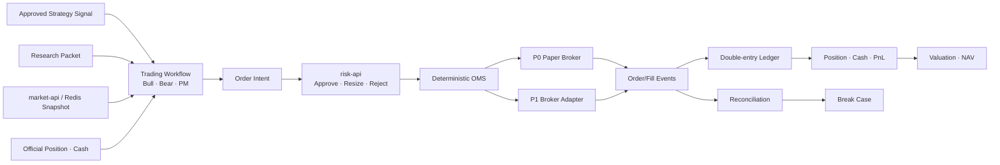

# 도현님 담당 가이드: 트레이딩본부 + 회계/포트폴리오본부

> 문서 상태: Team Handoff v1.9
> 최상위 기준: [HEDGE_FUND_MASTER_PLAN.md](../HEDGE_FUND_MASTER_PLAN.md)  
> 담당자: 도현님  
> 담당 조직: 트레이딩본부, 회계/포트폴리오본부, 공통 Frontend Platform 기술 DRI
> 핵심 결정: 모든 공식 거래·원장 데이터는 Supabase PostgreSQL에 저장하고 시계열 DB를 직접 사용하지 않음  
> 시장 데이터 접근: 재일님 팀의 `market-api`와 Redis Snapshot을 통해 조회  
> 공통 기준: [RESEARCH_DATA_SOURCES_AND_LIBRARIES.md](../03-data/RESEARCH_DATA_SOURCES_AND_LIBRARIES.md), [AGENT_EMPLOYEE_PROFILES.md](../04-organization/AGENT_EMPLOYEE_PROFILES.md)
> 공통 계약: [README.md](../README.md), [MINIMUM_SERVICE_UNIT_SPEC.md](../01-product/MINIMUM_SERVICE_UNIT_SPEC.md)
> 저장소 소유권: [REPOSITORY_DEPARTMENT_STRUCTURE.md](../02-engineering/REPOSITORY_DEPARTMENT_STRUCTURE.md)의 트레이딩·회계 경계
> Frontend 계약: [AI_OFFICE_FRONTEND_PLAN.md](../02-engineering/AI_OFFICE_FRONTEND_PLAN.md)의 Trading·OMS·Portfolio·Close View와 공통 Platform, [ADR-0001](../02-engineering/adr/0001-hermes-kanban-agent-status-bridge.md)
> 실행 상태와 다음 Task: [실행 현황과 통합 계획 v2.2](../PROJECT_IMPLEMENTATION_STATUS.md#42-도현님-트레이딩본부-회계포트폴리오본부와-공통-platform)의 `CI-01`·`PLAT-01`·`PLAT-02`·`TRD-01`·`ACC-01`·`UI-01`~`UI-03`
> 체크박스 해석: 11절은 최종 E2E DoD이며 Prototype 파일이 있다는 이유로 체크하지 않음

---

## 0. Daily Scrum (필수)

> 기준: 2026-08-04 09:45 KST
> GitHub 기준: `origin/main` `54dd3eb`
> 갱신 규칙: 도현님이 매일 아침 아래 세 항목을 실제 실행 증거로 갱신한다. 항목 삭제와 공란은 허용하지 않으며 이전 기록은 Git 이력으로 보존한다.

### Yesterday

- Trading Domain API FastAPI 래퍼와 `trading-api` Container를 추가하고 트레이딩·회계 서비스를 부서별 Compose Fragment로 분리했다.
- OMS 상태 머신을 계획·집행 2단계로 정리하고 Bull/Bear 독립 토론 LangGraph, NAV Close LangGraph와 Notion Projection을 연결했다.
- 트레이딩·회계 Hermes Container, LangSmith Project 격리와 Tool Allowlist를 적용하고 부서장 모델을 구독형 Sonnet 경로로 전환했다.
- Trading API가 URL의 `case_id`와 다른 Case의 Intent를 받아들이던 소유권 결함을 차단하고 PR #110으로 병합했다.
- 관련 Commit은 `8aed60b`까지 모두 `main`에 병합됐으며 트레이딩·회계 원격 작업 브랜치는 `main`보다 앞선 Commit이 없다.
- 다만 코드와 Container 정의가 존재한다는 사실만 확인됐고 Canonical Order·Fill·Journal·Position Row 생성은 아직 증명되지 않았다.

### Today

- [ ] `PLAT-01`: `case_id`, `trace_id`, `event_id`, `event_type`, `schema_version`, `occurred_at`,
  `producer`, `idempotency_key`를 포함한 공통 Event Envelope과 Error·Health Fixture를 코드로 고정한다.
- [ ] 재일님의 `ResearchPacketV2` Fixture를 받아 Trading API가 같은 ID를 유지한 `OrderIntent`를 생성하는 Contract Test를 만든다.
- [ ] 동규님의 Risk API 입력·출력과 연결해 `APPROVE/RESIZE/REJECT` 중 승인된 Intent만 Paper OMS로 넘어가는 테스트를 만든다.
- [ ] 트레이딩·회계 Compose Fragment를 깨끗한 환경에서 기동하고 Health, DB 연결, Hermes Tool 제한 결과를 실행 로그로 남긴다.
- [x] Paper Fill 한 건이 Journal Entry, Position과 Portfolio Snapshot을 만드는 `ACC-01` 최소 Fixture를 구현한다.
  (2026-08-04. `departments/05-accounting-portfolio/ledger/repository.py` psycopg 원장 저장소 +
  `ledger/fill_consumer.py`. 실 Supabase에 Fund `ACC01-PAPER` / Book `MAIN` 고정 Fixture로
  `journals`(POSTED·3라인)·`journal_lines`·`positions`·`cash_balances`·`portfolio_snapshots` 생성,
  재실행 멱등 확인. **체결 원천은 아직 `execution.fills`가 아니라 API 주입이다** — 그 조인
  경로(`pending_fills()`)는 구현했고 TRD-01이 행을 넣으면 그대로 붙는다.)
- [ ] AI Office에서 Scripted Demo와 실제 Runtime Projection을 명확히 구분하고, 공식 API 연결 전 화면에 `LIVE`를 표시하지 않는지 검토한다.

### Blocker

- Canonical Journal·Position·Cash·Snapshot 행은 2026-08-04에 생겼다(`ACC01-PAPER` Fixture).
  남은 공백은 **Order·Fill 쪽**이다 — `execution.orders`/`fills`가 여전히 0행이고 OMS 상태는
  프로세스 메모리다. 회계는 그 표를 읽을 준비만 돼 있다(`fill_consumer.pending_fills()`).
- `TRD-01` E2E는 재일님 `RQ-01` Fixture와 동규님 Risk Runtime, 영주님 Case·Approval ID가 선행한다.
- `PLAT-02` 프로젝트 전용 Redis·Outbox가 없어 부서 간 Event Replay를 제품 Runtime으로 검증할 수 없다.
- 공식 `/ui/snapshot`, `/ws/operations`, Sequence Gap 복구와 Hermes Kanban Bridge가 없다.
- Frontend 의존성 Upgrade는 Vinext·Cloudflare Build 회귀 위험이 있어 `npm audit fix --force`를 바로 실행하지 않는다.

### 2주 개인 실행 계획

| 순서 | 기간 | Task | 산출물 | 선행 조건 | 완료·인계 기준 |
|---|---|---|---|---|---|
| 1 | 완료 | `CI-01` | 중복 Smoke Test 파일명 분리 | 영주 Smoke 파일 Review | `4334c49`, 전체 Suite 재검증 대기 |
| 2 | 08-04~05 | `PLAT-01` | Event·Error·Health·Idempotency Contract | 전 본부 Fixture | 생산자·소비자 Contract Test 통과 |
| 3 | 08-06~07 | `PLAT-02` | 프로젝트 Redis·Core Network·Compose | `PLAT-01` | Risk·QA Service가 별도 Redis 없이 기동 |
| 4 | 08-10~11 | `TRD-01` | Trading API·OMS Worker·Repository | `RQ-01`, `RSK-01` | 승인 Intent만 Order·Fill 생성 |
| 5 | 08-11~12 | `ACC-01` | Fill Consumer·Ledger·Snapshot | `TRD-01` | Balance Journal·Position·Snapshot 생성 |
| 6 | 08-13~14 | `UI-01`~`UI-03` | 공식 Snapshot·WebSocket·보안 Review | Risk·QA·Accounting Read Model | Gap 복구 E2E, High 취약점 처리 기록 |

Platform PR은 도메인 의미를 새로 만들지 않는다. 각 Event의 금융 의미는 생산 본부 Owner 승인을 받아야 한다.

---

## 1. 도현님이 만드는 영역

도현님 영역은 **투자 판단을 주문으로 변환하고, 주문 결과를 회사의 공식 장부로 확정하는 거래 생명주기**다.

트레이딩본부는 승인된 전략과 Research Packet을 이용해 `Order Intent`를 제안한다. 리스크본부가 승인·축소·거부한 뒤에만 OMS와 Execution Service가 주문을 실행한다. 회계/포트폴리오본부는 주문·체결·현금·수수료를 이중분개 원장에 반영하고 Position, PnL과 NAV를 산출한다.

담당 범위:

- Trade Case, Bull/Bear 결과와 Order Intent 계약
- 결정론적 OMS 상태 머신과 멱등 Command 처리
- Paper Broker와 향후 실거래 Broker Adapter 경계
- 주문 분할, Limit, 참여율과 Execution Plan
- 주문·체결·거부·취소 Event와 TCA
- Fund/Book/Strategy 자본 계층과 Double-entry Ledger
- Position, Cash, Valuation, PnL, Fee와 NAV
- OMS/Broker/Ledger Reconciliation과 Break 처리
- `oms-api`, `portfolio-api`, `nav-reporting-api` 제공
- 공통 Frontend Platform의 FastAPI BFF, Realtime Store, WebSocket와 E2E 기술 통합
- Hermes Kanban Status Bridge와 `agent.status.v1` Projector 구현

담당하지 않는 범위:

- LS 가격·호가를 별도 Collector로 다시 수집
- 공시·뉴스·재무·거시 데이터의 원본 수집
- 주문 Risk 승인과 Limit 변경
- Strategy Candidate 검증·승격 승인
- QA Finding 종료와 감사 증빙 삭제

### 저장소 소유권

| 구분 | 현재 경로 | 구 경로 |
|---|---|---|
| 트레이딩 Hermes | `departments/02-trading/hermes/` | `orchestration/hermes/trading-department/` |
| 계약·OMS·Paper Broker | `departments/02-trading/{contracts,oms,broker}/` | `trading/`, `execution/` |
| 회계 Hermes | `departments/05-accounting-portfolio/hermes/` | `orchestration/hermes/accounting-portfolio-department/` |
| Ledger·Reconciliation | `departments/05-accounting-portfolio/{ledger,reconciliation}/` | `accounting/` |
| 공통 Frontend Platform | `ai-office/`, `apps/api/` | — (각 본부가 Domain Read Model·Event 의미를 소유) |
| D0-D2 SQL Prototype | `db/` | — (Supabase 통합 후 Archive 또는 제거, 11절 단계 4 — 아직 진행 전) |
| 운영 DB Migration | `supabase/migrations/` | — (도구 표준 경로 유지, Schema별 Domain Owner 지정) |

11절 단계 1~3(REPOSITORY_DEPARTMENT_STRUCTURE.md)이 완료되어 `departments/02-trading/`,
`departments/05-accounting-portfolio/`가 실행 기준이다. 구 경로(`runpy` 기반 임시 CLI 호환 Wrapper)는
예정(2026-10-31)보다 일찍 삭제됐다 — 더 이상 존재하지 않는다. 5개 자체 점검 스크립트 모두 통과 확인함.
`db/`와 `supabase/migrations/`는 같은 Database에 함께 적용하지 않는다. 현재 Python Prototype을 Canonical
Schema로 옮길 때 Schema Diff, RLS와 Runtime Test를 포함한 별도 PR이 필요하다.

### Hermes 자기 개선 책임

- 트레이딩 Hermes는 Reject, Partial Fill, Slippage, Cancel 지연과 Reconciliation Break를 개선 후보의 근거로 사용한다.
- 회계 Hermes는 원장 불일치, Valuation 예외, 누락 Fee와 Report 재작성 원인을 개선 후보로 등록한다.
- Memory에는 현재 주문·Position·Cash·PnL을 저장하지 않고 `order_id`, `fill_id`, `ledger_event_id`, `break_id`와 재확인 절차만 남긴다.
- Hermes는 OMS 상태 머신, Risk Decision 또는 Ledger를 직접 바꾸지 않는다. 변경 후보는 회귀 Test, Shadow/Paper, QA 검증과 승인 후 새 Version으로 배포한다.
- 효과는 중복 주문 0건, Break 해결 시간, TCA 품질, 회계 마감 시간과 Rollback 가능성으로 평가한다.

조직 공통 상태 전이와 승인 책임은 [마스터 플랜 5.10](../HEDGE_FUND_MASTER_PLAN.md#510-hermes-memory-기반-조직-재귀적-자기-개선)을 따른다.

### 1.1 Multi-Strategy 책임

도현님 팀은 전략의 수익 논리를 판단하지 않고, **승인된 전략을 방향과 Leg 수에 관계없이 정확한 주문·장부 상태로 변환**한다.

- `OrderIntent`는 `strategy_family`, `directionality`, `intent_group_id`, `position_effect`와 `capability_profile_id`를 가진다.
- OMS는 단일 Long뿐 아니라 Short, Pair, Basket, Hedge와 향후 Multi-leg를 같은 상태 머신 확장 규칙으로 처리한다.
- Paper Broker는 Version이 있는 Borrow Availability·Fee·Recall과 Margin Scenario를 모의한다.
- 일부 Leg 체결 시 전략 정책에 따라 전체 취소, Hedge, Retry 또는 Reduce-only로 전환하며 상태를 숨기지 않는다.
- Ledger는 Long/Short Position, Borrow/Financing Cost, Margin, Premium, Settlement와 Strategy별 PnL을 분리 기록한다.
- 실행·회계 Capability가 없는 Strategy Version은 승인 신호가 있어도 주문 접수 단계에서 차단한다.

P0는 Long/Short Pair와 Basket Fixture를 포함하고, 실제 공매도·선물·옵션은 Broker와 Risk/Accounting Certification 후 별도 활성화한다.

---

## 2. 전체 처리 흐름



핵심 원칙:

1. Agent는 `OrderIntent`까지만 제안한다.
2. Risk 승인 없이 OMS가 `SUBMIT` 상태로 이동하지 않는다.
3. Broker 응답을 추정하지 않고 실제 Event 또는 Paper Broker Event로만 상태를 바꾼다.
4. Position과 Cash는 주문 의도가 아니라 체결·원장 Event에서 계산한다.
5. 회계 수치는 LLM 문장에서 추출해 확정하지 않는다.

---

## 3. 수집·참조·생성 데이터

### 3.1 트레이딩본부

| 구분 | 데이터 | 원천 | 주기 | 저장 위치 | 용도 |
|---|---|---|---|---|---|
| 참조 | 승인 Strategy Version과 Signal | `strategy-registry-api` | Signal Event | ID는 `execution.trade_cases` | 승인된 전략만 실행 |
| 참조 | Research Packet, Catalyst, Invalidation | `research-api` | Case 시작 시 | Packet ID만 저장 | 논거와 만료 조건 |
| 참조 | Market Snapshot, Spread, Depth, Volume Curve | `market-api`/Redis | 주문 직전 | Snapshot Reference | 가격·주문 방식 결정 |
| 참조 | Instrument, Tick Size, 거래시간, 거래상태 | `reference-api` | 장전 + 주문 직전 | Version ID 저장 | 주문 유효성 검사 |
| 참조 | Official Position, Cash, Pending Order | `portfolio-api`, `oms-api` | 주문 직전 | Read Model | 중복·과대 주문 방지 |
| 참조 | Risk Limit, Trading State | `risk-api` | 주문 직전 | Decision ID 저장 | Entry Block/Reduce Only 준수 |
| 수집 | Broker Session, Ack, Reject, Fill, Cancel | Paper/Broker Adapter | 실시간 Event | `execution.order_events`, `fills` | OMS 상태와 체결 확정 |
| 생성 | Bull/Bear 주장과 PM 결론 | Trading LangGraph | Trade Case마다 | `execution.trade_cases` | 독립 논거 보존 |
| 생성 | Execution Plan | Execution Service/Agent 제안 | 주문마다 | `execution.execution_plans` | Limit·분할·만료 |
| 생성 | Order Intent | Trading API | 주문 후보마다 | `execution.order_intents` | Risk 심사 입력 |
| 생성 | TCA | TCA Worker | 체결 후·일일 | `execution.tca_results` | 비용·Slippage 환류 |

트레이딩본부는 Tick/Quote 전체를 Supabase에 복제하지 않는다. 주문 시 사용한 시장 상태는 `market_snapshot_id`, `as_of`, `bid`, `ask`, `mid`, `spread`, `quality_status`만 Order Evidence로 고정한다.

### 3.2 회계/포트폴리오본부

| 구분 | 데이터 | 원천 | 주기 | 저장 위치 | 용도 |
|---|---|---|---|---|---|
| 참조 | Order, Fill, Cancel, Reject | OMS Event Store | 실시간 | Event ID 연결 | 거래·원장 반영 |
| 수집 | Broker Position, Cash, Margin, Statement | Paper Broker/P1 Broker Account Adapter | 장중·장 마감 | `accounting.external_statements` + Storage | 외부 대사 |
| 참조 | Closing Price, FX, DQ와 Valuation Source | `market-api` | 장중·장 마감 | `accounting.valuations` | 평가금액 산출 |
| 참조 | Corporate Action | `reference-api` | Event + 일일 | Action ID 연결 | 배당·분할·만기 처리 |
| 참조 | Fee, Tax, Borrow, Funding Rule | Policy/Contract Registry | 거래일·Version 변경 | Rule Version 저장 | 비용·Accrual |
| 생성 | Journal/Journal Line | Ledger Service | 체결·현금·Fee Event | `accounting.journals`, `journal_lines` | 공식 원장 |
| 생성 | Official Position/Cash | Projection Worker | Event마다 | `accounting.positions`, `cash_balances` | 전사 공식 상태 |
| 생성 | Reconciliation/Break | Reconciliation Worker | 장중·장 마감 | `accounting.reconciliations`, `breaks` | 불일치 추적 |
| 생성 | PnL/Attribution | Accounting Engine | 장중·일일 | `accounting.pnl_snapshots` | 성과 분석 |
| 생성 | Preliminary/Official NAV | NAV Service | 일일 | `accounting.nav_runs`, `nav_components` | 공식 보고 |

### 3.3 P0와 P1 수집 범위

P0 Paper Trading:

- Paper Broker가 생성한 Ack/Fill/Reject.
- 내부 OMS Order Event.
- 가상 Cash, Fee와 Tax Rule.
- Market API의 체결·평가 가격.
- Paper Position과 Ledger Reconciliation.

P1 Limited Live:

- 선정 Broker의 주문·체결·잔고·예수금·증거금 API.
- Broker 일일 Statement 원본.
- 은행/결제 Cash Statement가 필요하면 별도 Adapter.
- 실제 수수료·세금·거래소 Fee Schedule.
- 파생상품 만기·정산·Margin Event.

가격 Source가 LS로 확정됐다는 이유로 실거래 Broker도 LS라고 가정하지 않는다. Broker 선정 전까지 `BrokerAdapter` Interface와 Paper 구현만 확정한다.

---

## 4. Supabase DB 설계

### 4.1 Schema 경계

| Schema | 소유 서비스 | 설명 |
|---|---|---|
| `execution` | OMS/Execution Service | Trade Case, Order Intent, Order, Event, Fill, TCA |
| `accounting` | Ledger/Portfolio/NAV Service | Fund, Book, Journal, Position, Cash, PnL, NAV, Reconciliation |
| `api` | Read API | RLS가 적용된 View와 제한된 RPC |
| `storage` | Supabase 관리 | Broker Statement, Report와 Evidence Object Metadata |

`execution`과 `accounting` Schema를 Browser에 직접 노출하지 않는다. Dashboard와 Agent는 `api` View/RPC 또는 FastAPI Backend를 사용한다.

### 4.2 `execution` 핵심 Table

#### `trade_cases`

```text
trade_case_id uuid primary key
fund_id uuid
book_id uuid
strategy_id uuid
strategy_version text
strategy_family text
primary_instrument_id uuid null
research_packet_id uuid
signal_id uuid
case_status text
thesis jsonb
invalidation jsonb
expires_at timestamptz
created_by text
trace_id text
created_at timestamptz
```

`trade_case_instruments`는 `trade_case_id`, `instrument_id`, `role`, `target_weight`를 저장해 단일 종목, Pair와 Basket을 같은 Case에 연결한다.

#### `intent_groups`

```text
intent_group_id uuid primary key
trade_case_id uuid
strategy_capability_profile_id uuid
atomicity_policy text
failure_policy text
group_status text
gross_target numeric
net_target numeric
created_at timestamptz
```

#### `order_intents`

```text
order_intent_id uuid primary key
trade_case_id uuid
intent_group_id uuid
instrument_id uuid
side text
position_effect text
leg_index integer
order_type text
quantity numeric
limit_price numeric
time_in_force text
valid_until timestamptz
market_snapshot_id text
risk_request_id uuid
intent_status text
idempotency_key text unique
schema_version text
created_at timestamptz
unique(intent_group_id, leg_index)
```

`quantity`와 `limit_price`는 Float로 저장하지 않는다. Instrument별 Lot, Tick Size와 Currency Precision을 검증한 뒤 `numeric`을 사용한다.

#### `orders`

```text
order_id uuid primary key
order_intent_id uuid
client_order_id text unique
broker_order_id text null
state text
requested_quantity numeric
filled_quantity numeric
average_fill_price numeric null
broker_adapter text
submitted_at timestamptz null
last_event_at timestamptz
version integer
```

#### `order_events`

```text
order_event_id uuid primary key
order_id uuid
event_type text
event_time timestamptz
received_at timestamptz
broker_event_id text null
from_state text
to_state text
payload jsonb
payload_hash text
trace_id text
unique(broker_adapter, broker_event_id)
```

`order_events`는 Append-only다. 현재 `orders.state`는 Event를 빠르게 읽기 위한 Projection이며 언제든 Event에서 재구축할 수 있어야 한다.

#### 추가 Table

| Table | 목적 |
|---|---|
| `execution_plans` | Child Order, Limit, 참여율, 만료와 Stop 조건 |
| `fills` | Fill ID, 수량, 가격, Fee, Liquidity Flag와 Event Time |
| `broker_sessions` | 연결, 인증, Heartbeat, 장애와 Safe State |
| `tca_results` | Arrival/Mid/VWAP 대비 Slippage와 비용 |
| `execution_exceptions` | Reject, Stuck Order, Cancel 불일치와 처리 상태 |

### 4.3 OrderIntent와 OMS 상태 머신

```text
OrderIntent:
DRAFT -> RISK_PENDING -> APPROVED | RESIZED | REJECTED | EXPIRED
APPROVED | RESIZED -> READY_TO_SUBMIT

Broker Order:
CREATED -> SUBMITTED -> ACKNOWLEDGED -> PARTIALLY_FILLED -> FILLED
CREATED | SUBMITTED | ACKNOWLEDGED | PARTIALLY_FILLED -> CANCEL_PENDING -> CANCELLED
SUBMITTED -> REJECTED
CREATED | ACKNOWLEDGED -> EXPIRED
BROKER_STATE_AMBIGUOUS -> UNKNOWN
```

`RISK_APPROVED`는 Broker Order 상태가 아니라 유효한 `risk_decision_id` 제출 전제조건이다. 사용자 승인이 필요한 Mandate는 OrderIntent 흐름에 `USER_PENDING -> USER_APPROVED`를 추가한다. `UNKNOWN`에서는 신규 주문을 차단하고 Broker Reconciliation으로만 상태를 확정한다.

필수 규칙:

- 허용되지 않은 상태 전이는 DB Transaction에서 거부한다.
- `idempotency_key`가 같은 Submit Command를 두 번 실행하지 않는다.
- Risk Decision의 Strategy/Quantity/Price Scope와 만료를 다시 검증한다.
- `filled_quantity`가 주문 수량을 초과할 수 없다.
- Broker Event 순서가 뒤바뀌어 도착해도 Event를 보존하고 Projection을 규칙에 따라 갱신한다.
- Feed 또는 Broker 상태가 불명확하면 Filled/Cancelled로 추정하지 않는다.

### 4.4 `accounting` 핵심 Table

#### Fund와 Book Master

| Table | 핵심 Column |
|---|---|
| `funds` | `fund_id`, `base_currency`, `inception_date`, `status` |
| `books` | `book_id`, `fund_id`, `book_type`, `manager`, `status` |
| `strategy_allocations` | `book_id`, `strategy_id`, `capital_limit`, `effective_from/to`, `governance_allocation_id` |
| `ledger_accounts` | `account_id`, `account_code`, `account_type`, `currency`, `parent_id` |

#### 이중분개 원장

`governance.capital_allocations`는 CEO/위원회의 승인된 자본 배분 결정이며, `accounting.strategy_allocations`는 회계·포트폴리오 Service가 실제 Book에 적용한 결과다. 적용 Record는 반드시 원 결정의 `governance_allocation_id`를 보존한다.

`journals`:

```text
journal_id uuid primary key
fund_id uuid
book_id uuid
event_type text
source_event_id text
effective_at timestamptz
accounting_date date
currency text
status text
reversal_of uuid null
created_by_service text
approved_by text null
trace_id text
unique(event_type, source_event_id)
```

`journal_lines`:

```text
journal_line_id uuid primary key
journal_id uuid
account_id uuid
instrument_id uuid null
debit numeric default 0
credit numeric default 0
quantity numeric null
unit_price numeric null
currency text
fx_rate numeric null
metadata jsonb
check(debit >= 0 and credit >= 0)
```

Posting 전 `sum(debit) = sum(credit)`를 동일 Currency 또는 명시적 FX Bridge 기준으로 검증한다. Posted Journal은 수정하지 않고 Reversal Journal을 추가한다.

#### Position, Cash와 NAV

| Table | 역할 | Source of Truth 여부 |
|---|---|---|
| `positions` | Fund/Book/Strategy/Instrument별 수량·원가 Projection | Journal에서 재구축 가능 |
| `cash_balances` | 통화·Account별 현금 Projection | Journal에서 재구축 가능 |
| `valuations` | 가격 Source, 시각, DQ, FX와 평가금액 | NAV Evidence |
| `pnl_snapshots` | Realized/Unrealized/Fee/FX PnL | Journal+Valuation 파생 |
| `nav_runs` | Valuation Date, Preliminary/Official, Total NAV | 승인 가능한 공식 Run |
| `nav_components` | Cash, Position, Accrual, Fee와 Adjustment | NAV 재현 구성요소 |
| `performance_attribution` | Strategy/Sector/Instrument별 기여도 | 보고용 파생 |

### 4.5 Reconciliation

| Table | 핵심 내용 |
|---|---|
| `external_statements` | Provider, Statement Date, Object Path, Hash, Parser Version |
| `reconciliations` | Internal Snapshot, External Snapshot, Rule Version, 결과 |
| `reconciliation_items` | Order/Fill/Position/Cash별 비교 값과 차이 |
| `breaks` | Severity, Owner, Due Date, 상태, Resolution과 Evidence |

자동 Matching 순서:

1. Broker Order/Fill ID Exact Match.
2. Client Order ID Exact Match.
3. Instrument, Side, Quantity, Price, Time Window 후보 Match.
4. Fuzzy Match는 후보만 제시하고 자동 확정하지 않는다.
5. Material Break는 Risk와 QA에 Event로 전달한다.

---

## 5. Supabase 권한과 RLS

### 5.1 Service Identity

| Identity | Write | Read | 금지 |
|---|---|---|---|
| `svc_trading_workflow` | `trade_cases`, `order_intents` 제안 | Research/Strategy/Portfolio API | Orders/Journal 직접 수정 |
| `svc_oms` | `orders`, `order_events`, `fills` | 승인 Risk Decision | Ledger/Limit 수정 |
| `svc_broker_adapter` | Broker Raw Event/Statement Metadata | 필요한 Order Mapping | Order Intent 생성 |
| `svc_ledger` | Journal, Position/Cash Projection | Fill, Reference, Policy | Trading Signal 생성 |
| `svc_reconciliation` | Reconciliation/Break | OMS, Broker, Ledger Snapshot | Journal 자동 수정 |
| `svc_nav` | Valuation, PnL, NAV Run | Official Position, Price, FX, Accrual | Raw Fill 수정 |
| Trading Hermes | API로 Proposal | Read Model | DB/Broker Credential |
| Accounting Hermes | Break Resolution 제안, Report 요청 | Accounting Read Model | Journal SQL Write |

### 5.2 RLS 원칙

- exposed `api` View/RPC는 모든 Table에서 RLS를 활성화한다.
- `fund_id`, `book_id`, `environment`를 JWT Claim/Service Scope와 비교한다.
- `anon` 권한은 전부 제거한다.
- Dashboard 사용자에게 `service_role` Key를 제공하지 않는다.
- `SECURITY DEFINER` Function은 Search Path를 고정하고 실행 권한을 최소화한다.
- Migration에서 `GRANT`, `REVOKE`, RLS Policy와 Test를 한 번에 관리한다.
- 원장 Posting과 OMS Transition은 일반 CRUD API가 아니라 제한된 Command Endpoint/RPC를 사용한다.

---

## 6. API와 Event 계약

### 6.1 제공 API

| API | 주요 Method | 권한 |
|---|---|---|
| `trading-api` | `create_case`, `propose_order_intent`, `expire_case` | Trading Workflow |
| `oms-api` | `get_order`, `list_pending`, `request_cancel`, `get_fill` | 승인된 Service/Read Role |
| `portfolio-api` | `get_positions`, `get_cash`, `get_pnl`, `get_exposure_base` | 전사 역할별 Read |
| `accounting-api` | `get_journal`, `list_breaks`, `propose_resolution` | Accounting/QA |
| `nav-reporting-api` | `run_preliminary_nav`, `get_nav`, `approve_nav` | NAV Service/승인 Workflow |

Agent Tool은 `oms.submit_order`를 직접 노출하지 않는다. `trading.propose_order_intent`만 제공하고, Risk와 OMS Service가 후속 Command를 수행한다.

### 6.2 소비 Event

```text
market.snapshot.v1
research.packet.v1
strategy.signal.v1
risk.decision.v1
reference.corporate_action.v1
```

### 6.3 발행 Event

```text
trading.order_intent.v1
execution.order_event.v1
execution.fill.v1
execution.exception.v1
accounting.journal_posted.v1
portfolio.snapshot.v1
portfolio.break.v1
nav.preliminary.v1
nav.official.v1
```

Event Payload에는 전체 Statement나 보고서를 넣지 않고 `object_path`, `hash`, `record_id`를 넣는다.

### 6.4 AI Office 제공 계약

- 도현님은 공통 Frontend Platform 기술 DRI로서 Auth, API Client, Realtime Store, WebSocket, Kanban Status Bridge와 Frontend E2E를 통합한다. Live Office의 제품·업무 Owner는 영주님이며, Domain 상태의 의미는 각 본부 Owner가 정한다.
- `Trading and OMS`에 Order Intent, Risk Decision Ref, Order·Fill 상태, Reject·Cancel Reason, Broker Session과 TCA Read Model을 제공한다.
- `Portfolio and Close`에 Position, Cash, Exposure, PnL, NAV 상태, Reconciliation Break와 `as_of`를 제공한다.
- Order와 Fill은 동일한 `case_id`, `trace_id`, `order_intent_id`와 `internal_order_id`로 상세 화면에서 연결된다.
- 화면의 Cancel·Paper 승인 요청은 `oms-api` Command로 받고 사용자 Identity, 사유, 멱등 키와 예상 Version을 검사한다.
- Frontend는 `execution`·`accounting` Table, OMS 상태 머신과 Journal Posting을 직접 수정하지 않는다.
- 현재 `apps/api/main.py`의 `/ui/snapshot`은 테스트 Paper Loop 기반 DEMO다. `/agent/ask`는 Hermes Tool 실행 가능성 때문에 Auth·Tool Allowlist 전까지 기본 비활성화한다.
- Kanban Status Bridge는 읽기 전용으로 `agent.status.v1`을 발행하고, Projector가 Supabase Read Model을 갱신한다. Browser와 BFF는 Kanban SQLite를 직접 읽거나 수정하지 않는다.

---

## 7. 권장 라이브러리

### 7.1 P0

| 영역 | Library/도구 | 용도 |
|---|---|---|
| API | `fastapi`, `pydantic` v2 | Command/Query와 계약 검증 |
| DB | `sqlalchemy` 2, `asyncpg`, `alembic` | Transaction, Repository와 Migration |
| 정확한 수치 | Python `decimal`, `datetime`, `zoneinfo` | 가격·수량·통화·회계일 |
| Event/Hot State | `redis` | Queue, Pending Snapshot과 Idempotency Cache |
| 외부 Adapter | `httpx`, `websockets`, `tenacity` | Broker/API 연결과 복원력 |
| 분석 | `polars`, `numpy`, `pyarrow`, `duckdb` | TCA, 대사, PnL Bridge와 Statement |
| Calendar | `exchange-calendars` | 초기 Calendar 검증; 공식 Reference가 최종 기준 |
| Report | `jinja2` | NAV/PnL/Break Report Template |
| Test | `pytest`, `pytest-asyncio`, `hypothesis`, `testcontainers` | 상태 머신, 원장 불변식과 통합 Test |
| 운영 | `structlog` | Order/Journal Trace 구조화 Log |

### 7.2 P1 이후

- `scipy`: TCA와 비용 모델의 통계 분석.
- `cvxpy`: 제약 기반 Portfolio Construction 후보.
- `rapidfuzz`: 대사 후보 탐색. 자동 Posting에는 사용 금지.
- `openpyxl`: 사람이 검토할 XLSX Export. 원장으로 사용 금지.
- `opentelemetry-sdk`, `prometheus-client`: 주문·원장·Close 지연과 실패 Metric.
- Broker 공식 SDK: Broker 선정과 Contract Test 후 Adapter 내부에만 설치.

별도 회계 Framework가 프로젝트의 Fund/Book/Strategy와 주문 Event 모델을 정확히 지원하는지 입증되기 전에는 범용 회계 Package를 원장 핵심으로 채택하지 않는다. 원장 규칙은 작고 명시적인 Domain Service로 구현한다.

---

## 8. 데이터 관리 지침

### 8.1 거래 데이터

- 모든 Command는 `idempotency_key`를 가진다.
- Broker Event 원문과 정규 Event를 함께 보존한다.
- `event_time`, `received_at`, `processed_at`을 분리한다.
- 현재 Order Row 수정과 별개로 모든 상태 Event를 Append한다.
- 주문 시 사용한 Strategy, Research, Risk와 Market Snapshot Version을 고정한다.
- Reject와 Cancel 실패도 성공 Event만큼 보존한다.

### 8.2 회계 데이터

- Posted Journal Update/Delete 금지. Reversal로 수정한다.
- 원장과 Projection의 합계·수량을 매일 재계산한다.
- 모든 Position에 Pricing Source, Price Time, DQ와 FX Source를 기록한다.
- Fee/Tax Rule은 Effective Time과 Version을 가진다.
- Corporate Action은 Announcement가 아니라 실제 Effective Event로 Posting한다.
- Preliminary NAV와 Official NAV를 구분하고 승인 Evidence를 보존한다.

### 8.3 보존·백업

| 데이터 | 권장 보존 | 복구 기준 |
|---|---|---|
| Order/Fill/Event | 장기 Append-only | Broker Event부터 상태 재생 |
| Journal/Journal Line | 영구 또는 법률·정책 기준 | 원장 Balance 재계산 |
| Position/Cash Projection | 운영 기간 + Snapshot | Journal에서 재구축 |
| NAV/Valuation | 장기 | 구성요소와 Source로 재현 |
| Broker Statement | 계약·법률 기준 | Object Hash와 Parser Version |
| TCA/Report | 전략 평가 기간 이상 | Fill과 Market Snapshot 연결 |

Supabase DB Backup과 Object Storage Backup을 분리해 점검한다. Broker Statement와 Report Object는 DB Row만 복구돼도 파일이 사라지지 않도록 별도 Versioning·복제 정책을 둔다.

### 8.4 관측 Metric

Trading:

- Order Intent -> Risk Decision P95.
- Approved -> Broker Submit/Ack P95.
- Reject, Cancel 실패, Stuck Order와 Duplicate Command.
- Fill Ratio, Slippage, Implementation Shortfall와 Market Impact.

Accounting:

- Unmatched Fill과 Position/Cash Break 수.
- Break Aging과 Material Break.
- Unexplained PnL.
- Preliminary/Official NAV 완료 시각.
- Manual Journal과 Reversal 비율.

---

## 9. 첫 구현 순서

### Sprint D0: 계약과 Schema

- `execution`, `accounting`, `api` Schema Migration.
- Order Intent, Risk Decision Reference와 Event Envelope.
- Fund/Book/Strategy ID 계약.
- Service Role, Grant, RLS와 Audit Trigger.

### Sprint D1: Paper OMS

- 명시적 상태 머신과 Idempotent Command.
- Paper Broker Ack/Fill/Reject.
- Order Event Store와 Pending Projection.
- Risk 승인 없는 Submit 차단 Test.

### Sprint D2: Ledger와 Position

- Fill -> Journal Rule.
- Debit/Credit Balance와 Reversal.
- Position/Cash Projection.
- OMS/Fill/Ledger Reconciliation.

### Sprint D3: Valuation/PnL/NAV

- Market API Closing Price와 DQ.
- Realized/Unrealized/Fee PnL.
- Preliminary NAV와 Daily Bridge.
- QA Evidence Handoff.

### Sprint D4: Execution/TCA와 운영

- Execution Plan과 Child Order.
- TCA, Slippage와 Cost Model 환류.
- Broker Adapter Contract와 장애 State.
- Close Dashboard와 Alert.

---

## 10. 다른 팀과의 Handoff

| 상대 팀 | 받는 데이터 | 제공 데이터 |
|---|---|---|
| 재일님 | Market/Research/Strategy/Reference | Fill, TCA, 비용, Strategy 운용 성과 |
| 동규님 | Risk Decision, Limit, Entry Block | Order Intent, Pending Order, Position, Break |
| 영주님 | Mandate, Capital Priority | Official Position/PnL/NAV, Trading Incident 요약 |

중요 Handoff:

- 동규님 Risk Decision에는 `order_intent_id`와 승인된 최대 수량·가격·만료가 있어야 한다.
- Fill Event는 재일님 Quant가 비용 모델을 만들 수 있도록 Market Snapshot과 연결한다.
- NAV는 QA 검증 전 `preliminary`, 검증 후 `official` 상태로 분리한다.

---

## 11. 완료 Definition of Done

- [ ] Trading Agent는 `OrderIntent`만 만들고 Broker를 직접 호출하지 않는다.
- [ ] Risk 승인 없는 주문은 OMS에서 거부된다.
- [ ] 같은 Command/Fill Event를 두 번 받아도 중복 주문·원장이 생기지 않는다.
- [ ] OMS 상태를 Event Store에서 재구축할 수 있다.
- [ ] Fill 하나가 Balance된 Journal로 변환된다.
- [ ] Position/Cash를 Journal에서 재계산할 수 있다.
- [ ] Broker/OMS/Ledger Break가 자동 생성되고 임의로 숨겨지지 않는다.
- [ ] PnL과 NAV가 가격·FX·Fee Source까지 재현된다.
- [ ] Supabase RLS로 Fund/Book/Service 권한이 분리된다.
- [ ] 트레이딩·회계 Agent에 TimescaleDB와 `service_role` Credential이 없다.
- [ ] AI Office의 Order·Position·PnL·NAV 상태를 공식 Read Model과 Event Chain에서 재구성하고 Browser가 거래·원장 Table을 직접 수정하지 않는다.

---

## 12. 공식 참고 자료

- [Supabase Database](https://supabase.com/docs/guides/database/overview)
- [Supabase Row Level Security](https://supabase.com/docs/guides/database/postgres/row-level-security)
- [Supabase API Security](https://supabase.com/docs/guides/api/securing-your-api)
- [Supabase Custom Schemas](https://supabase.com/docs/guides/api/using-custom-schemas)
- [Supabase Storage Access Control](https://supabase.com/docs/guides/storage/security/access-control)

> 도현님 영역의 최종 목표는 주문 화면을 만드는 것이 아니다. 어떤 전략·근거·시장 상태·Risk 승인으로 주문이 나갔고, Broker가 무엇을 체결했으며, 그 결과가 원장·Position·PnL·NAV에 어떻게 반영됐는지를 한 Event Chain으로 재현하는 것이다.
