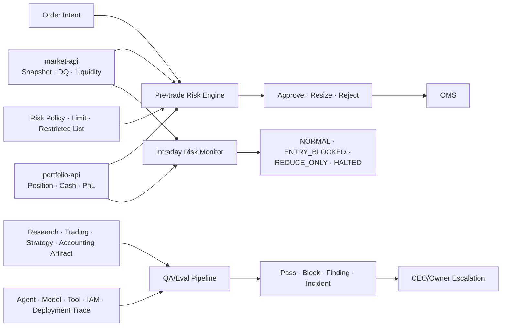

# 동규님 담당 가이드: 리스크본부 + AI QA/감사본부

> 문서 상태: Team Handoff v1.3
> 최상위 기준: [HEDGE_FUND_MASTER_PLAN.md](../HEDGE_FUND_MASTER_PLAN.md)  
> 담당자: 동규님  
> 담당 조직: 리스크본부, AI QA/감사본부  
> 핵심 결정: 공식 Risk Decision과 Audit Finding은 Supabase PostgreSQL에 Append하고 시계열 DB를 직접 사용하지 않음  
> 시장 데이터 접근: 재일님 팀의 `market-api` Snapshot·Bar·Feature Endpoint 사용  
> 공통 기준: [RESEARCH_DATA_SOURCES_AND_LIBRARIES.md](../03-data/RESEARCH_DATA_SOURCES_AND_LIBRARIES.md), [AGENT_EMPLOYEE_PROFILES.md](../04-organization/AGENT_EMPLOYEE_PROFILES.md)
> 공통 계약: [README.md](../README.md), [MINIMUM_SERVICE_UNIT_SPEC.md](../01-product/MINIMUM_SERVICE_UNIT_SPEC.md)
> 저장소 소유권: [REPOSITORY_DEPARTMENT_STRUCTURE.md](../02-engineering/REPOSITORY_DEPARTMENT_STRUCTURE.md)의 리스크·AI QA 경계

---

## 1. 동규님이 만드는 영역

동규님 영역은 회사의 **독립적인 제동 장치와 검증 장치**다.

리스크본부는 모든 주문을 결정론적 Rule과 계산으로 승인·축소·거부하고, 장중 Exposure와 Drawdown을 감시한다. AI QA/감사본부는 Agent의 근거, Model/Prompt/Dataset Version, Tool 사용, 권한 분리와 Release 재현성을 독립 검증한다.

담당 범위:

- Risk Policy, Limit와 Restricted List Version 관리
- Pre-trade Risk/Compliance Gate
- Position/Exposure/Liquidity/Concentration/Stress 계산
- Entry Block, Reduce Only, Kill Switch State
- 파생상품 Greeks/Margin Risk의 향후 확장 경계
- Claim-Citation, Hallucination과 Contradiction 검증
- Agent/Model/Prompt/Tool/Dataset Evaluation
- Access Review, Audit Finding, Incident와 Postmortem
- `risk-api`, `audit-api`, QA/Release Gate 제공

담당하지 않는 범위:

- 시장 가격·뉴스·공시를 별도 수집
- Order Intent 생성이나 Broker 주문 전송
- Ledger, Position, Cash와 NAV 수정
- Strategy/Agent 후보를 자신이 만들고 자신이 최종 승인
- Risk Limit을 Agent 판단만으로 확대
- QA Finding을 작성자가 직접 종료

### 저장소 소유권

| 구분 | 현재 경로 | 구 경로(호환 Wrapper) |
|---|---|---|
| 리스크 Hermes | `departments/03-risk/hermes/` | `orchestration/hermes/risk-management/` |
| Compliance RAG Baseline | `skills/agentic-rag/` | — (위치 유지, 이동 안 함 — 공용 skills 경계 유지, Risk Source·공용 Artifact 분리는 ADR 후 결정) |
| AI QA Hermes | `departments/06-ai-qa-audit/hermes/` | `orchestration/hermes/qa-department/` |
| Risk·Audit Schema | `supabase/migrations/` | — (도구 표준 경로 유지, 리스크·QA가 각 Schema Owner) |
| Schema Test | `tests/schema/` | — (공통 Test 경계 유지, 이동 안 함) |

11절 단계 1~3(REPOSITORY_DEPARTMENT_STRUCTURE.md)이 완료되어 `departments/03-risk/`,
`departments/06-ai-qa-audit/`가 실행 기준이다. 구 경로는 빈 폴더로 남아 있다. 동규님이 두 폴더를 함께
관리해도 Risk 승인과 QA 독립 검증은 별도 Service Identity, Database Role과 Review Gate를 유지한다.

### Hermes 자기 개선 책임

- Risk Hermes는 반복 Breach, 오탐·미탐, Stress 사각지대와 Escalation 지연을 개선 후보로 등록하되 Limit을 직접 확대하지 않는다.
- QA Hermes는 모든 본부의 후보에 Golden·Adversarial·Regression Eval을 적용하고 결과를 Append-only Evidence로 남긴다.
- Candidate 작성자와 승인자를 분리한다. QA가 만든 QA Skill 후보는 별도 Reviewer와 CEO/인사팀 Gate를 거쳐 자기 승인 문제를 막는다.
- Memory에는 Finding과 Incident 원문 대신 `finding_id`, `incident_id`, `eval_run_id`와 반복 방지 Checklist를 남긴다.
- 품질이 나빠지거나 권한·Risk 불변식을 위반하면 이전 Champion Version으로 자동 Rollback을 권고하고 Finding을 연다.

AI QA/감사본부는 재귀적 자기 개선의 속도를 높이는 부서가 아니라 **잘못된 개선이 조직 전체로 증폭되지 않게 하는 독립 Gate**다. 공통 상태 전이와 승인 책임은 [마스터 플랜 5.10](../HEDGE_FUND_MASTER_PLAN.md#510-hermes-memory-기반-조직-재귀적-자기-개선)을 따른다.

### 1.1 같은 담당자 안의 권한 분리

동규님이 두 본부를 개발하더라도 Runtime과 DB Role은 분리한다.

| 역할 | 할 수 있는 일 | 할 수 없는 일 |
|---|---|---|
| Risk Service | 주문 승인·축소·거부, Breach와 Trading State 생성 | QA Finding 수정·종료 |
| Risk Hermes | Risk 결과 해석, 예외 분류와 Escalation | Limit 계산·변경, OMS 호출 |
| QA Service | Artifact·Trace·권한·Release 검증 | 주문 승인, Limit·Ledger 수정 |
| QA Hermes | Finding 작성, Block·Rollback 권고 | 운영 Command 실행, 자기 Finding 단독 종료 |

### 1.2 Multi-Strategy 책임

전략 종류가 늘어날수록 하나의 공통 Position Limit만으로는 부족하다. 동규님 팀은 Strategy Capability Profile에 따라 필요한 Risk Module과 QA Fixture를 선택한다.

| 전략군 | 추가 Risk 검사 |
|---|---|
| Equity Long/Short | Gross/Net, Factor, Sector, Borrow, Recall과 Short Squeeze |
| Market Neutral·Pairs | 관계 붕괴, Beta Drift, Crowding, Leg Liquidity와 Basket Concentration |
| Event Driven | Deal Break, Gap/Halt, 일정 변경, 공시 신뢰도와 Position Exit 가능성 |
| Futures·Macro | Leverage, Basis, Roll, Initial/Variation Margin과 Limit Move |
| Options·Volatility | Greeks, Surface Staleness, Vol Shock, Pin·Exercise·Assignment와 Leg Risk |
| Multi-Strategy | 전략 상관 붕괴, 중복 Exposure, 공통 Factor, Liquidity와 Risk Budget 합산 |

QA는 Strategy Family마다 Golden Dataset, Backtest 재현 Fixture, 금지된 미래 데이터, 비용 누락과 Capability 우회 Test를 유지한다. 지원하지 않는 Risk Module이 하나라도 필요한 전략은 Fail Closed한다.

---

## 2. 전체 처리 흐름



Pre-trade Hot Path는 LLM 호출 없이 끝나야 한다. Agent는 계산 결과를 설명하거나 예외를 분류할 수 있지만 주문 승인 결과를 자연어로 생성하지 않는다.

---

## 3. 수집·참조·생성 데이터

### 3.1 리스크본부

| 구분 | 데이터 | 원천 | 갱신 | 저장 위치 | 사용 목적 |
|---|---|---|---|---|---|
| 참조 | Order Intent, Pending Order | `oms-api` | 주문마다 | Request ID만 연결 | Pre-trade 심사 |
| 참조 | Official Position, Cash, PnL, NAV | `portfolio-api` | Event/장중 | Risk Snapshot 입력 | Exposure·Drawdown |
| 참조 | Market Snapshot, Spread, Depth, DQ | `market-api` | 주문·Risk Tick | Snapshot Reference | Mark·Liquidity·Stale 검사 |
| 참조 | Historical Return/Volatility/Correlation | `market-api` Feature Endpoint | 일일·필요 시 | Feature Version | VaR·Stress·집중도 |
| 참조 | Instrument, Issuer, Sector, Corporate Action | `reference-api` | 변경 Event | Reference Version | Look-through·거래 제한 |
| 참조 | Strategy Mandate와 Risk Assumption | Strategy Registry | Version 변경 | Strategy Version | 승인 범위 검사 |
| 수집 | Restricted List와 Compliance Policy | 승인된 내부 정책·공식 Source | 변경 시 | `risk.policies`, `restricted_items` | 거래 가능성 검사 |
| 수집 | Counterparty/Broker Health와 Margin Rule | Broker/운영 상태·계약 | Event/일일 | `risk.counterparties`, `margin_rules` | 운영·증거금 위험 |
| 생성 | Risk Decision | Risk Engine | 모든 Order Intent | `risk.risk_decisions` | 승인·축소·거부 |
| 생성 | Exposure/Risk Snapshot | Risk Engine | Event + 주기 | Redis Current + Supabase Sample | 장중 감시 |
| 생성 | Stress Result | Risk Engine | 일일·사건 | `risk.stress_results` | Tail Risk |
| 생성 | Breach/Trading State | Risk Service | 사건 즉시 | `risk.breaches`, `trading_states` | 진입 차단·Escalation |

Risk Snapshot 전체를 Tick 단위로 Supabase에 쓰지 않는다. 최신 상태는 Redis에 유지하고 다음 항목만 Supabase에 기록한다.

- 주문 심사에 실제 사용된 Snapshot.
- Limit 70/85/100% 등 Threshold Crossing.
- Breach, Entry Block, Reduce Only와 Kill Switch Event.
- 1분 또는 5분 Sample과 장 마감 Snapshot.
- Incident와 Strategy Review에 필요한 Stress Result.

### 3.2 AI QA/감사본부

| 구분 | 데이터 | 원천 | 갱신 | 저장 위치 | 사용 목적 |
|---|---|---|---|---|---|
| 참조 | Claim, Citation, Evidence Chunk와 Source Version | Research/Agent Trace | 중요 Artifact마다 | Audit Reference | 근거·PIT 검증 |
| 수집 | Prompt, Model, Parameter, Input/Output, Tool Call | Model Gateway/LangGraph/Hermes | 모든 중요 Run | Telemetry/Object + Supabase Index | 환각·오용 검사 |
| 수집 | Dataset, Code, Container, Strategy Version | CI/Quant/Registry | Build/Release | `audit.artifact_versions` | Release 재현성 |
| 수집 | IAM, Secret, Tool/Data Permission Change | Entitlement/Cloud Audit | Event | `audit.access_events` | 권한 분리 검사 |
| 수집 | API/Queue/Feed/DB/Model Metric과 Log | OpenTelemetry/Prometheus | 실시간 | Telemetry Backend | SLO와 Incident |
| 참조 | Order/Risk/Ledger/NAV Override와 승인 | Domain Event Store | Event | Audit Reference | 통제 작동 검사 |
| 생성 | Evidence/Claim Verification | QA Worker | Artifact마다 | `audit.claim_checks` | Unsupported Claim 차단 |
| 생성 | Eval Run과 Metric | Eval Harness | Candidate/Regression | `audit.eval_runs`, `eval_results` | Model/Prompt/Agent 품질 |
| 생성 | QA Decision/Release Review | QA Workflow | Gate마다 | `audit.qa_decisions` | Pass/Block |
| 생성 | Audit Finding | Audit Workflow | 통제 실패 | `audit.findings` | Remediation 추적 |
| 생성 | Incident/Postmortem | Incident Workflow | 장애·사고 | `audit.incidents`, `actions` | 재발 방지 |

Full Log와 대용량 Trace를 Supabase Row로 모두 저장하지 않는다. Telemetry Backend 또는 Private Object Storage에 보존하고 Supabase에는 `trace_id`, 위치, Hash, 기간, Severity와 관련 Case를 Index한다.

---

## 4. 리스크 계산 범위

### 4.1 P0 Pre-trade Rule

모든 주문에 다음 순서로 검사한다.

1. Data Freshness와 Quality.
2. Market/Instrument 거래 가능 상태.
3. Strategy/Book/Fund Mandate.
4. Restricted List와 Compliance Policy.
5. 주문 가격, 수량, Tick/Lot와 Notional.
6. Cash/Buying Power와 Pending Order 포함 Position.
7. 단일 종목·Issuer·Sector·Strategy Concentration.
8. 일일 Turnover와 주문 빈도.
9. Drawdown, Loss Limit와 Trading State.
10. Broker Session과 Counterparty Health.

결과:

```text
APPROVE
RESIZE
REJECT
ENTRY_BLOCKED
REDUCE_ONLY
```

`RESIZE`는 승인 수량, 최대 가격, 만료와 이유를 구조화해야 한다. 단순히 “작게 거래” 같은 문장은 허용하지 않는다.

### 4.2 P1 Risk Metric

- Gross/Net Exposure.
- Long/Short와 Cash Exposure.
- Issuer/Sector/Strategy/Book Concentration.
- Realized/Unrealized PnL와 Drawdown.
- Historical/Parametric VaR 후보.
- Volatility/Correlation Shock.
- Liquidity Days-to-Liquidate와 Participation Constraint.
- Gap Down, Market Halt와 Feed Stale Scenario.
- Counterparty/Broker Outage Stress.

### 4.3 P2 Derivatives

- Delta, Gamma, Vega, Theta와 Rho.
- Underlying/Expiry/Strike별 Exposure.
- Futures Basis와 Rollover.
- Initial/Maintenance Margin.
- Assignment, Exercise와 Expiry Scenario.
- Volatility Surface와 Tail Shock.

파생상품 계산은 `QuantLib` 또는 검증된 Pricing Engine 후보를 상품별 Golden Fixture로 검증한 뒤 도입한다. LLM이 Black-Scholes나 Margin 숫자를 직접 생성하지 않는다.

---

## 5. Supabase `risk` Schema

### 5.1 Policy와 Limit

| Table | 핵심 Column | 관리 원칙 |
|---|---|---|
| `risk.policies` | `policy_id`, `version`, `scope`, `rules`, `effective_from/to`, `status` | 승인된 Version만 Active |
| `risk.limits` | `limit_id`, `scope_type/id`, `metric`, `soft/hard_limit`, `unit`, `effective_from/to` | Agent 직접 수정 금지 |
| `risk.limit_changes` | `change_id`, `before/after`, `reason`, `requested_by`, `approved_by`, `trace_id` | 변경 이력 Append |
| `risk.restricted_items` | `restriction_id`, `instrument/issuer`, `restriction_type`, `source`, `effective_from/to` | 시점 유효성 필수 |
| `risk.counterparties` | `counterparty_id`, `status`, `exposure_limit`, `health`, `observed_at` | 상태 Source 기록 |
| `risk.margin_rules` | `rule_id`, `product_scope`, `version`, `parameters`, `effective_from` | Broker/계약 Version |

### 5.2 Risk Request와 Decision

`risk_requests`:

```text
risk_request_id uuid primary key
intent_group_id uuid unique
fund_id uuid
book_id uuid
strategy_id uuid
strategy_capability_profile_id uuid
market_snapshot_id text
portfolio_snapshot_id uuid
policy_version text
received_at timestamptz
expires_at timestamptz
trace_id text
```

`risk_request_items`는 `risk_request_id`, `order_intent_id`, `instrument_id`, `side`, `position_effect`, `requested_quantity`, `requested_price`와 `leg_index`를 저장한다. Risk Engine은 Leg별 결과와 합산 Portfolio 영향을 모두 계산한다.

`risk_decisions`:

```text
risk_decision_id uuid primary key
risk_request_id uuid
decision text
approved_quantity numeric null
max_price numeric null
approved_legs jsonb
aggregate_exposure jsonb
valid_until timestamptz
reason_codes text[]
check_results jsonb
calculation_version text
input_hash text
created_by_service text
created_at timestamptz
unique(risk_request_id, calculation_version)
```

Decision Explanation을 별도 JSON/Text로 저장할 수 있지만, 실제 승인 효력은 구조화된 Field와 Reason Code에만 있다.

`approved_quantity`와 `max_price`는 단일 Leg 호환 필드다. Pair·Basket·Multi-leg에서는 `approved_legs`가 공식 승인 수량이며 모든 Leg와 합산 Exposure가 함께 유효해야 한다.

### 5.3 Exposure, Stress와 Breach

| Table | 핵심 Column |
|---|---|
| `risk.snapshots` | `snapshot_id`, `fund/book/strategy`, `as_of`, `gross/net`, `var`, `drawdown`, `quality`, `input_hash` |
| `risk.exposure_components` | `snapshot_id`, `dimension`, `dimension_id`, `value`, `unit` |
| `risk.stress_scenarios` | `scenario_id`, `version`, `shocks`, `effective_from`, `status` |
| `risk.stress_results` | `run_id`, `snapshot_id`, `scenario_id`, `loss`, `breached_limits`, `code_version` |
| `risk.breaches` | `breach_id`, `limit_id`, `severity`, `observed/limit_value`, `status`, `owner`, `due_at` |
| `risk.trading_states` | `state_id`, `scope`, `state`, `reason`, `effective_from/to`, `set_by` |
| `risk.kill_switch_events` | `event_id`, `from/to_state`, `trigger`, `evidence`, `approved_release_by` |

Supabase Native PostgreSQL Table Partitioning은 `risk.snapshots`가 실제로 커질 때만 도입한다. TimescaleDB와 FDW를 Risk API에 직접 노출하지 않는다.

---

## 6. Supabase `audit` Schema

### 6.1 Trace와 Artifact Index

| Table | 핵심 Column | 비고 |
|---|---|---|
| `audit.artifact_versions` | `artifact_id`, `type`, `version`, `hash`, `object_path`, `producer`, `created_at` | Prompt/Model/Dataset/Strategy |
| `audit.agent_runs` | `run_id`, `agent_id`, `profile_version`, `model`, `started/ended_at`, `status`, `trace_uri` | 대용량 Trace는 외부 |
| `audit.tool_calls` | `tool_call_id`, `run_id`, `tool`, `scope`, `input/output_hash`, `status`, `occurred_at` | Secret/Payload 최소화 |
| `audit.access_events` | `event_id`, `identity`, `resource`, `action`, `decision`, `policy_version`, `occurred_at` | IAM/Entitlement |
| `audit.deployment_events` | `deployment_id`, `artifact`, `environment`, `before/after`, `approvals`, `occurred_at` | Release/Config 변경 |

### 6.2 Evidence와 Eval

| Table | 핵심 Column |
|---|---|
| `audit.claim_checks` | `check_id`, `artifact_id`, `claim`, `evidence_ids`, `result`, `reason`, `checker_version` |
| `audit.eval_sets` | `eval_set_id`, `role`, `version`, `manifest_path`, `hash`, `approval` |
| `audit.eval_runs` | `eval_run_id`, `candidate`, `champion`, `eval_set_id`, `config`, `status`, `trace_id` |
| `audit.eval_results` | `eval_run_id`, `case_id`, `metric`, `score`, `pass`, `evidence` |
| `audit.qa_decisions` | `decision_id`, `artifact_id`, `gate`, `decision`, `conditions`, `expires_at` |
| `audit.release_reviews` | `review_id`, `candidate_version`, `dataset/code/model`, `decision`, `rollback_condition` |

### 6.3 Finding과 Incident

| Table | 핵심 Column | 불변식 |
|---|---|---|
| `audit.findings` | `finding_id`, `type`, `severity`, `artifact/control`, `owner`, `due_at`, `status` | 작성자가 단독 종료 금지 |
| `audit.finding_events` | `event_id`, `finding_id`, `from/to_status`, `actor`, `evidence`, `occurred_at` | Append-only |
| `audit.control_tests` | `test_id`, `control_id`, `sample`, `result`, `workpaper_path` | Sample/Evidence 연결 |
| `audit.incidents` | `incident_id`, `severity`, `started/detected/resolved_at`, `impact`, `status` | 사실 Timeline 기준 |
| `audit.incident_events` | `event_id`, `incident_id`, `source`, `fact/inference`, `occurred_at`, `evidence` | Fact와 추론 분리 |
| `audit.corrective_actions` | `action_id`, `incident/finding_id`, `owner`, `due_at`, `verification`, `status` | QA 검증 후 Close |

---

## 7. QA 검사 순서

### 7.1 Research/Trading Artifact

1. JSON Schema와 필수 Field.
2. Evidence ID 존재와 접근 권한.
3. `published_at/observed_at <= decision_time`.
4. Claim의 숫자·단위·주체와 Citation 일치.
5. Fact, Inference, Forecast와 Recommendation 구분.
6. 상충 Evidence와 불확실성 표시.
7. Tool 결과와 Agent 요약의 변형 여부.
8. Material Unsupported Claim이면 Block.

### 7.2 Strategy/Model Release

1. Dataset Manifest와 Hash.
2. Code/Container/Dependency Version.
3. Train/Validation/Test와 PIT 검증.
4. 비용·Slippage·Capacity 포함 여부.
5. Champion 대비 Regression.
6. Stress, Failure Mode와 Rollback 조건.
7. Risk 본부 승인과 권한 분리.
8. Shadow/Paper 결과와 Release Approval.

### 7.3 Agent Profile/Prompt 변경

1. 역할 Mission과 Tool Allowlist.
2. Golden/Adversarial Eval.
3. Tool Call 정확도와 실패 처리.
4. 환각·과도한 확신·권한 우회.
5. Latency, Token과 Cost Budget.
6. 이전 Champion과 비교.
7. Shadow 수습과 Rollback.

LLM-as-a-Judge는 보조 신호다. Schema, Exact Match, Citation Location, 수치 재계산, Policy Rule과 Tool Trace 검사를 먼저 수행한다.

---

## 8. Supabase 권한과 RLS

### 8.1 Service Identity

| Identity | Write | Read | 금지 |
|---|---|---|---|
| `svc_risk_engine` | Risk Request/Decision/Snapshot/Breach | OMS, Portfolio, Market, Policy API | Limit 확대, OMS Submit |
| `svc_risk_policy` | 승인된 Policy/Limit Version | Governance Approval | 자기 변경 단독 승인 |
| `svc_qa_evaluator` | Claim Check/Eval/QA Decision | Artifact/Trace/Evidence | 운영 데이터 수정 |
| `svc_audit_collector` | Trace/Access/Deployment Index | Telemetry/Cloud Audit | Finding 종료 |
| `svc_incident` | Incident Timeline/Action | 전사 Event Read | Kill Switch 해제 |
| Risk Hermes | 해석·Escalation Proposal | Risk Read Model | DB Write/Limit 변경 |
| QA Hermes | Finding·Block Proposal | Audit Read Model | Risk/OMS/Ledger Command |

### 8.2 RLS 원칙

- `risk`와 `audit` 내부 Schema는 Data API에 직접 노출하지 않는다.
- `api` Schema의 View/RPC만 노출하고 모든 Table/View에 RLS를 검토한다.
- `audit` Record는 원 작성 본부가 수정할 수 없다.
- `risk.limit_changes`, `audit.finding_events`, `kill_switch_events`는 Append-only다.
- Finding Close RPC는 작성자 외 독립 승인과 Evidence를 요구한다.
- Production `service_role` Key는 Agent와 Frontend에 제공하지 않는다.
- QA는 전사 Read가 필요하지만 목적·Case·Trace가 있는 제한된 Audit API로 접근한다.

---

## 9. API와 Event 계약

### 9.1 제공 API

| API | 주요 Method | 소비자 |
|---|---|---|
| `risk-api` | `check_order`, `get_decision`, `get_limits`, `get_snapshot`, `get_trading_state`, `get_effective_policy`, `propose_policy_change`, `get_restricted_state` | OMS, Trading, CEO, Accounting, QA |
| `audit-api` | `submit_artifact`, `get_qa_decision`, `list_findings`, `get_incident` | 전 본부·CEO·인사 |
| `eval-api` | `start_eval`, `get_result`, `compare_champion` | Quant, HR, QA |

### 9.2 소비 Event

```text
market.data_quality.v1
trading.order_intent.v1
execution.order_event.v1
execution.fill.v1
portfolio.snapshot.v1
nav.preliminary.v1
strategy.candidate.v1
workforce.candidate.v1
deployment.changed.v1
```

### 9.3 발행 Event

```text
risk.decision.v1
risk.breach.v1
risk.trading_state.v1
qa.decision.v1
qa.finding.v1
audit.access_finding.v1
incident.opened.v1
incident.action.v1
```

Risk Decision Event는 OMS가 재검증할 수 있도록 `input_hash`, `policy_version`, `calculation_version`, `valid_until`을 포함한다.

---

## 10. 권장 라이브러리와 도구

### 10.1 Risk P0

| 영역 | Library | 용도 |
|---|---|---|
| API/계약 | `fastapi`, `pydantic` v2 | Risk Request/Decision과 Policy Schema |
| DB | `sqlalchemy` 2, `asyncpg`, `alembic` | Transaction, Repository와 Migration |
| 수치 | Python `decimal`, `numpy`, `polars` | Notional, Exposure, Limit와 Snapshot |
| 최적화/통계 | `scipy`, P1 `statsmodels`, `cvxpy` | Stress, Factor와 제약 계산 |
| Hot State | `redis` | 최신 Exposure, Trading State와 Limit Cache |
| Test | `pytest`, `pytest-asyncio`, `hypothesis`, `testcontainers` | 경계값, 단위, 부호와 DB 통합 Test |
| 운영 | `structlog` | Risk Input/Decision Trace |

### 10.2 QA/감사 P0·P1

| 영역 | Library/도구 | 용도 |
|---|---|---|
| Contract/Eval | `pydantic`, `jsonschema`, `pytest`, `hypothesis` | Artifact와 Regression Test |
| RAG Eval | P1 `ragas` | Context Precision/Recall, Faithfulness, Tool Eval |
| Dataset QA | `pandera` | Feature/Dataset Frame Contract |
| Telemetry | `opentelemetry-sdk`, `prometheus-client`, `structlog` | Trace, Metric와 Log |
| Experiment | P1 `mlflow` Client | Quant Experiment/Model Lineage 독립 조회 |
| Error | P1 `sentry-sdk` | Release별 Application Error |
| Security | `pip-audit`, `bandit`, `trivy` | Dependency, Python Code와 Container Scan |
| Load/Failure | `locust`, `testcontainers` | Risk P99와 장애 시나리오 |

P2 파생상품에는 `QuantLib` Python Binding을 후보로 두되 상품 Convention, Day Count, Calendar, Volatility Input과 Golden Price/Greek Fixture가 먼저다.

---

## 11. 데이터 관리와 운영 지침

### 11.1 Risk 데이터

- Limit과 Policy는 `effective_from/to`가 있는 Version으로 관리한다.
- Risk Decision 입력을 Hash해 동일 입력·Version의 재현성을 확인한다.
- `APPROVE`뿐 아니라 `REJECT`, `RESIZE`도 장기 보존한다.
- Snapshot Source와 DQ가 불충분하면 안전 쪽으로 차단한다.
- Risk 계산 단위, 통화, 가격 시각과 FX Source를 기록한다.
- Hard Limit 초과를 Agent Explanation으로 Override할 수 없다.

### 11.2 Audit 데이터

- Trace에는 Prompt/Output 원문 저장 권한과 민감정보 Masking을 적용한다.
- Secret, Access Token, 개인식별정보와 뉴스 전문을 Log에 남기지 않는다.
- Artifact Binary는 Private Storage, Supabase에는 Hash/URI/Metadata를 둔다.
- Finding Status 변경은 Event로 Append한다.
- Incident Timeline에서 확인된 사실과 추론을 별도 Field로 저장한다.
- Eval Set은 Candidate 결과를 본 뒤 기준을 바꾸지 못하도록 Version/Hash를 고정한다.

### 11.3 보존·백업

| 데이터 | 보존 원칙 | 복구·검증 |
|---|---|---|
| Risk Decision/Breach | 거래 기록과 같은 장기 보존 | 주문과 Decision Chain 재생 |
| Limit/Policy Version | 전체 유효 이력 | 특정 시점 정책 재현 |
| Eval/QA Decision | Artifact 생명주기 이상 | Candidate/Champion 비교 재현 |
| Audit Finding/Event | 정책·법률 기준 장기 | Close Approval와 Evidence 확인 |
| Trace/Log | 민감도·비용별 Tier | Hash와 Index로 무결성 확인 |
| Incident/Postmortem | 장기 | Timeline과 Action 검증 |

Supabase Database Backup과 Storage/Telemetry Backup은 별개다. Object·Trace의 Versioning과 Restore Test를 별도로 수행한다.

### 11.4 핵심 Metric

Risk:

- Pre-trade P50/P95/P99 Latency.
- False Pass, False Reject와 Decision Error.
- Limit Utilization과 Breach 수.
- Stale Data 차단 성공률.
- Stress Coverage와 Calculation Failure.

QA/Audit:

- Unsupported Claim/Hallucination Escape.
- Citation/PIT Coverage.
- Unvalidated Release 0.
- Unauthorized Tool Call 0.
- Finding Aging, Repeat Finding과 False Block.
- Incident MTTA/MTTR와 Action 완료율.

---

## 12. 첫 구현 순서

### Sprint K0: Schema와 권한

- Supabase `risk`, `audit`, `api` Schema.
- Service Role, RLS, Append-only Trigger/RPC.
- Risk Request/Decision와 QA Decision 계약.
- 공통 Reason Code, Severity와 Event Envelope.

### Sprint K1: P0 Risk Gate

- Data Freshness, Mandate, Position, Cash, Concentration와 Loss Limit.
- Approve/Resize/Reject.
- Redis 최신 Trading State.
- OMS 연동과 100% 주문 Gate Test.

### Sprint K2: Evidence QA

- Claim/Evidence/PIT Rule Check.
- Agent/Tool Trace 수집과 Unsupported Claim Block.
- Research Packet와 Order Intent QA Sample.

### Sprint K3: Intraday/Stress와 Incident

- Exposure Snapshot, Threshold Crossing과 Breach.
- Stress Scenario/Result.
- Feed/Broker/Model 장애 Incident Correlation.
- Entry Block/Reduce Only Workflow.

### Sprint K4: Release/Access Audit

- Strategy/Agent Candidate Eval.
- Dataset/Model/Prompt/Container Lineage.
- Tool/Data Permission Review.
- Finding Lifecycle와 Postmortem.

---

## 13. 다른 팀과의 Handoff

| 상대 팀 | 받는 데이터 | 제공 데이터 |
|---|---|---|
| 재일님 | Market/DQ, Dataset, Strategy Candidate와 Evidence | Risk Feature 요구, Strategy/Model Validation Finding |
| 도현님 | Order Intent, Position, PnL, Break, Broker Health | Risk Decision, Trading State, NAV QA Decision |
| 영주님 | Mandate, 승인정책, Agent Registry | Material Breach, QA Block, Incident와 Finding 요약 |

리스크와 QA가 동시에 Block한 경우 두 Block을 하나로 합치지 않는다. 각각의 해제 조건과 승인자를 독립적으로 충족해야 한다.

---

## 14. 완료 Definition of Done

- [ ] 모든 Order Intent가 Risk Decision을 거친다.
- [ ] Decision을 입력·Policy·Calculation Version으로 재현할 수 있다.
- [ ] Agent가 Limit을 확대하거나 Hard Limit을 Override할 수 없다.
- [ ] 최신 Risk 상태는 Redis, 공식 Decision/Breach는 Supabase에 남는다.
- [ ] Risk/QA는 TimescaleDB를 직접 조회하지 않고 `market-api`의 Snapshot·Bar·Feature Endpoint를 사용한다.
- [ ] 중요 Claim마다 Evidence와 PIT 검사가 수행된다.
- [ ] Model/Prompt/Strategy Release가 Versioned Eval을 통과한다.
- [ ] 원 작성 본부가 QA Finding을 수정·종료할 수 없다.
- [ ] Agent와 Tool의 권한 위반을 Trace에서 탐지한다.
- [ ] Incident Timeline과 Corrective Action을 Evidence로 재현할 수 있다.

---

## 15. 공식 참고 자료

- [Supabase Database](https://supabase.com/docs/guides/database/overview)
- [Supabase Row Level Security](https://supabase.com/docs/guides/database/postgres/row-level-security)
- [Supabase API Security](https://supabase.com/docs/guides/api/securing-your-api)
- [Supabase Custom Schemas](https://supabase.com/docs/guides/api/using-custom-schemas)
- [OpenTelemetry Python](https://opentelemetry.io/docs/languages/python/)
- [Ragas Metrics](https://docs.ragas.io/en/latest/concepts/metrics/available_metrics/)
- [MLflow Tracking](https://mlflow.org/docs/latest/ml/tracking/)
- [CVXPY](https://www.cvxpy.org/tutorial/intro/index.html)
- [QuantLib Documentation](https://www.quantlib.org/docs.shtml)

> 동규님 영역의 최종 목표는 위험 보고서를 잘 쓰는 것이 아니다. 잘못된 데이터·주문·전략·Agent가 자본에 영향을 주기 전에 독립적으로 차단하고, 어떤 통제가 왜 작동했거나 실패했는지를 변경 불가능한 Evidence로 남기는 것이다.
