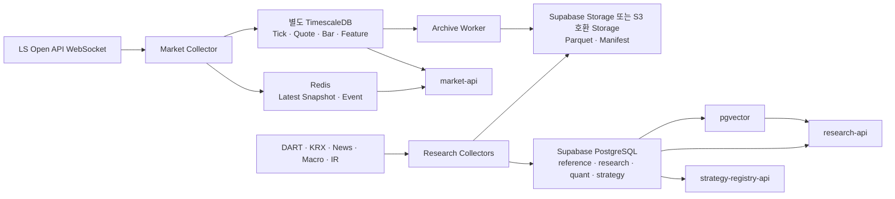

# 재일님 담당 가이드: 리서치본부 + 퀀트/백테스트본부

> 문서 상태: Team Handoff v1.5
> 최상위 기준: [HEDGE_FUND_MASTER_PLAN.md](../HEDGE_FUND_MASTER_PLAN.md)  
> 담당자: 재일님  
> 담당 조직: 리서치본부, 퀀트/백테스트본부  
> 핵심 결정: Supabase를 전사 업무 DB로 사용하고, 고빈도 시장 시계열만 별도 TimescaleDB에 저장  
> 가격 Source: LS증권 Open API  
> 참고 구현: [traderjaeil-lgtm/krx-tick-collector](https://github.com/traderjaeil-lgtm/krx-tick-collector)  
> 공통 기준: [RESEARCH_DATA_SOURCES_AND_LIBRARIES.md](../03-data/RESEARCH_DATA_SOURCES_AND_LIBRARIES.md), [DATA_GOVERNANCE_GUIDE.md](../03-data/DATA_GOVERNANCE_GUIDE.md)
> 공통 계약: [README.md](../README.md), [MINIMUM_SERVICE_UNIT_SPEC.md](../01-product/MINIMUM_SERVICE_UNIT_SPEC.md)
> 저장소 소유권: [REPOSITORY_DEPARTMENT_STRUCTURE.md](../02-engineering/REPOSITORY_DEPARTMENT_STRUCTURE.md)의 리서치·퀀트 경계
> Frontend 계약: [AI_OFFICE_FRONTEND_PLAN.md](../02-engineering/AI_OFFICE_FRONTEND_PLAN.md)의 Market·Research·Strategy View
> 실행 상태와 다음 Task: [실행 현황과 통합 계획 v2.0](../PROJECT_IMPLEMENTATION_STATUS.md#41-재일님-리서치본부와-퀀트백테스트본부)의 `RQ-01`~`RQ-04`
> 체크박스 해석: 11절의 완료 표시는 재일님 소유 산출물 기준이며 전사 E2E 완료를 뜻하지 않음

---

## 1. 재일님이 만드는 영역

재일님 영역은 회사의 **투자 데이터 원천과 전략 연구 공장**이다.

리서치본부는 외부 시장·공시·뉴스·거시 데이터를 수집·정규화해 다른 본부가 신뢰할 수 있는 `Research Packet`과 `Evidence`를 만든다. 퀀트/백테스트본부는 이 데이터를 Point-in-Time Dataset으로 고정하고 전략을 백테스트해 배포 가능한 `Strategy Bundle`을 만든다.

재일님 담당 범위:

- LS Open API 체결·10단계 호가 수집과 시계열 저장
- Instrument Master, 거래일 Calendar와 종목 Mapping
- DART/KRX/KIND, 뉴스, 거시경제와 기업 IR 수집
- 문서 정규화, 중복 제거, Entity Resolution과 RAG Index
- Bar, Microstructure와 Research Feature 생성
- Point-in-Time Dataset, Backtest, Experiment와 Strategy Registry 후보 생성
- 데이터 품질, Archive, Backfill과 Lineage 관리
- 다른 본부에 `market-api`, `research-api`, `strategy-registry-api` 제공

담당하지 않는 범위:

- 실시간 주문 전송과 OMS 상태 변경
- Risk 승인과 Limit 변경
- Position, Ledger, PnL와 NAV 확정
- 자기 전략의 Production 승격 최종 승인
- Agent가 임의로 외부 Website나 Vendor API를 호출하는 기능

### 저장소 소유권

| 구분 | 현재 경로 | 구 경로 |
|---|---|---|
| 리서치 Hermes | `departments/01-research/hermes/` | `orchestration/hermes/research-department/` |
| Market Event 계약 | `departments/01-research/contracts/market_events.py` | — (신규, Sprint J0) |
| 수집 Source Registry | `departments/01-research/collectors/source_registry.py` | — (신규, Sprint J1) |
| 실시간 구독 계획 | `departments/01-research/collectors/subscription_plan.py` | — (신규, Sprint J1) |
| 시장 시계열 Repository | `departments/01-research/repository/market_repository.py` | — (신규, Sprint J0) |
| LS REST Client | `departments/01-research/collectors/ls_client.py` | — (신규, Sprint J1) |
| LS 실시간 정규화 Adapter | `departments/01-research/collectors/ls_realtime_adapter.py` | — (신규, Sprint J1 / F04) |
| 거래 Calendar 수집기 (관측 역산) | `departments/01-research/collectors/calendar_collector.py` | — (신규, Sprint J1) |
| 거래 Calendar 선언 생성 (당일·미래) | `departments/01-research/collectors/calendar_declared.py` | — (신규, Sprint J1) |
| LS 실시간 상주 서비스 | `departments/01-research/collectors/ls_realtime_worker.py`, `ls_realtime_service.py` | — (신규, Sprint J1 / F03) |
| 시장 상태 수집기 | `departments/01-research/collectors/market_breadth_collector.py` | — (신규, Sprint J1) |
| Reference Repository | `departments/01-research/repository/reference_repository.py` | — (신규, Sprint J1) |
| 공시 수집기 | `departments/01-research/collectors/opendart_collector.py` | — (신규, Sprint J2) |
| 재무 수집기 | `departments/01-research/collectors/opendart_financial.py` | — (신규, Sprint J2) |
| Corporate Action 수집기 | `departments/01-research/collectors/corporate_action_collector.py` | — (신규, Sprint J2) |
| 거시경제 수집기 | `departments/01-research/collectors/macro_collector.py` | — (신규, Sprint J2) |
| 로컬 시계열 DB 구성 | `docker-compose.yml`, `timescaledb/local-dev/` | — (신규, 로컬 개발 전용) |
| 뉴스 수집 Baseline | `departments/01-research/collectors/news.py` | `fetch_news.py` |
| 뉴스 Stream 계약 | `departments/01-research/contracts/news_events.py` | — (신규, Sprint J3) |
| 국내 뉴스 수집기 (P0) | `departments/01-research/collectors/naver_news_collector.py` | — (신규, Sprint J3) |
| 해외 뉴스 수집기 (P1) | `departments/01-research/collectors/alpaca_news_collector.py` | — (신규, Sprint J3) |
| 뉴스 즉시 적재 Sink | `departments/01-research/collectors/news_pipeline.py` | — (신규, Sprint J3) |
| 뉴스 상주 서비스 | `departments/01-research/collectors/news_watch_service.py` | — (신규, Sprint J3) |
| 감시 Watchlist 생성기 | `departments/01-research/collectors/watchlist_builder.py`, `config/` | — (신규, Sprint J3) |
| 수집기 Container Image | `departments/01-research/Dockerfile` | — (신규, 2026-07-31) |
| research-api (Evidence 조회면) | `departments/01-research/api/main.py` | — (신규, Sprint J2) |
| market-api (시세 조회면) | `departments/01-research/api/market_api.py` | — (신규, F03) |
| 차트 백필 수집기 | `departments/01-research/collectors/chart_backfill_collector.py` | — (신규, 2026-07-31) |
| 파생 스냅샷 수집기 (K200 선물·옵션 체인) | `departments/01-research/collectors/derivatives_collector.py` | — (신규, 2026-07-31) |
| PIT Dataset Builder (Manifest·Leakage Check) | `departments/04-quant-backtest/pipeline/pit_dataset.py` | — (신규, 2026-07-31) |
| Backtest Runner v1 (비용·Ledger·재현 해시) | `departments/04-quant-backtest/pipeline/backtest_runner.py` | — (신규, 2026-07-31) |
| Walk-Forward 검증 (QNT-04, Fragility 판정) | `departments/04-quant-backtest/pipeline/walk_forward.py` | — (신규, 2026-07-31) |
| Market Data Steward (심박·품질·지연 감사) | `departments/01-research/collectors/market_data_steward.py` | — (신규, 2026-07-31) |
| Evidence Bundle 조립기 (결정론 가격 컨텍스트) | `departments/01-research/evidence/bundle.py` | — (신규, 2026-07-31) |
| 기술적 분석가 (RES-04) | `departments/01-research/agents/technical_analyst.py` | — (신규, 2026-08-01) |
| 펀더멘털 분석가 (RES-05) | `departments/01-research/agents/fundamental_analyst.py` | — (신규, 2026-08-01) |
| 섹터·레짐 분석가 (RES-07) | `departments/01-research/agents/sector_regime_analyst.py` | — (신규, 2026-08-01) |
| 미시구조 분석가 (RES-03) | `departments/01-research/agents/microstructure_analyst.py` | — (신규, 2026-08-01) |
| RAG 사서 (RES-08, 결정론 인덱싱·검색) | `departments/01-research/agents/rag_librarian.py` | — (신규, 2026-08-01) |
| 전략 가설 연구자 (QNT-01) | `departments/04-quant-backtest/agents/strategy_hypothesis_agent.py` | — (신규, 2026-08-01) |
| 배치 스케줄러 | `departments/01-research/collectors/collector_scheduler.py` | — (신규, 2026-07-31) |
| LS 실시간 뉴스 수집기 | `departments/01-research/collectors/ls_news_collector.py` | — (신규, Sprint J3). **판정 2026-08-01**: 금요일 병행 실측으로 속보성 주 소스 확정 — p50 19초(NAVER 712초), 60초 내 관측 1,762건(vs 22건), 전용 링크 38%(vs 20%), 고유 427종목. 단 제목 교집합 8~12%뿐이라 **대체가 아니라 상호 보완** — NAVER는 웹 매체 폭(NAVER만 잡은 3,480건/8h) 담당으로 병행 유지 |
| 공시 원문 Archive 수집기 | `departments/01-research/collectors/opendart_document_collector.py` | — (신규, Sprint J2) |
| 직원 에이전트 (실구현) | `departments/01-research/agents/` (universe_manager, news_sentiment_analyst, article_reader) | — (신규, 2026-07-31) |
| 본부 LangGraph 파이프라인 | `departments/01-research/scripts.py` | — (신규, 2026-07-31 - QA 부서 패턴) |
| LS API 계약 | `docs/06-integrations/ls-openapi/` | — (문서 위치 유지, 리서치본부가 내용 Owner) |
| 시장 시계열 Migration | `timescaledb/migrations/` | — (도구 표준 경로 유지, 리서치본부가 Schema Owner) |
| 퀀트 Hermes | `departments/04-quant-backtest/hermes/` | `orchestration/hermes/quant-backtest-department/` |
| 연구 자료 | `references/` | — (저작권·공유 범위 ADR 전까지 현재 위치 유지, 이동 안 함) |

11절 단계 1~3(REPOSITORY_DEPARTMENT_STRUCTURE.md)이 완료되어 `departments/01-research/`가 실행 기준이다.
구 경로(`runpy` 기반 임시 CLI 호환 Wrapper)는 예정(2026-10-31)보다 일찍 삭제됐다 — 더 이상 존재하지 않는다.
`supabase/migrations/`와 `timescaledb/migrations/`는 본부별로 복제하지 않는다.

### Hermes 자기 개선 책임

- 리서치 Hermes는 누락 Source, 중복 문서, 잘못된 Entity Mapping과 인용 실패를 `ImprovementCandidate`로 등록한다.
- 퀀트 Hermes는 Dataset Drift, 재현 실패, 비용 모델 오차와 Backtest-Live 차이를 근거와 함께 등록한다.
- 두 본부의 Memory에는 공식 시장 수치나 Backtest 결과 원문을 복제하지 않고 `dataset_id`, `experiment_id`, `evidence_id`와 재검사 Checklist만 남긴다.
- 승인된 수집·검증 절차만 Versioned Skill로 배포하며, 자신의 Strategy 또는 Skill 후보를 스스로 Paper/Production에 승격하지 않는다.
- 효과는 데이터 품질, PIT 재현율, 인용 정확도, 처리 지연과 비용으로 평가한다. 수익률 하나만으로 Skill을 채택하지 않는다.

조직 공통 상태 전이와 승인 책임은 [마스터 플랜 5.10](../HEDGE_FUND_MASTER_PLAN.md#510-hermes-memory-기반-조직-재귀적-자기-개선)을 따른다.

### 1.1 Multi-Strategy 책임

재일님 팀은 특정 전략을 미리 고르는 팀이 아니라 **각 전략이 실제로 연구 가능한지 데이터로 증명하는 팀**이다.

- Strategy Candidate마다 `required_data_product_ids`와 최소 History를 등록한다.
- Long/Short에는 Borrow·공매도 데이터, Event Driven에는 공시·조건·상태 시각, Pair에는 동기화 가격과 Corporate Action, Derivatives에는 Contract·Margin·Chain 입력을 연결한다.
- Strategy Family별 Dataset Builder와 Backtest Adapter는 달라도 Dataset Manifest, PIT 검사, 비용 모델과 결과 Schema는 공통으로 유지한다.
- 데이터 Coverage, 사용권, 품질 또는 Live Parity가 부족하면 `RESEARCH_BLOCKED`, `SHADOW_ONLY` 또는 `PAPER_ONLY` 사유를 Strategy Registry에 반환한다.
- 수집 데이터로 만들 수 있는 전략 가설은 Catalog에 계속 추가하되, 자신의 Backtest 결과만으로 Paper/Live 승격을 확정하지 않는다.

P0 완료 시 Long/Short Equity, Market Neutral/Pairs, Event Driven과 Quant Trend·Mean Reversion의 대표 Fixture를 같은 Dataset/Experiment 계약으로 재현해야 한다.

---

## 2. DB 구성 결정

### 2.1 권장 구조



### 2.2 TimescaleDB를 Supabase와 분리하는 이유

Supabase PostgreSQL은 Instrument, 문서 Metadata, 재무 Fact, Dataset Manifest, Experiment와 Strategy Version을 관리한다. 초당 대량 적재되는 Tick/Quote는 별도 TimescaleDB가 담당한다.

중요한 운영 결정:

- Supabase의 TimescaleDB Extension에 신규 구조를 종속시키지 않는다.
- Supabase 공식 문서 기준 TimescaleDB Extension은 PostgreSQL 17 Project에서 Deprecated 상태다.
- 별도 TimescaleDB Container 또는 Managed Timescale을 사용하고 `MarketDataRepository` Interface로 감싼다.
- 다른 본부는 TimescaleDB Credential을 받지 않고 `market-api`만 호출한다.
- Supabase와 TimescaleDB를 실시간 Cross-DB Join하지 않는다. `instrument_id`, `dataset_id`, `as_of`로 Application 계층에서 연결한다.

### 2.3 저장소별 역할

| 저장소 | 저장할 데이터 | 저장하지 않을 데이터 |
|---|---|---|
| TimescaleDB | Tick, 10단계 Quote, Bar, Market Breadth, 고빈도 Feature | 뉴스 본문, Strategy 승인, Agent Memory |
| Redis | 최신 Snapshot, Feature, Event Stream, Dedup Key, Job Lease | 영구 원본과 장기 Backtest History |
| Supabase PostgreSQL | Reference, 문서·재무·거시 Metadata, PIT Manifest, Experiment, Strategy 상태 | 전체 Raw Tick/Quote |
| Supabase pgvector | 권한이 확인된 Document Chunk Embedding | 유일한 원문 사본 |
| Private Object Storage | JSON/XML/XBRL/PDF 원본, Parquet, Dataset와 Model Artifact | 자주 갱신하는 상태 Row |

---

## 3. 리서치본부가 수집할 데이터

### 3.1 P0 필수 수집 목록

| Domain | 데이터 | Source | 방식·주기 | 원본 저장 | 정규화 저장 |
|---|---|---|---|---|---|
| 실시간 시세 | 전 종목 체결, 거래량, 체결 방향 | LS Open API WebSocket | 장중 실시간 | TimescaleDB + Parquet | Bar/Feature는 TimescaleDB |
| 실시간 호가 | 10단계 Bid/Ask 가격·잔량 | LS Open API WebSocket | 장중 실시간 | TimescaleDB + Parquet | Spread/Depth/OFI는 TimescaleDB |
| 시장 상태 | 지수, 상승·하락 종목 수, 거래대금, 시장 Breadth | LS/KRX 제공 범위 | 장중 실시간·주기 | TimescaleDB | `market_breadth` |
| 종목 기준정보 | 종목·시장·상장·거래상태·표준코드 | LS + KRX | 장전 + 변경 Event | Object Raw | `reference.instruments` |
| 거래 Calendar | 휴장, 장 구간, 동시호가, 만기 | KRX 공식 기준 | 연간 + 변경 확인 | Object Raw | `reference.market_calendars` |
| 공시 | 접수번호, 제목, 공시 시각, 정정 관계, 원문 | Open DART | 장중 증분 Polling | Private Storage | `research.documents` |
| 재무 | 연결/별도 재무제표와 주요 계정 | Open DART XBRL | 공시 Event 후 | XBRL/XML | `research.financial_facts` |
| 기업정보 | 법인코드, 업종, 결산월, 홈페이지·IR URL | Open DART/KRX | 일일·변경 | Object Raw | `reference.issuers` |
| Corporate Action | 배당, 분할·병합, 증자, 합병, 상장폐지 | DART/KRX | Event + 일일 확인 | Object Raw | `reference.corporate_actions` |
| 뉴스 | 제목, URL, 출처, 게시·수정 시각, 허용된 본문 | BIGKinds/NAVER API HUB/계약 Vendor | 1~5분 또는 Provider Event | 권한별 Storage | `research.documents` |
| X Social Insight | 승인 유명 인사·공식 계정의 Post ID, 작성자, 게시·관측 시각, 종목·주제, 검증 상태 | X API Filtered Stream | 준실시간 | 권한별 Storage | `research.documents` + Source Registry |
| 거시경제 | 금리, 환율, 물가, 고용, 생산, 수출입 | ECOS/KOSIS/FRED | 발표 Calendar + 일일 확인 | Raw JSON | `research.macro_observations` |
| 기업 IR | 실적 Presentation, IR 공지와 첨부 | DART/KIND/회사 공식 IR | Event/일일 | Private Storage | `research.documents` |

### 3.2 P1 이후 수집 후보

| 데이터 | 필요한 이유 | 도입 조건 |
|---|---|---|
| Consensus와 실적 추정치 | Surprise와 Revision Factor | 기계 수집·모델 입력 권한이 있는 Vendor 계약 |
| Transcript | 경영진 Guidance와 Tone | 전문 저장·Embedding 권한 확인 |
| 공매도·대차·대주 | Crowding과 Short Constraint | 안정적 공식·계약 Feed 확보 |
| 외국인·기관 수급 세분 | Flow 전략과 Regime | PIT History와 데이터 정의 확인 |
| ETF 구성종목 | Look-through Exposure | 변경 이력과 Effective Time 제공 |
| 신용등급·채권·CDS | Credit Risk와 Funding Regime | 라이선스와 Coverage 확인 |
| X 유명 인사 Watchlist | 정책·기업·투자·산업의 빠른 Narrative와 촉매 탐지 | 공식 API 권한, 비용, 승인 계정 Registry와 삭제 Compliance 검증 |
| Supply Chain/Alternative Data | Event·산업 선행지표 | Incremental Alpha와 비용 검증 |

### 3.3 수집하지 말아야 할 것

- LS와 의미가 다른 가격 Source를 같은 `price` Column에 조용히 혼합
- Website 비공개 Endpoint를 공식 API처럼 운영
- 기사 본문 사용권 없이 전문을 Storage·Vector DB에 적재
- 현재 최신 재무·거시 값을 과거 전 기간 Backtest에 사용
- 종목코드 문자열을 영구 Primary Key로 사용
- Agent가 API Key를 들고 직접 Crawling

---

## 4. TimescaleDB 상세 설계

### 4.1 필수 Hypertable

#### `market_ticks`

| Column | Type | 설명 |
|---|---|---|
| `event_time` | `timestamptz` | 거래소 Event 시각, Partition Key |
| `received_at` | `timestamptz` | Collector 수신 시각 |
| `instrument_id` | `uuid` | Supabase Instrument Master의 내부 ID |
| `market` | `text` | KRX/NXT 등 Venue |
| `price` | `numeric` 또는 검증된 정수 Price Unit | 체결 가격 |
| `quantity` | `bigint` | 체결 수량 |
| `side` | `smallint` | 공급자 의미를 정규화한 체결 방향 |
| `sequence_no` | `text` | 공급자 Sequence 또는 Payload Identity |
| `source_event_id` | `text` | 멱등 적재용 Hash |
| `raw_flags` | `jsonb` | 정정·장 구간·예외 Flag |

권장 Index: `(instrument_id, event_time desc)`, `(source_event_id, event_time)` Unique. Hypertable Unique Constraint에는 시간 Partition Column을 포함한다.

#### `market_quotes`

| Column | Type | 설명 |
|---|---|---|
| `event_time` | `timestamptz` | 호가 Event 시각 |
| `received_at` | `timestamptz` | 수신 시각 |
| `instrument_id` | `uuid` | 내부 종목 ID |
| `market` | `text` | Venue |
| `bid_prices` / `ask_prices` | Array 또는 10단계 정규 Column | 호가 가격 |
| `bid_sizes` / `ask_sizes` | Array 또는 10단계 정규 Column | 호가 잔량 |
| `spread` | `numeric` | Best Ask - Best Bid |
| `depth_imbalance` | `double precision` | 표준식으로 계산한 불균형 |
| `sequence_no` | `text` | 공급자 Sequence |
| `source_event_id` | `text` | 멱등 Event ID |

Array와 단계별 Column 중 하나를 성능 Benchmark로 확정한다. Raw Payload JSON만 저장해 Query 시 매번 파싱하는 방식은 사용하지 않는다.

#### 집계·Feature Table

- `bars_1s`, `bars_1m`, `bars_5m`, `bars_1d`
- `microstructure_features`
- `market_breadth`
- `data_quality_windows`

Bar와 반복 집계는 Timescale Continuous Aggregate를 우선 검토한다. 가장 최신 미완성 Bucket 처리, Refresh Window와 Raw Retention Window가 겹치지 않도록 테스트한다.

### 4.2 시간 Column 규칙

모든 Observation은 다음 시각을 구분한다.

- `event_time`: 거래소·공시기관에서 실제 발생한 시각
- `published_at`: 외부에 공개된 시각
- `received_at`: Collector가 받은 시각
- `observed_at`: 우리 시스템이 검증 후 사용할 수 있게 된 시각
- `valid_from`, `valid_to`: Reference/Policy가 유효한 기간

Backtest는 `event_time`이 아니라 전략이 실제 알 수 있었던 `observed_at <= decision_time` 조건을 지켜야 한다.

### 4.3 Retention과 Archive

초기 제안값이며 실제 일일 용량과 비용 측정 후 변경한다.

| 데이터 | Timescale Hot 보존 | 장기 보존 | 삭제 조건 |
|---|---|---|---|
| Raw Tick/Quote | 30~90일 | 일별 Parquet | Row Count·Min/Max·Hash Manifest 일치 |
| 1초 Bar/Feature | 6~12개월 | Parquet | Backtest Snapshot 재현 확인 |
| 1분 이상 Bar | 3년 이상 또는 전체 | Parquet 복제 | 별도 승인 |
| DQ Window | 1년 | Incident 관련 자료 영구/정책 기준 | Finding 종료와 보존정책 확인 |

Timescale Raw를 삭제하기 전에 `exported`, `verified`, `manifest_signed`가 모두 참이어야 한다. Aggregate Refresh가 이미 삭제된 Raw 구간을 다시 덮어 집계까지 지우지 않는지 회귀 테스트한다.

---

## 5. Supabase Schema와 Table

### 5.1 `reference` Schema

> 관례 (2026-07-30 확정). 마이그레이션에 CHECK가 없는 자유 텍스트 Column이라 여기서
> 고정한다. `reference_repository.py`가 이 값을 쓴다.
>
> | Column | 값 | 근거 |
> |---|---|---|
> | `market` | `KRX` | TimescaleDB `market.market_ticks.market`과 같은 축이라 Application 계층 Join이 성립한다. `market_calendar_versions.market`도 KRX 단위다 |
> | `venue` | `KOSPI` / `KOSDAQ` | 세부 시장(Board). LS 실시간 TR 선택 축이다 |
> | `asset_class` | `EQUITY` | |
> | `instrument_type` | `STOCK` / `ETF` / `ETN` | `t8436.etfgubun` 1:ETF 2:ETN |
> | `currency` | `KRW` | |
>
> `tick_size`는 채우지 않는다 — KRX 호가단위는 가격대별로 달라 단일값이 아니고 `t8436`에도
> 없다. 추정값을 넣으면 주문 검증이 조용히 틀어진다.
>
> `instruments.isin`이 `unique nulls not distinct`다. **NULL도 전체에서 하나만 허용**되므로
> ISIN(`t8436.expcode`)이 없는 종목은 적재하지 않고 개수를 세어 돌려준다.


| Table | 핵심 Column | 쓰기 주체 | 비고 |
|---|---|---|---|
| `instruments` | `instrument_id`, `asset_class`, `market`, `currency`, `listed_from/to`, `status` | Reference Service | 영구 내부 ID |
| `instrument_symbols` | `instrument_id`, `provider`, `symbol`, `valid_from/to` | Reference Service | LS/DART/KRX Mapping |
| `issuers` | `issuer_id`, `corp_code`, `name`, `industry`, `fiscal_month` | Reference Service | 종목과 발행사 분리 |
| `market_calendars` | `market`, `trade_date`, `session_type`, `open/close_at` | Calendar Service | 공식 변경 Version 보존 |
| `corporate_actions` | `action_id`, `instrument_id`, `type`, `announce/ex/effective_at`, `ratio`, `cash` | Corporate Action Service | 정정 관계 포함 |
| `data_sources` | `source_id`, `owner`, `license`, `retention`, `allowed_uses` | Data Steward | Source Registry |

### 5.2 `research` Schema

| Table | 핵심 Column | 관리 원칙 |
|---|---|---|
| `documents` | `document_id`, `source_id`, `external_id`, `issuer_id`, `published_at`, `observed_at`, `status` | Metadata와 현재 상태 |
| `document_versions` | `version_id`, `document_id`, `content_hash`, `object_path`, `parser_version` | 수정·삭제를 덮어쓰지 않음 |
| `document_relations` | `from_id`, `to_id`, `relation_type` | 정정·원출처·Syndication |
| `story_clusters` | `cluster_id`, `canonical_document_id`, `event_type`, `first_seen_at` | 중복 기사 묶음 |
| `financial_facts` | `issuer_id`, `account`, `period`, `scope`, `value`, `unit`, `published_at`, `revision` | PIT Query 가능 |
| `macro_series` | `series_id`, `source`, `unit`, `frequency`, `seasonal_adjustment` | Series 정의 Version |
| `macro_observations` | `series_id`, `period`, `value`, `published_at`, `vintage_date`, `revision` | Revision Append |
| `evidence_chunks` | `chunk_id`, `version_id`, `text`, `embedding`, `start/end`, `license_scope` | pgvector + Metadata Filter |
| `research_packets` | `packet_id`, `instrument_id`, `as_of`, `claims`, `evidence_ids`, `invalidation`, `trace_id` | Agent 공식 산출물 |

### 5.3 `quant`와 `strategy` Schema

| Table | 핵심 Column | 관리 원칙 |
|---|---|---|
| `quant.universe_versions` | `universe_id`, `as_of`, `rules`, `member_manifest_path`, `hash` | 당시 거래 가능 집합 고정 |
| `quant.feature_specs` | `feature_id`, `definition`, `inputs`, `lookback`, `code_version` | Feature 정의와 코드 연결 |
| `quant.dataset_manifests` | `dataset_id`, `as_of`, `source_versions`, `partitions`, `hash`, `object_path` | Dataset 자체보다 Manifest 중심 |
| `quant.experiments` | `experiment_id`, `hypothesis_id`, `dataset_id`, `code_version`, `seed`, `status` | 재현 단위 |
| `quant.experiment_metrics` | `experiment_id`, `split`, `metric`, `value`, `cost_model_version` | Train/Validation/Test 분리 |
| `quant.model_artifacts` | `model_id`, `experiment_id`, `artifact_path`, `signature`, `limitations` | Binary는 Storage |
| `strategy.candidates` | `candidate_id`, `experiment_id`, `strategy_family`, `directionality`, `mandate`, `risk_assumptions`, `status` | Release 후보 |
| `strategy.capability_profiles` | `profile_id`, `required_data`, `instruments`, `execution`, `risk`, `accounting`, `environment_status` | 환경별 실행 적격성 |
| `strategy.versions` | `strategy_id`, `version`, `family`, `artifact_hash`, `capability_profile_id`, `effective_from/to`, `deployment_state` | 승인 후 불변 Version |

### 5.4 Private Storage Bucket

- `research-raw-private`: API 원본 JSON/XML/HTML, 수집 일자 Partition.
- `research-documents-private`: PDF/XBRL/IR와 Version별 Content.
- `market-archive-private`: Tick/Quote/Bar Parquet와 Manifest.
- `quant-datasets-private`: PIT Dataset Partition과 Manifest.
- `model-artifacts-private`: Model, Strategy Bundle, Report와 Signature.

Bucket을 Public으로 만들지 않는다. `storage.objects` RLS로 Service Identity와 승인된 연구 역할만 접근시키고 Signed URL은 짧은 만료시간을 사용한다. Supabase Database Backup이 Storage Object 자체까지 복구해 준다고 가정하지 말고 별도 Object Versioning·복제·복구 훈련을 둔다.

---

## 6. API와 Event 계약

### 6.1 다른 본부에 제공할 API

| API | 주요 Method | 소비자 |
|---|---|---|
| `market-api` | `get_snapshot`, `get_bars`, `get_microstructure`, `get_breadth`, `get_dq` | 전 본부 |
| `research-api` | `get_packet`, `get_facts`, `search_documents`, `get_evidence` | 트레이딩, 퀀트, QA, CEO |
| `dataset-api` | `create_snapshot`, `get_manifest`, `verify_manifest` | 퀀트, QA |
| `strategy-registry-api` | `submit_candidate`, `get_version`, `get_deployment_state` | 퀀트, 트레이딩, 리스크, QA, CEO |

### 6.2 발행 Event

```text
market.snapshot.v1
market.feature.v1
market.data_quality.v1
research.document.v1
research.packet.v1
quant.experiment.completed.v1
strategy.candidate.v1
strategy.version.approved.v1
```

모든 Event는 `event_id`, `event_type`, `schema_version`, `occurred_at`, `observed_at`, `producer`, `trace_id`, `payload_ref`를 포함한다. 대용량 문서·Dataset을 Event Body에 넣지 않는다.

### 6.3 AI Office 제공 계약

- `Market`에는 LS Session, 구독 종목 수, 초당 처리량, 마지막 수신 시각, Sequence Gap, Stale 수와 Data Quality 상태를 제공한다.
- `Research`에는 `case_id`, `instrument_id`, Event, Research Packet, Evidence·Citation, `as_of`, `quality_status`와 Retraction 상태를 제공한다.
- `Strategy Factory`에는 Candidate, Dataset·Experiment Version, Backtest Metric, 비용 모델, QA 상태와 Shadow/Paper Deployment 상태를 제공한다.
- Pixel Office에는 Tick·10단계 호가 원문을 보내지 않고 1초 이상 집계 Feed Health와 Attention Event를 제공한다.
- Frontend가 TimescaleDB를 직접 조회하지 않도록 `market-api`, `research-api`와 `strategy-registry-api`의 Read Model을 제공한다.

---

## 7. 권장 라이브러리

### 7.1 P0

| 영역 | Library | 용도 |
|---|---|---|
| API/수집 | `fastapi`, `httpx`, `websockets` | REST/WebSocket Adapter와 Serving API |
| 복원력 | `tenacity`, `aiolimiter` | Retry, Backoff와 Rate Limit |
| 계약 | `pydantic` v2 | Source Response와 Domain Contract |
| DB | `sqlalchemy` 2, `asyncpg`, `alembic` | Supabase/Timescale Repository와 Migration |
| Hot State | `redis` | Stream, Snapshot, Lease와 Dedup |
| DataFrame | `polars`, `numpy` | 정규화, Feature와 Backtest Input |
| Archive | `pyarrow`, `duckdb` | Parquet 생성·검증·Local Query |
| 문서 | `lxml`, `beautifulsoup4`, `pymupdf`, `pypdf` | XML/HTML/PDF Parsing |
| XBRL | `arelle-release` | DART XBRL Validation/Parsing |
| 한국어 | `kiwipiepy`, `rapidfuzz`, `datasketch` | Tokenize, Entity Match, Near Dedup |
| RAG | `pgvector`, `sentence-transformers` 또는 Model Gateway | Embedding과 Retrieval |
| Backtest | `vectorbt` | `BacktestEngine` Adapter의 초기 구현 |
| Test | `pytest`, `pytest-asyncio`, `hypothesis`, `testcontainers` | Contract, Property와 DB 통합 Test |
| 운영 | `structlog` | 구조화 Log와 Trace ID |

### 7.2 P1 이후

- `pandera`: Dataset Frame Contract.
- `scipy`, `statsmodels`, `scikit-learn`: 통계·Baseline ML.
- `optuna`: 제한된 Hyperparameter Trial과 Pruning.
- `mlflow`: Experiment·Dataset·Model Artifact Lineage.
- `cvxpy`: 제약 기반 Portfolio/Capacity 연구.
- `trafilatura`, `feedparser`, `PaddleOCR`: 허용된 문서 Source 처리.
- `opentelemetry-sdk`, `prometheus-client`: Collector/API/Experiment 관측성.

`lightgbm`과 `xgboost`는 둘 다 기본 설치하지 않는다. Baseline 대비 Out-of-Sample 개선과 운영 비용을 비교한 ADR 후 하나만 선택한다.

---

## 8. 데이터 관리 지침

### 8.1 공통 ID와 Version

- `instrument_id`: 전사 종목 식별자. LS Code는 Alias다.
- `source_event_id`: 재접속·재수집 중복 방지 ID.
- `document_id` + `version_id`: 문서 정체성과 내용 Version 분리.
- `dataset_id`: 고정된 Source Version과 Partition Manifest.
- `experiment_id`: Code, Config, Seed, Dataset을 묶는 실행 ID.
- `strategy_id` + `version`: 배포 가능한 불변 전략 Version.

### 8.2 데이터 품질 Rule

Market:

- Sequence Gap, Shard Heartbeat, Event Rate와 수신 지연 감시.
- Bid/Ask Cross, 호가 단계 정렬, Price Limit과 Tick Size 검증.
- 거래정지·장 구간·KRX/NXT Venue를 분리.
- Timescale Row Count와 Parquet Row Count 비교.

Document/Fact:

- DART `rcept_no` Unique와 정정 관계 누락 0.
- 원본 Hash에서 Parsed Fact까지 Lineage 100%.
- `published_at`, `observed_at`, 단위, 통화와 연결/별도 구분 필수.
- 삭제·정정·Retraction은 기존 Embedding과 Research Packet에 전파.

Quant:

- 미래 데이터 유입, Survivorship Bias와 Corporate Action 누락 검사.
- Dataset Manifest Hash와 재실행 결과 비교.
- Train/Validation/Test와 Walk-forward 구간 분리.
- 수수료, 세금, Slippage, 지연과 거래 불가능 상태 포함.

### 8.3 Migration과 보안

- Dashboard에서 수동으로 Production Table을 수정하지 않는다.
- 모든 Schema 변경은 Alembic Migration과 Review를 거친다.
- `reference`, `research`, `quant`, `strategy`는 기본 비공개 Schema다.
- API로 노출할 View/RPC만 별도 `api` Schema에 두고 RLS와 Grant를 함께 Migration한다.
- `service_role` Key를 Browser, Agent Prompt, Notebook과 Log에 넣지 않는다.
- Collector, Parser, Quant Runner별 Service Identity와 DB Role을 분리한다.
- 연구 Notebook은 Production Write 권한 없이 Snapshot과 개인 Sandbox만 사용한다.

### 8.4 Backup과 복구

- Supabase PostgreSQL: PITR 사용 여부와 복구 절차를 월 1회 확인.
- Supabase Storage/Object Storage: DB Backup과 별도로 Versioning·복제·Restore Test.
- TimescaleDB: 일일 Backup과 Parquet Archive 양쪽에서 복구 가능해야 함.
- Redis: 유실을 전제로 Timescale/Supabase에서 최신 Snapshot을 재구축.
- 분기마다 `특정 거래일 전체 Replay` 복구 훈련 수행.

---

## 9. 첫 구현 순서

> 진행 상황 갱신: 2026-07-30. 아래 각 항목에 실제 상태를 붙인다. 상태는 코드와 검증
> 결과만 근거로 한다 — "파일이 있다"를 완료로 적지 않는다.

### Sprint J0: 저장소 경계

- **부분** Supabase `reference`, `research`, `quant`, `strategy`, `api` Schema Migration.
  `supabase/migrations/` 5개 파일에 `reference` 9 / `research` 14 / `quant` 12 / `strategy` 9개
  테이블이 정의돼 있다. 원격 Supabase Project 적용과 `api` Schema View/RPC는 미착수다.
- **완료** 별도 TimescaleDB Container와 `MarketDataRepository` Interface.
  `docker-compose.yml`(compose 프로젝트 `hedgefund`, 호스트 포트 5434)로 로컬 컨테이너를
  띄우고 PG 17.10 / TimescaleDB 2.29.0에 `001_initial_market_data.sql`을 적용했다 —
  hypertable 7개, 압축 정책 5개, Continuous Aggregate `bars_1m` 생성과
  `tests/schema/timescale_runtime_smoke.sql` 통과를 확인했다.
  Interface는 `departments/01-research/repository/market_repository.py`의
  `MarketDataRepository`(ABC)이고 `InMemoryMarketRepository`와
  `TimescaleMarketRepository` 두 구현이 같은 계약 점검을 통과한다.
- **미착수** Private Storage Bucket과 RLS.
- **완료** 공통 `instrument_id`, Time, Event Envelope Package.
  `departments/01-research/contracts/market_events.py` — `InstrumentRef`(영구 `instrument_id`,
  공급자 코드는 Alias), `ObservationTimes`(4.2의 시각 규칙), `MarketTick`/`MarketQuote`,
  `build_source_event_id`(멱등 ID), `QuarantinedEvent`, `ResearchEventEnvelope`(6.2 필드).

완료 기준:

- **확인** Supabase에서 Raw Tick Table이 생성되지 않는다.
  `supabase/migrations/`에 `market_ticks`/`market_quotes`/`raw_tick` 생성 구문이 없다.
- **부분** 다른 본부 Credential로 TimescaleDB에 접속할 수 없다.
  **팀원 조회 개방(임시 체제, 재일님 결정 2026-07-31)**: `hedgefund_ro` 읽기 전용
  계정(market 스키마 SELECT만 — INSERT 거부 검증)을 만들어 Tailscale 사설망
  IP로만 조회를 연다. 공유기 포트포워딩 금지(NAT 뒤라 인터넷 비노출), 관리자
  계정 경계는 유지. VPS 이전이 본질 해결이며 이건 그때까지의 다리다.
  F03의 "DB 없이 Snapshot API 조회"(market-api)는 여전히 목표 상태다.
  `timescaledb/local-dev/001_dev_roles.sql`로 `market_reader`/`market_writer`를 만들고
  마이그레이션 grant 블록을 적용했다. 검증 결과 reader는 insert 불가, writer는 delete
  불가(append-only), `public`은 `market` 스키마 usage 없음이다. 실제 Credential 발급·배포
  정책은 Infrastructure/IAM 소관이라 이 문서 범위 밖이다.
- **미확인** Storage Bucket은 익명 접근이 거부된다.

### Sprint J1: LS Market Plane

- Collector의 멱등 Event ID, Instrument Mapping과 DQ Metric.
  - **완료** 멱등 Event ID — `build_source_event_id()`가 provider·symbol·`event_time`(UTC 정규화)·
    payload identity로 결정론적 해시를 만들고, 적재는 마이그레이션의
    `primary key (event_time, source_event_id)`에 `on conflict do nothing`으로 붙는다.
    재적재 건수를 `WriteResult.duplicates`로 세어 돌려주므로 중복과 Gap을 구분할 수 있다.
  - **완료** Instrument Mapping — LS `t8436`으로 전 종목 마스터를 받아 Supabase
    `reference.instruments` + `instrument_symbols`에 적재했다. 실측 **4,293종목**
    (KOSPI 주식 945 / ETF 1,155 / ETN 372, KOSDAQ 주식 1,821), 분류 실패 0.
    `instrument_id`는 DB가 발급하고(`gen_random_uuid()`) LS 종목코드는
    `instrument_symbols`의 Alias로 내려간다 — 종목코드를 영구 PK로 쓰지 않는다(가이드 8.1).
    재적재는 멱등이다(2회차 0 신규 / 4,293 갱신, `instrument_id` 불변).
  - **부분** DQ Metric — `find_sequence_gaps()`와 `Snapshot.freshness`/`quality_flags`가 있다.
    Shard Heartbeat, Event Rate, Timescale↔Parquet Row Count 비교는 미착수다.
- **완료** Tick/Quote Hypertable과 1분 Bar. 위 J0 항목의 마이그레이션 적용에 포함된다.
- **미착수** Redis 최신 Snapshot과 `market-api`.
  `Snapshot` 계약과 Repository 조회(`get_snapshot`)까지는 있고 Redis·HTTP 계층이 없다.
- **미착수** Parquet Archive + Manifest.

**F03 실시간 Worker (2026-07-31 장중 실측 완료)** — `collectors/ls_realtime_worker.py`.

**WebSocket 경로가 문서와 다르다 — 이게 제일 큰 함정이었다.**
문서 README의 `/websocket/stock`, `/websocket/indtp`, `/websocket/futureoption`은 REST
경로 표기 관례를 따른 것이고 **실제 경로가 아니다.** 실제로는 `/websocket` 하나뿐이며
카테고리는 `tr_cd`가 가른다. 잘못된 경로로 붙으면 **TLS는 성립하는데 WebSocket
업그레이드에서 타임아웃**이라 인증 문제로 오진하기 쉽다.

| URL | 결과 |
|---|---|
| `wss://…:29443/websocket` | 핸드셰이크 성공 |
| `wss://…:29443/websocket/stock` | 타임아웃 |
| `wss://…:9443/websocket` | 핸드셰이크 성공 |
| `wss://…:9443/websocket/stock` | 타임아웃 |

같은 소켓에서 `S3_`(코스피 체결)·`K3_`(코스닥 체결)·`H1_`(호가)·`BM_`(업종)이 전부
`rsp_cd=00000`으로 등록됐다. `subscription_plan.WEBSOCKET_PATH`가 Venue별 dict였던 것을
단일 상수로 고치고, 소켓 분할은 경로가 아니라 `SUBSCRIPTIONS_PER_SOCKET`(200) 단위로 한다.

구독 메시지는 `{"header":{"token","tr_type"},"body":{"tr_cd","tr_key"}}`이고 `tr_type=3`이
등록, `4`가 해제다. **ack와 실시간 데이터가 같은 `tr_cd`로 오므로 `rsp_cd` 유무로
구분한다** — 안 그러면 ack를 정규화하려다 전부 Quarantine된다.

**실측 (2026-07-31 09:50 KST, 모의 Domain, 삼성전자·SK하이닉스 체결+호가 4구독)**
```
수신 953  체결 605  호가 348  격리 0  적재 605+326  중복 22  Flush 16  재접속 0
```
가격 검증: 삼성전자 248,000~250,500(스프레드 500), SK하이닉스 1,653,000~1,658,000.
호가 중복 22건은 같은 상태가 반복돼 `source_event_id`가 같은 것으로 설계대로다.

**실측이 잡아낸 결함 셋**

1. **`NON_TRADING_DAY`가 733건 전부에 잘못 붙었다.** Calendar가 일봉 관측 역산이라
   당일이 절대 안 들어 있는데 `d in trading_days`로 판정해 오늘을 휴장으로 단정했다.
   **거래가 일어나는 중에 "비거래일"로 기록되는, 사실과 정반대인 데이터**였다.
   `make_trading_day_check`가 "Calendar가 아는 마지막 날 이후는 판정 불가지 휴장이
   아니다"로 고치고, 간주했다는 사실을 `stats.calendar_unverified`에 남긴다. 수정 후
   `quality_flags: []`로 깨끗해졌다.
2. **모듈이 두 번 로드돼 `isinstance`가 전부 False였다.** 어댑터는
   `contracts.market_events`로, Worker는 `market_events`로 임포트해 같은 파일이 다른
   모듈 객체가 됐다. 정규화 결과를 타입으로 분기하는 코드에서는 **모든 이벤트가
   조용히 버려지는 형태로** 터진다.
3. **관찰용 콜백 예외가 '재접속'으로 위장됐다.** `on_event`의 `AttributeError`가
   세션을 죽여 30초에 5회 재접속했는데, 로그만 보면 네트워크 문제로 보였다.
   `disconnect_reasons`를 남기게 하자 즉시 원인이 드러났다. 관찰 콜백은 격리하되
   `observer_errors`로 센다 — 소비자 버그가 수집을 죽이면 안 되고, 죽었다는 사실을
   숨겨서도 안 된다.

**뉴스 실시간 적재** — `collectors/news_pipeline.py`. Stream에서 밀려온 즉시 DB로 넣는다.
크기(`max_batch`) 또는 시간(`max_delay_seconds`) 중 먼저 오는 쪽으로 Flush해 지연을
상한으로 묶고, `max_batch=1`이면 건건이 넣는다. `MarketSink`(F03)와 같은 원칙 셋을
지킨다 — 남은 버퍼를 잃지 않고, 적재 실패를 삼키지 않으며, 배치 안 중복을 미리 제거한다
(같은 `external_id`가 두 번 있으면 upsert가 같은 행을 두 번 건드려 실패한다).
Provider별 종목 매핑은 `link_resolver`로 주입받아 Sink가 모른다.

**거래 Calendar (P0)** — `departments/01-research/collectors/calendar_collector.py`.
**거래 Calendar를 직접 주는 공식 API가 없다.** KRX Open API 31개 서비스(지수·주식·증권상품·
채권·파생·일반상품·ESG)는 전부 일별 시세와 기본정보이고 Calendar/휴장일 서비스가 목록에
없다. LS의 `nday`(조회영업일수)는 요청 파라미터일 뿐 Source가 아니다.

그래서 **LS `t8410`(API전용주식차트) 일봉이 존재하는 날 = 거래일**로 역산한다. "거래가
있었다"는 관측이 휴장일 목록보다 강한 증거이므로 과거 Calendar로는 신뢰할 수 있다.
장 개장·폐장 시각은 `t8410OutBlock.s_time`/`e_time`(090000/153000)에서 온다.

단일 종목의 거래정지일을 비거래일로 오판하지 않으려고 **유동성 상위 3종목(005930,
000660, 005380)의 합집합**을 쓰고, 일부 종목만 바가 없는 날은 `metadata.absent_symbols`에
남긴다. 비거래일도 `is_trading_day=false`로 적재한다 — "행이 없음"(미수집)과 "비거래일"을
구분해야 한다.

**실측 결과 (2026-01-01~07-30 적재 완료)**: 전체 211일 중 거래일 141일, 평일 비거래일
10일. 9개는 알려진 공휴일과 일치했다(신정, 설날 3일, 삼일절 대체, 근로자의날, 어린이날,
부처님오신날 대체, 지방선거). `2026-07-17` 미스터리는 아래 선언 Calendar 작업에서
풀렸다 — **제헌절이 18년 만에 공휴일로 재지정**(2026-04-28 국무회의)된 것이었다.

**선언 Calendar — 당일·미래 거래일 (완료 2026-07-31)** —
`collectors/calendar_declared.py` (재일님 지시 "캘린더는 알아서 수집, API 없이 괜찮음").
역산의 구조적 한계(당일·미래를 원리상 못 채움)를 **공표 휴장일 선언 + 관측 검증**으로
풀었다. 2026년 평일 휴장 17건(하반기: 8/17 광복절 대체, 추석 9/24~25, 10/5 개천절
대체, 10/9 한글날, 12/25, 12/31 연말 휴장)과 특이 세션(1/2 개장식 10시, 11/19 수능일
10:00~16:30)을 선언 목록으로 만들고:

- **관측과 겹치는 전 구간(211일)이 하루라도 다르면 적재를 거부**한다(fail-closed).
  실적재에서 211일 전부 일치 확인 후 Version 2(365행, 거래일 244일)로 들어갔다.
- **관측이 부정한 것도 회귀 테스트다** — 6/6 현충일(토)은 대체공휴일이 없고(6/8 월
  정상 거래 관측), 설·추석 대체는 일요일 겹침만이라 9/28(월)은 거래일이다.
- **2027년은 만들지 않는다** — 설·추석(음력)과 임시공휴일은 규칙으로 확정할 수 없어
  매년 공표를 보고 목록을 갱신한다(`DECLARED_THROUGH`가 다음 해 생성을 거부).
- Registry에 `krx_public_notice`(무키, AVAILABLE)로 등록 — **P0 Blocked Domain이
  전부 해소됐다.** `recent_trading_sessions`는 오늘(KST)까지만 돌려주도록 가드를
  넣었다 — 선언 Calendar가 미래 행을 갖게 되면서 "직전 세션" 탐색이 미래를 집으면
  안 되기 때문이다(미래 조회는 `market_session(날짜)`).

**시장 상태 / Breadth (P0)** — `departments/01-research/collectors/market_breadth_collector.py`.
KRX 지수 API 5종(`krx_dd_trd`, `kospi_dd_trd`, `kosdaq_dd_trd`, `bon_dd_trd`,
`drvprod_dd_trd`)이 등락종목수를 주지만 **승인 경로와 샘플 경로(`/svc/sample/apis/...`)
둘 다 401**이다(실측 2026-07-31). 그래서 LS `t1511`(업종현재가)이 유일한 경로다.
업종코드는 `t8424`(전체업종)로 확인하며 종합지수는 코스피 `001`, 코스닥 `301`이다
(gubun1=1 → 58개, 2 → 32개).

`market.market_breadth`에 `advancers`/`decliners`/`unchanged`/`total_value`를 넣는다.
**t1511이 주지 않는 `new_highs`/`new_lows`/`up_volume`/`down_volume`은 NULL로 둔다** —
0으로 채우면 "신고가 종목이 없었다"는 거짓이 된다. `universe_version_id`도 NULL이다
(거래소가 상장 전체로 계산한 값이라 우리 구독 Universe와 무관하다).

**event_time 규칙** — t1511 응답에 서버 시각이 없어 관측에서 유도한다. 장중은 관측
시각(초 절삭), 폐장 후·개장 전은 해당 세션의 **폐장 시각으로 고정**한다. 그래야 같은
종가 상태를 여러 번 수집해도 PK `(event_time, market, source)` 충돌로 1행만 남는다.
유도 근거는 `values.event_time_origin`에 남긴다. Calendar에 오늘이 없고 **이미 개장
시각을 지난** 경우는 오늘 장중인지 휴장인지 응답만으로 구분할 수 없어 **수집을 거부**한다.

**실측 (2026-07-30 종가 기준)**: KOSPI 5,593.56(−1.23%) 상승 605 / 하락 278 / 보합 58,
KOSDAQ 644.78(−2.70%) 상승 728 / 하락 938 / 보합 151. 등락종목수 합이
`reference.instruments`의 상장 보통주 수와 **0.4% 이내로 일치**(941/945, 1817/1821)해
독립 Source 두 개가 서로를 검증한다 — 이 비율을 `coverage_ratio` DQ로 상시 확인한다.
거래대금 `value`는 t1511 문서에 단위 표기가 없지만 LS 타 TR이 일관되게
"거래대금(백만)"으로 적고 규모도 맞아 원 단위로 환산하되 **원본을 `total_value_raw`에
보존**한다.

**`market_breadth.market`은 `KOSPI`/`KOSDAQ`이다.** `reference.instruments`가
`market='KRX'` / `venue='KOSPI'`를 쓰는 것과 층위가 다르다 — Breadth Table에 venue
Column이 없고 Breadth는 지수 단위로만 의미가 있기 때문이다. 조인할 때 주의한다.

**이 방법의 한계 (숨기지 않고 기록한다)**
1. **미래 거래일을 알 수 없다.** 관측은 과거만 준다. 만기·정산일 계산이 필요해지면 별도
   Source가 필요하고 그때까지 fail-closed로 막는다. 관측 없는 구간을 요청하면 "거래일 0일"
   이라는 명백히 이상한 결과가 나오도록 계약에 고정했다 — 평일을 추정해 채우지 않는다.
2. 단축 거래일은 반영되지 않는다. `s_time`/`e_time`이 조회 시점 값이라 과거 특정일의
   단축 거래를 알 수 없다.
3. 교차 검증 후보로 **공공데이터포털 한국천문연구원 특일 정보**(천문법 근거 공휴일, 무료)와
   **금융위원회 주식시세정보**(KRX 시세 무료 개방, 다음 영업일 13시 이후 갱신)가 있다.
   둘 다 활용신청이 필요하며 아직 미도입이다.

**구독 계획 (`departments/01-research/collectors/subscription_plan.py`)** — LS 실시간은
`tr_key`로 종목 하나를 지정하는 **종목별 구독**이고 "전 종목 구독" 단일 요청은 없다.
동시 구독 상한은 **무제한**이다(재일님 확인 2026-07-30, 벤더 문서에는 명시 없음).
TR은 (시장, 자산군, 데이터종류)마다 다르며 수집 문서에서 확인한 18개 조합을 등록했다.

| 시장 | 자산군 | 체결 | 호가 | WebSocket |
|---|---|---|---|---|
| KOSPI | 주식 | `S3_` | `H1_` | `/websocket/stock` |
| KOSDAQ | 주식 | `K3_` | `HA_` | `/websocket/stock` |
| 미국 | 주식 | `GSC` | `GSH` | `/websocket/overseas-stock` |
| KRX 파생 | 지수선물 | `FC9` | `FH9` | `/websocket/futureoption` |
| KRX 파생 | 지수옵션 | `OC0` | `OH0` | `/websocket/futureoption` |
| KRX 파생 | 주식선물 | `JC0` | `JH0` | `/websocket/futureoption` |
| 해외파생 | 해외선물 | `OVC` | `OVH` | `/websocket/overseas-futureoption` |
| 해외파생 | 해외옵션 | `WOC` | `WOH` | `/websocket/overseas-futureoption` |

KONEX와 KRX 야간파생은 등록하지 않았다. KONEX는 TR이 문서에 없고, 야간파생은 체결 TR이
`DC0`와 `C02`로 나뉘어 있어 무엇을 골라야 하는지 근거가 없다 — 유사 TR로 대체하지 않는다.

해외선물은 한 TR(`OVC`/`OVH`)로 들어오지만 **국채·금리, 주가지수, 에너지, 금속, 농산물,
통화**가 섞여 있고 계약단위·증거금·만기·거래시간이 상품군마다 다르다. 그래서 `ProductGroup`
으로 갈라 저장한다. 마스터 응답의 어느 필드가 상품군인지는 미확인이라 `UNCLASSIFIED`로
두고 추정하지 않는다.

**두 개의 Gate를 걸었다.**

- **범위 Gate** — [HEDGE_FUND_CORE_PLAN.md](../01-product/HEDGE_FUND_CORE_PLAN.md)가 "단일
  주식시장의 전 종목"을 전제하므로 국내 주식만 범위 안이다. 해외주식·파생은 `ADR_REQUIRED`이며
  호출자가 `approved_scopes`에 명시하지 않으면 계획 생성이 거부된다. **TR이 존재하는 것과
  우리가 수집해도 되는 것은 다른 문제다.**
- **구성종목 Gate** — 출처가 없으면 Universe를 만들지 않는다. 추정 목록으로 만들면 `as_of`
  없는 사실이 되고 PIT 재현이 깨진다.

**요청받은 Universe의 실제 가용성 (2026-07-30, KRX·ECOS·KOSIS·FRED 키 확보 후 갱신)**

| Universe | 규모 | 상태 |
|---|---|---|
| KOSPI 200 | 200 | **가능** — KRX Data Marketplace 지수 구성종목 |
| KOSDAQ 150 | 150 | **가능** — 같은 출처 |
| NASDAQ 100 / S&P 500 / DJIA | 630 | **불가** — 지수 사업자 라이선스 대상, 대체 출처 없음 |
| KRX 지수선물·옵션 | 가변 | 가능 — `t8467`/`t8433` 마스터 |
| 해외선물 / 해외옵션 | 가변 | 가능 — `o3101`/`o3121` 마스터 |

**지수 구성종목을 주는 LS TR은 없다.** 확인한 것은 종목 마스터(`t8430`/`t8436`/`t9945`,
해외 `g3190`/`g3104`), ETF 구성종목 조회(`t1904`), 해외선물 마스터(`o3101`/`o3121`)뿐이다.
국내 지수는 `KRX_API_KEY`가 이를 해결했고(그전에는 `t1904` KODEX 200 ETF PDF 근사가
유일한 우회로였다), 미국 지수는 여전히 라이선스가 없어 불가다. 파생은 LS 마스터로 전체
상품을 받을 수 있어 이 제약이 없다.

출처 가용성은 `subscription_plan.py`가 판정하지 않고 **Source Registry의 키 확보 상태를
따른다**. 같은 사실을 두 곳에 두면 키가 들어와도 한쪽만 갱신되는 드리프트가 생긴다 —
실제로 KRX 키가 들어온 뒤에도 하드코딩된 값 때문에 KOSPI200이 ETF 근사에 머무는 문제가
있었고, Registry 연동으로 고쳤다.

또한 J1 기반으로 수집 Source Registry를 추가했다 —
`departments/01-research/collectors/source_registry.py`. 3.1/3.2의 Source를 선언적으로
등록하고 API Key 확보 상태에 따라 `AVAILABLE`/`KEY_MISSING`/`NOT_CONTRACTED`를 판정한다.
사용 불가 Source 호출은 예외이며(빈 결과를 정상으로 취급하지 않는다) 3.3의 라이선스
금지 사항은 `UseScope`로 강제한다. Source 추가는 `SOURCES`에 한 줄 등록 + `Collector`
Protocol 구현으로 끝난다.

2026-07-30 기준 판정: `AVAILABLE` 7개(LS WS/REST, Open DART, ECOS, KOSIS, FRED, Tavily),
`KEY_MISSING` 2개(BIGKinds, NAVER), `NOT_AUTHORIZED` 1개(KRX),
`NOT_CONTRACTED` 3개(KIND, 공매도·대차, Consensus).

**KRX는 키가 유효한데 호출이 401로 거부된다.** 실측(2026-07-30): 헤더 `AUTH_KEY`로
`https://data-dbg.krx.co.kr/svc/apis/sto/stk_bydd_trd` 호출 시 `Unauthorized API Call`,
잘못된 헤더명은 `Unauthorized Key`로 응답이 갈렸다 — 키는 인식되고 **서비스 이용 승인이
없다**. KRX는 인증키 발급과 서비스별 "API 활용 신청" 승인이 별개다. 그래서 Registry에
`NOT_AUTHORIZED` 상태를 추가했다. Registry는 키 **존재**만 판정할 수 있으므로 실제 호출
권한은 관측 결과를 `NOT_AUTHORIZED_OBSERVED`에 근거와 함께 기록한다.

**P0 Blocked Domain은 전부 해소됐다 (2026-07-31).** `NEWS`는 NAVER 키 확보로,
`CALENDAR`는 선언 Calendar(`krx_public_notice` — KRX 승인을 받아도 Calendar API
자체가 없으므로 이 경로가 유일했다)로 풀렸다. KRX/KOSIS `NOT_AUTHORIZED`는 해당
Source 자체의 문제로 남아 있지만 P0 Domain 을 막지는 않는다.

**장시간 실행 Runtime — Docker 상주** (재일님 지시 2026-07-31 "호가·체결 수집기도
Docker 에", `collectors/ls_realtime_service.py` + compose `ls-realtime`)

컨테이너는 24시간 떠 있고 **소켓은 세션 창에서만 연다**(동시호가 35분 전 ~ 마감
+10분). 구독은 **코스피200+코스닥150 바스켓 350종목 = 700구독을 소켓 4개로
샤딩**한다(재일님 지시 "바스켓 종목만 구독" — 소켓당 한도 200, 같은 종목의
체결·호가 쌍은 반드시 같은 소켓, 소켓 하나가 죽으면 전체를 세우고 함께
재구축한다 — 부분 생존은 "절반만 수집되는" 상태를 조용히 지속시킨다). 대규모
동시 구독 자체는 재일님의 krx-tick-collector(2,600종목, 일 체결 1,500만 행)가
실증했다. venue별 tr_cd는 `subscription_plan.TR_MATRIX`가 권위다 — 기존 프로브는
KOSPI만 써서 S3_/H1_ 고정이 안 걸렸지만 코스닥은 K3_/HA_로 가야 한다. 세션
판정은 Calendar를 따르되 Calendar가 오늘을 모르면 평일은 거래일로 간주하고
`calendar_unverified`로 드러낸다(주말은 비거래 단정 — KRX 개장 전례 없음).
시세 적재는 컨테이너 안에서 서비스 이름(`timescaledb:5432`)으로 간다 — 호스트의
`127.0.0.1:5434`는 컨테이너에서 안 통한다.

**장중 실측 (2026-07-31 11:19~ KST)**: 기동 즉시 세션 창 안이라 접속, 140건 구독
ack 후 **5분간 체결 5,071행 + 호가 6,111행, 70종목 전부** TimescaleDB에 유입.
바스켓 350종목 확장 후에는 60초에 수신 2.4만·적재 2만 행 수준이다(심박 로그).

**적재 지연 실측 (2026-07-31, 5분 표본 36,682행)**: 우리 구간(소켓 수신→DB
적재)은 **p50 0.80초 / p95 1.98초 / max 2.2초** — Sink 배치 Flush 설계값
그대로다. 마이크로초급 HFT가 아니라 **초 단위 저지연**이며, 집행 경로가 아닌
신호·리서치용이므로 이 수준이 적정이다(더 조이려면 Sink max_delay를 줄이면
되지만 DB 왕복이 늘어난다). 거래소→수신 구간은 LS가 체결 시각을 초 단위로만
줘서 정밀 측정에 한계가 있다. **개발 PC 시계가 표준시보다 1.46초 느린 것을
이 측정에서 발견**(음수 지연으로 드러남 — Supabase now() 교차 측정)해 w32time
서비스 기동 + NTP 피어 설정으로 **동기화 완료했다(잔차 -0.01초, 2026-07-31)**.
같은 날 12:37 이전의 모든 시각 스탬프에는 약 -1.5초 계통 오차가 남아 있다.

**배치 수집기 스케줄러 — 나머지 수집기 전부 컨테이너로** (재일님 지시 2026-07-31,
`collectors/collector_scheduler.py` + compose `batch-collectors`)

공시·Breadth·관측 Calendar·거시·재무·CA·기업개황은 배치형이라 상주가 아니라
스케줄 실행이 맞다 — 컨테이너 하나가 같은 Image 안의 수집기를 subprocess로 돌린다.
주기는 3.1 표를 따른다: 공시 10분(증분, 기본 최근 3일 창), Breadth 10분(세션
판정은 수집기 자신 — 휴장이면 **exit 2 = SKIP**, 실패 1과 구분), 관측 Calendar
16:20(선언 Calendar 검증 폭을 매일 늘림), 거시 07:30, 재무 18:10, CA 18:30,
기업개황 19:00(빈 issuer만 소량). 지킨 것: **순차 실행**(DART 계열이 키·Rate
Limit을 공유하므로 병렬이면 서로를 429로 민다), **상태는 메모리뿐**(재시작 후
일일 Job 재실행은 전 수집기가 멱등 적재라 안전 — 그래서 상태 볼륨을 안 만들었다),
연속 실패 3회부터 ⚠ 표시하되 스케줄러는 계속 돈다(한 Source 장애가 나머지를
멈추지 않는다). `watchlist_builder`는 여기 없다 — t1444 호출 건수 제한(IGW00201)과
결과 파일의 커밋 관리 때문에 주 1회 호스트 수동이다.

완료 기준:

- **완료** 장시간 실행 Runtime — 세션 인지 상주(위). 장중 재접속·중복·Gap 식별은
  worker의 재접속 경로(MAX_RECONNECTS + disconnect_reasons)와 멱등 적재가 맡는다.
- **미착수** 특정 종목·시간 구간을 Parquet로 재현한다.
- **완료** 트레이딩·리스크는 DB 없이 Snapshot API를 조회한다 — `market-api`
  (2026-07-31, `api/market_api.py`, :8036). Snapshot/Bars(백필+파생 통합)/
  Breadth/DQ 요약, TSDB read-only 세션, GET 전용 표면. 통합 계획 6.2의 목표
  이름과 일치. 차트 백필(t8410/t8412 → `market_bars` source='ls_chart')로
  일봉 2024년~ 216,885행 + 분봉 4개월이 뒤를 받친다 — 백테스트는 이 API 또는
  `market_bars` 하나만 본다.

### Sprint J2: DART와 Research Metadata

- **완료** Corp Code/Instrument Mapping과 기업정보 보강(`opendart_company_collector.py`,
  2026-07-31). 공시검색 응답의 `corp_code`로 `reference.issuers`를 적재하고 `stock_code`
  교차검증으로 `instrument_symbols`와 연결했다. 기업개황 API(2019002, 회사별 1회 호출·2건/초
  제한)를 **871건 전부 호출**해(프로브 5 + 본수집 866, 무데이터 0, 형식 Flag 0) **업종코드
  871/871, 결산월 869/871**을 채웠다. 결산월 NULL 2건은 '유가증권시장본부'·'코스닥시장본부' —
  기업이 아니라 거래소 공시 주체라 결산월이 없는 게 맞고, 추정하지 않았다. `legal_name`은
  기업개황의 정식명칭으로 검증·교체했다(`legal_name_verified=true` 871건). 부수로 홈페이지
  772건, IR URL 107건이 metadata에 들어왔다. **대표자명·법인/사업자등록번호·주소·연락처는
  계약(`CompanyProfile`)에 필드 자체가 없다** — 개인정보를 수집하지 않으며, 자체 점검이
  metadata로 새는 경로까지 검사한다. 재적용은 `IS DISTINCT FROM` 가드로 실변경 0을
  확인했다(멱등).
- **완료(원본 확보)** 공시 원본 Archive — `opendart_document_collector.py`
  (2026-07-31). 2019003 원본 ZIP → Supabase Private Storage
  (`research-documents-private`, 왕복 검증) → `document_versions`(sha256
  지문·경로·크기, license_scope=PRIVATE_ARCHIVE). 실측 함정: 갓 나온 공시는
  원문 미생성(XML status 014) → 2시간 유예 + 다음 실행 자연 재시도. 백필
  355건+ 후 매일 20:00 Job(한도 600)이 잇는다. 남은 후속: 원문 파서
  (`parser_name` 채우기), 정정↔원본 `document_relations`, RAG 재료화.
- **부분(구버전 항목)** Version, 정정 관계.
  `research.documents` 869건 적재(ACTIVE 793 / CORRECTED 76). 정정은 `report_nm` 앞
  표기(`[기재정정]`, `[첨부정정]` 등)로 탐지하고 **원본을 덮어쓰지 않는다** — `rcept_no`가
  달라 별개 문서로 들어간다. 멱등 키는 `unique nulls not distinct (source_id, external_id)`이며
  재적재 시 869 전부 갱신으로 처리된다.
  **`document_versions`는 만들지 않았다** — `object_path`·`content_hash`가 NOT NULL인데
  원문 파일(API 2019003)을 받지 않았고, 없는 경로를 조작해 넣지 않는다.
  `document_relations`(정정↔원본 연결)도 `rcept_no`만으로는 알 수 없어 후속이다.
- **부분** Financial Fact와 PIT Query.
  `fnlttMultiAcnt.json`(2019017 다중회사 주요계정)으로 `research.financial_facts` **1,133건**
  적재(발행사 40개, CONSOLIDATED 545 / SEPARATE 588). corp_code를 콤마로 묶어 배치
  조회하므로 회사별 1회 호출이 필요 없다. 재적재는 멱등이다.

  **결정이 필요했던 것 둘 — 근거를 코드에 남겼다.**

  1. **`account_code`가 응답에 없다.** 다중회사 주요계정은 `account_nm`(한글 계정명)만
     주고 표준 계정코드를 주지 않는다(단일회사 전체 재무제표 2019020은 `account_id`를 준다).
     `financial_facts.account_code`가 NOT NULL이라 값을 만들어야 했다. `{sj_div}:{account_nm}`
     형태(`BS:유동자산`)를 쓰고 **`metadata.account_code_scheme="dart_major_account_nm"`으로
     IFRS 표준코드가 아님을 명시**했다. 표준코드가 필요하면 2019020이나 XBRL 택사노미(2020001)로
     보강한다.
  2. **당기만 적재한다.** 응답은 당기·전기·전전기를 한 번에 주는데, 전기를 같이 넣으면 같은
     `period_end`를 두 보고서가 서로 다른 시점에 보고하는 상황이 생긴다(2025 사업보고서의
     전기 = 2024, 2024 사업보고서의 당기 = 2024). 지금 unique key로는 어느 것이 나중
     개정본인지 구분되지 않으므로 **revision 규칙을 정하기 전까지 당기만** 넣고 전기·전전기는
     `metadata.prior_periods`에 참고로 남긴다.

  **DART 응답 자체에 중복이 있다.** 실측에서 `IS:당기순이익(손실)`이 **값까지 같은 채로 두 번**
  온다(1,210건 수신 → 유니크 1,133건, 중복 77건). `ON CONFLICT DO UPDATE`는 같은 명령에서
  같은 행을 두 번 건드릴 수 없어 수집 단계에서 걸러야 한다. **값이 같은 중복과 값이 상충하는
  중복을 구분해서 센다** — 전자는 정보 손실이 없지만 후자는 어느 값이 맞는지 알 수 없어
  조사 대상이다. `revision`은 1로 고정했다(정정 재무제표 판정 규칙 미정).

- **부분** 기업 IR (실측 2026-07-31). **IR 공지는 별도 수집기 없이 DART 공시로 이미
  커버된다** — "기업설명회(IR)개최" 공시 60건이 기존 공시 수집으로 유입돼 전부 issuer와
  연결돼 있다. 회사별 공식 IR 페이지 포인터는 기업개황의 `ir_url`(107건)로 적재됐다.
  **KIND 자체 공식 API는 없는 것으로 확정** — KRX 공식 경로는 Data Marketplace뿐이고
  IR 서비스가 없으며, 서드파티 스크래퍼는 가이드 3.3(Agent 직접 크롤링 금지) 위반이라
  쓰지 않는다(Registry `kind` note에 근거 기록). 남은 것은 첨부 원본(2019003 → Private
  Storage)인데 이는 아래 공시 원본 Archive와 같은 백로그다.
- **부분** `research-api` Evidence 조회 (2026-07-31, `departments/01-research/api/main.py`
  + compose `research-api`, `127.0.0.1:8035`). 에이전트가 DB에 직접 붙지 않고
  Evidence를 읽는 조회면 — LangGraph 직원 tool이 여기 붙는 것이 다음 단계다.
  경계 셋을 코드로 강제: ① **읽기 전용**(쓰기 Endpoint 없음 + DB 세션
  `default_transaction_read_only=on` + 자체 점검이 GET 외 메서드 존재를 거부)
  ② **PIT 기본** — 모든 질의가 `as_of`(tz 필수, naive 거부 — 추측하면 9시간
  샌다)를 받아 `observed_at <= as_of`만 반환. 가중치도 View의 now()가 아니라
  as_of 기준 재계산이라 백테스트가 실시간과 같은 API를 쓴다. 실측: as_of=당일
  06:00로 뉴스 42건 전부 관측시각 이내(PIT 회귀 통과) ③ **본문 없음**(3.3).
  Endpoint: `/health`(도메인별 freshness), `/evidence/news`(가중치 포함),
  `/evidence/disclosures`, `/evidence/financials`. Chunk/Embedding/Citation은
  RAG 백로그(Sprint J3)와 함께 간다.

**⚠ PIT 한계 (실측 2026-07-30, 반드시 인지할 것)**
`list.json`의 `rcept_dt`는 **YYYYMMDD 날짜뿐이고 접수 시각이 없다.** `rcept_no` 앞 8자리도
날짜이고 뒤는 순번이라 시각이 아니다. 가이드 3.1이 요구하는 "공시 시각"을 이 API는 주지
않는다.

`published_at`을 그날 00:00 KST로 두면 **09:00 판단에 15:00 공시가 미래 정보로 새어든다.**
그래서 **Backtest와 Agent는 `observed_at`을 기준으로 판단해야 한다**(가이드 4.2가 정확히
이를 요구한다). `research.documents`에 `metadata` Column이 없어 이 한계는 Source 속성으로
`reference.data_sources.license_terms`에 기록했다. 정확한 시각이 필요하면 공시원문
API(2019003)나 별도 Source가 필요하다.

**`reference.data_sources` 동기화** — Source Registry 13개를 DB로 옮겼다
(`sync_data_sources`). 문서에 "Registry는 `data_sources`의 Git 쪽 선언"이라고 적어뒀는데
실제 동기화 코드가 없었고, `research.documents.source_id`가 NOT NULL FK라 이것이 선행
조건이었다. `allowed_uses`와 `prohibited_uses`를 함께 넣어 DB만 보는 사람도 라이선스
경계를 알 수 있게 했다.

### Sprint J4 (신설 2026-07-31): 본부 에이전트 — 무료 로컬 모델 체계

ANTHROPIC 키 없이 **로컬 Ollama(RTX 5080, qwen3:14b)** 로 에이전트 층을 열었다.
비용 0, 전부 실측 검증:

**모델 선정 결정 (2026-08-01, 에이전트 고도화 착수 시점):**
- **리서치·퀀트 판단/서술 = `agent-research`/`agent-quant`(qwen3:14b 파생) 단일
  상주.** 근거: ① 14b 는 인덱스 인용 규율이 실측 안정(10/10 SCORED 무효 0%),
  8b 는 UUID 인용 전멸 전력 ② 분석가 여럿이 **모델을 공유하고 페르소나는 호출별
  system 프롬프트로 주입** — 16GB VRAM 에서 모델 교체(재적재) 없이 병렬 호출을
  받는 유일한 구성 ③ Packet 급 배치 판단에 9초/건 지연은 허용 범위.
- qwen3:8b(5.2GB)는 지연이 문제 되는 짧은 정형 서술의 예비 후보로만 남긴다 —
  전환하려면 인용 규율 실측을 다시 통과해야 한다(가정 승격 금지).
- 30B급(MoE 포함)은 16GB VRAM 초과라 제외. 임베딩(RAG 사서용)은 bge-m3
  (1024차원, 1.2GB)로 확정(2026-08-01) — 생성 모델과 상주 경합 없음.

**역할 분담 갱신 (2026-08-01, 재일님 지시 "다른 모델도 뒤져서 배정" — 전 후보
실측 검증 후 확정):**
| 역할 | 모델 | 실측 근거 |
|---|---|---|
| 기술·레짐·펀더멘털 (정형 한국어 서술) | **exaone3.5:7.8b** (LG, 한국어 특화, 4.8GB) | 환각 0·수치 플래그 0·라벨 복원 없음, 2.3~6.0초 (14b 대비 ~40%↓) |
| 미시구조 | qwen3:14b 유지 | EXAONE 이 p50/p90 라벨을 수치로 서술 → 가드가 플래그하나 상시 노이즈 |
| 감성 (다중 기사 인덱스 인용) | qwen3:14b 유지 | **EXAONE 스키마 2회 위반(26 오류) → fail-closed INCONCLUSIVE** — 최난관 규율은 14b 만 통과 |
| 총괄 Packet·QNT-01 가설 | qwen3:14b 유지 | 통합·경제 서술은 검증된 14b |
| **탈락: gpt-oss:20b** | (삭제) | 웜 상태 한 문장 16.5초, 한국어 응답 미달, reasoning/content 분리로 파서 비호환, VRAM 12.7GB 점유 |
- 원칙 재확인: **배정은 실측 검증 통과가 조건이다** — 감성에서 EXAONE 이 떨어진
  것이 이 원칙의 근거 사례다(스키마 위반이 점수 조작 없이 INCONCLUSIVE 로 끊김).

**2차 라운드 (2026-08-01 저녁, HF 포함 확장 탐색 — 배정 변경 없음):**
| 후보 | 결과 | 사유 |
|---|---|---|
| gemma3:12b (8.1GB) | **예비 등재** (배정 없음) | 미시구조 규율 전부 통과(환각 0, p50/p90 함정 회피)한 유일 도전자 — 단 지연·품질이 qwen 과 대등해 상주 VRAM 조합(14b+EXAONE+bge=15.3GB)을 깰 실익 없음. **qwen3:14b 장애 시 1순위 백업** |
| deepseek-r1:14b (9.0GB) | **예비 등재** (배정 없음) | 가설 규율 통과·한국어 유창(23.6초) — qwen 대비 우위 불명확 + think 토큰 비용. 추론 역할 확장 시 재평가 |
| kanana-1.5-8b (카카오, HF) | 탈락·삭제 | 감성 스키마 2회 위반(33 오류) + 점수 대신 "즉시 매수" 권고성 출력(규율 위반의 전형). HF 직풀은 마지막 블롭 타임아웃 반복 - 커뮤니티 미러로 우회했음 |
| solar-pro (Upstage 22B) | 탈락·삭제 | 규율 이전 단계 — 현 Ollama llama.cpp 가 'solar' 아키텍처 미지원(모델 로드 불가 500) |
- 감성(다중 기사 인덱스 인용)은 **4모델 연속 전멸**(EXAONE·gemma3·kanana + 8b 전력)
  — qwen3:14b 가 유일 통과. 이 역할의 교체 실험은 스키마 강제 디코딩(grammar)
  도입 후에나 재개할 것.

**3차 라운드 (2026-08-01 밤, 스키마 강제 디코딩 도입 + Midm):**
- **스키마 강제 디코딩 구현** (`NEWS_SENTIMENT_GRAMMAR=1` 옵트인, /api/chat
  format=JSON Schema): 구조 위반은 원천 봉쇄된다 — 실측으로 배운 것:
  * EXAONE+grammar: 구조는 통과하나 **전 기사 중립 수렴**(3종목 60건 전부
    0.000) — 구조와 판별력은 별개 축이다.
  * qwen+grammar: 판별력 유지 + think 억제로 **38% 단축**(37.7→23.4초)이나
    **환각 인용 25%**(005930 무효 10/40) — think 가 인용 정확도를 지탱한다.
  * **결론: 감성 기본 경로는 qwen(think 포함) 유지.** grammar 는 후보 시험
    인프라로 보존 — 속도가 규율을 이기지 못한다.
- **Midm 2.0 Base 11.5B (KT, HF GGUF)**: 펀더멘털 규율 통과 + 한국어 서술
  최상급, 단 9.9초로 EXAONE(2.3초)의 4배 → **예비 등재**(지연 무관 배치
  서술 역할이 생기면 1순위). 감성 grammar 경로와는 비호환(HTTP 400,
  템플릿 충돌).
- 미시험 잔여 후보(다음 기회): EXAONE 4.0(32B 는 VRAM 초과 - 중형 변형 출시 시).

**4차 라운드 (2026-08-01 밤, A.X 4.0 Light 실측):**
- **A.X 4.0 Light(SKT 7B, HF GGUF, 4.6GB)**: 정형 3역할(기술·펀더멘털·레짐)
  전부 규율 통과(환각 0·복원 없음) + 웜 지연이 EXAONE 보다 빠른 관찰
  (펀더멘털 2.0초 vs 6.2초 - 단 1회 비교라 VRAM 스왑 노이즈 가능).
  감성은 실패(예상 - 5모델째). **정형 서술 예비 1순위 등재** - 다음 주
  실사용에서 EXAONE 와 지연·품질을 자연 비교 후 교체 여부 결정
  (성급 교체 금지 - 1회 측정으로 배정을 뒤집지 않는다).

- **모델 기반**: 부서 Modelfile 2종(research/quant)을 실계약 프롬프트로 정교화해
  `agent-research`/`agent-quant` 생성. 8개 부서 모델 전부 로컬 재현(팀 서버는
  사설망이라 미도달 — Tailscale 후 전환 가능).
- **직원 실구현 4 + 도구 1** (`agents/`): `universe_manager`(결정론 — t1404/t1405
  6목록, 실전 347/3), `news_sentiment_analyst`(fetch→judge→verify→aggregate,
  **10종목 연속 SCORED·환각 인용 0%** — 소형 모델은 UUID 를 못 베끼므로 인덱스
  인용+역매핑이 핵심), `article_reader`(판단 시점 열람·비저장 — 3.3 예외),
  **`technical_analyst`(RES-04, 2026-08-01)** — 지표 8종 결정론 계산 + LLM 해석,
  환각 키 제거·모순 강등(모멘텀 +40% 에 BEARISH 면 NEUTRAL 강등), 자체점검 10,
  **`fundamental_analyst`(RES-05, 2026-08-01)** — YoY·이익률·부채비율 결정론
  계산(전기 없으면 "미확인" — 추정 금지) + LLM 해석, 자체점검 10.
- **본부 파이프라인 v2** (`scripts.py`, 2026-08-01 확장): `run_research_department
  (symbol)` → universe(결정론, 거래불가 조기종료) → Evidence 조립(API 2종만) →
  **분석가 3인 순차(sentiment→technical→fundamental — GPU 하나에 모델 하나라
  형태만 병렬로 꾸미지 않는다)** → supervisor 통합 Packet(상충 보존 지시 명문화 +
  서술 % 수치 재대조 `numeric_check`). 실측 000660: 기술 BEARISH 와 펀더멘털
  POSITIVE 의 갈등이 삭제되지 않고 병기됐고 수치 검사 5/5 통과. **research-hermes
  컨테이너의 원형**이다.
- **페르소나**: config.yaml 9종을 RES-00~08 직무기술서(미션·산출물·금지·
  Escalation)로 전면 강화. 퀀트 7종(QNT)은 후속.
- 원칙 재확인: 에이전트는 DB Credential 없이 API 만(통합 계획 6.2와 일치),
  LLM 은 판단·서술만, 부족하면 insufficient_evidence.

### Sprint J3: News/RAG

- **부분** Provider Adapter, License Registry와 Raw 권한.
  License Registry는 `UseScope`로 Source별 허용 용도를 강제한다. Provider Adapter는
  NAVER(P0 국내), Alpaca(P1 해외), Tavily(P1 탐색 전용)가 있다.

  **BIGKinds는 도입하지 않는다** (재일님 결정 2026-07-31, 같은 날 가입 불가로
  최종 확정). API 이용이 유료 회원(월 5만원대)이고 가입이 어렵다. 이에 따라
  **뉴스 분석은 헤드라인 기반으로 확정** — 기사 본문은 NAVER API가 주지도 않고
  무단 크롤링·저장은 저작권 침해라(3.3) 합법 경로가 유료 계약뿐인데 그 문이
  닫혔으므로, 제목+메타(전용/언급 신뢰도, 시간감쇠 가중치)가 뉴스 분석의 전부다.
  **본문이 필요한 분석은 전문 저장·임베딩 권리가 있는 공시 원문(DART 2019003)으로
  충당한다.** `KEY_MISSING`이 아니라 `DISABLED`로 둔 이유 — `KEY_MISSING`은
  "발급만 받으면 된다"는 뜻이라 사실과 다르다. 재검토 조건은 가입 여건 변화 또는
  헤드라인 분석의 한계 실측이며 사유를 `disabled_reason`에 남겼다.

  **3.3 예외 — 판단 시점 열람, 비저장** (재일님 승인 2026-07-31,
  `agents/article_reader.py`). "Agent 직접 크롤링 금지"에 하나의 예외를 둔다:
  에이전트가 **판단 시점에** 전용(DEDICATED 0.9) 기사만 URL로 열람해 읽고,
  본문은 어디에도 저장하지 않고 버리며, 우리가 생성한 판단·요약(파생
  저작물)만 남긴다 — 사람 애널리스트의 브라우징(저작권법 35조의2 일시적 복제)을
  자동화한 것이다. 안전장치는 전부 코드다: robots.txt 준수(읽기 실패 시
  fail-closed 불허), 도메인당 20초 간격, 실행당 5건 상한, 저장 경로 부재를 AST
  검사로 강제, evidence 구조에 body 필드가 없음을 자체 점검이 회귀로 잡는다.
  **as_of 재현(백테스트)에서는 열람하지 않는다** — 지금의 웹페이지는 그때의
  지면이 아니므로 PIT가 깨진다. 이 예외는 수집기·스케줄에 넣지 않는다(대량이
  되는 순간 브라우징이 아니라 크롤링이다). 리스크본부 검토 대상으로 남긴다.
- **부분** Exact/Near Duplicate, Story Cluster와 Entity Resolution.
  중복 제거는 `news_events.admit`의 Cursor + ID 창으로 Stream 계층에서 한다.
  **Story Cluster와 Near Duplicate는 미착수**다.
- **미착수** Chunk, Embedding, Citation와 Retraction 전파.

**뉴스 Stream 계약 — 폴링을 WebSocket처럼** (`contracts/news_events.py`, 2026-07-31)

한국 P0 Source 중 **WebSocket을 주는 곳이 없다.** NAVER는 REST GET뿐이고 BIGKinds도
REST(JSON/XML)다. 그렇다고 호출부가 Source마다 다른 모양으로 붙으면 Source를 바꿀 때
하류가 전부 깨진다. 그래서 전송 방식을 Adapter 안으로 감추고 호출부는 항상
`run(on_record=...)` push로만 받는다. `PollingNewsStream`이 Cursor를 들고 새 기사만
밀어 올리며, Alpaca WebSocket과 **같은 `NewsStream` Protocol**을 만족한다.

폴링을 Stream으로 바꿀 때 지킨 것 넷:
1. **중복을 하류로 내보내지 않는다** — Cursor 시각 + 최근 ID 창(2,000건). 시각만
   보면 같은 초에 발행된 기사가 여러 건일 때 경계에서 하나가 빠지거나 겹친다.
2. **빈 응답과 실패를 구분한다** — 폴링 실패를 0건으로 바꾸지 않고 예외를 올린다.
3. **관측 지연을 숨기지 않는다** — `StreamStats.max_lag`.
4. **본문을 계약에 담지 않는다** — `NewsRecord`에 `content`/`summary` 필드가 없다.
   있었는지 여부만 `had_content`/`had_summary`로 남긴다(3.3).

**NAVER 뉴스 (P0 국내)** — `collectors/naver_news_collector.py`. 2026-07-31 키 확보로
**P0 NEWS Domain Blocked가 해제됐다**(남은 Blocked는 `CALENDAR` 하나).

실측으로 확인한 규격:
- item 필드는 `title`, `originallink`, `link`, `description`, `pubDate` **다섯 개뿐이고
  기사 ID가 없다.** 그래서 `external_id`를 URL로 만든다 — 제목은 정정되면 바뀌므로
  키가 될 수 없다. `originallink`(언론사 원문) 우선이며 `link`(네이버 미러)를 쓰면
  같은 기사가 둘로 갈린다.
- `title`/`description`에 검색어가 `<b>` 태그로 감싸여 온다. 그대로 두면 같은 기사가
  검색어에 따라 다른 문자열이 되어 중복 판정이 깨진다(`clean_title`).
- `display` 최대 100, `start` 최대 1000. `start=1001`은 HTTP 400. 즉 **한 쿼리로 최대
  1,000건까지만** 거슬러 갈 수 있어 전수 수집이 아니라 최신 구간 감시용이다.
- 일 25,000회와 **별개로 초당 버스트 제한**이 있다. 20종목을 연속으로 던지자 HTTP 429
  `errorCode:012`. 초당 4회로 제한하고 429는 지수 백오프로 3회까지만 재시도한다.

**Alpaca와 결정적으로 다른 점** — NAVER는 **우리가 종목명으로 질의**하므로 어느 종목의
기사인지가 처음부터 확실하다. 그 사실을 `NewsRecord.symbols`에 실어 넘겨 연결 코드를
Alpaca와 같은 모양으로 유지한다. 한 기사가 여러 종목 질의에 걸리면 Cursor가 두 번째를
중복으로 걸러 **종목 하나를 잃으므로** 페이지 안에서 심볼을 먼저 합친다.

관련도 판정은 두 번 고쳐졌다(재일님 지적 2026-07-31 "종목코드와 내용이 안 맞는
연결" — `news_pipeline.title_has_standalone`):

- **부분 문자열 오탐 차단** — `name in title`만 보면 '두산에너빌리티 수주' 제목이
  '두산'(000150)의 DEDICATED가 된다. 등장 위치를 덮는 **더 긴 종목명**이 있으면
  그 등장은 무효로 친다('두산에너빌리티와 두산 동반 상승'처럼 둘 다 나오면 둘 다
  유효). 긴 이름의 모집단은 감시 목록이 아니라 **전 상장사 이름 4,293개**다 —
  감시 밖 회사가 제목에 있어도 걸러야 하기 때문.
- **본문 매칭 추정 하향** — NAVER는 본문까지 검색하므로 제목에 이름이 없는
  기사는 '본문 어딘가 언급' 추정일 뿐이다. 0.5는 과신이라 **0.3**으로 내렸다
  (본문은 저장하지 않으므로(3.3) 더 확인할 수 없고, 확인 못 하는 것을 높게 치지
  않는다). 기존 적재분도 같은 함수로 소급 재계산했다(`news-symbol-map-v2`).

**Watchlist의 한계 → 해소 (2026-07-31)** — 처음엔 코스피200·코스닥150 구성종목을
쓸 수 없다고 판단했다(KRX 구성종목 API 승인 없음). 공시 건수 대리지표는 **증권사로
쏠렸다**(ELS·DLS 발행 공시 때문에 상위 15개 중 10개가 증권사). 그런데 **LS 업종
체계에 지수가 업종코드로 존재한다** — t8424 전체업종에서 실측으로 확인:
`101=KOSPI200`, `405=KOSDAQ 150`. 이 코드를 t1444(시가총액상위)에 주면 **구성종목이
시총순으로 전부 나온다**(K200 정확히 200, KQ150 정확히 150 실측). KRX 승인 없이
바스켓을 만드는 경로다 — `watchlist_builder.py --basket`. `load_watchlist`의 공시건수
대리지표는 파일도 명시 지정도 없을 때의 마지막 fallback으로만 남는다.

**실적재 (2026-07-31)**: 8종목 명시 지정 → 기사 214건, `document_instruments` 210건
연결(전용 30, 복수종목 21), 멱등 재시도 0. `research.documents` 누계는 opendart 869 /
naver 378 / alpaca 192다.

**수집 지연을 DB에서 바로 확인한다** (재일님 요구 2026-07-31,
`supabase/migrations/20260731000700_news_ingest_latency.sql`)

세 시각은 `research.documents`가 끝까지 보존한다 — `published_at`(기사 게시,
Provider 값·최초 관측본 유지), `observed_at`(수집기가 처음 본 시각), `created_at`(DB
최초 적재, upsert가 덮지 않음). View 두 개가 차이를 바로 보여준다:

- `research.news_ingest_latency` — 문서별 `detect_lag`(게시→관측),
  `ingest_lag`(관측→적재), `total_lag`(게시→적재)
- `research.news_ingest_latency_hourly` — Source별·시간대별 p50/p95/max와
  `future_skew`(미래 게시 시각) 카운트. 상주 수집기 상태판 질의용

적용 직후 실측: **`ingest_lag`(관측→적재, Sink 배치 지연)는 NAVER 1.7초 / Alpaca
1.0초 평균**이다. `detect_lag`는 수 시간~수 일로 크게 나오는데 이는 일회성 백필을
훑었기 때문이지 지연이 아니다 — 상주 수집(Watch Mode)이 돌기 시작하면 폴링 주기
근처로 수렴한 뒤부터 읽는다(View 주석에 해석 주의 3항 기록).

**상주 수집은 Docker Container 로 돈다** (재일님 지시 2026-07-31,
`collectors/news_watch_service.py` + `departments/01-research/Dockerfile` +
compose `news-watcher`)

`docker compose up -d news-watcher` 하나로 NAVER 폴링 → Sink → Supabase 즉시
적재가 상주한다. 설계에서 지킨 것:

- **sweep 간격은 서비스가 소유한다.** `stream.run(max_seconds=0.1)`은 내부 sleep
  직전에 반환해 정확히 한 sweep만 돌므로, 간격 대기가 `stop_event.wait()`가 되어
  SIGTERM이 즉시 깨운다. 종료 경로에서 `Sink.close()`가 버퍼 꼬리를 밀어 넣는다.
- **일 한도(25,000회)의 90%를 넘기지 않는다.** 시작 전 검산(`ensure_quota_headroom`
  — 켜자마자 한도로 달려가는 설정은 기동 거부)과 실행 중 Guard 둘 다다. 사용량
  기준은 루프 밖 `DailyQuotaTracker`에 산다 — 루프 안에서 잡으면 **오류 재진입마다
  사용량이 0으로 리셋**되어 장애가 반복되는 날일수록 Guard가 무력해진다(자체
  점검이 잡은 버그).
- **장애 경로는 하나다.** NAVER든 DB든 예외로 올라오고 지수 백오프 후 Repository만
  재접속해 `NewsSink.rebind()`로 갈아끼운다 — Sink를 새로 만들면 flush 실패로
  남아 있던 버퍼를 잃는다.
- **Credential은 필요한 것만 주입한다.** compose가 `env_file`로 .env 전체를 넣지
  않고 `DATABASE_URL`·NAVER 키만 명시 전달한다 — LS·OpenAI 키가 뉴스 컨테이너로
  흘러들지 않는다.

**컨테이너 실측 (2026-07-31 10:38~10:47 KST, 8종목 120초 간격)**: 첫 sweep 140건
백필 후, **10:38~10:42에 게시된 기사들이 `detect_lag` 284~524초(NAVER 검색 색인
지연 + 폴링 주기), `ingest_lag` 2.4~2.6초로 적재**됐다. 즉 기사 게시부터 DB까지
5~9분이며, 그중 우리 몫(관측→적재)은 3초 미만이다. 남은 지연은 NAVER 색인이
지배하므로 폴링을 더 조여도 줄지 않는다.

**감시 종목 확장 — 시총 상위 70 → 코스피200+코스닥150 바스켓 350** (재일님 지적
2026-07-31 "구독 종목수가 적네" → "코스피200 코스닥150 바스켓으로 수집",
`collectors/watchlist_builder.py`)

1차로 **LS t1444(시가총액상위)** 시총 상위 70종목(300초 간격), 2차로 지수
업종코드(101/405)를 이용해 **바스켓 구성종목 전체 350종목**으로 확장했다. NAVER
일 한도 때문에 350종목은 폴링 간격이 1,500초(25분)가 된다 — "종목 수 × 폴링
횟수"의 균형이며, 뉴스 지연은 NAVER 색인이 지배하므로 넓은 커버리지 쪽을 택했다.
**파일이 둘로 갈라진 이유**: 시세(ls-realtime)가 350종목을 따라가면 700구독으로
소켓 한도(200)를 넘는다 — 뉴스는 `config/news_watchlist.txt`(바스켓), 시세는
`config/ls_watchlist.txt`(시총 상위 70 = 140구독)를 쓴다. t1444에는 문서의 초당
2회와 **별개의 호출 건수 제한이 있다**(IGW00201 실측 2회) — 빌더를 연속으로
돌리면 걸리므로 몇 분 쿨다운 후 재시도한다. 실측으로 확정한 규격 둘:

- **t1444 연속조회는 응답 헤더가 계약이다.** InBlock `idx`만으로 다음 페이지를
  청하면 서버 세션 상태에 따라 2페이지가 오기도, 1페이지가 반복되기도 한다
  (실측: 같은 idx=20 요청이 시점에 따라 다른 페이지를 줌). 헤더의
  `tr_cont`/`tr_cont_key`를 되돌려줘야 결정적이다 — `ls_client.call_tr`에
  `return_headers`를 추가했다.
- **우선주 필터는 두 겹이다.** 같은 issuer 연결이면 제거하되, 우선주는 issuer
  연결이 없는 경우가 많다(DART corp_code 매핑이 보통주 stock_code만 줘서
  삼성전자우가 살아남은 실측). 이름 규칙(목록 내 다른 이름 + '우'/'2우B' 등
  **접미사 정확 일치**)을 보조로 쓴다 — startswith만 쓰면 'LG'를 보고
  'LG디스플레이'를 버린다.

생성은 **호스트에서 오프라인으로** 한다(`--build` → `config/news_watchlist.txt` →
컨테이너는 읽기 전용 mount). news-watcher에 LS Credential을 주지 않기 위해서다.
ETF(KODEX 200 등)는 Instrument Master의 STOCK 필터가 걸러낸다.

**최신 기사 가중치 — 실시간 분석 입력** (재일님 지시 2026-07-31,
`supabase/migrations/20260731000800_news_recency_weight.sql`)

뉴스 수집은 장 여부와 무관하게 24시간 상주다(컨테이너 `restart: unless-stopped`,
한도는 하루에 고르게 분배). 분석 계층이 바로 쓸 수 있게
`research.news_recent_weighted` View가 **지수 시간감쇠 가중치**를 준다:
`weight = 2^(-age_hours/6)` (반감기 6시간), `weighted_confidence = 종목 연결
confidence × weight`. `age_hours`를 함께 내보내므로 다른 반감기가 필요하면
소비자가 재계산하면 된다. 적용 직후 실측: 5분 전 기사 weight 0.99, 전용 기사
weighted_confidence 0.89.

⚠ **백테스트가 이 View를 흉내낼 때**: weight의 기준은 `published_at`(사건
시각)이지만 **그 기사가 보였는지는 `observed_at`으로 가려야 한다** — 게시→관측
5~9분 공백을 published_at 재생은 미래 정보로 앞당긴다(가이드 4.2). 실시간
소비자는 이미 관측된 것만 보므로 그대로 쓰면 된다.

**검토한 뒤 도입하지 않은 것 — `whdghk1907/mcp-news-collector`**
WebSocket을 표방하지만 **`src/server/websocket_server.py`가 저장소에 없다**(HTTP 404).
테스트만 있고 구현이 없다. NAVER Collector는 우리와 같은 `openapi.naver.com` REST를
쓰므로 그 WebSocket은 어차피 자기가 폴링한 것을 자기 FastAPI 서버로 재방송하는
구조일 수밖에 없다 — NAVER가 WS를 주지 않기 때문이다. 더구나 `_fetch_full_content`가
BeautifulSoup으로 **기사 본문을 스크래핑**하는데 이는 3.3의 "기사 본문 사용권 없이
전문을 Storage·Vector DB에 적재" 금지에 정면으로 걸린다. Star 1 / Commit 1 / Phase 4
75%인 WIP이기도 하다.

**뉴스 WebSocket API 5종 조사 (2026-07-31)** — Polygon.io(현 Massive), finlight.me,
Finnhub, Alpha Vantage, Alpaca를 ①KRX 커버리지 ②저장·임베딩 권리 ③무료 플랜 실체
④도입 비용 순으로 평가했다. **5종 모두 국내 P0 뉴스를 대체하지 못한다.**

| 서비스 | 무료 뉴스 WS | KRX 종목 | 한국어 | 본문 저장·임베딩 |
|---|---|---|---|---|
| Polygon(Massive) | 없음(뉴스 WS 자체가 부재, REST뿐) | *"only support US markets"* | 없음 | ToS §5(d) non-display 금지 |
| finlight.me | 무료는 REST 전용(WS는 Pro↑) | 불명 | 9개 언어에 포함 | 무료는 티커·엔티티도 제외 |
| Finnhub | Premium 전용 | 심볼 `005930.KS` 존재 | 뉴스는 US·캐나다 한정 | Personal Use 라이선스 |
| Alpha Vantage | 없음(문서에 websocket 0회) | MARKET_STATUS 14개 지역에 한국 없음 | 없음 | 본문 필드 자체가 없음 |
| Alpaca | **있음** | exchange enum에 KRX 없음 | 없음 | *"personal and noncommercial"* |

**구조적 결론** — 한국어를 커버하는 곳(Marketaux, finlight, APITube)은 무료 티어가 전부
REST고, 뉴스 WebSocket을 가진 곳(Finnhub, Alpaca, EODHD)은 미국·영어권 전용이거나 유료
게이트 뒤다. WebSocket은 지속 연결이라 리소스 집약적이어서 모든 벤더가 예외 없이 과금한다.
**(KRX ∧ 한국어 ∧ 무료 ∧ WebSocket)의 교집합은 과금 모델상 구조적으로 비어 있다.**
국내 뉴스는 3.1이 정한 정규 경로(BIGKinds / NAVER / 계약 Vendor)로만 해결된다.

**Alpaca를 P1 / `FOREIGN_MARKET`으로 도입** (재일님 결정 2026-07-31) —
`departments/01-research/collectors/alpaca_news_collector.py`. 무료 플랜에 뉴스
WebSocket(`wss://stream.data.alpaca.markets/v1beta1/news`)이 있는 유일한 후보였다.
경계를 셋 둔다.

1. **P0 NEWS Blocked를 풀지 못한다.** Registry의 Scope Gate가 막는다(아래).
2. **본문을 저장하지 않는다.** `allowed_uses`가 `SEARCH_ONLY`뿐이라 REST 호출에
   `include_content`를 보내지 않고 정규화 계약(`NewsRecord`)에 `content` 필드가 없다.
   본문 저장·Embedding 승격은 Data Steward 판단이며 상업 계약이 선행이다.
3. **심볼을 instrument로 연결하지 않는다.** `research.document_instruments.instrument_id`가
   `reference.instruments` FK인데 미국 심볼이 거기 없다. 없는 종목을 만들지 않고
   **미해결 심볼 수를 세어 보고**한다. Instrument Master의 미국 확장은 ADR 사안이다.

`published_at`은 `created_at`이다 — `updated_at`을 쓰면 기사가 수정될 때마다 과거 시점
판단의 근거 시각이 미래로 움직여 PIT 재현이 깨진다(4.2).

**Source Registry에 `MarketScope` 축 추가 (2026-07-31)** — 조사 중 실재하는 구멍을
발견했다. `SourceSpec`에 `domains`는 있어도 **어느 시장을 덮는지가 없어서**, 미국 전용
뉴스 Source를 P0 NEWS로 한 줄 등록하면 한국 종목 뉴스가 0건인데도
`blocked_p0_domains()`가 NEWS Blocked를 해제했다. 그러면 "데이터 장애 시 신규 진입 자동
차단"(CORE_PLAN 성공 조건)이 조용히 무너진다.

`MarketScope`(`KR_MARKET` / `MACRO_BACKGROUND` / `FOREIGN_MARKET`)를 필수 필드로 넣고
`IN_SCOPE_FOR_P0`에 드는 Source만 Blocked 해제 자격을 갖게 했다. 기본값을 두지 않아
새 Source 추가 시 반드시 선언하게 강제한다. FRED가 미국 지표인데도 범위 안인 이유는
특정 종목이 아니라 배경 변수(`MACRO_BACKGROUND`)이기 때문이다 — 시장 범위 확장이 아니다.
이는 `subscription_plan.py`가 LS 해외 TR을 `ScopeNotApproved`로 막는 것과 같은 기준이며,
**두 계층의 방어 수준이 달라서는 안 된다**는 것이 이 변경의 요지다.

### Sprint J4: Quant Factory

- Universe/Dataset Manifest와 Snapshot Builder.
- vectorbt Adapter, 비용 포함 Backtest와 Walk-forward.
- Experiment/Metric/Artifact 저장.
- Strategy Candidate 제출과 QA Handoff.

---

## 10. 다른 팀과의 Handoff

| 받는 팀 | 제공할 것 | 계약 |
|---|---|---|
| 도현님 | Market Snapshot, Research Packet, 승인 Strategy Signal, Calendar/Instrument | API + Versioned Event |
| 동규님 | Market/DQ, Historical Risk Feature, Dataset/Strategy Evidence | Read API + Immutable Manifest |
| 영주님 | Research Coverage, Strategy Pipeline, Data Incident 요약 | 집계 Read Model |

재일님 팀은 데이터 값만 전달하지 않는다. 모든 Handoff에는 `as_of`, `freshness`, `quality_status`, `source_ids`, `schema_version`과 `trace_id`를 포함한다.

---

## 11. 완료 Definition of Done

> 2026-07-30 기준. 부분 달성은 체크하지 않고 남은 조건을 적는다 — 체크박스를 미리
> 채우면 무엇이 실제로 검증됐는지 알 수 없게 된다.

- [x] LS Tick/Quote가 멱등하게 TimescaleDB에 적재된다.
      → 2026-07-31 09:50 KST 장중 실측으로 관통 확인. `ls_realtime_worker.py`가 실제 LS
      WebSocket에서 체결 605건·호가 326건을 받아 적재했고, 호가 중복 22건이 `duplicates`로
      걸러졌다(같은 상태 반복 → `source_event_id` 동일). 격리 0, 재접속 0,
      `quality_flags: []`. 장시간 실행 Worker와 재구독 Runtime(F03 나머지)은 별도다.
- [x] Raw Market Data가 검증된 Parquet로 Archive된다.
      → 2026-08-01 `market_archive_exporter.py`: 거래일 단위 ticks/quotes/bars/breadth/파생을
      Parquet(zstd)로 내보내고 재독 행수+파일 sha256 이중 검증 후 `market.archive_exports`에
      등록(exported/verified). 2026-07-31 실측: ticks 239만·quotes 332만·bars 6.1만·breadth 48
      전부 verified, 파생 0행은 생략(빈 파일을 보관 완료로 위장하지 않음). jsonb 직렬화
      결함(str(dict))을 복구 드릴이 적발해 --force 재수출로 교정 - 검증 체계가 실제로 일했다.
      `manifest_signed`는 서명 키 체계 도입 전까지 정직하게 false(삭제 Gate 유지). 매일 06:50 Job.
- [x] Supabase에는 Reference/Research/Quant Metadata만 저장된다.
      → `supabase/migrations/`에 Tick/Quote 등 Raw 시계열 Table 생성 구문이 없음을 확인했다.
- [x] DART 정정공시와 재무 Revision을 덮어쓰지 않는다.
      → 실증 2026-08-01: 정정공시는 새 문서 행으로 들어오고 원본은 `status=CORRECTED`
      마킹만 된다(590건 원본 행 보존, observed_at 불변 - upsert가 관측 시각을 덮지 않는
      계약은 news_pipeline/문서 저장 공통). `financial_facts`는 `revision` 컬럼으로 개정을
      별도 행으로 분리한다. 정정을 원 게시 시점으로 소급하지 않는 것(QNT-02 계약)까지 일관.
- [x] 뉴스 중복과 라이선스 Scope를 관리한다.
      → 라이선스 Scope 완료(`UseScope` + `MarketScope`, 2026-07-31). 중복 관리 완료:
      ① Stream 계층 `news_events.admit`(Cursor+ID 창) ② Sink 계층 (제목,게시일) 창
      5,000 + **기동 시 DB 예열**(재배포 직후 창이 비어 42행이 재유입된 실측을 봉합)
      ③ DB 소급 정리로 소스 내 (제목,게시일) 중복 0 실측(2026-07-31, 270+42행 제거·
      전용 링크 이관). Near Duplicate/Story Cluster·X Watchlist는 이 DoD 문장 밖의
      확장 백로그로 이관(소스 간 결합·군집은 RAG/클러스터 단계에서).
- [x] Backtest가 PIT Dataset Manifest로 재현된다. (v1 2026-07-31: pipeline/pit_dataset.py
      Manifest·Partition 해시 + backtest_runner.py 가 로드 시 해시 재대조·불일치 거부,
      input_hash unique 로 같은 실험 중복 등록 차단 실측. 유니버스 생존 편향은
      SURVIVORSHIP_BIAS_DECLARED 로 선언 - 과거 구성 이력 확보가 후속)
      → **소스 조사 완료 (2026-08-01)**: KRX 정보데이터시스템(data.krx.co.kr)이
      ① 지수 > 구성종목 화면에서 **과거 일자 시점 조회**를 지원하고(웹 JSON
      엔드포인트, 무키 - krx_public_notice 와 같은 공개 화면 계열) ② "주가지수
      공지" 게시판에 정기변경(6월 옵션만기 익일, 편입·편출 목록) 공고가 남는다.
      설계 초안: 분기 시점 조회로 2024-01~현재 구성 시계열을 백필해
      quant.universe_versions 에 as-of 버전으로 적재 → Dataset v2 는 각 날짜의
      실제 구성만 쓴다(정기변경일 사이는 공지 기반 보간). 공개 화면 이용 약관은
      Registry 등재 시 krx_public_notice 전례로 검토. KRX Open API(키 보유,
      NOT_AUTHORIZED)가 승인되면 그 경로가 정식이다.
- [x] Strategy Candidate가 Dataset·Code·Metric·Cost Model과 연결된다.
      → 2026-08-01 실증: `strategy.candidates`(REJECTED) → `strategy.strategies`(MOM20_SMOKE)
      → `quant.experiments`(config·code_version·seed·cost krx-cost-v1) → `quant.dataset_manifests`
      (krx-basket-daily/v1) → `quant.backtest_runs`/`experiment_metrics` 조인이 한 줄로 성립.
      첫 후보의 상태가 REJECTED 인 것이 핵심이다 - QNT-04 FRAGILE 판정과 데이터셋 생존
      편향을 근거로 기각했고, 기각도 체인에 남는다(성공만 남기지 않는다).
- [x] 다른 본부는 TimescaleDB가 아니라 Domain API로 데이터를 읽는다.
      → `market-api`(8036: /snapshot·/bars·/breadth·/dq)와 `research-api`(8035: /evidence/*)
      가동 중(2026-07-31부터 컨테이너 상주). DB 최소권한(`market_reader`/`market_writer`)
      병행. 팀원 `hedgefund_ro` 직결은 과도기 편의로, API 정착 후 회수 예정.
- [x] AI Office가 집계 Market Health와 Research·Strategy Read Model을 조회하며 Tick 원문과 TimescaleDB Credential을 받지 않는다.
      → 우리 쪽 제공면 완료: Supabase `dash_*` 5종(security_invoker Read Model)과
      market-api 집계(/breadth, /dq/summary)만 노출한다. Tick 원문 API 없음, TSDB
      Credential 은 어떤 Frontend 경로에도 주입되지 않는다. AI Office 실연동은 Frontend
      담당(도현님) 몫 - 우리 계약면은 준비 완료.
- [x] Agent와 Notebook에 Production DB/Vendor Secret이 노출되지 않는다.
      → grep 실증(2026-08-01): LLM 에이전트(news_sentiment_analyst·article_reader·
      파이프라인 LLM 노드)는 research-api(8035)·Ollama(11434) URL 만 참조 - DB/Vendor
      키 참조 0건. universe_manager 는 LLM 없는 결정론 코드라 수집기와 같은 등급으로
      LS 키를 쓴다(LLM 표면 아님). Notebook 은 아직 미도입 - 도입하는 날 권한 분리
      정책을 먼저 세우는 것이 조건이다.
- [x] Backup에서 거래일 하나를 복구해 Replay할 수 있다.
      → 2026-08-01 `replay_restore_drill.py` 드릴 성공: 2026-07-31 ticks 2,394,792행을
      Parquet Archive 만으로 스크래치 스키마(market_replay)에 복원, 3중 대조(① Manifest
      sha256 ② 행수 ③ 결정론 지문 count·min/max event_time·거래대금합·고유 ID 수) 전부
      일치. Broker/Vendor Credential 미참조를 자체점검이 강제한다(Replay 원칙 7).

---

## 12. 공식 참고 자료

- [LS증권 Open API](https://openapi.ls-sec.co.kr/)
- [Open DART 개발가이드](https://opendart.fss.or.kr/guide/main.do)
- [KRX Data Marketplace Open API](https://openapi.krx.co.kr/contents/OPP/MAIN/main/index.cmd)
- [X API Filtered Stream](https://docs.x.com/x-api/posts/filtered-stream/introduction)
- [X Developer Policy](https://docs.x.com/developer-terms/policy)
- [Supabase Database](https://supabase.com/docs/guides/database/overview)
- [Supabase Row Level Security](https://supabase.com/docs/guides/database/postgres/row-level-security)
- [Supabase Storage Access Control](https://supabase.com/docs/guides/storage/security/access-control)
- [Supabase TimescaleDB Extension 주의사항](https://supabase.com/docs/guides/database/extensions/timescaledb)
- [TimescaleDB Hypertables](https://docs.timescale.com/use-timescale/latest/hypertables/)
- [TimescaleDB Continuous Aggregates](https://docs.timescale.com/use-timescale/latest/continuous-aggregates/about-continuous-aggregates/)
- [TimescaleDB Retention과 Aggregate](https://docs.timescale.com/use-timescale/latest/data-retention/data-retention-with-continuous-aggregates/)

> 재일님 영역의 최종 목표는 데이터를 많이 모으는 것이 아니다. 특정 시점에 회사가 실제로 알 수 있었던 시장·기업·뉴스 정보를 재현하고, 그 데이터로 만든 전략 실험이 동일한 결과와 근거를 다시 낼 수 있게 하는 것이다.
