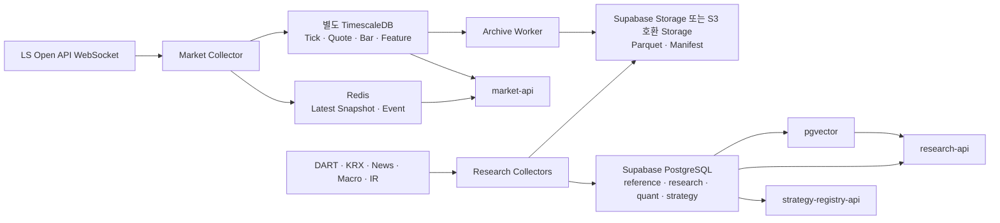

# 재일님 담당 가이드: 리서치본부 + 퀀트/백테스트본부

> 문서 상태: Team Handoff v1.4
> 최상위 기준: [HEDGE_FUND_MASTER_PLAN.md](../HEDGE_FUND_MASTER_PLAN.md)  
> 담당자: 재일님  
> 담당 조직: 리서치본부, 퀀트/백테스트본부  
> 핵심 결정: Supabase를 전사 업무 DB로 사용하고, 고빈도 시장 시계열만 별도 TimescaleDB에 저장  
> 가격 Source: LS증권 Open API  
> 참고 구현: [traderjaeil-lgtm/krx-tick-collector](https://github.com/traderjaeil-lgtm/krx-tick-collector)  
> 공통 기준: [RESEARCH_DATA_SOURCES_AND_LIBRARIES.md](../03-data/RESEARCH_DATA_SOURCES_AND_LIBRARIES.md), [DATA_GOVERNANCE_GUIDE.md](../03-data/DATA_GOVERNANCE_GUIDE.md)
> 공통 계약: [README.md](../README.md), [MINIMUM_SERVICE_UNIT_SPEC.md](../01-product/MINIMUM_SERVICE_UNIT_SPEC.md)
> 저장소 소유권: [REPOSITORY_DEPARTMENT_STRUCTURE.md](../02-engineering/REPOSITORY_DEPARTMENT_STRUCTURE.md)의 리서치·퀀트 경계
> Frontend 계약: [AI_OFFICE_FRONTEND_PLAN.md](../02-engineering/AI_OFFICE_FRONTEND_PLAN.md)의 Market·Research·Strategy View

---

## 1. 재일님이 만드는 영역

재일님 영역은 회사의 **투자 데이터 원천과 전략 연구 공장**이다.

리서치본부는 외부 시장·공시·뉴스·거시 데이터를 수집·정규화해 다른 본부가 신뢰할 수 있는 `Research Packet`과 `Evidence`를 만든다. 퀀트/백테스트본부는 이 데이터를 Point-in-Time Dataset으로 고정하고 전략을 백테스트해 배포 가능한 `Strategy Bundle`을 만든다.

재일님 담당 범위:

- LS Open API 체결·10단계 호가 수집과 시계열 저장
- Instrument Master, 거래일 Calendar와 종목 Mapping
- DART/KRX/KIND, 뉴스, 거시경제와 기업 IR 수집
- 문서 정규화, 중복 제거, Entity Resolution과 RAG Index
- Bar, Microstructure와 Research Feature 생성
- Point-in-Time Dataset, Backtest, Experiment와 Strategy Registry 후보 생성
- 데이터 품질, Archive, Backfill과 Lineage 관리
- 다른 본부에 `market-api`, `research-api`, `strategy-registry-api` 제공

담당하지 않는 범위:

- 실시간 주문 전송과 OMS 상태 변경
- Risk 승인과 Limit 변경
- Position, Ledger, PnL와 NAV 확정
- 자기 전략의 Production 승격 최종 승인
- Agent가 임의로 외부 Website나 Vendor API를 호출하는 기능

### 저장소 소유권

| 구분 | 현재 경로 | 구 경로 |
|---|---|---|
| 리서치 Hermes | `departments/01-research/hermes/` | `orchestration/hermes/research-department/` |
| Market Event 계약 | `departments/01-research/contracts/market_events.py` | — (신규, Sprint J0) |
| 수집 Source Registry | `departments/01-research/collectors/source_registry.py` | — (신규, Sprint J1) |
| 시장 시계열 Repository | `departments/01-research/repository/market_repository.py` | — (신규, Sprint J0) |
| 로컬 시계열 DB 구성 | `docker-compose.yml`, `timescaledb/local-dev/` | — (신규, 로컬 개발 전용) |
| 뉴스 수집 Baseline | `departments/01-research/collectors/news.py` | `fetch_news.py` |
| LS API 계약 | `docs/06-integrations/ls-openapi/` | — (문서 위치 유지, 리서치본부가 내용 Owner) |
| 시장 시계열 Migration | `timescaledb/migrations/` | — (도구 표준 경로 유지, 리서치본부가 Schema Owner) |
| 퀀트 Hermes | `departments/04-quant-backtest/hermes/` | `orchestration/hermes/quant-backtest-department/` |
| 연구 자료 | `references/` | — (저작권·공유 범위 ADR 전까지 현재 위치 유지, 이동 안 함) |

11절 단계 1~3(REPOSITORY_DEPARTMENT_STRUCTURE.md)이 완료되어 `departments/01-research/`가 실행 기준이다.
구 경로(`runpy` 기반 임시 CLI 호환 Wrapper)는 예정(2026-10-31)보다 일찍 삭제됐다 — 더 이상 존재하지 않는다.
`supabase/migrations/`와 `timescaledb/migrations/`는 본부별로 복제하지 않는다.

### Hermes 자기 개선 책임

- 리서치 Hermes는 누락 Source, 중복 문서, 잘못된 Entity Mapping과 인용 실패를 `ImprovementCandidate`로 등록한다.
- 퀀트 Hermes는 Dataset Drift, 재현 실패, 비용 모델 오차와 Backtest-Live 차이를 근거와 함께 등록한다.
- 두 본부의 Memory에는 공식 시장 수치나 Backtest 결과 원문을 복제하지 않고 `dataset_id`, `experiment_id`, `evidence_id`와 재검사 Checklist만 남긴다.
- 승인된 수집·검증 절차만 Versioned Skill로 배포하며, 자신의 Strategy 또는 Skill 후보를 스스로 Paper/Production에 승격하지 않는다.
- 효과는 데이터 품질, PIT 재현율, 인용 정확도, 처리 지연과 비용으로 평가한다. 수익률 하나만으로 Skill을 채택하지 않는다.

조직 공통 상태 전이와 승인 책임은 [마스터 플랜 5.10](../HEDGE_FUND_MASTER_PLAN.md#510-hermes-memory-기반-조직-재귀적-자기-개선)을 따른다.

### 1.1 Multi-Strategy 책임

재일님 팀은 특정 전략을 미리 고르는 팀이 아니라 **각 전략이 실제로 연구 가능한지 데이터로 증명하는 팀**이다.

- Strategy Candidate마다 `required_data_product_ids`와 최소 History를 등록한다.
- Long/Short에는 Borrow·공매도 데이터, Event Driven에는 공시·조건·상태 시각, Pair에는 동기화 가격과 Corporate Action, Derivatives에는 Contract·Margin·Chain 입력을 연결한다.
- Strategy Family별 Dataset Builder와 Backtest Adapter는 달라도 Dataset Manifest, PIT 검사, 비용 모델과 결과 Schema는 공통으로 유지한다.
- 데이터 Coverage, 사용권, 품질 또는 Live Parity가 부족하면 `RESEARCH_BLOCKED`, `SHADOW_ONLY` 또는 `PAPER_ONLY` 사유를 Strategy Registry에 반환한다.
- 수집 데이터로 만들 수 있는 전략 가설은 Catalog에 계속 추가하되, 자신의 Backtest 결과만으로 Paper/Live 승격을 확정하지 않는다.

P0 완료 시 Long/Short Equity, Market Neutral/Pairs, Event Driven과 Quant Trend·Mean Reversion의 대표 Fixture를 같은 Dataset/Experiment 계약으로 재현해야 한다.

---

## 2. DB 구성 결정

### 2.1 권장 구조



### 2.2 TimescaleDB를 Supabase와 분리하는 이유

Supabase PostgreSQL은 Instrument, 문서 Metadata, 재무 Fact, Dataset Manifest, Experiment와 Strategy Version을 관리한다. 초당 대량 적재되는 Tick/Quote는 별도 TimescaleDB가 담당한다.

중요한 운영 결정:

- Supabase의 TimescaleDB Extension에 신규 구조를 종속시키지 않는다.
- Supabase 공식 문서 기준 TimescaleDB Extension은 PostgreSQL 17 Project에서 Deprecated 상태다.
- 별도 TimescaleDB Container 또는 Managed Timescale을 사용하고 `MarketDataRepository` Interface로 감싼다.
- 다른 본부는 TimescaleDB Credential을 받지 않고 `market-api`만 호출한다.
- Supabase와 TimescaleDB를 실시간 Cross-DB Join하지 않는다. `instrument_id`, `dataset_id`, `as_of`로 Application 계층에서 연결한다.

### 2.3 저장소별 역할

| 저장소 | 저장할 데이터 | 저장하지 않을 데이터 |
|---|---|---|
| TimescaleDB | Tick, 10단계 Quote, Bar, Market Breadth, 고빈도 Feature | 뉴스 본문, Strategy 승인, Agent Memory |
| Redis | 최신 Snapshot, Feature, Event Stream, Dedup Key, Job Lease | 영구 원본과 장기 Backtest History |
| Supabase PostgreSQL | Reference, 문서·재무·거시 Metadata, PIT Manifest, Experiment, Strategy 상태 | 전체 Raw Tick/Quote |
| Supabase pgvector | 권한이 확인된 Document Chunk Embedding | 유일한 원문 사본 |
| Private Object Storage | JSON/XML/XBRL/PDF 원본, Parquet, Dataset와 Model Artifact | 자주 갱신하는 상태 Row |

---

## 3. 리서치본부가 수집할 데이터

### 3.1 P0 필수 수집 목록

| Domain | 데이터 | Source | 방식·주기 | 원본 저장 | 정규화 저장 |
|---|---|---|---|---|---|
| 실시간 시세 | 전 종목 체결, 거래량, 체결 방향 | LS Open API WebSocket | 장중 실시간 | TimescaleDB + Parquet | Bar/Feature는 TimescaleDB |
| 실시간 호가 | 10단계 Bid/Ask 가격·잔량 | LS Open API WebSocket | 장중 실시간 | TimescaleDB + Parquet | Spread/Depth/OFI는 TimescaleDB |
| 시장 상태 | 지수, 상승·하락 종목 수, 거래대금, 시장 Breadth | LS/KRX 제공 범위 | 장중 실시간·주기 | TimescaleDB | `market_breadth` |
| 종목 기준정보 | 종목·시장·상장·거래상태·표준코드 | LS + KRX | 장전 + 변경 Event | Object Raw | `reference.instruments` |
| 거래 Calendar | 휴장, 장 구간, 동시호가, 만기 | KRX 공식 기준 | 연간 + 변경 확인 | Object Raw | `reference.market_calendars` |
| 공시 | 접수번호, 제목, 공시 시각, 정정 관계, 원문 | Open DART | 장중 증분 Polling | Private Storage | `research.documents` |
| 재무 | 연결/별도 재무제표와 주요 계정 | Open DART XBRL | 공시 Event 후 | XBRL/XML | `research.financial_facts` |
| 기업정보 | 법인코드, 업종, 결산월, 대표자, 주소 | Open DART/KRX | 일일·변경 | Object Raw | `reference.issuers` |
| Corporate Action | 배당, 분할·병합, 증자, 합병, 상장폐지 | DART/KRX | Event + 일일 확인 | Object Raw | `reference.corporate_actions` |
| 뉴스 | 제목, URL, 출처, 게시·수정 시각, 허용된 본문 | BIGKinds/NAVER API HUB/계약 Vendor | 1~5분 또는 Provider Event | 권한별 Storage | `research.documents` |
| 거시경제 | 금리, 환율, 물가, 고용, 생산, 수출입 | ECOS/KOSIS/FRED | 발표 Calendar + 일일 확인 | Raw JSON | `research.macro_observations` |
| 기업 IR | 실적 Presentation, IR 공지와 첨부 | DART/KIND/회사 공식 IR | Event/일일 | Private Storage | `research.documents` |

### 3.2 P1 이후 수집 후보

| 데이터 | 필요한 이유 | 도입 조건 |
|---|---|---|
| Consensus와 실적 추정치 | Surprise와 Revision Factor | 기계 수집·모델 입력 권한이 있는 Vendor 계약 |
| Transcript | 경영진 Guidance와 Tone | 전문 저장·Embedding 권한 확인 |
| 공매도·대차·대주 | Crowding과 Short Constraint | 안정적 공식·계약 Feed 확보 |
| 외국인·기관 수급 세분 | Flow 전략과 Regime | PIT History와 데이터 정의 확인 |
| ETF 구성종목 | Look-through Exposure | 변경 이력과 Effective Time 제공 |
| 신용등급·채권·CDS | Credit Risk와 Funding Regime | 라이선스와 Coverage 확인 |
| Supply Chain/Alternative Data | Event·산업 선행지표 | Incremental Alpha와 비용 검증 |

### 3.3 수집하지 말아야 할 것

- LS와 의미가 다른 가격 Source를 같은 `price` Column에 조용히 혼합
- Website 비공개 Endpoint를 공식 API처럼 운영
- 기사 본문 사용권 없이 전문을 Storage·Vector DB에 적재
- 현재 최신 재무·거시 값을 과거 전 기간 Backtest에 사용
- 종목코드 문자열을 영구 Primary Key로 사용
- Agent가 API Key를 들고 직접 Crawling

---

## 4. TimescaleDB 상세 설계

### 4.1 필수 Hypertable

#### `market_ticks`

| Column | Type | 설명 |
|---|---|---|
| `event_time` | `timestamptz` | 거래소 Event 시각, Partition Key |
| `received_at` | `timestamptz` | Collector 수신 시각 |
| `instrument_id` | `uuid` | Supabase Instrument Master의 내부 ID |
| `market` | `text` | KRX/NXT 등 Venue |
| `price` | `numeric` 또는 검증된 정수 Price Unit | 체결 가격 |
| `quantity` | `bigint` | 체결 수량 |
| `side` | `smallint` | 공급자 의미를 정규화한 체결 방향 |
| `sequence_no` | `text` | 공급자 Sequence 또는 Payload Identity |
| `source_event_id` | `text` | 멱등 적재용 Hash |
| `raw_flags` | `jsonb` | 정정·장 구간·예외 Flag |

권장 Index: `(instrument_id, event_time desc)`, `(source_event_id, event_time)` Unique. Hypertable Unique Constraint에는 시간 Partition Column을 포함한다.

#### `market_quotes`

| Column | Type | 설명 |
|---|---|---|
| `event_time` | `timestamptz` | 호가 Event 시각 |
| `received_at` | `timestamptz` | 수신 시각 |
| `instrument_id` | `uuid` | 내부 종목 ID |
| `market` | `text` | Venue |
| `bid_prices` / `ask_prices` | Array 또는 10단계 정규 Column | 호가 가격 |
| `bid_sizes` / `ask_sizes` | Array 또는 10단계 정규 Column | 호가 잔량 |
| `spread` | `numeric` | Best Ask - Best Bid |
| `depth_imbalance` | `double precision` | 표준식으로 계산한 불균형 |
| `sequence_no` | `text` | 공급자 Sequence |
| `source_event_id` | `text` | 멱등 Event ID |

Array와 단계별 Column 중 하나를 성능 Benchmark로 확정한다. Raw Payload JSON만 저장해 Query 시 매번 파싱하는 방식은 사용하지 않는다.

#### 집계·Feature Table

- `bars_1s`, `bars_1m`, `bars_5m`, `bars_1d`
- `microstructure_features`
- `market_breadth`
- `data_quality_windows`

Bar와 반복 집계는 Timescale Continuous Aggregate를 우선 검토한다. 가장 최신 미완성 Bucket 처리, Refresh Window와 Raw Retention Window가 겹치지 않도록 테스트한다.

### 4.2 시간 Column 규칙

모든 Observation은 다음 시각을 구분한다.

- `event_time`: 거래소·공시기관에서 실제 발생한 시각
- `published_at`: 외부에 공개된 시각
- `received_at`: Collector가 받은 시각
- `observed_at`: 우리 시스템이 검증 후 사용할 수 있게 된 시각
- `valid_from`, `valid_to`: Reference/Policy가 유효한 기간

Backtest는 `event_time`이 아니라 전략이 실제 알 수 있었던 `observed_at <= decision_time` 조건을 지켜야 한다.

### 4.3 Retention과 Archive

초기 제안값이며 실제 일일 용량과 비용 측정 후 변경한다.

| 데이터 | Timescale Hot 보존 | 장기 보존 | 삭제 조건 |
|---|---|---|---|
| Raw Tick/Quote | 30~90일 | 일별 Parquet | Row Count·Min/Max·Hash Manifest 일치 |
| 1초 Bar/Feature | 6~12개월 | Parquet | Backtest Snapshot 재현 확인 |
| 1분 이상 Bar | 3년 이상 또는 전체 | Parquet 복제 | 별도 승인 |
| DQ Window | 1년 | Incident 관련 자료 영구/정책 기준 | Finding 종료와 보존정책 확인 |

Timescale Raw를 삭제하기 전에 `exported`, `verified`, `manifest_signed`가 모두 참이어야 한다. Aggregate Refresh가 이미 삭제된 Raw 구간을 다시 덮어 집계까지 지우지 않는지 회귀 테스트한다.

---

## 5. Supabase Schema와 Table

### 5.1 `reference` Schema

| Table | 핵심 Column | 쓰기 주체 | 비고 |
|---|---|---|---|
| `instruments` | `instrument_id`, `asset_class`, `market`, `currency`, `listed_from/to`, `status` | Reference Service | 영구 내부 ID |
| `instrument_symbols` | `instrument_id`, `provider`, `symbol`, `valid_from/to` | Reference Service | LS/DART/KRX Mapping |
| `issuers` | `issuer_id`, `corp_code`, `name`, `industry`, `fiscal_month` | Reference Service | 종목과 발행사 분리 |
| `market_calendars` | `market`, `trade_date`, `session_type`, `open/close_at` | Calendar Service | 공식 변경 Version 보존 |
| `corporate_actions` | `action_id`, `instrument_id`, `type`, `announce/ex/effective_at`, `ratio`, `cash` | Corporate Action Service | 정정 관계 포함 |
| `data_sources` | `source_id`, `owner`, `license`, `retention`, `allowed_uses` | Data Steward | Source Registry |

### 5.2 `research` Schema

| Table | 핵심 Column | 관리 원칙 |
|---|---|---|
| `documents` | `document_id`, `source_id`, `external_id`, `issuer_id`, `published_at`, `observed_at`, `status` | Metadata와 현재 상태 |
| `document_versions` | `version_id`, `document_id`, `content_hash`, `object_path`, `parser_version` | 수정·삭제를 덮어쓰지 않음 |
| `document_relations` | `from_id`, `to_id`, `relation_type` | 정정·원출처·Syndication |
| `story_clusters` | `cluster_id`, `canonical_document_id`, `event_type`, `first_seen_at` | 중복 기사 묶음 |
| `financial_facts` | `issuer_id`, `account`, `period`, `scope`, `value`, `unit`, `published_at`, `revision` | PIT Query 가능 |
| `macro_series` | `series_id`, `source`, `unit`, `frequency`, `seasonal_adjustment` | Series 정의 Version |
| `macro_observations` | `series_id`, `period`, `value`, `published_at`, `vintage_date`, `revision` | Revision Append |
| `evidence_chunks` | `chunk_id`, `version_id`, `text`, `embedding`, `start/end`, `license_scope` | pgvector + Metadata Filter |
| `research_packets` | `packet_id`, `instrument_id`, `as_of`, `claims`, `evidence_ids`, `invalidation`, `trace_id` | Agent 공식 산출물 |

### 5.3 `quant`와 `strategy` Schema

| Table | 핵심 Column | 관리 원칙 |
|---|---|---|
| `quant.universe_versions` | `universe_id`, `as_of`, `rules`, `member_manifest_path`, `hash` | 당시 거래 가능 집합 고정 |
| `quant.feature_specs` | `feature_id`, `definition`, `inputs`, `lookback`, `code_version` | Feature 정의와 코드 연결 |
| `quant.dataset_manifests` | `dataset_id`, `as_of`, `source_versions`, `partitions`, `hash`, `object_path` | Dataset 자체보다 Manifest 중심 |
| `quant.experiments` | `experiment_id`, `hypothesis_id`, `dataset_id`, `code_version`, `seed`, `status` | 재현 단위 |
| `quant.experiment_metrics` | `experiment_id`, `split`, `metric`, `value`, `cost_model_version` | Train/Validation/Test 분리 |
| `quant.model_artifacts` | `model_id`, `experiment_id`, `artifact_path`, `signature`, `limitations` | Binary는 Storage |
| `strategy.candidates` | `candidate_id`, `experiment_id`, `strategy_family`, `directionality`, `mandate`, `risk_assumptions`, `status` | Release 후보 |
| `strategy.capability_profiles` | `profile_id`, `required_data`, `instruments`, `execution`, `risk`, `accounting`, `environment_status` | 환경별 실행 적격성 |
| `strategy.versions` | `strategy_id`, `version`, `family`, `artifact_hash`, `capability_profile_id`, `effective_from/to`, `deployment_state` | 승인 후 불변 Version |

### 5.4 Private Storage Bucket

- `research-raw-private`: API 원본 JSON/XML/HTML, 수집 일자 Partition.
- `research-documents-private`: PDF/XBRL/IR와 Version별 Content.
- `market-archive-private`: Tick/Quote/Bar Parquet와 Manifest.
- `quant-datasets-private`: PIT Dataset Partition과 Manifest.
- `model-artifacts-private`: Model, Strategy Bundle, Report와 Signature.

Bucket을 Public으로 만들지 않는다. `storage.objects` RLS로 Service Identity와 승인된 연구 역할만 접근시키고 Signed URL은 짧은 만료시간을 사용한다. Supabase Database Backup이 Storage Object 자체까지 복구해 준다고 가정하지 말고 별도 Object Versioning·복제·복구 훈련을 둔다.

---

## 6. API와 Event 계약

### 6.1 다른 본부에 제공할 API

| API | 주요 Method | 소비자 |
|---|---|---|
| `market-api` | `get_snapshot`, `get_bars`, `get_microstructure`, `get_breadth`, `get_dq` | 전 본부 |
| `research-api` | `get_packet`, `get_facts`, `search_documents`, `get_evidence` | 트레이딩, 퀀트, QA, CEO |
| `dataset-api` | `create_snapshot`, `get_manifest`, `verify_manifest` | 퀀트, QA |
| `strategy-registry-api` | `submit_candidate`, `get_version`, `get_deployment_state` | 퀀트, 트레이딩, 리스크, QA, CEO |

### 6.2 발행 Event

```text
market.snapshot.v1
market.feature.v1
market.data_quality.v1
research.document.v1
research.packet.v1
quant.experiment.completed.v1
strategy.candidate.v1
strategy.version.approved.v1
```

모든 Event는 `event_id`, `event_type`, `schema_version`, `occurred_at`, `observed_at`, `producer`, `trace_id`, `payload_ref`를 포함한다. 대용량 문서·Dataset을 Event Body에 넣지 않는다.

### 6.3 AI Office 제공 계약

- `Market`에는 LS Session, 구독 종목 수, 초당 처리량, 마지막 수신 시각, Sequence Gap, Stale 수와 Data Quality 상태를 제공한다.
- `Research`에는 `case_id`, `instrument_id`, Event, Research Packet, Evidence·Citation, `as_of`, `quality_status`와 Retraction 상태를 제공한다.
- `Strategy Factory`에는 Candidate, Dataset·Experiment Version, Backtest Metric, 비용 모델, QA 상태와 Shadow/Paper Deployment 상태를 제공한다.
- Pixel Office에는 Tick·10단계 호가 원문을 보내지 않고 1초 이상 집계 Feed Health와 Attention Event를 제공한다.
- Frontend가 TimescaleDB를 직접 조회하지 않도록 `market-api`, `research-api`와 `strategy-registry-api`의 Read Model을 제공한다.

---

## 7. 권장 라이브러리

### 7.1 P0

| 영역 | Library | 용도 |
|---|---|---|
| API/수집 | `fastapi`, `httpx`, `websockets` | REST/WebSocket Adapter와 Serving API |
| 복원력 | `tenacity`, `aiolimiter` | Retry, Backoff와 Rate Limit |
| 계약 | `pydantic` v2 | Source Response와 Domain Contract |
| DB | `sqlalchemy` 2, `asyncpg`, `alembic` | Supabase/Timescale Repository와 Migration |
| Hot State | `redis` | Stream, Snapshot, Lease와 Dedup |
| DataFrame | `polars`, `numpy` | 정규화, Feature와 Backtest Input |
| Archive | `pyarrow`, `duckdb` | Parquet 생성·검증·Local Query |
| 문서 | `lxml`, `beautifulsoup4`, `pymupdf`, `pypdf` | XML/HTML/PDF Parsing |
| XBRL | `arelle-release` | DART XBRL Validation/Parsing |
| 한국어 | `kiwipiepy`, `rapidfuzz`, `datasketch` | Tokenize, Entity Match, Near Dedup |
| RAG | `pgvector`, `sentence-transformers` 또는 Model Gateway | Embedding과 Retrieval |
| Backtest | `vectorbt` | `BacktestEngine` Adapter의 초기 구현 |
| Test | `pytest`, `pytest-asyncio`, `hypothesis`, `testcontainers` | Contract, Property와 DB 통합 Test |
| 운영 | `structlog` | 구조화 Log와 Trace ID |

### 7.2 P1 이후

- `pandera`: Dataset Frame Contract.
- `scipy`, `statsmodels`, `scikit-learn`: 통계·Baseline ML.
- `optuna`: 제한된 Hyperparameter Trial과 Pruning.
- `mlflow`: Experiment·Dataset·Model Artifact Lineage.
- `cvxpy`: 제약 기반 Portfolio/Capacity 연구.
- `trafilatura`, `feedparser`, `PaddleOCR`: 허용된 문서 Source 처리.
- `opentelemetry-sdk`, `prometheus-client`: Collector/API/Experiment 관측성.

`lightgbm`과 `xgboost`는 둘 다 기본 설치하지 않는다. Baseline 대비 Out-of-Sample 개선과 운영 비용을 비교한 ADR 후 하나만 선택한다.

---

## 8. 데이터 관리 지침

### 8.1 공통 ID와 Version

- `instrument_id`: 전사 종목 식별자. LS Code는 Alias다.
- `source_event_id`: 재접속·재수집 중복 방지 ID.
- `document_id` + `version_id`: 문서 정체성과 내용 Version 분리.
- `dataset_id`: 고정된 Source Version과 Partition Manifest.
- `experiment_id`: Code, Config, Seed, Dataset을 묶는 실행 ID.
- `strategy_id` + `version`: 배포 가능한 불변 전략 Version.

### 8.2 데이터 품질 Rule

Market:

- Sequence Gap, Shard Heartbeat, Event Rate와 수신 지연 감시.
- Bid/Ask Cross, 호가 단계 정렬, Price Limit과 Tick Size 검증.
- 거래정지·장 구간·KRX/NXT Venue를 분리.
- Timescale Row Count와 Parquet Row Count 비교.

Document/Fact:

- DART `rcept_no` Unique와 정정 관계 누락 0.
- 원본 Hash에서 Parsed Fact까지 Lineage 100%.
- `published_at`, `observed_at`, 단위, 통화와 연결/별도 구분 필수.
- 삭제·정정·Retraction은 기존 Embedding과 Research Packet에 전파.

Quant:

- 미래 데이터 유입, Survivorship Bias와 Corporate Action 누락 검사.
- Dataset Manifest Hash와 재실행 결과 비교.
- Train/Validation/Test와 Walk-forward 구간 분리.
- 수수료, 세금, Slippage, 지연과 거래 불가능 상태 포함.

### 8.3 Migration과 보안

- Dashboard에서 수동으로 Production Table을 수정하지 않는다.
- 모든 Schema 변경은 Alembic Migration과 Review를 거친다.
- `reference`, `research`, `quant`, `strategy`는 기본 비공개 Schema다.
- API로 노출할 View/RPC만 별도 `api` Schema에 두고 RLS와 Grant를 함께 Migration한다.
- `service_role` Key를 Browser, Agent Prompt, Notebook과 Log에 넣지 않는다.
- Collector, Parser, Quant Runner별 Service Identity와 DB Role을 분리한다.
- 연구 Notebook은 Production Write 권한 없이 Snapshot과 개인 Sandbox만 사용한다.

### 8.4 Backup과 복구

- Supabase PostgreSQL: PITR 사용 여부와 복구 절차를 월 1회 확인.
- Supabase Storage/Object Storage: DB Backup과 별도로 Versioning·복제·Restore Test.
- TimescaleDB: 일일 Backup과 Parquet Archive 양쪽에서 복구 가능해야 함.
- Redis: 유실을 전제로 Timescale/Supabase에서 최신 Snapshot을 재구축.
- 분기마다 `특정 거래일 전체 Replay` 복구 훈련 수행.

---

## 9. 첫 구현 순서

> 진행 상황 갱신: 2026-07-30. 아래 각 항목에 실제 상태를 붙인다. 상태는 코드와 검증
> 결과만 근거로 한다 — "파일이 있다"를 완료로 적지 않는다.

### Sprint J0: 저장소 경계

- **부분** Supabase `reference`, `research`, `quant`, `strategy`, `api` Schema Migration.
  `supabase/migrations/` 5개 파일에 `reference` 9 / `research` 14 / `quant` 12 / `strategy` 9개
  테이블이 정의돼 있다. 원격 Supabase Project 적용과 `api` Schema View/RPC는 미착수다.
- **완료** 별도 TimescaleDB Container와 `MarketDataRepository` Interface.
  `docker-compose.yml`(compose 프로젝트 `hedgefund`, 호스트 포트 5434)로 로컬 컨테이너를
  띄우고 PG 17.10 / TimescaleDB 2.29.0에 `001_initial_market_data.sql`을 적용했다 —
  hypertable 7개, 압축 정책 5개, Continuous Aggregate `bars_1m` 생성과
  `tests/schema/timescale_runtime_smoke.sql` 통과를 확인했다.
  Interface는 `departments/01-research/repository/market_repository.py`의
  `MarketDataRepository`(ABC)이고 `InMemoryMarketRepository`와
  `TimescaleMarketRepository` 두 구현이 같은 계약 점검을 통과한다.
- **미착수** Private Storage Bucket과 RLS.
- **완료** 공통 `instrument_id`, Time, Event Envelope Package.
  `departments/01-research/contracts/market_events.py` — `InstrumentRef`(영구 `instrument_id`,
  공급자 코드는 Alias), `ObservationTimes`(4.2의 시각 규칙), `MarketTick`/`MarketQuote`,
  `build_source_event_id`(멱등 ID), `QuarantinedEvent`, `ResearchEventEnvelope`(6.2 필드).

완료 기준:

- **확인** Supabase에서 Raw Tick Table이 생성되지 않는다.
  `supabase/migrations/`에 `market_ticks`/`market_quotes`/`raw_tick` 생성 구문이 없다.
- **부분** 다른 본부 Credential로 TimescaleDB에 접속할 수 없다.
  `timescaledb/local-dev/001_dev_roles.sql`로 `market_reader`/`market_writer`를 만들고
  마이그레이션 grant 블록을 적용했다. 검증 결과 reader는 insert 불가, writer는 delete
  불가(append-only), `public`은 `market` 스키마 usage 없음이다. 실제 Credential 발급·배포
  정책은 Infrastructure/IAM 소관이라 이 문서 범위 밖이다.
- **미확인** Storage Bucket은 익명 접근이 거부된다.

### Sprint J1: LS Market Plane

- Collector의 멱등 Event ID, Instrument Mapping과 DQ Metric.
  - **완료** 멱등 Event ID — `build_source_event_id()`가 provider·symbol·`event_time`(UTC 정규화)·
    payload identity로 결정론적 해시를 만들고, 적재는 마이그레이션의
    `primary key (event_time, source_event_id)`에 `on conflict do nothing`으로 붙는다.
    재적재 건수를 `WriteResult.duplicates`로 세어 돌려주므로 중복과 Gap을 구분할 수 있다.
  - **미착수** Instrument Mapping (`reference.instrument_symbols` 조회 계층).
  - **부분** DQ Metric — `find_sequence_gaps()`와 `Snapshot.freshness`/`quality_flags`가 있다.
    Shard Heartbeat, Event Rate, Timescale↔Parquet Row Count 비교는 미착수다.
- **완료** Tick/Quote Hypertable과 1분 Bar. 위 J0 항목의 마이그레이션 적용에 포함된다.
- **미착수** Redis 최신 Snapshot과 `market-api`.
  `Snapshot` 계약과 Repository 조회(`get_snapshot`)까지는 있고 Redis·HTTP 계층이 없다.
- **미착수** Parquet Archive + Manifest.

또한 J1 기반으로 수집 Source Registry를 추가했다 —
`departments/01-research/collectors/source_registry.py`. 3.1/3.2의 Source를 선언적으로
등록하고 API Key 확보 상태에 따라 `AVAILABLE`/`KEY_MISSING`/`NOT_CONTRACTED`를 판정한다.
사용 불가 Source 호출은 예외이며(빈 결과를 정상으로 취급하지 않는다) 3.3의 라이선스
금지 사항은 `UseScope`로 강제한다. Source 추가는 `SOURCES`에 한 줄 등록 + `Collector`
Protocol 구현으로 끝난다.

2026-07-30 기준 판정: `AVAILABLE` 4개(LS WS/REST, Open DART, Tavily),
`KEY_MISSING` 6개(KRX, BIGKinds, NAVER, ECOS, KOSIS, FRED),
`NOT_CONTRACTED` 3개(KIND, 공매도·대차, Consensus).
**P0 Blocked Domain은 `CALENDAR`, `NEWS`, `MACRO`** — 키를 받기 전까지 이 세 Domain은
수집하지 않는다. 휴장·장 구간을 추정으로 채우지 않는다.

완료 기준:

- **부분** 장중 재접속 후 중복·Gap을 식별한다. 멱등 적재와 Sequence Gap 조회는 되지만
  실제 LS WebSocket 재접속 경로가 없어 장중 검증은 하지 못했다.
- **미착수** 특정 종목·시간 구간을 Parquet로 재현한다.
- **미착수** 트레이딩·리스크는 DB 없이 Snapshot API를 조회한다.

### Sprint J2: DART와 Research Metadata

- Corp Code/Instrument Mapping.
- 공시 원본 Archive, Version, 정정 관계.
- Financial Fact와 PIT Query.
- `research-api` Evidence 조회.

### Sprint J3: News/RAG

- Provider Adapter, License Registry와 Raw 권한.
- Exact/Near Duplicate, Story Cluster와 Entity Resolution.
- Chunk, Embedding, Citation와 Retraction 전파.

### Sprint J4: Quant Factory

- Universe/Dataset Manifest와 Snapshot Builder.
- vectorbt Adapter, 비용 포함 Backtest와 Walk-forward.
- Experiment/Metric/Artifact 저장.
- Strategy Candidate 제출과 QA Handoff.

---

## 10. 다른 팀과의 Handoff

| 받는 팀 | 제공할 것 | 계약 |
|---|---|---|
| 도현님 | Market Snapshot, Research Packet, 승인 Strategy Signal, Calendar/Instrument | API + Versioned Event |
| 동규님 | Market/DQ, Historical Risk Feature, Dataset/Strategy Evidence | Read API + Immutable Manifest |
| 영주님 | Research Coverage, Strategy Pipeline, Data Incident 요약 | 집계 Read Model |

재일님 팀은 데이터 값만 전달하지 않는다. 모든 Handoff에는 `as_of`, `freshness`, `quality_status`, `source_ids`, `schema_version`과 `trace_id`를 포함한다.

---

## 11. 완료 Definition of Done

> 2026-07-30 기준. 부분 달성은 체크하지 않고 남은 조건을 적는다 — 체크박스를 미리
> 채우면 무엇이 실제로 검증됐는지 알 수 없게 된다.

- [ ] LS Tick/Quote가 멱등하게 TimescaleDB에 적재된다.
      → 멱등 적재 자체는 완료(`build_source_event_id` + `on conflict do nothing`, 두 Repository
      구현이 재적재를 전부 `duplicates`로 셈). **LS WebSocket 수집기가 없어서** 아직 LS Tick이
      아니라 Fixture 로만 검증됐다.
- [ ] Raw Market Data가 검증된 Parquet로 Archive된다.
- [x] Supabase에는 Reference/Research/Quant Metadata만 저장된다.
      → `supabase/migrations/`에 Tick/Quote 등 Raw 시계열 Table 생성 구문이 없음을 확인했다.
- [ ] DART 정정공시와 재무 Revision을 덮어쓰지 않는다.
- [ ] 뉴스 중복과 라이선스 Scope를 관리한다.
      → 라이선스 Scope는 완료(`UseScope`로 Source별 허용 용도 강제. Tavily는 탐색 전용,
      BIGKinds는 Snippet까지, Open DART는 전문·Embedding 허용). **중복 제거와 Story Cluster는
      미착수**이며 뉴스 P0 Source(BIGKinds/NAVER) 키가 아직 없다.
- [ ] Backtest가 PIT Dataset Manifest로 재현된다.
- [ ] Strategy Candidate가 Dataset·Code·Metric·Cost Model과 연결된다.
- [ ] 다른 본부는 TimescaleDB가 아니라 Domain API로 데이터를 읽는다.
      → DB 쪽 최소권한은 준비됨(`market_reader`/`market_writer`, `public`은 스키마 usage 없음).
      **`market-api`가 없어서** 다른 본부가 읽을 경로 자체가 아직 없다.
- [ ] AI Office가 집계 Market Health와 Research·Strategy Read Model을 조회하며 Tick 원문과 TimescaleDB Credential을 받지 않는다.
- [ ] Agent와 Notebook에 Production DB/Vendor Secret이 노출되지 않는다.
      → `TIMESCALE_DATABASE_URL`은 `.env`(gitignore)에만 있고 Hermes Profile에 복사하지 않았다.
      Notebook 권한 분리와 Agent Container 정책은 미착수다.
- [ ] Backup에서 거래일 하나를 복구해 Replay할 수 있다.

---

## 12. 공식 참고 자료

- [LS증권 Open API](https://openapi.ls-sec.co.kr/)
- [Open DART 개발가이드](https://opendart.fss.or.kr/guide/main.do)
- [KRX Data Marketplace Open API](https://openapi.krx.co.kr/contents/OPP/MAIN/main/index.cmd)
- [Supabase Database](https://supabase.com/docs/guides/database/overview)
- [Supabase Row Level Security](https://supabase.com/docs/guides/database/postgres/row-level-security)
- [Supabase Storage Access Control](https://supabase.com/docs/guides/storage/security/access-control)
- [Supabase TimescaleDB Extension 주의사항](https://supabase.com/docs/guides/database/extensions/timescaledb)
- [TimescaleDB Hypertables](https://docs.timescale.com/use-timescale/latest/hypertables/)
- [TimescaleDB Continuous Aggregates](https://docs.timescale.com/use-timescale/latest/continuous-aggregates/about-continuous-aggregates/)
- [TimescaleDB Retention과 Aggregate](https://docs.timescale.com/use-timescale/latest/data-retention/data-retention-with-continuous-aggregates/)

> 재일님 영역의 최종 목표는 데이터를 많이 모으는 것이 아니다. 특정 시점에 회사가 실제로 알 수 있었던 시장·기업·뉴스 정보를 재현하고, 그 데이터로 만든 전략 실험이 동일한 결과와 근거를 다시 낼 수 있게 하는 것이다.
