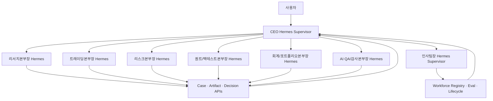

# 영주님 담당 가이드: CEO Agent + Agent Workforce 인사팀

> 문서 상태: Team Handoff v1.4
> 최상위 기준: [HEDGE_FUND_MASTER_PLAN.md](../HEDGE_FUND_MASTER_PLAN.md)  
> 담당자: 영주님  
> 담당 조직: CEO Office, CEO 직속 Agent Workforce 인사팀  
> 핵심 결정: 회사 의사결정과 Agent 조직 데이터는 Supabase PostgreSQL에 저장하고 시계열 DB를 사용하지 않음  
> Agent Runtime: CEO와 인사팀장은 서로 다른 Hermes Supervisor, Service Identity와 Memory Namespace 사용  
> 공통 기준: [AGENT_EMPLOYEE_PROFILES.md](../04-organization/AGENT_EMPLOYEE_PROFILES.md), [RESEARCH_DATA_SOURCES_AND_LIBRARIES.md](../03-data/RESEARCH_DATA_SOURCES_AND_LIBRARIES.md)
> 공통 계약: [README.md](../README.md), [MINIMUM_SERVICE_UNIT_SPEC.md](../01-product/MINIMUM_SERVICE_UNIT_SPEC.md)
> 저장소 소유권: [REPOSITORY_DEPARTMENT_STRUCTURE.md](../02-engineering/REPOSITORY_DEPARTMENT_STRUCTURE.md)의 CEO·Agent Workforce 경계
> Frontend 계약: [AI_OFFICE_FRONTEND_PLAN.md](../02-engineering/AI_OFFICE_FRONTEND_PLAN.md)의 Live Office·CEO Command Center·Agent Workforce View

---

## 1. 영주님이 만드는 영역

영주님 영역은 사용자가 하나의 개인형 헤지펀드와 대화하도록 만드는 **전사 Control Tower**와 디지털 직원의 **조직 운영 시스템**이다.

CEO Agent는 사용자 Mandate를 해석하고 업무를 각 본부에 배정하며, 본부별 결과와 충돌·차단을 하나의 설명으로 통합한다. Agent Workforce 인사팀은 업무량·품질·비용과 Skill Gap을 근거로 Agent Profile을 채용·평가·교육·이동·비활성화한다.

담당 범위:

- 사용자 Mandate, 투자 제한, 승인정책과 Preference Version 관리
- CEO Hermes의 Case Routing, Escalation과 전사 요약
- 투자위원회·전략 승격·자본 배분·중대 Incident Workflow
- 본부별 Queue, SLA, Cost와 Capacity Read Model
- Agent Registry, Job Profile, Skill/Tool Catalog와 Model 배정
- Agent 채용 요청, Candidate Eval, Shadow 수습과 Lifecycle
- Onboarding/Role Change/Offboarding 권한 요청과 Evidence
- `governance-api`, `workforce-api`, 사용자 보고 API 제공

담당하지 않는 범위:

- LS 가격, 공시, 뉴스, 거시 데이터 직접 수집
- 종목 추천이나 Order Intent 직접 생성
- Broker 주문 전송과 OMS 상태 변경
- Risk 승인, Limit 변경과 Kill Switch 단독 해제
- Ledger, Position, PnL와 NAV 수정·확정
- 자기 Candidate의 QA 최종 승인과 IAM 권한 직접 부여

### 저장소 소유권

| 구분 | 현재 경로 | 구 경로(호환 Wrapper) |
|---|---|---|
| CEO Hermes | `departments/00-ceo-office/hermes/` | `orchestration/hermes/ceo-agent/` |
| Agent Workforce Hermes | `departments/07-agent-workforce/hermes/` | `orchestration/hermes/hr-department/` |
| 전사 Workflow | `multi-agent-workflow.yaml` | — (`files:` 블록만 새 경로로 갱신, `orchestration/workflows/`로의 Workflow별 분리는 미착수) |
| Profile 동기화 | `scripts/sync_hermes_profiles.sh` | — (완료 — dept:folder Mapping으로 갱신됨) |
| Governance·Workforce Schema | `supabase/migrations/` | — (도구 표준 경로 유지, CEO·인사팀이 Domain Owner) |

11절 단계 1~3(REPOSITORY_DEPARTMENT_STRUCTURE.md)이 완료되어 `departments/00-ceo-office/`,
`departments/07-agent-workforce/`가 실행 기준이다. 구 경로는 빈 폴더로 남아 있다. `07-agent-workforce`는
정렬용 번호일 뿐 제7의 투자 본부를 뜻하지 않는다. CEO와 인사팀 Profile, Memory와 권한은 계속 분리한다.

### Hermes 자기 개선 책임

- CEO Hermes는 전사 개선 후보의 우선순위, 예산, Mandate 영향과 부서 간 충돌을 조정한다.
- 인사팀장 Hermes는 새 Agent 채용 전에 기존 Profile, Skill, Tool 또는 Workflow 확장으로 해결 가능한지 검토한다.
- 두 Agent 모두 자신의 Profile·권한·예산 변경을 단독 승인하지 않으며 QA Evidence와 분리된 승인자를 요구한다.
- 회사 공통 교훈은 개인 Memory에만 묻어 두지 않고 `ImprovementCandidate`와 Versioned Artifact로 승격시킨다.
- 성과는 조직 전체 품질, Incident 재발률, 비용, 지연과 Rollback 성공률로 평가한다.

세부 운영 흐름은 이 문서의 6.5와 [마스터 플랜 5.10](../HEDGE_FUND_MASTER_PLAN.md#510-hermes-memory-기반-조직-재귀적-자기-개선)을 따른다.

### 1.1 Multi-Strategy 책임

영주님 팀은 전략을 직접 만들거나 승인 수치를 계산하지 않는다. CEO Agent는 여러 Strategy Book을 사용자의 Mandate 안에서 조정하고, 인사팀은 전략군별 Skill·Capacity 공백을 관리한다.

- CEO는 Strategy Family별 상태, Risk Budget, 상관관계, Capacity와 중단 사유를 하나의 Portfolio View로 설명한다.
- Capital Allocation 제안은 개별 전략 수익률뿐 아니라 Drawdown, 공통 Factor, Liquidity, Borrow·Margin과 운영 신뢰도를 포함한다.
- 새 전략군의 활성화 요청은 Data, Execution, Risk, Accounting, Compliance와 QA 서명이 모두 있는 Committee Case로 처리한다.
- 인사팀은 `strategy_family x required_skill` Matrix로 기존 Agent Coverage를 먼저 검사한다.
- 새 Specialist는 반복적 Skill Gap과 Eval Fixture가 있을 때만 채용하고, 특정 유명 투자자의 말투나 의견만으로 권한을 부여하지 않는다.
- CEO와 인사팀 모두 Strategy Registry의 Capability 결과를 덮어쓰거나 Risk 거부를 해제할 수 없다.

---

## 2. CEO와 인사팀 Runtime 분리



### 2.1 CEO Hermes

- Memory Namespace: 사용자 Mandate, 승인 Preference, 전사 결정과 요약.
- Tool Allowlist: 본부 Case 생성, 공식 Read Model 조회, 승인 요청, Workflow 상태 조회.
- 금지 Tool: Broker Submit, Risk Limit Write, Ledger Write, Finding Close.
- Model: Bedrock Claude를 Production 주 모델로 사용하고 Model Gateway를 통해 호출.
- LangGraph: 투자위원회, 전략 승격, 예외 승인과 Incident Workflow 상태를 담당.

### 2.2 인사팀장 Hermes

- Memory Namespace: Agent Roster, Job Profile, Skill Gap, Eval, 비용과 Lifecycle.
- Tool Allowlist: Hiring Case, Profile Candidate, Eval 요청, Access Change 요청.
- 금지 Tool: 투자 판단, Order Intent, Production 자기 활성화, IAM 직접 변경.
- CEO와 같은 LLM Endpoint를 사용할 수 있지만 Prompt, Memory, Queue와 Service Token은 분리.

### 2.3 결정론적 Service

Hermes가 직접 처리하지 않는 기능:

- Case ID, 상태 전이와 SLA Timer.
- Mandate/Policy Version과 Effective Time.
- Approval Quorum과 Segregation of Duties.
- Agent Profile Version, Tool Scope와 Access Expiry.
- Queue/Cost/Latency Metric 계산.
- Notification Dedup, Audit Event와 Report Scheduling.

---

## 3. 수집·참조·생성 데이터

### 3.1 CEO Office

CEO는 외부 시장 데이터를 수집하지 않고 본부별 공식 API를 참조한다.

| 구분 | 데이터 | 원천 | 갱신 | 저장 위치 | 사용 목적 |
|---|---|---|---|---|---|
| 수집 | 사용자 목표, 금지사항, 위험 허용도, 승인 기준 | 사용자 입력 | 변경 시 | `governance.mandate_versions` | 전사 Mandate |
| 수집 | 보고 주기, 알림, 설명 수준, Timezone | 사용자 설정 | 변경 시 | `governance.user_preferences` | 개인화 |
| 참조 | Research Packet와 Evidence 품질 | `research-api` | Case마다 | ID만 Decision에 연결 | 투자 안건 이해 |
| 참조 | Strategy Candidate/Version/성과 | `strategy-registry-api` | Release/일일 | Strategy ID 연결 | 승격·중단 심의 |
| 참조 | Risk Budget, Breach, Trading State | `risk-api` | 실시간 Event | Decision ID 연결 | 자본·Incident 판단 |
| 참조 | Position, Cash, PnL와 Official NAV | `portfolio-api` | 장중·일일 | Snapshot ID 연결 | 회사 상태·성과 |
| 참조 | QA Block, Finding, Incident | `audit-api` | Event | Finding ID 연결 | 독립 통제 반영 |
| 참조 | Agent Roster, Capacity, Eval, Cost | `workforce-api` | 일일·주간 | Report ID 연결 | 조직·예산 판단 |
| 생성 | Mandate Decision | Governance Service | 변경 시 | `governance.mandate_decisions` | 적용 범위·시점 확정 |
| 생성 | Committee Case/Decision | Committee Workflow | 안건마다 | `governance.committee_*` | 전략·자본·예외 결정 |
| 생성 | Capital Priority/Allocation Proposal | CEO Workflow | 월간·사건 | `governance.capital_allocations` | Fund/Book 예산 |
| 생성 | Escalation/Approval | Governance API | 사건 | `governance.escalations`, `approvals` | 책임·기한 추적 |
| 생성 | Daily/Weekly Report | Reporting Worker | 정기 | Metadata + Private Storage | 사용자 보고 |

CEO에게 Raw Tick, 전체 뉴스 본문, 모든 Agent Trace와 전체 Journal을 전달하지 않는다. 각 본부가 계산한 공식 Snapshot과 중요한 Evidence Reference만 제공한다.

### 3.2 Agent Workforce 인사팀

| 구분 | 데이터 | 원천 | 갱신 | 저장 위치 | 사용 목적 |
|---|---|---|---|---|---|
| 참조 | 본부별 Case Arrival, Queue, 처리시간, Retry | Workflow Telemetry | 실시간·일일 집계 | `workforce.capacity_snapshots` | 병목·채용 수요 |
| 참조 | Agent 품질, Eval, Finding, Incident | `audit-api`, Eval Store | Eval/Event | Reference ID 저장 | 수습·교육·비활성화 |
| 참조 | Token, Model, Tool, Infra 비용 | Model Gateway/Cost Ledger | Run·일일 | `workforce.cost_snapshots` | Budget·효율 |
| 참조 | Tool/Data Permission과 만료 | Entitlement API | 변경 Event | `workforce.access_assignments` | Joiner/Mover/Leaver |
| 수집 | 본부장 Hiring Requisition | 각 본부장 | 사건 | `workforce.hiring_requests` | 수요 검토 |
| 생성 | Job Profile/Skill Manifest | Profile Builder | Version 변경 | `workforce.agent_profile_versions` | 실행 가능한 역할 정의 |
| 생성 | Candidate Configuration | Recruiter Workflow | 채용마다 | `workforce.candidates` | Model+Prompt+Tool 비교 |
| 생성 | Selection/Probation Review | HR + QA Eval | 단계마다 | `workforce.selection_reviews` | 활성화 결정안 |
| 생성 | Learning/PIP/Role Change | Performance Workflow | Review | `workforce.performance_actions` | 개선·이동 |
| 생성 | Onboarding/Offboarding Case | Lifecycle Service | 입사·이동·퇴직 | `workforce.lifecycle_events` | 권한·업무 회수 |
| 생성 | Workforce Plan/Budget | Workforce Analytics | 주간·월간 | `workforce.plans` | 인력·비용 계획 |

인사팀은 투자 수익률만으로 Agent를 평가하지 않는다. 역할별 품질, 통제, 비용과 SLA를 함께 평가한다.

---

## 4. Supabase DB 설계

### 4.1 Schema

| Schema | 소유 서비스 | 설명 |
|---|---|---|
| `governance` | Mandate/Committee/Approval Service | 사용자 정책, 전사 Case, 결정, 자본, Escalation |
| `workforce` | Agent Registry/Lifecycle Service | 조직, Profile, Skill, Eval Reference, 비용, 상태 |
| `api` | Governance/Workforce Read API | 역할별 View와 제한된 RPC |
| `auth` | Supabase 관리 | 사용자 로그인; 직접 Application Table로 사용하지 않음 |
| `storage` | Supabase 관리 | Private Report, Profile Artifact와 Handover Evidence |

### 4.2 `governance` 핵심 Table

#### 사용자와 Mandate

| Table | 핵심 Column | 관리 원칙 |
|---|---|---|
| `user_profiles` | `user_id`, `display_name`, `timezone`, `status` | `auth.users`와 1:1, 민감정보 최소화 |
| `user_preferences` | `user_id`, `report_schedule`, `notification`, `explanation_level`, `version` | 투자 Mandate와 분리 |
| `mandates` | `mandate_id`, `user_id`, `fund_id`, `status`, `current_version` | Container Record |
| `mandate_versions` | `version_id`, `mandate_id`, `objective`, `allowed_assets`, `forbidden_assets`, `risk_bounds`, `approval_rules`, `effective_from/to` | 덮어쓰기 금지 |
| `mandate_decisions` | `decision_id`, `version_id`, `decision`, `conditions`, `approved_by`, `trace_id` | 적용 Evidence |

Mandate의 자연어 원문과 구조화 정책을 함께 보존한다. 실제 System Enforcement는 구조화된 Policy Field만 사용하고 자연어는 설명·검토용이다.

#### 전사 Case와 위원회

| Table | 핵심 Column |
|---|---|
| `cases` | `case_id uuid`, `display_id`, `case_type`, `priority`, `status`, `owner_department`, `due_at`, `trace_id` |
| `investment_cases` | `case_id PK/FK`, Trigger·Mandate·Snapshot·Decision·Order Pointer | 투자 Case 전용 Subtype |
| `case_artifacts` | `case_id`, `artifact_type`, `artifact_id`, `artifact_version`, `producer`, `created_at` |
| `case_events` | `event_id`, `case_id`, `sequence`, `from/to_status`, `actor`, `reason`, `idempotency_key`, `payload`, `occurred_at` |
| `committee_sessions` | `session_id`, `committee_type`, `case_id`, `opened/closed_at`, `status` |
| `committee_votes` | `session_id`, `department`, `decision`, `conditions`, `artifact_ids` |
| `committee_decisions` | `decision_id`, `session_id`, `decision`, `scope`, `valid_until`, `dissent`, `approvals` |
| `approvals` | `approval_id`, `object_type/id`, `required_role`, `decision`, `actor`, `expires_at` |
| `escalations` | `escalation_id`, `case_id`, `reason`, `severity`, `target`, `due_at`, `status` |

#### 자본과 보고

| Table | 핵심 Column |
|---|---|
| `capital_priorities` | `priority_id`, `fund_id`, `objective`, `effective_from/to`, `status` |
| `capital_allocations` | `allocation_id`, `fund/book/strategy`, `amount`, `currency`, `risk_budget_id`, `effective_from/to`, `approval_id` |
| `report_runs` | `report_id`, `type`, `as_of`, `source_snapshot_ids`, `template_version`, `object_path`, `hash`, `status` |
| `notifications` | `notification_id`, `event_type`, `recipient`, `dedup_key`, `sent_at`, `status` |

CEO는 `capital_allocations`을 승인 제안할 수 있지만 Position이나 Broker Cash를 직접 수정하지 않는다. 실제 Book Allocation 반영은 회계/포트폴리오 Service가 승인 Event를 소비해 수행한다.

Case Schema의 필드·키·Event 불변식은 [Minimum Service Unit Specification](../01-product/MINIMUM_SERVICE_UNIT_SPEC.md)을 Canonical Contract로 사용한다. `governance.cases`를 별도로 복제하지 않는다.

### 4.3 `workforce` 핵심 Table

#### 조직과 Catalog

| Table | 핵심 Column |
|---|---|
| `departments` | `department_id`, `name`, `supervisor_agent_id`, `mission`, `status` |
| `skills` | `skill_id`, `name`, `version`, `input/output_schema`, `owner`, `status` |
| `tools` | `tool_id`, `name`, `scope`, `risk_level`, `owner`, `schema_version` |
| `models` | `model_id`, `provider`, `model_name`, `capabilities`, `cost_policy`, `allowed_env` |
| `role_templates` | `role_id`, `department`, `mission`, `required_skills`, `forbidden_actions`, `kpi` |

#### Agent Profile과 Version

```text
agent_profiles
  agent_id uuid primary key
  employee_code text unique
  department_id uuid
  role_id uuid
  display_name text
  employment_status text
  current_version integer
  owner_user_id uuid
  backup_owner_user_id uuid

agent_profile_versions
  profile_version_id uuid primary key
  agent_id uuid
  version integer
  model_id uuid
  prompt_artifact_path text
  skill_manifest jsonb
  tool_allowlist jsonb
  data_scopes jsonb
  memory_namespace text
  token_budget jsonb
  sla jsonb
  eval_requirements jsonb
  forbidden_actions jsonb
  artifact_hash text
  effective_from timestamptz
  effective_to timestamptz null
  status text
```

같은 `agent_id`가 Version 변경으로 성장한다. Prompt 내용만 바꾸고 Version을 유지하는 방식은 금지한다.

#### 채용·평가·Lifecycle

| Table | 핵심 Column |
|---|---|
| `hiring_requests` | `request_id`, `department`, `business_problem`, `evidence`, `required_capabilities`, `budget`, `status` |
| `candidates` | `candidate_id`, `request_id`, `profile_config`, `expected_cost`, `status` |
| `selection_reviews` | `review_id`, `candidate_id`, `eval_run_id`, `champion_comparison`, `decision`, `conditions` |
| `probation_periods` | `probation_id`, `agent/profile_version`, `stage`, `start/end`, `success_metrics`, `result` |
| `performance_reviews` | `review_id`, `agent_id`, `period`, `role_metrics`, `cost`, `findings`, `decision` |
| `performance_actions` | `action_id`, `agent_id`, `type`, `plan`, `due_at`, `verification`, `status` |
| `lifecycle_events` | `event_id`, `agent_id`, `event_type`, `from/to_status`, `approvals`, `occurred_at` |
| `access_requests` | `request_id`, `agent_id`, `tool/data/environment`, `scope`, `expires_at`, `approvals`, `status` |
| `access_assignments` | `assignment_id`, `agent_id`, `resource`, `scope`, `effective_from/to`, `provisioning_ref` |

#### Capacity와 비용

| Table | 핵심 Column |
|---|---|
| `capacity_snapshots` | `department/agent`, `window`, `arrivals`, `queue_p95`, `duration_p95`, `retry/error`, `utilization` |
| `quality_snapshots` | `agent/profile_version`, `window`, `eval`, `finding`, `rework`, `role_kpi` |
| `cost_snapshots` | `agent/profile_version`, `window`, `tokens`, `model_cost`, `tool_cost`, `infra_cost`, `case_count` |
| `workforce_plans` | `plan_id`, `period`, `skill_gaps`, `actions`, `budget`, `assumptions`, `status` |

---

## 5. CEO 핵심 Workflow

### 5.1 사용자 Mandate 변경

```text
사용자 요청
  -> CEO Hermes가 목표·범위·위험·승인 조건 구조화
  -> Mandate Draft Version 생성
  -> Risk가 강제 가능성과 충돌 검토
  -> QA가 모순·누락·권한 검토
  -> 사용자 승인
  -> effective_from과 함께 Active
  -> 영향 Strategy/Book/Agent에 Version Event 발행
```

기존 Mandate를 Update하지 않고 새 Version을 만든다. 적용 중인 주문·전략에는 어떤 Version이 사용됐는지 남긴다.

### 5.2 전략 승격

```text
Quant Strategy Candidate
  -> Risk 검토
  -> QA 독립 Validation
  -> CEO Committee Case
  -> Approve | Conditional | Reject
  -> Shadow/Paper 배포 Event
```

CEO가 Backtest 숫자를 다시 계산하지 않는다. Quant Report, Risk Decision과 QA Finding을 모두 보존한 채 조건부 결정한다.

### 5.3 중대 Incident

```text
Risk Breach 또는 QA Incident
  -> 자동 CEO Escalation
  -> 영향 Fund/Book/Strategy 확인
  -> 신규 진입 차단 상태 확인
  -> 담당 본부와 Action Owner 지정
  -> 사용자 알림
  -> QA Verification 후 종료
```

CEO는 Incident를 “정상”으로 직접 닫지 않는다. Risk/QA 해제 조건과 Authorized Operator 승인이 필요하다.

### 5.4 Daily Report

필수 Section:

- Fund/Book별 Position, Cash, PnL와 NAV 상태.
- 오늘 발생한 Research Catalyst와 거래 Case.
- 주문·체결·Slippage와 비용.
- Risk Limit 사용률, Breach와 Trading State.
- Strategy 성과·Drift·배포 상태.
- QA Finding, Data/Model/Service Incident.
- 결정이 필요한 사용자 Action.

Report는 각 본부 Snapshot ID를 포함해 숫자와 설명을 원천까지 추적할 수 있어야 한다.

---

## 6. 인사팀 핵심 Workflow

### 6.1 채용 판단

신규 Agent를 만들기 전 다음 순서로 판단한다.

1. Queue·SLA 문제가 실제로 반복되는가?
2. Worker 동시성이나 Token Budget 확대로 해결되는가?
3. 기존 Agent에 Skill을 추가하면 되는가?
4. 반복 수치 업무라면 결정론적 Service가 더 적합한가?
5. 독립 권한·Memory가 필요한 별도 역할인가?
6. 예상 편익이 Model·Infra·Eval·운영 비용보다 큰가?

### 6.2 Hiring Workflow

```text
본부장 Hiring Request
  -> HR Capacity/Build-vs-Extend 분석
  -> Job Profile과 Candidate 2개 이상
  -> 사전 고정된 Eval 기준
  -> QA Golden/Adversarial Eval
  -> CEO 예산·조직 승인
  -> Access Provisioning 요청
  -> Shadow Probation
  -> 정식 활성화 | 재교육 | 역할 축소 | 비활성화
```

### 6.3 Agent Profile 필수 항목

- Mission과 완료 조건.
- 입력·출력 JSON Schema.
- Required Skill과 Version.
- Tool Allowlist와 Data Scope.
- 명시적 Forbidden Action.
- Model/Prompt/Memory Namespace.
- Token, Latency, Cost와 동시성 Budget.
- Golden/Adversarial Eval Set.
- 역할별 KPI와 Probation 종료 조건.
- Owner, Backup, Expiry와 Rollback Profile.

### 6.4 Joiner/Mover/Leaver

Joiner:

- 승인된 Profile Version과 QA Decision 확인.
- Service Identity, Queue, Memory와 Tool Scope 요청.
- Shadow 환경에서 시작.
- Trace/Metric/Cost 수집 확인 후 활성화.

Mover:

- 기존 열린 Case Handoff.
- 이전 Tool/Data Scope 회수.
- 새 Profile Version과 Eval.
- Memory 보존·이관 범위 승인.

Leaver:

- Queue Lease, Token, Secret과 Tool Scope 회수.
- Production Deployment 비활성화.
- 열린 Case와 Artifact Owner 이전.
- Revocation Evidence와 종료 시각 기록.

### 6.5 조직 재귀적 자기 개선 Workflow

인사팀은 Agent 수를 늘리는 부서가 아니라 조직 능력을 Version 단위로 관리하는 부서다. 부서 Hermes가 업무를 마친 뒤 남긴 회고는 바로 Production에 반영되지 않고 다음 절차를 거친다.

```text
Case·Incident·성과 결과
  -> 부서 Hermes의 ImprovementCandidate
  -> QA Evidence 검증과 위험 분류
  -> HR Build-vs-Extend-vs-Hire 판단
  -> Skill | Profile | Workflow | Agent 후보 생성
  -> 고정 Eval과 Shadow/Champion-Challenger
  -> 권한에 맞는 승인
  -> Version 배포와 Scorecard 관찰
  -> 유지 | Rollback | Retire | 다음 Candidate
```

| 후보 유형 | 주 Owner | 필수 Gate |
|---|---|---|
| Memory 정정·만료 | 해당 본부장 Hermes | Source 확인, Audit Event |
| Skill 변경 | 해당 본부 + 인사팀 | QA Regression Eval, Shadow, Rollback Version |
| Agent Profile 변경 | 인사팀 | Tool/Data Scope Review, QA Eval, CEO 승인 |
| Workflow 변경 | CEO Office + 영향 본부 | 계약 Test, 권한 분리 검토, End-to-End Replay |
| Strategy 변경 | 리서치·퀀트 | Risk·QA Gate, Shadow/Paper, 전략위원회 승인 |

운영 불변식:

- Agent가 자기 Prompt, Skill, Model, Tool Allowlist, Memory Scope 또는 Production 권한을 직접 활성화하지 않는다.
- 후보를 만든 본부와 QA Evidence 작성·승인 역할을 분리한다. QA 자신의 후보도 독립 Reviewer가 필요하다.
- 현재 Position, Cash, PnL, Risk Limit과 주문 상태는 공식 API에서 조회하며 Hermes Memory를 Source of Truth로 사용하지 않는다.
- 활성 Version은 이전 Champion, 승인 Decision, Eval Dataset, 배포 시각과 즉시 실행 가능한 Rollback Target을 가진다.
- KPI는 수익률뿐 아니라 정확도, 재현성, Incident 재발률, 비용, 지연, 권한 위반과 Rollback 성공률을 포함한다.

현재 저장소에는 부서별 Hermes Profile과 `multi-agent-workflow.yaml` Prototype이 있다. `ImprovementCandidate` Registry, Eval Runner, Shadow Router, 승인·배포 Adapter와 Scorecard는 아직 구현 대상이며, [Core Plan의 최소 자기 개선](../01-product/HEDGE_FUND_CORE_PLAN.md#34-core에서-증명할-최소-자기-개선)부터 연결한다.

---

## 7. Supabase Auth, 권한과 RLS

### 7.1 Identity

| Identity | 권한 | 금지 |
|---|---|---|
| `svc_ceo_orchestrator` | Governance Case/Decision Proposal, 공식 Read API | OMS/Risk/Ledger Write |
| `svc_committee` | Vote/Approval Workflow 상태 | 단독 Quorum 우회 |
| `svc_workforce_registry` | Agent Profile/Lifecycle Record | IAM 직접 Provision |
| `svc_workforce_analytics` | Capacity/Cost/Quality 집계 | 원본 QA Eval 수정 |
| `svc_reporting` | 승인 Snapshot으로 Report 생성 | Source 숫자 수정 |
| CEO Hermes | Case 시작·Read·Proposal | Raw DB와 Secret |
| HR Hermes | Hiring/Profile/Access Proposal | Production 자기 활성화 |
| 사용자 | 자기 Mandate/Report/승인 요청 | 다른 사용자·Fund 접근 |

### 7.2 RLS 원칙

- Supabase Auth의 `auth.users.id`를 `governance.user_profiles.user_id`와 연결한다.
- 사용자 Row는 `user_id`, 운용 Row는 `fund_id` 기준 RLS를 적용한다.
- Agent는 사용자 JWT가 아니라 역할별 짧은 수명의 Service Token을 사용한다.
- `governance`와 `workforce` 내부 Table은 Data API에 직접 노출하지 않는다.
- `api` Schema의 View/RPC만 Expose하고 Grant와 RLS를 Migration으로 관리한다.
- `anon` 권한을 제거하고 Service Role Key를 Browser·Agent Prompt·Log에 노출하지 않는다.
- Approval/Decision/Lifecycle Event는 Append-only이며 삭제 권한을 주지 않는다.
- 인사팀 Candidate와 QA Eval 작성 역할을 분리한다.

### 7.3 Memory와 개인정보

저장 가능:

- 사용자가 명시적으로 제공한 Mandate와 Preference.
- 승인된 전사 결정과 Report Reference.
- Agent Profile, Skill, Eval과 업무 성과.

저장 금지 또는 별도 보호:

- Broker/API Secret과 Access Token.
- 불필요한 개인정보와 대화 원문 전체.
- 뉴스 전문·투자자 문서처럼 사용권이 제한된 Content.
- 다른 본부의 Raw Trace를 CEO 장기 Memory에 복제.

사용자 대화는 `conversation_id`, 요약, 결정된 Mandate/Action과 Evidence를 분리한다. 자연어 대화가 정책의 유일한 Source of Truth가 되지 않게 한다.

---

## 8. API와 Event 계약

### 8.1 제공 API

| API | 주요 Method | 소비자 |
|---|---|---|
| `governance-api` | `get_mandate`, `create_case`, `record_decision`, `request_approval`, `open/close_session`, `submit_vote` | CEO, 본부장, Risk, QA, 위원회 Workflow |
| `reporting-api` | `request_report`, `get_report`, `get_source_snapshots` | 사용자, CEO |
| `workforce-api` | `get_roster`, `request_hire`, `submit_profile`, `request_access`, `change_status`, `get_department_scorecard`, `get_skill_gap` | CEO, HR, QA, 본부장 |

### 8.2 소비 Event

```text
research.packet.v1
strategy.candidate.v1
strategy.version.approved.v1
risk.breach.v1
risk.trading_state.v1
portfolio.snapshot.v1
nav.official.v1
qa.finding.v1
incident.opened.v1
workforce.eval.v1
```

### 8.3 발행 Event

```text
governance.mandate.changed.v1
governance.case.created.v1
governance.decision.v1
governance.capital_allocation.v1
governance.escalation.v1
workforce.hiring_request.v1
workforce.profile_candidate.v1
workforce.lifecycle_changed.v1
workforce.access_request.v1
report.ready.v1
```

CEO Summary Event에 본부별 전체 Payload를 복사하지 않는다. 공식 Artifact ID, Version, 결정, 조건과 Trace만 포함한다.

### 8.4 AI Office 제공 계약

- Live Office의 8개 조직, Agent Roster, Queue, SLA, Handoff, Approval과 Incident 집계 Read Model을 제공한다.
- Agent 상세에는 Profile·Prompt·Skill·Tool·Model Version, 현재 `case_id`, Heartbeat, 비용, Eval과 Permission 만료를 제공한다.
- `DEMO`, `PAPER`, `LIVE` Mode는 Backend Session과 Fund 권한으로 결정하고 Browser Local State로 전환하지 않는다.
- CEO 승인, Strategy Promotion과 Workforce Lifecycle Command는 `governance-api`·`workforce-api`로 받고 사유, 멱등 키, 예상 Version과 Audit 결과를 보존한다.
- CEO와 인사팀 화면은 Risk·QA Block을 숨기거나 해제할 수 없다.

---

## 9. 권장 라이브러리

### 9.1 P0

| 영역 | Library/도구 | 용도 |
|---|---|---|
| Agent | Hermes Agent | CEO/HR Supervisor와 Tool/Skill 실행 |
| Workflow | LangGraph | Case, Committee, Approval, Hiring과 Resume |
| Model | `langchain-aws`, `langchain-ollama` 또는 내부 Adapter | Bedrock Claude/Ollama Model Gateway |
| API/계약 | `fastapi`, `pydantic` v2, `jsonschema` | Governance/Workforce 계약 |
| DB | `sqlalchemy` 2, `asyncpg`, `alembic` | Supabase Repository/Migration |
| Data 집계 | `polars` | Queue, SLA, Eval, Cost와 Capacity |
| API Client | `httpx`, `tenacity` | 본부 Domain API와 Retry |
| Template | `jinja2` | Daily Report, Hiring/Review 문서 |
| Queue/Cache | `redis` | Case Queue, Lease, Dedup와 상태 Cache |
| Test | `pytest`, `pytest-asyncio`, `hypothesis`, `testcontainers` | 상태 전이, 권한과 Contract Test |
| 운영 | `structlog` | Case/Agent/Approval Trace |

### 9.2 P1 이후

- `opentelemetry-sdk`, `prometheus-client`: Agent/Workflow Latency, Error와 Cost.
- `ragas`: QA가 제공하는 RAG/Tool Eval 결과를 HR Scorecard에 참조.
- `mlflow` Client: Model/Prompt/Artifact Registry Reference가 필요할 때.
- `apscheduler` 또는 Supabase Cron: Daily/Weekly Report Trigger. 장시간 Workflow 실행에는 사용하지 않음.

CEO나 인사팀 Runtime에 `numpy`, `vectorbt`, `cvxpy`, `QuantLib` 같은 투자 계산 Package를 기본 설치하지 않는다. 공식 계산 결과는 담당 본부 API에서 받는다.

---

## 10. 데이터 관리 지침

### 10.1 Version과 Effective Time

- Mandate, Approval Policy, Agent Profile, Skill, Tool Scope와 Model Assignment는 Version 관리.
- `effective_from/to`가 없는 활성 정책 금지.
- Decision은 사용한 Mandate/Artifact/Profile Version을 고정.
- 새 Version을 만들 때 이전 Version을 삭제하지 않음.

### 10.2 승인과 감사

- 모든 중요 상태 전이는 `requested_by`, `approved_by`, `occurred_at`, `reason`, `trace_id` 기록.
- CEO, Risk, QA와 Authorized Operator의 Quorum을 코드로 검증.
- 승인 만료 후 Command 재사용 금지.
- Manual Override는 사유, 범위, 만료와 사후 Review 필수.
- Finding/Incident가 열린 Agent Profile은 Promotion 금지.

### 10.3 비용과 품질

Agent별로 다음을 연결한다.

```text
agent_id
profile_version
model_id
case_type
run_id
input/output_tokens
model_cost
tool_cost
latency
result_status
eval_score
finding_count
```

비용을 줄이기 위해 Risk/QA 독립성을 제거하지 않는다. 같은 역할에서 작은 Model과 큰 Model의 Routing을 비교하고 품질 기준을 먼저 고정한다.

### 10.4 보존·백업

| 데이터 | 보존 원칙 | 복구 기준 |
|---|---|---|
| Mandate/Decision/Approval | 전체 Version 장기 보존 | 특정 시점 회사 정책 재현 |
| Committee/Case Event | 장기 Append-only | Decision Timeline 재생 |
| Agent Profile/Lifecycle | 전체 재직 이력 | 당시 권한·Model·Skill 재현 |
| Eval/Performance Reference | Profile 생명주기 이상 | 채용·비활성화 근거 확인 |
| Report Artifact | 정책·사용자 요구 기준 | Snapshot ID와 Hash 검증 |
| 사용자 대화 | 최소 보존·민감정보 정책 | 구조화 Decision과 분리 복구 |

Supabase DB Backup에는 Storage Object 복구가 별도라는 전제로 Private Report와 Profile Artifact를 Versioning·복제한다.

---

## 11. 화면과 운영 View

영주님 담당 화면은 현재 `ai-office/` Pixel Office를 8개 조직 기반 Live Office로 바꾸고, 아래 업무용 View를 함께 제공한다.

1. **CEO Overview:** NAV, PnL, Cash, Risk State, Strategy, Incident.
2. **Decision Inbox:** 사용자 승인, 위원회 안건, Escalation과 만료.
3. **Case Timeline:** 본부별 요청·Artifact·Decision·Block.
4. **Agent Roster:** 부서, 역할, Profile Version, 상태, Owner와 Cost.
5. **Hiring Pipeline:** Request, Candidate, Eval, Probation과 승인.
6. **Skill/Tool Matrix:** 역할별 Skill, Permission과 Gap.
7. **Performance:** SLA, 품질, Cost, Finding과 개선 Action.
8. **Access/Lifecycle:** Onboarding, Expiry, Revocation과 Evidence.

화면에서 Raw DB 수정 버튼을 만들지 않는다. 모든 변경은 목적이 명확한 Command와 Approval Workflow를 통한다.

---

## 12. 첫 구현 순서

### Sprint Y0: Identity와 Schema

- Supabase Auth, `governance`, `workforce`, `api` Schema.
- User/Fund/Department/Agent ID 계약.
- CEO/HR Service Identity, Memory Namespace와 Tool Allowlist.
- RLS, Grant와 Audit Event.

### Sprint Y1: Mandate와 CEO Case

- Mandate Version과 구조화 정책.
- Case/Artifact/Event와 Escalation.
- 본부 API Mock 연결.
- CEO Daily Summary.

### Sprint Y2: 위원회와 승인

- Strategy Promotion과 Capital Allocation Case.
- Vote, Quorum, Condition과 Approval Expiry.
- Risk/QA Block 우선 처리.
- 사용자 승인 Interrupt/Resume.

### Sprint Y3: Workforce Registry

- Department, Role, Skill, Tool, Model Catalog.
- Agent Profile Version과 Roster.
- Hiring Request와 Candidate Profile.
- QA Eval Reference와 Shadow Probation.

### Sprint Y4: Lifecycle/Cost/운영

- Access Request, Onboarding/Role Change/Offboarding.
- Queue/SLA/Cost/Quality Scorecard.
- Performance Action과 비활성화.
- Dashboard와 정기 Report.

---

## 13. 다른 팀과의 Handoff

| 상대 팀 | 받는 데이터 | 제공 데이터 |
|---|---|---|
| 재일님 | Research/Strategy/Data Health 요약 | Mandate, Strategy Committee Decision, 우선순위 |
| 도현님 | Position/PnL/NAV, Trading Incident | Capital Allocation, 승인정책, 사용자 Action |
| 동규님 | Risk State/Breach, QA Finding/Incident | Mandate Policy, Escalation, Finding Owner/기한 |

모든 본부에 제공할 공통 Context:

- `mandate_version_id`.
- `fund_id`, `book_id`, 필요 시 `strategy_id`.
- `case_id`, `priority`, `due_at`, `trace_id`.
- 허용된 Action과 금지된 Action.
- 필요한 Approval과 Escalation 조건.

---

## 14. 완료 Definition of Done

- [ ] CEO와 인사팀장이 별도 Hermes, Memory, Queue와 Service Identity로 실행된다.
- [ ] CEO가 모든 본부를 조정하지만 주문·Risk·Ledger·QA 권한을 갖지 않는다.
- [ ] Mandate 변경이 Version과 Effective Time으로 기록된다.
- [ ] 위원회 Case가 Artifact, Vote, Dissent, Decision과 조건을 보존한다.
- [ ] Risk/QA Block을 CEO가 우회하거나 숨길 수 없다.
- [ ] Agent Profile에 Model, Prompt, Skill, Tool, Memory, Budget와 Eval이 연결된다.
- [ ] Agent 채용·변경·비활성화가 승인된 Lifecycle Event로 남는다.
- [ ] 인사팀이 자기 Candidate를 단독 Production 활성화할 수 없다.
- [ ] 사용자·Fund·Agent별 Supabase RLS가 통합 Test를 통과한다.
- [ ] CEO/HR Agent에 Raw Market DB와 `service_role` Credential이 없다.
- [ ] AI Office의 8개 조직, Agent 상태와 승인 Inbox가 공식 Read Model에서 생성되고 `DEMO/PAPER/LIVE`가 명확히 분리된다.

---

## 15. 공식 참고 자료

- [Supabase Database](https://supabase.com/docs/guides/database/overview)
- [Supabase Row Level Security](https://supabase.com/docs/guides/database/postgres/row-level-security)
- [Supabase API Security](https://supabase.com/docs/guides/api/securing-your-api)
- [Supabase Custom Schemas](https://supabase.com/docs/guides/api/using-custom-schemas)
- [Supabase Storage Access Control](https://supabase.com/docs/guides/storage/security/access-control)
- [Supabase Cron](https://supabase.com/docs/guides/cron)

> 영주님 영역의 최종 목표는 모든 일을 CEO Agent 하나가 처리하게 만드는 것이 아니다. 사용자가 하나의 헤지펀드와 대화하는 경험을 유지하면서도, 내부에서는 각 본부의 독립 판단·차단·원장·감사 권한을 존중하고 Agent 조직 자체도 채용부터 퇴직까지 통제 가능하게 만드는 것이다.
