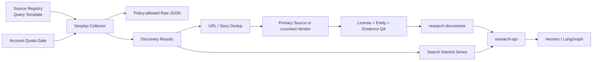
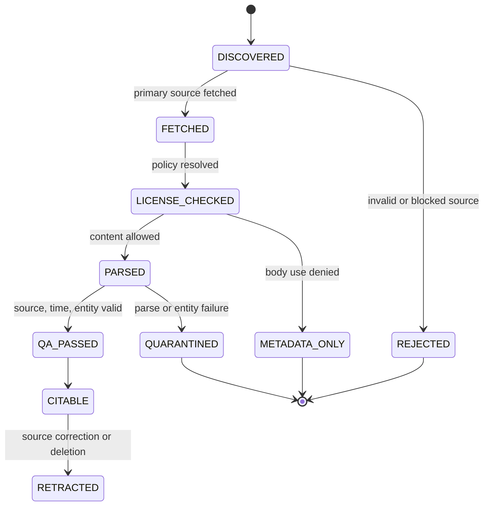

# SerpApi HgFinance 통합 계약

## 1. 목표

SerpApi를 “Agent가 인터넷을 마음대로 검색하는 도구”로 연결하지 않는다. 승인 Query와 엔진을 실행하는 중앙 Collector, 검색 결과를 원출처 Evidence로 승격하는 Research Pipeline, 그리고 Agent가 안전하게 조회하는 `research-api`로 분리한다.



## 2. 서비스 경계

| Component | 책임 | 하지 않는 것 |
|---|---|---|
| `serpapi-collector` | 승인 Query 실행, Quota, Retry, Raw/Normalized 결과 생성 | Agent 판단, 기사 본문 무단 수집 |
| `document-processor` | URL 정규화, 원출처 수집, Parsing, Entity, Dedup | Search API Key 보유 |
| `evidence-qa` | License, 시점, 출처, Claim과 품질 Gate | 주문 생성 |
| `research-api` | 승인된 검색·문서·관심도 Tool 제공 | 자유 형식 `engine` Proxy |
| Hermes | 사용자 목표와 Research Workflow 시작 | Vendor Key, DB Credential 보유 |
| LangGraph | Research·Review·Portfolio 상태 관리 | External Search 무제한 실행 |

## 3. Source Registry

엔진별 Registry 예시:

```yaml
source_id: serpapi-google-news-kr-v1
provider: serpapi
engine: google_news
status: evaluation
owner_department: research
credential_secret_ref: secret://SERPAPI_KEY
locales:
  - hl: ko
    gl: kr
query_template_ids:
  - kr-company-news-v1
freshness:
  cache_policy: adaptive
  min_poll_seconds: 300
budget:
  daily_searches: 200
  emergency_reserve: 40
  max_pages_per_query: 2
rights:
  raw_response_storage_allowed: pending_review
  snippet_storage_allowed: pending_review
  primary_body_storage_allowed: false
  embedding_allowed: false
  llm_context_allowed: false
  redistribution_allowed: false
schema:
  request_version: google-news-request-v1
  parser_version: serp-google-news-parser-v1
```

`rights`는 SerpApi 응답과 원출처 본문을 구분한다. SerpApi 계약이 검색 결과 사용을 허용해도 연결된 기사의 전문 저장·임베딩·재배포 권한까지 자동으로 생기는 것은 아니다.

## 4. Query Template

```yaml
query_template_id: kr-company-news-v1
purpose: listed_company_news_discovery
engine_allowlist:
  - google_news
  - naver
inputs:
  issuer_id:
    type: uuid
  aliases:
    type: approved_alias_list
  time_window:
    type: enum
    values: [1h, 6h, 1d]
render:
  google_news:
    q: "\"{primary_name}\" OR \"{ticker}\""
    hl: ko
    gl: kr
  naver:
    query: "\"{primary_name}\""
    where: news
    sort_by: 1
limits:
  max_aliases: 5
  max_query_chars: 200
  max_pages: 2
```

Query Template 규칙:

1. Alias는 Instrument Master와 승인된 Entity Alias에서만 가져온다.
2. 사용자가 입력한 검색 연산자를 그대로 Template에 삽입하지 않는다.
3. 종목 전체 Polling은 중요도·Event·유동성 기준으로 Scheduling한다.
4. Template Version이 바뀌면 결과 Coverage를 이전 Version과 비교한다.
5. Prompt가 Query 문자열을 직접 생성하더라도 Query Policy Validator를 통과해야 한다.

## 5. Application Contract

### 5.1 요청

```json
{
  "request_id": "01J...",
  "source_id": "serpapi-google-news-kr-v1",
  "engine": "google_news",
  "query_template_id": "kr-company-news-v1",
  "query_template_version": 1,
  "parameters": {
    "q": "\"삼성전자\" OR \"005930\"",
    "hl": "ko",
    "gl": "kr"
  },
  "freshness_policy": "ADAPTIVE",
  "execution_mode": "SYNC",
  "requested_at": "2026-07-31T09:00:00Z",
  "trace_id": "..."
}
```

### 5.2 검색 실행

```json
{
  "search_run_id": "01J...",
  "collection_run_id": "uuid",
  "provider_search_id": "...",
  "request_hash": "sha256:...",
  "status": "SUCCESS",
  "http_status": 200,
  "engine": "google_news",
  "started_at": "...",
  "completed_at": "...",
  "result_count": 21,
  "error": null,
  "raw_object_uri": "s3://research-raw/serpapi/...",
  "parser_version": "serp-google-news-parser-v1"
}
```

### 5.3 Discovery Result

```json
{
  "discovery_result_id": "01J...",
  "search_run_id": "01J...",
  "result_type": "NEWS",
  "rank": 1,
  "title": "...",
  "snippet": "...",
  "source_name": "...",
  "source_url": "https://...",
  "canonical_url": "https://...",
  "published_at": "...",
  "published_at_confidence": "HIGH",
  "observed_at": "...",
  "content_hash": "sha256:...",
  "entity_candidates": [
    {
      "issuer_id": "uuid",
      "confidence": 0.98
    }
  ],
  "evidence_status": "DISCOVERED"
}
```

## 6. 저장소 Mapping

현재 Supabase Schema를 우선 재사용한다.

| 데이터 | 저장 위치 | 규칙 |
|---|---|---|
| 수집 Job | `research.collection_runs` | `source_id`, Cursor, Record 수, 상태와 `trace_id` |
| 원출처 문서 | `research.documents` | Search Result가 아니라 실제 수집한 Source Document |
| 문서 원문·Version | `research.document_versions` | Content Hash, Object Path, License Scope |
| 종목 연결 | `research.document_instruments` | 관계 유형과 Confidence |
| Story 중복 | `research.story_clusters`, `story_cluster_members` | 검색 엔진이 달라도 같은 사건은 한 Cluster |
| RAG 청크 | `research.evidence_chunks` | License와 PIT Metadata가 허용된 문서만 |
| Raw JSON | Private Object Storage | Registry가 허용한 Source만, API Key 제거 |
| 관심도 시계열 | TimescaleDB 신규 Migration 후보 | Query·Geo·Window·Version을 Key에 포함 |

### 6.1 추가 Migration 후보

Evaluation 단계에서 다음 두 Table이 필요하면 별도 Migration과 ERD Review를 거친다.

```text
research.search_runs
  search_run_id
  collection_run_id
  engine
  request_hash
  provider_search_id
  parameters_redacted
  status
  http_status
  result_count
  raw_object_uri
  error
  started_at
  completed_at

research.discovery_occurrences
  discovery_occurrence_id
  search_run_id
  canonical_url_hash
  result_type
  rank
  title
  snippet
  source_name
  published_at
  observed_at
  raw_result_hash
  promoted_document_id
  evidence_status
```

검색 결과마다 `research.documents`를 즉시 만들지 않는다. 원출처가 수집돼 Document 계약을 충족했을 때만 `promoted_document_id`를 연결한다.

## 7. Evidence 상태 머신



AI Mode·AI Overview의 생성 답변은 `DISCOVERY_ONLY`에서 더 올라갈 수 없다. 답변의 Reference URL을 별도 원출처 문서로 수집해야 한다.

## 8. Research API Tool

### 8.1 허용 Tool

```text
search_discovery(
  query_template_id,
  entity_ids,
  as_of,
  time_window,
  provider_policy
)

get_research_documents(
  entity_ids,
  document_types,
  as_of,
  evidence_status=CITABLE
)

get_attention_series(
  topic_id,
  geo,
  window,
  as_of
)

get_research_source_coverage(
  query_template_id,
  period
)
```

### 8.2 금지 Tool

```text
serpapi_proxy(engine, arbitrary_parameters)
search_with_api_key(api_key, ...)
fetch_any_url_and_embed(...)
google_finance_price(...)
```

Tool 응답에는 다음을 포함한다.

- `as_of`
- `observed_at`
- `source_id`
- `query_template_version`
- `document_id` 또는 `discovery_result_id`
- `evidence_status`
- `license_scope`
- `freshness`

## 9. Retry와 Circuit Breaker

```text
400/401/403/404/410
  -> no automatic retry
  -> configuration or credential finding

429
  -> Account API check
  -> hourly limit: jitter backoff
  -> monthly quota: stop non-emergency jobs

500/503/Processing timeout
  -> exponential backoff with jitter
  -> max attempts
  -> provider circuit open
```

Provider Circuit가 열려도 Google Finance로 LS 가격을 대체하거나 AI Mode 답변으로 News Evidence를 대체하지 않는다. 각 데이터 Domain의 대체 Source는 별도 정책으로 결정한다.

## 10. 관측성

Metric:

```text
serpapi_requests_total{engine,status}
serpapi_request_latency_seconds{engine}
serpapi_results_total{engine,type}
serpapi_unique_urls_ratio{engine}
serpapi_duplicate_ratio{engine}
serpapi_primary_source_fetch_ratio{engine}
serpapi_citable_promotion_ratio{engine}
serpapi_published_to_observed_seconds{engine}
serpapi_quota_remaining
serpapi_estimated_daily_burn
serpapi_schema_drift_total{engine}
```

검색 결과 수가 갑자기 0이 되어도 HTTP 상태만 보면 성공일 수 있다. Historical Baseline 대비 결과 수, 필수 필드 Null 비율과 고유 Domain 수를 함께 Alert한다.

## 11. 테스트

### Contract Test

- 엔진별 필수 Query 이름
- 상호 배타 파라미터
- Pagination과 Token
- `Success + empty`
- `Processing -> Success`
- 400, 401, 429, 500, 503
- Key Redaction
- 날짜·Timezone Parsing

### Fixture Test

엔진별 최소 Fixture:

```text
normal.json
empty-success.json
missing-optional-fields.json
grouped-results.json
pagination.json
error.json
```

Golden Fixture는 원 응답 전체를 Snapshot 비교하지 않는다. 필수 경로, Type과 Canonical Mapping을 검증하고 새로운 필드는 허용하되 필수 필드 제거·Type 변경을 Drift로 잡는다.

### Retrieval Eval

| Metric | 질문 |
|---|---|
| Unique Source Recall | 기존 Vendor에서 없던 유효 원출처를 찾는가 |
| Precision | 투자 Universe와 무관한 결과 비율은 얼마인가 |
| Freshness | 게시부터 최초 관측까지 얼마나 걸리는가 |
| Dedup | 여러 엔진의 같은 Story를 하나로 묶는가 |
| Promotion | Discovery 중 실제 `CITABLE`로 승격되는 비율은 얼마인가 |
| Incremental Value | 기존 Source 대비 Research 결과 또는 전략 품질을 개선하는가 |
| Cost | 유효 Evidence 한 건당 검색 비용은 얼마인가 |

## 12. 단계별 구현

### Phase S0: 운영 기반

- `SerpSearchProvider` Interface
- Secret Redaction
- Account API Quota Monitor
- Request Hash와 Rate Limiter
- 오류·Async Archive Fixture
- Source Registry와 Query Template

완료 기준:

- Agent가 Key 없이 승인 Template Search를 요청한다.
- 같은 Job의 중복 실행이 막힌다.
- Quota가 임계치에 도달하면 P2 Job이 자동 중지된다.

### Phase S1: News Discovery Evaluation

- Google News와 Naver Adapter
- Canonical URL과 Story Dedup
- 원출처 Fetch Queue
- `research.documents` 승격
- BIGKinds·Naver 공식 API 후보와 Coverage 비교

완료 기준:

- 2주 이상 동일 Query Set의 Recall·Precision·Freshness·비용 Report가 있다.
- Search Snippet이 RAG Evidence로 직접 노출되지 않는다.
- 동일 기사가 Provider 수만큼 중복 Document가 되지 않는다.

### Phase S2: Trends·Research Sources

- Google Trends와 Trending Now
- Scholar·Patents·YouTube 승인 Watchlist
- Attention Time Series Migration
- Point-in-Time Retrieval

완료 기준:

- Query Version과 Window가 다른 관심도 값이 섞이지 않는다.
- 논문·특허·영상 Result가 원문 Evidence와 구분된다.
- 삭제·수정·License 변경이 RAG에 전파된다.

### Phase S3: 조건부 확장

- Bing·DuckDuckGo·Search Index Coverage Eval
- AI Mode·Overview의 Reference Discovery Eval
- E-commerce·Jobs·Ads 등 Strategy Experiment

완료 기준:

- 각 엔진이 기존 Source 대비 고유 가치를 입증한다.
- 비용, 사용권, 데이터 품질과 유지보수 Owner가 확정된다.
- 가치가 없는 엔진은 비활성화한다.

## 13. 출시 Gate

- [ ] 최신 SerpApi 약관과 Plan을 검토했는가
- [ ] 검색 결과와 원출처 Content 권리를 분리했는가
- [ ] Raw, Snippet, Embedding, LLM Context, 내부 표시와 재배포 권한을 Registry에 기록했는가
- [ ] Agent가 자유 검색이나 Key에 접근할 수 없는가
- [ ] Search Result·AI Answer를 거래 Evidence로 직접 사용하지 않는가
- [ ] LS·DART·KRX 등 권위 Source의 역할이 유지되는가
- [ ] Quota, 비용, Schema Drift와 결과 Coverage를 관측하는가
- [ ] PIT Replay에서 당시 `observed_at` 이전 결과만 조회하는가
- [ ] Provider 중단 시 데이터 Domain을 잘못 대체하지 않는가
- [ ] Production에서 사용할 엔진만 명시적으로 `ACTIVE`인가
