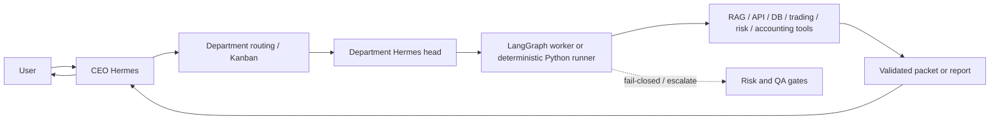
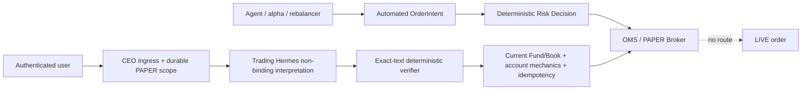
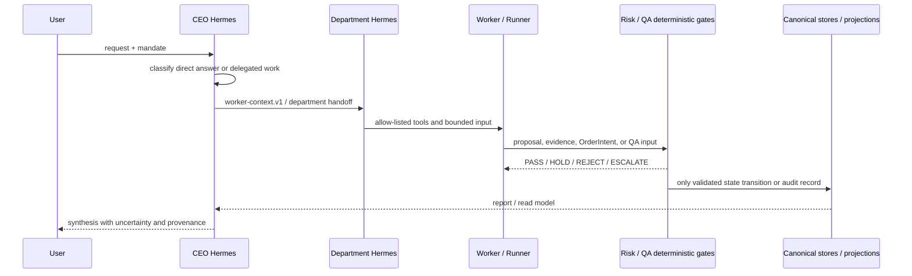
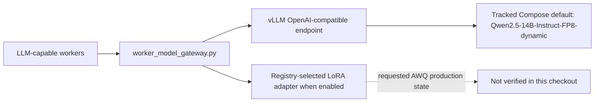
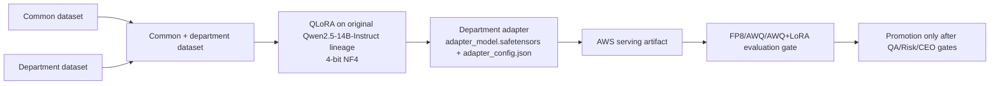
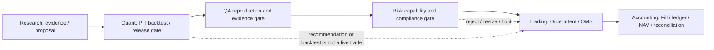

# HgFinance Current Architecture

> **Status:** current repository snapshot · **reviewed:** 2026-08-18 KST
>
> This document is an implementation audit, not a target-state specification. The
> repository, its contracts, tests, and tracked configuration are the source of
> truth. `RUNTIME_VERIFIED` is reserved for evidence of an actual process/API/DB
> interaction; a profile, plan, or historical report is not runtime proof.

## 1. Executive Summary

HgFinance is an eight-department multi-agent financial/trading platform. The
current execution model separates department-head Hermes agents, conditional
LangGraph workers, deterministic Python runners, and authenticated user
authority. The LLM interprets, compares evidence, writes explanations, and
proposes structured non-binding outputs. Deterministic contracts and engines
own exact calculations, automated-order risk enforcement, accounting
authority, QA gates, and state transitions. An authenticated user's explicit
PAPER directive is a separate authority, not an LLM decision.

The repository currently verifies the following shape:

- **8 department Hermes profiles** under `departments/*/hermes/`.
- **10 configured LLM workers** and **5 deterministic runners** in the current
  worker registry. Older role names remain in profiles as compatibility or
  audit aliases and must not be counted as active workers.
- Trading, risk, accounting, quant, and QA contracts and deterministic modules
  exist, but the repository does not prove one continuously operated,
  end-to-end production order lifecycle.
- The Operator BFF exposes a narrow authenticated `USER_DIRECTIVE` PAPER lane.
  It does not create a LIVE lane or give Hermes/agents order authority; see
  [ADR-0007](02-engineering/adr/0007-authenticated-user-paper-directive-authority.md).
- Tracked model-serving configuration still defaults to **Qwen2.5-14B FP8**,
  `max-model-len=16384`, and `gpu-memory-utilization=0.90`. The requested
  AWS AWQ production state and the associated benchmark result files are not
  present in this checkout; they are therefore not stated as implemented.

## 2. Why HgFinance Exists

The platform is intended to turn a user mandate and financial evidence into a
reviewable research or paper-trading workflow while preserving separation of
duties. A normal path is:

1. interpret the request and mandate;
2. route only the necessary departmental work;
3. gather point-in-time evidence and produce a research packet or proposal;
4. validate structured outputs, risk constraints, and evidence grounding;
5. create paper-trading state only through the approved deterministic path; and
6. expose a report/projection to the CEO and user.

The repository still describes the system as research/development and does not
authorize real-money execution by merely having an order or broker prototype.

## 3. System Architecture

The persisted handoff boundary is `worker-context.v1`; cross-department
handoffs use `department-handoff.v1`. These are context and provenance
contracts, not transfers of authority. The workflow runner in
`orchestration/workflows/runner.py` treats a missing adapter as a failure or
safe stop; a dry run validates the plan and does not call a department.

Canonical logical department names are mapped in
`orchestration/canonical_profiles.py`. Legacy or unknown aliases are rejected
instead of being silently routed to a different department.

## 4. Eight-Department Organization

The table below is derived from the current `workers` and
`deterministic_workers` mappings in each `hermes/config.yaml`, together with
the corresponding `employee_workers.py` implementation.

| Department | Current worker registry | Execution classification | Current responsibility | Status |
|---|---|---|---|---|
| CEO Office | `executive-briefing-worker`; `ceo-runner` | LLM worker + deterministic runner | cross-department briefing, aggregation of existing decisions, missing-input detection | IMPLEMENTED |
| HR / Agent Workforce | `profile-architecture-worker` | conditional Local/shared LLM Worker | non-binding job-profile and evaluation-set proposals; no activation or provisioning | PARTIAL |
| Research | `competing-explanation-worker`; `holdings-analyst-worker` | conditional Local/shared LLM Workers | falsification/competing explanations and holdings questions | PARTIAL |
| Quant / Backtest | `strategy-author-worker`; `result-interpretation-worker` | conditional Local/shared LLM Workers | strategy authoring and result interpretation; deterministic PIT/backtest/lifecycle gates | PARTIAL |
| Accounting / Portfolio | `exception-investigation-worker`; `back-office-runner` | LLM worker + deterministic runner | investigate breaks/unexplained PnL; move deterministic ledger/NAV/report outputs | PARTIAL |
| Trading | `desk-runner` | deterministic Python runner; no fixed LLM worker | OrderIntent, execution constraints, paper OMS/broker path | PARTIAL |
| Risk | `compliance-policy-worker`; `risk-runner` | conditional Local/shared LLM Worker + deterministic runner | policy evidence and deterministic pre-trade risk enforcement | PARTIAL |
| AI-QA / Audit | `hallucination-critic-worker`; `incident-postmortem-worker`; `qa-runner` | conditional Local/shared LLM Workers + deterministic runner | evidence/model-risk/permission checks, conditional critique and incident analysis | PARTIAL |

This is **10 LLM workers + 5 deterministic runners**. The department-head
profiles are a separate layer: current profile configuration selects
`openai-codex` with `gpt-5.6-luna` where the head runtime is declared. Employee
runtime configuration selects LangGraph/Ollama with default `qwen3:1.7b` where
the department config declares that path. This distinction is enforced by
`tests/test_worker_architecture.py` and
`docs/02-engineering/WORKER_ROLE_BOUNDARIES.md`.

Important role clarifications:

- `bull-thesis-worker`, `bear-thesis-worker`, the former research/quant role
  names, and other names in `personalities` are not the active worker registry
  in this checkout. They are compatibility, legacy, or retired lineage unless
  the current `workers` mapping enables them.
- `02-trading/employee_workers.py` has no fixed LLM worker registry. Its
  temporary strategy helper is explicitly non-binding and cannot submit a
  live order or bypass Risk. This automated-strategy rule is distinct from an
  authenticated user's explicit PAPER directive.
- The Risk and QA supervisors can synthesize and escalate, but their config
  forbids protected write tools. The binding owners are the deterministic
  engines/runners.

## 5. LLM vs Deterministic Responsibility Boundary

| Responsibility | Owner in the repository | Status |
|---|---|---|
| interpretation, competing explanations, evidence analysis, report prose | Hermes/conditional LangGraph workers | IMPLEMENTED/PARTIAL |
| point-in-time and citation checks | deterministic research/QA code, including `EvidenceQaEngine` | IMPLEMENTED |
| exact order and risk validation | `departments/03-risk/engine/risk_engine.py` and trading contracts/OMS | IMPLEMENTED |
| final `APPROVE` / `RESIZE` / `REJECT` risk verdict | deterministic Risk Engine | IMPLEMENTED |
| explicit user PAPER authority | verified JWT subject + durable CEO/Kanban scope; Trading Hermes proposes a non-binding parse, deterministic BFF verifier and Trading Domain own admission/execution | IMPLEMENTED/PARTIAL; PAPER only |
| ledger posting, NAV/valuation, reconciliation | accounting ledger, fill consumer, valuation/reporting modules | IMPLEMENTED/PARTIAL |
| strategy experiment state and release gate | quant pipeline, PIT dataset and lifecycle modules | IMPLEMENTED/PARTIAL |
| QA PASS/WARN/FAIL, model-risk thresholds, permission checks | QA deterministic engines | IMPLEMENTED/PARTIAL |
| authority to promote a strategy or activate a worker/profile | QA/Risk/CEO/governance workflow, not an LLM worker | PARTIAL |

The trading contract makes `StrategySignal`, `OrderIntent`, `RiskDecision`, and
broker order states distinct. `OrderIntent` requires a valid snapshot and
evidence hash; `RiskDecision` enforces quantity/reason invariants. An order
cannot be treated as approved because an LLM produced a plausible narrative.

### 5.1 Order authority split

The automated lane still requires Risk and agents cannot submit orders. The
`USER_DIRECTIVE` lane carries the user's own explicit PAPER decision with
`USER_DIRECTIVE_HIGHEST` priority, so alpha, rebalancer, and Risk do not apply
an economic veto or resize. It still fails closed on authentication, active
Fund/Book membership, exact-text deterministic verification, canonical cash/position and
reservation checks, lot/tick/TTL, idempotency, or durable-store readiness.
Trading Hermes may propose a structure for varied natural language, but its
candidate is explicitly non-binding: it cannot invent authority fields,
resolve a symbol, submit directly, or mark an order complete.

`SELL_ALL` and `CANCEL_ALL` expand from a canonical account snapshot and retain
per-leg results. Their directive states are `RECEIVED`, `RUNNING`,
`IN_PROGRESS`, `PARTIAL`, `COMPLETED`, `FAILED`, or `UNKNOWN`; any failed leg
prevents `COMPLETED`. A zero-leg `SELL_ALL` is complete only when the same
snapshot proves both zero positive accounting position and zero open SELL
reservation. The current canonical account is the local durable PaperBroker
store. LS LIVE supplies read-only market observations and has no LIVE-order
path here.

## 6. Request Lifecycle

The source code contains a CEO primary-result fast path in
`orchestration/adapters/ceo_supervisor.py`. It is an optimization for already
available results, not evidence that every request bypasses departmental
governance. High-risk decisions still require blocking Risk/QA conditions.
The repository does not contain a current measured latency report proving that
the Delegate initial ACK is still the dominant bottleneck.

### QA parallelism clarification

The repository has two different, intentional execution topologies:

| Topology | QA behavior | Evidence |
|---|---|---|
| General response workflow | QA is an independent asynchronous governance lane. CEO may synthesize terminal primary results before QA completes; QA is not a response-synthesis prerequisite. | `orchestration/adapters/ceo_supervisor.py` (`governance_plane=async_qa`, `primary_results_ready_fast_path`); `orchestration/ceo_workflow_scope.py` |
| QA department internals | Eligible conditional QA graphs fan out concurrently, then their reports are fanned in; deterministic `qa-runner` is added to the combined result. | `departments/06-ai-qa-audit/qa_employee_workers.py::run_employee_workers_async`, `asyncio.gather` |
| Blocking decision / paper pipeline | Department stages use explicit barriers. QA remains a blocking gate after the upstream Risk stage for this graph; it is not made asynchronous merely because general responses have an async QA lane. | `orchestration/workflows/portfolio_recommendation.py::build_portfolio_graph` |

Therefore “QA is asynchronous” is only correct for the general response
governance lane. “QA is always after everything” is also incomplete: the
conditional QA workers themselves are parallelized, while the blocking graph
preserves its Risk → QA barrier.

## 7. Model Serving Architecture

### 7.1 Repository-verified serving path

`docker-compose.model.yml`, `departments/worker_model_gateway.py`, and
`departments/01-research/config/worker_model_registry.json` currently agree on
the FP8 model family and served name. The tracked overlay also enables LoRA,
with `max-loras=4`, `max-lora-rank=32`, and `max-cpu-loras=8`.

The tracked defaults are:

| Setting | Current tracked value | Evidence/status |
|---|---|---|
| base model directory | `Qwen2.5-14B-Instruct-FP8-dynamic` | Compose default; IMPLEMENTED in tracked config |
| served model name | `qwen2.5-14b-instruct-fp8` | Compose/gateway/registry; IMPLEMENTED in tracked config |
| max model length | `16384` | Compose default; IMPLEMENTED in tracked config |
| GPU memory utilization | `0.90` | Compose default; IMPLEMENTED in tracked config |
| KV cache dtype | `fp8` | Compose default; IMPLEMENTED in tracked config |
| LoRA | enabled; 4/32/8 limits | Compose default; IMPLEMENTED in tracked config |
| AWS L4 runtime state | not available from this checkout | NOT VERIFIED |

The task description states an AWS production migration to AWQ with 8192/0.85
settings. That state is not represented by the tracked Compose, gateway,
registry, or model-plane scripts. It may exist only in an external runtime or
unmerged work; this document does not treat it as current implementation.

## 8. FP8 → AWQ Optimization

**Status: NOT VERIFIED / PLANNED FROM THIS CHECKOUT.**

The repository contains an FP8 model fetch/quantization path:
`scripts/model_plane/fetch_base_model.sh`, `scripts/model_plane/quantize_fp8.py`,
and `scripts/model_plane/run_quantize_fp8.sh`. It contains no AWQ model,
AWQ quantization script, AWQ serving default, or tracked AWQ result artifact.

The requested FP8/AWQ memory and throughput numbers, including KV-token
capacity, theoretical concurrency, resident VRAM, C1/C2/C4 throughput, and
restart count, could not be located in tracked benchmark files on this branch.
They are therefore recorded as **unverified claims**, not measurements of this
repository. The term “theoretical concurrency” must in any future report mean
a KV/memory capacity estimate, never a number of agents.

## 9. Quality Evaluation

The current checkout contains benchmark helper/candidate files under
`benchmarks/quantization/`, but no tracked External-50/Internal-50 final result
artifacts or result manifest that supports the FP8/AWQ percentages supplied in
the task. The candidate JSON files are evaluation inputs, not scores.

| Evaluation | Repository-verifiable result | Interpretation |
|---|---|---|
| External-50 | no final FP8/AWQ result file found | not scored here |
| Internal-50 v1 | candidate/design material only; no final score found | HgFinance contract-adherence candidate, not a base capability score |
| Internal-50 v2 | no final score found | no regression claim made |
| FP8 vs AWQ vs AWQ+LoRA | no comparable result table found | must be rerun and frozen with hashes before use |

The evaluation separation remains architecturally important: External-50,
Internal-50 v1, and Internal-50 v2 must be held out from future adapter
training. Exact arithmetic should be tested against deterministic tools and
not used as evidence that an LLM is an accounting authority.

## 10. LoRA / QLoRA Training Architecture

**Status: PLANNED; training pipeline not found in the repository.**

The desired future topology is one shared base with department-specific
adapters, not one separately fine-tuned 14B model per department:

The intended common behavior includes evidence-first responses,
fail-closed handling, no invented facts, role/authority boundaries,
deterministic-tool use for exact calculation, structured output discipline,
and no bypass of Risk/QA/accounting controls. Department data adds specialist
behavior. The production AWQ checkpoint must not be described as the QLoRA
training checkpoint unless an implementation file proves that workflow.

The repository has adapter-selection and manifest concepts in
`departments/worker_model_gateway.py` and `scripts/model_plane/model_manifest.py`,
but that is serving/registration plumbing, not evidence of a reusable Colab
QLoRA training pipeline. No training notebook, CSV schema validator, NF4
training script, or adapter promotion run was found in the tracked source.

## 11. Data & Infrastructure

| System | Current role | Status / source |
|---|---|---|
| Supabase PostgreSQL | canonical operational schemas, RLS, governance, accounting/risk/QA records | IMPLEMENTED/PARTIAL; `supabase/migrations/` and APIs |
| TimescaleDB | market ticks, quotes, bars, breadth, derivatives and market-data quality | IMPLEMENTED/PARTIAL; `timescaledb/migrations/`, market APIs |
| Redis | short-lived event/stream bus, leases, risk/QA/governance notifications, UI mirror | IMPLEMENTED in modules; persistence/replay boundaries remain partial |
| SQLite | local/demo read models and idempotency support, not the financial system of record | IMPLEMENTED as local support; `apps/api/portfolio_store.py`, `orchestration/discord_idempotency.py` |
| Parquet / object storage | documented long-term market/artifact storage path | PLANNED/DOCUMENTED; runtime use not verified here |
| Notion | report/projection destination, not a decision source | IMPLEMENTED as projection path; documented in QA/reporting docs |
| LangSmith / Langfuse | optional observability/evaluation integrations | PARTIAL; tracing defaults and access boundaries require runtime verification |
| Docker Compose | control-plane services plus separate GPU model-plane overlay | IMPLEMENTED as configuration; running state not verified here |
| Hermes | department-head profiles; tracked profiles differ from external runtime under `~/.hermes/profiles/` | IMPLEMENTED configuration; external runtime not verified |
| APIs / BFF | FastAPI department APIs, read-only AI Office/portfolio projections, and the narrow authenticated-user PAPER command edge | PARTIAL; BFF transports ADR-0007 authority but must not own broker, Risk, ledger, NAV, or LIVE authority |
| External financial data | LS/KRX market-data collectors; OpenDART·macro·news·web request-time Research MCP | PARTIAL; credentials, freshness, and live availability are environment-dependent; qualitative sources are not persistently collected |

The repository distinguishes canonical PostgreSQL/TimescaleDB state from Redis
cache/event state, local SQLite/demo state, reports, and artifacts. The root
`db/001_execution.sql`–`db/004_seed.sql` prototype schema is not to be applied
with `supabase/migrations/` as if they were one database.

## 12. Governance and Safety Gates

The core safety rules are implemented or directly represented by contracts and
tests:

- Research produces evidence-linked research packets and experiment proposals;
  it does not create an order or approve a trade.
- Quant enforces point-in-time dataset checks and lifecycle gates. A release
  candidate is submitted to QA; Quant does not directly promote production.
- Trading's Agent/alpha/automated lane accepts typed `OrderIntent` and cannot
  bypass a valid RiskDecision.
- An authenticated user's explicit PAPER `USER_DIRECTIVE` is not an Agent
  OrderIntent. The verified subject is the authority, while the deterministic
  BFF/parser and Trading Domain enforce Fund/Book ownership, account mechanics,
  idempotency, and PAPER-only execution without an economic Risk veto.
- Risk Engine enforces mandate, tradability, freshness, concentration,
  buying-power, state, and other constraints. Its binding result is
  `APPROVE`, `RESIZE`, or `REJECT`; a policy LLM is advisory.
- Accounting official figures remain in deterministic ledger, fill,
  valuation, reconciliation, and reporting code. The exception worker explains
  breaks; it does not edit official figures.
- QA fails or escalates unsupported facts, future evidence, numeric citation
  mismatch, contradiction, model-risk thresholds, forbidden tools, and
  candidate failures. `EvidenceQaEngine`, `ModelRiskEngine`, and `EvalRunner`
  are the relevant deterministic boundaries.
- CEO coordinates and synthesizes. It cannot submit orders, approve Risk,
  modify the ledger, finalize NAV, or close an audit finding.
- Trading Hermes may structure only the exact marked instruction, but never
  owns `USER_DIRECTIVE` authority or derives a trade from memory, research, or
  model judgment; the deterministic verifier remains authoritative.
- Failure paths use `HOLD`, `REJECT`, `ESCALATE`, `ENTRY_BLOCKED`, or `HALTED`
  rather than silently widening authority.

## 13. Current Bottlenecks

The repository supports these findings:

1. **End-to-end closure:** modules for Research, Quant, Risk, Trading,
   Accounting, and QA exist, but the current status document still marks the
   canonical cross-department order/fill/journal path as incomplete or
   historical. A fresh AWS/runtime probe is needed before calling it
   production-ready.
2. **Model-plane drift:** tracked deployment wiring is FP8 while the requested
   current production claim is AWQ. This is the most direct documentation and
   operational source-of-truth mismatch.
3. **Governance integration:** QA/Risk engines and APIs are present, but active
   policy corpus, credentials, production evidence, and continuous runtime
   records are environment-dependent and not verifiable from this checkout.
4. **Benchmark reproducibility:** result artifacts/manifests for the claimed
   FP8/AWQ comparisons are absent from the tracked benchmark directory.
5. **Orchestration measurement:** direct/fast-path code exists, but the current
   checkout has no reliable measurement proving whether delegate initial ACK,
   GPU inference, or another step is the dominant latency bottleneck.

## 14. Current Implementation Status

| Area | Status | Evidence |
|---|---|---|
| 8 department profiles and current worker registry | IMPLEMENTED | `departments/*/hermes/config.yaml`, `employee_workers.py`, `tests/test_worker_architecture.py` |
| worker context and department handoff contracts | IMPLEMENTED | `docs/02-engineering/contracts/worker-context.v1.json`, `department-handoff.v1.json` |
| deterministic trading contracts/OMS/paper broker | IMPLEMENTED/PARTIAL | `departments/02-trading/contracts`, `oms`, `broker`, paper-loop tests |
| deterministic Risk Engine and fail-closed state | IMPLEMENTED/PARTIAL | `departments/03-risk/engine`, `harness`, Risk tests |
| PIT quant dataset and strategy lifecycle | IMPLEMENTED/PARTIAL | `departments/04-quant-backtest/pipeline/pit_dataset.py`, `strategy_lifecycle.py` |
| deterministic accounting ledger/reconciliation/reporting | IMPLEMENTED/PARTIAL | `departments/05-accounting-portfolio`, accounting close-loop tests |
| QA evidence/model-risk/eval runners | IMPLEMENTED/PARTIAL | `departments/06-ai-qa-audit/evidence`, `model_risk.py`, `eval_runner.py` |
| external AWS AWQ serving checkpoint | NOT VERIFIED in repo | tracked Compose and registry still specify FP8 |
| FP8/AWQ final result table | NOT VERIFIED in repo | no final result artifacts found under `benchmarks/quantization/` |
| reusable Common + Department QLoRA pipeline | PLANNED | no training notebook/script/validator found |
| continuously operated end-to-end production runtime | PARTIAL / NOT RUNTIME-VERIFIED | historical status records and code exist; current runtime evidence absent |

For status semantics, retain the repository’s distinction: `IMPLEMENTED` means
code/contract exists, `TEST_VERIFIED` means a current deterministic test was
run, and `RUNTIME_VERIFIED` requires an actual API/DB/process observation.

## 15. Next Milestones

1. Reconcile the tracked model-plane source of truth with the actual AWS
   runtime: record the AWQ model digest, served name, 8192/0.85 settings, LoRA
   limits, startup/restart behavior, and VRAM from the target environment.
2. Add immutable, hashed benchmark protocol/result manifests for FP8, AWQ,
   and AWQ+LoRA. Keep External-50, Internal-50 v1, and Internal-50 v2 held out
   from adapter training.
3. Establish the Common + Department QLoRA pipeline on the original Qwen
   lineage, with dataset validation/dedup, train/validation split, adapter
   manifest, and promotion rollback evidence.
4. Close the canonical `case_id`/`trace_id` path from research packet through
   RiskDecision, paper fill, journal, NAV/PnL, QA decision, and CEO projection.
5. Measure the request path end to end, including direct/delegate routing,
   initial ACK, worker queueing, TTFT, E2E, and post-hoc versus blocking QA.
6. Replace historical status tables with dated, reproducible runtime evidence;
   preserve historical snapshots separately rather than presenting them as
   current state.

### Evidence index

- `CLAUDE.md`
- `docs/PROJECT_IMPLEMENTATION_STATUS.md`
- `docs/02-engineering/WORKER_ROLE_BOUNDARIES.md`
- `docs/02-engineering/DEPARTMENT_WORKER_GRAPH_ARCHITECTURE.md`
- `docs/02-engineering/UNIFIED_DOMAIN_API_SPEC.md`
- `docs/02-engineering/FINAL_RUNTIME_ARCHITECTURE.md`
- `docs/02-engineering/SYSTEM_WIRING_MAP.md`
- `docs/02-engineering/adr/0007-authenticated-user-paper-directive-authority.md`
- `departments/*/hermes/config.yaml`
- `departments/*/employee_workers.py` and `departments/03-risk/risk_employee_workers.py`
- `departments/06-ai-qa-audit/qa_employee_workers.py`
- `departments/02-trading/contracts/contracts.py`
- `departments/03-risk/engine/risk_engine.py`
- `departments/04-quant-backtest/pipeline/pit_dataset.py`
- `departments/04-quant-backtest/pipeline/strategy_lifecycle.py`
- `departments/05-accounting-portfolio/ledger/ledger.py`
- `departments/06-ai-qa-audit/evidence/evidence_qa_engine.py`
- `departments/06-ai-qa-audit/model_risk.py`
- `departments/06-ai-qa-audit/eval_runner.py`
- `orchestration/workflows/runner.py`
- `orchestration/adapters/ceo_supervisor.py`
- `docker-compose.model.yml`
- `departments/worker_model_gateway.py`
- `departments/01-research/config/worker_model_registry.json`
- `scripts/model_plane/fetch_base_model.sh`
- `scripts/model_plane/quantize_fp8.py`
- `tests/test_worker_architecture.py`
