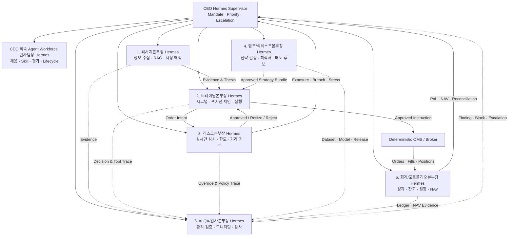
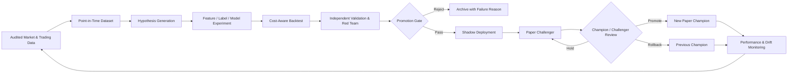
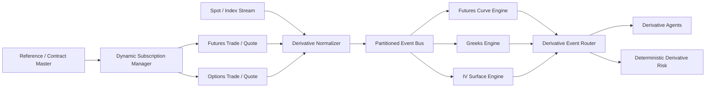

# Hermes 기반 전 종목 실시간 멀티 에이전트 RAG 헤지펀드 마스터 플랜

> 문서 상태: Production Plan v2.7  
> 문서 역할: `docs/` 전체의 최상위 기준 문서이며, 하위 문서는 본 계획의 범위와 통제 원칙을 구체화한다.  
> 제품 정의: 사용자를 대신해 데이터로 검증 가능한 다양한 전략을 발굴·검증·배포·운용하는 개인형 Multi-Strategy Hedge Fund Investment Agent  
> 구현 정의: 권한과 책임이 분리된 헤지펀드 조직을 모방하는 Multi-Agent Digital Twin과 결정론적 Control Plane  
> 목표: 연구용 Paper Fund를 거쳐 제한된 자기자본 실거래와 규제·운영 요건을 갖춘 Production Hedge Fund Service까지 단계적으로 구축  
> 전제: 실거래 및 외부 투자자 자금 운용은 관할 법률 자문, 등록·신고, 계약, 수탁·브로커·관리회사 준비와 Production Launch Gate를 모두 통과한 뒤에만 시작한다.
> 단기 구현 범위: [Personal Hedge Fund Agent Core Implementation Plan](01-product/HEDGE_FUND_CORE_PLAN.md)
> Core 기능 Backlog: [Personal Hedge Fund Agent Core Feature Backlog](02-engineering/HEDGE_FUND_IMPLEMENTATION_BACKLOG.md)
> Core 기술 스택: [Personal Hedge Fund Agent Technology Stack Decisions](02-engineering/TECH_STACK_DECISIONS.md)
> Agent 직원 프로필: [헤지펀드 디지털 직원 채용 및 Agent Profile 설계서](04-organization/AGENT_EMPLOYEE_PROFILES.md)
> 전사 데이터·부서별 Library: [헤지펀드 전사 데이터 소스 및 부서별 라이브러리 설계서](03-data/RESEARCH_DATA_SOURCES_AND_LIBRARIES.md)
> 팀별 구현 가이드: [재일](05-teams/TEAM_JAEIL_RESEARCH_QUANT_GUIDE.md) · [도현](05-teams/TEAM_DOHYUN_TRADING_ACCOUNTING_GUIDE.md) · [동규](05-teams/TEAM_DONGGYU_RISK_QA_GUIDE.md) · [영주](05-teams/TEAM_YOUNGJU_CEO_HR_GUIDE.md)
> 
## 1. 프로젝트 개요

본 프로젝트는 [NousResearch/hermes-agent](https://github.com/NousResearch/hermes-agent)를 에이전트 운영 계층으로 사용하고, [TauricResearch/TradingAgents](https://github.com/TauricResearch/TradingAgents)의 전문 분석가, Bull/Bear 토론, Trader, Risk, Portfolio Manager 구조를 투자 의사결정 패턴으로 참고한다.

이 프로젝트의 제품 정체성은 **나만의 Hedge Fund Investment Agent**다. 사용자는 자본, 투자 목표, 허용 시장, 손실 한도, 유동성 요구와 금지 조건을 Mandate로 제공한다. 시스템은 사용자를 대신해 시장을 관찰하고, 전략을 발굴·검증·배포하며, 포트폴리오를 구성하고, 위험을 통제하고, 주문·체결·성과를 관리한다.

다만 이 제품을 하나의 거대한 LLM이나 단일 Trader Agent로 구현하지 않는다. 외부에서는 CEO 에이전트가 대표하는 하나의 투자 에이전트처럼 행동하지만, 내부에서는 `리서치본부`, `트레이딩본부`, `리스크본부`, `퀀트/백테스트본부`, `회계/포트폴리오본부`, `AI QA/감사본부`가 권한과 책임을 나누는 Digital Twin으로 동작한다. 이 구조는 정보를 수집하는 기능, 전략과 주문을 만드는 기능, 이를 거부·제한하는 기능, 성과와 잔고를 확정하는 기능, AI 결과를 독립 검증하는 기능을 분리한다.

### 1.1 제품, 조직과 통제의 3계층

| 계층 | 사용자에게 보이는 역할 | 내부 구현 |
|---|---|---|
| Product Layer | 하나의 개인형 Hedge Fund Investment Agent | Mandate, Portfolio, Strategy와 성과를 통합하는 CEO Agent Interface |
| Organization Layer | 전략 발굴부터 운용까지 대행하는 가상 헤지펀드 | CEO 에이전트와 6개 전문 본부, 위원회, 본부별 Workflow와 권한 분리 |
| Control Layer | 사용자의 자본과 한도를 보호하는 통제 장치 | 결정론적 Risk Engine, OMS, Ledger, Approval, Audit와 Kill Switch |

따라서 `투자 에이전트`와 `헤지펀드 디지털 트윈`은 경쟁하는 정의가 아니다. 투자 에이전트는 제품의 얼굴과 사용자 계약이고, 디지털 트윈은 그 약속을 안전하고 재현 가능하게 수행하는 내부 운영 모델이다.

### 1.2 사용자와 시스템의 책임 경계

사용자는 최종 Principal이자 Capital Owner다.

- 사용자가 정한다: 투자 Mandate, 자본, 최대 손실, 허용 자산, 레버리지, 승인 수준과 Live 전환
- 시스템이 수행한다: 데이터 수집, 전략 가설 생성, 검증, 후보 배포, 모니터링, 리밸런싱과 보고
- 독립 통제가 결정한다: 주문 허용 여부, Exposure 제한, 전략 중단, 거래 상태와 예외 Escalation
- 사용자가 언제든 수행한다: 신규 진입 차단, Reduce-only 전환, 전략 비활성화, Kill Switch와 자금 회수

완전자율은 모든 권한을 모델에 주는 의미가 아니다. 승인된 Mandate 안의 반복 업무는 자동화하되, 자본 손실과 법적 책임이 큰 변경은 Policy Gate와 사용자 승인 범위 안에서 실행한다.

최종 시스템은 다음을 수행한다.

1. 거래소 주식 전 종목과 선정된 선물·옵션 계약의 WebSocket 시세를 수신한다.
2. 모든 종목의 실시간 특징과 신호를 지속적으로 계산한다.
3. 이벤트 중요도, 불확실성, 유동성, 포트폴리오 영향을 기준으로 분석 우선순위를 정한다.
4. 중요한 종목에만 멀티 에이전트 투자위원회를 동적으로 실행한다.
5. 모든 주문 후보를 결정론적 Risk Engine으로 검증한다.
6. 승인된 주문만 OMS로 전송하며 출시 단계에 따라 Paper Broker 또는 인증된 실제 Broker/FCM으로 Routing한다.
7. 데이터, 근거, 판단, 주문, 체결 및 사후 성과를 재현 가능한 형태로 기록한다.
8. 축적된 데이터를 이용해 신규 전략과 모델을 연구하고 Shadow 및 Paper 환경에 자동 배포한다.
9. 운용 결과를 다시 연구 데이터로 환류해 전략을 개선하거나 자동 중단한다.
10. 선물로 Beta와 Exposure를 조절하고 옵션으로 변동성 및 Tail Risk를 운용한다.
11. Broker, Custodian, Administrator와 원장을 대사하고 공식 NAV와 투자자 보고를 생성한다.
12. SLO, 보안, 변경관리, On-call과 재해복구를 갖춘 Production Service로 운영한다.

핵심 원칙은 다음과 같다.

- 전 종목은 실시간 계산 대상이다.
- LLM은 모든 틱이 아니라 의미 있는 이벤트를 판단한다.
- LLM은 주문을 직접 전송할 수 없다.
- 위험 한도와 주문 상태 관리는 결정론적 코드가 담당한다.
- 모든 결정은 사용한 데이터와 근거 문서까지 추적 가능해야 한다.
- 백테스트와 Replay에서는 미래 데이터 유입을 원천 차단한다.
- 전략 제안, 학습, 검증, 배포 및 롤백의 모든 산출물은 버전과 계보를 가져야 한다.
- 연구 에이전트가 만든 전략 코드는 격리된 환경에서만 실행하고 검증 게이트를 우회할 수 없다.

## 2. 프로그램 범위와 출시 단계

### 2.1 목표 서비스 범위

- 단일 시장의 전 종목 WebSocket 수신
- Tick 또는 Quote 정규화 및 중복 제거
- 1초, 10초, 1분, 5분 단위 특징 계산
- 거래 가능 종목 필터링
- 전 종목 실시간 점수 계산
- 이벤트 탐지 및 우선순위 큐
- 정형 데이터 조회와 문서 RAG
- 이벤트 유형별 멀티 에이전트 라우팅
- Bull/Bear 투자 토론과 구조화된 거래 제안
- 포트폴리오 단위 위험 검증
- Paper OMS, 모의 체결, 포지션 및 PnL
- 운영 대시보드
- Audit Log 및 장중 Replay
- Kill Switch와 데이터 이상 대응
- Point-in-Time 연구 Dataset 자동 생성
- 전략 가설, 실험, 백테스트 및 독립 검증 파이프라인
- Strategy/Model Registry와 Champion/Challenger 관리
- Shadow 및 Paper 환경 자동 배포
- 전략 Drift 감지, 자동 중단 및 롤백
- CEO 에이전트와 6개 본부의 분리 운영
- Strategy Book별 Mandate, Risk Budget 및 자본 배분
- 트레이딩본부 Execution Desk와 회계/포트폴리오본부의 Middle Office, Treasury 및 Fund Accounting
- 거래 확인, Reconciliation, NAV 및 성과 귀속
- 일일 투자·위험·운영 회의와 투자자 보고 시뮬레이션
- 6개 본부별 Supervisor Agent, 업무 큐, 승인 Gate 및 SLA
- Research, Trading, Risk, Quant/Backtest, Accounting/Portfolio, AI QA/Audit 업무 자동화
- 본부 간 사건 전달, 독립 검증 및 AI QA/Internal Audit 자동화
- 선물 Trade/Quote, Basis, 만기 및 Roll 실시간 처리
- 옵션 Chain WebSocket, Greeks, IV Surface 및 Skew 실시간 처리
- 파생상품 전문 에이전트와 Strategy Factory
- 파생상품 Margin, Stress Risk, Multi-leg Paper OMS
- 선물 일일정산과 옵션 Exercise/Assignment를 포함한 NAV
- 개발, Paper, Shadow, Limited Live 및 Production 환경 분리
- Broker/FCM, Custodian, Fund Administrator 및 Market Data Vendor 연동
- 고가용성, 재해복구, 보안관제, 변경관리 및 On-call
- 실거래 사전 인증, 단계적 자본 확대 및 자동 De-risking
- 관할별 등록·신고, 기록보존, 감사 및 투자자 운영 Workstream
- Production SLO, Capacity Plan, Runbook 및 Incident Management

### 2.2 제외 범위

- 실제 자금 주문
- 초단타 및 밀리초 단위 HFT
- 여러 국가 거래소 동시 운영
- OTC 및 Exotic Derivatives
- 실물 인수도가 필요한 상품선물
- 고객 자금 모집과 펀드 판매
- 완전 자율적인 전략 코드 변경 및 즉시 배포
- 승인되지 않은 국가 또는 투자자 대상 자금 모집
- 무담보 송금 및 단일 Agent에 의한 자산 이동
- Launch Gate를 우회한 실거래 또는 자본 확대

### 2.3 초기 운영 가정

- 초기 시장: 한 개 거래소, 주식과 해당 시장의 대표 지수 파생상품
- 분석 주기: 실시간 이벤트 기반, 목표 판단 지연 2~10초
- 주문 방식: Paper Trading only
- 동시 심층 분석: 기본 5개, 부하 테스트 후 확장
- 초기 최대 보유 종목: 5~10개
- 종목당 목표 비중 상한: 3%
- 총 익스포저 상한: 20%로 시작 후 검증에 따라 조정

### 2.4 출시 단계

| 단계 | 자금 | 주문 경로 | 목적 |
|---|---|---|---|
| Research | 없음 | Historical Replay | 데이터·전략 연구 |
| Shadow | 없음 | 실시간 신호만 생성 | Production 입력 검증 |
| Paper | 가상 | Paper Broker | OMS·Risk·NAV 운영 검증 |
| Live Dry Run | 없음 | 실제 Broker 인증, 주문 전송 차단 | 연결·인증·운영 절차 검증 |
| Limited Live | 제한된 자기자본 | 실제 Broker/FCM | 작은 한도에서 실거래 검증 |
| Production Proprietary | 자기자본 | 정식 실거래 | 안정적인 자체 운용 |
| External Capital | 외부 투자자 자금 | 정식 Fund 구조 | 법률·수탁·감사·투자자 운영 포함 |

각 단계는 독립적인 승격 기준과 롤백 조건을 가지며 수익률만으로 승격하지 않는다.

### 2.5 Strategy Universe 원칙

제품은 특정 전략 하나를 하드코딩하지 않는다. 수집 데이터로 Point-in-Time 검증이 가능하고 현재 Instrument, Broker, Risk, OMS, Accounting와 Compliance 능력으로 처리할 수 있는 전략을 `Strategy Universe`에 등록한다.

전략의 범위는 세 층으로 구분한다.

| 층 | 의미 | 허용 동작 |
|---|---|---|
| Research Catalog | 아이디어와 필요한 Data/Capability가 정의됨 | Dataset 생성과 Backtest 요청 |
| Deployable Universe | 데이터·실행·위험·회계 Gate를 충족함 | Shadow와 Paper 배포 |
| Capital-Eligible Universe | Broker·법률·운영·사용자 승인까지 충족함 | 승인된 환경과 한도에서만 Live 후보 |

`모든 전략을 채택한다`는 Research Catalog를 전략 유형에 대해 열어 둔다는 의미다. 데이터가 있다는 이유만으로 주문 권한이 생기지는 않는다. 각 전략은 다음 Capability Gate를 모두 선언하고 검증해야 한다.

1. `Data Gate`: 필요한 Raw/Feature/Document가 사용권, 시점, 품질과 충분한 History를 갖는다.
2. `Instrument Gate`: 전략이 요구하는 주식, ETF, 선물, 옵션, FX, 금리 또는 기타 상품이 Universe에 있다.
3. `Execution Gate`: Long/Short, Borrow, Basket, Multi-leg, Roll, Exercise/Assignment를 OMS가 처리할 수 있다.
4. `Risk Gate`: Gross/Net, Factor, Basis, Liquidity, Leverage, Margin, Greeks와 Tail Stress를 계산한다.
5. `Accounting Gate`: Position, Fee, Borrow Cost, Margin, Settlement와 PnL을 Ledger/NAV가 재현한다.
6. `Compliance Gate`: 시장, 계정, 공매도, 파생상품, 데이터 사용권과 사용자 Mandate가 허용한다.
7. `Capacity Gate`: 거래비용, Market Impact, 자본 규모와 동시 전략 상관관계가 한도 안에 있다.

Capability 하나라도 `UNKNOWN` 또는 `UNSUPPORTED`면 해당 전략은 Research 또는 Shadow 상태에 머물며 주문을 만들 수 없다.

## 3. Universe 정의

`Universe`는 시스템이 투자 후보로 관리하는 종목 집합이다. 전 종목 처리를 유지하되 계산 및 추론 자원을 계층적으로 배분한다.

| 구분 | 정의 | 처리 방식 |
|---|---|---|
| Market Universe | 거래소에 상장된 전체 종목 | 종목 마스터 동기화 |
| Tradable Universe | 거래정지, 관리, 데이터 이상, 유동성 부족 종목을 제외한 집합 | 규칙 기반 필터 |
| Realtime Universe | 실시간 특징과 신호를 계산하는 전체 거래 가능 종목 | 항상 계산 |
| Attention Universe | 유의미한 이벤트가 발생한 상위 종목 | Priority Queue 관리 |
| Agent Universe | 현재 멀티 에이전트가 심층 분석하는 종목 | 제한된 동시 실행 |
| Portfolio Universe | 포지션 또는 미체결 주문이 있는 종목 | 최고 우선순위 감시 |

Universe Manager는 장 시작 전 기본 집합을 구성하고 장중 거래정지, 유동성, 데이터 품질 및 위험 상태에 따라 이를 갱신한다.

## 4. 전체 시스템 아키텍처

```mermaid
flowchart LR
    WS["Market WebSocket"] --> GW["Feed Gateway"]
    GW --> NM["Normalizer & Deduplicator"]
    NM --> BUS["Event Bus"]
    BUS --> FE["Streaming Feature Engine"]
    FE --> SC["Realtime Scoring"]
    SC --> PQ["Priority Queue"]

    PQ --> L1["Level 1 Rules"]
    PQ --> L2["Level 2 Lightweight Model"]
    PQ --> AR["Agent Router"]

    DOC["News / Filings / Macro / Research"] --> RAG["Point-in-Time RAG"]
    AR --> IC["Investment Committee"]
    RAG --> IC

    IC --> TR["Trader Proposal"]
    TR --> RE["Deterministic Risk Engine"]
    RE --> PM["Portfolio Construction"]
    PM --> OMS["Paper OMS"]
    OMS --> PB["Paper Broker"]
    PB --> PS["Positions & PnL"]

    PS --> AU["Audit / Memory / Replay"]
    IC --> AU
    AU --> RAG

    AU --> DS["Point-in-Time Dataset Builder"]
    DS --> SPC["Strategy Planning Committee"]
    SPC --> EXP["Experiment & Backtest Pipeline"]
    EXP --> REG["Strategy / Model Registry"]
    REG --> SH["Shadow & Paper Deployment"]
    SH --> MON["Performance & Drift Monitor"]
    MON --> AU
    SH --> AR

    H["Hermes Control Plane"] --> AR
    H --> IC
    H --> AU
    H --> SPC
```



## 5. Hermes와 TradingAgents의 역할

### 5.1 Hermes Agent

Hermes는 회사 운영 및 에이전트 오케스트레이션 계층을 담당한다.

- 장 시작 및 종료 스케줄
- 서브에이전트 실행과 병렬 작업
- 에이전트별 Tool 및 Skill 제공
- 일일 리서치, 장중 모니터링, 장 마감 회고
- 장기 메모리와 운영 컨텍스트
- 장애 발생 시 재시도 또는 운영자 알림
- 분석 예산, 시간 제한 및 호출 정책 관리

### 5.2 Investment Committee Service

TradingAgents의 역할 분리와 토론 구조를 참고한 금융 도메인 전용 상태 그래프다.

- 전문 분석가 보고서 수집
- Bull/Bear 반론
- Research Manager의 논점 종합
- Trader의 구조화된 거래 제안
- Portfolio Manager의 자본 배분 의견

Hermes 내부 구현에 금융 상태를 모두 결합하지 않고 독립 서비스 또는 명확한 모듈 경계로 유지한다.

실제 헤지펀드 운영을 모방하기 위해 투자위원회가 모든 주문을 승인하지는 않는다. 투자위원회는 Strategy Mandate, 자본 배분, Risk Budget 및 예외 상황을 심의한다. 일상적인 주문은 승인된 Mandate 안에서 트레이딩본부의 PM Pod 또는 전략 실행기가 만들고 리스크본부의 Risk/Compliance Gate를 통과해 집행한다. 대규모 포지션, Mandate 변경, 손실 한도 변경 및 신규 전략 승격만 CEO 에이전트 또는 Cross-Department 위원회로 Escalation한다.

### 5.3 Risk Engine과 OMS

Risk Engine과 OMS는 에이전트 런타임과 분리한다.

- LLM 장애 시에도 포지션 감시 지속
- 위험 축소와 청산 경로 유지
- 중복 주문 방지
- 주문 상태 전이의 일관성 보장
- 모든 주문에 Risk Approval ID 요구

### 5.4 Strategy Planning Committee

전략기획 위원회는 운용 조직과 분리된 Research-to-Production 조직이다. 실시간 운용 중 임의로 전략을 수정하지 않고, 고정된 데이터셋과 재현 가능한 실험을 통해 새로운 전략 버전을 만든다.

주요 책임:

- 운용 및 시장 데이터에서 반복 가능한 Alpha 가설 발굴
- 데이터 품질과 연구 가능 범위 평가
- Feature와 Label 정의
- 규칙 기반 전략 및 통계·머신러닝 모델 개발
- 거래 비용을 포함한 Point-in-Time Backtest
- 과적합, 데이터 누수 및 시장 국면 편향 검증
- 기존 Champion과 신규 Challenger 비교
- Shadow 및 Paper 환경 자동 배포
- 성능 저하와 Drift 감지
- 자동 중단, 이전 버전 롤백 및 재학습 요청

Hermes는 연구 작업을 예약하고 여러 연구 에이전트를 병렬 실행하며, Strategy Registry의 상태 변화와 승인 절차를 조정한다. 실제 전략 실행기는 Registry에서 승인된 불변 Artifact만 읽는다.

### 5.5 실제 헤지펀드 Operating Model

본부별 Agent/Service 경계, 권한과 직원 역할은 [AGENT_EMPLOYEE_PROFILES.md](04-organization/AGENT_EMPLOYEE_PROFILES.md)와 팀별 실행 가이드를 따른다.

사용자 관점에서 최종 제품은 하나의 개인형 Hedge Fund Investment Agent다. 그러나 내부 구현은 하나의 거대한 모델이 아니라 권한과 책임이 분리된 헤지펀드 회사의 Digital Twin이다. CEO 에이전트가 사용자 Mandate와 통합 결과를 대표하고, 6개 본부는 독립된 Agent, 결정론적 Service와 Policy Gate로 역할을 수행한다.

CEO와 6개 본부장은 각각 독립된 Hermes Supervisor Agent로 구현한다. 각 본부장은 고유한 Memory Namespace, Department Queue, Skill Manifest, Tool Allowlist와 Service Identity를 가지고 본부 내 Specialist Agent를 지휘한다. Specialist는 사건별 LangGraph Node로 동적 실행하며, 상세 직원 구성과 권한은 [AGENT_EMPLOYEE_PROFILES.md](04-organization/AGENT_EMPLOYEE_PROFILES.md)를 따른다.

CEO 직속 Shared Service로 `Agent Workforce 인사팀`을 둔다. 인사팀장도 독립 Hermes Supervisor로 구현하며, 6개 본부의 Queue·SLA·비용·Eval·Incident를 분석해 Agent 채용, Skill 보강, 교육, 역할 변경과 비활성화를 관리한다. 인사팀은 제7의 투자 본부가 아니며 투자 판단, Production 권한 부여 또는 자기 후보의 최종 QA 승인을 수행하지 않는다.

CEO 에이전트는 전사 목표, 업무 우선순위, 본부 간 Case와 Escalation을 조정하지만 주문 전송, Risk 승인, 원장 수정, NAV 확정 또는 Audit Finding 종료 권한을 갖지 않는다. 리스크본부는 거래 거부권을, AI QA/감사본부는 AI 산출물·전략 Release·통제 Evidence에 대한 독립 차단 및 감사 권한을 가진다.



#### CEO 에이전트

- 사용자 Mandate, 자본 목표, 손실 허용 범위와 금지 조건을 회사 목표로 변환
- 본부별 업무 우선순위, Agent 예산, SLA와 Escalation 조정
- 투자위원회, 전략기획위원회, 위험위원회와 장애대응회의 소집
- 본부별 결과를 통합해 사용자에게 하나의 결정과 설명으로 제공
- 중대한 자본 재배분, 전략 중단, Drawdown 대응안을 사용자 승인 범위에 맞춰 상신
- 독립 리스크 및 감사 거부권을 우회하지 않으며 공식 원장을 직접 변경하지 않음

#### 1. 리서치본부

- Universe, Market/Microstructure, Technical, Fundamental, News, Sentiment, Sector, Macro/Regime 분석
- 실시간·문서 데이터 수집, 정규화, 중복 제거, Entity Resolution과 RAG Evidence 생성
- 종목별 Research Dossier, Thesis, 촉매와 무효화 조건 유지
- 출처, 시점, 데이터 신선도와 Point-in-Time 적합성 표시
- 트레이딩본부에 구조화된 `Research Packet`을 전달하며 주문이나 포지션 크기는 결정하지 않음

#### 2. 트레이딩본부

- 승인된 전략, Research Packet과 현재 포트폴리오 상태를 Signal 및 Portfolio Intent로 변환
- Bull/Bear 토론, Trader, PM Pod와 Execution Desk 운영
- 진입·청산·크기·만료·무효화 조건과 주문 방식을 구조화
- 주문 분할, 예상 Slippage, Market Impact, Broker Routing과 TCA 관리
- 리스크본부 승인 전에는 OMS로 주문을 전송할 수 없음

#### 3. 리스크본부

- Market, Liquidity, Concentration, Leverage, Counterparty, Margin 및 Derivatives Risk 실시간 감시
- Pre/Post-Trade Risk와 Compliance 규칙, Restricted List 및 Mandate 적합성 검사
- 주문의 승인, 크기 축소, 지연, `REDUCE_ONLY`, `ENTRY_BLOCKED` 또는 거부 결정
- Stress, VaR, Greeks, Drawdown, Crowding과 청산 가능성 분석
- CEO 및 트레이딩본부와 독립된 거래 거부권을 가지며 Agent가 한도를 임의 확대할 수 없음

#### 4. 퀀트/백테스트본부

- 전략 가설, Feature, Label, Dataset과 Experiment Spec 생성
- 비용·Slippage를 포함한 Point-in-Time Backtest, Walk-Forward 및 Stress 검증
- 과적합, 데이터 누수, Survivorship Bias와 시장 국면 편향 검사
- Champion/Challenger 비교, Parameter 최적화와 Capacity 평가
- 검증된 불변 Strategy Bundle만 Shadow/Paper 배포 후보로 제출
- 실시간 운용 중 전략 코드를 직접 수정하거나 Production을 임의 승격하지 않음

#### 5. 회계/포트폴리오본부

- Fund, Book, Strategy별 자본, Position, Cash, Fee, Margin과 Collateral 관리
- Broker와 내부 주문·체결·포지션·현금 Reconciliation 및 Break 처리
- PnL, Performance Attribution, Corporate Action, Valuation과 Double-Entry Ledger 운영
- Preliminary/Official NAV, 관리보수·성과보수와 투자자 보고 생성
- Accounting Engine의 공식 수치만 사용하며 트레이딩 신호를 생성하지 않음

#### 6. AI QA/감사본부

- LLM 환각, 근거 없는 주장, 인용 불일치, 오래된 Context와 Tool 오사용 탐지
- Agent·Prompt·Model·Tool·Dataset 버전과 Decision Trace 검증
- Strategy/Model Release의 재현성, 독립 Model Risk와 품질 Gate 운영
- 권한 분리, 승인 누락, Risk Override, 원장 수정과 Audit Finding 추적
- Agent/Feed/Queue/Worker의 품질·장애·비용·지연 모니터링 및 Incident Evidence 생성
- 운영 Command를 직접 실행하지 않고 Finding, 차단 요청, Rollback 권고와 Escalation만 수행

#### 공통 기술 플랫폼

- Market/Reference Data, Security Master와 Point-in-Time Data Lake
- OMS, Portfolio, Risk, Accounting, Reporting 및 Strategy Registry
- Work Queue, Case Orchestration, Entitlement, Audit와 Observability
- Secret 관리, Disaster Recovery, Model Serving과 CI/CD

외부 시장·공시·뉴스·거시 Source는 중앙 Data Platform이 한 번만 수집한다. 트레이딩·리스크·퀀트·회계·QA·인사팀은 부서별 Domain API로 이를 참조하고, 주문·위험·실험·원장·감사·Agent Lifecycle처럼 자기 업무에서 발생한 데이터만 공식 System of Record에 생성한다. 본부별 입력 Data Product, 출력 계약, Library와 Raw DB 접근 제한은 [전사 데이터 소스 및 부서별 라이브러리 설계서](03-data/RESEARCH_DATA_SOURCES_AND_LIBRARIES.md)의 6장을 따른다.

초기에는 한 개 PM Pod와 한 개 Fund를 구현하되 모든 데이터 모델은 다중 Fund, 다중 Book, 다중 Strategy를 지원하도록 설계한다.

### 5.6 권한 분리 원칙

| 의사결정 | 제안 | 승인 또는 거부 | 실행 |
|---|---|---|---|
| 신규 전략 연구 | 퀀트/백테스트본부 | 본부 Supervisor | Research Runner |
| Shadow 배포 | 퀀트/백테스트본부 | AI QA/감사본부 Release Gate | Deployment Service |
| Paper Champion 승격 | 퀀트/백테스트본부 | CEO + 리스크본부 + AI QA/감사본부 | Strategy Registry |
| 일반 주문 | 트레이딩본부 | 리스크본부의 Risk/Compliance Rules | OMS / Execution Service |
| Mandate 초과 주문 | 트레이딩본부 | CEO + 리스크본부 | OMS / Execution Service |
| 위험 한도 변경 | CEO 또는 리스크본부 | 리스크본부 독립 승인 + 사용자 정책 | Risk Config Service |
| Kill Switch 해제 | 회계/포트폴리오본부 운영 담당 | 리스크본부 + AI QA/감사본부 + Authorized Operator | Control Service |
| NAV 확정 | 회계/포트폴리오본부 | AI QA/감사본부의 독립 NAV Evidence Check | Reporting Service |

어떤 에이전트도 자신의 제안, 승인, 실행 및 사후 검증을 혼자 완료할 수 없다.

### 5.7 Fund와 Book 계층

```text
Management Company
└── Fund
    ├── Investor Capital Accounts
    ├── Master Cash and NAV Ledger
    ├── PM Pod A
    │   ├── Strategy Book A1
    │   └── Strategy Book A2
    ├── PM Pod B
    │   └── Strategy Book B1
    └── Hedge / Overlay Book
```

모든 신호, 주문, 체결, 포지션, PnL 및 비용은 `fund_id`, `pod_id`, `book_id`, `strategy_id`를 가져야 한다. 이를 통해 전략 성과와 PM 성과를 분리하고 자본을 재배분할 수 있다.

### 5.8 자본과 거래의 전체 생명주기

```text
Investor Capital
  -> Fund NAV and Available Cash
  -> CEO Mandate and Capital Priority
  -> 회계/포트폴리오본부 Book Allocation
  -> 리스크본부 Risk Budget
  -> 트레이딩본부 PM Pod
  -> Strategy Book Allocation
  -> Signal and Order Intent
  -> Pre-Trade Risk and Compliance
  -> Execution and Fill Allocation
  -> Position / Cash / Fee Ledger
  -> Reconciliation and Official PnL
  -> Performance Attribution
  -> Capital Reallocation or Strategy Closure
```

자본 배분은 단순한 종목 비중 최적화가 아니다. 전략별 Capacity, 상관관계, Drawdown, Liquidity, Margin, Turnover 및 운용 신뢰도를 반영한다.

### 5.9 Agent와 결정론적 서비스의 경계

에이전트에 적합한 업무:

- 투자 가설 발굴과 반론
- 비정형 리서치 분석
- 전략 실패 원인 조사
- 투자위원회 Memo 작성
- 운영 Break의 원인 후보 설명
- 성과 및 투자자 보고 Commentary 작성

결정론적 서비스가 맡아야 하는 업무:

- 주문 상태와 멱등성
- Position, Cash 및 Double-Entry Ledger
- NAV와 보수 계산
- Risk Limit과 Compliance Rule
- Margin, Collateral 및 Borrow
- Reconciliation과 Corporate Action
- 공식 PnL과 성과 귀속 계산

에이전트의 서술은 공식 원장을 변경할 수 없으며, 검증된 Command와 승인 절차를 통해서만 상태 변경을 요청할 수 있다.

## 6. 실시간 처리 파이프라인

### 6.1 데이터 수신

Feed Gateway는 공급자별 WebSocket 규격을 공통 이벤트 형식으로 변환한다.

필수 기능:

- 연결 및 인증
- 구독 분할과 재구독
- Heartbeat 감시
- 자동 재연결과 지수 백오프
- Sequence Gap 탐지
- 중복 메시지 제거
- 거래소 시간과 수신 시간 동시 기록
- Snapshot과 Stream 정합성 복구
- Backpressure 처리

### 6.2 표준 Market Event

```json
{
  "event_id": "mkt_01J...",
  "provider": "provider_name",
  "market": "MARKET",
  "symbol": "SYMBOL",
  "event_type": "trade",
  "exchange_time": "2026-07-27T09:01:02.123+09:00",
  "received_time": "2026-07-27T09:01:02.180+09:00",
  "sequence": 1234567,
  "price": 101.25,
  "size": 500,
  "bid": 101.20,
  "ask": 101.30,
  "source_status": "live"
}
```

### 6.3 Streaming Feature Engine

모든 Realtime Universe 종목에 대해 다음을 증분 계산한다.

- 1초, 10초, 1분, 5분 수익률
- 누적 거래량 및 거래대금
- Relative Volume
- VWAP과 이격률
- 실현 변동성
- Bid/Ask Spread
- 호가 불균형
- 체결 방향과 체결 강도
- 고가/저가 및 돌파 거리
- 시장 및 섹터 대비 상대 강도
- 상관관계 변화
- 데이터 지연과 결측률

실시간 경로에서는 전체 데이터프레임 재계산을 피하고 종목별 Rolling State를 갱신한다.

### 6.4 이벤트 탐지

초기 이벤트 유형:

- `price_breakout`
- `return_spike`
- `relative_volume_spike`
- `volatility_regime_change`
- `spread_widening`
- `orderbook_imbalance`
- `sector_decoupling`
- `correlation_breakdown`
- `news_catalyst`
- `portfolio_risk_breach`
- `stale_market_data`
- `feed_disconnected`

```json
{
  "event_id": "evt_01J...",
  "symbol": "SYMBOL",
  "event_type": "volume_price_breakout",
  "detected_at": "2026-07-27T10:32:14+09:00",
  "severity": 0.86,
  "signal_score": 0.82,
  "relative_volume": 3.4,
  "price_change_5m": 0.021,
  "spread_bps": 4.2,
  "data_age_ms": 180,
  "feature_snapshot_id": "fs_01J..."
}
```

### 6.5 중복 억제와 이벤트 집계

- 종목과 이벤트 유형별 Cooldown 적용
- 짧은 시간의 연속 이벤트를 하나의 Event Window로 집계
- 더 높은 심각도의 이벤트가 발생하면 기존 작업을 갱신
- 분석 대기 중 정보가 오래되면 요청 취소
- 보유 종목 및 미체결 종목은 Cooldown과 무관하게 위험 이벤트 허용

## 7. 3단계 판단 계층

### 7.1 Level 1: 결정론적 전 종목 판단

모든 종목을 항상 처리하며 LLM을 사용하지 않는다.

- 데이터 품질 판정
- 유동성 및 거래 가능성 판정
- 특징과 이벤트 계산
- 명시적 위험 조건 확인
- Priority Score 생성

### 7.2 Level 2: 경량 모델

Attention Universe를 대상으로 실행한다.

- 이벤트 지속 가능성
- 예상 Edge
- 거래 비용 추정
- 과거 유사 이벤트 성과
- 허위 돌파 가능성
- Agent Escalation 필요성

```text
net_expected_edge = expected_return - spread - slippage - fees
```

`net_expected_edge`가 최소 기준 이하이면 심층 에이전트 분석을 실행하지 않는다.

### 7.3 Level 3: 멀티 에이전트 위원회

중요도, 불확실성 및 포트폴리오 영향이 큰 이벤트만 처리한다.

기본 우선순위 예시:

```text
priority =
    0.25 * signal_strength
  + 0.20 * liquidity_score
  + 0.15 * news_severity
  + 0.15 * portfolio_relevance
  + 0.10 * regime_change
  + 0.10 * model_uncertainty
  + 0.05 * sector_importance
  - transaction_cost_penalty
  - stale_data_penalty
```

가중치는 백테스트 및 Paper Trading 결과로 보정한다.

## 8. 멀티 에이전트 조직

아래 표는 확정된 `CEO 에이전트 + CEO 직속 Agent Workforce 인사팀 + 6개 본부`를 실행 Agent 수준으로 분해한 것이다. 인사팀은 투자 본부가 아닌 Shared Service이며, 위원회는 별도 상설 본부가 아니라 여러 본부의 Agent가 동일한 Case와 Evidence를 검토하는 승인 Workflow다.

| 조직 | 에이전트 | 주요 책임 | 기본 실행 시점 |
|---|---|---|---|
| CEO Agent | Executive Orchestrator | Mandate 해석, 본부 라우팅, 예산, SLA와 Escalation | 항상 |
| CEO 직속 Agent Workforce 인사팀 | Agent Workforce Supervisor | 본부별 채용 수요, Roster, Skill Gap, 수습과 비활성화 통합 | 주간/채용 사건 |
| CEO 직속 Agent Workforce 인사팀 | Workforce Planning Agent | Queue, SLA, 품질, 비용과 Capacity로 채용 우선순위 산정 | 일일/주간 |
| CEO 직속 Agent Workforce 인사팀 | Profile Architect | Mission, Skill, Tool, 금지 권한과 Eval이 있는 Job Profile 설계 | 채용 요청 |
| CEO 직속 Agent Workforce 인사팀 | Selection/Performance Agent | Golden/Adversarial Eval, Shadow 수습, 교육과 성과 개선 | 채용/정기 |
| CEO 직속 Agent Workforce 인사팀 | Lifecycle Coordinator | Identity, Queue, Memory, 권한 요청과 Joiner/Mover/Leaver 관리 | 입사/이동/퇴직 |
| 1. 리서치본부 | Research Supervisor | 분석 과제 분해, Evidence 품질과 Research Packet 통합 | 이벤트/정기 |
| 1. 리서치본부 | Universe Manager | 거래 가능 종목과 관심 종목 선정 | 장전/장중 |
| 1. 리서치본부 | Market Data Steward | 시세 정규화, 중복·지연·결측과 Symbol Mapping 검사 | 실시간 |
| 1. 리서치본부 | Microstructure Analyst | 호가, 체결, 스프레드와 유동성 분석 | 미시구조 이벤트 |
| 1. 리서치본부 | Technical Analyst | 추세, 돌파, 거래량과 변동성 분석 | 가격 이벤트 |
| 1. 리서치본부 | Fundamental Analyst | 재무, 밸류에이션과 실적 분석 | 저빈도/캐시 |
| 1. 리서치본부 | News/Sentiment Analyst | 뉴스, 공시, 촉매, 내러티브와 심리 분석 | 문서 이벤트 |
| 1. 리서치본부 | Sector/Regime Analyst | 동종 종목, 섹터, 매크로와 시장 국면 분석 | 섹터/국면 이벤트 |
| 2. 트레이딩본부 | Trading Supervisor | Research와 Strategy Signal을 거래 Case로 통합 | 주문 후보 |
| 2. 트레이딩본부 | Bull Researcher | 상승 논거, 촉매와 기대수익 주장 | 심층 분석 |
| 2. 트레이딩본부 | Bear Researcher | 반증, 하락 위험과 논리 취약점 제시 | 심층 분석 |
| 2. 트레이딩본부 | Trader/PM Agent | 진입, 청산, 크기, 만료와 무효화 조건 제안 | 심층 분석 |
| 2. 트레이딩본부 | Execution Agent | 주문 분할, Limit, 참여율, Slippage와 Routing 제안 | 승인 주문 |
| 3. 리스크본부 | Risk Supervisor | 주문 심사 통합과 승인·축소·거부 결정 | 모든 주문 |
| 3. 리스크본부 | Market/Liquidity Risk Agent | Exposure, VaR, Stress, 집중도와 청산 가능성 검사 | 실시간 |
| 3. 리스크본부 | Derivatives/Margin Risk Agent | Greeks, Basis, Margin, Assignment와 Tail Risk 검사 | 파생상품 이벤트 |
| 3. 리스크본부 | Compliance Policy Agent | Mandate, Restricted List와 거래 제한 검사 | 사전/사후 거래 |
| 4. 퀀트/백테스트본부 | Strategy Research Agent | 전략 가설과 검증 가능한 Experiment Spec 생성 | 연구 주기 |
| 4. 퀀트/백테스트본부 | Feature/Dataset Agent | Point-in-Time Feature, Label과 Dataset 생성 | 연구 주기 |
| 4. 퀀트/백테스트본부 | Backtest/Optimizer Agent | 비용 포함 검증, Walk-Forward와 Parameter 최적화 | 연구 주기 |
| 4. 퀀트/백테스트본부 | Strategy Release Supervisor | Champion/Challenger 비교와 배포 후보 제출 | Release Gate |
| 5. 회계/포트폴리오본부 | Portfolio Controller | Fund/Book/Strategy 자본, Position과 성과 상태 관리 | 실시간/장 마감 |
| 5. 회계/포트폴리오본부 | Reconciliation Agent | Broker와 주문·체결·포지션·현금 대사 | 장중/장 마감 |
| 5. 회계/포트폴리오본부 | Fund Accounting Agent | 원장, Valuation, Fee, NAV와 보고서 검증 | 일일/월간 |
| 5. 회계/포트폴리오본부 | Treasury Agent | Cash, Margin, Collateral와 Settlement Forecast | 일중/일일 |
| 6. AI QA/감사본부 | Evidence QA Agent | 주장과 출처 연결, 시점, 인용과 완전성 검증 | 모든 중요 결정 |
| 6. AI QA/감사본부 | Hallucination Critic | 환각, 불확실성 은폐, 모순과 Tool 오사용 탐지 | Agent 출력 시 |
| 6. AI QA/감사본부 | Model Risk Agent | 모델·프롬프트·Dataset·Release 재현성 독립 검증 | 연구/배포 |
| 6. AI QA/감사본부 | Internal Audit Agent | 권한 분리, Override, 원장 변경과 Finding 추적 | 상시/정기 |
| 6. AI QA/감사본부 | Agent Ops Monitor | Agent, Feed, Queue, Model Server의 오류·지연·비용 감시 | 항상 |

### 8.1 동적 라우팅

| 이벤트 | 호출 조합 |
|---|---|
| 거래량 및 가격 돌파 | 리서치본부의 Microstructure + Technical |
| 뉴스 속보 | 리서치본부 News + 트레이딩본부 Bull/Bear + Evidence QA |
| 섹터 전체 급변 | 리서치본부 Sector/Regime + 리스크본부 Market Risk |
| 보유 종목 급락 | 6개 본부 중요 Case + 결정론적 Risk Check |
| 손실 한도 접근 | CEO/LLM 판단을 기다리지 않고 Risk Engine 즉시 실행 |
| 데이터 지연 및 단절 | 신규 주문 차단 |
| 단순 저강도 가격 이동 | Level 1 또는 Level 2에서 종료 |

### 8.2 종목별 상태

```text
SymbolState
├── latest_market_features
├── active_events
├── cached_research
├── current_thesis
├── invalidation_conditions
├── latest_agent_decision
├── current_position
├── open_orders
├── risk_flags
└── next_reevaluation_at
```

다음 조건에서만 심층 재판단한다.

- 투자 논리의 무효화 조건 발생
- 목표가 또는 손절 수준 접근
- 새로운 고중요도 뉴스
- 시장 국면 전환
- 포트폴리오 위험 변화
- 기존 결정 만료

## 9. RAG 및 메모리 설계

수집 대상, Data Contract, Point-in-Time, 품질, Lineage, 보존과 운영 절차의 상세 기준은 [DATA_GOVERNANCE_GUIDE.md](03-data/DATA_GOVERNANCE_GUIDE.md)를 따른다.

### 9.1 저장 계층

RAG를 하나의 벡터 저장소로 취급하지 않고 다음 계층으로 분리한다.

| 계층 | 데이터 | 조회 방식 |
|---|---|---|
| Fact Store | 가격, 특징, 재무, 포지션, 주문, PnL | SQL/시계열 조회 |
| Document RAG | 공시, 뉴스, 실적 발표, 리서치, 매크로 문서 | Hybrid Search |
| Decision Memory | 과거 논거, 판단, 주문, 결과, 회고 | 메타데이터 + 의미 검색 |
| Policy Store | 투자 정책, 위험 한도, 운영 절차 | 버전 고정 조회 |

### 9.2 문서 메타데이터

모든 문서는 최소 다음 필드를 가져야 한다.

```text
document_id
symbol
source
source_url
document_type
published_at
observed_at
valid_from
ingested_at
reliability_score
content_hash
embedding_version
```

### 9.3 Point-in-Time 규칙

- 분석 시각 이후에 관측된 문서는 조회할 수 없다.
- 수정된 재무 및 경제 데이터는 당시 공개 버전을 보존한다.
- 뉴스의 게시 시각과 시스템 최초 관측 시각을 함께 저장한다.
- 백테스트와 Replay는 동일한 시간 필터를 사용한다.
- 데이터 공급자 장애로 나중에 수집한 문서를 과거 분석에 삽입하지 않는다.

### 9.4 검색 절차

1. Symbol, Sector, Event Type 및 시간 범위로 후보를 필터링한다.
2. 키워드 검색과 Vector Search를 결합한다.
3. 최신성, 출처 신뢰도 및 이벤트 관련성으로 재정렬한다.
4. 중복 기사를 제거한다.
5. 문서 ID와 인용 가능한 근거를 에이전트에 전달한다.

### 9.5 Decision Memory

각 결정은 사후 결과와 연결한다.

- 결정 당시 논거와 반대 논거
- 기대 시간 범위
- 진입, 청산 및 무효화 조건
- 실제 체결과 비용
- 절대수익 및 벤치마크 대비 수익
- 최대 유리/불리 가격 변동
- 논리가 맞았는지 여부
- 실패 원인 분류

성과가 나쁜 결정을 단순히 프롬프트에 추가하지 않고, 시장 국면과 이벤트 유형이 유사한 사례만 검색한다.

## 10. 구조화된 의사결정 계약

자연어 보고서와 기계가 검증할 수 있는 구조화 출력을 함께 저장한다.

```json
{
  "decision_id": "dec_01J...",
  "event_id": "evt_01J...",
  "scope_instrument_ids": ["inst_long", "inst_short"],
  "strategy_family": "EQUITY_MARKET_NEUTRAL",
  "directionality": "LONG_SHORT",
  "action": "rebalance",
  "target_portfolio": [
    {"instrument_id": "inst_long", "target_weight": 0.03},
    {"instrument_id": "inst_short", "target_weight": -0.03}
  ],
  "confidence": 0.74,
  "time_horizon": "intraday",
  "entry_condition": "price_above_vwap",
  "stop_loss_pct": 0.012,
  "take_profit_pct": 0.024,
  "thesis": ["volume breakout", "positive catalyst"],
  "counter_thesis": ["sector volatility"],
  "evidence_ids": ["doc_12", "fs_01J..."],
  "model_id": "model-name",
  "prompt_version": "committee-v1",
  "created_at": "2026-07-27T10:32:18+09:00",
  "expires_at": "2026-07-27T11:00:00+09:00"
}
```

허용 액션 예시:

- `open_long`
- `open_short`
- `increase`
- `reduce`
- `close`
- `hold`
- `watch`

`open_short`는 Paper에서도 대차 가능 수량, Borrow Fee, Recall, Uptick/주문 표시와 Settlement 정책을 가진 전략만 사용할 수 있다. 실제 계정에서는 Broker와 규제 Capability가 확인되지 않으면 정책 계층에서 비활성화한다.

## 11. Risk Engine

Risk Engine은 제안된 목표 비중을 검증하고 `approve`, `resize`, `reject` 중 하나를 반환한다.

### 11.1 주문 전 검사

- 데이터 최신성
- 거래 가능 상태
- 이벤트와 결정 만료 여부
- 근거 문서 존재 여부
- 예상 가격과 현재 가격 괴리
- 종목별 포지션 한도
- 섹터 및 팩터 한도
- 총 Gross/Net Exposure
- Short Availability, Borrow Fee, Recall과 공매도 주문 규칙
- Strategy Book별 Leverage, Margin과 Financing 한도
- 현금 및 매수 가능 금액
- 예상 거래 비용과 유동성
- 일일 손실 및 Drawdown
- 중복 및 상충 주문
- 미체결 주문 포함 노출

### 11.2 장중 통제

- 종목별 손절 및 Thesis Invalidation
- 포트폴리오 일일 손실 제한
- 비정상 스프레드 시 신규 진입 금지
- 데이터 단절 시 신규 주문 금지
- 주문 응답 지연 및 상태 불명 시 거래 중단
- 브로커와 내부 포지션 불일치 시 Kill Switch

### 11.3 Kill Switch

Kill Switch 상태:

- `NORMAL`
- `ENTRY_BLOCKED`
- `REDUCE_ONLY`
- `HALTED`

운영자만 `HALTED` 상태를 해제할 수 있게 하며 모든 변경은 감사 로그에 남긴다.

## 12. OMS 및 체결

### 12.1 OrderIntent와 Broker Order 상태

```text
OrderIntent:
DRAFT -> RISK_PENDING -> APPROVED | RESIZED | REJECTED | EXPIRED
APPROVED | RESIZED -> READY_TO_SUBMIT

Broker Order:
CREATED -> SUBMITTED -> ACKNOWLEDGED -> PARTIALLY_FILLED -> FILLED
CREATED | SUBMITTED | ACKNOWLEDGED | PARTIALLY_FILLED -> CANCEL_PENDING -> CANCELLED
SUBMITTED -> REJECTED
CREATED | ACKNOWLEDGED -> EXPIRED
BROKER_STATE_AMBIGUOUS -> UNKNOWN
```

`RISK_APPROVED`는 Broker Order 상태가 아니라 유효한 `risk_decision_id` 제출 전제조건이다. 사용자 승인이 필요한 Mandate는 OrderIntent 승인 흐름에만 `USER_PENDING -> USER_APPROVED`를 추가한다. `UNKNOWN` 상태에서는 신규 주문을 차단하고 Broker Reconciliation으로만 상태를 확정한다.

### 12.2 필수 기능

- Client Order ID 멱등성
- 중복 주문 방지
- 부분 체결
- 취소 및 교체
- 주문 만료
- 수수료와 Slippage 모델
- 현재 호가와 거래량을 고려한 모의 체결
- 포지션, 평균 단가, 실현 및 미실현 PnL
- 브로커 이벤트와 내부 상태의 Reconciliation

### 12.3 Fund Ledger와 공식 장부

Paper/Live OMS의 예상 Position 계산과 별개로 Fund Ledger를 유지한다. 원장은 Double-Entry 원칙을 사용하며 수정 대신 반대 분개를 기록한다.

핵심 원장:

- Trade와 Position Ledger
- Cash와 Currency Ledger
- Fee와 Commission Ledger
- Dividend, Interest 및 Corporate Action Ledger
- Margin과 Collateral Ledger
- Investor Capital Account Ledger
- Management Fee와 Performance Fee Ledger

### 12.4 일일 NAV와 Close Process

장 마감 절차:

1. 거래소 및 Broker 체결 파일 수신
2. 주문, 체결, 포지션 및 현금 Reconciliation
3. Corporate Action과 수수료 반영
4. 독립 가격을 사용한 포지션 Valuation
5. 미해결 Break와 비정상 가격 Escalation
6. Gross 및 Net PnL 계산
7. Strategy, Book, Pod 및 Fund별 성과 귀속
8. 관리보수 및 성과보수 발생액 계산
9. Preliminary NAV 생성
10. 독립 NAV Check 후 Official Paper NAV 확정

### 12.5 Treasury와 Prime Broker 시뮬레이션

- 현금 잔고와 예상 결제 금액
- Margin 사용률과 증거금 부족
- 종목 대차 가능 여부와 Borrow Fee
- Counterparty별 Exposure
- Collateral 배분
- 결제일과 미결제 거래
- 유동성 Buffer와 환매 Stress

Paper 환경은 Version이 있는 Borrow Availability와 Borrow Fee Scenario를 제공한다. 실제 Borrow Feed나 Broker 계약이 없는 환경에서는 보수적인 가상 한도를 사용하며, Live 공매도는 `UNKNOWN` 상태에서 항상 차단한다.

## 13. 저장소 및 인프라

### 13.1 권장 초기 스택

| 영역 | 초기 선택 | Production 선택 |
|---|---|---|
| 언어 | Python 3.12 | 병목 구간 Rust |
| API | FastAPI | 서비스 분리 유지 |
| 실시간 통신 | WebSocket | 공급자별 Adapter |
| Event Bus | Redis Streams | Managed Kafka 또는 동등한 Replay 가능 Event Bus |
| Hot State | Redis | Managed Redis 호환 Cluster |
| 관계형 DB | Supabase PostgreSQL | Multi-AZ/Zone HA PostgreSQL 또는 검증된 Supabase 운영 구성 |
| Vector Search | pgvector | Managed pgvector 또는 Hybrid Search Engine |
| 시계열 | 별도 TimescaleDB, 리서치·퀀트 직접 접근 | Object Storage 기반 Lakehouse, ClickHouse는 Benchmark 후 검토 |
| Object Storage | Supabase private Storage | Versioning/Object Lock 지원 Object Storage |
| 에이전트 상태 | 명시적 State Graph | 체크포인트 저장 |
| 관측성 | OpenTelemetry + Prometheus + Grafana | Cloud-neutral Telemetry + 선택 Cloud의 Managed Monitoring |
| 배포 | Docker Compose | Managed Container Platform, Kubernetes는 필요성 입증 후 검토 |
| Secret/Key | 개발용 Secret Store | Managed Secret + KMS/HSM 검토 |
| Infrastructure | 수동 개발 환경 | 공급자별 Landing Zone + Terraform |
| Delivery | 기본 CI | Workload Identity/OIDC + Registry + 서명 Artifact 승격 |

초기에는 서비스 수를 과도하게 늘리지 않는다. 프로세스 경계가 필요한 실시간 수신, 에이전트 Worker, Risk/OMS를 우선 분리한다.

### 13.2 Hot Path와 Cold Path

Hot Path:

```text
WebSocket -> Normalize -> Feature -> Event -> Risk -> OMS
```

Cold Path:

```text
Document Ingestion -> Chunk/Index -> Research -> Memory -> Evaluation
```

Hot Path에서 Vector Search, 대형 문서 파싱 또는 장시간 LLM 호출을 동기적으로 기다리지 않는다.

### 13.3 Production 배포 토폴로지

Production은 최소 다음 Fault Domain을 분리한다.

```text
Primary Region
├── Market Data Ingestion Zone
├── Trading and Risk Zone
├── Agent and Research Zone
├── Ledger and Fund Operations Zone
└── Observability and Security Zone

Secondary Region
├── Warm Market Data and Reference Replica
├── Standby Risk / OMS Control Plane
├── Immutable Audit Replica
└── Recovery Tooling
```

- 주문 경로와 Agent 경로의 Compute, Network 및 Credential 분리
- Risk/OMS와 Ledger는 Agent 장애와 무관하게 계속 동작
- Database는 Multi-AZ 동기 복제, Secondary Region 비동기 복제
- Event Bus는 중요 Topic별 Retention과 Replay 보장
- Market Data 장애 시 독립 공급자 또는 Broker Reference Feed로 교차 검증
- Production 변경은 Immutable Artifact와 선언적 설정으로만 배포

### 13.4 Service Level Objectives

| 서비스 | SLI | 초기 Production SLO |
|---|---|---|
| Market Data | 정상 메시지 처리 가용성 | 월 99.95% 이상 |
| Risk Gate | 주문 전 검사 가용성 | 장중 99.99% 이상 |
| OMS | 승인 주문 상태 보존 | 유실 0건 |
| Ledger | 승인 분개의 내구성 | 유실 0건 |
| Position | Broker 대비 일치 | 장 마감 100% 또는 승인된 Break |
| Event Processing | p99 지연 | 자산·Feed별 예산 정의 |
| Operator Control | Kill Switch 실행 | 정해진 최대 시간 이내 |
| Audit | 중요 Command 기록 | 누락 0건 |

SLO 위반은 단순 Alert가 아니라 Error Budget, 배포 동결 및 자동 De-risking 정책과 연결한다.

### 13.5 데이터 내구성과 복구 등급

| 데이터 | 목표 RPO | 목표 RTO | 복구 방식 |
|---|---|---|---|
| 주문·체결·원장 | 0 또는 준동기 수준 | 수분 이내 | 동기 복제와 Journal Replay |
| Position·Risk State | 수초 이내 | 수분 이내 | Event Replay와 Broker Reconciliation |
| Market Tick | 공급자·비용별 정의 | 수시간 | 원본 Archive 재수집 또는 Gap 표시 |
| Research/Model | 마지막 승인 Artifact | 수시간 | Registry와 Object Versioning |
| Audit Evidence | 0에 근접 | 수시간 | Immutable Replica |

RPO/RTO는 목표값이며 실제 Broker, Cloud, 데이터 공급자 계약과 장애훈련 결과로 확정한다.

### 13.6 Capacity와 비용 계획

- 장 시작·마감 및 만기일 Peak Message Rate의 최소 2배 부하 검증
- 옵션 Chain 확대에 따른 Subscription, CPU, Memory 및 저장 비용 모델
- Agent 호출 Budget과 공급자 Rate Limit별 Degradation 정책
- Database Write Amplification과 Retention Tiering
- Normal, Peak, Disaster 모드별 필요한 Worker 수
- Broker Session, Order Rate 및 Cancel Rate Limit
- 월별 Cloud, Data, LLM, Broker 및 Observability 비용 귀속

Capacity 증설보다 먼저 Load Shedding 우선순위를 정의한다. Position/Risk/Order 데이터가 리서치와 비보유 종목 분석보다 항상 우선한다.

### 13.7 Cloud Platform 선정과 AWS 후보안

현재 Cloud Provider는 확정하지 않는다. Production의 논리 경계와 계약을 먼저 확정하고 AWS, Azure, GCP 및 필요 시 On-premise/Hybrid를 동일한 기준으로 평가한다. 공급자 선정 전 애플리케이션은 Event Bus, Object Storage, Container Runtime, Secret Store, Model Provider와 Observability를 Adapter 및 OpenTelemetry 같은 개방형 계약 뒤에 둔다.

- 어떤 공급자를 선택해도 Production Trading, Production Data, Production Fund Operations, Security Audit와 Log Archive 경계를 분리한다.
- Primary Region은 최소 3개 Fault Domain, Secondary Region은 Warm Standby를 기본 후보로 한다.
- Agent와 LLM Provider 장애는 Risk, OMS, Kill Switch와 Ledger 가용성에 영향을 주지 않아야 한다.
- Region Failover는 자동 주문 재개가 아니라 Trade Authority Fencing, Broker 대사, `ENTRY_BLOCKED`와 `REDUCE_ONLY` 단계를 거친다.
- 공급자는 Broker/Data Vendor 지연, 3년 TCO, 운영 난이도, 데이터 소재지, 보안·감사, Managed Kafka/PostgreSQL/AI 가용성, Egress와 Exit Plan을 점수화해 선정한다.
- AWS는 현재 후보 중 하나이며, Cloud 공급자가 확정되면 별도 ADR과 공급자별 Architecture 문서를 작성한다.

## 14. 권장 저장소 구조

```text
multi-agent-hedge-fund/
├── apps/
│   ├── api/
│   ├── dashboard/
│   ├── operator_control/
│   ├── investor_portal/
│   └── paper_trader/
├── agents/
│   ├── analysts/
│   ├── committee/
│   ├── strategy_committee/
│   ├── portfolio/
│   ├── auditor/
│   └── schemas/
├── orchestration/
│   ├── hermes/
│   ├── routing/
│   └── workflows/
├── market_data/
│   ├── adapters/
│   ├── normalization/
│   ├── features/
│   ├── derivatives/
│   │   ├── futures/
│   │   ├── option_chains/
│   │   └── subscriptions/
│   └── events/
├── universe/
├── rag/
│   ├── ingestion/
│   ├── retrieval/
│   ├── memory/
│   └── point_in_time/
├── risk/
│   ├── greeks/
│   ├── margin/
│   ├── stress/
│   └── derivatives/
├── compliance/
├── portfolio/
├── derivatives/
│   ├── instruments/
│   ├── pricing/
│   ├── volatility_surface/
│   ├── futures_roll/
│   ├── expiry/
│   └── strategies/
├── strategy_factory/
│   ├── hypotheses/
│   ├── datasets/
│   ├── features/
│   ├── labels/
│   ├── experiments/
│   ├── backtests/
│   ├── plugins/
│   │   ├── equity/
│   │   ├── event_driven/
│   │   ├── relative_value/
│   │   ├── macro_futures/
│   │   └── volatility/
│   ├── capabilities/
│   ├── validation/
│   ├── registry/
│   ├── deployment/
│   └── monitoring/
├── execution/
│   ├── oms/
│   ├── multi_leg/
│   └── brokers/
├── middle_office/
│   ├── trade_control/
│   ├── reconciliation/
│   ├── valuation/
│   └── performance_attribution/
├── fund_operations/
│   ├── accounting/
│   ├── nav/
│   ├── treasury/
│   ├── collateral/
│   ├── fees/
│   └── investor_reporting/
├── department_automation/
│   ├── work_items/
│   ├── supervisors/
│   ├── policy_gates/
│   ├── approvals/
│   ├── escalations/
│   ├── sla/
│   └── audit/
├── reference_data/
│   ├── security_master/
│   ├── calendars/
│   └── corporate_actions/
├── infrastructure/
│   ├── cloud/
│   │   ├── provider-neutral/
│   │   ├── provider-candidates/
│   │   ├── landing-zone/
│   │   ├── modules/
│   │   └── policies/
│   ├── environments/
│   ├── network/
│   ├── databases/
│   ├── event_bus/
│   ├── disaster_recovery/
│   └── capacity/
├── security/
│   ├── iam/
│   ├── secrets/
│   ├── policies/
│   ├── monitoring/
│   └── incident_response/
├── operations/
│   ├── runbooks/
│   ├── on_call/
│   ├── incidents/
│   ├── daily_close/
│   └── launch_gates/
├── legal_compliance/
│   ├── applicability/
│   ├── registrations/
│   ├── records_retention/
│   └── investor_documents/
├── vendor_management/
│   ├── register/
│   ├── contracts/
│   ├── entitlements/
│   └── exit_plans/
├── storage/
├── replay/
├── observability/
├── config/
├── tests/
│   ├── unit/
│   ├── integration/
│   ├── replay/
│   └── load/
├── docs/
└── docker-compose.yml
```

## 15. 운영 및 관측성

### 15.1 핵심 메트릭

데이터:

- 메시지 처리량
- 종목별 데이터 지연
- Sequence Gap
- 재연결 횟수
- 누락 및 중복률

판단:

- 이벤트 발생 수
- 단계별 통과율
- Agent Queue 대기시간
- 에이전트 호출 수, 비용 및 실패율
- 판단 생성 지연
- 근거 없는 결정 비율

전략 연구 및 배포:

- 생성된 가설 수와 검증 통과율
- 실험 재현 성공률
- 데이터 누수 검사 실패율
- Champion 대비 Challenger 개선 폭
- Shadow와 Backtest 성과 괴리
- 전략별 예측 Drift와 성과 Drift
- 자동 승격, 중단 및 롤백 횟수
- 전략 생성부터 Paper 배포까지 소요시간

거래:

- 주문 승인, 축소 및 거절률
- 체결률과 Slippage
- Turnover
- 종목 및 섹터 Exposure
- 실현/미실현 PnL
- 최대 Drawdown
- 선물 Basis, Roll Cost 및 체결 Slippage
- 옵션 Spread, Open Interest 및 Quote Staleness
- Portfolio와 Book별 Delta, Gamma, Vega 및 Theta
- Margin 사용률과 Expiry Concentration

펀드 운영:

- Strategy, Book, Pod 및 Fund별 Gross/Net PnL
- NAV와 Intraday Estimate 차이
- Broker Reconciliation Break 수와 Aging
- 미확정 거래와 결제 실패
- Cash, Margin 및 Collateral 사용률
- Management/Performance Fee 발생액
- Corporate Action 처리 상태
- Counterparty별 Exposure

본부 자동화:

- 본부별 Open Work Item 수와 Aging
- 자동 처리율과 사람 승인 비율
- SLA 위반 및 Escalation 횟수
- Agent 제안의 승인, 수정 및 거절률
- 자동 조치 후 재작업과 롤백 비율
- 본부 간 Handoff 지연
- 통제 위반 탐지와 해결 시간
- 업무당 Agent 비용과 절감된 운영 시간

시스템:

- CPU, 메모리 및 Event Loop Lag
- Redis, DB 및 Event Bus 지연
- Worker 사용률
- 오류율과 재시도율

### 15.2 대시보드 화면

- Market Feed Health
- 전 종목 Heatmap 및 Attention Universe
- Agent Queue와 현재 분석 종목
- 종목별 사건, 논거 및 결정 타임라인
- 포지션, 주문, PnL 및 Exposure
- Risk Limit과 Kill Switch
- LLM 비용과 호출 지연
- Replay 제어 및 의사결정 비교
- Strategy Registry와 Champion/Challenger 상태
- 실험, 검증, 배포 및 롤백 이력
- Fund/Pod/Book별 자본 배분과 Risk Budget
- Reconciliation Break와 Daily Close 상태
- NAV, Cash, Margin, Collateral 및 Fee 원장
- Strategy/Book/Pod별 Performance Attribution
- 본부별 Work Queue, SLA 및 Escalation
- 자동화 등급별 실행과 승인 현황
- 본부 간 Case Timeline과 미해결 Action Item
- Futures Curve와 Roll Calendar
- Option Chain, IV Surface, Skew 및 Term Structure
- Greeks, Margin 및 파생상품 Stress Scenario
- Multi-leg Order와 Leg Risk 상태

### 15.3 Alerting과 On-call

- Alert는 서비스, Fund, Book, Strategy, Symbol과 영향 주문을 포함
- SEV 등급, Owner, Backup, Runbook과 Escalation Policy 필수
- 동일 원인의 Alert Deduplication과 Storm Suppression
- Page는 즉시 조치 가능한 사건에만 사용하고 정보성 이벤트는 Work Queue로 전송
- Position, Risk, OMS, Ledger, Broker, Feed 순으로 우선순위 정의
- SEV-1/2는 자동 Incident 생성과 Trading State 변경 후보 생성
- Acknowledgement, Mitigation, Recovery와 Postmortem 시간을 측정

### 15.4 End-to-End Trace와 Audit

모든 투자와 운영 사건은 다음 ID를 연결한다.

```text
market_event_id
-> feature_snapshot_id
-> agent_run_id
-> decision_id
-> risk_approval_id
-> order_intent_id
-> internal_order_id
-> broker_order_id
-> fill_id
-> ledger_entry_id
-> reconciliation_case_id
-> nav_version_id
```

Trace Sampling 때문에 주문·Risk·원장 Audit가 누락되지 않도록 중요 경로는 전량 기록하고 일반 Telemetry와 보존 정책을 분리한다.

## 16. 보안과 통제

### 16.1 보안 거버넌스

NIST Cybersecurity Framework 2.0의 `Govern, Identify, Protect, Detect, Respond, Recover`를 기준으로 Current/Target Profile을 관리한다.

- Information Security Owner와 시스템·데이터별 Owner 지정
- 자산, 데이터, Vendor와 위험 Register
- 연간 및 중대한 변경 시 Threat Modeling
- 보안 정책, 예외, 만료일 및 승인자 기록
- 독립 취약점 점검과 정기 침투 테스트
- 사이버 보험 및 사고 통지 의무 검토

### 16.2 Identity와 권한

- 사람은 SSO, MFA와 Role-Based Access 사용
- 서비스는 짧은 수명의 Workload Identity 사용
- Agent별 Tool, 데이터, Fund 및 환경 권한 분리
- Production 주문·원장 권한에 Just-in-Time Access 적용
- Break-glass 계정은 이중 승인, 시간 제한 및 전체 Session 기록
- 퇴사·역할 변경·Vendor 종료 시 즉시 권한 회수
- 분기별 Access Review와 Dormant Credential 제거

### 16.3 Secret과 Key 관리

- API Key와 인증서는 중앙 Secret/KMS에서 관리
- 환경 변수 평문 Secret은 Local Development로 제한
- 코드, 로그, 프롬프트, Trace 및 Artifact에서 Secret 탐지
- Broker/FCM Key는 주문 권한과 자금 이동 권한 분리
- 정기 Rotation과 유출 시 자동 폐기 Runbook
- 서명 Key와 Encryption Key의 역할 및 관리자 분리

### 16.4 Network와 Runtime 격리

- Research, Agent, Trading, Ledger 및 Admin Network 분리
- Production Egress Allowlist와 Vendor Endpoint Pinning
- Research Runner는 Broker, Secret 및 운영 DB 접근 금지
- Container Image 서명과 Admission Policy
- Read-only Filesystem, 최소 Capability 및 Resource Limit
- 운영자 Console은 별도 인증 경로와 Session Audit 사용

### 16.5 데이터 보호와 기록보존

- 전송·저장 암호화와 Key Rotation
- PII, 투자자 정보, 전략 IP 및 주문 데이터 분류
- 환경별 데이터 Masking과 Production Data 반출 승인
- Audit Log는 Append-only 또는 WORM 성격으로 보관
- 관할별 Record Retention과 Legal Hold 정책
- 삭제 요청과 보존 의무 충돌을 법무·Compliance가 승인

### 16.6 Agent와 LLM 보안

- 외부 문서를 명령이 아닌 Untrusted Data로 취급
- Prompt Injection과 Data Exfiltration 필터
- 모델 공급자별 데이터 보존·학습 사용 설정 검토
- 중요 Context의 최소 공개와 필드 단위 Redaction
- Agent가 정책, 권한, Risk Limit을 수정하지 못하도록 격리
- Tool 호출은 구조화 Schema, Policy Gate와 멱등성 Key 요구
- 모델, 프롬프트, RAG Corpus와 Tool 버전 기록

### 16.7 Security Monitoring과 대응

- 인증 실패, 권한 상승, Secret 접근 및 비정상 Egress 감시
- 주문 폭주, 비정상 Cancel, 계정 탈취 의심 행동 탐지
- SIEM과 On-call Alert Routing
- 사고 등급, Commander, 법무·Vendor·투자자 통지 절차
- Forensic Snapshot과 Chain of Custody
- 사고 후 Credential Rotation, 원인 분석과 재발 방지

## 17. 테스트 전략

### 17.1 단위 테스트

- Market Event 파싱
- 중복 및 Sequence Gap 처리
- Rolling Feature 정확성
- 이벤트 조건과 Cooldown
- Priority Score
- 의사결정 스키마 검증
- Risk Limit
- 주문 상태 전이
- Point-in-Time 필터

### 17.2 통합 테스트

- WebSocket 재연결과 구독 복구
- Event Bus 장애 및 재처리
- Agent Timeout과 Fallback
- Risk 승인부터 Paper Fill까지
- DB 재시작 후 OMS 복구
- 중복 이벤트 및 주문 멱등성

### 17.3 Replay 테스트

- 실제 장중 데이터를 동일 순서로 재생
- 처리 속도 1x, 10x, 최대 속도 지원
- 동일 설정에서 결정 입력 재현
- 미래 데이터 유입 여부 검사
- 전략 및 프롬프트 버전별 결과 비교

LLM 출력 자체의 완전한 동일성보다 입력 데이터, 사용 근거, 정책 및 주문 결과의 추적 가능성을 우선한다.

### 17.4 부하 및 장애 테스트

- 예상 최대 메시지의 2배 부하
- 장 시작 시 Burst
- 공급자 연결 단절
- DB 및 Redis 지연
- LLM 공급자 429 및 Timeout
- Agent Queue 포화
- 오래된 이벤트 대량 취소
- Risk Engine 장애 시 Fail Closed 동작

### 17.5 전략 연구 및 배포 테스트

- Dataset Manifest와 원천 데이터 Hash 재현
- Point-in-Time 및 Label Leakage 검사
- Purged Walk-Forward Split 검증
- 거래 비용과 주문 지연 적용 여부 검사
- 서로 다른 Runner에서 동일 실험 재현
- Strategy Bundle 무결성과 서명 검사
- 미승인 Bundle 로드 차단
- Shadow, Challenger 및 Champion 격리 검사
- Canary 배포 실패 시 자동 롤백
- Drift와 Drawdown Trigger에 따른 자동 중단

### 17.6 본부 자동화 테스트

- Work Item 상태 전이와 멱등성
- 본부별 Agent Tool 권한 격리
- 승인 없는 Command 실행 차단
- 자율 등급과 금액·위험 임계값 검사
- SLA 만료 시 올바른 Escalation
- 동일 사건의 중복 Case 병합
- 본부 간 Handoff의 Evidence 보존
- Supervisor 장애 시 Work Queue 복구
- 상충하는 본부 결정에서 리스크본부와 AI QA/감사본부의 독립 거부권 우선
- 완료된 Case의 Audit Evidence 완전성

### 17.7 파생상품 테스트

- 계약 승수, Tick Size, 만기 및 결제 방식 검증
- 주식·선물·옵션 Symbol과 Underlying Mapping
- 선물 Basis, Carry, Roll Yield 및 Continuous Contract 계산
- 옵션 가격과 Delta/Gamma/Vega/Theta 교차 검증
- IV Solver 수렴 실패와 비정상 Quote 처리
- Volatility Surface 무차익 조건과 보간 안정성
- Multi-leg 부분 체결과 Leg Risk 상태 전이
- Initial/Variation Margin과 Stress Loss 계산
- 만기, Exercise, Assignment 및 Cash Settlement
- Futures Roll과 일일 Settlement 원장 분개
- Option Premium과 만기 가치의 NAV 반영
- Historical Chain Replay에서 미래 계약 정보 유입 차단

### 17.8 Production Readiness 테스트

- 실제 Broker/FCM 인증 환경의 주문·취소·정정 Certification
- Drop Copy 또는 독립 체결 채널과 OMS Reconciliation
- 장 시작, 장 마감, 만기일 및 대량 Corporate Action Dress Rehearsal
- Primary AZ와 Region 장애 Chaos Test
- DB Failover 중 주문·원장 중복 및 유실 검사
- Market Data 공급자 장애와 독립 Feed 전환
- Broker 응답 불명 상태의 Safe Recovery
- Kill Switch, Entry Blocked와 Reduce Only 실전 훈련
- Secret 폐기, 인증서 만료와 권한 회수 훈련
- Backup Restore와 RPO/RTO 측정
- 운영자 부재, 통신 장애 및 Vendor 동시 장애 Tabletop Exercise
- Limited Live 자본 한도와 자동 De-risking 검사
- 회계 Close, NAV, 보수 및 투자자 보고 Parallel Run

## 18. 전략기획 위원회와 Strategy Factory

### 18.1 목적과 운영 원칙

Strategy Factory는 수집된 시장, 뉴스, 공시, 특징, 주문 및 성과 데이터를 새로운 투자 전략으로 변환하는 연구·검증·배포 시스템이다.

운용 시스템은 승인된 전략을 실행하고, Strategy Factory는 다음 전략 버전을 만든다. 두 시스템은 데이터와 성과를 공유하지만 배포 경계는 분리한다.

- 연구는 운영 데이터의 읽기 전용 Snapshot을 사용한다.
- 모든 Dataset, Feature, Label, Code, Model 및 Config를 버전 관리한다.
- 전략 가설은 검증 전에 운용 결과를 볼 수 없도록 Holdout 정책을 적용한다.
- LLM은 가설, 코드 초안 및 분석을 만들 수 있지만 검증 결과를 조작할 수 없다.
- 자동 배포는 Shadow와 Paper 환경에서 허용한다.
- 향후 실거래 승격에는 별도의 사람 승인과 규제·운영 검토를 요구한다.
- 성능 저하 시 신규 진입 중단과 이전 Champion 롤백이 자동으로 가능해야 한다.

### 18.2 위원회 구성

| 역할 | 책임 | 주요 산출물 |
|---|---|---|
| Strategy Chair | 연구 주제와 자원 우선순위 결정 | Research Mandate |
| Alpha Researcher | 시장 이상현상과 가설 발굴 | Hypothesis Spec |
| Data Scientist | Dataset, Feature, Label 설계 | Dataset Manifest |
| Quant Researcher | 통계 검증과 모델 개발 | Experiment Run |
| Market Microstructure Researcher | 체결 가능성과 비용 모델 검증 | Execution Assumption |
| Bear/Red Team Researcher | 누수, 과적합, 논리 취약점 공격 | Validation Report |
| Model Risk Manager | 독립 검증과 위험 등급 부여 | Model Risk Decision |
| Portfolio Researcher | 전략 간 상관관계와 자본 배분 평가 | Portfolio Impact Report |
| MLOps Release Manager | Registry, 배포, 모니터링 및 롤백 | Release Record |

동일한 에이전트가 전략 생성과 최종 검증을 동시에 담당하지 않도록 역할과 프롬프트를 분리한다.

### 18.3 전략 연구 폐쇄 루프



### 18.4 전략 가설 계약

전략 연구는 자유로운 노트가 아니라 검증 가능한 계약으로 시작한다.

```yaml
hypothesis_id: hyp_001
name: relative_volume_sector_breakout
universe: tradable_equities
decision_frequency: 1m
holding_horizon: 30m
economic_rationale: >
  섹터 동조와 거래량 확대로 확인된 돌파는 단독 가격 돌파보다 지속 가능성이 높다.
features:
  - relative_volume_5m
  - sector_relative_return_5m
  - spread_bps
label:
  type: forward_excess_return
  horizon: 30m
entry_assumptions:
  latency_ms: 3000
  max_participation_rate: 0.02
invalidation_tests:
  - no_edge_after_cost
  - unstable_across_regimes
  - excessive_turnover
owner: alpha_research_agent
```

가설에는 경제적 근거, 대상 Universe, 판단 빈도, 보유 기간, 필요한 데이터, 비용 가정 및 폐기 조건이 반드시 포함되어야 한다.

### 18.5 Dataset Factory

Dataset Builder는 운영 저장소에서 연구용 불변 Snapshot을 생성한다.

Dataset Manifest 필수 항목:

- `dataset_id`와 생성 시각
- 원천 데이터와 버전
- 대상 종목과 기간
- 거래일 캘린더
- Feature 계산 버전
- Label 정의와 Horizon
- Corporate Action 처리 방식
- 결측치 및 이상치 처리
- Point-in-Time 검증 결과
- Train, Validation, Test 및 Final Holdout 구간
- Row Count, Hash 및 품질 리포트

연구 에이전트가 임의 SQL로 운영 DB를 직접 조회하지 않도록 Dataset API를 제공한다.

### 18.6 모델 및 전략 유형

Strategy Factory는 한 종류의 모델이나 Long-only 방향에 종속되지 않는다. SEC Form PF의 주요 전략 분류인 Equity, Relative Value, Event Driven, Macro, Managed Futures/CTA, Credit와 Multi-Strategy를 상위 Taxonomy로 참고하되, 실제 채택 범위는 프로젝트가 확보한 데이터와 거래 Capability로 제한한다.

| 전략군 | 프로젝트의 연구 후보 | 핵심 입력 | 주요 추가 Gate |
|---|---|---|---|
| Equity Directional | Long/Short, Long/Short Bias, Sector/Thematic, Momentum, Mean Reversion | 주식·ETF 가격, 호가, 재무, 수급, 뉴스 | Borrow, Gross/Net, 공매도 규칙 |
| Equity Market Neutral | Factor Neutral, Statistical Arbitrage, Pairs, Cross-sectional Ranking | 동기화 가격, Factor, Sector, Borrow | 중립화, Basket Execution, Crowding |
| Fundamental Equity | Value, Quality, Growth, Earnings Revision | DART 재무, Corporate Action, Consensus | PIT 재무, 추정치 사용권, Rebalance 비용 |
| Event Driven | Earnings/Disclosure, Merger/Risk Arbitrage, Special Situation, Index Rebalance | 공시, 뉴스, Deal Terms, Corporate Action | Event 상태, Deal Break, Halt, Borrow |
| Relative Value | ETF/Index, Cash-Futures Basis, Calendar/Intermarket Spread, Convertible 후보 | 복수 Instrument 가격과 Reference Terms | Multi-leg, Basis Stress, Leg Risk |
| Quantitative Trading | Trend, Breakout, Intraday Reversal, Order-flow와 Liquidity Signal | Tick, Quote, Bar, Microstructure Feature | 지연·비용·용량, HFT 제외 |
| Macro/Managed Futures | Index·Rate·FX·Commodity Trend, Carry, Regime | 선물 Curve, 거시, FX, 금리, 상품 데이터 | Margin, Roll, 글로벌 Calendar |
| Options/Volatility | Long Vol, Skew, Term Structure, Defined-Risk Spread, Dispersion 후보 | Option Chain, IV Surface, Greeks, Underlying | Multi-leg, Margin, Exercise/Assignment |
| Portfolio Hedge/Tail | Beta Hedge, Protective Put, Collar, Dynamic Hedge | Portfolio Exposure, Futures/Options, Stress | Hedge 효과, Basis, Cost와 Tail Scenario |
| Multi-Strategy Allocation | Risk Parity, Vol Target, Regime Allocation, Meta Allocator | 전략별 Return/Risk/Capacity/Correlation | 전략 상관 붕괴, 자본·Risk Budget |

Credit, Convertible, Private Market, Real Estate, Digital Asset와 OTC 전략은 Taxonomy에는 둘 수 있지만, 해당 Data Product, 계약, Pricing, Venue, Custody와 Risk/Accounting 능력이 없으면 `UNSUPPORTED`다. 이름만 등록된 전략을 “지원”으로 표시하지 않는다.

모델 유형은 명시적 규칙, 횡단면 Ranking, 시계열 Forecast, Event 분류, Regime, Statistical Model, Machine Learning, Ensemble과 Meta Allocator를 허용한다. LLM은 직접 가격 숫자를 생성하기보다 가설 발굴, 비정형 데이터 구조화, 반론, 실패 분석과 전략 조합에 우선 사용한다.

모든 `StrategyVersion`은 최소한 `strategy_family`, `directionality`, `required_data_products`, `required_instruments`, `required_capabilities`, `holding_horizon`, `execution_model`, `risk_model`, `accounting_model`과 `capacity_limit`을 선언한다. Registry는 Capability Profile과 현재 Environment를 비교해 `RESEARCH_ONLY`, `SHADOW_ELIGIBLE`, `PAPER_ELIGIBLE`, `LIVE_ELIGIBLE` 중 하나를 계산한다.

### 18.7 실험 및 백테스트 표준

모든 실험은 동일한 평가 Harness를 사용한다.

- 수수료, 세금, Spread, Slippage 및 Market Impact 포함
- 주문 지연과 데이터 관측 지연 포함
- 거래정지, 상장폐지 및 Universe 변경 반영
- Survivorship Bias 방지
- Purged Walk-Forward Validation
- Label 구간이 겹치는 샘플의 Embargo
- 최종 Holdout은 승격 심사 전까지 비공개
- 종목, 기간, 섹터 및 시장 국면별 결과 분해
- Bootstrap Confidence Interval
- Parameter Sensitivity와 Feature Ablation
- 용량과 Turnover Stress Test
- 기존 Champion과 동일 조건 비교

단일 Sharpe Ratio만으로 승격하지 않는다. 경제적 타당성, 비용 후 성과, 안정성, 용량, Tail Risk 및 기존 전략과의 상관관계를 함께 평가한다.

### 18.8 Promotion Gate

후보 전략은 다음 순서로 상태가 변경된다.

```text
DRAFT
  -> RESEARCHED
  -> VALIDATED
  -> SHADOW
  -> PAPER_CHALLENGER
  -> PAPER_CHAMPION
  -> PAUSED / RETIRED / ROLLED_BACK
```

승격 Gate 예시:

- 데이터 누수 검사 통과
- 독립 Red Team 승인
- 비용 후 기대수익 양수
- 최소 거래 횟수 충족
- 여러 시장 국면에서 허용 가능한 안정성
- Drawdown과 Tail Loss 한도 충족
- 기존 전략과의 상관관계 제한
- Shadow 결과가 백테스트 허용 오차 이내
- Paper Challenger 관찰 기간 충족
- Risk Engine 및 OMS 호환성 테스트 통과

임계값은 Strategy Policy 파일로 버전 관리하며 에이전트가 변경할 수 없다.

### 18.9 Champion/Challenger 배포

- `Champion`: 현재 Paper 자본 배분을 받는 승인 전략
- `Challenger`: 동일 실시간 입력을 받지만 별도 가상 원장에서 평가되는 후보
- `Shadow`: 신호만 생성하며 주문을 만들지 않는 후보

배포 단위는 코드 저장소의 최신 브랜치가 아니라 불변 Strategy Bundle이다.

```text
StrategyBundle
├── strategy_id and version
├── code artifact hash
├── model artifact hash
├── dataset lineage
├── feature schema
├── runtime dependencies
├── decision contract
├── risk profile
├── validation report
└── rollback target
```

배포 서비스는 서명된 Bundle과 승인 상태를 확인한 후에만 Worker에 로드한다. Canary 방식으로 일부 Shadow 트래픽에 먼저 배포하고, Health Check 통과 후 전체 Paper Challenger로 확대한다.

### 18.10 자동 재학습과 롤백

재학습 Trigger:

- 입력 Feature 분포 Drift
- 예측 Confidence Calibration 악화
- 기대 대비 실현 성과 저하
- 거래 비용 또는 체결률 변화
- 시장 국면 변화
- 정기 연구 주기 도래

재학습은 새 Challenger를 만들 뿐 현재 Champion을 덮어쓰지 않는다. 새 버전은 전체 검증과 Promotion Gate를 다시 거친다.

자동 중단 또는 롤백 Trigger:

- 전략별 Drawdown 한도 초과
- 연속 손실 또는 예상 범위 밖 Tail Loss
- 데이터 Schema 불일치
- Feature Staleness
- 실현 Slippage 급증
- 모델 Artifact 또는 의존성 검증 실패
- Shadow와 운영 신호의 비정상 불일치

### 18.11 Strategy Registry

Registry는 전략의 단일 진실 공급원이다.

- 전략 ID와 버전
- 상태와 현재 Stage
- 소유 위원회 및 승인자
- 코드, 모델 및 설정 Artifact
- Dataset과 Feature Lineage
- Backtest와 Validation Report
- 배포 대상과 배포 시각
- Champion/Challenger 관계
- Risk Budget
- 성능 및 Drift 상태
- 중단, 롤백 및 폐기 사유

### 18.12 전략별 자본 배분

여러 전략이 동시에 같은 종목을 판단할 수 있으므로 Strategy Signal과 최종 Order를 분리한다.

```text
Strategy Signals
  -> Signal Normalization
  -> Conflict Resolution
  -> Correlation & Capacity Check
  -> Strategy Risk Budget
  -> Portfolio Optimizer
  -> Order Intent
  -> Risk Engine
```

Portfolio Manager는 전략별 기대 Edge, Confidence, 최근 성과, 상관관계, Turnover 및 Capacity를 고려해 자본을 배분한다. 신규 Challenger는 낮은 가상 Risk Budget으로 시작한다.

### 18.13 코드 생성 보안

전략 에이전트가 생성한 코드는 다음 제약을 받는다.

- 네트워크와 Secret이 없는 격리된 Runner
- 읽기 전용 Dataset Mount
- CPU, 메모리 및 실행시간 제한
- 허용된 라이브러리만 사용
- 정적 분석, 단위 테스트 및 Dependency Scan
- 파일 시스템과 Subprocess 접근 제한
- 운영 DB와 Broker API 접근 금지
- 결과 Artifact와 로그의 Hash 기록

연구 코드가 Paper 또는 운영 프로세스에서 직접 실행되지 않도록 Build 단계에서 검증된 Bundle로 변환한다.

### 18.14 전략 CI/CD 파이프라인

전략의 커밋 또는 승인된 연구 작업이 다음 파이프라인을 시작한다.

```text
Research Change
  -> Schema and Static Validation
  -> Unit and Leakage Tests
  -> Reproducible Experiment Build
  -> Cost-Aware Backtest
  -> Independent Validation
  -> Strategy Bundle Build and Sign
  -> Registry Candidate Registration
  -> Shadow Canary Deployment
  -> Paper Challenger Promotion
  -> Continuous Monitoring
```

각 단계는 이전 단계의 서명된 Artifact만 입력으로 받는다. 실패한 단계는 이후 배포를 중단하고 실패 원인, 로그 및 Dataset Lineage를 Registry에 남긴다. 배포 승인 정책은 코드와 분리된 버전 관리 Policy로 운영한다.

### 18.15 Strategy Factory MVP 완료 기준

- 수집 데이터로 Point-in-Time Dataset을 자동 생성한다.
- 가설부터 실험까지 Dataset과 Code Lineage가 남는다.
- 비용 포함 Walk-Forward Backtest가 자동 실행된다.
- Red Team과 Model Risk Gate가 독립적으로 동작한다.
- 통과한 전략이 Shadow에 자동 배포된다.
- Shadow 통과 전략이 Paper Challenger로 자동 승격된다.
- Champion과 Challenger를 동일 데이터로 비교할 수 있다.
- 성능 또는 Drift 한도 위반 시 전략이 자동 중단된다.
- 이전 Champion으로 자동 롤백할 수 있다.
- 전략의 생성, 검증, 승인, 배포 및 폐기 이력을 Registry에서 조회할 수 있다.

## 19. 본부별 Agentic Automation

### 19.1 목표

본부 자동화의 목표는 사람 역할 이름을 가진 Agent를 늘리는 것이 아니다. 실제 헤지펀드의 업무 분리, 승인, 거부권, 원장 및 감사 구조를 유지하면서 반복적인 조사, 문서 작성, 예외 분류, 조치 제안과 제한된 실행을 자동화하는 것이다.

CEO 에이전트와 모든 본부는 다음 공통 구조를 사용한다.

```text
Department Event or Scheduled Duty
  -> Department Work Queue
  -> Supervisor Agent
  -> Specialist Agent Investigation
  -> Structured Recommendation
  -> Policy and Authority Gate
  -> Deterministic Command Execution
  -> Independent Verification
  -> Case Closure and Audit
```

본부 Agent는 공식 원장을 직접 수정하지 않는다. Agent는 승인 가능한 Command를 만들고, 권한과 정책을 확인한 서비스만 상태를 변경한다.

### 19.2 자동화 등급

| 등급 | 명칭 | 허용 범위 | 예시 |
|---|---|---|---|
| A | Assist | 조사, 요약, 문서 초안 | 투자위원회 자료, 투자자 서신 |
| B | Supervised | 실행안 생성 후 사람 또는 독립 역할 승인 | 자본 재배분, Strategy 승격 |
| C | Policy Autonomous | 사전 승인된 금액·위험·업무 범위 안에서 실행 | 명확한 소액 Reconciliation Break |
| D | Protective Autonomous | 위험 축소와 시스템 보호만 자동 실행 | 신규 주문 차단, Reduce Only |

다음 업무는 Paper Fund에서도 단일 Agent가 완결할 수 없다.

- Risk Limit 확대
- Kill Switch 해제
- Official NAV 확정
- 대규모 자본 재배분
- 전략의 Champion 승격
- 현금 및 Collateral 이동
- Compliance 예외 승인
- Audit Finding 종료

### 19.3 공통 Work Item 계약

```json
{
  "work_item_id": "wrk_01J...",
  "case_id": "case_01J...",
  "department": "middle_office",
  "work_type": "position_reconciliation_break",
  "priority": "high",
  "automation_level": "B",
  "status": "investigating",
  "entity_refs": {
    "fund_id": "fund_01",
    "book_id": "book_02",
    "symbol": "SYMBOL",
    "order_id": "ord_01"
  },
  "evidence_ids": ["fill_internal_01", "fill_broker_02"],
  "proposed_command": null,
  "required_approvals": ["operations_controller"],
  "sla_due_at": "2026-07-27T16:00:00+09:00",
  "created_at": "2026-07-27T15:10:00+09:00"
}
```

상태 전이:

```text
OPEN
  -> TRIAGED
  -> INVESTIGATING
  -> PROPOSED
  -> APPROVAL_PENDING
  -> EXECUTING
  -> VERIFYING
  -> RESOLVED
  -> CLOSED
  -> ESCALATED / REJECTED / ROLLED_BACK
```

### 19.4 확정 본부별 자동화 소유권

기존의 CIO Office, PM Pod, Execution Desk, Middle Office, Fund Accounting, Data Office, Model Risk와 Internal Audit은 독립된 추가 본부가 아니라 다음 6개 본부가 소유하는 전문 기능이다.

| 확정 조직 | 소유하는 전문 기능 | 독립 권한 |
|---|---|---|
| 1. 리서치본부 | Central Research, Universe, Data Office, Market/News/Fundamental/Sentiment RAG | Evidence 생성, 데이터 부적합 경고 |
| 2. 트레이딩본부 | Bull/Bear Committee, PM Pod, Trader, Execution Desk | 주문안·집행안 제안 |
| 3. 리스크본부 | Independent Risk, Compliance, Derivatives/Margin Risk | 주문 축소·거부, 진입 차단 |
| 4. 퀀트/백테스트본부 | Strategy Factory, Feature/Dataset, Backtest, Optimization, Champion/Challenger | 전략 후보 제출, Production 직접 승격 불가 |
| 5. 회계/포트폴리오본부 | Portfolio Control, Middle Office, Reconciliation, Fund Accounting, Treasury, Reporting | 공식 잔고·원장·NAV 산출 |
| 6. AI QA/감사본부 | Hallucination QA, Evidence QA, Model Risk, SRE Monitoring, Internal Audit | AI 산출물·Release 차단, Finding 발행 |

Agent Workforce 인사팀은 CEO 직속 Shared Service로서 위 6개 본부의 채용 수요, Job Profile, Skill/Eval, Roster와 Joiner/Mover/Leaver를 관리한다. 요청 본부장이 Hiring Requisition을 제출하고 인사팀이 Build-vs-Extend와 후보를 설계하며, AI QA/감사본부가 Model·Prompt·Tool 권한을 독립 검증하고 CEO가 예산·조직을 승인한다. 실제 Identity와 권한은 Platform/IAM Service만 생성한다.

전략기획위원회와 투자위원회는 상설 제7·제8 본부가 아니다. 전략기획위원회는 리서치·퀀트/백테스트·리스크·AI QA/감사본부가 참여하는 Research-to-Production Gate이고, 투자위원회는 CEO·리서치·트레이딩·리스크·회계/포트폴리오본부가 중요 투자 Case를 검토하는 Cross-Department Workflow다.

### 19.5 CEO 에이전트 자동화

`CEO Chief-of-Staff Agent`는 회사 전체 성과와 위험을 정리하고 의사결정 자료를 만든다.

- PM Pod와 Strategy Book별 성과·위험 요약
- 자본 효율성과 Capacity 비교
- 자본 재배분 후보 생성
- Investment Committee Agenda와 Memo 작성
- Drawdown과 시장 국면 변화 조사
- 신규 Strategy와 기존 Portfolio 중복 분석
- 회의 결정, Action Item 및 만료일 추적
- 미이행 조치 자동 Escalation

자본 변경안은 구조화된 Allocation Proposal로 제출하며 CEO와 리스크본부의 독립 승인 후 Capital Allocation Service가 실행한다.

### 19.6 트레이딩본부 - Portfolio Manager Pod 자동화

`PM Supervisor Agent`는 승인된 Mandate 안에서 Strategy Signal을 Portfolio Intent로 변환한다.

- 종목별 Thesis와 무효화 조건 유지
- 여러 Strategy의 상충 신호 조정
- Portfolio Rebalance 제안
- Risk Budget 소비량과 집중도 감시
- 보유 종목 관련 이벤트 우선 처리
- Overnight 및 Gap Risk 평가
- Mandate 초과 가능성 사전 경고
- 일일 PM Commentary 작성

일반 주문은 리스크본부의 Risk/Compliance Gate로 전달하고, Mandate 변경이나 큰 포지션은 CEO와 리스크본부로 Escalation한다.

### 19.7 리서치본부 - Central Research 자동화

- 공시, 뉴스 및 Earnings Call 수집·구조화
- 기업, 인물, 종목 및 공급망 Entity Resolution
- Guidance 변화와 실제 결과 비교
- 경쟁사와 섹터 변화 탐지
- 종목별 Research Dossier 유지
- 투자 Thesis와 반증 자료 갱신
- 인용, 출처 신뢰도 및 시점 적합성 검사
- 오래된 Thesis와 Research Artifact 만료

Strategy Factory가 새로운 전략을 만드는 조직이라면 Central Research는 현재 운용에 필요한 지속적인 정보 생산을 담당한다.

### 19.8 트레이딩본부 - Execution Desk 자동화

`Execution Supervisor Agent`는 투자 방향이 아니라 체결 품질을 관리한다.

- 주문 크기와 시장 유동성 분석
- 주문 분할과 실행 방식 제안
- Limit, Market 및 참여율 정책 선택
- 예상 Slippage와 Market Impact 계산
- 미체결 주문 취소·교체 제안
- 주문 지연과 비정상 Fill 조사
- Broker 또는 실행 방식별 TCA
- 실행 성과가 Strategy Alpha에 미친 영향 분석

OMS만 주문 상태를 변경하며 Agent는 승인된 Execution Instruction을 생성한다.

### 19.9 리스크본부 - Independent Risk 자동화

Risk Supervisor 아래에 Market, Liquidity, Concentration, Counterparty 및 Stress Agent를 둔다.

- Exposure와 Risk Budget 실시간 감시
- 한도 접근 원인과 영향 분석
- Stress Scenario 생성과 과거 위기 Replay
- 숨겨진 상관관계와 Crowding 탐지
- 포지션 청산 가능 일수 추정
- Drawdown 원인 분해
- 위험 축소 우선순위 제안
- Daily Risk Headquarters Pack 작성

한도 계산과 주문 차단은 결정론적 Risk Engine이 담당한다. Agent는 한도를 확대할 수 없고 위험 축소 Command만 제한적으로 자동 실행할 수 있다.

### 19.10 리스크본부 - Compliance 자동화

Compliance는 규칙 엔진과 조사 Agent를 결합한다.

- Restricted List와 Security Master 매핑
- Pre/Post-Trade Compliance 검사
- 비정상 거래 및 조작 의심 패턴 조사
- 거래 제한과 보유 기간 정책 확인
- Compliance Exception Case 관리
- 규정 및 내부 정책 변경 영향 분석
- 정기 통제 Evidence 수집
- 제출 또는 보고 문서 초안 작성

명시적 규칙 위반은 자동 차단하고, 해석이나 예외가 필요한 사안은 리스크본부의 독립 Compliance 승인 대상으로 남긴다.

### 19.11 회계/포트폴리오본부 - Middle Office 자동화

`Trade Control Agent`는 거래 이후의 운영 정확성을 관리한다.

- Broker와 내부 Order/Fill/Position/Cash 비교
- Break 유형과 원인 자동 분류
- 수량, 가격, 수수료 및 계좌 배분 오류 조사
- 중복 Fill과 누락 거래 탐지
- 미확정 거래와 결제 실패 추적
- Corporate Action 누락 확인
- Break 수정 Command 제안
- 미해결 Break의 Aging과 Escalation

금액이 작고 원인이 명확한 Break만 C등급으로 자동 처리한다. Position 또는 Cash에 중대한 영향을 주는 Break는 승인 후 수정하고, 수정 전후 원장을 모두 보존한다.

### 19.12 회계/포트폴리오본부 - Fund Accounting 자동화

- NAV 변동 이상치 탐지
- 가격 공급자 간 Valuation 차이 조사
- PnL과 Cash Movement 검산
- 수수료, 관리보수 및 성과보수 검증
- High-Water Mark와 Hurdle 검사
- Corporate Action 회계처리 검토
- Close Checklist와 미완료 항목 관리
- NAV Review Package 생성
- Fund Administrator 질의 초안 작성

공식 숫자는 Accounting Engine이 계산하며 Agent는 예외 조사와 설명을 담당한다. Official Paper NAV에는 독립 승인과 완전한 Reconciliation이 필요하다.

### 19.13 회계/포트폴리오본부 - Treasury 자동화

- 일별 Cash와 Settlement Forecast
- Margin 부족 가능성 예측
- Collateral 배분안 생성
- Counterparty별 자금과 Exposure 분산
- 유휴 현금과 환전 필요 금액 탐지
- Borrow Availability와 Fee 비교
- 환매 및 시장 충격 Liquidity Stress
- Prime Broker Concentration 감시

송금, Collateral 이동 및 신규 Counterparty 사용은 이중 승인을 요구한다.

### 19.14 AI QA/감사본부 - Model Risk 자동화

- 모델 Inventory와 승인 상태 관리
- Training Data와 Feature Lineage 검사
- 데이터 누수, 과적합 및 재현성 독립 테스트
- Feature Drift와 Calibration 감시
- 모델 변경 중요도 분류
- 사용 제한과 재검증 일정 관리
- 성능 저하 시 중단 또는 제한 제안

Model Risk Agent는 Strategy Factory와 다른 Context, Tool 및 승인 경로를 사용한다.

### 19.15 리서치본부 - Data Office 자동화

`Data Steward Agents`는 전체 회사가 사용하는 데이터의 품질과 계보를 관리한다.

- Schema 변화, 지연, 누락 및 중복 탐지
- 공급자 간 가격과 Reference Data 비교
- Symbol Mapping과 Corporate Action 정합성
- Point-in-Time 위반과 미래 데이터 유입 검사
- Feature 품질과 Dataset 인증
- Vendor 장애 영향 범위 분석
- 오염된 데이터가 영향을 준 전략·결정·주문 역추적
- 복구 Dataset 및 재처리 작업 생성

Data Quality가 위험 임계값을 넘으면 관련 Strategy를 자동으로 `ENTRY_BLOCKED` 상태로 전환할 수 있다.

### 19.16 회계/포트폴리오본부 - Reporting 자동화

- 일간, 월간 및 분기 성과 보고서 초안
- 투자자 서신과 시장 Commentary
- 성과 기여와 손실 원인 설명
- Exposure 및 Risk 요약
- DDQ와 반복 질의 응답 초안
- 투자자별 Capital Account 보고
- 공시 수치와 Official NAV 일치 검사

모든 숫자는 공식 Reporting API에서만 가져오며 Agent가 수치를 계산하거나 수정하지 않는다.

### 19.17 AI QA/감사본부 - Agent Ops, SRE와 Security 자동화

- Feed, Queue, DB 및 Worker 장애 탐지
- 장애 영향 Strategy와 주문 식별
- 승인된 Runbook 자동 실행
- 안전한 재시작과 Failover
- Canary 배포와 성능 회귀 감시
- 접근 권한과 Secret 사용 검토
- Disaster Recovery 훈련
- Incident Timeline과 Postmortem 작성

자동 복구의 영향이 불확실하면 먼저 `ENTRY_BLOCKED` 또는 `REDUCE_ONLY`로 전환한다.

### 19.18 AI QA/감사본부 - Internal Audit 자동화

- 업무 분리와 승인 누락 검사
- Risk Override와 Compliance Exception 조사
- Strategy 배포 및 Model 승인 이력 검사
- NAV 수정과 원장 반대 분개 검사
- Tool 권한 사용과 Agent Command 표본 검토
- 통제 절차의 정기 자동 테스트
- Audit Finding과 시정 조치 추적

Internal Audit Agent는 운영 Command 권한을 갖지 않고 Evidence 수집과 Finding 생성만 수행한다. Finding 종료는 해당 본부와 AI QA/감사본부의 독립 승인자가 확인한다.

### 19.19 본부 간 Case Orchestration

하나의 사건이 여러 본부를 거칠 때 동일한 `case_id`를 사용한다.

예시:

```text
Data Price Anomaly
  -> 리서치본부 Data Office가 공급자 문제 조사
  -> 리스크본부가 영향 Position과 Strategy 식별
  -> 트레이딩본부가 신규 진입 차단 상태를 집행
  -> 회계/포트폴리오본부가 잘못된 Fill과 Valuation 확인
  -> CEO 에이전트가 전사 영향과 대응 우선순위 조정
  -> AI QA/감사본부가 대응 Evidence와 권한 사용 검증
```

각 Handoff에는 사실, Evidence, 미해결 질문, 요청 Action, SLA 및 소유 본부가 포함되어야 한다. 자유 형식 Agent 대화만으로 업무를 전달하지 않는다.

### 19.20 자동화 효과와 평가 기준

본부 자동화의 1차 목표는 수익률이 아니라 통제 품질, 처리시간, 재현성과 확장성이다.

기대 효과:

- 데이터 또는 운영 오류의 조기 발견
- 잘못된 주문과 규칙 위반 차단
- Reconciliation과 Close 시간 단축
- Strategy 연구·검증·배포 Lead Time 단축
- 성과와 손실 원인의 정확한 Attribution
- 장애 복구와 본부 간 대응 속도 향상
- 회사 확장 시 인력 대비 처리 용량 증가
- 향후 사람 담당자를 특정 역할에 쉽게 배치

효과 측정 KPI:

- Mean Time to Detect 및 Mean Time to Resolve
- Straight-Through Processing Rate
- 자동 해결된 Break 비율
- 사람이 수정한 Agent 제안 비율
- 통제 위반과 잘못된 상태 변경 건수
- Daily Close와 NAV 확정 소요시간
- Strategy Idea-to-Shadow Lead Time
- 업무당 비용과 Agent 호출량
- 자동화 도입 전후 운영 오류율

### 19.21 도입 우선순위

1. 리스크본부의 주문 Gate, 한도 감시와 보호 조치
2. 리서치본부의 데이터 품질, Evidence와 실시간 Research Packet
3. 트레이딩본부의 Signal-to-Order 및 Execution Workflow
4. 회계/포트폴리오본부의 Reconciliation, Ledger, Position과 NAV
5. AI QA/감사본부의 환각 검증, Model Risk, Monitoring과 Audit
6. 퀀트/백테스트본부의 Strategy Factory와 자동 검증·배포 후보 생성
7. CEO 에이전트의 전사 Case, 자본 배분과 Escalation Orchestration

초기에는 핵심 통제와 원장을 먼저 자동화한다. 보고서 생성 Agent가 완성돼도 Position과 Cash가 맞지 않으면 헤지펀드 운영 시스템으로 볼 수 없다.

### 19.22 본부 자동화 MVP 완료 기준

- 모든 본부 업무가 공통 Work Item 상태와 Audit 형식을 사용한다.
- 6개 본부 Supervisor와 Agent Workforce 인사팀장의 Tool 권한, Memory와 자율 등급이 분리되어 있다.
- 승인 없는 Agent Command가 결정론적 서비스에서 차단된다.
- 6개 본부의 핵심 Case가 자동 생성되고 소유 본부가 지정된다.
- 본부 간 Case Handoff에서 Evidence와 SLA가 유지된다.
- SLA 위반 시 독립 Escalation이 동작한다.
- 위험 축소 외의 중대한 상태 변경은 다중 승인을 요구한다.
- Work Item부터 Ledger 변경과 검증까지 전체 Timeline을 조회할 수 있다.
- Agent 장애 후에도 Work Queue와 Case 상태를 복구할 수 있다.
- 본부 자동화의 시간, 비용, 오류 감소 효과를 측정할 수 있다.

## 20. 선물·옵션과 Derivatives WebSocket

### 20.1 도입 목표와 순서

파생상품 계층의 목적은 단순한 방향성 레버리지가 아니다. 선물로 Portfolio Beta, 시장 Exposure와 현금 효율을 조절하고, 옵션으로 변동성, 비대칭 Payoff와 Tail Risk를 운용한다.

구현 순서:

```text
Spot Equities
  -> Index Futures
  -> Futures Hedge and Roll
  -> Limited Option Chain
  -> Greeks and Volatility Surface
  -> Defined-Risk Option Spreads
  -> Multi-Asset Derivatives Portfolio
```

선물은 옵션보다 먼저 구현한다. 이를 통해 Contract Multiplier, Margin, Expiry, Daily Settlement 및 Roll을 먼저 검증한다.

### 20.2 Derivatives Universe

```text
Underlying
├── Spot Instrument
├── Futures Family
│   ├── Front Month
│   ├── Next Month
│   └── Deferred Contracts
└── Option Chain
    ├── Expiration
    ├── Strike
    └── Call / Put
```

파생상품 Universe 계층:

| 구분 | 정의 | 처리 방식 |
|---|---|---|
| Contract Universe | 거래소에 상장된 전체 선물·옵션 계약 | Reference Data 동기화 |
| Eligible Contracts | 거래 상태, 만기, 유동성 및 데이터 품질 통과 | 규칙 필터 |
| Realtime Contracts | WebSocket Quote와 위험을 실시간 계산 | 동적 구독 |
| Active Chains | ATM 중심 만기·행사가 범위 | Hot State 유지 |
| Strategy Contracts | Strategy가 신호 또는 포지션을 보유 | 최고 우선순위 |
| Expiry Watch | 만기와 Roll이 임박한 계약 | 전용 Workflow |

전 옵션 Chain의 메타데이터는 유지하되, Hot State와 고빈도 Greeks 계산은 유동성과 Moneyness 기준으로 제한한다.

### 20.3 Instrument Master 확장

```json
{
  "instrument_id": "OPT_001",
  "asset_class": "option",
  "underlying_id": "INDEX_001",
  "contract_family_id": "INDEX_OPT",
  "exchange": "EXCHANGE",
  "expiry": "2026-09-11",
  "last_trading_at": "2026-09-11T15:20:00+09:00",
  "strike": 500.0,
  "option_right": "call",
  "contract_multiplier": 100,
  "tick_size": 0.05,
  "settlement_type": "cash",
  "exercise_style": "european",
  "currency": "KRW",
  "status": "active"
}
```

추가 Reference Data:

- Contract Family와 Month Code
- Listing, Last Trading 및 Expiry Calendar
- Exercise와 Settlement 규칙
- Contract Multiplier와 Tick Value
- 가격 제한과 거래 상태
- Margin Parameter
- Option Strike Listing Rule
- Corporate Action에 따른 계약 조정

### 20.4 Derivatives WebSocket 계층



WebSocket Adapter 필수 기능:

- 주식, 선물 및 옵션 채널 분리
- 계약 목록 변경에 따른 동적 구독
- 공급자별 Subscription Limit 관리
- Underlying과 Chain의 시간 동기화
- Quote Sequence Gap과 Snapshot 복구
- Bid/Ask 양쪽이 없는 Option Quote 격리
- 만기 및 거래 종료 계약 자동 구독 해제
- 포지션 계약과 Hedge 계약의 강제 구독
- Burst 시 Option Chain Backpressure와 우선순위 처리

### 20.5 표준 Derivative Market Event

```json
{
  "event_id": "drv_01J...",
  "instrument_id": "OPT_001",
  "underlying_id": "INDEX_001",
  "asset_class": "option",
  "event_type": "quote",
  "exchange_time": "2026-07-27T10:32:14.120+09:00",
  "received_time": "2026-07-27T10:32:14.185+09:00",
  "sequence": 984312,
  "expiry": "2026-09-11",
  "strike": 500.0,
  "option_right": "call",
  "bid": 12.15,
  "ask": 12.30,
  "bid_size": 18,
  "ask_size": 21,
  "open_interest": 10542,
  "underlying_price": 496.4,
  "data_age_ms": 65
}
```

Greeks와 IV는 Market Event 원본과 분리된 계산 Snapshot으로 저장한다. 공급자 제공 값과 내부 계산 값을 모두 보존해 차이를 감시한다.

### 20.6 동적 Option Chain 필터

초기 Active Chain 기본 정책:

- 최근 2개 만기
- ATM 중심 설정된 Strike 범위
- 최소 거래량과 Open Interest
- 최대 Bid/Ask Spread
- 최소 Quote Size
- 허용된 Days to Expiry
- 비정상 가격과 Put-Call Parity 위반 Quote 제외
- 보유 계약과 Hedge 후보는 필터와 무관하게 유지

전체 옵션 계약의 Quote를 수신할 수 있어도 LLM은 계약별로 호출하지 않는다.

```text
Full Chain Stream
  -> Data Quality and Liquidity Filter
  -> Incremental IV and Greeks
  -> Surface / Skew / Flow Events
  -> Candidate Structures
  -> Agent Analysis
  -> Derivative Risk Gate
```

### 20.7 Futures Feature Engine

- Spot-Futures Basis
- 연환산 Carry와 Fair Value
- 만기별 Curve와 Calendar Spread
- Contango와 Backwardation
- Roll Yield와 예상 Roll Cost
- 거래량과 Open Interest 변화
- Front/Next Month 유동성 전환
- 선물 주도 가격 발견
- 현물 Portfolio Beta 대비 Hedge Ratio
- Settlement와 Intraday Price 차이

Continuous Contract는 연구 편의를 위한 파생 시계열이며 실제 주문과 원장은 원 계약 ID를 사용한다. Back-adjust 방식과 Roll Rule을 Dataset Manifest에 기록한다.

### 20.8 Options Feature와 Volatility Surface

- Implied 및 Realized Volatility
- IV-RV Spread
- ATM Volatility
- Put/Call Skew
- Smile과 Strike별 IV
- 만기별 Volatility Term Structure
- Put-Call Parity와 Synthetic Forward
- Delta-adjusted Volume
- Open Interest와 Positioning 변화
- Gamma Exposure와 Pin Risk
- IV Rank와 Percentile
- Event Volatility Premium
- Surface 변화의 Principal Components

IV Surface Engine은 Quote Staleness, Wide Spread, Arbitrage Violation과 Solver Failure를 품질 점수에 반영한다.

### 20.9 파생상품 전문 에이전트

| 에이전트 | 책임 |
|---|---|
| Futures Analyst | Basis, Carry, Curve, Roll 및 Open Interest 분석 |
| Volatility Analyst | IV, RV, Skew, Smile 및 Term Structure 분석 |
| Options Structure Agent | 만기·행사가·Payoff를 포함한 Spread 제안 |
| Greeks Risk Agent | Delta, Gamma, Vega, Theta와 비선형 위험 설명 |
| Margin Agent | 증거금, 레버리지 및 Liquidity Buffer 분석 |
| Hedge Overlay Agent | 현물 Portfolio의 선물·옵션 Hedge 제안 |
| Expiry Agent | Roll, Exercise, Assignment 및 Expiry Workflow |
| Derivatives Model Risk Agent | 가격 모델, IV와 Greeks 독립 검증 |

에이전트는 계약 가격과 Greeks를 임의 계산하지 않고 검증된 Pricing/Risk API를 사용한다.

### 20.10 Strategy Factory 확장

선물 연구 범위:

- Index Beta Hedge
- Basis와 Calendar Spread
- Trend Following
- Carry와 Roll
- Spot-Futures Relative Value
- Regime-based Exposure Overlay

옵션 연구 범위:

- IV와 RV 상대가치
- Volatility Term Structure
- Skew Mean Reversion
- Protective Put와 Covered Call
- Defined-Risk Vertical Spread
- Calendar Spread
- Straddle과 Strangle
- Delta-Hedged Volatility
- Tail Risk Hedge

초기 승격 가능 전략은 손실이 사전 제한되는 Hedge와 Defined-Risk Spread로 한정한다. Naked Short Option은 별도 최고 위험 등급으로 분류하고 초기 Paper MVP에서도 비활성화한다.

파생상품 백테스트에는 다음이 추가된다.

- Historical Option Chain과 당시 상장 계약
- Bid/Ask 기반 체결 가격
- Contract Multiplier와 Tick Size
- Margin과 자본 사용량
- Roll과 Expiry 처리
- Exercise/Assignment 가정
- Volatility Surface와 Underlying 시간 정렬
- Multi-leg Legging Cost와 부분 체결

### 20.11 Derivatives Risk Engine

필수 위험 지표:

```text
Net and Gross Delta
Gamma
Vega
Theta
Rho or DV01
Notional Exposure
Initial and Variation Margin
Premium at Risk
Assignment and Exercise Risk
Expiry Concentration
Liquidity-adjusted Exposure
Scenario and Stress Loss
```

필수 Stress Scenario:

- Underlying ±1%, ±3%, ±5% 이상 변동
- Implied Volatility ±5pt, ±10pt 변화
- 1일과 5일 시간 경과
- Skew와 Term Structure 이동
- Bid/Ask Spread 확대
- 유동성 및 Open Interest 급감
- 만기일 Gamma Shock
- 현물·선물·옵션의 동시 상관 붕괴

Risk Engine은 계약, Strategy Book, Underlying, Expiry 및 Fund 단위로 Greeks와 Margin을 집계한다. Agent는 계산을 설명하지만 한도와 Stress Loss는 결정론적으로 산출한다.

### 20.12 Portfolio와 Hedge Overlay

Strategy Signal과 Hedge Signal을 분리한다.

```text
Alpha Portfolio
  -> Current Beta and Greeks
  -> Hedge Objective
  -> Futures / Option Candidates
  -> Cost and Liquidity Optimization
  -> Residual Risk Check
  -> Hedge Order Intent
  -> Risk and Compliance
```

Hedge 목적 예시:

- 시장 Beta 축소
- 특정 기간의 Downside 제한
- Earnings 또는 Macro Event Gamma 확보
- Vega와 Expiry Concentration 조절
- 현금 유출 없이 Exposure 조정

Hedge 비용과 보호 효과를 별도 Book으로 Attribution해 Alpha 전략의 성과와 혼합하지 않는다.

### 20.13 Multi-leg OMS와 Execution

추가 기능:

- Contract Quantity와 Multiplier
- Net Debit/Credit 가격
- Native 또는 Synthetic Multi-leg Order
- Leg별 부분 체결
- Leg Risk와 Emergency Hedge
- Margin 사전 계산
- Spread Limit와 Slippage Budget
- Last Trading Day 및 Expiry 차단
- Cancel/Replace와 Unwind
- Futures Roll Order
- Exercise/Assignment Instruction

```text
CREATED
  -> CONTRACTS_VALIDATED
  -> MARGIN_APPROVED
  -> LEGS_VALIDATED
  -> SUBMITTED
  -> PARTIALLY_HEDGED
  -> SPREAD_FILLED
  -> UNWIND_REQUIRED
  -> CLOSED / EXPIRED / REJECTED
```

한쪽 Leg만 체결된 상태의 최대 시간, Delta와 손실 한도를 명시하고 초과 시 자동 Hedge 또는 Unwind한다.

### 20.14 Middle/Back Office와 NAV

선물 처리:

- Initial Margin과 Variation Margin
- 일일 Settlement와 Cash 반영
- Roll 거래와 비용
- Open Interest 및 계약 만기
- 최종 Cash 또는 Physical Settlement

옵션 처리:

- Premium 지급과 수취
- Mark-to-Market Valuation
- Exercise와 Assignment
- Cash 또는 Physical Settlement
- Expiry 가치와 소멸
- Corporate Action에 따른 계약 조정

원장에는 Trade Date, Settlement Date, Premium, Margin, Variation Margin, Exercise/Assignment 및 만기 분개를 구분한다. Official Paper NAV는 독립 가격과 계약 규칙을 사용해 검증한다.

### 20.15 데이터 저장과 Replay

- 원본 Trade/Quote와 Sequence
- Underlying 동시 Snapshot
- Futures Curve Snapshot
- Option Chain Snapshot
- 내부 및 공급자 Greeks
- IV Surface와 품질 점수
- Contract Master Version
- Margin Parameter Version
- Subscription 변경 이력

Replay는 당시 상장돼 있던 계약, 당시 구독 정책과 당시 Reference Data만 사용해야 한다. 현재 옵션 체인을 과거 시점에 적용하면 심각한 Look-ahead와 Survivorship Bias가 발생한다.

### 20.16 현실적인 Derivatives MVP 범위

- 하나의 대표 지수 또는 기초자산
- 최근월과 차근월 선물
- 최근 2개 옵션 만기
- ATM 중심 제한된 Strike 범위
- Paper Trading only
- Futures Beta Hedge
- Protective Put
- Defined-Risk Vertical Spread
- 실시간 Greeks와 IV Surface
- Futures Roll과 Option Expiry 자동화
- Multi-leg Paper OMS
- Margin과 Stress Risk
- Daily Settlement와 Paper NAV

전체 거래소 옵션 계약을 장기 Hot State로 유지하거나 모든 조합을 탐색하지 않는다. Cold Storage에는 전체 Chain을 압축 저장하고, Hot State와 Agent 분석은 유동성 높은 계약 중심으로 운영한다.

### 20.17 Derivatives MVP 완료 기준

- 선택한 Underlying의 Spot, Futures와 Option Quote를 시간 정렬해 수신한다.
- 계약 상장, 만기 및 거래 상태에 따라 WebSocket 구독을 동적으로 변경한다.
- Futures Curve, Basis, Carry 및 Roll 신호를 실시간 계산한다.
- Active Option Chain의 IV, Greeks, Skew 및 Term Structure를 계산한다.
- 공급자와 내부 Greeks의 차이를 감시한다.
- Futures Hedge와 Defined-Risk Option Spread를 Paper 실행한다.
- Multi-leg 부분 체결과 Leg Risk를 안전하게 처리한다.
- Portfolio 및 Book별 Greeks, Margin과 Stress Loss를 계산한다.
- Futures Settlement, Option Premium, Exercise/Assignment와 Expiry를 원장에 반영한다.
- Historical Chain Replay에서 Point-in-Time 계약과 Quote를 재현한다.
- 만기, 데이터 지연, Margin 부족 및 비정상 Surface 시 신규 주문을 차단한다.

## 21. Production Hedge Fund Service 전환 계획

### 21.1 현재 계획에서 보강한 Production Gap

기존 30주 계획은 기능 MVP와 Paper Fund 운영에는 충분하지만 실제 서비스를 시작하기에는 다음 영역이 부족했다.

- Paper와 Live 사이의 명시적인 승격·롤백 Gate
- 실제 Broker/FCM 주문 세션, Drop Copy와 Certification
- 관할별 법인, Adviser, CPO/CTA 등 등록·면제 판단
- Custody, Fund Administrator, Audit와 공식 NAV 책임
- Market Data의 실시간·비표시·재배포 License
- Production SLO, RPO/RTO, Multi-Region과 Disaster Recovery
- IAM, Security Monitoring, Incident Response와 기록보존
- 알고리즘·모델의 Production 변경관리와 감독
- Limited Live 자본 확대 정책
- On-call, Daily Operations, 권한자와 비상 연락체계
- Investor Onboarding, Capital Activity와 정기 보고

Production 전환은 이 Gap을 독립 Workstream과 Launch Gate로 관리한다.

### 21.2 Target Service 경계

실서비스는 두 단계로 구분한다.

`Production Proprietary Fund`:

- 회사 또는 창업자 자기자본만 운용
- 실제 Broker/FCM과 Market Data 사용
- 실제 주문, Cash, Margin, Tax Lot과 PnL 관리
- 외부 투자자 Subscription/Redemption은 없음

`External Capital Fund`:

- 별도 Fund Vehicle과 Management Company 구조
- 투자자 적격성, Subscription, AML/KYC와 Capital Account
- Custodian/Prime Broker/FCM, Fund Administrator와 외부 감사
- 관할별 등록·신고, Offering Document와 정기 보고

두 단계의 시스템은 동일한 주문·위험·원장을 사용하지만 법률, 자금 이동, NAV 승인과 투자자 운영 권한은 분리한다.

### 21.3 Production 상태 머신

```text
RESEARCH
  -> SHADOW_VALIDATED
  -> PAPER_VALIDATED
  -> BROKER_CERTIFIED
  -> LIVE_DRY_RUN
  -> LIMITED_LIVE
  -> PRODUCTION_PROPRIETARY
  -> EXTERNAL_CAPITAL_READY
  -> EXTERNAL_CAPITAL_LIVE

Any Live State
  -> ENTRY_BLOCKED
  -> REDUCE_ONLY
  -> HALTED
  -> RECOVERY_VALIDATION
```

상태 변경은 배포가 아니라 회사 수준의 승인 사건이다. 기술, Risk, Compliance, Operations와 법률 Gate가 모두 통과해야 한다.

### 21.4 법률·규제 Workstream

관할이 결정되는 즉시 외부 법률 자문과 Compliance 책임자가 Regulatory Applicability Matrix를 작성한다.

필수 판단 항목:

- Management Company와 Fund Vehicle의 관할·법인 형태
- Investment Adviser 등록, 신고 또는 면제 여부
- 외부 투자자 모집 방식과 적격 투자자 기준
- Custody와 Qualified Custodian 적용 여부
- 독립 감사, Fund Administration과 Financial Statement 기준
- 선물·옵션 운용에 따른 CPO/CTA 또는 현지 파생상품 규제
- Marketing, 성과표시와 투자자 Communication 제한
- 거래기록, 통신기록, 정책 및 모델 기록 보존기간
- Privacy, 데이터 국외이전과 사이버 사고 통지
- 세금 신고, 원천징수와 투자자 Tax Reporting
- 직원 개인거래, 이해상충, Side Letter와 비용 배분 정책

미국을 선택하는 경우 Private Fund Adviser, Custody Rule과 CFTC/NFA의 CPO/CTA 적용 여부를 각각 검토해야 한다. 2023년 미국 Private Fund Adviser 신규 규칙은 2024년 6월 법원 판결로 vacate된 부분이 있으므로 과거 요약본이 아니라 Launch 시점의 유효 규정과 자문 의견을 기준으로 한다.

한국 또는 다른 국가를 선택하면 동일한 Matrix를 해당 금융당국, 거래소, 투자일임·집합투자·파생상품 규정에 맞춰 다시 작성한다. 이 문서는 법률 의견을 대체하지 않는다.

### 21.5 법인과 계약 패키지

External Capital 전 필수 계약 범위:

- Management Company 정관과 권한 구조
- Fund 설립 문서와 Offering Memorandum
- Investment Management Agreement
- Subscription Agreement와 Investor Representation
- Prime Broker, Broker, FCM 및 Custody Agreement
- Fund Administration과 NAV Service Agreement
- Market Data License와 Exchange Entitlement
- External Auditor Engagement
- Cloud, LLM, Security와 주요 Vendor 계약
- Data Processing, Confidentiality와 Incident Notification 조항
- Business Continuity와 Termination Assistance 조항

계약별 Owner, 갱신일, SLA, 비용, 책임 제한, 데이터 반환과 Exit Plan을 Vendor Register에 기록한다.

### 21.6 외부 Counterparty Onboarding

| Counterparty | Production 필수 산출물 |
|---|---|
| Broker/Prime Broker | 계좌, 주문 API, Drop Copy, Position/Cash File, SLA |
| FCM/Clearing Broker | 파생상품 계좌, Margin, Give-up/Clearing, Daily Statement |
| Custodian | 자산 보관, Statement, Cash Control, Reconciliation Feed |
| Fund Administrator | Official NAV, Capital Account, Fee, Investor Reporting |
| Auditor | 회계정책, Valuation, Control Evidence와 연간 감사 계획 |
| Market Data Vendor | 실시간 권리, 사용자·Device·Non-display Entitlement |
| Bank/Payment Provider | 현금 계좌, 송금 이중 승인, Statement Feed |

모든 외부 연결은 Sandbox/Certification, Production Credential, IP Allowlist, 인증서 Rotation, 장애 연락처와 수동 대체 절차를 가져야 한다.

### 21.7 Market Data 상용화

개발 API의 기술적 접근 가능성과 Production 사용 권리는 다르다.

- 거래소별 실시간·지연 데이터 권리
- Display, Non-display, Derived Data와 재배포 범위
- 사용자, 서버, Application 및 Device 수량
- Historical 저장과 Backtest 사용 권리
- Option Chain, Greeks와 Reference Data 권리
- Audit 요청 대응을 위한 Entitlement Evidence
- Vendor 변경 시 데이터 반환·삭제와 전략 재검증
- Primary/Secondary Feed의 독립성 및 비용

License가 확정되지 않은 Feed는 Production Data Catalog에서 `research_only`로 표시하고 주문 판단에 사용할 수 없게 한다.

### 21.8 Live Trading Architecture

Production 주문 경로:

```text
Approved Strategy Bundle
  -> Signal
  -> Portfolio Intent
  -> Pre-Trade Risk
  -> Pre-Trade Compliance
  -> OMS Sequencer
  -> Broker / FCM Gateway
  -> Exchange Acknowledgement
  -> Drop Copy / Execution Report
  -> Position and Cash Projection
  -> Independent Reconciliation
  -> Official Ledger
```

필수 통제:

- 내부 Order ID와 Broker Order ID의 영구 매핑
- 세션별 Inbound/Outbound Sequence와 재전송
- Timeout을 주문 실패로 간주하지 않고 `UNKNOWN` 상태로 격리
- 동일 주문 재전송 전 Broker 상태 조회
- 독립 Drop Copy 또는 Statement 기반 체결 확인
- 주문·취소 Rate Limit과 Price Collar
- Fat Finger, Duplicate, Self-trade와 Position Limit 차단
- Gateway 장애 시 신규 진입 차단, 취소·위험축소 경로 우선
- 수동 Broker Console 사용 시 즉시 외부거래 Capture와 Reconciliation

### 21.9 환경과 Release Promotion

```text
Local
  -> CI Test
  -> Integration
  -> Historical Replay
  -> Staging
  -> Shadow Production
  -> Paper Production
  -> Limited Live Canary
  -> Production
```

- 환경별 계정, Network, Secret, Data와 Broker Credential 완전 분리
- 동일한 서명 Artifact를 환경 간 승격하고 Production에서 Build 금지
- Database Migration은 Backward-compatible Expand/Contract 방식
- Feature Flag로 Strategy, Symbol, Book과 주문 기능을 개별 차단
- Canary는 작은 자본·종목·시간대로 제한
- 자동 Rollback과 별도로 Trading State를 `ENTRY_BLOCKED`로 전환

### 21.10 알고리즘과 모델 변경관리

FINRA의 알고리즘 거래 감독 지침이 강조하는 개발·테스트·구현·사후감독 원칙을 일반 Production 기준으로 채택한다.

변경 등급:

| 등급 | 예시 | 승인과 검증 |
|---|---|---|
| Standard | UI, 비거래 보고서 | 코드리뷰와 자동 테스트 |
| Material | Feature, Signal, Sizing 변경 | Strategy Validation + Model Risk + Paper |
| Critical | Risk, OMS, Broker Gateway | 리스크본부 + 회계/포트폴리오본부 운영 담당 + AI QA/감사본부 Staging Certification |
| Emergency | 장애·보안 Hotfix | Incident 승인, 최소 변경, 사후 독립 리뷰 |

모든 Material/Critical 변경은 변경 이유, 영향 범위, 테스트 Evidence, Rollback, 담당자와 배포 후 관찰기간을 기록한다.

### 21.11 Live Capital Ramp

자본 확대 예시:

```text
Tier 0: Live Dry Run, 주문 차단
Tier 1: 최소 자기자본, 1 Strategy, 1 Book
Tier 2: 낮은 Gross Exposure, 제한 Universe
Tier 3: 복수 Strategy, Futures Hedge 허용
Tier 4: Defined-Risk Options 허용
Tier 5: Production Proprietary 한도
```

각 Tier의 최소 관찰기간과 Exit Criteria:

- 주문·체결·원장 Critical Incident 0건
- 승인되지 않은 Risk/Compliance Breach 0건
- Broker/내부 Position과 Cash 일치
- 예상 범위 내 Slippage와 Fill Quality
- SLO와 On-call 대응 기준 충족
- Daily Close와 NAV 정시 완료
- Drawdown과 Stress Limit 충족
- Rollback과 Kill Switch Drill 성공

Tier 하향은 자동화할 수 있지만 상향은 CEO, 리스크본부, 회계/포트폴리오본부 운영 담당과 AI QA/감사본부의 다중 승인을 요구한다.

### 21.12 최소 운영 조직과 책임자

Agent 자동화와 별개로 실서비스에는 법적으로·운영상 책임지는 사람이 필요하다.

확정 조직에 대응하는 최소 사람 책임자는 다음과 같다.

- CEO/최종 Portfolio 책임자
- 리서치 및 Data 책임자
- Trading/Execution 운영 책임자
- 독립 Risk/Compliance 책임자 또는 외부 Compliance 자문
- Quant/Backtest 및 Strategy Release 책임자
- Fund Operations/Portfolio Controller
- AI QA/Model Risk/Internal Audit 책임자
- Production Engineering/SRE 및 Information Security On-call
- 외부 법률, 세무, 회계감사 및 Fund Administrator 담당자

초기에는 한 사람이 복수 역할을 맡을 수 있지만 주문 제안, Risk 승인, 자금 이동, NAV 확정과 Audit 종료의 핵심 이해상충 역할은 분리한다.

### 21.13 운영 Calendar와 Runbook

장전:

- 거래 Calendar, Corporate Action, Contract Expiry 확인
- Security Master와 Restricted List 확정
- Broker Cash, Position, Margin과 내부 원장 대사
- Feed, Risk, OMS, Kill Switch와 Credential Health Check
- Strategy Bundle, Capital Allocation과 Risk Limit 승인 상태 확인

장중:

- SLO, Feed, 주문, Position, Margin과 Risk 감시
- Incident와 Work Item 우선순위 관리
- 수동 개입과 Override 기록

장후:

- 주문·체결·Position·Cash Reconciliation
- Corporate Action, Fee, Settlement와 NAV
- Strategy/Book/Fund Attribution
- Break 승인과 Official Close
- 다음 거래일 변경·만기·자본 계획

각 절차는 Owner, Backup, Cut-off, Input, Output, 실패 시 조치와 Evidence를 가진 Runbook으로 관리한다.

### 21.14 Incident Management

| 등급 | 예시 | 즉시 조치 |
|---|---|---|
| SEV-1 | 잘못된 주문, 원장 유실, 보안 침해 | HALTED, Incident Commander, 외부 통지 검토 |
| SEV-2 | Broker 불일치, Risk 장애, 주요 Feed 오류 | ENTRY_BLOCKED/REDUCE_ONLY |
| SEV-3 | 일부 Agent·Research 장애 | 영향 Worker 격리와 우회 |
| SEV-4 | 비거래 UI·보고서 오류 | 일반 Work Queue |

SEV-1/2는 Timeline, 영향 자산, 주문과 투자자 영향, 규제·계약상 통지, 복구 Evidence와 사후 개선 Action을 요구한다. 재개는 장애 원인을 찾았다는 이유만으로 허용하지 않고 Position/Cash/Risk 재검증을 통과해야 한다.

### 21.15 Business Continuity와 Disaster Recovery

- Primary Region 전체 손실 시 Secondary Region 복구
- Broker API 장애 시 전화·수동 Console 절차
- Market Data 장애 시 Trading State와 대체 Feed 정책
- Cloud, LLM, Database와 Event Bus 장애별 독립 Runbook
- 핵심 담당자 부재와 원격근무 불가 시 대체 운영
- 정기 Backup Restore, Region Failover와 연락망 훈련
- 분기별 Tabletop, 반기별 기술 Failover, 연간 Full Dress Rehearsal

DR 환경에서 바로 신규 Alpha 거래를 시작하지 않는다. 먼저 주문 차단 상태에서 Position, Cash, Margin, Risk와 Broker 상태를 일치시킨 뒤 승인된 Reduce Only 또는 정상 모드로 이동한다.

### 21.16 Financial Control과 Official NAV

- Front Office PnL과 독립 Accounting PnL 분리
- 독립 가격, 가격 Challenge와 Valuation Policy
- Broker/Custodian/FCM Statement 3-way Reconciliation
- Cash Transfer와 Journal Entry 이중 승인
- Management/Performance Fee와 비용 배분 검토
- Investor Capital Activity Cut-off와 승인
- Preliminary, Reviewed, Official NAV 상태 분리
- NAV 수정은 원본 덮어쓰기 금지, Version과 사유 기록
- Fund Administrator 및 Auditor Evidence Export

### 21.17 Investor Operations

External Capital 단계 추가 기능:

- Investor Onboarding, 적격성, AML/KYC 상태
- Subscription, Redemption, Transfer와 Side Letter
- Investor별 Capital Account와 Equalization
- Notice, Statement와 Secure Data Room
- Performance, Exposure, Fee와 Risk 보고
- 문의, Complaint와 Material Incident 관리
- 문서 전자서명, 전달 Evidence와 보존

Agent는 문서를 초안할 수 있지만 투자자 적격성 승인, 자금 수령, Redemption 지급과 공식 수치는 결정론적 서비스와 책임자가 처리한다.

### 21.18 Vendor와 Supply Chain Risk

- Vendor 중요도와 Single Point of Failure 분류
- 보안, 재무 안정성, SLA, Subprocessor와 데이터 위치 검토
- 장애·침해 통지 시간과 지원 Escalation
- 정기 Access/Entitlement Review
- 서비스 종료 시 Credential 폐기와 데이터 반환·삭제
- 대체 Vendor, 데이터 이식성과 Exit Drill
- LLM, Cloud, Data와 Broker의 Concentration Risk

Critical Vendor는 최소 연 1회 Evidence와 BCP를 재검토하고 계약 변경 시 영향 분석을 수행한다.

### 21.19 Operator와 Admin Control Plane

실서비스에는 투자 대시보드 외에 별도 운영 Control Plane이 필요하다.

- SSO/MFA와 역할별 화면
- Fund/Book/Strategy 상태와 실시간 Risk
- Entry Blocked, Reduce Only, Halt와 Kill Switch
- Strategy Enable/Disable와 Capital Tier
- Work Item, Approval, Override와 Audit Timeline
- Broker Session, Feed, Credential와 Certificate Health
- Reconciliation Break, Close와 NAV 상태
- 읽기 전용 Incident Snapshot과 Evidence Export

모든 관리 Action은 Preview, 영향 범위, 필요한 승인, 멱등성 Key와 결과 검증을 제공한다.

### 21.20 Production Launch Gate

Limited Live 전 필수:

- Broker/FCM Certification과 Drop Copy 검증
- Risk, OMS, Ledger, Reconciliation의 Production Readiness 승인
- Security Threat Model, 취약점 조치와 Access Review
- SLO, RPO/RTO와 On-call Runbook 승인
- Live Dry Run과 Kill Switch Drill 성공
- 자기자본 한도, 손실 한도와 자동 De-risking 승인

Production Proprietary 전 추가:

- Limited Live 최소 관찰기간 통과
- Critical 거래·원장 Incident 0건 또는 완전한 시정조치
- Daily Close와 NAV SLA 지속 충족
- DR Failover와 Broker 장애 훈련 통과
- Tax, 회계와 법인 운영 준비

External Capital 전 추가:

- 관할 법률 의견과 등록·신고·면제 확인
- Fund/Custody/Admin/Audit/Bank 계약 체결
- Offering/Subscription/Privacy/Compliance 문서 승인
- Investor Onboarding과 Capital Activity Parallel Run
- 독립 Fund Administrator NAV Parallel Run
- BCP, Cyber, Vendor와 Record Retention 검토
- Board/GP 또는 권한 있는 기구의 최종 Launch 승인

### 21.21 Post-Launch Governance

- 매일: Risk, Position, Cash, Break와 NAV 운영 검토
- 매주: Strategy/Book 성과, Capacity와 Incident 검토
- 매월: Capital Allocation, Vendor SLA, Access와 비용 검토
- 분기: Model Validation, DR, Security와 Compliance 테스트
- 연간: 정책, 법률 적용성, 감사, BCP와 투자자 문서 검토

Production 이후에도 자동 전략 승격과 자본 확대는 Error Budget, Incident, Model Risk와 Operations 상태에 따라 동결될 수 있다.

## 22. 52주 개발 및 Production 전환 로드맵

### Phase 0: 설계 확정 - 1주

- 초기 시장은 한국 주식, 가격·체결·호가 공급자는 LS증권 Open API로 확정
- 리서치 공시·뉴스·거시 Source와 Production 사용권 확정
- 종목 마스터 및 거래 시간 정의
- 이벤트, 결정 및 주문 스키마 확정
- 위험 한도 초안 작성
- 비기능 요구사항과 지연 목표 정의

완료 기준:

- Architecture Decision Record 승인
- 샘플 메시지로 End-to-End 흐름 검증

### Phase 1: 실시간 데이터 기반 - 2~3주

- WebSocket Adapter
- 정규화와 중복 제거
- 종목별 Rolling State
- 1분봉 및 기본 특징
- Feed Health와 원시 이벤트 기록

완료 기준:

- 전 종목 장시간 수신
- 자동 재연결 및 누락 탐지
- Replay 가능한 이벤트 로그 생성

### Phase 2: Universe와 Event Engine - 4주

- Tradable Universe 필터
- 실시간 Scoring
- 이벤트 탐지
- Priority Queue
- Cooldown과 Event Aggregation

완료 기준:

- 전 종목의 특징과 우선순위 실시간 갱신
- 이벤트 폭주 상황에서 안정적인 큐 처리

### Phase 3: RAG와 Research - 5~6주

- 뉴스 및 공시 수집
- Point-in-Time 메타데이터
- Hybrid Retrieval
- Technical, News, Regime Analyst
- 근거 ID 포함 보고서

완료 기준:

- 이벤트 시점에 유효한 문서만 검색
- 모든 분석 문장에 추적 가능한 근거 연결

### Phase 4: Investment Committee - 7~8주

- Agent Router
- Bull/Bear 토론
- Research Manager
- Trader Proposal Schema
- 체크포인트와 Timeout
- Quick/Deep Model 라우팅

완료 기준:

- 이벤트 유형에 따라 필요한 에이전트만 실행
- 구조화된 결정 생성 및 만료 처리

### Phase 5: Risk, Portfolio, OMS - 9~10주

- 포지션 및 현금 원장
- 결정론적 Risk Engine
- Portfolio Construction
- Paper OMS와 모의 체결
- Long/Short, Pair와 Basket Intent Group
- Strategy Capability 평가와 Short/Borrow Simulation
- Kill Switch 및 Reconciliation

완료 기준:

- LLM이 Risk Engine을 우회할 수 없음
- 중복 주문 및 한도 초과 주문 차단
- 주문부터 PnL까지 감사 가능
- 일부 Leg 체결과 Capability 부족 상황이 안전하게 복구 또는 차단됨

### Phase 6: Strategy Factory 기반 - 11~12주

- Point-in-Time Dataset Builder
- Feature 및 Label Registry
- Hypothesis Spec과 Experiment Runner
- 비용 포함 Walk-Forward Backtest
- Strategy 및 Model Registry
- Strategy Capability Profile과 전략군별 Backtest Adapter

완료 기준:

- 동일 Dataset과 설정으로 실험 재현
- 데이터 누수 및 Survivorship Bias 자동 검사
- Strategy Bundle 생성
- Long/Short, Market Neutral, Event Driven과 Quant 대표 Fixture 재현

### Phase 7: 전략 검증과 자동 배포 - 13~15주

- 전략기획 위원회 에이전트
- Red Team과 Model Risk Gate
- Champion/Challenger 비교
- Shadow와 Paper 자동 배포
- Capability 충족 전략만 환경별 Deployable Universe에 포함
- Drift 감지, 자동 중단 및 롤백

완료 기준:

- 검증 통과 후보의 Shadow 자동 배포
- Paper Challenger 승격과 이전 Champion 롤백
- 전체 Strategy Lineage와 Release Record 조회

### Phase 8: 회계/포트폴리오본부 기반 - 16~18주

- Fund, Pod, Book 및 Strategy 계층
- Double-Entry Cash/Position/Fee Ledger
- Broker Reconciliation과 Break 관리
- Corporate Action 및 Valuation
- Strategy/Book/Pod별 Performance Attribution
- Preliminary 및 Official Paper NAV
- Treasury, Margin 및 Collateral 시뮬레이션

완료 기준:

- 주문부터 공식 Paper NAV까지 원장 추적
- Broker Simulation과 내부 포지션/현금 일치
- 일일 Close와 독립 NAV Check 완료

### Phase 9: Governance와 회사 운영 - 19주

- CEO Agent Capital Allocation과 전사 Escalation Workflow
- 6개 본부 Charter, Supervisor 권한과 본부 간 계약
- 트레이딩본부 PM Pod Mandate와 리스크본부 Risk Budget
- 독립 리스크본부와 AI QA/감사본부의 차단·감사 권한
- 전략기획위원회, 투자위원회와 위험위원회의 Cross-Department Workflow
- 관리보수, 성과보수 및 Investor Capital Account
- 일일·주간·월간 운용 보고서

완료 기준:

- 제안, 승인, 실행 및 검증 권한 분리
- Mandate 초과 거래와 미승인 전략 차단
- Fund/Pod/Book 단위 운용 보고서 생성

### Phase 10: 6개 본부 자동화 - 20~22주

- 공통 Work Item과 Case State Machine
- 6개 본부별 Supervisor와 Specialist Agent 권한
- Research, Trading, Risk, Quant/Backtest, Accounting/Portfolio, AI QA/Audit Work Queue
- 회계/포트폴리오본부의 Break 자동 분류
- AI QA/감사본부의 환각·Evidence·Tool 사용 검증
- SLA, Approval, Escalation 및 Audit

완료 기준:

- 핵심 사건의 자동 생성과 담당 본부 배정
- 승인 없는 Command와 권한 초과 Tool 호출 차단
- 본부별 자동 처리율과 SLA 측정

### Phase 11: 본부 간 Orchestration - 23주

- CEO/Trading/Accounting Capital Allocation Case
- Research-to-Trading, Trading-to-Risk, Fill-to-Accounting Case
- Quant Strategy Release와 AI QA/Model Risk Gate
- Treasury, SRE Monitoring 및 Internal Audit Workflow
- 본부 간 Case Handoff와 Evidence Chain
- 회사 전체 Action Item 추적
- 자동화 효과 측정 대시보드

완료 기준:

- 동일 Case ID로 여러 본부가 협업
- 리스크본부와 AI QA/감사본부의 독립 거부·Finding 처리
- 장애 후 Work Queue와 Case 복구

### Phase 12: 통합 운영 검증 - 24주

- 운영 대시보드
- 장중 Replay
- 부하 및 장애 테스트
- 모델 및 프롬프트 평가
- Paper Trading 운영 Runbook

완료 기준:

- 전 종목 수신 부하 테스트 통과
- 데이터 또는 LLM 장애 시 Fail-Safe 동작
- 연속 Paper Trading 세션 안정 운영
- Strategy Factory에서 생성된 Challenger의 안전한 자동 배포
- Daily Close, Reconciliation 및 Official Paper NAV 확정
- CEO 에이전트와 6개 본부의 End-to-End 운영

### Phase 13: Futures 기반 - 25~26주

- Derivatives Instrument Master
- Futures WebSocket Adapter와 동적 구독
- Curve, Basis, Carry와 Roll Feature
- Futures Analyst와 Hedge Overlay
- Futures Margin, Daily Settlement와 Roll OMS

완료 기준:

- 최근월·차근월 선물의 안정적인 실시간 처리
- 현물 Portfolio Beta Hedge Paper 실행
- Roll과 Variation Margin의 원장 반영

### Phase 14: Options Data와 Risk - 27~28주

- Option Chain WebSocket와 Active Chain 필터
- IV Solver, Greeks와 Volatility Surface
- Volatility/Structure/Greeks Risk Agent
- Portfolio Greeks, Margin과 Stress Scenario
- Historical Option Chain Replay

완료 기준:

- 제한된 Chain의 실시간 IV와 Greeks 계산
- Quote Staleness와 Surface 품질 Gate
- Point-in-Time Option Replay와 Risk 재현

### Phase 15: Multi-leg와 파생상품 운영 - 29주

- Multi-leg Paper OMS와 Leg Risk
- Protective Put와 Vertical Spread
- Exercise, Assignment와 Expiry Workflow
- Derivatives Reconciliation, Accounting과 NAV
- Futures/Options Strategy Factory Pipeline

완료 기준:

- Defined-Risk Spread의 End-to-End Paper 실행
- 파생상품 포지션, Premium, Margin과 NAV 대사
- 만기와 Assignment의 자동 Case 처리

### Phase 16: Derivatives 통합 검증 - 30주

- WebSocket Burst와 Chain 구독 부하 테스트
- Underlying 급변, IV Shock와 Margin Stress
- 만기일 및 Feed Gap Replay
- Strategy, Risk, Execution, Middle/Back Office 통합 검증

완료 기준:

- 파생상품 데이터·주문·원장·NAV의 End-to-End 추적
- Leg Risk, Margin 부족 및 데이터 단절 시 Fail-Safe
- 주식 Alpha와 Futures/Options Hedge의 성과 분리

### Phase 17: Production Platform Hardening - 31~34주

- Production Account, Network와 IAM 분리
- Multi-AZ Database, Event Bus와 Immutable Audit
- SLO, Error Budget, RPO/RTO와 Capacity Baseline
- Signed Artifact, Release Promotion과 Change Management
- Security Monitoring, Vulnerability와 Access Review
- On-call, Incident Command와 운영 Control Plane

완료 기준:

- 주문·원장 서비스의 장애 복구와 Replay 검증
- Production Credential과 JIT/Break-glass 통제
- Peak 2배 Load 및 Primary AZ Failover 통과

### Phase 18: Broker/FCM와 Vendor Certification - 35~38주

- 실제 Broker/FCM Sandbox와 Certification
- 주문, 취소, 정정, Session Recovery와 Drop Copy
- Position, Cash, Margin와 Daily Statement 연동
- Market Data License와 Production Entitlement
- Bank/Custody/Admin 후보의 데이터·운영 Interface

완료 기준:

- Broker Certification Test Suite 통과
- Unknown Order와 Session 재접속 Safe Recovery
- 독립 체결·Position·Cash Reconciliation 성공

### Phase 19: Live Dry Run과 Parallel Operations - 39~42주

- 실제 Market Data와 Broker Session 사용
- 주문 전송은 차단하고 전 단계 Production 경로 실행
- 장전·장중·장후 Runbook과 On-call 운영
- Paper NAV와 독립 Accounting Parallel Close
- Kill Switch, Feed 장애, Broker 장애와 DR Drill

완료 기준:

- 연속 운영기간 동안 Critical Control 누락 0건
- Daily Close, Reconciliation와 SLO 지속 충족
- Operations, Risk, Compliance와 Security 승인

### Phase 20: Limited Live 자기자본 - 43~46주

- 한 개 Strategy와 Book에 최소 자기자본 할당
- 제한 Universe, Order Size, Gross Exposure와 Daily Loss
- 자동 Entry Blocked, Reduce Only와 Tier 하향
- 실제 Slippage, Fee, Tax, Margin와 Settlement 측정
- 매일 독립 Position/Cash/NAV 검토

완료 기준:

- 승인되지 않은 Risk/Compliance Breach 0건
- 주문·체결·원장 Critical Incident 0건 또는 완전한 시정
- Broker와 내부 Position/Cash 일치
- Kill Switch와 자본 Tier 하향 Drill 성공

### Phase 21: Production Proprietary Fund - 47~50주

- 복수 Strategy의 제한적 단계 승격
- Futures Hedge와 Defined-Risk Options Live 허용
- 월간 Capital Allocation과 Model Governance
- Tax Lot, 비용, 법인 회계와 Management Reporting
- Vendor SLA, BCP와 Quarterly Control Testing

완료 기준:

- Production SLO와 Error Budget 충족
- Book/Fund별 공식 내부 NAV와 Attribution
- CEO, 리스크본부, 회계/포트폴리오본부 운영 담당과 AI QA/감사본부의 Production 승인

### Phase 22: External Capital Readiness - 51~52주 이상

- 관할 법률 의견, 등록·신고 또는 면제 확인
- Fund Vehicle과 Offering/Subscription 문서
- Custodian/Prime Broker/FCM/Admin/Auditor 계약
- AML/KYC, Investor Capital와 Reporting Parallel Run
- Independent NAV와 감사 Evidence Export
- Board/GP Production Launch Review

완료 기준:

- Production Launch Gate 전 항목 승인
- Fund Administrator와 Independent NAV Parallel Run 통과
- 투자자 자금 이동·Subscription·Redemption 통제 검증

법률 검토, 등록, 금융기관 Onboarding과 계약 일정은 외부 기관에 따라 52주를 초과할 수 있다. 일정 단축을 위해 Gate를 생략하지 않는다.

### 병렬 Workstream

| Workstream | 기간 | 핵심 산출물 |
|---|---|---|
| Legal/Regulatory | 1~52주 이상 | Applicability Matrix, 법인, 등록·면제, 계약 |
| Counterparty | 12~42주 | Broker/FCM/Data/Custody/Admin 연결과 Certification |
| Security/Resilience | 20~52주 | IAM, SIEM, Threat Model, DR와 Control Evidence |
| Cloud Platform | 1~26주 | 공급자 평가·사전 검증, Landing Zone, Network, Compute/Event/DB, Data Lake, CI/CD와 DR |
| Operations/Finance | 16~52주 | Reconciliation, NAV, Treasury, Tax와 Runbook |
| Investor Operations | 40~52주 이상 | Onboarding, Capital Activity와 Reporting |

## 23. Paper Platform 완성 기준

다음 조건은 30주 Paper Platform의 기능 완성 기준이다. 실거래 승인을 의미하지 않는다.

- 대상 시장 전 종목의 실시간 데이터를 안정적으로 수신한다.
- 모든 거래 가능 종목의 특징과 점수를 지속적으로 갱신한다.
- 중요한 이벤트를 자동 탐지하고 우선순위화한다.
- 이벤트별로 필요한 에이전트만 호출한다.
- 에이전트 결정이 구조화 스키마를 통과한다.
- 모든 결정에 Feature Snapshot과 Evidence ID가 존재한다.
- Risk Engine이 모든 주문 후보를 검증한다.
- Paper OMS가 주문 상태와 포지션을 일관되게 관리한다.
- 데이터 단절, 위험 한도 초과 및 상태 불일치 시 신규 주문을 차단한다.
- 장중 세션을 Replay하여 데이터와 판단 과정을 조사할 수 있다.
- 모델, 프롬프트, 데이터, 정책 및 코드 버전을 Audit Log에서 확인할 수 있다.
- 수집 데이터로 만든 신규 전략을 재현 가능하게 검증하고 Shadow 및 Paper 환경에 배포할 수 있다.
- Strategy Family를 사전 제한하지 않고 Data·Instrument·Execution·Risk·Accounting Capability로 환경별 적격성을 계산한다.
- Long/Short, Market Neutral, Event Driven과 Quant 대표 전략이 공통 Strategy/Decision/Intent 계약으로 동작한다.
- 전략 성능 저하 시 자동 중단과 롤백이 동작한다.
- Fund, Pod, Book 및 Strategy별 자본과 PnL을 분리한다.
- 사전 Risk와 Compliance를 통과한 주문만 Execution Desk에 도달한다.
- Broker와 내부 체결, 포지션 및 현금을 매일 Reconciliation한다.
- Double-Entry Ledger로 Cash, Position, Fee 및 Investor Capital을 추적한다.
- 일일 Paper NAV와 Strategy/Book/Pod별 Performance Attribution을 생성한다.
- CEO 에이전트와 6개 본부의 제안, 승인, 실행 및 검증 권한이 분리되어 있다.
- 핵심 본부 업무가 Work Queue와 Supervisor Agent를 통해 처리된다.
- 본부 간 Case가 Evidence와 SLA를 유지하며 전달된다.
- Agent가 생성한 중대한 Command는 Policy Gate와 독립 승인을 통과한다.
- 본부 자동화의 처리시간, 오류율, 비용 및 사람 개입률을 측정한다.
- 대표 지수의 선물과 제한된 옵션 Chain을 WebSocket으로 실시간 처리한다.
- Portfolio Greeks, Margin 및 파생상품 Stress Loss를 지속적으로 계산한다.
- Futures Hedge와 Defined-Risk Option Spread를 Paper OMS에서 실행한다.
- Roll, Settlement, Exercise, Assignment와 Expiry가 원장과 NAV에 반영된다.

수익률은 MVP 완료 조건으로 사용하지 않는다. 먼저 데이터 정확성, 위험 통제, 재현성 및 운영 안정성을 통과한 후 전략 성과를 평가한다.

## 24. 성과 평가

### 24.1 시스템 평가

- p50/p95/p99 Event-to-Decision Latency
- 메시지 손실 및 중복률
- Agent Queue 포화 시간
- 장애 복구 시간
- 주문 및 포지션 불일치 횟수

### 24.2 판단 평가

- 이벤트별 Precision과 사후 방향 적중률
- Confidence Calibration
- 에이전트 호출 유무에 따른 성과 차이
- Bull/Bear 토론 전후 판단 개선
- 근거 신뢰도별 성과
- 시장 국면별 성과

### 24.3 포트폴리오 평가

- 벤치마크 대비 수익
- Sharpe 및 Sortino Ratio
- 최대 Drawdown
- Turnover와 거래 비용
- Hit Rate와 Payoff Ratio
- 종목 및 섹터 집중도
- Tail Loss

백테스트 결과뿐 아니라 Walk-Forward와 충분한 Paper Trading 기간을 함께 사용한다.

### 24.4 전략 연구 평가

- 가설에서 검증 완료까지 걸린 시간
- 연구 가설의 검증 및 폐기 비율
- Backtest, Shadow 및 Paper 성과 간 괴리
- 전략 버전별 Out-of-Sample 안정성
- 신규 전략의 기존 Portfolio 대비 Incremental Alpha
- 전략 간 상관관계와 Diversification 기여
- 승격 후 조기 중단 및 롤백 비율
- 재학습 전후 성능과 비용 변화

### 24.5 본부 자동화 평가

- Straight-Through Processing Rate
- Work Item 평균 처리시간과 SLA 준수율
- Agent 제안 승인, 수정 및 거절률
- 자동 해결 후 재작업과 롤백 비율
- 본부 간 Handoff 지연
- 통제 위반과 권한 초과 실행 건수
- Daily Close와 NAV 확정시간 변화
- 운영 오류당 탐지 및 복구시간
- 업무당 Agent 비용과 사람 개입시간

### 24.6 파생상품 평가

- Futures Basis와 Fair Value 오차
- Roll Cost와 Hedge Tracking Error
- 내부와 공급자 Greeks 차이
- IV Surface 품질과 무차익 위반률
- Multi-leg Fill Rate와 Legging Cost
- Margin 사용량 대비 위험 감소
- Options Hedge Cost와 Downside Protection
- Expiry 및 Settlement Break 수
- Derivatives Book별 PnL과 Greeks Attribution

### 24.7 Production Service 평가

- Market Data, Risk, OMS, Ledger와 Operator Control SLO
- Order Ack, Cancel과 Unknown Order Recovery 시간
- Broker 대비 Position, Cash, Margin Reconciliation 정확도
- Daily Close와 Official NAV 정시율
- Change Failure Rate와 Mean Time to Restore
- SEV-1/2 수, 탐지·완화·복구 시간
- Backup Restore와 DR RPO/RTO 실측
- 권한 검토, 취약점과 Control Finding Aging
- Limited Live Tier별 Incident와 Capital Efficiency
- Vendor SLA와 외부기관 Break 해결시간

## 25. 주요 위험과 대응

| 위험 | 영향 | 대응 |
|---|---|---|
| 전 종목 Tick 폭주 | 처리 지연 및 메모리 증가 | 증분 특징, Backpressure, 파티셔닝 |
| LLM 비용 및 호출 제한 | 분석 큐 적체 | 3단계 판단, 동적 라우팅, 예산 제한 |
| LLM 환각 | 잘못된 투자 근거 | 구조화 출력, Evidence ID, Risk Gate |
| 미래 데이터 유입 | 허위 성과 | Point-in-Time 저장과 Replay 검사 |
| 데이터 공급자 장애 | 잘못된 신호 및 주문 | Staleness 감시, Feed Halt, Fail Closed |
| 중복 주문 | 포지션 초과 | Idempotency Key와 OMS 상태 머신 |
| 토론의 자기확증 | 편향된 결정 | 독립 Bull/Bear, 반증 의무, 불확실성 기록 |
| 전략 과적합 | 실전 성과 저하 | Walk-Forward, 국면별 평가, Paper 기간 확보 |
| Prompt Injection | 정책 또는 Tool 오용 | 외부 문서 격리, Tool 권한 분리 |
| 자동 전략 생성 과적합 | 백테스트는 우수하나 Paper 성과 붕괴 | Holdout, Purged Walk-Forward, Red Team |
| 연구 코드 오용 | 운영 시스템 또는 비밀 정보 접근 | 격리 Runner, 최소 권한, 서명 Bundle |
| 자동 재학습 회귀 | Champion 성능 훼손 | Challenger 신규 버전 생성, 자동 덮어쓰기 금지 |
| 배포 후 전략 Drift | 예상 범위 밖 손실 | 실시간 Drift 감시, 자동 중단 및 롤백 |
| 다중 전략 중복 노출 | 숨겨진 집중 위험 | Signal 정규화, 상관관계 및 Risk Budget 통제 |
| Agent 관료주의 | 지연과 불필요한 보고서 증가 | 구조화 출력, 호출 예산, 종료 조건, SLA |
| 다중 Agent의 상관된 오류 | 독립 검증처럼 보이는 동일 편향 | Context 분리, 다른 검증 방식, 코드 Gate |
| 본부 간 자동 오류 전파 | 하나의 잘못된 Case가 전사 상태 변경 | Command 승인, 영향 범위 제한, Rollback |
| Work Queue 적체 | 중요한 사건 처리 지연 | Priority, Backpressure, Aging Escalation |
| 과도한 자동 권한 | 원장 또는 위험 상태 오염 | 자율 등급, 최소 권한, 다중 승인 |
| 옵션 Chain 데이터 폭증 | 지연, 메모리 및 저장 비용 급증 | 동적 구독, Active Chain, Hot/Cold 분리 |
| Wide/Stale Option Quote | 잘못된 IV와 Greeks | 품질 점수, 양면 호가, Staleness Gate |
| Multi-leg 부분 체결 | 의도하지 않은 Delta와 손실 | Leg Risk 한도, 자동 Hedge/Unwind |
| Margin 급증 | 강제 축소와 유동성 손실 | 실시간 Margin, Stress Buffer, Reduce Only |
| 만기 처리 오류 | Assignment와 NAV 불일치 | Expiry Calendar, 전용 Workflow, Reconciliation |
| 파생상품 모델 오류 | 잘못된 가격과 위험 | 독립 Pricing, 공급자 교차검증, Model Risk |
| Historical Chain 편향 | 허위 Backtest 성과 | Point-in-Time Contract Master와 Quote Replay |
| Paper-Live 괴리 | 실거래 비용·시장충격으로 성과 붕괴 | Limited Live, Tiered Capital, 실제 TCA |
| Broker 상태 불명 | 중복 주문 또는 미인지 Position | UNKNOWN 상태, 조회 후 재전송, Drop Copy |
| 단일 Region 장애 | 주문·위험·원장 중단 | Multi-AZ, Secondary Region, DR Drill |
| Credential 탈취 | 무단 주문과 데이터 유출 | Workload Identity, JIT, MFA, Egress 통제 |
| Market Data License 위반 | 서비스 중단과 계약·법률 위험 | Entitlement Catalog, 사용권 Gate, 정기 감사 |
| 규제 적용 오판 | 미등록 영업과 제재 위험 | 관할 법률 의견, Applicability Matrix, Launch Gate |
| Vendor 집중 | 동시 장애와 협상력 저하 | 대체 Vendor, Exit Plan, Concentration Limit |
| 운영 인력 부재 | 사고 대응 및 Close 실패 | On-call Rotation, Backup Owner, Runbook Drill |
| NAV 또는 자금 오류 | 투자자 손실과 신뢰 훼손 | 독립 Admin, 이중 승인, 3-way Reconciliation |

## 26. 개발 우선순위

반드시 다음 순서로 개발한다.

1. 데이터 정확성
2. Replay 가능성
3. 위험 통제
4. 주문 및 포지션 일관성
5. 이벤트 품질
6. RAG 근거 품질
7. 멀티 에이전트 의사결정
8. 전략 수익성 개선
9. Strategy Factory 자동화
10. Shadow 및 Paper 배포 자동화
11. 리서치본부의 Data Quality와 Evidence 자동화
12. 리스크본부와 트레이딩본부의 Signal-to-Risk-to-Execution 자동화
13. 회계/포트폴리오본부의 Reconciliation, Ledger와 NAV 자동화
14. AI QA/감사본부의 환각 검증, Model Risk와 Internal Audit 자동화
15. 퀀트/백테스트본부의 Champion/Challenger와 Release 자동화
16. CEO 에이전트의 자본 배분, 본부 간 Case와 Escalation 자동화
17. Futures WebSocket와 Hedge Overlay
18. Options Chain, Greeks와 Volatility Surface
19. Multi-leg OMS와 Derivatives Accounting
20. Production IAM, SLO, HA/DR와 Security Monitoring
21. Broker/FCM Certification와 Drop Copy
22. Live Dry Run과 Parallel Operations
23. Limited Live 자기자본
24. Production Proprietary Fund
25. External Capital 법률·수탁·관리회사 준비

에이전트 프롬프트보다 데이터와 Risk/OMS를 먼저 안정화해야 한다.

## 27. 다음 의사결정 항목

아래 항목 중 가격 Data Plane은 확정됐으며, 나머지는 구현 또는 Production 전환 전에 결정한다.

- 확정: 초기 시장은 한국 주식
- 확정: 실시간 가격·체결·호가는 LS증권 Open API
- 확정: Core Release는 Tick과 10단계 Quote/Orderbook을 수집
- 확정: 초기 Event Bus는 Redis Streams, Hot State는 Redis
- 확정: 전사 업무 DB는 Supabase PostgreSQL을 사용하고 Schema를 본부별로 분리
- 확정: 리서치·퀀트 Data Plane만 별도 TimescaleDB를 사용하고 Parquet 장기 Archive를 추가
- 확정: 그 외 본부는 TimescaleDB Credential 없이 `market-api`의 Snapshot·Bar·Feature Endpoint로 조회
- 확정: 초기 Core는 한국 상장주식·ETF의 Multi-Strategy Paper 연구를 지원하며 Long/Short, Market Neutral, Event Driven과 Quant 전략을 사전 배제하지 않음
- 확정: 실제 공매도와 파생상품은 Borrow·Margin·OMS·Risk·Accounting Capability Gate 통과 후 환경별로 활성화
- 미정: Paper/Live Broker와 주문 API 운영 계정
- TimescaleDB의 Chunk, 압축, Retention과 장기 Archive 정책
- ClickHouse는 TimescaleDB가 부하·비용 SLO를 충족하지 못할 때 Benchmark
- Cloud Provider: AWS, Azure, GCP 또는 Hybrid 후보 평가
- Primary/Secondary Region과 Broker·LS Endpoint·보조 Research Vendor 지연 검증
- Managed Container Platform과 Kubernetes 재검토 조건
- Managed Kafka/Event Bus의 Partition, Retention, Replay와 Cross-Region 정책
- HA PostgreSQL의 Cluster 분리, RTO/RPO와 Global Replication 범위
- Landing Zone 계정/Subscription/Project 구조, Terraform State와 Production Deploy Role
- LLM Provider와 Quick/Deep Model 조합
- 하루 LLM 비용 상한
- 초기 포지션 및 손실 한도
- 첫 활성 Strategy Portfolio와 전략군별 최소 Champion 수
- Strategy Promotion Gate의 최소 기준
- Shadow 및 Paper Challenger 최소 관찰 기간
- 전략별 Risk Budget과 최대 동시 Champion 수
- 자동 재학습 주기와 Drift 임계값
- Fund, Pod, Book 및 Strategy 초기 계층
- CEO 에이전트의 권한 한계와 리스크본부·AI QA/감사본부의 독립 거부권 정책
- Daily Close Cut-off와 Official Paper NAV 정책
- Prime Broker, Margin, Collateral 및 Borrow 시뮬레이션 범위
- 관리보수, 성과보수, High-Water Mark 및 Hurdle 적용 여부
- 본부별 초기 자동화 등급
- 자동 실행 가능한 금액과 Risk 임계값
- Work Item Priority와 SLA
- 사람 승인 역할과 비상 Escalation 연락 체계
- 본부 Agent별 허용 Tool과 데이터 범위
- Internal Audit의 표본 검사 주기
- 초기 파생상품 시장과 대표 Underlying
- 선물 Contract Family와 Roll Rule
- 옵션 만기 수, Strike 범위와 Active Chain 정책
- Pricing Model, 금리 Curve와 배당 입력
- Greeks와 Margin 공급자 값의 신뢰 정책
- 허용할 Option Strategy와 Naked Short 금지 정책
- Multi-leg 실행 방식과 최대 Leg Risk
- Exercise/Assignment와 Settlement 시뮬레이션 범위
- Proprietary Fund와 External Capital 중 첫 Production 목표
- 법인과 Fund 관할, 투자자 대상 국가
- Investment Adviser/CPO/CTA 또는 현지 등록·면제 검토 Owner
- Broker, FCM, Custodian, Administrator, Auditor와 Bank 후보
- Production Market Data License와 Secondary Feed
- Limited Live 초기 자본, Tier와 최소 관찰기간
- Production SLO, RPO/RTO와 Error Budget
- 24x7 또는 시장시간 On-call 범위와 최소 운영 인력
- External Capital 목표 시점과 법률·계약 Budget

## 28. 참고 프로젝트와 Production 기준

- [NousResearch/hermes-agent](https://github.com/NousResearch/hermes-agent)
- [TauricResearch/TradingAgents](https://github.com/TauricResearch/TradingAgents)
- [TradingAgents Agent State](https://github.com/TauricResearch/TradingAgents/blob/main/tradingagents/agents/utils/agent_states.py)
- [TradingAgents Structured Schemas](https://github.com/TauricResearch/TradingAgents/blob/main/tradingagents/agents/schemas.py)
- [TradingAgents Apache 2.0 License](https://github.com/TauricResearch/TradingAgents/blob/main/LICENSE)
- [SEC Private Funds 개요](https://www.sec.gov/resources-small-businesses/capital-raising-building-blocks/private-funds)
- [SEC Investment Adviser Custody Rule](https://www.sec.gov/files/rules/final/ia-2176.htm)
- [SEC Private Fund Adviser 규칙 Vacatur 안내](https://www.sec.gov/rules-regulations/2024/11/s7-03-22)
- [CFTC Intermediary Registration](https://www.cftc.gov/IndustryOversight/Intermediaries/registration.html)
- [CFTC Commodity Pool Operators](https://www.cftc.gov/IndustryOversight/Intermediaries/CPOs/index.htm)
- [FINRA Algorithmic Trading Supervision](https://www.finra.org/rules-guidance/key-topics/algorithmic-trading)
- [SEC Form PF Strategy Classification](https://www.sec.gov/file/form-pf)
- [SEC Private Fund Statistics](https://www.sec.gov/data-research/statistics-data-visualizations/private-fund-statistics)
- [KRX Short Selling Rules](https://global.krx.co.kr/contents/GLB/06/0602/0602010204/GLB0602010204T5.jsp)
- [CME Futures Spread Overview](https://www.cmegroup.com/education/courses/understanding-futures-spreads/futures-spread-overview)
- [NIST Cybersecurity Framework 2.0](https://www.nist.gov/cyberframework)
- [프로젝트 Data Collection and Governance Guide](03-data/DATA_GOVERNANCE_GUIDE.md)
- [프로젝트 Agent Employee Profiles](04-organization/AGENT_EMPLOYEE_PROFILES.md)
- [프로젝트 Data Sources and Libraries](03-data/RESEARCH_DATA_SOURCES_AND_LIBRARIES.md)
- [프로젝트 Personal Hedge Fund Agent Core Plan](01-product/HEDGE_FUND_CORE_PLAN.md)
- [프로젝트 Personal Hedge Fund Agent Core Feature Backlog](02-engineering/HEDGE_FUND_IMPLEMENTATION_BACKLOG.md)
- [프로젝트 Personal Hedge Fund Agent Technology Stack Decisions](02-engineering/TECH_STACK_DECISIONS.md)
- [AWS Well-Architected Financial Services Industry Lens](https://docs.aws.amazon.com/wellarchitected/latest/financial-services-industry-lens/financial-services-industry-lens.html)
- [AWS Control Tower Multi-account Landing Zone](https://docs.aws.amazon.com/controltower/latest/userguide/aws-multi-account-landing-zone.html)

## 29. 최종 목표 문장

> 사용자의 Mandate와 자본을 받아 전략 발굴, 검증, 배포, 포트폴리오 운용, 위험 통제와 성과 보고를 대신 수행하는 개인형 Multi-Strategy Hedge Fund Investment Agent를 구축한다. 제품은 CEO 에이전트를 단일 인터페이스로 사용하지만 내부에는 1. 리서치본부, 2. 트레이딩본부, 3. 리스크본부, 4. 퀀트/백테스트본부, 5. 회계/포트폴리오본부, 6. AI QA/감사본부로 구성된 헤지펀드 Digital Twin을 둔다. CEO 에이전트는 전사를 조정하되 주문·위험 승인·원장·감사를 직접 통제하지 않으며, 리스크본부와 AI QA/감사본부가 독립 거부권을 행사한다. 주식 전 종목과 선택된 선물·옵션을 실시간 분석하고, 수집 데이터와 환경별 Capability가 뒷받침하는 Equity Long/Short, Market Neutral, Event Driven, Relative Value, Macro/Managed Futures, Volatility와 Hedge 전략을 Strategy Book으로 운용한다. Strategy Book별 자본, Gross/Net Exposure, Greeks, Margin과 Risk Budget을 관리하며, 결정론적 Risk/OMS/Ledger가 모든 Agent의 권한을 제한한다. Paper, Broker Certification, Live Dry Run과 Limited Live를 거쳐 사용자의 자기자본을 안전하고 재현 가능하게 운용하고, 법률·운영 Gate를 통과한 경우에만 Production Fund와 외부자금 서비스로 확장한다.
