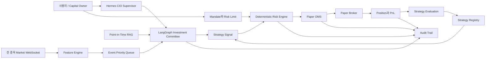
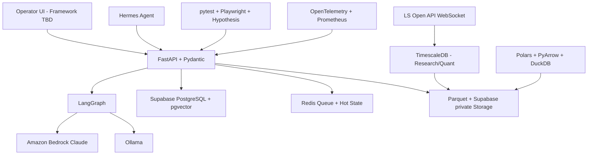

# Personal Hedge Fund Agent

> 전 종목을 실시간으로 감시하고, 투자 전략을 발굴·검증·배포하며, 위험 한도 안에서 Paper Trading까지 수행하는 개인형 멀티 에이전트 헤지펀드 시스템

[Master Plan](HEDGE_FUND_MASTER_PLAN.md) · [Core Plan](01-product/HEDGE_FUND_CORE_PLAN.md) · [Feature Backlog](02-engineering/HEDGE_FUND_IMPLEMENTATION_BACKLOG.md) · [Investment Case](01-product/MINIMUM_SERVICE_UNIT_SPEC.md) · [Tech Stack](02-engineering/TECH_STACK_DECISIONS.md) · [Database Schema](database/README.md)

## 현재 상태

이 저장소는 **구현 전 설계 단계**다. 현재는 구현에 직접 필요한 확정 문서만 유지하며 실행 가능한 Application Code는 아직 없다.

첫 번째 목표는 실제 자금 운용이 아니다. 단일 사용자와 단일 주식시장을 대상으로 다음 폐쇄 루프를 완성하는 것이다.

```text
전 종목 실시간 감시
  -> 중요한 이벤트 선별
  -> 멀티 에이전트 투자 판단
  -> 전략 및 주문 후보 생성
  -> 결정론적 위험 검사
  -> Paper 주문과 체결
  -> Position, PnL과 전략 재평가
```

이 프로젝트는 연구·개발 목적이며 금융·투자 자문을 제공하지 않는다. 실제 주문 기능은 별도의 법률·보안·브로커 인증과 Production Launch Gate를 통과하기 전까지 활성화하지 않는다.

## 우리가 만드는 것

사용자 관점에서 이 제품은 **나만의 Hedge Fund Investment Agent**다.

사용자가 다음과 같은 투자 Mandate를 정한다.

- 얼마의 자본을 운용할 것인가
- 어느 시장과 자산을 허용할 것인가
- 한 종목과 한 섹터에 얼마까지 투자할 것인가
- 하루에 얼마까지 손실을 허용할 것인가
- 자동 Paper 주문을 허용할 것인가
- 어떤 상황에서 즉시 거래를 중단할 것인가

시스템은 Mandate 안에서 시장 감시, 전략 연구, 투자 판단, 위험 검사, Paper 주문과 성과 평가를 수행한다.

내부 구현은 하나의 거대한 LLM이 아니다. 실제 헤지펀드처럼 역할과 권한을 분리한 **Digital Twin**이다.

> 제품은 하나의 CIO형 투자 에이전트처럼 보이지만, 내부에서는 Research, Portfolio, Risk와 Execution이 서로 다른 책임을 가진다.

## 왜 역할을 나누는가

투자 아이디어를 만든 Agent가 자신의 아이디어를 승인하고 주문까지 전송하면 잘못된 확신 하나가 곧바로 손실로 이어질 수 있다. 그래서 다음 책임을 분리한다.

| 역할 | 쉬운 설명 | 시스템 책임 |
|---|---|---|
| Research | 왜 이 종목을 봐야 하는가 | 데이터와 문서로 투자 가설 생성 |
| Bull/Bear Review | 이 가설의 장점과 약점은 무엇인가 | 찬성·반대 논리와 실패 조건 검토 |
| Portfolio | 지금 보유자산에 추가할 가치가 있는가 | 목표 비중 또는 Pass 제안 |
| Risk | 이 주문이 한도를 지키는가 | 결정론적 승인·축소·거절 |
| Execution | 주문이 어떤 상태인가 | OMS와 Paper Broker 처리 |
| Audit | 왜 이런 결과가 나왔는가 | 데이터부터 PnL까지 추적 |

Research와 Portfolio에는 LLM을 활용할 수 있다. Risk, 주문 상태, Position과 PnL은 반드시 결정론적 코드가 담당한다.

## 어떤 전략을 운용하는가

이 프로젝트는 `Long-only` 전략 하나를 만드는 시스템이 아니다. **수집한 데이터로 검증할 수 있고, 현재 주문·위험·회계 기능으로 안전하게 처리할 수 있는 헤지펀드 전략을 계속 추가하는 Multi-Strategy Platform**이다.

여기서 “전략을 채택한다”는 곧바로 주문한다는 뜻이 아니다. 전략은 다음 단계를 차례로 통과한다.

```text
전략 아이디어 등록
  -> 필요한 데이터와 거래 기능 확인
  -> Point-in-Time Backtest
  -> 독립 검증
  -> Shadow 관찰
  -> Paper Trading
  -> 사용자와 Risk 승인
  -> 승인된 환경에서만 Live 후보
```

| 전략군 | 쉬운 예시 | 활성화에 추가로 필요한 것 |
|---|---|---|
| Equity Directional | 상승 예상 종목 매수, 하락 예상 종목 공매도 | 공매도는 대차 가능 수량·비용·규제 확인 |
| Equity Market Neutral | 좋은 종목은 Long, 약한 종목은 Short해 시장 방향을 줄임 | Gross/Net·Factor Risk와 Borrow 관리 |
| Relative Value | 두 종목, ETF와 지수, 현물과 선물의 가격 차이 거래 | 복수 Leg 주문과 관계 붕괴 Stress |
| Event Driven | 실적, 공시, 합병, 유상증자, 지수 편입 이벤트 | 정확한 Event 시각과 조건·종료 상태 |
| Quant/Statistical | Momentum, Mean Reversion, Factor, Pairs | 충분한 표본, 과적합·비용·용량 검증 |
| Macro/Managed Futures | 지수·금리·통화·상품의 Trend와 Carry | 해당 선물·거시 데이터와 Margin 처리 |
| Options/Volatility | 변동성, Skew, Spread, Tail Hedge | Option Chain, Greeks, Multi-leg와 만기 처리 |
| Portfolio Hedge | 선물·옵션으로 시장·섹터 위험 축소 | Hedge 효과와 Basis·Margin 지속 측정 |

현재 데이터로 연구할 수 없는 Credit, Private Market, OTC 또는 해외 전략도 이름만 등록할 수는 있지만 활성 전략으로 승격하지 않는다. 필요한 데이터 사용권, 거래 Venue와 운영 능력이 추가된 뒤 같은 Gate를 통과해야 한다.

## 한눈에 보는 시스템



## 실제 동작 예시

예를 들어 어떤 종목의 가격과 거래량이 갑자기 상승했다고 가정한다.

1. LS증권 Open API WebSocket이 해당 Tick 체결과 10단계 호가를 수신한다.
2. Feature Engine이 1분 수익률, 거래량 Z-score와 상대강도를 갱신한다.
3. Event Engine이 급변 이벤트를 만들고 중요도를 계산한다.
4. 상위 이벤트만 LangGraph 투자위원회에 전달한다.
5. Research Agent가 당시 이용 가능했던 공시나 뉴스 근거를 검색한다.
6. Bull/Bear Reviewer가 상승 논리와 실패 가능성을 비교한다.
7. Portfolio Agent가 `2% 목표 비중` 또는 `PASS`를 제안한다.
8. 승인된 Strategy가 제안을 `OrderIntent`로 변환한다.
9. Risk Engine이 종목 비중, 섹터 Exposure와 일일 손실 한도를 검사한다.
10. 승인되면 Paper OMS가 주문을 생성하고 Paper Broker가 체결을 모의한다.
11. Position과 PnL이 갱신되고 결과가 해당 전략 성과에 귀속된다.
12. 모든 단계는 하나의 Trace로 연결되어 나중에 Replay할 수 있다.

중요한 점은 Agent의 `매수 의견`이 곧 주문이 아니라는 것이다. Agent Decision, Strategy Signal, Risk Decision과 Order는 서로 다른 객체다.

## 금융 비전공자를 위한 핵심 용어

| 용어 | 의미 | 개발 관점 |
|---|---|---|
| Universe | 시스템이 감시하거나 거래할 수 있는 종목 집합 | Version이 있는 종목 Snapshot |
| Market Data | 가격, 거래량, 매수·매도 호가 | WebSocket Event |
| Feature | 원시 시세에서 계산한 판단 재료 | 수익률, 변동성, 거래량 Z-score |
| Signal | 전략이 만든 매수·보유·청산 의사 | 아직 주문이 아님 |
| OrderIntent | 목표 Position에 도달하기 위한 주문 후보 | Risk 검사 전 객체 |
| Order | Broker에 제출하는 구체적인 주문 | 수량, 가격, 주문 유형 포함 |
| Fill | 주문이 실제 또는 모의로 체결된 결과 | Position과 Cash 변경 원인 |
| Position | 현재 보유한 종목과 수량 | Fill로만 변경되어야 함 |
| Exposure | 특정 종목·섹터·시장에 노출된 정도 | Risk 한도 대상 |
| PnL | Profit and Loss, 손익 | 실현손익과 미실현손익 |
| Drawdown | 최고점 대비 자산 감소폭 | 전략 중단 기준 |
| Slippage | 기대 가격과 실제 체결 가격의 차이 | Backtest와 Paper 체결비용 |
| OMS | Order Management System | 주문 상태 머신과 멱등성 |
| RAG | 문서를 검색해 LLM 판단에 근거를 제공하는 방식 | Evidence ID를 반환해야 함 |
| Point-in-Time | 그 당시 실제로 알 수 있었던 데이터만 사용 | 미래 데이터 유입 방지 |
| Backtest | 과거 데이터로 전략을 검증 | 비용·편향·재현성 검사가 필요 |
| Shadow | 신호만 만들고 주문은 내지 않는 단계 | 신규 전략 관찰 환경 |
| Paper Trading | 실제 돈 없이 주문과 체결을 모의 | Core의 최종 실행 환경 |
| Kill Switch | 신규 주문을 즉시 막는 비상 통제 | Agent보다 높은 우선순위 |
| Long/Short | 상승 후보는 매수하고 하락 후보는 공매도하는 전략 | Borrow와 Gross/Net Exposure가 필요 |
| Market Neutral | 시장 상승·하락 영향은 줄이고 종목 간 차이를 추구 | Long과 Short 위험을 함께 관리 |
| Relative Value | 서로 관련된 자산의 가격 관계가 어긋난 구간을 거래 | Pair·Basket·Multi-leg 계약이 필요 |
| Event Driven | 공시·실적·합병 등 특정 사건을 근거로 거래 | Event 시점과 조건을 정확히 보존 |
| Strategy Capability Gate | 전략에 필요한 데이터·상품·주문·위험 기능이 준비됐는지 검사 | 미충족 시 Research 또는 Shadow에만 머묾 |

## Core 기능

Core는 아래 P0 기능만 구현한다. 세부 완료 조건은 [Core Feature Backlog](02-engineering/HEDGE_FUND_IMPLEMENTATION_BACKLOG.md)를 따른다.

| 영역 | 구현 기능 |
|---|---|
| 사용자 통제 | Mandate, Risk Limit, 수동 승인, Kill Switch |
| 시장 데이터 | Instrument Universe, WebSocket, 정규화, Gap/Staleness |
| 실시간 분석 | Feature Engine, Event 탐지, Priority Queue |
| 투자 판단 | Point-in-Time RAG, Research/Bull-Bear/Portfolio Workflow |
| 전략 연구 | Strategy Registry, Backtest, Shadow와 Paper 승격 |
| 거래 | Signal, Target Position, Risk Engine, Paper Broker와 OMS |
| 회계 상태 | Cash, Position, 실현·미실현 PnL과 Exposure |
| 운영 | Audit, Replay, Dashboard와 장애 대응 |

## Core에서 하지 않는 것

- 실제 자금 주문
- 실제 대차계약을 사용하는 공매도와 실제 Margin 거래
- 검증되지 않은 선물·옵션 상품의 Paper/Live 주문
- 외부 투자자 자금과 공식 Fund Accounting
- 모든 헤지펀드 부서의 Agent 자동화
- Agent가 생성한 임의 Python 전략의 자동 실행
- Multi-Region과 복수 Broker Failover
- 다중 사용자와 다수 Fund
- HFT 수준의 초저지연 거래

장기 목표를 버린 것이 아니라 End-to-End Paper Loop가 안정된 뒤 하나씩 확장한다.

## 기술 스택



| 도구 | 이 프로젝트에서의 역할 |
|---|---|
| Hermes | 사용자 명령, CIO형 Supervisor, Tool과 Skill 실행 |
| LangGraph | 투자위원회와 Strategy Workflow 상태 관리 |
| Bedrock Claude | 통합·Production 환경의 주 LLM |
| Ollama | 로컬 개발, 테스트와 저비용 보조 모델 |
| Supabase | PostgreSQL, pgvector, Auth와 Artifact Metadata |
| Redis | Event Queue, 최신 상태 Cache와 Dedup |
| Docker | 서비스별 Runtime 격리 |
| FastAPI | 위험한 Command를 포함한 Backend API |
| Polars/Parquet/DuckDB | Market Data, Feature와 Backtest Dataset 처리 |
| Frontend | Framework 미정, Next.js + TypeScript 우선 후보 |

자세한 선택 근거와 Package 목록은 [Technology Stack Decisions](02-engineering/TECH_STACK_DECISIONS.md)에 있다.

### Hermes와 LangGraph의 차이

- Hermes는 사용자의 요청을 이해하고 필요한 Workflow를 시작하는 상위 Supervisor다.
- LangGraph는 Research, Review와 Portfolio 판단의 순서와 상태를 관리한다.
- 두 도구 모두 Risk Limit이나 OMS Database를 직접 수정하지 않는다.

### Supabase의 경계

Supabase는 거래 상태, 전략, Agent 판단과 RAG Metadata의 전사 운영 Source of Truth다. LS증권 Tick과 10단계 호가는 별도 TimescaleDB에 적재하며 직접 Credential은 리서치·퀀트에만 부여한다. 장기 Archive는 Parquet와 Supabase private Storage에 두고, 다른 본부는 `market-api`의 Snapshot·Bar·Feature Endpoint로 조회한다. 최신 상태와 Queue는 Redis가 담당한다.

## 개발자가 이해해야 할 4가지 계약

### 1. Event Contract

모든 Event는 최소 다음 필드를 가진다.

```text
event_id, event_type, event_time, received_at,
schema_version, trace_id, correlation_id, source
```

### 2. Agent Decision Contract

```text
decision_id, scope_instrument_ids, strategy_family, directionality, thesis,
confidence, evidence_ids, invalidation,
target_portfolio[], expires_at, model_version
```

### 3. Risk Decision Contract

```text
intent_group_id, order_intent_ids[], mandate_version,
decision: APPROVE | RESIZE | REJECT,
approved_legs[], aggregate_exposure, reason_codes, decided_at
```

### 4. Order State Contract

```text
OrderIntent:
DRAFT -> RISK_PENDING -> APPROVED | RESIZED | REJECTED | EXPIRED
APPROVED | RESIZED -> READY_TO_SUBMIT

IntentGroup:
DRAFT -> RISK_PENDING -> APPROVED -> EXECUTING
EXECUTING -> COMPLETED | PARTIAL_RECOVERY | CANCELLED | FAILED_SAFE

Broker Order:
CREATED -> SUBMITTED -> ACKNOWLEDGED -> PARTIALLY_FILLED -> FILLED
... -> CANCEL_PENDING -> CANCELLED
SUBMITTED -> REJECTED
Broker 상태 불명확 -> UNKNOWN
```

Risk 승인은 Broker Order 상태가 아니라 `risk_decision_id` 제출 전제조건이다. `UNKNOWN`이면 신규 주문을 차단하고 Broker Reconciliation을 실행한다.

서비스 내부 구현보다 이 계약의 Version과 호환성을 먼저 지켜야 한다.

## 개발 시작 순서

아직 Application Scaffold가 없으므로 현재는 다음 순서로 설계를 확인한다.

1. 이 README로 제품과 금융 흐름을 이해한다.
2. [Core Feature Backlog](02-engineering/HEDGE_FUND_IMPLEMENTATION_BACKLOG.md)에서 P0 완료 조건을 확인한다.
3. [Technology Stack Decisions](02-engineering/TECH_STACK_DECISIONS.md)에서 서비스 경계와 Package를 확인한다.
4. 확정된 한국 주식·LS증권 Feed를 기준으로 Paper Broker와 주문 Adapter를 결정한다.
5. Event, Decision, Risk와 Order Schema를 코드로 먼저 만든다.
6. `Market Event -> Paper Fill -> PnL`의 가장 얇은 수직 기능을 구현한다.
7. 그 위에 LangGraph와 RAG를 연결한다.
8. 마지막에 Hermes Supervisor와 Dashboard를 연결한다.

예상 구현 순서는 다음과 같다.

```text
Repository Scaffold
  -> Supabase Schema와 Redis
  -> WebSocket와 Event Normalize
  -> Feature/Event Engine
  -> Paper OMS와 Portfolio
  -> Risk Engine
  -> LangGraph와 RAG
  -> Strategy Registry와 Backtest
  -> Hermes와 Dashboard
  -> Replay, 부하와 장애 테스트
```

## 예상 저장소 구조

다음은 구현 시 사용할 최소 구조다. 현재 생성 완료된 구조를 의미하지 않는다.

```text
personal-hedge-fund-agent/
├── apps/
│   ├── api/
│   └── web/
├── services/
│   ├── streaming/
│   ├── agent_workflow/
│   ├── strategy_factory/
│   ├── strategy_plugins/
│   ├── risk/
│   ├── oms/
│   └── portfolio/
├── integrations/
│   ├── market_data/
│   ├── paper_broker/
│   ├── bedrock/
│   ├── ollama/
│   ├── hermes/
│   └── supabase/
├── contracts/
│   ├── strategy/
│   └── execution/
├── migrations/
├── tests/
│   ├── unit/
│   ├── integration/
│   ├── replay/
│   └── e2e/
├── infrastructure/
├── docker-compose.yml
└── README.md
```

## 첫 번째 완료 시나리오

Core 구현은 다음 Scenario가 통과하면 기능적으로 연결됐다고 본다.

- 전 종목 WebSocket을 수신한다.
- 특정 종목의 급변 Event를 탐지한다.
- Agent가 당시 이용 가능한 근거로 구조화 Decision을 만든다.
- 승인된 Strategy가 OrderIntent를 만든다.
- Risk Engine이 주문을 승인·축소·거절한다.
- Paper Broker가 승인 주문을 모의 체결한다.
- OMS와 Portfolio가 Position, Cash와 PnL을 갱신한다.
- 한 건의 주문을 Market Event부터 PnL까지 역추적한다.
- Feed 중단 시 신규 진입이 차단된다.
- Kill Switch 실행 시 미체결 주문이 취소된다.

최종 Core 완료 기준은 10거래일 연속 Paper Dry Run이다.

## 문서 구조와 읽는 순서

`HEDGE_FUND_MASTER_PLAN.md`가 전체 제품, 조직, 통제와 단계별 확장 범위를 정하는 최상위 기준이다. 나머지 문서는 마스터 플랜의 특정 영역을 구현 가능한 수준으로 구체화하며, 마스터 플랜과 충돌하는 새 범위를 독자적으로 확정하지 않는다.

```text
docs/
├─ README.md                         # 문서 지도와 현재 상태
├─ HEDGE_FUND_MASTER_PLAN.md         # 최상위 제품·조직·운영 기준
├─ 01-product/                       # 제품 범위와 Domain Contract
├─ 02-engineering/                   # 구현 Backlog와 기술 결정
├─ 03-data/                          # 데이터 수집·품질·저장·사용 기준
├─ 04-organization/                  # Agent 조직과 직원 Profile
├─ 05-teams/                         # 담당자별 실행·인수인계 가이드
└─ database/                         # Supabase·TimescaleDB Schema와 ERD
```

| 문서 | 언제 읽는가 |
|---|---|
| [Master Plan](HEDGE_FUND_MASTER_PLAN.md) | 제품의 전체 비전, 실제 서비스 전환과 장기 확장 경계를 확인할 때 |
| [Investment Case Specification](01-product/MINIMUM_SERVICE_UNIT_SPEC.md) | 서비스 최소 단위의 상태, 증거, API와 완료 기준을 구현할 때 |
| [Core Plan](01-product/HEDGE_FUND_CORE_PLAN.md) | 제품 범위와 16주 실행 계획이 필요할 때 |
| [Feature Backlog](02-engineering/HEDGE_FUND_IMPLEMENTATION_BACKLOG.md) | 기능 구현과 완료 조건을 확인할 때 |
| [Technology Stack](02-engineering/TECH_STACK_DECISIONS.md) | Library, Runtime과 서비스 경계를 확인할 때 |
| [Data Governance](03-data/DATA_GOVERNANCE_GUIDE.md) | 데이터 Schema, 시점, 품질과 보존을 설계할 때 |
| [Data Sources and Libraries](03-data/RESEARCH_DATA_SOURCES_AND_LIBRARIES.md) | 본부별 수집·생성 데이터, API와 권장 Library를 확인할 때 |
| [Database Schema Foundation](database/README.md) | Supabase·TimescaleDB Migration, 테이블 소유권, 불변식과 적용 순서를 확인할 때 |
| [Agent Employee Profiles](04-organization/AGENT_EMPLOYEE_PROFILES.md) | 8개 Hermes Supervisor와 전문 Agent 직원의 역할·권한·Eval을 구현할 때 |
| [재일님 팀 가이드](05-teams/TEAM_JAEIL_RESEARCH_QUANT_GUIDE.md) | 리서치·퀀트 수집, TimescaleDB와 전략 연구를 구현할 때 |
| [도현님 팀 가이드](05-teams/TEAM_DOHYUN_TRADING_ACCOUNTING_GUIDE.md) | Trading, OMS, Ledger, Position과 NAV를 구현할 때 |
| [동규님 팀 가이드](05-teams/TEAM_DONGGYU_RISK_QA_GUIDE.md) | Risk Gate, QA, Audit와 Incident를 구현할 때 |
| [영주님 팀 가이드](05-teams/TEAM_YOUNGJU_CEO_HR_GUIDE.md) | CEO Agent, Mandate, 위원회와 Agent 인사팀을 구현할 때 |

README와 Master Plan, Database 기준서와 ERD를 포함한 15개 Markdown이 현재 확정 문서 전체다. Cloud 공급자별 후보안과 추가 조직 확장 문서는 해당 결정이 승인될 때 ADR과 함께 새로 작성한다.

## 문서 우선순위와 변경 규칙

문서가 충돌하면 다음 순서로 해석한다.

1. `HEDGE_FUND_MASTER_PLAN.md`의 제품 정의, 조직, 통제 원칙, 출시 단계와 확장 경계
2. `MINIMUM_SERVICE_UNIT_SPEC.md`의 Domain Contract와 `DATA_GOVERNANCE_GUIDE.md`의 데이터 통제
3. `TECH_STACK_DECISIONS.md`의 Runtime·Library·저장소 경계
4. `HEDGE_FUND_CORE_PLAN.md`와 `HEDGE_FUND_IMPLEMENTATION_BACKLOG.md`의 단기 범위, 구현 순서와 완료 조건
5. `AGENT_EMPLOYEE_PROFILES.md`와 팀별 가이드의 역할·권한·세부 구현
6. `README.md`의 문서 지도와 현재 상태 요약

하위 문서가 마스터 플랜의 기준을 더 구체화할 수는 있지만 변경할 수는 없다. 불일치를 발견하면 하위 문서를 먼저 수정하고, 마스터 플랜 자체의 변경이 필요한 경우에는 결정 근거를 ADR로 승인한 뒤 관련 문서를 같은 변경에서 함께 갱신한다.

현재 미결정 항목은 Paper/Live Broker, Frontend Framework, Cloud Provider, 첫 활성 Strategy Portfolio, TimescaleDB Retention, Production Data Vendor와 자동 Paper 승인 방식이다. Master Plan은 Core의 확정 계약을 덮어쓰지 않는다. 후보 기술이나 추가 확장안은 ADR 승인 전까지 새로운 Markdown으로 추가하지 않으며, 결정이 바뀌면 README와 영향을 받는 계약·팀 가이드를 같은 PR에서 수정한다.

## 개발 원칙

1. Agent보다 데이터 계약과 Risk/OMS를 먼저 안정화한다.
2. LLM 출력은 항상 Pydantic Schema로 검증한다.
3. Agent Decision과 Order를 같은 객체로 취급하지 않는다.
4. 모든 주문은 결정론적 Risk Engine을 통과한다.
5. 미래 데이터가 Backtest와 과거 Replay에 들어가지 않게 한다.
6. Position은 Fill 또는 승인된 Adjustment로만 변경한다.
7. Replay 환경은 실제 Broker Credential을 가질 수 없다.
8. 새 Library는 기존 Stack으로 해결할 수 없는 문제와 제거 기준을 함께 기록한다.
9. 위험한 기능은 실패 시 거래 확대가 아니라 Entry 차단 방향으로 동작한다.
10. 구현 완료는 코드 작성이 아니라 Acceptance Scenario 통과를 의미한다.

## 참고 프로젝트

- [NousResearch/hermes-agent](https://github.com/NousResearch/hermes-agent): 상위 Supervisor, Tool, Skill과 사용자 Context 설계 참고
- [TauricResearch/TradingAgents](https://github.com/TauricResearch/TradingAgents): 전문 Agent 역할과 Bull/Bear 토론 구조 참고

TradingAgents의 역할 분리 아이디어를 참고하지만 이 프로젝트는 전 종목 실시간 감시, Strategy Factory, 결정론적 Risk/OMS와 Paper 운용 폐쇄 루프를 별도 목표로 한다.

## 주의사항

이 프로젝트의 Agent 판단은 확률적이며 틀릴 수 있다. Backtest와 Paper 성과는 실제 수익을 보장하지 않는다. Market Data 품질, 거래비용, Slippage, 모델 변경과 구현 오류가 결과에 영향을 줄 수 있다.

실제 자금 거래 기능을 추가할 때는 관할 법률, Broker 계약, Market Data License, 보안, 운영 통제와 사용자 적합성을 별도로 검토해야 한다.
