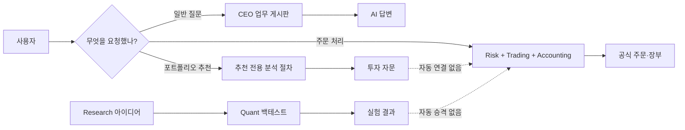
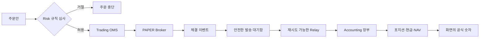

# 지금 이 시스템은 실제로 어떻게 돌아가는가 — 쉬운 해설판

> **상태: HISTORICAL SNAPSHOT.** 현행 구조는 [Current Architecture](../../CURRENT_PROJECT_ARCHITECTURE.md)를 따른다.
>
> 이 문서는 개발 용어를 최대한 줄인 설명판이다. 정확한 코드 위치와 세부 근거는 [상세 기술판](./AS_IS_RUNTIME_BLUEPRINT_2026-08-17.md)에 있다.
>
> 기준 스냅샷: 2026-08-17, commit `5c85168b`. “현재”라는 표현은 이 시점의 상세 기술판을 뜻한다.

## 먼저 한 문장으로

이 시스템은 **사용자의 질문을 여러 AI 부서에 나눠 조사시키는 회사 운영 시스템**과 **주문·체결·장부를 규칙대로 처리하는 금융 시스템**을 함께 둔 구조다.

여기서 가장 중요한 점은 이것이다.

> **AI가 의견을 말하는 부분과 실제 돈·주문·장부를 바꾸는 부분은 분리되어 있다.**

AI 직원은 조사하고 제안한다. 실제 주문 가능 여부는 규칙으로 작성된 Risk와 Trading 코드가 판단하고, 실제 보유 수량과 돈은 Accounting 장부가 기록한다.

---

## 1. 회사를 하나 떠올리면 이해하기 쉽다

이 프로젝트를 실제 투자회사라고 생각하면 다음과 같다.

| 현실 회사 | 이 프로젝트에서 해당하는 것 | 실제 역할 |
|---|---|---|
| 고객용 안내 데스크 | AI Office 화면 | 질문을 받고 진행 상황과 결과를 보여준다 |
| 비서실 | BFF | 요청을 검사하고 올바른 부서나 작업 절차로 보낸다 |
| 대표이사 | CEO Agent | 질문을 분석하고 필요한 부서를 고른다 |
| 부서장 | Research/Quant/Trading/Risk/QA 등의 Hermes Agent | 맡은 업무를 처리하거나 직원에게 나눈다 |
| 실무 직원 | Employee Worker | 작은 조사 한 가지를 수행해 보고서를 쓴다 |
| 사내 업무 게시판 | Hermes Kanban | 누가 어떤 일을 맡았고 완료했는지 기록한다 |
| 리스크 관리 규정 | Risk Engine | 주문을 허용할지 규칙으로 판정한다 |
| 주문 처리부 | Trading OMS | 주문의 생성·제출·체결·취소 상태를 관리한다 |
| 회계 장부 | Accounting Ledger | 체결된 거래를 공식 자산·현금·수익 기록으로 바꾼다 |
| 연구소 | Research Factory + Quant Worker | 아이디어를 만들고 백테스트해 검증한다 |

따라서 화면에 AI의 좋은 답변이 나타났다고 해서 주문이 나간 것은 아니다. 다음 세 문장은 각각 다른 상태다.

1. “이 종목이 좋아 보입니다.” → AI의 의견
2. “이 주문은 규정상 허용됩니다.” → Risk의 판정
3. “100주가 실제로 체결되어 장부에 반영됐습니다.” → Trading과 Accounting의 공식 기록

---

## 2. 사실은 네 개의 시스템이 함께 있다

겉으로는 하나의 AI 헤지펀드처럼 보이지만, 코드 안에서는 네 가지 큰 흐름이 따로 움직인다.

### A. CEO에게 일반 질문하기

예: “요즘 시장 위험을 조사해서 보고해 줘.”

- CEO가 질문을 읽는다.
- 필요한 부서를 고른다.
- 업무 게시판에 Research, Risk 같은 부서의 할 일을 만든다.
- 각 부서가 결과를 게시판에 올린다.
- CEO가 결과를 모아 최종 답변을 만든다.

이 흐름의 목적은 **조사와 답변**이다.

### B. 포트폴리오 추천받기

예: “초보 투자자이고 최대 손실 10%를 원할 때 포트폴리오를 추천해 줘.”

- 사용자의 투자 성향을 검사한다.
- Research부터 CEO까지 정해진 순서로 의견을 만든다.
- 위험하거나 자료가 부족하면 HOLD, 즉 보류한다.
- 최종 추천을 화면에 보여준다.

이 흐름의 목적은 **자문 결과 생성**이다. 사용자가 추천에 APPROVE를 눌러도 실제 주문 승인으로 바뀌지 않는다.

### C. 실제 PAPER 주문과 장부 처리

예: “삼성전자 100주 매수 주문안을 등록하고 모의 체결한다.”

- Trading이 주문안을 등록한다.
- Risk의 승인·거절 결과를 받는다.
- 승인된 주문안만 주문 객체가 될 수 있다.
- PAPER Broker가 접수와 모의 체결 결과를 보낸다.
- 체결 사실이 안전한 전달함에 기록된다.
- Accounting이 체결을 읽어 장부·현금·보유 종목·NAV를 다시 계산한다.

이 흐름의 목적은 **공식 주문 상태와 회계 기록**이다.

### D. 새로운 투자 아이디어 연구하기

예: “거래대금 급증 후 단기 반전 전략이 실제로 효과가 있는지 검증한다.”

- Research AI가 아이디어를 제안한다.
- 일반 Python 코드가 형식과 근거를 검사한다.
- 통과한 아이디어만 Quant 가설이 된다.
- 실험 대기열에 들어간다.
- Quant Worker가 데이터를 불러 백테스트한다.
- 과최적화나 우연한 결과가 아닌지 검사한다.
- 결과를 DB에 남기고 AI가 해석한다.

이 흐름의 목적은 **전략 후보 실험**이다. 결과가 좋아도 자동으로 실제 주문 전략이 되지는 않는다.



---

## 3. 사용자가 CEO에게 질문하면 무슨 일이 생기나

질문 하나를 예로 들어 보자.

> “현재 보유 종목과 시장 상황을 보고 가장 큰 위험 세 가지를 알려줘.”

### 1단계: 화면이 질문을 보낸다

AI Office가 질문을 BFF에 보낸다. BFF는 사용자가 화면에서 직접 DB나 주문 시스템을 건드리지 못하게 중간에서 요청을 받는 창구다.

### 2단계: 같은 질문이 두 번 실행되지 않게 막는다

더블 클릭이나 네트워크 재전송으로 같은 요청이 두 번 들어올 수 있다. Mirror가 요청 번호를 기록해 두고, 이미 실행한 요청이면 기존 결과를 돌려준다.

쉽게 말하면 은행 이체 버튼을 두 번 눌러도 이체가 두 번 생기지 않게 막는 것과 비슷하다.

### 3단계: CEO용 업무 카드를 만든다

CEO는 바로 긴 답변을 만드는 대신 사내 Kanban 게시판에 대표 업무를 하나 만든다. 이 카드에는 질문과 요청 번호, 필요한 경우 투자 방침 정보가 들어간다.

### 4단계: CEO가 필요한 부서를 고른다

예를 들어 다음처럼 업무를 나눌 수 있다.

- Research: 보유 종목 관련 뉴스와 공시 확인
- Risk: 포트폴리오 집중도와 손실 위험 확인
- Accounting: 현재 보유량과 NAV 확인
- QA: 답변 근거와 모순 점검

부서를 항상 모두 부르는 것은 아니다. 질문에 필요한 부서만 고른다.

### 5단계: 중앙 배달부가 카드를 부서로 전달한다

`Kanban Dispatcher`는 게시판에서 시작할 수 있는 카드를 찾아 해당 부서 AI를 실행한다. 현재 구조에서는 이 배달부가 중앙에 하나 있어 병목이 될 수 있다.

### 6단계: 부서 결과를 모은다

각 부서가 완료하거나 실패하면 CEO Supervisor가 이를 감지한다. 필요한 경우 다음 행동 중 하나를 고른다.

- 실패한 업무를 다시 시도
- 다른 부서로 재계획
- 사용자에게 추가 정보 요청
- QA 검토 카드 생성
- CEO 최종 종합 카드 생성

### 7단계: 화면이 진행 상황을 계속 읽는다

처음 HTTP 요청은 모든 조사가 끝날 때까지 기다리지 않는다. 접수가 끝나면 작업 번호를 먼저 돌려주고, 화면이 그 번호로 진행 상황과 최종 결과를 계속 조회한다.

### 주의할 점

일반 분석 질문은 빠른 답변을 위해 CEO 종합과 QA 검토가 동시에 진행될 수 있다. 따라서 “CEO 답변 완료”와 “QA 감사 완료”가 항상 같은 순간은 아니다. 반면 실제 결정과 관계된 binding mode에서는 QA가 끝나기 전에 최종 종합을 만들지 않도록 되어 있다.

---

## 4. 포트폴리오 추천은 어떻게 만들어지나

포트폴리오 추천은 CEO 게시판 방식과 다른 별도 엔진을 쓴다.

### 접수

BFF가 다음을 먼저 확인한다.

- 요청한 사용자와 결과를 볼 사용자가 같은가
- 선택한 투자 대상 범위가 존재하는가
- 공식 투자 방침을 적용하는 요청이라면 방침 버전과 내용 해시가 맞는가
- 단순 연습용 자문이라면 공식 방침을 적용한 것처럼 위장하지 않았는가

### 대기열 저장

추천 작업은 SQLite 파일에 저장된다. API는 작업만 등록하고, 별도의 Portfolio Worker가 하나씩 가져가 실행한다. API가 꺼졌다 켜져도 파일이 남아 있으면 작업 상태를 되찾을 수 있다.

다만 이 방식은 한 서버에는 단순하고 좋지만, 여러 서버로 동시에 확장하기에는 적합하지 않다.

### 실제 분석 순서

```text
사용자 정보 검사
  → Research 조사
  → Quant 전략 검토
  → Trading 실행 가능성 검토
  → Risk 사전 검사와 부서 검토
  → QA 근거 검사와 부서 검토
  → Accounting 영향 검토
  → CEO 종합
  → 최종 추천
```

각 부서에서 필요한 실무 AI 직원만 선택한다. 모든 직원이 항상 실행되는 구조는 아니다.

### 안전장치

- 실제 DB가 설정되어 있는데 데이터를 못 읽으면 가짜 테스트 데이터로 조용히 대신하지 않는다.
- 시장자료 품질이나 근거가 부족하면 HOLD 또는 DEGRADED로 끝난다.
- 결과에는 항상 `binding=false`, `external_writes=false`가 붙는다.
- 추천을 승인해도 주문을 만들지 않는다.

### 현재 발견된 버그

추천을 `APPROVE`하는 코드는 저장되지만, `REJECT` 처리는 코드 들여쓰기 문제로 저장 구간에 들어가지 않는다. 그래서 현재 구현에서는 거절 요청이 정상 결과를 반환하지 못할 가능성이 높다.

---

## 5. 실제 PAPER 거래는 어떻게 처리되나

이 부분이 AI의 말과 실제 금융 기록을 나누는 가장 중요한 경계다.

### 1단계: 주문안 등록

Trading은 먼저 `OrderIntent`, 즉 “이런 주문을 내고 싶다”는 주문안을 DRAFT 상태로 저장한다. 아직 주문이 아니다.

### 2단계: Risk 심사 요청

주문안이 Risk 심사 대기 상태가 된다. Risk Engine은 다음과 같은 공식 자료를 사용한다.

- 현재 포지션과 노출
- 거래 중지 상태
- 투자 방침과 한도
- 주문 수량·가격·유효시간
- 선택적으로 P1 분석 결과

Risk의 AI 직원이 의견을 낼 수는 있지만, 최종 허용·거절 판정은 규칙 기반 Risk Engine이 소유한다.

### 3단계: 주문 생성과 제출

Risk가 허용한 주문안만 `READY_TO_SUBMIT` 상태가 된다. Trading OMS는 여기서 주문 객체를 만들고, 제출 직전에도 만료·수량·상태를 다시 검사한다.

### 4단계: Broker 이벤트

현재 명확히 구현된 case 경로는 PAPER Broker다. Broker의 접수, 체결, 거절, 취소 같은 이벤트가 들어오면 OMS가 주문 상태를 바꾼다.

예를 들어:

```text
CREATED → SUBMITTED → ACKNOWLEDGED → PARTIALLY_FILLED → FILLED
```

같은 Broker 이벤트나 같은 체결 번호가 두 번 들어와도 한 번만 처리하도록 방어한다. 주문 수량보다 더 많이 체결되는 것도 막는다.

### 5단계: 체결 사실을 안전하게 전달

주문 DB 저장과 “회계팀에 체결 사실 알리기”를 동시에 완벽하게 성공시키기 어렵다. 그래서 Trading은 체결과 함께 `Outbox`라는 발송 대기함에 메시지를 저장한다.

별도 Relay가 이 대기함을 읽어 Redis에 발행한다.

- 성공하면 SENT
- 일시 실패하면 기다렸다 재시도
- 너무 많이 실패하면 DLQ, 즉 사람이 확인할 실패 보관함

### 6단계: Accounting이 공식 장부를 만든다

Accounting은 SENT가 된 체결만 읽는다. 같은 체결을 이미 처리했는지 확인한 뒤 다음을 갱신한다.

- 복식부기 분개
- 현금
- 보유 수량과 평균 원가
- 결제 예정 금액
- 시장 가격을 반영한 NAV

시장 가격을 못 구한 경우에는 체결과 포지션 사실은 기록하지만, NAV를 추정해서 채우지 않고 보류한다. 잘못된 숫자를 정상처럼 보여주지 않기 위한 정책이다.



---

## 6. Research와 Quant의 자동 연구 공장

이 부분은 투자 아이디어를 대량으로 실험하는 연구소에 가깝다.

### 전체 주기

Factory는 기본적으로 15분마다 다음 작업을 시도한다.

1. 이전 Research 카드에서 제출된 아이디어를 수확한다.
2. 형식, 근거, 검증 가능성, 데이터 요구사항을 검사한다.
3. 통과한 아이디어를 Quant 가설로 바꾼다.
4. 어떤 가설을 먼저 시험할지 고른다.
5. 실험 대기열에 넣는다.
6. 별도 Quant Worker가 가설을 가져간다.
7. 필요한 데이터가 실제로 있는지 확인한다.
8. 결과를 보기 전에 전략 규칙을 고정한다.
9. 백테스트와 강건성 검사를 한다.
10. 결과와 실패 이유를 DB에 저장한다.
11. 다음 주기에 Quant AI에게 해석 작업을 준다.

### 결과를 보기 전에 규칙을 고정하는 이유

백테스트 결과를 본 뒤 전략 조건을 계속 바꾸면 우연히 좋아 보이는 결과를 만들기 쉽다. 이 시스템은 이를 줄이기 위해 먼저 전략 규칙의 지문을 만들고 사전등록한다.

그 뒤 다음과 같은 위험을 검사한다.

- 거래비용을 넣어도 유효한가
- 다른 기간에서도 유효한가
- 작은 조건 변화에 무너지지 않는가
- 비슷한 전략을 너무 많이 시험한 뒤 가장 좋은 것만 고른 것은 아닌가
- PBO/DSR 등 과최적화 지표가 위험하지 않은가

### AI와 일반 코드의 역할

| 단계 | 주 담당 |
|---|---|
| 새로운 아이디어 제시 | Research AI |
| 형식·데이터·파라미터 검사 | 일반 Python 코드 |
| 실험 우선순위 결정 | deterministic allocator |
| 실제 백테스트 | Quant Python Worker |
| 과최적화/강건성 판정 | 통계·규칙 코드 |
| 결과 해석과 후속 질문 | Quant AI |

AI가 백테스트 숫자를 마음대로 써서 통과시키는 구조가 아니다.

### 아직 없는 마지막 다리

좋은 실험 결과를 실제 거래 전략으로 승격하는 자동 절차는 없다. 현재는 다음 연결이 끊겨 있다.

```text
좋은 Quant 결과
  -X→ 정식 전략 승인
  -X→ Risk 승인
  -X→ Trading 주문 생성
```

이는 안전 측면에서는 보수적이지만, 완전 자동화된 헤지펀드로 보기는 어렵다는 뜻이다.

---

## 7. 어디에 어떤 데이터가 저장되나

| 저장소 | 쉬운 설명 | 저장되는 것 |
|---|---|---|
| PostgreSQL/Supabase | 회사의 공식 업무 DB | 투자 방침, 연구자료, 가설, 실험, 주문, 리스크 판정, 장부, 감사 기록 |
| TimescaleDB | 시세처럼 시간 순서가 중요한 대용량 DB | tick, 호가, bar, microstructure |
| Redis | 빠른 전달·임시 상태 보관함 | 이벤트, UI 중복 방지, Risk 거래 상태 |
| Hermes Kanban SQLite | AI 부서 업무 게시판 파일 | 카드, 담당자, 완료/실패 상태 |
| Portfolio SQLite | 추천 작업 전용 접수·진행 파일 | 추천 run, queue, 화면용 진행 상태 |

Redis나 Kanban에 보이는 내용은 공식 장부가 아니다. 공식 돈·보유 수량은 Accounting DB가 기준이다.

---

## 8. 지금 실제로 잘 구현된 부분

- 동일 사용자 요청의 중복 실행 방지
- CEO의 부서별 업무 분배와 비동기 결과 수집
- 포트폴리오 추천 전용 전체 분석 흐름
- 실시간/배치 시장자료 수집과 조회 API
- Research 아이디어부터 Quant 백테스트까지의 자동 공장
- 주문 상태 머신과 중복 Broker 이벤트 방어
- Risk 규칙 기반 주문 심사
- 체결 Outbox의 재시도와 DLQ
- 체결을 복식부기·포지션·NAV로 바꾸는 Accounting consumer
- Risk 결과를 QA 감사 기록으로 보내는 event worker
- 여러 과정의 idempotency, 즉 같은 요청을 두 번 처리하지 않는 방어

---

## 9. 구현은 있지만 덜 연결된 부분

- Risk 이벤트를 별도 조회 모델에 쌓는 worker 코드는 있지만 기본 실행 구성에는 빠져 있다.
- Platform IAM은 DB 권한과 Redis namespace를 실제로 만들 수 있지만 상시 실행 서비스 연결이 분명하지 않다.
- QA의 일부 production endpoint는 별도 승인 환경변수가 켜져야 작동한다.
- Research용 논문·YouTube MCP는 선택 실행 항목이다.
- 여러 YAML 업무 절차는 테스트와 PAPER 모드에서는 움직이지만 production 실행 연결은 없다.

---

## 10. 현재 가장 큰 문제들

### 1. 업무 조정 방식이 여러 개다

CEO 질문은 Kanban, 포트폴리오 추천은 LangGraph, 일부 통합 업무는 YAML runner, 실제 거래는 각 부서 API 상태 머신을 쓴다. 이 네 방식이 하나의 공통 작업 상태를 공유하지 않는다.

### 2. 추천 거절 처리 버그가 있다

앞서 설명한 것처럼 `REJECT`가 저장되지 않는 코드 문제가 있다.

### 3. 화면이 테스트 데이터를 보여줄 수 있다

공식 Accounting DB를 읽지 못하면 BFF 안의 `PaperLoopTest`로 만든 Demo 화면이 사용될 수 있다. 화면에 LIVE인지 DEMO인지 매우 분명하게 표시하지 않으면 운영자가 실제 숫자로 오해할 수 있다.

### 4. 여러 서버로 늘리기 어렵다

CEO 게시판과 포트폴리오 대기열이 SQLite 파일과 공유 폴더에 의존한다. 한 서버에서는 간편하지만 AWS에서 여러 인스턴스로 늘릴 때 lock과 파일 공유 문제가 생긴다.

### 5. 중앙 배달부가 하나다

모든 Hermes 업무 카드가 중앙 dispatcher를 지나기 때문에 카드가 많아지면 병목이나 단일 장애점이 된다.

### 6. AI 직접 질문은 매번 새 프로세스를 띄운다

빠른 대화용으로는 시작 비용이 크고, 동시에 많은 요청이 들어올 때 대기열과 부하 제어가 어렵다.

### 7. 코드 주석과 메시지의 한글이 깨져 있다

여러 파일에서 글자가 깨져 있어 운영 로그를 읽기 어렵고, AI에게 전달되는 지시문 품질에도 영향을 줄 수 있다.

---

## 11. “완전 자동 헤지펀드인가?”에 대한 정확한 답

**아직 아니다.**

자동으로 되는 범위:

- 시장자료 수집
- AI 부서별 조사와 보고
- 포트폴리오 자문 생성
- 연구 아이디어 수집과 백테스트
- 명시적으로 들어온 PAPER 주문의 리스크 검사·모의 체결·회계 반영

자동으로 이어지지 않는 범위:

- AI 추천에서 실제 주문 생성
- 성공한 Quant 전략의 production 승격
- production YAML workflow의 전체 실행
- 여러 서버에 걸친 안정적인 task orchestration
- 실제 Broker 운영 상태와 자격 증명 확인

따라서 현재 시스템은 **자동 리서치·자문·PAPER 운영 플랫폼**에 더 가깝고, **연구부터 실거래까지 완전 자동으로 이어지는 펀드**는 아니다.

---

## 12. 가장 먼저 고칠 순서

### 바로 고칠 것

1. 포트폴리오 `REJECT` 저장 버그 수정
2. LIVE/DEMO/DEGRADED 표시를 화면과 모든 응답에 강제
3. 추천 승인과 주문 승인이 절대 섞이지 않는 테스트 추가
4. 실행되지 않는 중복 코드 제거

### 그다음 연결할 것

5. 좋은 Quant 결과를 “실행 후보” 문서로 만들기
6. QA→CEO→Risk의 정식 승인 후에만 Trading이 소비하도록 하기
7. Risk projection worker와 Platform IAM worker를 기본 서비스에 연결
8. 모든 작업에 공통 case ID와 trace ID 사용

### 확장 전에 바꿀 것

9. Portfolio SQLite queue를 PostgreSQL이나 관리형 queue로 이전
10. Kanban을 분산 저장소로 이전하거나 dispatcher를 안전하게 여러 개 운영
11. Docker socket과 고정 container 이름 의존 제거
12. readiness가 실제 DB·Redis·하위 서비스를 직접 확인하도록 통일

---

## 13. 자주 나오는 용어를 쉬운 말로

| 용어 | 쉬운 뜻 |
|---|---|
| API | 프로그램끼리 요청하고 답하는 창구 |
| BFF | 화면 전용 중간 서버. 여러 내부 서비스를 대신 호출한다 |
| Agent | 상황을 읽고 무엇을 할지 자연어로 판단하는 AI 담당자 |
| Worker | 정해진 작은 업무를 실제로 수행하는 직원 프로그램 |
| Runner / Engine | 정해진 규칙을 재현 가능하게 계산하는 일반 코드 |
| Kanban | 할 일, 담당자, 진행 상태를 적는 업무 게시판 |
| LangGraph | 여러 분석 단계를 순서와 조건에 따라 실행하는 도구 |
| 비동기 | 접수 번호를 먼저 주고 작업은 뒤에서 계속하는 방식 |
| Queue | 아직 처리하지 않은 작업의 대기 줄 |
| Binding | 실제 주문·한도·장부를 바꿀 법적·운영상 효력이 있음 |
| Non-binding | 의견이나 자문일 뿐 실제 상태를 바꾸지 않음 |
| Source of truth | 숫자가 다를 때 최종적으로 믿어야 하는 공식 원본 |
| Projection | 공식 데이터를 화면이나 조회 목적에 맞게 복사·가공한 모습 |
| Idempotency | 같은 요청이 두 번 와도 결과가 한 번만 생기는 성질 |
| State machine | 주문처럼 허용된 순서로만 상태가 바뀌게 하는 규칙 |
| Outbox | DB에 먼저 안전하게 적어 두는 이벤트 발송 대기함 |
| Relay | Outbox 메시지를 외부 전달 통로로 보내는 배달부 |
| Redis Stream | 여러 worker가 빠르게 이벤트를 주고받는 메시지 줄 |
| DLQ | 반복 실패한 메시지를 버리지 않고 따로 두는 실패 보관함 |
| Fail-closed | 자료가 없거나 고장 나면 승인하지 않고 안전하게 멈추는 방식 |
| PostgreSQL | 주문·장부·가설처럼 공식 구조화 데이터를 저장하는 DB |
| TimescaleDB | 시간 순서가 중요한 시세 데이터를 저장하도록 확장한 PostgreSQL |
| SQLite | 서버 없이 파일 하나로 쓰는 작은 DB |
| Compose | 여러 서버 프로그램을 어떤 설정으로 함께 띄울지 적은 실행 구성 |
| PAPER 거래 | 실제 돈을 보내지 않는 모의 거래 |
| NAV | 펀드의 순자산가치 |
| 사전등록 | 결과를 보기 전에 실험 규칙을 고정해 편향을 줄이는 절차 |
| 과최적화 | 과거 데이터에만 지나치게 맞아 실제 미래에는 실패하는 현상 |

---

## 14. 화면이나 로그를 볼 때 확인할 질문

운영자가 결과를 볼 때는 다음 순서로 확인하면 된다.

1. 이 결과는 AI 의견인가, Risk 판정인가, Accounting 공식 숫자인가?
2. 데이터 source가 LIVE인가 DEMO인가?
3. `as_of` 시각은 언제인가?
4. 추천 작업이 끝난 것인가, QA 감사까지 끝난 것인가?
5. APPROVE가 추천 승인인가 실제 주문 승인인가?
6. 주문이 생성된 것인가, Broker가 접수한 것인가, 실제 체결된 것인가?
7. 체결은 Accounting 장부까지 반영됐는가?
8. NAV 계산에 필요한 시장 가격이 모두 있었는가?
9. 실험 결과라면 사전등록과 과최적화 검사를 통과했는가?
10. 실패한 메시지가 DLQ나 BLOCKED 카드에 남아 있지 않은가?

이 질문들에 답할 수 있어야 “AI가 뭔가 말했다”와 “시스템이 실제로 금융 상태를 바꿨다”를 구분할 수 있다.
