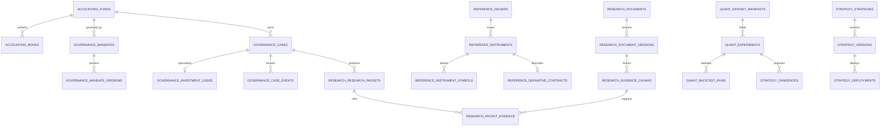
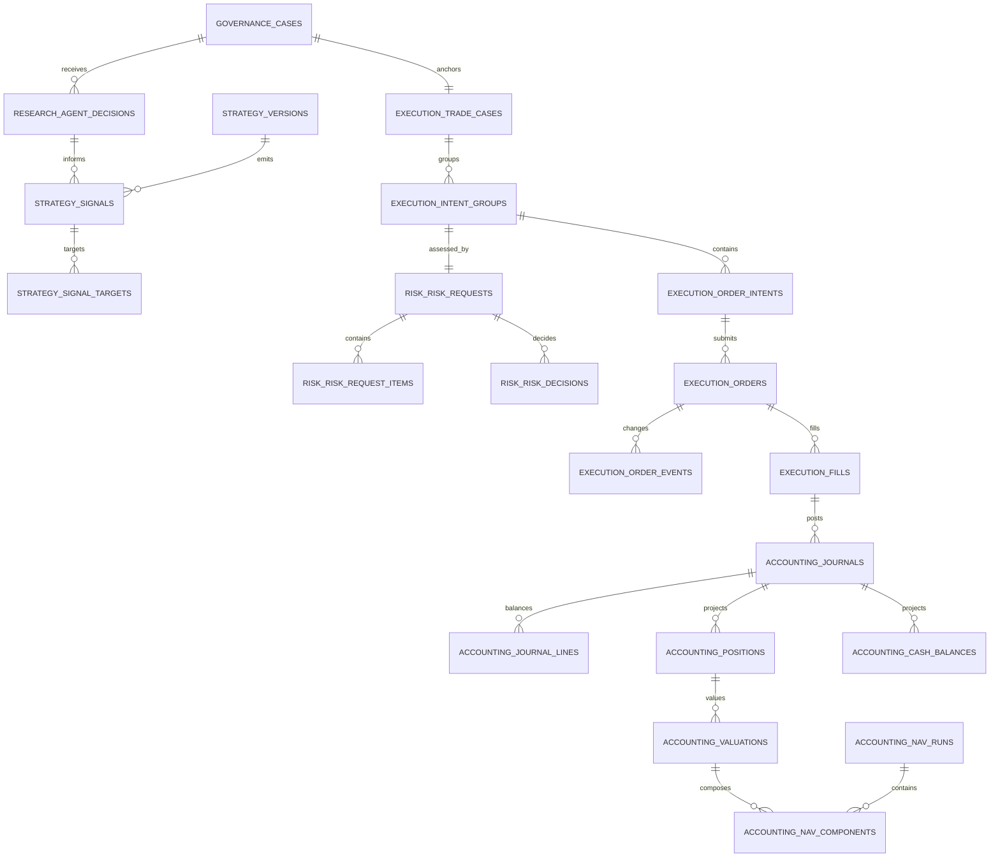
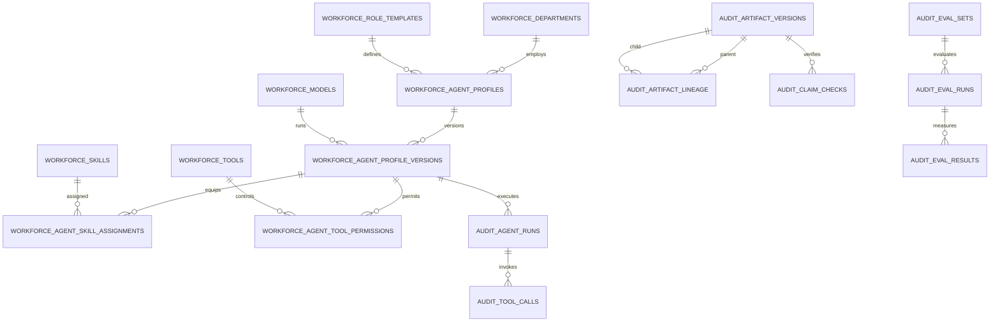
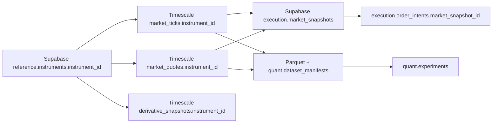

# Database ERD

> 전체 145개 Table을 한 그림에 넣지 않고 Domain Root와 실제 투자·주문 흐름을 중심으로 표시한다.

## 1. Domain 관계

## 2. 투자 판단부터 회계까지

`execution.fills -> accounting.journals`는 직접 FK가 아니라 `journals.event_type + source_event_id`의 멱등 계약으로 연결한다. Broker/회계 Event는 재처리될 수 있으므로 물리 FK보다 Event Identity를 기준으로 한다.

## 3. Agent와 감사

## 4. Cross-DB 연결

Cross-DB Pointer는 실제 Row를 복제하지 않는다. Supabase에는 주문·판단 당시의 작은 Evidence Snapshot과 Timescale/Parquet Source Reference만 고정한다.
