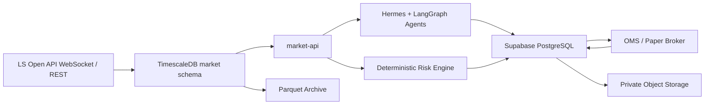

# Database Schema Foundation

> 개인형 멀티 에이전트 헤지펀드의 전체 데이터 구조 기준선. Supabase 운영 원장과 TimescaleDB 시장 데이터 Plane을 물리적으로 분리한다.
> 저장소 경계: [Department-Oriented Repository Structure](../02-engineering/REPOSITORY_DEPARTMENT_STRUCTURE.md)
> Frontend 조회 경계: [AI Office Frontend Plan](../02-engineering/AI_OFFICE_FRONTEND_PLAN.md)

## 1. 이 구조가 해결하는 것

이 프로젝트는 하나의 Agent가 분석부터 주문까지 모두 수행하지 않는다. Research, Strategy, Trading, Risk, Accounting, Audit와 Workforce가 서로 다른 책임을 가지므로 DB도 같은 경계를 가져야 한다.

이 Schema의 목적은 다음 질문에 일관되게 답하는 것이다.

- 당시 어떤 데이터와 문서를 보고 판단했는가
- 누가 어떤 Agent Profile과 Model Version으로 판단했는가
- 어떤 Strategy Version이 Signal과 주문 후보를 만들었는가
- Risk가 어떤 규칙과 Snapshot으로 승인·축소·거절했는가
- Broker 주문과 Fill이 Position, Cash, PnL과 NAV에 어떻게 반영됐는가
- 전체 과정을 하나의 `trace_id`와 `case_id`로 재현할 수 있는가

## 2. 저장소 분리



| 저장소 | 저장 내용 | 직접 접근 주체 |
|---|---|---|
| Supabase PostgreSQL | 사용자, Agent, RAG Metadata, Strategy, Risk, 주문, 원장, 감사 | Domain Service와 제한된 API |
| Supabase pgvector | 권한이 확인된 문서 Chunk Embedding | Research/RAG Service |
| 별도 TimescaleDB | Tick, 10단계 호가, Bar, Feature, 파생 Snapshot, DQ | Collector, Research, Quant |
| Object Storage | 원문, Parquet, Dataset, Model과 Report Binary | 승인된 Service Identity |

Supabase와 TimescaleDB 사이에는 Foreign Key를 만들 수 없다. 두 DB는 영구 `instrument_id`, `event_time`, `observed_at`, `source_event_id`, `dataset_id`와 `trace_id`로 Application 계층에서 연결한다. 다른 본부는 TimescaleDB Credential 없이 `market-api`를 사용한다.

## 3. Supabase Schema 지도

초기 Migration은 10개 내부 업무 Schema, 145개 Table과 제한된 `api` View/RPC를 만든다.

| Schema | Table | 책임 | 대표 Root |
|---|---:|---|---|
| `governance` | 20 | 사용자 Mandate, 전사 Case, 위원회, 승인, 자본 | `cases`, `mandates` |
| `workforce` | 16 | Agent 조직, Profile Version, Skill, Tool 권한, 채용·평가 | `agent_profiles` |
| `reference` | 9 | 종목, Symbol, 발행사, 파생 계약, 거래일, Source | `instruments` |
| `research` | 14 | 뉴스·공시 중복 제거, Version, PIT RAG, Research Packet | `documents`, `research_packets` |
| `quant` | 12 | Universe, Feature, Dataset, 실험, Backtest와 Model Artifact | `dataset_manifests`, `experiments` |
| `strategy` | 9 | Strategy Registry, Capability Gate, Version, 배포, Signal | `strategies`, `versions` |
| `execution` | 12 | Trade Case, Intent Group, OrderIntent, OMS, Fill과 TCA | `intent_groups`, `orders` |
| `risk` | 16 | Policy, Limit, Pre-trade Decision, Exposure, Stress, Kill Switch | `risk_requests`, `risk_decisions` |
| `accounting` | 18 | Fund, Book, 이중분개, Position, Cash, PnL, NAV, 대사 | `journals`, `positions` |
| `audit` | 19 | Trace, Artifact Lineage, Agent/Tool 실행, Eval, Finding, Incident | `traces`, `artifact_versions` |

`api`는 내부 Table을 복제하지 않는다. RLS가 적용되는 읽기 전용 View와 제한된 RPC만 제공한다.

## 4. 핵심 거래 계보

```text
governance.cases
  -> research.research_packets
  -> research.agent_decisions
  -> strategy.signals + strategy.signal_targets
  -> execution.intent_groups + execution.order_intents
  -> risk.risk_requests + risk.risk_decisions
  -> execution.orders + execution.order_events + execution.fills
  -> accounting.journals + accounting.journal_lines
  -> accounting.positions + accounting.cash_balances
  -> accounting.valuations + accounting.pnl_snapshots + accounting.nav_runs
  -> strategy.evaluations
```

Agent Decision, Signal, OrderIntent, Risk Decision, Broker Order와 Fill은 서로 다른 객체다. Agent는 Broker Order나 원장 Row를 직접 만들지 않는다.

## 5. 중요한 불변식

### 주문과 위험

- `OrderIntent`는 동일 `intent_group_id` 안에서 `leg_index`가 중복될 수 없다.
- 같은 `idempotency_key`로 두 번 주문 후보를 만들 수 없다.
- Risk 승인은 Broker 주문 상태가 아니라 제출 전제조건이다.
- `filled_quantity`는 `requested_quantity`를 초과할 수 없다.
- 허용되지 않은 OMS 상태 전이는 DB Trigger가 거부한다.
- `UNKNOWN`은 성공 상태가 아니며 Reconciliation 전까지 신규 주문을 차단한다.

### 회계

- `POSTED` Journal은 최소 두 Line과 Base Currency 기준 차변·대변 균형이 필요하다.
- Posted Journal Line은 수정·삭제할 수 없다.
- 오류는 기존 Journal 수정이 아니라 Reversal Journal로 정정한다.
- Position과 Cash는 Journal에서 재구축 가능한 Projection이다.

### 데이터와 Agent

- 문서 수정은 `document_versions`에 추가하며 기존 Version을 덮어쓰지 않는다.
- RAG 검색은 `published_at`과 `observed_at`이 판단 시각 이전인 Chunk만 사용한다.
- `evidence_chunks.embedding`은 초기 기준인 1,536차원이다. Embedding Model을 바꾸면 차원·재색인·Dual-read 계획을 ADR과 Migration으로 먼저 승인한다.
- Agent Prompt, Model, Skill과 Tool 권한 변경은 새 `agent_profile_versions`를 만든다.
- Raw Case, Order, Fill, Tool Call과 상태 Event는 Append-only다.

## 6. Migration 구조

### Migration 권위와 Prototype 경계

운영 DB의 통합 기준은 `supabase/migrations/`, 시장 시계열 기준은 `timescaledb/migrations/`다. 루트 `db/001_execution.sql`부터 `db/004_seed.sql`까지는 통합 Schema 이전에 작성된 D0-D2 거래·회계 Prototype이다.

`db/`와 `supabase/migrations/`는 같은 빈 Database에 함께 적용하지 않는다. 두 계열은 `Fund`, `Book`, `Order`, `Ledger Account` 등 같은 개념을 서로 다른 Schema와 계약으로 표현하므로 적용 순서를 바꾸거나 둘을 합쳐 실행해도 통합 Migration이 되지 않는다.

Prototype의 OMS·Ledger 기능을 통합 기준으로 옮길 때는 다음을 포함한 별도 Migration PR이 필요하다.

1. Table·Column·Constraint·Trigger와 Service Role의 Schema Diff
2. Prototype 데이터가 존재할 경우 변환과 Reconciliation 계획
3. Supabase RLS와 `api` View/RPC 권한 검증
4. OMS Replay, 이중분개, Posted Journal 불변성과 RLS Runtime Test
5. `db/` Archive 또는 제거 시점과 이전 CLI 호환 계획

### Supabase

| 순서 | 파일 | 내용 |
|---:|---|---|
| 1 | `20260729000100_foundation_reference.sql` | Extension, Schema, 사용자/Fund 경계, Instrument Master |
| 2 | `20260729000200_governance_workforce.sql` | Mandate, Case, 위원회, Agent 조직과 권한 |
| 3 | `20260729000300_research_quant_strategy.sql` | 수집·RAG, Dataset, Backtest, Strategy와 Signal |
| 4 | `20260729000400_execution_risk_accounting.sql` | OMS, Risk Gate, 이중분개, Position, NAV와 대사 |
| 5 | `20260729000500_audit_api_security.sql` | Audit, Lineage, Eval, RLS, Read View와 RPC |

Migration은 파일명 순서대로 한 번만 적용한다. 적용 후 기존 Migration을 수정하지 않고 새 Timestamp Migration을 추가한다.

### TimescaleDB

`timescaledb/migrations/001_initial_market_data.sql`은 다음을 만든다.

- `market_ticks`, `market_quotes`, `market_bars`
- `microstructure_features`, `market_breadth`
- 선물·옵션 `derivative_snapshots`
- `data_quality_windows`, `feed_gaps`, `ingestion_watermarks`
- `archive_exports`, `retention_registry`
- 1분 Continuous Aggregate와 압축 정책

Retention 삭제 정책은 기본적으로 비활성화되어 있다. `archive_exports`에서 `exported`, `verified`, `manifest_signed`가 모두 확인된 뒤 별도 승인 Migration으로 활성화한다.

## 7. 적용 방법

### Supabase

Supabase CLI가 연결된 환경에서 저장소 Root 기준으로 실행한다.

```bash
supabase db reset
```

원격 Project에는 Review와 Backup 확인 후 적용한다.

```bash
supabase db push
```

Frontend는 Supabase Auth로 사용자 Identity를 얻고 FastAPI BFF가 권한에 맞게 조합한 `api` Read Model을 조회한다. Browser에 내부 Domain Schema와 금융 상태 쓰기 권한을 직접 노출하지 않는다. `service_role` Key는 Backend Secret Manager에만 두며 Browser, Agent Prompt, Log와 Dataset에 넣지 않는다. 현재 `ai-office`의 Drizzle/D1 Schema는 금융 Source of Truth가 아니다.

### TimescaleDB

연결 대상이 별도 TimescaleDB인지 먼저 확인한 뒤 실행한다.

```bash
psql "$TIMESCALE_DATABASE_URL" -v ON_ERROR_STOP=1 \
  -f timescaledb/migrations/001_initial_market_data.sql
```

Market Writer와 Reader Role은 Infrastructure/IAM에서 생성한다. Migration은 해당 Role이 존재할 때만 권한을 부여한다.

## 8. P0 활성화 범위

전체 구조를 한 번에 설계했지만 첫 구현에서 사용하는 핵심 Table은 다음으로 제한한다.

| 단계 | 우선 Table |
|---|---|
| Instrument와 시세 | `reference.instruments`, `instrument_symbols`, Timescale Tick/Quote/Bar |
| 뉴스와 RAG | `research.documents`, `document_versions`, `evidence_chunks`, `story_clusters` |
| 투자 판단 | `governance.cases`, `case_events`, `research_packets`, `agent_decisions` |
| 전략 | `strategy.strategies`, `versions`, `signals`, `signal_targets` |
| 거래·위험 | `intent_groups`, `order_intents`, `risk_requests`, `risk_decisions`, `orders`, `fills` |
| 회계 | `journals`, `journal_lines`, `positions`, `cash_balances`, `pnl_snapshots` |
| 감사 | `audit.traces`, `artifact_versions`, `agent_runs`, `tool_calls` |

Stress, NAV 공식 승인, 조직 채용, Incident와 Live Deployment Table은 같은 계약을 유지하되 해당 기능 Sprint에서 활성화한다.

## 9. 변경 규칙

1. DB Schema 변경은 Migration, 계약 Test와 영향 문서를 같은 PR에서 수정한다.
2. `instrument_id`, `case_id`, `trace_id`, `strategy_version_id` 의미를 서비스별로 재정의하지 않는다.
3. 금액·가격·수량은 Float가 아닌 `numeric`을 사용한다.
4. 시간은 UTC `timestamptz`로 저장하고 표시 계층에서 Timezone을 변환한다.
5. JSONB는 확장 Payload에 사용하되 검색·FK·불변식에 필요한 값은 정규 Column으로 둔다.
6. Agent가 직접 Internal Schema를 조회·수정하지 않고 Tool/API 계약을 사용한다.
7. TimescaleDB와 Supabase를 실시간 Cross-DB Join하지 않는다.
8. Production 적용 전 RLS, Backup, Restore, PIT, OMS와 Journal Test를 통과한다.

상세 관계는 [ERD](ERD.md), 자동 검증 범위는 `tests/schema/test_schema_contract.py`를 참고한다.
