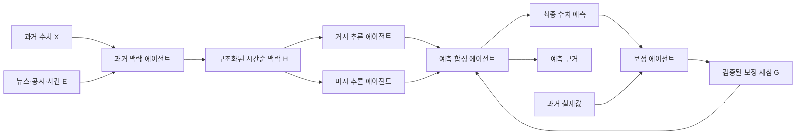
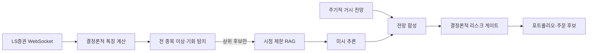

# Nexus 프레임워크 해설

> 대상 논문: *Nexus: An Agentic Framework for Time Series Forecasting*  
> 함께 볼 문서: [한국어 전체 번역](./NEXUS_PAPER_KO_TRANSLATION.md)  
> 이 문서는 논문의 구조를 쉽게 설명하고, 멀티 에이전트 헤지펀드 프로젝트에 적용할 때의 확장 방향을 구분해 제시한다.

## 1. 한 문장으로 설명하면

**Nexus는 수치와 뉴스를 한 LLM에게 한꺼번에 넣어 가격을 맞히게 하는 대신, 과거 정리·큰 흐름·단기 사건·최종 조정·오차 복기의 역할을 여러 에이전트에게 나누는 시계열 예측 프레임워크다.**

핵심은 모델 수가 아니라 **판단 단계를 분리한 것**이다.

- 과거 수치와 사건을 정리하는 직원
- 전체 추세와 시장 국면을 보는 직원
- 다음 시점의 구체적인 촉매를 보는 직원
- 두 의견을 최종 수치로 합치는 직원
- 과거 오판을 분석해 다음 판단 규칙을 고치는 직원

이 다섯 역할이 하나의 예측 프로세스를 구성한다.

## 2. 왜 이런 구조가 필요한가

시계열 수치 모델과 LLM은 서로 다른 장단점을 가진다.

| 방식 | 잘하는 일 | 약한 일 |
|---|---|---|
| TSFM·통계 모델 | 추세, 계절성, 반복 패턴, 수치 일관성 | 뉴스, 정책, 실적 발표처럼 텍스트로 나타나는 사건 해석 |
| LLM | 뉴스·보고서 해석, 사건 간 관계 설명, 가설 생성 | 긴 수치열의 정밀한 패턴 인식, 수치 크기 보정 |
| 단일 CoT 프롬프트 | 빠른 프로토타입, 간단한 설명 | 긴 입력에서 정보 누락, 거시·미시 관점 혼동, 설명과 숫자의 불일치 |

예를 들어 주가가 장기적으로 상승 중이어도 다음 주에 실적 발표가 있다면 단기 변동은 장기 추세와 다르게 움직일 수 있다. 하나의 프롬프트는 이 두 시간축을 동시에 다루다가 어느 한쪽에 과도하게 끌리기 쉽다. Nexus는 이를 **거시 해상도와 미시 해상도로 분리한 뒤 다시 합성**한다.

## 3. 전체 구조



논문은 이 흐름을 세 단계로 묶는다.

1. **맥락 구조화:** 원시 수치와 텍스트를 시간순 인과 타임라인으로 정리한다.
2. **이중 해상도 전망:** 거시 전망과 미시 전망을 서로 독립적으로 만든다.
3. **합성 및 보정:** 두 전망을 최종 예측으로 합치고 과거 오차로 판단 규칙을 개선한다.

## 4. 에이전트별 역할

### 4.1. 과거 맥락 에이전트

이 에이전트는 예측자가 아니라 **자료 정리 담당자**다.

입력:

- 날짜별 목표 수치
- 같은 시점의 뉴스, 보고서, 거시경제 요약
- 추세, 변동성 등 기본 시계열 특징

처리:

- 중복되고 중요하지 않은 문장을 줄인다.
- 사건을 발생 시점에 맞춰 정렬한다.
- 값의 변화와 관련된 핵심 요인을 연결한다.
- 후속 에이전트가 사용할 수 있는 일정한 형식으로 바꾼다.

출력 예시:

```text
Date: 2026-07-24
Value: 71,200
Textual Content:
- 2분기 영업이익이 시장 예상치를 8% 상회
- 외국인 순매수가 3거래일 연속 증가
- 같은 날 반도체 업종 지수는 1.7% 상승
```

이 단계가 중요한 이유는 RAG 검색 결과, 가격 데이터, 공시 문장을 그대로 LLM에 넣으면 긴 맥락에서 핵심 시점이 뒤섞이기 때문이다. Nexus는 먼저 **검색 결과를 예측용 증거 묶음으로 정규화**한다.

### 4.2. 거시 추론 에이전트

이 에이전트는 전체 예측 구간을 하나의 큰 흐름으로 본다.

주요 질문:

- 현재 추세는 상승, 하락, 횡보 중 무엇인가?
- 변동성 국면은 확대 또는 축소 중인가?
- 계절성과 경기 국면은 어느 방향인가?
- 예측 구간 전체의 기본 경로는 무엇인가?

출력:

- 전체 기간의 수치 궤적
- 시장 국면 설명
- 장기 방향을 지지하거나 무너뜨릴 조건

거시 에이전트는 “다음 주 하루”보다 “앞으로 13주가 어떤 체제에 놓여 있는가”를 설명하는 역할이다.

### 4.3. 미시 추론 에이전트

이 에이전트는 예측 구간을 한 시점씩 이동하며 사건을 반영한다.

주요 질문:

- 다음 시점 전에 예정된 실적·공시·정책 일정은 무엇인가?
- 최근 뉴스가 가격에 아직 반영되지 않았는가?
- 단기 모멘텀과 국소 변동성은 어느 방향인가?
- 각 시점의 상승·하락·안정 판단과 예상값은 무엇인가?

출력은 시점별 구조화 JSON으로 만들 수 있다.

```json
{
  "date": "2026-08-07",
  "movement_label": "Up",
  "key_drivers": ["실적 상향", "외국인 순매수 증가"],
  "adjusted_forecast_value": 73500
}
```

미시 에이전트는 단기 촉매에 민감하지만, 사건 하나를 지나치게 크게 해석할 수 있다. 그래서 이 결과를 바로 최종 예측으로 사용하지 않고 거시 전망과 합성한다.

### 4.4. 예측 합성 에이전트

합성 에이전트는 **두 전망 중 하나를 고르는 투표기**가 아니다. 다음 자료를 함께 보고 최종 수치와 근거를 다시 만든다.

- 구조화된 과거 맥락
- 거시 예측값과 거시 근거
- 미시 예측값과 시점별 촉매
- 과거 백테스트에서 검증된 보정 지침

예를 들어 거시 전망은 완만한 상승, 미시 전망은 실적 발표 직후 급등을 예상할 수 있다. 합성 에이전트는 과거에 이 종목의 실적 충격을 얼마나 과대평가했는지 보정 지침에서 확인하고, 급등 폭은 낮추되 상승 방향은 유지할 수 있다.

최종 출력에는 최소한 다음이 필요하다.

| 필드 | 의미 |
|---|---|
| `forecast_values` | 시점별 최종 예측값 |
| `reasoning_summary` | 거시·미시 관점을 어떻게 반영했는지 |
| `key_drivers` | 예측을 움직인 핵심 증거 |
| `invalidating_conditions` | 예측이 무효가 되는 조건 |
| `evidence_ids` | 사용한 뉴스·공시·데이터의 식별자 |

마지막 두 필드는 논문 원형에는 필수가 아니지만, 실제 투자 서비스의 감사 가능성을 위해 추가하는 편이 좋다.

### 4.5. 보정 에이전트

보정 에이전트는 모델 파라미터를 재학습하지 않는다. 과거 오차를 읽고 **다음 예측에 적용할 운영 지침**을 만든다.

예시:

```text
진단:
실적 호재의 방향은 맞혔지만 예상 상승 폭을 반복적으로 약 2배 크게 잡았다.

검토 지침:
이 종목의 실적 발표 주간 예측에서는 최근 8개 분기의 실제 갭 변동 분포를 기준으로
사건 충격 크기를 제한하고, 이미 컨센서스에 반영된 정보는 추가 촉매로 중복 계산하지 않는다.
```

이 구조는 프롬프트 메모리 또는 정책 메모리에 가깝다. 즉, **파인튜닝 기반 학습이 아니라 검증된 규칙의 누적**이다.

## 5. 보정 루프의 실제 동작

보정은 아무 비평이나 메모리에 추가하는 방식이 아니다.

1. 과거 데이터를 시간순으로 6개 구간으로 나눈다.
2. 앞선 5개 구간에서 당시 알 수 있었던 데이터만 사용해 예측한다.
3. 각 예측과 나중에 확인된 실제값을 비교한다.
4. 보정 에이전트가 반복 오차와 잘못된 수치화 방식을 규칙으로 만든다.
5. 한 구간에서만 나타난 규칙은 제거하고 여러 구간에서 공통된 규칙을 남긴다.
6. 마지막 숨겨진 검증 구간에서 규칙 적용 전후 성능을 비교한다.
7. 최소 5% 이상 개선할 때만 운영 지침으로 승격한다.

이 방식의 핵심은 다음과 같다.

- 미래 정보를 과거 예측에 섞지 않는다.
- 한 번의 우연한 성공을 학습으로 착각하지 않는다.
- 설명이 그럴듯하더라도 수치 성능을 악화시키면 지침을 폐기한다.
- 도메인마다 다른 오차 습관을 별도의 지침으로 관리한다.

## 6. 간단한 주식 예시

가정:

- 최근 1년 주가는 완만한 상승 추세다.
- 다음 주 실적 발표가 예정되어 있다.
- 매출 전망은 긍정적이지만 이미 주가가 크게 올랐다.

각 에이전트의 판단은 다음처럼 나뉜다.

| 에이전트 | 판단 |
|---|---|
| 과거 맥락 | 최근 상승, 실적 기대, 높은 밸류에이션, 과거 실적일 변동을 시간순으로 정리 |
| 거시 추론 | 중기 상승 국면은 유지되지만 상승 속도는 둔화될 가능성 |
| 미시 추론 | 실적 상회 시 단기 상승, 기대 미달 시 큰 조정 가능성 |
| 보정 | 이 종목에서 LLM이 실적 호재 크기를 과대평가한 이력이 있으므로 충격 폭 제한 |
| 합성 | 기본 경로는 완만한 상승으로 두고 실적 주간 변동 폭을 보수적으로 반영 |

단일 프롬프트가 “실적 호재이므로 상승”이라고 끝낼 수 있는 문제를, Nexus는 **추세·사건·과거 오판 습관**으로 분해한다.

## 7. 논문의 실험 결과가 말하는 것

논문 결과에서 읽어야 할 핵심은 “LLM이 항상 TSFM보다 우수하다”가 아니다.

- Nexus는 CoT 기준 모델보다 대부분 정확했다.
- Zillow처럼 계절성이 강한 데이터에서 단일 LLM 프롬프트의 성능 붕괴를 크게 줄였다.
- 수치만 사용한 조건에서도 일부 설정에서 TimesFM과 대등하거나 더 나았다.
- 거시, 미시, 보정 중 하나를 제거하면 성능이 모두 나빠졌다.
- LLM 심사에서는 사건 관련성, 논리-수치 일관성, 분석 깊이에서 Nexus가 선호되었다.

따라서 논문이 강하게 뒷받침하는 주장은 **역할 분해와 보정이 단일 프롬프트보다 낫다**는 것이다. 모든 자산과 모든 빈도에서 LLM이 전용 수치 모델을 대체할 수 있다는 결론까지 확장해서는 안 된다.

## 8. 강점과 한계

### 강점

- 수치와 텍스트를 하나의 예측 과정에서 함께 사용한다.
- 거시와 미시 시간축을 분리하여 관점 충돌을 드러낸다.
- 최종 숫자와 설명을 함께 생성한다.
- 과거 오차를 검증된 지침으로 바꾸는 자기 개선 루프가 있다.
- 각 단계의 입력과 출력이 분리되어 감사와 디버깅이 쉽다.

### 한계

- 평가는 주간 데이터, 7개 종목, 15개 도시로 제한된다.
- 모든 결과가 단일 실행이므로 LLM 출력 분산을 충분히 측정하지 못했다.
- 확률 분포나 예측 구간보다 단일 경로 예측에 초점을 둔다.
- 거래비용, 슬리피지, 포지션 크기, 주문 실패, 리스크 한도를 다루지 않는다.
- 생성된 설명은 인과 추정 결과가 아니라 **증거에 기반한 예측 서사**다. “원인”이라는 표현을 통계적 인과성으로 받아들이면 안 된다.
- 보정 지침의 교집합은 안정적일 수 있지만, 새 국면에서 필요한 희귀 규칙을 제거할 수 있다.
- LLM 심사 역시 모델 편향을 완전히 제거하지 못한다.

## 9. 멀티 에이전트 헤지펀드에 대응시키기

Nexus는 완성된 트레이딩 시스템이 아니라 **예측·리서치 하위 프레임워크**다. 현재 프로젝트의 조직 구조에 대응시키면 다음과 같다.

| Nexus 역할 | 헤지펀드 디지털 트윈의 담당 |
|---|---|
| 과거 맥락 에이전트 | 리서치본부: 뉴스·공시·가격을 시점 정렬하고 RAG 증거 묶음 생성 |
| 거시 추론 에이전트 | 리서치본부 또는 전략기획위원회: 시장 국면·산업·팩터 전망 |
| 미시 추론 에이전트 | 트레이딩본부·종목 분석 에이전트: 단기 촉매와 시그널 생성 |
| 예측 합성 에이전트 | 전략기획위원회: 전망 결합, 전략 후보 생성 |
| 보정 에이전트 | 퀀트/백테스트본부: 워크포워드 검증과 보정 지침 승격 |
| 별도 추가 | 리스크본부: 한도 심사와 거부권 |
| 별도 추가 | 회계/포트폴리오본부: 자본 배분, PnL, 익스포저 관리 |
| 별도 추가 | AI QA/감사본부: 근거 추적, 환각 탐지, 재현성 감사 |
| 별도 추가 | 트레이딩본부 OMS: 주문 생성·체결·취소·재시도 |

Nexus의 “합성 에이전트”를 바로 주문 권한자로 두면 안 된다. 예측과 주문 사이에는 **전략 규칙, 포트폴리오 최적화, 리스크 승인, OMS**가 있어야 한다.

## 10. Hermes·LangGraph·RAG로 구현하는 방법

### Hermes가 맡을 부분

- 부서장 에이전트의 장기 메모리
- 도구 호출과 업무 위임
- 과거 실패와 성공 사례의 회고
- 보정 지침 후보의 생성 및 업무 기록

### LangGraph가 맡을 부분

- 단계별 상태 전이
- 거시·미시 에이전트의 병렬 실행
- 실패 재시도와 타임아웃
- 보정 지침 승인 조건
- 리스크 거부 시 종료 또는 재계산 경로
- 모든 중간 산출물의 체크포인트

### RAG가 맡을 부분

- 예측 기준 시점 이전의 뉴스·공시·리포트만 검색
- 종목, 산업, 거시경제, 이벤트 유형별 검색
- 문서 중복 제거와 원문 식별자 보존
- 최종 판단에서 사용한 근거를 다시 추적할 수 있게 제공

권장 RAG 결과 형식:

```json
{
  "evidence_id": "dart:20260803:005930",
  "event_time": "2026-08-03T08:12:00+09:00",
  "available_time": "2026-08-03T08:13:21+09:00",
  "entity_ids": ["KRX:005930"],
  "source_type": "DART_FILING",
  "summary": "2분기 영업이익 잠정치 발표",
  "source_uri": "...",
  "content_hash": "..."
}
```

`event_time`과 `available_time`을 분리해야 백테스트에서 미래 문서가 섞이는 것을 막을 수 있다.

## 11. 전 종목·실시간 WebSocket에 적용할 때

논문은 주간 배치 예측을 다룬다. 이를 전 종목 실시간 판단으로 그대로 확장해 **모든 틱마다 LLM을 호출하는 방식은 비용과 지연 때문에 적합하지 않다.** 다음과 같이 시간축을 나누는 편이 현실적이다.



권장 실행 빈도:

| 계층 | 대상 | 실행 시점 |
|---|---|---|
| 실시간 감시 | 전 종목 | 매 틱 또는 짧은 윈도에서 코드 기반으로 계산 |
| 후보 선별 | 전 종목 중 상위 후보 | 1초~1분 주기 또는 이벤트 발생 시 |
| 미시 추론 | 선별된 종목 | 중요 가격·뉴스·공시 이벤트 발생 시 |
| 거시 추론 | 시장·산업·팩터 | 장 시작 전, 장중 정기, 큰 국면 변화 시 |
| 합성 | 거래 후보 | 미시 전망 갱신 또는 거시 국면 변경 시 |
| 리스크 심사 | 모든 주문 후보 | 주문 전 동기식으로 항상 실행 |
| 보정 | 전략·종목군 | 장 마감 후 또는 주기적 워크포워드 작업 |

즉 **Universe 전체는 저비용 수치 엔진이 감시하고, LLM 에이전트는 정보 가치가 높은 후보에 집중**한다. 이것이 Nexus의 역할 분해를 실시간 서비스에 맞게 확장하는 방법이다.

## 12. 논문보다 강화해야 할 운영 구조

실제 서비스에서는 Nexus 원형에 다음 구성요소를 추가하는 것이 좋다. 아래 내용은 논문의 실험 결과가 아니라 프로젝트 적용을 위한 제안이다.

1. **수치 앵커:** TimesFM, Chronos 또는 기존 퀀트 모델의 예측을 별도 입력으로 사용한다.
2. **불확실성:** 단일 값 대신 분위수, 신뢰 구간, 상승 확률을 출력한다.
3. **근거 강제:** 모든 사건 판단에 `evidence_id`를 붙이고 근거 없는 문장은 거래 근거에서 제외한다.
4. **시점 일관성:** 수집 시각 기준으로 point-in-time 데이터셋을 만들어 미래 정보 누출을 막는다.
5. **리스크 거부권:** LLM과 독립된 코드 규칙으로 최대 손실, 익스포저, 유동성, 주문 크기를 제한한다.
6. **챔피언-챌린저:** 운영 전략과 신규 전략을 병렬 평가하고 통계 기준을 통과한 전략만 승격한다.
7. **드리프트 감지:** 데이터 분포, 예측 오차, 근거 품질이 변하면 지침을 자동 중단한다.
8. **실행 감사:** 입력 데이터 버전, 프롬프트, 모델, 출력, 승인, 주문을 하나의 추적 ID로 연결한다.

## 13. 구현 최소 단위

첫 구현은 한 종목·주간 예측으로 시작해도 Nexus의 핵심을 검증할 수 있다.

1. 가격 52주와 같은 기간의 뉴스·공시를 준비한다.
2. 과거 맥락 에이전트가 시간순 증거 타임라인을 만든다.
3. 거시·미시 에이전트를 병렬 실행한다.
4. 합성 에이전트가 6개 시점의 예측과 근거를 만든다.
5. 과거 6개 순차 구간에서 워크포워드 백테스트를 수행한다.
6. 검증 구간에서 5% 이상 개선한 보정 지침만 저장한다.
7. 모든 출력에 데이터 기준 시각, 근거 ID, 모델 버전을 남긴다.

그다음 종목 수를 늘리고, 전 종목 감시 계층과 실시간 이벤트 트리거를 추가하면 된다.

## 14. 최종 해석

Nexus의 가장 중요한 아이디어는 “LLM에게 시계열을 잘 예측하게 만드는 특별한 문장”이 아니다. **예측 업무를 조직처럼 나누고, 서로 다른 시간축의 의견을 보존한 채, 과거 오차로 합성 규칙을 검증하며 개선하는 구조**다.

현재 프로젝트에는 이 구조를 리서치본부·전략기획위원회·퀀트/백테스트본부 사이의 계약으로 적용할 수 있다. 다만 Nexus는 예측까지만 책임진다. 실제 헤지펀드를 모방하려면 그 뒤에 리스크 승인, 자본 배분, 주문 집행, 회계, AI 감사가 독립적으로 이어져야 한다.

